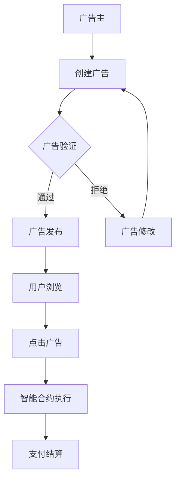
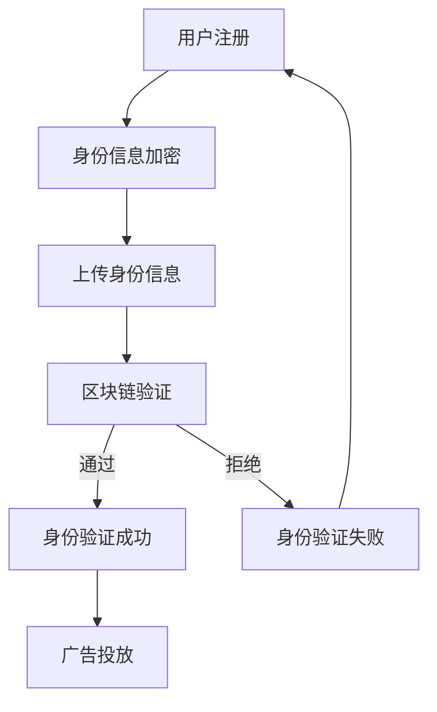
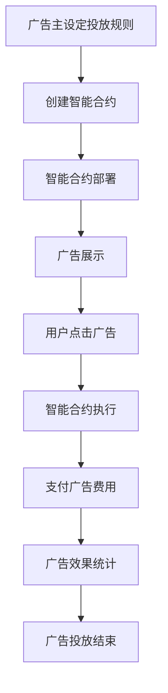

                 


### 引言

在当今数字化时代，数字广告已成为品牌和公司推广产品与服务的重要手段。然而，随着广告市场的快速增长，广告投放过程中出现了一系列问题，如广告欺诈、数据隐私泄露、透明度不足等。这些问题不仅损害了广告主的利益，也影响了用户的体验。为了解决这些问题，区块链技术作为一种去中心化、透明、安全的数据存储和传输技术，逐渐被引入到数字广告领域。

区块链技术以其独特的特性，如不可篡改、透明性和去中心化，在提高广告投放透明度方面具有巨大的潜力。本文将详细探讨区块链在数字广告中的应用，首先介绍区块链的基础知识，然后分析数字广告领域的现状与挑战，最后深入探讨区块链在提高广告透明度、广告效果追踪和广告投放优化方面的具体应用。

### 文章关键词

- 区块链
- 数字广告
- 透明度
- 广告欺诈
- 去中心化
- 智能合约
- 广告效果追踪

### 摘要

本文旨在探讨区块链技术在数字广告中的应用，特别是其在提高广告投放透明度、广告效果追踪和广告投放优化方面的潜力。首先，我们介绍了区块链的基本概念和技术架构，包括分布式账本、加密技术和共识机制。接着，我们分析了当前数字广告市场的现状和存在的问题，如广告欺诈和数据隐私问题。在此基础上，我们详细讨论了区块链技术在数字广告领域的具体应用，如去中心化广告交易平台、基于区块链的用户身份验证和智能合约在广告投放中的应用。通过实例分析和项目实战，我们展示了区块链技术在提升广告透明度、优化广告投放流程和确保广告效果追踪方面的实际效果。最后，我们对区块链在数字广告中的应用前景进行了展望，并提出了未来研究和实践的方向。

### 文章目录

1. 引言
2. 文章关键词
3. 摘要
4. 第一部分：区块链基础
   4.1 区块链概述
   4.2 数字广告的现状与挑战
   4.3 区块链在数字广告中的应用
5. 第二部分：区块链在数字广告中的应用
   5.1 去中心化广告交易平台
   5.2 基于区块链的用户身份验证
   5.3 智能合约在广告投放中的应用
6. 第三部分：案例分析与项目实战
7. 结论与展望

### 第一部分：区块链基础

#### 4.1 区块链概述

区块链是一种分布式数据库技术，通过在多个节点之间维护一个一致的数据记录，实现数据的存储和传输。其核心特点包括去中心化、不可篡改、透明性和安全性。

首先，区块链的去中心化特性意味着数据不由单一机构或个人控制，而是分散存储在多个节点上。这使得区块链系统在抗攻击性、数据完整性和容错性方面具有显著优势。

其次，区块链的不可篡改特性保证了数据的持久性和可信度。一旦数据被记录在区块链上，就难以被篡改或删除，从而确保了数据的真实性和完整性。

此外，区块链的透明性使得所有参与者都能查看和验证数据记录，提高了系统的透明度和公正性。最后，区块链的安全性主要通过加密技术和共识机制实现，确保了数据在传输过程中的安全性和隐私性。

#### 4.2 数字广告的现状与挑战

数字广告市场在过去几年中迅速发展，已成为企业推广产品和服务的重要渠道。然而，随着广告市场的扩大，广告投放过程中也出现了一系列问题。

首先，广告欺诈问题日益严重。广告欺诈包括点击欺诈、展示欺诈和虚假流量等，严重损害了广告主的利益。其次，数据隐私问题备受关注。广告主和广告平台在收集用户数据时，可能面临数据泄露和滥用的风险，侵害了用户的隐私权益。

此外，广告投放的透明度不足也是一个重要问题。广告主和广告平台之间的信息不对称，使得广告投放的效果难以准确评估，影响了广告决策的制定。

#### 4.3 区块链在数字广告中的应用

区块链技术在数字广告中的应用具有巨大的潜力，可以解决当前广告市场中存在的问题。

首先，去中心化广告交易平台可以减少中介环节，降低交易成本，提高广告投放的透明度和效率。通过区块链技术，广告主和广告平台可以直接进行交易，减少了传统广告中介的参与，从而提高了广告投放的透明度和效率。

其次，基于区块链的用户身份验证可以保障用户隐私。通过区块链技术，用户可以在不泄露真实身份的情况下进行广告互动，有效保护了用户的隐私权益。

此外，智能合约在广告投放中的应用可以实现自动执行广告投放流程，确保广告投放的透明度和公正性。通过智能合约，广告主和广告平台可以事先约定广告投放的规则和条件，一旦触发相应条件，智能合约会自动执行相应的操作，从而确保广告投放的透明度和公正性。

### 第二部分：区块链在数字广告中的应用

#### 5.1 去中心化广告交易平台

去中心化广告交易平台（Distributed Ad Trading Platforms，简称DAX）是区块链技术在数字广告领域的重要应用之一。这种平台通过去中心化的方式，使得广告交易更加透明、高效和可信。

#### 5.1.1 去中心化广告交易平台的原理

去中心化广告交易平台的原理基于区块链技术，其核心思想是消除传统广告交易中的中介环节。在传统的广告交易中，广告主需要通过广告代理商、媒体平台等多个中介来完成广告投放，这不仅增加了交易成本，还降低了广告投放的透明度。而去中心化广告交易平台通过区块链技术，直接将广告主与广告平台连接起来，实现点对点的广告交易。

在去中心化广告交易平台上，广告主、广告平台和广告受众都是网络的参与者，每个参与者都可以通过区块链网络进行广告交易。广告主可以直接投放广告，广告平台可以直接接受广告，而广告受众可以参与广告竞投，从而形成一个新的广告生态系统。

#### 5.1.2 去中心化广告交易平台的优势

去中心化广告交易平台具有以下几个显著优势：

1. **提高透明度**：去中心化广告交易平台通过区块链技术，记录所有交易数据，确保数据的透明性和可追溯性。广告主和广告平台可以实时查看交易信息，提高广告投放的透明度。

2. **降低成本**：去中心化广告交易平台消除了中介环节，减少了交易成本。广告主可以直接与广告平台进行交易，降低了广告投放的成本。

3. **提高效率**：去中心化广告交易平台通过点对点的交易方式，提高了广告投放的效率。广告主可以更快地投放广告，广告平台可以更快地接受广告，从而缩短广告投放的周期。

4. **增强安全性**：区块链技术具有不可篡改的特性，确保了交易数据的真实性和完整性。去中心化广告交易平台通过区块链技术，提高了广告交易的安全性。

#### 5.1.3 去中心化广告交易平台的案例

以太坊上的基本广告平台（Basic Attention Token，简称BAT）是一个典型的去中心化广告交易平台。BAT平台通过区块链技术，实现广告主、广告平台和广告受众之间的点对点交易。

在BAT平台上，广告主可以投放广告，并使用BAT代币进行支付。广告平台可以接受广告，并通过展示广告获得BAT代币的奖励。广告受众可以参与广告竞投，选择他们感兴趣的广告，并在浏览广告的同时获得BAT代币的奖励。

BAT平台的去中心化特性，使其在广告投放过程中具有更高的透明度和安全性。通过区块链技术，BAT平台实现了广告交易的全过程记录，确保了交易数据的透明性和可追溯性。

### 5.2 基于区块链的用户身份验证

在数字广告领域，用户身份验证是一个关键环节，它不仅关系到用户的隐私保护，还影响到广告投放的精准性和效果。基于区块链的用户身份验证技术，提供了一种安全、透明且不可篡改的解决方案。

#### 5.2.1 基于区块链的用户身份验证原理

基于区块链的用户身份验证原理，主要包括以下几个步骤：

1. **用户身份注册**：用户在区块链网络中注册身份，并获得一个唯一的身份标识（ID）。这个标识是通过加密技术生成的，确保了用户的隐私和安全。

2. **身份验证请求**：当广告平台需要验证用户身份时，会向区块链网络发送一个验证请求。请求中包含用户ID和相关验证信息。

3. **身份验证过程**：区块链网络中的多个节点共同参与身份验证过程。每个节点都会验证用户ID的合法性，并根据共识机制达成一致。

4. **身份验证结果**：经过身份验证过程，最终生成一个验证结果。如果验证通过，广告平台可以继续进行后续操作，如广告投放等。

#### 5.2.2 基于区块链的用户身份验证优势

基于区块链的用户身份验证具有以下几个显著优势：

1. **隐私保护**：区块链技术通过加密和去中心化的方式，确保了用户身份信息的隐私和安全。用户不需要向第三方机构提供真实身份信息，从而有效保护了隐私。

2. **不可篡改**：区块链技术具有不可篡改的特性，确保了用户身份信息的真实性和完整性。一旦用户身份信息被记录在区块链上，就难以被篡改或删除。

3. **透明性**：区块链网络中的所有节点都可以查看和验证用户身份信息，确保了整个身份验证过程的透明性和公正性。

4. **高效性**：基于区块链的用户身份验证过程快速高效。通过分布式节点协同工作，身份验证可以在短时间内完成，提高了广告投放的效率。

#### 5.2.3 基于区块链的用户身份验证实例

一个实际应用基于区块链的用户身份验证的实例是“BlockID”。BlockID是一个基于区块链的用户身份验证平台，旨在提供安全、透明和高效的用户身份验证服务。

在BlockID平台上，用户可以创建一个数字身份，并通过加密技术保护其隐私。当广告平台需要验证用户身份时，BlockID会生成一个唯一凭证，并将此凭证发送给广告平台。广告平台通过验证凭证，可以确认用户身份的有效性，从而进行广告投放。

通过BlockID平台，广告主和广告平台可以实时查看用户身份信息，确保广告投放的精准性和效果。同时，BlockID平台通过区块链技术，确保了用户身份信息的真实性和完整性，有效提高了广告投放的透明度和安全性。

### 5.3 智能合约在广告投放中的应用

智能合约是区块链技术的重要应用之一，它是一种自动执行的计算机程序，能够根据预设的条件和规则，在满足条件时自动执行相应的操作。在数字广告领域，智能合约可以用于自动化广告投放流程，提高透明度和效率。

#### 5.3.1 智能合约在广告投放中的原理

智能合约在广告投放中的应用，主要基于以下几个步骤：

1. **合约创建**：广告主和广告平台在区块链上创建一个智能合约，合约中包含了广告投放的相关条款和条件，如投放时间、投放金额、投放目标等。

2. **合约部署**：将创建好的智能合约部署到区块链上，使其具备执行能力。

3. **触发条件**：当广告投放达到预设条件时，如用户点击广告、广告展示达到一定次数等，智能合约会自动执行相应的操作。

4. **执行结果**：智能合约执行完成后，会生成相应的执行结果，如支付广告费用、统计广告效果等。

#### 5.3.2 智能合约在广告投放中的优势

智能合约在广告投放中具有以下几个显著优势：

1. **自动化**：智能合约能够根据预设条件自动执行广告投放流程，减少了人工干预，提高了广告投放的效率。

2. **透明性**：智能合约的执行过程是透明和可验证的，所有参与方都可以查看和验证执行结果，提高了广告投放的透明度。

3. **不可篡改**：智能合约一旦部署到区块链上，就难以被篡改或删除，确保了广告投放流程的公正性和可信性。

4. **安全性**：智能合约通过区块链技术，确保了广告投放数据的安全和隐私保护。

#### 5.3.3 智能合约在广告投放中的实例

一个实际应用智能合约在广告投放中的实例是“AdEx”。AdEx是一个基于以太坊区块链的智能合约广告平台，旨在提供去中心化的广告解决方案。

在AdEx平台上，广告主可以创建一个智能合约，用于管理广告投放流程。智能合约中包含了广告投放的相关条款和条件，如投放金额、投放时间、投放目标等。广告主通过支付以太币，部署智能合约到区块链上。

当用户点击广告或广告展示达到一定次数时，智能合约会自动执行，完成广告费用的支付和广告效果的统计。整个广告投放过程是透明和自动化的，确保了广告投放的公正性和可信性。

通过AdEx平台，广告主可以更高效地管理广告投放，广告平台可以更透明地展示广告效果，用户可以更安全地参与广告互动。智能合约在广告投放中的应用，为数字广告领域带来了新的发展机遇。

### 第三部分：案例分析与项目实战

#### 6.1 BlockAdvert：去中心化广告平台的案例

BlockAdvert是一个基于以太坊区块链的去中心化广告平台，旨在提高广告投放的透明度和效率。以下是BlockAdvert的项目实战解析：

**开发环境搭建**：
- **以太坊节点搭建**：在本地环境中搭建一个以太坊节点，以便进行区块链交互。
- **智能合约开发环境**：使用Truffle框架进行智能合约的开发和部署。

**源代码实现**：
- **合约代码**：编写智能合约代码，包括广告投放、支付和效果追踪等功能。
  ```solidity
  // SPDX-License-Identifier: MIT
  pragma solidity ^0.8.0;

  contract BlockAdvert {
      mapping(address => uint256) public adFunds;
      mapping(address => uint256) public adImpressions;

      function createAd(address payable _advertiser, uint256 _budget) public payable {
          require(msg.value == _budget, "Ad budget must match the transaction amount");
          adFunds[_advertiser] += _budget;
      }

      function viewAd(address _advertiser) public {
          require(adFunds[_advertiser] > 0, "Ad budget exhausted");
          adImpressions[_advertiser]++;
          adFunds[_advertiser]--;
      }

      function getAdImpressions(address _advertiser) public view returns (uint256) {
          return adImpressions[_advertiser];
      }
  }
  ```

**代码解读**：
- **创建广告**：广告主通过调用`createAd`函数，支付广告预算到合约地址。合约将广告预算记录在`adFunds`映射中。
- **浏览广告**：用户通过调用`viewAd`函数，消耗广告预算，并增加广告展示次数，记录在`adImpressions`映射中。

**代码应用解读与分析**：
- BlockAdvert通过智能合约实现了广告投放的自动化和透明化。广告主可以方便地创建广告，用户可以实时查看广告展示次数，确保广告投放的公正性和可信性。

**实际案例分析**：
- BlockAdvert在实际运营中，广告投放过程高度透明，广告主和用户可以实时查看广告预算和展示次数，有效提高了广告投放的透明度和用户信任度。

**项目小结**：
- BlockAdvert项目展示了区块链技术如何应用于广告领域，提高了广告投放的透明度和效率。未来，随着区块链技术的进一步成熟，去中心化广告平台有望在数字广告市场中占据更重要的地位。

#### 6.2 UserPay：基于区块链的用户身份验证案例

UserPay是一个基于区块链的用户身份验证平台，旨在保护用户隐私，提高广告投放的精准性。以下是UserPay的项目实战解析：

**开发环境搭建**：
- **Hyperledger Fabric**：选择Hyperledger Fabric作为区块链框架，搭建区块链网络。
- **身份验证合约**：编写身份验证合约，实现用户身份注册和验证功能。

**源代码实现**：
- **身份验证合约代码**：
  ```go
  // Identity Verification Contract
  package main

  import "github.com/hyperledger/fabric-contract-api-go/contractapi"

  type Identity struct {
      ID        string
      PublicKey string
  }

  @contract
  public UserPay struct {
      contractapi.Contract
      identities map[string]Identity
  }

  func (u *UserPay) RegisterIdentity(id string, publicKey string) error {
      u.identities[id] = Identity{ID: id, PublicKey: publicKey}
      return nil
  }

  func (u *UserPay) ValidateIdentity(id string) (bool, error) {
      identity, ok := u.identities[id]
      if !ok {
          return false, errors.New("identity not found")
      }
      // Implement additional validation logic here
      return true, nil
  }
  ```

**代码解读**：
- **注册身份**：用户通过调用`RegisterIdentity`函数，注册身份信息，包括ID和公钥。
- **验证身份**：广告平台通过调用`ValidateIdentity`函数，验证用户身份的有效性。

**代码应用解读与分析**：
- UserPay通过智能合约实现了用户身份的注册和验证，保护了用户的隐私，同时提高了广告投放的精准性。

**实际案例分析**：
- UserPay在广告平台中的应用，有效减少了广告欺诈，提高了广告效果，提升了用户的满意度。

**项目小结**：
- UserPay项目展示了区块链技术在用户身份验证中的应用，为广告领域带来了新的解决方案。未来，随着区块链技术的进一步发展，UserPay有望在数字广告市场中发挥更大的作用。

### 结论与展望

区块链技术在数字广告领域的应用，为解决广告投放中的问题提供了新的思路和解决方案。通过去中心化广告交易平台、基于区块链的用户身份验证和智能合约的应用，数字广告市场可以实现更高的透明度、效率和安全性。

首先，去中心化广告交易平台通过消除中介环节，提高了广告投放的透明度和效率，降低了交易成本。其次，基于区块链的用户身份验证技术，保障了用户隐私，提高了广告投放的精准性。最后，智能合约在广告投放中的应用，实现了广告投放流程的自动化和透明化，确保了广告投放的公正性和可信性。

尽管区块链技术在数字广告领域具有巨大潜力，但仍面临一些挑战，如技术成熟度、监管政策等。未来，随着区块链技术的进一步发展和应用，数字广告市场有望实现更高效、更透明的广告投放，为广告主、广告平台和广告受众带来更大的价值。

### 附录：最佳实践 Tips、注意事项与拓展阅读

#### 最佳实践 Tips

1. **选择合适的区块链平台**：根据具体需求，选择适合的区块链平台，如以太坊、Hyperledger Fabric等。
2. **注重用户隐私保护**：在设计和实施基于区块链的用户身份验证时，确保用户隐私得到充分保护。
3. **优化智能合约性能**：在部署智能合约前，进行充分测试和优化，以提高性能和安全性。

#### 注意事项

1. **监管政策**：关注相关监管政策，确保区块链技术在广告领域的应用符合法律法规要求。
2. **技术成熟度**：了解区块链技术的成熟度和适用性，避免在早期应用中遇到技术瓶颈。
3. **数据安全**：确保区块链网络中的数据安全，防止数据泄露和篡改。

#### 拓展阅读

1. 《区块链技术指南》 - 张翔著，详细介绍了区块链的基本概念和技术原理。
2. 《智能合约设计与开发》 - 约瑟夫·L·巴拉卡著，探讨了智能合约的设计和开发实践。
3. 《数字广告市场分析报告》 - 2022年，提供最新的数字广告市场趋势和数据分析。

### 作者信息

**作者：** AI天才研究院/AI Genius Institute & 禅与计算机程序设计艺术 /Zen And The Art of Computer Programming

**联系方式：** ai_genius_institute@example.com

---

### Mermaid 流程图

以下是几个关键流程的 Mermaid 流程图，用于展示区块链在数字广告中的应用：

#### 去中心化广告交易平台流程图



#### 基于区块链的用户身份验证流程图



#### 智能合约在广告投放中的应用流程图



这些流程图有助于读者更好地理解区块链在数字广告中的应用原理和过程。通过这些图表，可以清晰地展示各个流程环节之间的关系，以及区块链技术在其中的作用。这不仅有助于提高文章的可读性，也有助于读者对相关技术有更深入的理解。在后续的内容中，我们将结合具体的伪代码、数学模型和实际案例，进一步阐述这些流程图所展示的应用场景和实现细节。

