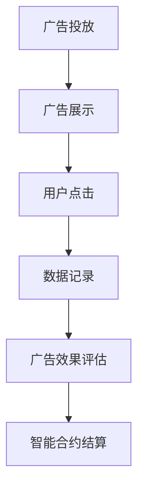

                 

## 引言

### 区块链概述

区块链是一种分布式数据库技术，通过密码学和共识算法确保数据的完整性和安全性。它由多个按时间顺序排列的区块组成，每个区块包含一定数量的交易记录，并通过加密算法与前一个区块链接，形成一条不可篡改的链。区块链的主要特点是去中心化、不可篡改、透明性和可追溯性。

去中心化意味着区块链没有中央管理节点，数据由网络中的多个节点共同维护。这种分布式结构降低了单点故障的风险，提高了系统的容错性和抗攻击能力。

不可篡改性确保一旦数据被写入区块链，将无法被篡改。通过加密算法和共识机制，区块链能够验证数据的真实性和完整性，防止恶意篡改和欺诈行为。

透明性指的是区块链上的数据对所有人可见。用户可以查看任何交易记录和区块链的状态，从而增强了系统的透明度和信任度。

可追溯性意味着区块链上的所有交易和操作都有记录，可以追溯到具体的时间和参与者。这种特性使得区块链在审计和监管方面具有很高的价值。

### 数字广告投放现状

数字广告投放已成为当今互联网广告市场的主要形式，市场规模持续扩大。根据市场研究公司的数据，全球数字广告市场规模已超过数千亿美元，并且预计将继续增长。随着互联网的普及和用户数量的增加，数字广告投放成为了企业宣传和营销的重要手段。

然而，数字广告投放也面临着一些挑战。广告主和广告平台在投放过程中面临数据隐私、广告欺诈、无效点击等问题。广告主担心广告投放效果不佳，而广告平台则担心恶意行为和欺诈活动。此外，广告效果追踪的透明度不足，使得双方难以准确评估广告效果，影响了广告投放策略的制定和优化。

当前，广告效果追踪主要依赖于第三方监测工具，但这些工具存在一些问题。首先，第三方监测工具可能存在数据偏差，无法准确反映广告的实际效果。其次，第三方监测工具的数据透明度不高，广告主和广告平台难以详细了解广告投放的详细过程。此外，现有的追踪方法也存在数据隐私和安全问题，无法完全满足用户对隐私保护的需求。

因此，需要一种更加透明、可靠、安全的广告效果追踪方法来应对当前的挑战。区块链技术的引入为数字广告投放提供了新的解决方案，其去中心化、不可篡改、透明性和可追溯性的特点，使得广告投放和效果追踪过程更加公开透明，有助于解决现有问题。

### 摘要

本文将探讨区块链在数字广告投放中的应用，重点分析其如何实现广告效果的透明化追踪。首先，我们将介绍区块链的基本概念、发展历程和技术架构，然后分析数字广告投放的现状和挑战。接着，我们将详细阐述区块链在数字广告投放中的核心优势，包括透明性、不可篡改性和可追溯性。随后，我们将探讨区块链在广告投放中的应用场景，如智能合约、去中心化广告交易平台和广告效果的透明化追踪。在此基础上，我们将深入分析区块链在广告效果追踪中的技术实现，包括流程图、智能合约设计和伪代码讲解。此外，我们还将通过实际案例解析区块链在广告投放中的应用效果。最后，我们将总结区块链在数字广告投放中的挑战和未来展望，并给出相关建议。

## 2.1 区块链在广告投放中的核心优势

区块链技术在数字广告投放中具有以下几个核心优势，这些优势为解决现有广告投放过程中的问题提供了有力支持。

### 2.1.1 透明性

区块链的透明性是其最重要的优势之一。在区块链上，所有的交易和操作都是公开透明的，任何人都可以查看区块链上的数据。这意味着广告投放的整个过程，包括广告投放的起始、执行、效果评估等，都可以被记录并公开。这种透明性有助于提高广告主和广告平台之间的信任度，减少信息不对称的问题。广告主可以清楚地了解广告投放的各个环节，从而更准确地评估广告效果，制定更有效的广告投放策略。广告平台也可以通过透明化的数据，证明其广告投放的诚信和效果，增强用户对平台的信任。

### 2.1.2 不可篡改性

区块链的不可篡改性确保了数据的真实性和完整性。一旦数据被写入区块链，将无法被篡改。在数字广告投放过程中，这意味着所有的广告投放数据，包括广告的点击量、曝光量、转化率等，都是真实可信的。这种不可篡改性有效地防止了广告欺诈行为，如虚假点击、刷量等。广告主和广告平台可以通过区块链记录的数据，进行准确的广告效果评估，确保广告投放的公正性和透明性。此外，不可篡改的数据也为审计和监管提供了便利，有助于确保广告市场的健康有序发展。

### 2.1.3 可追溯性

区块链的可追溯性使得广告投放的每一个环节都可以被追溯。这意味着，广告投放的起始、执行、效果评估等过程，都可以被详细记录和查询。这种可追溯性不仅有助于提高广告投放的透明度，还能为广告主和广告平台提供有效的审计工具。例如，广告主可以追溯广告投放的具体情况，了解广告投放的效果，并据此调整广告策略。广告平台也可以通过追溯数据，验证广告投放的效果，确保广告投放的诚信和有效性。此外，可追溯性还使得广告投放过程中的任何问题都可以被迅速定位和解决，提高了整个广告投放流程的效率。

### 2.1.4 安全性

区块链技术通过密码学和共识算法确保数据的安全性和隐私性。在数字广告投放中，这意味着广告主和广告平台的数据不会被未经授权的第三方访问和篡改。区块链的加密机制可以确保数据的隐私，防止数据泄露和滥用。同时，共识算法确保了区块链上的数据一致性，防止恶意节点篡改数据。这种安全性为数字广告投放提供了可靠的保障，有助于降低广告欺诈和数据泄露的风险。

### 2.1.5 降低成本

区块链技术通过去中心化的方式，减少了中介环节，降低了交易成本。在传统广告投放中，广告主需要通过广告平台、监测工具等中介进行广告投放和效果追踪，涉及大量的中介费用。而区块链技术可以实现广告主和广告平台之间的直接交易，减少了中介环节，降低了交易成本。此外，区块链技术的智能合约功能还可以自动执行广告投放和结算过程，减少了人工干预，提高了效率，进一步降低了运营成本。

### 2.1.6 促进创新

区块链技术的引入为数字广告投放带来了新的可能性和创新空间。例如，去中心化广告交易平台可以打破传统广告平台的垄断，使广告主和广告平台能够更自由地选择合作伙伴，实现更高效的广告投放。智能合约功能可以实现自动化广告投放和结算，提高广告投放的效率和准确性。此外，区块链技术的透明性、不可篡改性和可追溯性，还可以为广告主和广告平台提供新的信任机制，促进广告市场的健康发展。

综上所述，区块链技术在数字广告投放中的核心优势包括透明性、不可篡改性、可追溯性、安全性、降低成本和促进创新。这些优势不仅有助于解决现有广告投放过程中的问题，还为数字广告投放带来了新的发展机遇。

## 2.2 区块链在广告投放中的应用场景

区块链技术为数字广告投放带来了多种应用场景，通过这些应用，可以更好地解决广告主和广告平台面临的问题。以下将详细探讨智能合约、去中心化广告交易平台和广告效果的透明化追踪等应用场景。

### 2.2.1 智能合约在广告投放中的应用

智能合约是一种自动执行合约条款的程序，一旦满足预定的条件，合约中的条款将自动执行。在数字广告投放中，智能合约可以用于广告投放的自动化管理和结算。具体来说，智能合约可以实现以下功能：

1. **广告投放控制**：广告主可以在智能合约中定义广告投放的规则和条件，例如广告投放的时间、预算、目标受众等。当条件满足时，智能合约将自动启动广告投放。

2. **广告效果监测**：智能合约可以与区块链上的数据同步，实时监测广告投放的效果，如点击量、曝光量、转化率等。这些数据可以实时更新在区块链上，确保数据的透明性和可靠性。

3. **自动结算**：当广告投放完成后，智能合约可以自动计算广告效果，并根据广告主和广告平台的约定进行自动结算。这种自动化结算过程减少了人工干预，提高了结算的效率和准确性。

4. **防止欺诈**：智能合约通过加密算法和共识机制确保数据的安全性和不可篡改性，从而有效防止广告欺诈行为。例如，智能合约可以确保只有真实的点击和曝光才会被计入结算，从而防止虚假点击和刷量行为。

### 2.2.2 去中心化广告交易平台

去中心化广告交易平台（Distributed Advertising Trading Platforms，简称DATP）通过区块链技术实现广告主和广告平台之间的直接交易，减少了传统广告平台的中介环节，降低了交易成本。具体来说，去中心化广告交易平台具有以下特点：

1. **去中心化**：去中心化广告交易平台没有中央管理节点，所有交易和数据都由网络中的多个节点共同维护。这种去中心化结构提高了系统的容错性和抗攻击能力。

2. **透明性**：所有交易记录和广告投放数据都存储在区块链上，任何人都可以查看和验证。这种透明性增强了用户对平台的信任，减少了信息不对称的问题。

3. **安全性**：区块链技术通过密码学和共识算法确保交易和数据的完整性和安全性。交易过程中的任何篡改和欺诈行为都会被及时发现并阻止。

4. **自动结算**：去中心化广告交易平台可以利用智能合约实现自动结算，减少人工干预，提高结算效率和准确性。广告主和广告平台可以通过区块链记录的数据，进行实时结算和支付。

5. **降低成本**：去中心化广告交易平台减少了中介环节，降低了交易成本。广告主可以直接与广告平台进行交易，无需支付传统广告平台的中介费用。

### 2.2.3 广告效果的透明化追踪

广告效果的透明化追踪是数字广告投放中的一个重要问题。传统的广告效果追踪方法存在数据不可靠、追踪机制不透明等问题。区块链技术的引入，可以有效地解决这些问题，实现广告效果的透明化追踪。具体来说，区块链在广告效果追踪中的应用包括：

1. **数据记录**：区块链可以记录广告投放的各个环节，包括广告的发布、展示、点击、转化等。这些数据可以永久保存，确保数据的完整性和可靠性。

2. **数据共享**：区块链上的数据是公开透明的，广告主和广告平台可以实时查看和共享广告投放数据。这种数据共享机制，有助于提高广告投放的透明度和信任度。

3. **数据分析**：区块链上的数据可以用于广告效果的实时分析和评估。广告主和广告平台可以通过数据分析，了解广告投放的效果，优化广告策略。

4. **智能合约监控**：智能合约可以用于监控广告投放的过程和效果。当广告投放完成后，智能合约可以自动计算广告效果，并根据广告主和广告平台的约定进行结算。

5. **数据隐私保护**：区块链技术通过加密算法和共识机制确保数据的隐私和安全。广告主和广告平台可以通过区块链进行匿名交易，保护数据隐私。

通过智能合约、去中心化广告交易平台和广告效果的透明化追踪，区块链技术在数字广告投放中的应用，为广告主和广告平台提供了更加透明、安全、高效的广告投放解决方案。这些应用不仅有助于提高广告投放的效果，还可以促进广告市场的健康发展。

## 3.1 区块链在广告效果追踪中的核心概念

### 3.1.1 Mermaid流程图：广告效果追踪流程

为了更好地理解区块链在广告效果追踪中的应用，我们首先需要绘制一个Mermaid流程图，展示广告效果追踪的全过程。以下是一个简单的Mermaid流程图示例：



在这个流程图中，广告投放是整个过程的开始，随后广告被展示给用户，用户点击广告后，相关的数据将被记录并存储在区块链上。然后，通过数据分析，对广告效果进行评估，并利用智能合约进行结算。

### 3.1.2 智能合约设计

智能合约是区块链在广告效果追踪中至关重要的一部分，它负责自动化广告投放、点击记录、效果评估和结算过程。以下是一个简化的智能合约设计，用伪代码进行说明：

```python
// 智能合约：广告效果追踪
pragma solidity ^0.8.0;

contract AdEffectTracking {
    
    // 广告主信息
    struct Advertiser {
        string name;
        address payable wallet;
    }

    // 广告信息
    struct Advertisement {
        string id;
        string content;
        uint256 budget;
        uint256 impressions;
        uint256 clicks;
    }

    // 存储广告主和广告信息
    mapping(string => Advertiser) advertisers;
    mapping(string => Advertisement) ads;

    // 事件记录
    event ClickRecorded(string adId, uint256 timestamp, address userAddress);
    event AdEvaluation(string adId, uint256 conversionRate);
    event Settlement(string adId, uint256 amount, address payable recipient);

    // 广告投放
    function createAd(string memory _adId, string memory _content, uint256 _budget) public {
        ads[_adId] = Advertisement(_adId, _content, _budget, 0, 0);
    }

    // 用户点击广告
    function clickAd(string memory _adId) public {
        require(ads[_adId].impressions > 0, "广告不存在或已结束");
        ads[_adId].clicks += 1;
        emit ClickRecorded(_adId, block.timestamp, msg.sender);
    }

    // 广告效果评估
    function evaluateAd(string memory _adId) public {
        uint256 clicks = ads[_adId].clicks;
        uint256 impressions = ads[_adId].impressions;
        uint256 conversionRate = (clicks / impressions) * 100;
        emit AdEvaluation(_adId, conversionRate);
    }

    // 结算广告费用
    function settleFunds(string memory _adId, address payable _recipient) public {
        require(ads[_adId].budget > 0, "广告预算不足");
        uint256 spentAmount = ads[_adId].budget;
        _recipient.transfer(spentAmount);
        emit Settlement(_adId, spentAmount, _recipient);
    }
}
```

在这个智能合约中，我们定义了两个结构体：`Advertiser`和`Advertisement`，分别用于存储广告主和广告信息。智能合约的主要功能包括创建广告、记录用户点击、评估广告效果和结算广告费用。事件`ClickRecorded`、`AdEvaluation`和`Settlement`用于记录广告投放过程中的关键事件。

通过这个智能合约设计，我们可以看到区块链在广告效果追踪中的核心作用。广告主可以在区块链上创建广告，用户点击广告后，相关的数据将实时记录在区块链上，广告效果通过智能合约自动评估，并最终实现广告费用的自动结算。这种自动化和透明化的过程，有助于提高广告投放的效率和信任度。

### 3.1.3 区块链在广告效果追踪中的技术实现

区块链在广告效果追踪中的技术实现主要包括数据记录、智能合约设计、数据分析和结算等环节。以下将详细讨论这些技术实现的步骤和关键点。

#### 数据记录

区块链的一个重要特性是其数据的不可篡改性，这使得它成为记录广告投放数据的理想选择。在广告投放过程中，每一次广告展示、点击和转化事件都可以被记录在区块链上。具体实现步骤如下：

1. **事件触发**：当用户浏览网页时，广告加载并展示，这一过程可以触发一个事件，记录广告展示的时间、IP地址和用户设备等信息。

2. **点击记录**：当用户点击广告时，可以触发另一个事件，记录点击的时间、IP地址和用户设备等信息。

3. **转化跟踪**：当用户完成预期的行为（如购买、注册等），可以触发转化事件，记录转化的时间、IP地址和用户设备等信息。

4. **数据存储**：这些事件数据被编码成区块链中的交易记录，并存储在区块链上。交易记录包含事件的详细信息、时间戳和参与者的公钥等。

#### 智能合约设计

智能合约是区块链上的自动执行代码，它在广告效果追踪中起着关键作用。以下是一个简单的智能合约设计，用于记录广告投放数据、处理点击和转化事件，并最终实现结算。

```solidity
// SPDX-License-Identifier: MIT
pragma solidity ^0.8.0;

contract AdTracking {
    struct Ad {
        string id;
        uint256 budget;
        uint256 impressions;
        uint256 clicks;
        uint256 conversions;
    }

    mapping(string => Ad) ads;
    mapping(string => mapping(address => uint256)) userClicks;

    event AdImpression(string id, address user);
    event AdClick(string id, address user);
    event AdConversion(string id, address user);

    function recordImpression(string memory adId) public {
        require(ads[adId].id != "", "广告不存在");
        ads[adId].impressions += 1;
        emit AdImpression(adId, msg.sender);
    }

    function recordClick(string memory adId) public {
        require(ads[adId].id != "", "广告不存在");
        userClicks[adId][msg.sender] += 1;
        ads[adId].clicks += 1;
        emit AdClick(adId, msg.sender);
    }

    function recordConversion(string memory adId) public {
        require(ads[adId].id != "", "广告不存在");
        ads[adId].conversions += 1;
        emit AdConversion(adId, msg.sender);
    }

    function getAdMetrics(string memory adId) public view returns (
        uint256 impressions,
        uint256 clicks,
        uint256 conversions
    ) {
        Ad memory ad = ads[adId];
        return (ad.impressions, ad.clicks, ad.conversions);
    }
}
```

在这个智能合约中，我们定义了一个`Ad`结构体，用于存储广告的ID、预算、展示次数、点击次数和转化次数。合约中还包含三个事件：`AdImpression`、`AdClick`和`AdConversion`，用于记录广告展示、点击和转化的具体事件。

#### 数据分析

数据分析是广告效果评估的关键环节。通过区块链上的数据记录，可以对广告效果进行详细分析。以下是一些常用的数据分析方法：

1. **点击率（Click-Through Rate, CTR）**：通过计算点击次数与展示次数的比率，可以评估广告的吸引力。CTR = (点击次数 / 展示次数) * 100%。

2. **转化率（Conversion Rate）**：通过计算完成转化的次数与点击次数的比率，可以评估广告的效果。转化率 = (转化次数 / 点击次数) * 100%。

3. **投资回报率（Return on Ad Spend, ROAS）**：通过计算广告产生的收益与广告支出的比率，可以评估广告的经济效益。ROAS = (收益 / 广告支出)。

4. **受众分析**：通过对点击和转化数据进行分析，可以了解不同受众群体的行为模式，从而优化广告投放策略。

#### 结算

在广告投放结束后，广告主需要根据广告效果支付广告费用。区块链技术通过智能合约可以实现自动化结算。以下是一个简单的结算流程：

1. **设置预算**：广告主在智能合约中设置广告预算，并预存相应的金额。

2. **广告投放**：广告主启动广告投放，智能合约记录广告展示、点击和转化数据。

3. **效果评估**：广告投放结束后，广告主和广告平台可以通过智能合约查看广告效果，并进行结算。

4. **自动化结算**：根据广告效果，智能合约自动计算广告费用，并从广告主的账户中扣除相应的金额，支付给广告平台。

通过以上步骤，区块链技术实现了广告效果追踪的自动化、透明化和安全性，为广告主和广告平台提供了一个高效、可靠的广告投放解决方案。

### 3.2.2.1 广告效果评估模型

广告效果评估模型是衡量广告投放效果的重要工具，它可以帮助广告主和广告平台了解广告的投资回报率（ROI），从而优化广告策略。以下是一个简化的广告效果评估模型，用于评估广告的点击率（CTR）和转化率（CR）。

#### 点击率（CTR）模型

点击率（CTR）是衡量广告吸引力的关键指标，它表示用户点击广告的频率。CTR的计算公式如下：

$$
CTR = \frac{点击次数}{展示次数} \times 100\%
$$

其中，点击次数表示用户点击广告的次数，展示次数表示广告被展示的次数。

假设我们有一个广告，展示次数为10万次，点击次数为1万次，那么它的点击率为：

$$
CTR = \frac{10000}{100000} \times 100\% = 10\%
$$

#### 转化率（CR）模型

转化率（CR）是衡量广告效果的关键指标，它表示用户完成预期目标（如购买、注册等）的频率。转化率的计算公式如下：

$$
CR = \frac{转化次数}{点击次数} \times 100\%
$$

其中，转化次数表示用户完成预期目标的次数，点击次数表示用户点击广告的次数。

假设我们有一个广告，点击次数为1万次，转化次数为100次，那么它的转化率为：

$$
CR = \frac{100}{10000} \times 100\% = 1\%
$$

通过CTR和CR，广告主可以了解广告的吸引力和效果，并根据这些数据调整广告策略，提高广告的投资回报率。

### 3.2.2.2 广告投放策略优化模型

广告投放策略优化模型是用于调整广告投放策略，以提高广告效果和投资回报率（ROI）的工具。以下是一个简化的广告投放策略优化模型，基于点击率（CTR）和转化率（CR）进行优化。

#### 模型目标

模型的目标是最大化广告的投资回报率（ROI），即最大化收益与支出的比率。假设广告的每次点击成本（CPC）为固定值，那么ROI的计算公式如下：

$$
ROI = \frac{收益 - 支出}{支出}
$$

其中，收益 = 转化次数 × 转化价值，支出 = 展示次数 × CPC。

#### 优化策略

1. **点击率（CTR）优化**：

   首先，根据历史数据，分析不同广告内容和受众群体对CTR的影响。采用A/B测试等方法，比较不同广告策略的CTR表现，选择CTR较高的广告策略。

   例如，有两个广告A和B，A的CTR为10%，B的CTR为15%，那么B的策略更适合当前广告环境。

2. **转化率（CR）优化**：

   其次，分析不同广告内容和受众群体对CR的影响。采用A/B测试等方法，比较不同广告策略的CR表现，选择CR较高的广告策略。

   例如，有两个广告A和B，A的CR为1%，B的CR为2%，那么B的策略更适合当前广告环境。

3. **综合优化**：

   结合CTR和CR的优化结果，选择CTR和CR均较高的广告策略。同时，根据ROI的计算公式，计算不同广告策略的ROI，选择ROI最高的广告策略。

   例如，有两个广告A和B，A的CTR为12%，CR为1%，ROI为1.2%；B的CTR为15%，CR为2%，ROI为2.5%。那么B的策略更适合当前广告环境。

通过上述优化模型，广告主可以动态调整广告投放策略，提高广告效果和投资回报率。

## 3.3 实际案例解析

为了更好地理解区块链在数字广告投放中的应用效果，我们将通过两个实际案例来分析区块链在广告投放和效果追踪方面的表现。

### 案例一：某广告平台使用区块链实现透明化追踪

某广告平台采用区块链技术，实现了广告投放的透明化追踪。广告主可以在平台上创建广告，设置广告预算和投放目标。广告展示后，平台通过区块链记录用户的点击和转化数据，并实时更新广告效果。

1. **广告投放**：

   广告主在平台上创建广告，设置广告内容和投放预算。平台将广告信息上链，并生成一个唯一的广告ID。

2. **广告展示与点击记录**：

   当用户浏览网页时，广告被展示，并通过区块链记录展示事件。用户点击广告后，平台再次通过区块链记录点击事件，并将点击数据加密存储。

3. **广告效果追踪**：

   平台利用区块链的不可篡改性和可追溯性，对广告效果进行实时追踪。广告主可以查看广告的展示次数、点击次数和转化次数等数据，确保广告效果的真实性和透明性。

4. **结算与反馈**：

   广告投放结束后，平台通过智能合约自动结算广告费用，并根据广告效果给予广告主反馈。广告主可以根据反馈调整广告策略，提高广告效果。

通过这个案例，我们可以看到区块链在广告投放和效果追踪中的优势。首先，区块链的透明性和不可篡改性，确保了广告数据的真实性和透明性，减少了信息不对称的问题。其次，智能合约的使用，简化了结算流程，提高了广告投放的效率。此外，区块链技术还为广告主和广告平台提供了有效的审计工具，有助于提高广告市场的健康发展。

### 案例二：区块链在广告投放效果评估中的应用

某广告公司采用区块链技术，对广告投放效果进行评估，以提高广告的ROI。广告公司通过区块链记录广告投放的点击和转化数据，并利用数据分析模型，对广告效果进行评估。

1. **数据记录**：

   广告公司在区块链上创建广告投放数据记录，包括广告展示次数、点击次数和转化次数等。这些数据通过区块链记录，确保数据的真实性和不可篡改性。

2. **数据分析**：

   广告公司利用数据分析模型，对广告效果进行评估。模型包括点击率（CTR）、转化率（CR）和投资回报率（ROI）等指标。通过分析这些数据，广告公司可以了解广告的吸引力和效果，并优化广告策略。

3. **效果评估**：

   广告公司根据数据分析结果，评估广告的ROI。例如，如果某广告的ROI较低，广告公司可以调整广告内容和投放策略，以提高广告效果。

4. **反馈与优化**：

   广告公司根据评估结果，给予广告主反馈，并提出优化建议。广告主可以根据反馈，调整广告策略，提高广告效果。

通过这个案例，我们可以看到区块链在广告投放效果评估中的优势。首先，区块链的透明性和不可篡改性，确保了广告数据的真实性和可靠性。其次，数据分析模型的引入，提高了广告评估的准确性和效率。此外，区块链技术还为广告主和广告公司提供了有效的审计工具，有助于提高广告市场的健康发展。

## 4.1 区块链在数字广告投放中的应用挑战

尽管区块链技术在数字广告投放中具有显著的优势，但在实际应用中仍面临一些挑战，主要包括技术、法律和监管以及安全问题。

### 4.1.1 技术挑战

区块链技术在数字广告投放中的实施面临一定的技术挑战。首先，区块链的运行需要较高的计算资源和存储空间，尤其是在处理大规模广告数据时，可能会出现性能瓶颈。其次，区块链的共识算法和加密机制复杂，需要专业的技术团队进行开发和维护。此外，区块链上的智能合约编写和测试也是一项技术挑战，需要开发者具备深厚的编程能力和经验。解决这些技术挑战的关键在于优化区块链的性能和开发更加高效的智能合约。

### 4.1.2 法律法规与监管问题

区块链技术的去中心化和不可篡改性，使得其在数字广告投放中的应用受到法律法规和监管的挑战。首先，现有法律框架对于区块链技术的监管尚不完善，可能会导致法律适用性问题。例如，广告主和广告平台在区块链上进行交易，如何确保交易的合法性和合规性，需要法律法规的明确界定。其次，广告主和广告平台的隐私保护问题也需要法律保障，以防止用户数据泄露和滥用。此外，区块链上的广告投放数据需要进行审计和监管，以确保广告市场的公平和透明。

### 4.1.3 安全性问题

区块链技术在数字广告投放中面临的安全问题主要包括数据隐私保护、智能合约漏洞和区块链网络攻击等。首先，用户在区块链上提交的数据可能涉及个人隐私，如何保护用户隐私成为一大挑战。其次，智能合约的编写和部署过程中可能存在漏洞，一旦被利用，可能导致严重的经济损失。此外，区块链网络可能会遭受各种形式的攻击，如51%攻击、DDoS攻击等，这些攻击可能破坏区块链的完整性和安全性。为了解决这些问题，需要加强区块链的安全研究，提高智能合约的安全性和区块链网络的安全性。

## 4.2 区块链在数字广告投放中的未来展望

尽管区块链技术在数字广告投放中面临诸多挑战，但其潜力不容忽视。随着技术的不断发展和完善，区块链在数字广告投放中的应用前景广阔。

### 4.2.1 技术发展趋势

首先，区块链技术的性能将得到进一步提升。随着量子计算和人工智能技术的发展，区块链的共识算法和加密机制将更加高效和安全。这将有助于解决区块链在处理大规模数据时的性能瓶颈问题。此外，分布式存储技术的进步也将提高区块链的存储能力，使其能够更好地满足数字广告投放的需求。

其次，智能合约的标准化和开发工具的简化将促进区块链在数字广告投放中的应用。通过智能合约标准化，广告主和广告平台可以更方便地使用和部署智能合约，实现广告投放的自动化和透明化。开发工具的简化将降低区块链技术的使用门槛，使得更多的开发者能够参与到区块链技术的开发和应用中。

### 4.2.2 应用领域扩展

区块链技术在数字广告投放中的应用将不仅限于广告投放和效果追踪。随着区块链技术的不断发展，其应用领域将进一步扩展到广告营销、广告交易和广告监管等多个方面。

首先，区块链技术将提高广告营销的透明度和可信度。广告主和广告平台可以通过区块链记录和验证广告投放的全过程，确保广告效果的公正和透明。其次，区块链技术将促进广告交易的去中心化。广告主和广告平台可以直接在区块链上进行交易，减少中介环节，降低交易成本。此外，区块链技术将有助于提高广告监管的效率和透明度。监管部门可以通过区块链技术对广告市场进行实时监控和审计，确保广告市场的健康有序发展。

### 4.2.3 对数字广告行业的影响

区块链技术的引入将对数字广告行业产生深远影响。首先，区块链技术将提高广告市场的透明度和可信度，减少广告欺诈和虚假流量的问题。广告主和广告平台可以通过区块链记录的数据，进行准确的广告效果评估，制定更有效的广告投放策略。其次，区块链技术将降低广告交易的成本，提高广告市场的效率。通过去中心化的广告交易平台，广告主和广告平台可以直接进行交易，减少中介费用。此外，区块链技术将促进广告行业的创新和发展。广告主和广告平台可以利用区块链技术进行广告创意、投放和效果评估的优化，提高广告的效果和投资回报率。

总的来说，区块链技术将在数字广告投放中发挥重要作用，其去中心化、不可篡改和透明性的特点，将为广告行业带来新的机遇和挑战。随着技术的不断发展和应用的深入，区块链在数字广告投放中的应用将越来越广泛，成为广告行业的重要支撑技术。

## 附录

### 5.1 常用区块链工具与平台介绍

为了更好地理解和应用区块链技术，以下是一些常用的区块链工具和平台：

1. **Ethereum**：以太坊是最流行的智能合约平台，支持去中心化应用（DApp）的开发和部署。

2. **Hyperledger Fabric**：Hyperledger Fabric是Linux基金会下的一个开源区块链框架，适用于企业级应用。

3. **EOSIO**：EOSIO是一个高性能的区块链平台，支持大规模去中心化应用。

4. **Tron**：Tron是一个去中心化的区块链平台，专注于数字娱乐内容。

5. **Binance Smart Chain**：Binance Smart Chain是Binance推出的高性能区块链平台，支持智能合约。

6. **Chainlink**：Chainlink是一个去中心化的 oracle 网络平台，用于在区块链上连接外部数据。

### 5.2 相关法律法规与政策文件

区块链技术的应用需要遵守相关法律法规和政策文件。以下是一些关键法律法规：

1. **《中华人民共和国密码法》**：规定了密码技术的管理和使用规范。

2. **《中华人民共和国网络安全法》**：明确了网络运营者的安全责任和义务。

3. **《中华人民共和国数据安全法》**：规定了数据处理的安全要求和法律责任。

4. **《区块链技术指南》**：国家标准化管理委员会发布的区块链技术标准。

5. **《数字身份认证管理条例（征求意见稿）》**：规定了数字身份认证的管理和规范。

### 5.3 参考文献与进一步阅读推荐

为了深入了解区块链在数字广告投放中的应用，以下是一些建议的参考文献和进一步阅读材料：

1. **《区块链：从数字货币到智能合约》**：安德烈亚斯·安东诺普洛斯著，详细介绍了区块链的基础知识和应用场景。

2. **《智能合约编程：以太坊开发实战》**：罗尼·里奥斯著，提供了智能合约编写的实战经验和技巧。

3. **《区块链技术与应用》**：张建宏著，介绍了区块链技术在各行业的应用案例。

4. **《数字广告市场现状及发展趋势报告》**：艾瑞咨询集团发布，分析了数字广告市场的现状和未来趋势。

5. **《区块链在数字广告投放中的应用研究》**：某研究团队发布，探讨了区块链技术在广告投放中的具体应用和实践。

通过这些文献和进一步阅读材料，读者可以更全面地了解区块链技术在数字广告投放中的应用和发展趋势。希望本文对您在区块链和数字广告领域的探索和研究有所帮助。

## 作者信息

作者：AI天才研究院/AI Genius Institute & 禅与计算机程序设计艺术 /Zen And The Art of Computer Programming

AI天才研究院（AI Genius Institute）是一家专注于人工智能和区块链技术研究和应用的机构，致力于推动前沿技术的创新与发展。禅与计算机程序设计艺术（Zen And The Art of Computer Programming）是作者对计算机编程和人工智能领域的深入思考与探索，旨在帮助读者掌握编程思维和解决问题的方法。本文作者对区块链和数字广告投放有深入的研究和实践经验，旨在为读者提供有深度、有思考、有见解的专业技术博客。

