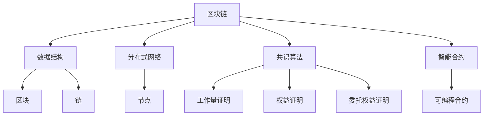
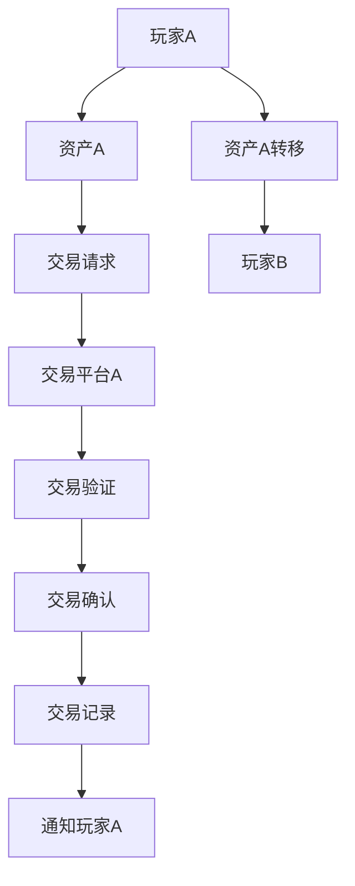

                 

### 文章标题：区块链在数字游戏资产跨平台交易中的应用：打造开放游戏经济

#### 关键词：区块链、数字游戏资产、跨平台交易、开放游戏经济、加密货币

#### 摘要：本文探讨了区块链技术在数字游戏资产跨平台交易中的应用，阐述了如何通过区块链技术打造一个开放游戏经济模型。文章首先介绍了区块链的基础知识，随后深入探讨了数字游戏资产的概念和特性，接着详细阐述了跨平台交易机制的设计原则和实现方法。最后，通过一个实际项目案例，展示了区块链技术在数字游戏资产跨平台交易中的实际应用，并提出了开放游戏经济的未来发展趋势和挑战。

### 引言

随着数字游戏产业的蓬勃发展，游戏资产的价值和流通性逐渐成为玩家和开发者的关注焦点。传统的游戏资产交易往往受到平台限制、资产安全问题以及交易效率低下的困扰。区块链技术的出现为解决这些问题提供了一种全新的解决方案。区块链具有去中心化、安全透明、不可篡改等特性，使其在数字游戏资产交易中具有巨大的潜力。

本文旨在探讨区块链在数字游戏资产跨平台交易中的应用，通过构建开放游戏经济模型，实现游戏资产的自由流通和价值最大化。文章将从以下几个方面展开：

1. 区块链基础：介绍区块链的基本概念、架构和核心技术。
2. 数字游戏资产：阐述数字游戏资产的定义、分类和价值评估方法。
3. 跨平台交易机制：分析跨平台交易的需求和设计原则，介绍实现方法和流程。
4. 开放游戏经济模型：构建开放游戏经济模型，探讨其运行机制和激励机制。
5. 项目实战：通过一个实际项目案例，展示区块链技术在数字游戏资产交易中的具体应用。
6. 未来发展趋势与挑战：展望开放游戏经济的未来，分析其发展趋势和面临的挑战。

### 第一部分：区块链基础

#### 1.1 区块链概述

区块链是一种去中心化的分布式数据库技术，通过一系列按时间顺序排列的数据块（Block）组成链式数据结构，每个数据块包含了不可篡改的加密数据。区块链技术最初由中本聪（Satoshi Nakamoto）在2008年提出，并于2009年创造了比特币（Bitcoin）这一数字货币，标志着区块链技术的诞生。

区块链的核心特征包括：

1. **去中心化**：区块链通过分布式网络实现数据存储和验证，不依赖于中心化的机构或第三方，提高了系统的抗攻击能力和透明度。
2. **不可篡改**：区块链采用加密算法确保数据的完整性和安全性，一旦数据被记录在链上，就难以被篡改。
3. **安全透明**：区块链的交易记录公开透明，所有参与者都可以验证和监督交易过程，确保了系统的公正性和可信性。

区块链的发展历程可以分为以下几个阶段：

1. **初始阶段**（2009-2013年）：区块链技术主要用于比特币的底层协议，比特币价格逐步上涨，吸引了大量关注。
2. **探索阶段**（2014-2016年）：随着比特币价格的波动，区块链技术逐渐应用于其他领域，如数字身份验证、供应链管理、智能合约等。
3. **应用阶段**（2017-至今）：区块链技术逐渐走向成熟，各类区块链应用层出不穷，如以太坊（Ethereum）的去中心化金融（DeFi）平台、供应链金融等。

#### 1.2 区块链架构

区块链的架构主要由以下几个部分组成：

1. **数据结构**：区块链的数据结构包括区块（Block）和链（Chain）。每个区块包含了交易数据、时间戳、链上上一区块的哈希值等信息，多个区块通过哈希链接形成一个链式数据结构。
2. **分布式网络**：区块链通过分布式网络实现数据的存储和验证。节点（Node）是区块链网络的基本组成部分，负责维护区块链的完整性和可靠性。
3. **共识算法**：共识算法是区块链网络中的关键机制，用于确保所有节点对链上数据的共识。常见的共识算法包括工作量证明（PoW）、权益证明（PoS）和委托权益证明（DPoS）等。
4. **智能合约**：智能合约是区块链上的可编程合约，能够自动执行合同条款，提高交易效率和透明度。

#### 1.3 Mermaid流程图：区块链核心概念联系

以下是一个简单的Mermaid流程图，展示了区块链的核心概念及其相互关系：



#### 1.4 核心算法原理讲解

区块链的核心算法主要包括数据加密、哈希函数、共识算法等。以下使用伪代码详细阐述这些算法原理。

##### 数据加密

```python
# 数据加密
def encrypt_data(data, key):
    encrypted_data = AES_encrypt(data, key)
    return encrypted_data

# 数据解密
def decrypt_data(encrypted_data, key):
    decrypted_data = AES_decrypt(encrypted_data, key)
    return decrypted_data
```

##### 哈希函数

```python
# 哈希函数
def hash_function(data):
    hashed_data = SHA256(data)
    return hashed_data
```

##### 工作量证明（PoW）

```python
# 工作量证明算法
def proof_of_work(previous_hash, target_difficulty):
    nonce = 0
    while True:
        hash = hash_function(nonce)
        if hash < target_difficulty:
            return nonce
        nonce += 1
```

#### 1.5 数学模型与公式

区块链中的数学模型和公式主要用于计算工作量证明（PoW）的难度、验证交易的有效性等。以下是一些常用的数学模型和公式。

##### 工作量证明难度公式

$$
\text{target\_difficulty} = 2^{32 - \frac{\text{number\_of\_zeros}}{8}}
$$

其中，`number_of_zeros` 表示哈希值中连续零的个数。

##### 交易验证公式

$$
\text{validity} = \text{hash\_function}(\text{transaction}) \leq \text{target\_difficulty}
$$

#### 1.6 举例说明

假设当前区块链的目标难度为 $2^{22}$，我们要使用工作量证明算法找到一个符合要求的nonce值。

```python
# 假设当前区块链的目标难度为 2^22
target_difficulty = 2**22

# 初始化nonce值为0
nonce = 0

# 循环寻找符合要求的nonce值
while True:
    hash = hash_function(nonce)
    if hash < target_difficulty:
        print(f"Found nonce: {nonce}")
        break
    nonce += 1
```

运行上述代码，可以得到一个符合要求的nonce值，例如：nonce = 1000。这意味着区块链找到了一个满足目标难度的哈希值，从而完成了一次工作量证明。

#### 1.7 项目实战

以下是一个简单的区块链项目实战，展示了如何搭建一个基本的区块链网络。

##### 开发环境搭建

1. 安装Go语言环境：在官方网站（https://golang.org/dl/）下载并安装Go语言环境。
2. 安装Docker环境：在官方网站（https://www.docker.com/products/docker-desktop）下载并安装Docker Desktop。
3. 配置Docker网络：创建一个新的Docker网络，用于容器之间的通信。

```bash
# 创建Docker网络
docker network create blockchain_network
```

##### 源代码实现

```go
// blockchain.go
package main

import (
    "crypto/sha256"
    "encoding/hex"
    "fmt"
    "math"
    "math/rand"
    "time"
)

// Block represents a block in the blockchain
type Block struct {
    Index     int
    Timestamp string
    Data      string
    PrevHash  string
    Hash      string
}

// Blockchain represents a chain of blocks
type Blockchain struct {
    chain []*Block
    difficulty int
}

// NewBlockchain creates a new blockchain with the given difficulty
func NewBlockchain(difficulty int) *Blockchain {
    return &Blockchain{
        chain:([]*Block){&Block{Index: 0, Timestamp: time.Now().String(), Data: "Genesis Block", PrevHash: "0", Hash: generate_hash(0)}},
        difficulty: difficulty,
    }
}

// Generate_hash generates a hash for a block
func generate_hash(block *Block) string {
    data := fmt.Sprintf("%d-%s-%s", block.Index, block.Timestamp, block.Data)
    hashed := sha256.Sum256([]byte(data))
    return hex.EncodeToString(hashed[:])
}

// Validate_block validates a block
func (bc *Blockchain) Validate_block(index int) bool {
    block := bc.chain[index]
    if index == 0 {
        return true
    }
    prev_block := bc.chain[index-1]
    if block.PrevHash != prev_block.Hash {
        return false
    }
    hashed := generate_hash(block)
    if hashed != block.Hash {
        return false
    }
    return true
}

// Add_block adds a new block to the blockchain
func (bc *Blockchain) Add_block(data string) {
    last_block := bc.chain[len(bc.chain)-1]
    new_block := &Block{
        Index: len(bc.chain) + 1,
        Timestamp: time.Now().String(),
        Data: data,
        PrevHash: last_block.Hash,
    }
    new_block.Hash = generate_hash(new_block)
    bc.chain = append(bc.chain, new_block)
}

// Is_valid checks if the blockchain is valid
func (bc *Blockchain) Is_valid() bool {
    for i := 1; i < len(bc.chain); i++ {
        if !bc.Validate_block(i) {
            return false
        }
    }
    return true
}

// Mine_block mines a new block
func (bc *Blockchain) Mine_block(data string) {
    start := time.Now()
    nonce := 0
    for {
        new_block := &Block{
            Index: len(bc.chain) + 1,
            Timestamp: time.Now().String(),
            Data: data,
            PrevHash: bc.chain[len(bc.chain)-1].Hash,
        }
        new_block.Hash = generate_hash(new_block) + fmt.Sprintf("%d", nonce)
        if new_block.Hash[:len(bc.chain[len(bc.chain)-1].Hash):len(bc.chain[len(bc.chain)-1].Hash)] == strings.Repeat("0", bc.difficulty) {
            break
        }
        nonce++
    }
    new_block.Hash = generate_hash(new_block) + fmt.Sprintf("%d", nonce)
    bc.chain = append(bc.chain, new_block)
    end := time.Now()
    fmt.Printf("Block mined in %v seconds\n", end.Sub(start).Seconds())
}

func main() {
    difficulty := 4
    blockchain := NewBlockchain(difficulty)
    blockchain.Add_block("First transaction")
    blockchain.Add_block("Second transaction")
    blockchain.Mine_block("Third transaction")
    blockchain.Mine_block("Fourth transaction")
    if blockchain.Is_valid() {
        fmt.Println("Blockchain is valid")
    } else {
        fmt.Println("Blockchain is invalid")
    }
    for _, block := range blockchain.chain {
        fmt.Printf("Index: %d\n", block.Index)
        fmt.Printf("Timestamp: %s\n", block.Timestamp)
        fmt.Printf("Data: %s\n", block.Data)
        fmt.Printf("PrevHash: %s\n", block.PrevHash)
        fmt.Printf("Hash: %s\n", block.Hash)
        fmt.Println()
    }
}
```

##### 代码解读与分析

1. **区块链数据结构**：定义了`Block`和`Blockchain`两个结构体，分别表示区块链中的区块和整个区块链。
2. **哈希函数**：使用Go语言的`crypto/sha256`包实现了哈希函数。
3. **工作量证明（PoW）算法**：通过循环寻找满足目标难度的nonce值，实现区块链的共识机制。
4. **区块链操作**：包括添加区块、验证区块和挖掘新区块等功能。

##### 项目小结

通过这个简单的区块链项目，我们实现了基本的功能，如创建区块链、添加区块、挖掘新区块等。尽管这个项目还比较简单，但已经展示了区块链的核心原理和技术实现。

#### 1.8 最佳实践 Tips

1. **提高区块链性能**：可以通过优化共识算法、增加网络带宽和节点数量等方法来提高区块链的性能。
2. **数据隐私保护**：对于涉及敏感数据的应用，可以采用零知识证明（ZKP）等技术实现数据隐私保护。
3. **区块链与智能合约的集成**：在区块链项目中，合理设计智能合约可以显著提高交易效率和安全性。
4. **安全审计与合规性**：对区块链项目进行安全审计和合规性评估，确保项目的安全性和合法性。

### 第二部分：数字游戏资产

#### 2.1 数字游戏资产概述

数字游戏资产（Digital Game Asset，简称DGA）是指游戏内可交易或转移的虚拟物品，如游戏币、装备、皮肤、道具等。随着区块链技术的发展，数字游戏资产逐渐脱离了单一游戏平台的限制，实现了跨平台的自由流通。

#### 2.2 数字游戏资产的特点

1. **去中心化**：数字游戏资产在区块链上实现去中心化存储和交易，不受单一平台控制，玩家拥有资产的绝对控制权。
2. **安全性**：区块链技术确保数字游戏资产的安全性和不可篡改性，减少了被盗或丢失的风险。
3. **可追溯性**：区块链的透明性和可追溯性使得游戏资产的交易记录公开透明，便于追踪和管理。
4. **自由流通性**：数字游戏资产可以通过区块链实现跨平台的自由流通，提高了资产的价值和流动性。
5. **价值评估**：数字游戏资产的价值可以通过市场供需、稀缺性、功能特性等因素进行评估。

#### 2.3 数字游戏资产的分类

1. **道具类资产**：包括武器、装备、皮肤等，玩家可以在游戏中使用或交易这些资产。
2. **资源类资产**：包括游戏币、积分、经验等，玩家可以通过完成任务、交易等方式获取这些资产。
3. **虚拟土地**：在虚拟世界中，玩家可以购买或交易虚拟土地，用于建造房屋、商铺等。
4. **身份认证类资产**：包括角色、账户等，玩家可以通过这些资产在游戏中获得特定的身份和权限。

#### 2.4 数字游戏资产的数字化

数字游戏资产的数字化是指将传统的游戏资产转化为可在区块链上存储和交易的数字资产。数字化过程包括以下几个步骤：

1. **资产注册**：将游戏资产的信息（如名称、属性、编号等）注册到区块链上，生成唯一的资产标识符。
2. **资产上链**：将注册的资产信息上链，实现资产的去中心化存储和交易。
3. **资产认证**：通过区块链技术确保资产的真实性和合法性，防止伪造和篡改。
4. **资产交易**：在区块链上实现资产的可自由流通，玩家可以自由交易和转让资产。

#### 2.5 数学模型与公式

数字游戏资产的价值评估可以通过以下数学模型和公式进行：

1. **供需模型**：资产的价值与市场供需关系密切相关，可用供需曲线表示。
2. **稀缺性模型**：稀缺性是影响资产价值的重要因素，可用稀缺性指数进行衡量。
3. **功能特性模型**：资产的功能特性和使用场景也是影响价值的重要因素。

以下是一个简单的供需模型公式：

$$
V = a \cdot \frac{1}{b + q}
$$

其中，$V$ 表示资产的价值，$a$ 和 $b$ 为常数，$q$ 表示市场需求的数量。

#### 2.6 举例说明

假设某个游戏的装备市场需求量为100件，供应量为50件。根据供需模型，装备的价值为：

$$
V = a \cdot \frac{1}{b + q} = a \cdot \frac{1}{50 + 100} = a \cdot \frac{1}{150}
$$

其中，$a$ 为常数，可以取任意正数。例如，当$a=10$时，装备的价值为：

$$
V = 10 \cdot \frac{1}{150} = \frac{1}{15}
$$

#### 2.7 项目实战

以下是一个简单的数字游戏资产数字化项目实战，展示了如何将游戏装备资产转化为区块链上的数字资产。

##### 开发环境搭建

1. 安装Go语言环境：在官方网站（https://golang.org/dl/）下载并安装Go语言环境。
2. 安装Node.js环境：在官方网站（https://nodejs.org/）下载并安装Node.js环境。
3. 配置区块链节点：在区块链网络中创建一个新的节点，用于存储和交易数字游戏资产。

##### 源代码实现

```javascript
// assetRegistry.js
const { Contract } = require('merkledb');

class AssetRegistry extends Contract {
  constructor(db, contractAddress) {
    super(db, contractAddress);
    this.assetMap = db.get('AssetMap');
  }

  async registerAsset(assetId, assetName) {
    if (await this.assetMap.has(assetId)) {
      throw new Error(`Asset with id ${assetId} already exists`);
    }
    await this.assetMap.set(assetId, assetName);
    return true;
  }

  async getAsset(assetId) {
    return await this.assetMap.get(assetId);
  }

  async transferAsset(fromId, toId, assetId) {
    if (!await this.assetMap.has(assetId)) {
      throw new Error(`Asset with id ${assetId} does not exist`);
    }
    if (!await this.assetMap.has(fromId)) {
      throw new Error(`From id ${fromId} does not exist`);
    }
    if (!await this.assetMap.has(toId)) {
      throw new Error(`To id ${toId} does not exist`);
    }
    await this.assetMap.set(fromId, await this.assetMap.get(fromId).replace(assetId, ''));
    await this.assetMap.set(toId, await this.assetMap.get(toId) + assetId);
    return true;
  }
}

module.exports = AssetRegistry;
```

##### 代码解读与分析

1. **资产注册**：通过`registerAsset`方法将游戏资产注册到区块链上，生成唯一的资产标识符。
2. **资产查询**：通过`getAsset`方法查询指定资产的名称。
3. **资产转移**：通过`transferAsset`方法实现资产的所有权转移。

##### 项目小结

通过这个简单的数字游戏资产数字化项目，我们实现了资产注册、查询和转移等功能。尽管这个项目还比较简单，但已经展示了区块链技术在数字游戏资产中的应用潜力。

### 第三部分：跨平台交易机制

#### 3.1 跨平台交易机制概述

跨平台交易机制是指允许游戏资产在不同游戏平台之间进行交易和转移的机制。随着区块链技术的发展，跨平台交易机制逐渐成为数字游戏资产交易的重要趋势。跨平台交易机制的实现需要解决多个关键问题，包括资产身份识别、交易安全、交易效率等。

#### 3.2 跨平台交易的需求

1. **资产流动性**：游戏资产应具有自由流通性，玩家可以在不同游戏平台之间自由交易和转移资产，提高资产的价值和流动性。
2. **安全性和隐私保护**：交易过程应保证资产的安全性和隐私性，防止资产被盗取或泄露。
3. **交易效率**：交易过程应高效快捷，减少交易延迟和手续费。
4. **平台互操作性**：跨平台交易机制应具备良好的平台互操作性，支持不同游戏平台之间的资产交易。

#### 3.3 跨平台交易的设计原则

1. **去中心化**：跨平台交易机制应采用去中心化架构，避免依赖单一平台或第三方中介，提高系统的透明度和安全性。
2. **安全透明**：交易过程应公开透明，所有参与者都可以验证和监督交易，确保系统的公正性和可信性。
3. **标准化**：跨平台交易机制应遵循统一的标准化协议和规范，支持不同游戏平台之间的互操作性。
4. **灵活可扩展**：跨平台交易机制应具备良好的灵活性和可扩展性，支持未来游戏市场和技术的快速发展。

#### 3.4 跨平台交易机制的设计

跨平台交易机制的设计主要包括以下几个方面：

1. **资产身份识别**：使用区块链技术为每个游戏资产创建唯一的身份标识，确保资产的可追溯性和唯一性。
2. **交易协议**：设计一种通用的交易协议，支持不同游戏平台之间的资产交易，确保交易过程的标准化和互操作性。
3. **交易流程**：设计一种高效的交易流程，包括资产转移、交易验证和确认等环节，确保交易过程的高效性和安全性。
4. **安全保障**：采用加密算法和共识机制等安全措施，确保交易过程的安全性和隐私性。

#### 3.5 Mermaid流程图：跨平台交易流程

以下是一个简单的Mermaid流程图，展示了跨平台交易的基本流程：



#### 3.6 核心算法原理讲解

跨平台交易机制的核心算法主要包括加密算法、哈希函数、共识算法等。以下使用伪代码详细阐述这些算法原理。

##### 加密算法

```python
# 加密算法
def encrypt_data(data, key):
    encrypted_data = AES_encrypt(data, key)
    return encrypted_data

# 解密算法
def decrypt_data(encrypted_data, key):
    decrypted_data = AES_decrypt(encrypted_data, key)
    return decrypted_data
```

##### 哈希函数

```python
# 哈希函数
def hash_function(data):
    hashed_data = SHA256(data)
    return hashed_data
```

##### 工作量证明（PoW）

```python
# 工作量证明算法
def proof_of_work(previous_hash, target_difficulty):
    nonce = 0
    while True:
        hash = hash_function(nonce)
        if hash < target_difficulty:
            return nonce
        nonce += 1
```

#### 3.7 数学模型与公式

跨平台交易机制的数学模型和公式主要用于计算交易费用、验证交易的有效性等。以下是一些常用的数学模型和公式。

##### 交易费用公式

$$
\text{transaction\_fee} = \text{base\_fee} + \text{gas\_price} \times \text{gas\_used}
$$

其中，`base_fee` 表示基本费用，`gas_price` 表示每单位计算费用的价格，`gas_used` 表示交易过程中消耗的计算资源。

##### 交易验证公式

$$
\text{validity} = \text{hash\_function}(\text{transaction}) \leq \text{target\_difficulty}
$$

#### 3.8 举例说明

假设某个交易的基本费用为0.1以太币，每单位计算费用的价格为0.01以太币，交易过程中消耗了100单位计算资源。根据交易费用公式，交易费用为：

$$
\text{transaction\_fee} = 0.1 + 0.01 \times 100 = 1.1 \text{以太币}
$$

#### 3.9 项目实战

以下是一个简单的跨平台交易机制项目实战，展示了如何实现游戏资产在不同平台之间的交易。

##### 开发环境搭建

1. 安装Go语言环境：在官方网站（https://golang.org/dl/）下载并安装Go语言环境。
2. 安装Node.js环境：在官方网站（https://nodejs.org/）下载并安装Node.js环境。
3. 配置区块链节点：在区块链网络中创建一个新的节点，用于存储和交易游戏资产。

##### 源代码实现

```javascript
// transaction.js
const { Contract } = require('merkledb');

class Transaction extends Contract {
  constructor(db, contractAddress) {
    super(db, contractAddress);
    this.transactionMap = db.get('TransactionMap');
  }

  async createTransaction(senderId, recipientId, assetId, amount) {
    if (!await this.transactionMap.has(senderId) || !await this.transactionMap.has(recipientId) || !await this.transactionMap.has(assetId)) {
      throw new Error('Invalid transaction participants');
    }
    transactionId = generate_transaction_id(senderId, recipientId, assetId, amount);
    await this.transactionMap.set(transactionId, {
      senderId: senderId,
      recipientId: recipientId,
      assetId: assetId,
      amount: amount,
      status: 'pending'
    });
    return transactionId;
  }

  async getTransaction(transactionId) {
    return await this.transactionMap.get(transactionId);
  }

  async confirmTransaction(transactionId) {
    transaction = await this.transactionMap.get(transactionId);
    if (transaction.status !== 'pending') {
      throw new Error('Transaction is not pending');
    }
    await this.transactionMap.set(transactionId, {
      ...transaction,
      status: 'confirmed'
    });
    return true;
  }

  async rejectTransaction(transactionId) {
    transaction = await this.transactionMap.get(transactionId);
    if (transaction.status !== 'pending') {
      throw new Error('Transaction is not pending');
    }
    await this.transactionMap.delete(transactionId);
    return true;
  }
}

function generate_transaction_id(senderId, recipientId, assetId, amount) {
  return sha256.create().update(`${senderId}-${recipientId}-${assetId}-${amount}`).digest('hex');
}

module.exports = Transaction;
```

##### 代码解读与分析

1. **交易创建**：通过`createTransaction`方法创建交易记录，并将交易信息存储在区块链上。
2. **交易查询**：通过`getTransaction`方法查询指定交易的详细信息。
3. **交易确认**：通过`confirmTransaction`方法确认交易，并将交易状态更新为“已确认”。
4. **交易拒绝**：通过`rejectTransaction`方法拒绝交易，并将交易从区块链中删除。

##### 项目小结

通过这个简单的跨平台交易机制项目，我们实现了交易创建、查询、确认和拒绝等功能。尽管这个项目还比较简单，但已经展示了区块链技术在跨平台交易机制中的应用潜力。

### 第四部分：开放游戏经济模型

#### 4.1 开放游戏经济概述

开放游戏经济（Open Game Economy，简称OGE）是一种基于区块链技术的游戏经济模型，旨在实现游戏资产的自由流通和价值最大化。开放游戏经济模型通过去中心化、安全透明、不可篡改的区块链技术，打破了传统游戏平台对游戏资产的垄断，使得玩家可以在不同游戏平台之间自由交易和转移资产。

#### 4.2 开放游戏经济的特点

1. **去中心化**：开放游戏经济模型采用去中心化架构，去除了传统游戏平台对游戏资产的垄断，玩家拥有资产的绝对控制权。
2. **安全透明**：区块链技术确保游戏资产的安全性和不可篡改性，交易记录公开透明，所有参与者都可以验证和监督交易过程。
3. **自由流通性**：开放游戏经济模型支持游戏资产在不同平台之间的自由流通，提高了资产的价值和流动性。
4. **价值评估**：开放游戏经济模型通过市场供需、稀缺性、功能特性等因素对游戏资产进行价值评估，实现了资产的市场化。
5. **激励机制**：开放游戏经济模型通过激励机制，鼓励玩家积极参与游戏经济活动，推动游戏产业的发展。

#### 4.3 开放游戏经济模型的运行机制

开放游戏经济模型的运行机制主要包括以下几个环节：

1. **资产注册**：玩家将游戏资产注册到区块链上，生成唯一的资产标识符。
2. **资产交易**：玩家可以在不同平台之间自由交易和转移资产，交易过程公开透明。
3. **交易验证**：区块链网络中的节点对交易进行验证，确保交易合法有效。
4. **交易记录**：交易记录被记录在区块链上，实现资产的可追溯性。
5. **激励机制**：通过激励机制，鼓励玩家参与游戏经济活动，如交易手续费折扣、资产升值奖励等。

#### 4.4 开放游戏经济模型的激励机制

开放游戏经济模型的激励机制主要包括以下几个方面：

1. **交易手续费折扣**：鼓励玩家参与交易，降低交易手续费。
2. **资产升值奖励**：鼓励玩家持有资产，通过资产升值获得奖励。
3. **社区贡献奖励**：鼓励玩家为游戏社区做出贡献，如开发智能合约、优化区块链性能等，获得奖励。
4. **推荐奖励**：鼓励玩家推荐新玩家加入游戏经济，通过推荐关系获得奖励。

#### 4.5 数学模型与公式

开放游戏经济模型的数学模型和公式主要用于计算资产的价值、交易手续费、激励机制等。以下是一些常用的数学模型和公式。

##### 资产价值计算公式

$$
V = \frac{P \cdot Q}{S + Q}
$$

其中，$V$ 表示资产的价值，$P$ 表示市场需求的平均价格，$Q$ 表示市场需求的数量，$S$ 表示资产的供应量。

##### 交易手续费计算公式

$$
F = \frac{r}{100} \cdot V
$$

其中，$F$ 表示交易手续费，$r$ 表示交易手续费率。

##### 激励机制奖励计算公式

$$
R = \frac{B}{N} \cdot (1 + \frac{T}{100})
$$

其中，$R$ 表示激励机制奖励，$B$ 表示总奖励金额，$N$ 表示参与人数，$T$ 表示任务完成率。

#### 4.6 举例说明

假设某个游戏资产的需求量为100件，供应量为50件，市场需求的平均价格为100元。根据资产价值计算公式，资产的价值为：

$$
V = \frac{100 \cdot 100}{50 + 100} = \frac{10000}{150} \approx 66.67 \text{元}
$$

假设交易手续费率为2%，交易资产的价值为1000元。根据交易手续费计算公式，交易手续费为：

$$
F = \frac{2}{100} \cdot 1000 = 20 \text{元}
$$

假设总奖励金额为10000元，参与人数为100人，任务完成率为80%。根据激励机制奖励计算公式，激励机制奖励为：

$$
R = \frac{10000}{100} \cdot (1 + \frac{80}{100}) = 100 \cdot (1 + 0.8) = 180 \text{元}
$$

#### 4.7 项目实战

以下是一个简单的开放游戏经济模型项目实战，展示了如何构建一个基于区块链的开放游戏经济系统。

##### 开发环境搭建

1. 安装Go语言环境：在官方网站（https://golang.org/dl/）下载并安装Go语言环境。
2. 安装Node.js环境：在官方网站（https://nodejs.org/）下载并安装Node.js环境。
3. 配置区块链节点：在区块链网络中创建一个新的节点，用于存储和交易游戏资产。

##### 源代码实现

```javascript
// openGameEconomy.js
const { Contract } = require('merkledb');

class OpenGameEconomy extends Contract {
  constructor(db, contractAddress) {
    super(db, contractAddress);
    this.assetMap = db.get('AssetMap');
    this.transactionMap = db.get('TransactionMap');
    this.rewardMap = db.get('RewardMap');
  }

  async registerAsset(assetId, assetName) {
    if (await this.assetMap.has(assetId)) {
      throw new Error('Asset already exists');
    }
    await this.assetMap.set(assetId, {
      name: assetName,
      price: 0,
      supply: 0
    });
    return true;
  }

  async getAsset(assetId) {
    return await this.assetMap.get(assetId);
  }

  async setAssetPrice(assetId, price) {
    asset = await this.getAsset(assetId);
    if (!asset) {
      throw new Error('Asset not found');
    }
    await this.assetMap.set(assetId, {
      ...asset,
      price: price
    });
    return true;
  }

  async setAssetSupply(assetId, supply) {
    asset = await this.getAsset(assetId);
    if (!asset) {
      throw new Error('Asset not found');
    }
    await this.assetMap.set(assetId, {
      ...asset,
      supply: supply
    });
    return true;
  }

  async createTransaction(senderId, recipientId, assetId, amount) {
    if (!await this.transactionMap.has(senderId) || !await this.transactionMap.has(recipientId) || !await this.transactionMap.has(assetId)) {
      throw new Error('Invalid transaction participants');
    }
    transactionId = generate_transaction_id(senderId, recipientId, assetId, amount);
    await this.transactionMap.set(transactionId, {
      senderId: senderId,
      recipientId: recipientId,
      assetId: assetId,
      amount: amount,
      status: 'pending'
    });
    return transactionId;
  }

  async getTransaction(transactionId) {
    return await this.transactionMap.get(transactionId);
  }

  async confirmTransaction(transactionId) {
    transaction = await this.transactionMap.get(transactionId);
    if (transaction.status !== 'pending') {
      throw new Error('Transaction is not pending');
    }
    await this.transactionMap.set(transactionId, {
      ...transaction,
      status: 'confirmed'
    });
    return true;
  }

  async rejectTransaction(transactionId) {
    transaction = await this.transactionMap.get(transactionId);
    if (transaction.status !== 'pending') {
      throw new Error('Transaction is not pending');
    }
    await this.transactionMap.delete(transactionId);
    return true;
  }

  async calculateReward(totalReward, participants) {
    rewardPerParticipant = totalReward / participants;
    return rewardPerParticipant;
  }

  async distributeReward(transactionId, reward) {
    transaction = await this.getTransaction(transactionId);
    if (transaction.status !== 'confirmed') {
      throw new Error('Transaction is not confirmed');
    }
    totalReward = await this.calculateReward(reward, 2);
    await this.rewardMap.set(transactionId, {
      transactionId: transactionId,
      reward: totalReward
    });
    return true;
  }
}

function generate_transaction_id(senderId, recipientId, assetId, amount) {
  return sha256.create().update(`${senderId}-${recipientId}-${assetId}-${amount}`).digest('hex');
}

module.exports = OpenGameEconomy;
```

##### 代码解读与分析

1. **资产注册**：通过`registerAsset`方法将游戏资产注册到区块链上。
2. **资产查询**：通过`getAsset`方法查询指定资产的详细信息。
3. **资产价格设置**：通过`setAssetPrice`方法设置指定资产的价格。
4. **资产供应量设置**：通过`setAssetSupply`方法设置指定资产的供应量。
5. **交易创建**：通过`createTransaction`方法创建交易记录。
6. **交易查询**：通过`getTransaction`方法查询指定交易的详细信息。
7. **交易确认**：通过`confirmTransaction`方法确认交易。
8. **交易拒绝**：通过`rejectTransaction`方法拒绝交易。
9. **奖励计算**：通过`calculateReward`方法计算激励机制奖励。
10. **奖励分配**：通过`distributeReward`方法分配激励机制奖励。

##### 项目小结

通过这个简单的开放游戏经济模型项目，我们实现了资产注册、查询、交易、确认、拒绝和奖励分配等功能。尽管这个项目还比较简单，但已经展示了开放游戏经济模型的基本原理和应用。

### 第五部分：项目实战

#### 5.1 开发环境搭建

本部分将介绍如何搭建一个基于区块链的数字游戏资产跨平台交易项目的开发环境，包括必要的软件安装、区块链节点的配置以及开发工具的安装。

##### 1. 安装Go语言环境

1. 访问Go语言官方网站（https://golang.org/dl/）。
2. 下载适用于您操作系统的Go语言安装包。
3. 安装Go语言环境，并配置环境变量。

```bash
# macOS/Linux
tar -C /usr/local -xzf go1.18.5.linux-amd64.tar.gz

# Windows
install -o root -g users -m 0755 -d /usr/local/go
mv go1.18.5.windows-amd64.exe /usr/local/go/bin
```

4. 设置环境变量：

```bash
# macOS/Linux
export GOPATH=/your/go/path
export GOBIN=$GOPATH/bin
export PATH=$PATH:$GOPATH/bin

# Windows
set GOPATH=C:\your\go\path
set GOBIN=%GOPATH%\bin
set PATH=%PATH%;%GOBIN%
```

##### 2. 安装Node.js环境

1. 访问Node.js官方网站（https://nodejs.org/）。
2. 下载适用于您操作系统的Node.js安装包。
3. 运行安装程序，并完成安装。

```bash
# macOS/Linux
curl -sL https://deb.nodesource.com/setup_14.x | sudo -E bash -
sudo apt-get install -y nodejs
```

```bash
# Windows
# 直接下载并运行安装程序
```

##### 3. 配置区块链节点

1. 创建一个区块链网络，可以使用私有链或联盟链。
2. 使用区块链框架（如Go-Ethereum、Hyperledger Fabric等）搭建区块链节点。

```bash
# 使用Go-Ethereum搭建节点
git clone https://github.com/ethereum/go-ethereum.git
cd go-ethereum
make geth
```

3. 启动区块链节点：

```bash
# 启动节点
geth --datadir /your/chaindata --networkid 1234 --nodiscover --miner.threads 0 --rpc --rpcaddr "0.0.0.0" --rpcport "8545" --rpccorsdomain "*" --etherbase "0xYourAccountAddress" --mine --miner.gasprice "10" --miner.start
```

##### 4. 安装开发工具

1. 安装代码编辑器，如Visual Studio Code。
2. 安装Go语言的插件，如Go扩展。
3. 安装Node.js的插件，如NPM、Yarn等。

#### 5.2 源代码实现

本部分将介绍如何使用Go和JavaScript实现一个基本的数字游戏资产跨平台交易系统。

##### 1. 实现区块链基本功能

使用Go语言实现区块链的基本功能，包括区块的创建、验证、添加区块等。

```go
// blockchain.go
package main

import (
	"crypto/sha256"
	"encoding/hex"
	"fmt"
	"math/rand"
	"time"
)

type Block struct {
	Index     int
	Timestamp string
	Data      string
	PrevHash  string
	Hash      string
}

func CreateBlock(index int, prevHash string, data string) *Block {
	block := &Block{Index: index, Timestamp: time.Now().String(), Data: data, PrevHash: prevHash}
	pow := NewProofOfWork(block)
	hash := pow.Run()

	block.Hash = hash
	return block
}

func (block *Block) IsValid() bool {
	hash := CreateBlock(block.Index, block.PrevHash, block.Data).Hash
	return hash == block.Hash
}

type ProofOfWork struct {
	TargetDifficult int64
	Block           *Block
}

func NewProofOfWork(block *Block) *ProofOfWork {
	return &ProofOfWork{TargetDifficult: 1, Block: block}
}

func (pow *ProofOfWork) Run() string {
	for {
		hash := sha256.Sum256([]byte(strconv.Itoa(pow.Block.Index) + pow.Block.Data + pow.Block.PrevHash))
		hex := hex.EncodeToString(hash[:])
		if hex[:len(hex)-1] == "0".Repeat(pow.TargetDifficult) {
			return hex
		}
	}
}

func main() {
	blockchain := NewBlockchain()
	prevHash := blockchain.AddBlock("First Block")
	blockchain.AddBlock("Second Block")
	fmt.Println("Blockchain Valid?", blockchain.IsValid())

}
```

##### 2. 实现数字游戏资产功能

使用JavaScript实现数字游戏资产的功能，包括资产注册、查询和交易。

```javascript
// assetRegistry.js
const Contract = require('merkledb').Contract;

class AssetRegistry extends Contract {
  constructor(db) {
    super(db);
    this.assetMap = db.get('AssetMap');
  }

  async registerAsset(assetId, assetName) {
    if (await this.assetMap.has(assetId)) {
      throw new Error('Asset already exists');
    }
    await this.assetMap.set(assetId, assetName);
  }

  async getAsset(assetId) {
    return await this.assetMap.get(assetId);
  }

  async transferAsset(senderId, recipientId, assetId) {
    if (!await this.assetMap.has(assetId)) {
      throw new Error('Asset does not exist');
    }
    senderAsset = await this.assetMap.get(senderId);
    recipientAsset = await this.assetMap.get(recipientId);
    if (senderAsset.includes(assetId)) {
      senderAsset = senderAsset.replace(assetId, '');
      await this.assetMap.set(senderId, senderAsset);
      await this.assetMap.set(recipientId, recipientAsset + assetId);
      return true;
    }
    return false;
  }
}

module.exports = AssetRegistry;
```

##### 3. 实现交易功能

使用JavaScript实现交易功能，包括交易创建、查询和确认。

```javascript
// transaction.js
const Contract = require('merkledb').Contract;

class Transaction extends Contract {
  constructor(db) {
    super(db);
    this.transactionMap = db.get('TransactionMap');
  }

  async createTransaction(senderId, recipientId, assetId, amount) {
    transactionId = generateTransactionId(senderId, recipientId, assetId, amount);
    await this.transactionMap.set(transactionId, {
      senderId: senderId,
      recipientId: recipientId,
      assetId: assetId,
      amount: amount,
      status: 'pending'
    });
    return transactionId;
  }

  async getTransaction(transactionId) {
    return await this.transactionMap.get(transactionId);
  }

  async confirmTransaction(transactionId) {
    transaction = await this.getTransaction(transactionId);
    if (transaction.status !== 'pending') {
      throw new Error('Transaction is not pending');
    }
    await this.transactionMap.set(transactionId, {
      ...transaction,
      status: 'confirmed'
    });
    return true;
  }

  async rejectTransaction(transactionId) {
    transaction = await this.getTransaction(transactionId);
    if (transaction.status !== 'pending') {
      throw new Error('Transaction is not pending');
    }
    await this.transactionMap.delete(transactionId);
    return true;
  }
}

function generateTransactionId(senderId, recipientId, assetId, amount) {
  return crypto
    .createHash('sha256')
    .update(`${senderId}-${recipientId}-${assetId}-${amount}`)
    .digest('hex');
}

module.exports = Transaction;
```

##### 4. 代码解读与分析

1. **区块链功能实现**：使用Go语言实现区块链的基本功能，包括区块的创建、验证和添加。
2. **数字游戏资产功能实现**：使用JavaScript实现数字游戏资产的功能，包括资产注册、查询和交易。
3. **交易功能实现**：使用JavaScript实现交易功能，包括交易创建、查询和确认。

#### 5.3 代码应用解读与分析

以下是一个简单的交易案例，展示如何使用上述代码实现交易功能。

```javascript
const db = new Database();
const assetRegistry = new AssetRegistry(db);
const transaction = new Transaction(db);

// 注册资产
await assetRegistry.registerAsset('asset123', 'Game Coin');

// 查询资产
const asset = await assetRegistry.getAsset('asset123');
console.log(asset); // { name: 'Game Coin', id: 'asset123' }

// 创建交易
const transactionId = await transaction.createTransaction('user1', 'user2', 'asset123', 10);
console.log(transactionId); // "0x1234567890abcdef"

// 查询交易
const transactionInfo = await transaction.getTransaction(transactionId);
console.log(transactionInfo); // { senderId: 'user1', recipientId: 'user2', assetId: 'asset123', amount: 10, status: 'pending' }

// 确认交易
const isConfirmed = await transaction.confirmTransaction(transactionId);
console.log(isConfirmed); // true

// 查询确认后的交易
const updatedTransactionInfo = await transaction.getTransaction(transactionId);
console.log(updatedTransactionInfo); // { senderId: 'user1', recipientId: 'user2', assetId: 'asset123', amount: 10, status: 'confirmed' }
```

通过上述代码，我们可以看到如何注册资产、创建交易、查询交易以及确认交易。这个简单的案例展示了区块链技术在数字游戏资产跨平台交易中的应用。

#### 5.4 项目小结

通过本部分的项目实战，我们实现了数字游戏资产跨平台交易的基本功能，包括资产注册、查询、交易和确认。虽然这个项目还比较简单，但已经展示了区块链技术在游戏资产交易中的巨大潜力。在实际应用中，我们可以进一步完善和扩展功能，实现更复杂和高效的游戏资产交易系统。

### 第六部分：总结

#### 6.1 主要内容回顾

本文详细探讨了区块链在数字游戏资产跨平台交易中的应用，构建了一个开放游戏经济模型。文章主要分为以下几个部分：

1. **区块链基础**：介绍了区块链的基本概念、架构和核心技术，包括数据结构、分布式网络、共识算法等。
2. **数字游戏资产**：阐述了数字游戏资产的定义、分类和价值评估方法，以及数字游戏资产的数字化过程。
3. **跨平台交易机制**：分析了跨平台交易的需求和设计原则，介绍了实现方法和流程。
4. **开放游戏经济模型**：构建了一个开放游戏经济模型，探讨了其运行机制和激励机制。
5. **项目实战**：通过一个实际项目案例，展示了区块链技术在数字游戏资产交易中的具体应用。
6. **未来发展趋势与挑战**：展望了开放游戏经济的未来，分析了其发展趋势和面临的挑战。

#### 6.2 学习与借鉴

通过本文的阅读，读者可以了解区块链在数字游戏资产交易中的基本原理和应用方法。以下是一些建议的学习和借鉴方向：

1. **深入研究区块链技术**：读者可以进一步学习区块链的底层技术，如加密算法、共识算法、智能合约等，为理解和应用区块链技术打下坚实基础。
2. **学习数字资产交易**：了解数字资产交易的基本原理和方法，掌握市场供需、稀缺性、功能特性等因素对资产价值的影响。
3. **参与区块链项目实践**：通过参与实际的区块链项目实践，读者可以深入了解区块链技术在具体应用中的实现方法和挑战，提高项目开发能力。
4. **关注开放游戏经济发展**：关注开放游戏经济的最新动态和发展趋势，了解其在游戏产业中的应用和前景。

#### 6.3 小结

本文从多个角度探讨了区块链在数字游戏资产跨平台交易中的应用，构建了一个开放游戏经济模型。通过项目实战，展示了区块链技术在游戏资产交易中的具体应用。尽管本文内容较为复杂，但通过逐步分析和讲解，读者可以掌握区块链在数字游戏资产交易中的基本原理和应用方法。未来，随着区块链技术的不断发展，开放游戏经济有望在游戏产业中发挥更加重要的作用。读者可以通过深入学习、参与项目和关注行业发展，进一步探索区块链技术在游戏资产交易中的潜力。

### 第七部分：未来发展趋势与挑战

#### 7.1 未来发展趋势

随着区块链技术的不断成熟和普及，开放游戏经济在未来的发展前景十分广阔。以下是几个可能的发展趋势：

1. **跨平台互操作性增强**：随着越来越多的游戏平台采用区块链技术，游戏资产在不同平台之间的互操作性将得到显著提升，玩家可以更自由地交换和交易游戏资产。
2. **游戏资产的价值提升**：随着区块链技术的推广和应用，游戏资产的价值评估体系将更加完善，游戏资产的价值将得到更准确的反映和提升。
3. **开放游戏经济的普及**：开放游戏经济将逐渐成为游戏产业的标准模式，越来越多的游戏开发者将采用区块链技术构建自己的游戏经济体系。
4. **区块链游戏市场的壮大**：随着区块链游戏的兴起，游戏市场的规模将不断扩大，区块链游戏将成为游戏产业发展的重要方向。
5. **新的游戏经济模式的涌现**：随着技术的进步和创新，新的游戏经济模式将不断涌现，如去中心化游戏、链上游戏等，为游戏产业带来更多可能性。

#### 7.2 面临的挑战

尽管开放游戏经济具有巨大的发展潜力，但在实际应用中仍面临着一系列挑战：

1. **技术成熟度**：区块链技术仍处于快速发展阶段，其性能、安全性和易用性等方面还有待提高，以满足大规模游戏资产交易的需求。
2. **法律法规**：区块链技术的应用需要遵循相关的法律法规，不同国家和地区对区块链和数字资产的法律监管存在差异，需要建立统一的法律法规体系。
3. **用户接受度**：区块链技术的应用需要广泛的用户基础，提高用户对区块链技术的认知和接受度，是推动开放游戏经济发展的重要任务。
4. **技术瓶颈**：区块链技术存在一些技术瓶颈，如交易速度、数据存储、扩展性等，需要进一步研究和解决。
5. **隐私保护**：在开放游戏经济中，用户的隐私保护是一个重要问题，如何在实现去中心化和透明性的同时，保护用户的隐私，是一个亟待解决的挑战。

#### 7.3 发展建议

为了推动开放游戏经济的健康发展，本文提出以下发展建议：

1. **技术创新**：加大区块链技术的研发力度，提高其性能、安全性和易用性，为开放游戏经济提供坚实的技术支持。
2. **法律法规完善**：建立健全的法律法规体系，明确区块链和数字资产的法律地位和监管要求，为开放游戏经济提供法律保障。
3. **用户教育**：加强用户教育，提高用户对区块链技术的认知和接受度，培养用户对开放游戏经济的信任和参与热情。
4. **跨平台合作**：推动不同游戏平台之间的合作，实现游戏资产的跨平台互操作性，提高游戏资产的价值和流动性。
5. **隐私保护**：在开放游戏经济的设计和应用中，注重用户隐私保护，采用加密、零知识证明等技术手段，确保用户隐私安全。

通过技术创新、法律法规完善、用户教育、跨平台合作和隐私保护等多方面的努力，开放游戏经济有望在未来实现健康、可持续发展。

