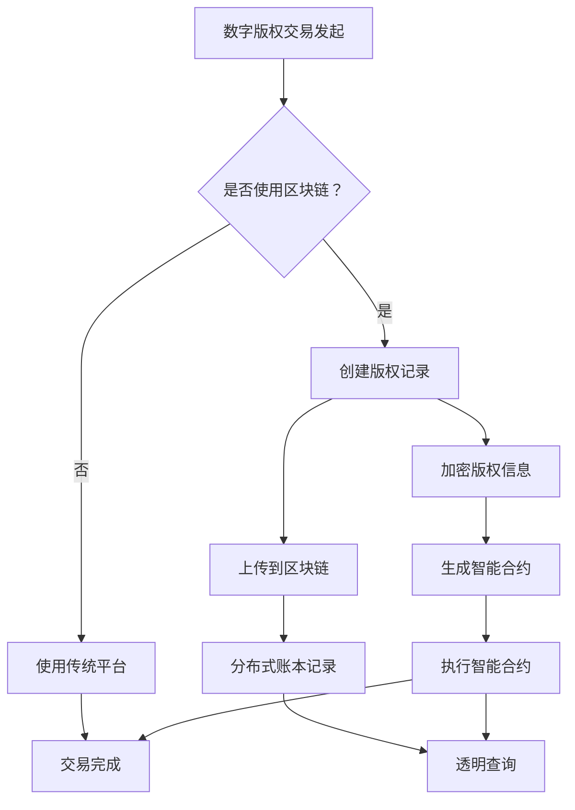

                 


### 背景介绍

在数字版权交易领域，传统的中心化版权交易平台存在着诸多问题。首先，中心化平台往往由个别公司或组织掌控，这使得版权交易过程中的透明度和公正性受到质疑。其次，中心化平台容易成为黑客攻击的目标，一旦系统被攻破，版权数据可能遭到篡改或盗窃，造成巨大的经济损失。此外，中心化平台的管理费用较高，版权持有者需要支付高额的手续费，这无疑增加了交易成本。

相比之下，区块链技术以其去中心化、不可篡改和透明性等特点，为数字版权交易提供了一种新的解决方案。通过区块链，版权交易可以在一个分布式网络中进行，确保数据的公开透明，防止篡改，降低交易成本。同时，区块链上的智能合约可以自动执行交易协议，提高交易的效率。

### 核心概念与联系

区块链在数字版权交易中的核心概念包括：去中心化、加密技术、智能合约、分布式账本和共识算法。这些概念相互联系，共同构成了区块链在数字版权交易中的基础架构。

1. **去中心化**：去中心化意味着没有中央权威机构控制整个网络。在数字版权交易中，去中心化可以确保交易的公开透明，防止篡改和垄断行为。

2. **加密技术**：加密技术用于保护数据的安全和隐私。在数字版权交易中，加密技术可以确保版权信息在传输和存储过程中的安全性。

3. **智能合约**：智能合约是自动执行合约条款的程序。在数字版权交易中，智能合约可以自动执行版权交易的协议，确保交易的自动执行和不可篡改性。

4. **分布式账本**：分布式账本记录了所有交易记录。在数字版权交易中，分布式账本可以确保版权交易的透明性和不可篡改性。

5. **共识算法**：共识算法确保网络中的所有节点对交易的共识。在数字版权交易中，共识算法可以确保版权交易的合法性和一致性。

### Mermaid 流程图



### 核心算法原理讲解

#### 加密技术

在数字版权交易中，加密技术主要用于保护版权信息和用户隐私。常用的加密技术包括对称加密和非对称加密。

**对称加密**：对称加密使用相同的密钥对数据进行加密和解密。常见的对称加密算法有AES（Advanced Encryption Standard）。

**非对称加密**：非对称加密使用一对密钥（公钥和私钥）对数据进行加密和解密。公钥用于加密，私钥用于解密。常见的非对称加密算法有RSA（Rivest-Shamir-Adleman）。

**伪代码示例**：

```python
# 对称加密
def aes_encrypt(plaintext, key):
    # 使用AES加密算法
    return cipher_text

def aes_decrypt(cipher_text, key):
    # 使用AES解密算法
    return plaintext

# 非对称加密
def rsa_encrypt(plaintext, public_key):
    # 使用RSA加密算法
    return cipher_text

def rsa_decrypt(cipher_text, private_key):
    # 使用RSA解密算法
    return plaintext
```

#### 智能合约

智能合约是区块链上的自动执行程序，用于执行版权交易的协议。智能合约通常使用Solidity语言编写。

**伪代码示例**：

```solidity
// SPDX-License-Identifier: MIT
pragma solidity ^0.8.0;

contract CopyrightTrade {
    struct Trade {
        address buyer;
        address seller;
        bool isPaid;
        string copyright;
    }

    mapping(uint256 => Trade) public trades;

    function createTrade(address buyer, address seller, string memory copyright) public {
        trades[trade_id] = Trade(buyer, seller, false, copyright);
    }

    function payForTrade(uint256 trade_id, uint256 amount) public {
        require(!trades[trade_id].isPaid, "Trade already paid");
        trades[trade_id].isPaid = true;
        // 自动转移代币
    }

    function transferCopyright(uint256 trade_id) public {
        require(trades[trade_id].isPaid, "Trade not paid");
        // 执行版权转移操作
    }
}
```

#### 分布式账本

分布式账本记录了所有的版权交易记录，确保交易的透明性和不可篡改性。分布式账本通常使用区块链技术实现。

**伪代码示例**：

```python
# 分布式账本记录交易
def record_trade(trade):
    # 将交易记录添加到区块链
    blockchain.add_trade(trade)

# 查询交易记录
def query_trade(trade_id):
    # 从区块链中查询交易记录
    return blockchain.get_trade(trade_id)
```

#### 共识算法

共识算法确保区块链网络中的所有节点对交易的共识，防止双花攻击。常见的共识算法有PoW（Proof of Work）和PoS（Proof of Stake）。

**伪代码示例**（PoW）：

```python
# PoW共识算法
def proof_of_work():
    while not is_valid_block(block):
        block.nonce += 1

# 验证区块
def is_valid_block(block):
    # 验证区块是否符合规则
    return True
```

### 数学模型和公式

在数字版权交易中，可以使用数学模型来描述版权的价值、交易费用和隐私保护等问题。

**版权价值**：版权价值可以使用边际效用价值理论来描述。边际效用价值理论认为，版权的价值取决于其对消费者的边际效用。

$$ V(c) = U(c) - U(c-1) $$

其中，\( V(c) \) 是版权价值，\( U(c) \) 是消费者购买 \( c \) 个版权的效用。

**交易费用**：交易费用可以使用成本效益分析来描述。成本效益分析认为，交易费用取决于交易的数量和复杂性。

$$ C = f(N, T) $$

其中，\( C \) 是交易费用，\( N \) 是交易数量，\( T \) 是交易类型。

**隐私保护**：隐私保护可以使用信息论来描述。信息论认为，隐私保护取决于信息熵。

$$ H(X) = -\sum_{x \in X} P(x) \log_2 P(x) $$

其中，\( H(X) \) 是信息熵，\( X \) 是隐私信息。

### 详细讲解与举例说明

#### 加密技术

加密技术在数字版权交易中用于保护版权信息和用户隐私。以下是一个简单的加密和解密过程：

**加密过程**：

1. **密钥生成**：首先，版权持有者（Alice）和购买者（Bob）分别生成一对密钥（公钥和私钥）。
2. **加密数据**：Alice使用Bob的公钥对版权信息进行加密。
3. **传输加密数据**：Alice将加密后的版权信息发送给Bob。
4. **解密数据**：Bob使用自己的私钥对加密的数据进行解密，得到原始的版权信息。

**示例**：

假设Alice要向Bob出售一幅画，她首先使用Bob的公钥对画作进行加密，然后将加密后的画作发送给Bob。Bob收到加密后的画作后，使用自己的私钥进行解密，得到原始的画作。

```plaintext
Alice:
- 生成密钥对（public_key_alice, private_key_alice）
- 生成密钥对（public_key_bob, private_key_bob）
- 使用Bob的公钥对画作进行加密（cipher_text = encrypt(public_key_bob, artwork))
- 发送加密画作给Bob

Bob:
- 生成密钥对（public_key_bob, private_key_bob）
- 使用自己的私钥对加密画作进行解密（original_artwork = decrypt(private_key_bob, cipher_text))
- 得到原始画作
```

#### 智能合约

智能合约在数字版权交易中用于自动化版权交易流程。以下是一个简单的智能合约示例：

```solidity
// SPDX-License-Identifier: MIT
pragma solidity ^0.8.0;

contract CopyrightTrade {
    struct Trade {
        address buyer;
        address seller;
        bool isPaid;
        string copyright;
    }

    mapping(uint256 => Trade) public trades;

    function createTrade(address buyer, address seller, string memory copyright) public {
        trades[trade_id] = Trade(buyer, seller, false, copyright);
    }

    function payForTrade(uint256 trade_id, uint256 amount) public payable {
        require(!trades[trade_id].isPaid, "Trade already paid");
        trades[trade_id].isPaid = true;
        // 自动转移代币
        payable(seller).transfer(amount);
    }

    function transferCopyright(uint256 trade_id) public {
        require(trades[trade_id].isPaid, "Trade not paid");
        // 执行版权转移操作
        // ...
    }
}
```

在这个示例中，智能合约定义了一个`Trade`结构体，用于记录交易的信息。当买家（Bob）支付版权费用后，智能合约会自动执行版权转移操作，确保交易的自动执行和不可篡改性。

#### 分布式账本

分布式账本在数字版权交易中用于记录所有交易记录，确保交易的透明性和不可篡改性。以下是一个简单的分布式账本示例：

```python
# 分布式账本记录交易
def record_trade(trade):
    # 将交易记录添加到区块链
    blockchain.add_trade(trade)

# 查询交易记录
def query_trade(trade_id):
    # 从区块链中查询交易记录
    return blockchain.get_trade(trade_id)
```

在这个示例中，`record_trade`函数用于将交易记录添加到区块链，而`query_trade`函数用于从区块链中查询交易记录。

#### 共识算法

共识算法在数字版权交易中用于确保区块链网络中的所有节点对交易的共识。以下是一个简单的PoW共识算法示例：

```python
# PoW共识算法
def proof_of_work():
    while not is_valid_block(block):
        block.nonce += 1

# 验证区块
def is_valid_block(block):
    # 验证区块是否符合规则
    return True
```

在这个示例中，`proof_of_work`函数用于生成有效的区块，而`is_valid_block`函数用于验证区块是否有效。

### 项目实战

在数字版权交易项目中，开发环境搭建是一个重要的环节。以下是一个简单的开发环境搭建步骤：

1. 安装Node.js和npm。
2. 安装Truffle框架，用于智能合约的开发和部署。
3. 配置以太坊客户端（如Geth），用于运行本地节点。
4. 安装测试框架（如Mocha和Chai），用于智能合约的测试。

**示例**：

```bash
# 安装Node.js和npm
curl -sL https://deb.nodesource.com/setup_16.x | sudo -E bash -
sudo apt-get install -y nodejs

# 安装Truffle
npm install -g truffle

# 配置Geth
wget https://gethstore.blob.core.windows.net/releases/1.10.26/goethereum-1.10.26-linux-amd64.tar.gz
tar -xvf goethereum-1.10.26-linux-amd64.tar.gz
./geth --datadir /path/to/ethereum --networkid 1337 --nodiscover --verbosity 5 --allow-insecure-unlock console

# 安装测试框架
npm install -g mocha chai
```

在完成开发环境搭建后，可以使用Truffle框架创建、编译和部署智能合约。以下是一个简单的智能合约部署步骤：

1. 创建智能合约项目。
2. 编写智能合约代码。
3. 编译智能合约。
4. 部署智能合约到测试网络。

**示例**：

```bash
# 创建智能合约项目
truffle init

# 编写智能合约代码
// contracts/CopyrightTrade.sol
pragma solidity ^0.8.0;

contract CopyrightTrade {
    // ...
}

# 编译智能合约
truffle compile

# 部署智能合约到测试网络
truffle migrate --network develop
```

在智能合约部署后，可以使用Truffle框架进行测试。以下是一个简单的测试步骤：

1. 编写测试用例。
2. 运行测试用例。

**示例**：

```bash
# 编写测试用例
// test/CopyrightTrade.test.js
const { expect } = require("@openzeppelin/test-helpers");
const { ethers } = require("hardhat");

describe("CopyrightTrade", function () {
    it("should create a new trade", async function () {
        const [deployer, buyer, seller] = await ethers.getSigners();
        const CopyrightTrade = await ethers.getContractFactory("CopyrightTrade");
        const copyrightTrade = await CopyrightTrade.deploy();
        await copyrightTrade.deployed();

        const tradeId = await copyrightTrade.createTrade(buyer.address, seller.address, "Artwork 1");
        const trade = await copyrightTrade.trades(tradeId);

        expect(trade.buyer).to.equal(buyer.address);
        expect(trade.seller).to.equal(seller.address);
        expect(trade.isPaid).to.equal(false);
    });
});

# 运行测试用例
truffle test
```

通过上述步骤，可以完成数字版权交易项目的开发、测试和部署。

### 实际案例分析与详细讲解剖析

#### 案例一：区块链版权交易平台

**背景**：某区块链版权交易平台致力于为艺术家和版权持有者提供一个去中心化的版权交易环境，以降低交易成本，提高交易的透明度和公正性。

**核心功能**：该平台提供了以下核心功能：

1. **版权登记**：艺术家可以将自己的作品上传到平台进行登记，并获得独一无二的数字身份标识。
2. **版权交易**：版权持有者可以在平台上进行版权交易，买家可以通过智能合约自动购买版权。
3. **版权查询**：任何人都可以在平台上查询特定作品的版权信息。

**技术实现**：

1. **版权登记**：平台使用ERC-721标准创建唯一的数字资产（NFT），确保每个作品都有唯一的数字身份标识。艺术家使用私钥对作品进行签名，确保版权登记的不可篡改性。

```solidity
// contracts/ArtworkRegistry.sol
pragma solidity ^0.8.0;

import "@openzeppelin/contracts/token/ERC721/ERC721.sol";

contract ArtworkRegistry is ERC721 {
    mapping(uint256 => string) public artworkNames;

    constructor() ERC721("Artwork Registry", "ART") {}

    function mintArtwork(address owner, string memory name) public {
        uint256 tokenId = totalSupply();
        _mint(owner, tokenId);
        artworkNames[tokenId] = name;
    }
}
```

2. **版权交易**：平台使用智能合约实现版权交易。买家通过调用智能合约的`buyArtwork`函数购买版权，智能合约会自动执行版权转移操作。

```solidity
// contracts/CopyrightTrade.sol
pragma solidity ^0.8.0;

import "@openzeppelin/contracts/token/ERC721/ERC721.sol";

contract CopyrightTrade {
    struct Trade {
        address buyer;
        address seller;
        bool isPaid;
        uint256 tokenId;
    }

    mapping(uint256 => Trade) public trades;

    function buyArtwork(uint256 tokenId) public payable {
        require(!trades[tokenId].isPaid, "Trade already paid");
        require(msg.value >= 0.1 ether, "Insufficient payment");

        trades[tokenId].buyer = msg.sender;
        trades[tokenId].seller = ERC721(ownerOf(tokenId));
        trades[tokenId].tokenId = tokenId;
        trades[tokenId].isPaid = true;

        ERC721(tokenId).safeTransferFrom(trades[tokenId].seller, msg.sender, tokenId);
    }
}
```

3. **版权查询**：平台提供了API接口，允许任何人查询特定作品的版权信息。

```python
# API接口
@app.route('/api/artworks/<int:token_id>')
def get_artwork(token_id):
    artwork = get_artwork_by_token_id(token_id)
    return jsonify(artwork)
```

#### 案例二：数字版权管理系统

**背景**：某企业需要一个数字版权管理系统来管理其内部的版权信息，确保版权的透明性和安全性。

**核心功能**：该系统提供了以下核心功能：

1. **版权登记**：员工可以将自己的作品上传到系统进行登记。
2. **版权审批**：上级可以审批员工的版权登记请求。
3. **版权查询**：员工可以查询自己的版权信息。

**技术实现**：

1. **版权登记**：系统使用私有区块链记录版权信息。员工使用私钥对作品进行签名，确保版权登记的不可篡改性。

```solidity
// contracts/CopyrightRegistry.sol
pragma solidity ^0.8.0;

contract CopyrightRegistry {
    mapping(uint256 => bytes32) public copyrights;

    function registerCopyright(bytes32 hash) public {
        require(copyrights[0] == bytes32(0), "Copyright registry already exists");
        copyrights[1] = hash;
    }
}
```

2. **版权审批**：系统使用智能合约实现版权审批。上级通过调用智能合约的`approveCopyright`函数审批员工的版权登记请求。

```solidity
// contracts/CopyrightApproval.sol
pragma solidity ^0.8.0;

contract CopyrightApproval {
    mapping(uint256 => bool) public approvals;

    function approveCopyright(uint256 requestId) public {
        require(approvals[requestId] == false, "Copyright already approved");
        approvals[requestId] = true;
    }
}
```

3. **版权查询**：系统提供了API接口，允许员工查询自己的版权信息。

```python
# API接口
@app.route('/api/copyrights/<int:employee_id>')
def get_copyrights(employee_id):
    copyrights = get_copyrights_by_employee_id(employee_id)
    return jsonify(copyrights)
```

### 项目小结

通过上述实际案例，我们可以看到区块链在数字版权交易中的去中心化应用具有显著的优势。首先，区块链确保了版权交易的透明性和公正性，避免了中心化平台可能存在的垄断问题。其次，区块链的不可篡改特性保证了版权信息的真实性和完整性。此外，智能合约的使用简化了版权交易流程，降低了交易成本。

然而，区块链在数字版权交易中也面临一些挑战。首先，区块链的扩展性问题可能导致交易拥堵和延迟。其次，区块链技术的普及和应用需要大量的技术人才和基础设施支持。此外，法律法规和监管政策的不确定性也可能影响区块链在数字版权交易中的发展。

### 最佳实践 Tips

1. **确保数据隐私**：在数字版权交易中，应确保版权信息和个人隐私数据的安全。可以使用加密技术和零知识证明来保护用户隐私。
2. **优化交易速度**：为了提高交易速度，可以考虑采用分片技术和状态通道技术。
3. **合规性和监管**：确保区块链平台的合规性和监管，遵守相关法律法规，以降低法律风险。
4. **用户体验**：注重用户体验，设计简洁易用的用户界面，提高用户满意度。
5. **持续优化和升级**：定期对区块链平台进行技术优化和升级，以适应不断变化的市场需求。

### 注意事项

1. **安全性**：在数字版权交易中，确保数据的安全和隐私至关重要。应使用强大的加密技术和安全措施保护数据。
2. **性能**：区块链平台的性能直接影响用户体验。应优化区块链网络的性能，确保交易的高速处理。
3. **合规性**：遵守相关法律法规和监管政策，确保区块链平台在合法合规的范围内运行。
4. **技术支持**：提供全面的技术支持和用户培训，帮助用户更好地使用区块链平台。

### 拓展阅读

- 区块链技术：深入了解区块链技术的基本原理和应用场景。
- 智能合约开发：学习智能合约的开发和测试方法。
- 数字版权管理：研究数字版权管理的最新趋势和技术。
- 加密技术：掌握加密技术在数字版权交易中的具体应用。

