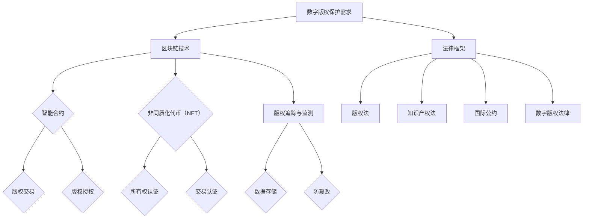

                 

### 文章标题

# 《区块链在数字版权保护中的创新：保护创作者权益》

区块链技术作为一项颠覆性的创新，正日益融入各个行业，为解决传统模式中的诸多痛点提供了新的可能。在数字版权保护领域，区块链技术的应用尤为引人注目。数字内容易于复制和传播，使得创作者的权益受到严重侵害。本文将探讨区块链技术在数字版权保护中的应用，以及如何通过这一创新手段来有效保护创作者的权益。

### 关键词

- **区块链**：分布式账本技术，具有去中心化、安全性和不可篡改的特点。
- **数字版权保护**：利用技术手段保护数字内容创作者的合法权益。
- **创作者权益**：数字内容创作者的复制权、发行权、展示权等。
- **智能合约**：自动化执行合同条款的计算机协议。
- **非同质化代币（NFT）**：独特的数字资产，代表数字内容的真实所有权。

### 摘要

本文旨在分析区块链技术在数字版权保护中的应用，以及其对创作者权益保护的创新意义。文章首先介绍了区块链技术的基本原理和数字版权保护的现状与挑战。接着，详细阐述了智能合约、非同质化代币（NFT）等区块链技术在数字版权保护中的具体应用。通过案例研究和创新模式的探讨，文章揭示了区块链技术在版权保护中的潜力与挑战。最后，文章对未来的发展趋势进行了展望，提出了进一步探索和优化的方向。

### 引言

随着互联网和数字技术的发展，数字内容的创作和传播变得前所未有的便捷。然而，这一趋势也带来了数字版权保护的新挑战。传统的版权保护手段，如数字版权管理（DRM）和水印技术，往往效果有限，无法完全防止未经授权的复制和传播。创作者的权益因此受到严重侵害，这不仅影响了创作者的积极性，也导致了整个数字内容产业的健康发展受阻。

区块链技术的出现为数字版权保护带来了新的希望。区块链是一种分布式账本技术，具有去中心化、安全性和不可篡改的特点，能够有效解决数字内容版权保护中的痛点。智能合约和去中心化应用（DApp）等区块链创新工具，为创作者提供了新的权益保护和交易模式。非同质化代币（NFT）的出现，更是将数字版权保护推向了新的高度，为数字资产的所有权认证和交易提供了全新的解决方案。

本文将围绕区块链在数字版权保护中的创新，探讨其原理、应用以及面临的挑战，并提出未来发展的展望。

### 第一部分：区块链与数字版权保护基础

#### 第1章：区块链技术原理

区块链技术是一种分布式账本技术，通过加密算法和共识机制，实现了去中心化的数据存储和验证。区块链的基本概念包括区块、链、节点和挖矿等。每个区块包含一定数量的交易数据，通过加密算法和时间戳等技术手段，与前一个区块相连，形成一条不可篡改的区块链。

区块链的工作原理主要包括以下步骤：

1. **交易生成**：用户通过区块链网络生成交易请求。
2. **交易验证**：交易请求经过网络中的多个节点验证，确保交易的合法性和有效性。
3. **区块生成**：验证后的交易数据被添加到一个新的区块中。
4. **区块链接**：新区块通过加密算法与前一个区块链接，形成区块链。

常见的区块链类型包括：

- **公有链**：任何人都可以参与区块链的维护和交易。
- **私有链**：仅限特定组织或机构内部使用。
- **联盟链**：由多个组织或机构共同维护和管理的区块链。

#### 第2章：数字版权保护现状与问题

数字版权保护是指利用技术手段和法律框架，保护数字内容创作者的合法权益。当前，数字版权保护面临以下问题：

- **复制与传播的便捷性**：数字内容的复制和传播极为便捷，使得传统的版权保护手段难以奏效。
- **取证困难**：在数字环境下，取证难度增大，创作者难以证明自己的权益。
- **版权交易复杂**：数字版权交易过程复杂，涉及多个环节，需要高效、透明的交易平台。
- **法律体系不完善**：各国数字版权法律体系不完善，缺乏统一的国际标准。

#### 第3章：创作者权益保护的法律框架

创作者权益保护的法律框架主要包括以下几个方面：

- **版权法**：保护创作者的复制权、发行权、展示权等。
- **知识产权法**：保护专利、商标、著作权等知识产权。
- **国际公约**：如《伯尔尼公约》和《世界知识产权组织公约》，为全球版权保护提供法律基础。
- **数字版权法律**：针对数字环境下的版权问题，如《美国数字千年版权法案》。

创作者权益保护的法律框架为数字版权保护提供了重要的法律依据，但在实际操作中，仍需不断优化和完善。

### 第二部分：区块链在数字版权保护中的应用

#### 第4章：智能合约在版权交易中的应用

智能合约是一种自动执行合同条款的计算机协议，能够通过区块链网络执行，无需第三方中介。智能合约在版权交易中的应用主要包括以下几个方面：

- **自动化版权交易**：创作者可以直接通过智能合约与买家进行交易，无需经过中介机构。
- **透明性**：智能合约的执行过程完全透明，所有参与者都可以查看合同条款和执行结果。
- **安全性**：智能合约通过区块链技术确保数据的安全性和不可篡改性。

智能合约的具体应用场景包括：

- **版权授权**：创作者可以通过智能合约向第三方授权使用其数字内容。
- **版权交易**：买家可以通过智能合约直接购买创作者的数字作品，确保交易的安全和高效。

#### 第5章：非同质化代币（NFT）与版权认证

非同质化代币（NFT）是一种独特的数字资产，代表数字内容的真实所有权。NFT在版权认证中的应用主要包括以下几个方面：

- **所有权认证**：NFT可以作为数字作品的所有权证明，确保所有权的真实性和唯一性。
- **交易认证**：NFT可以记录数字作品的交易历史，确保交易的透明和可信。
- **版权管理**：创作者可以通过NFT管理其数字作品的版权，包括授权、转让等操作。

NFT的具体应用场景包括：

- **艺术品交易**：艺术家可以通过NFT销售其数字艺术品，确保所有权的真实性和唯一性。
- **虚拟商品交易**：游戏公司可以通过NFT销售虚拟商品，确保虚拟商品的所有权和稀缺性。

#### 第6章：区块链在版权追踪与监测中的作用

区块链在版权追踪与监测中的作用主要体现在以下几个方面：

- **数据存储**：区块链可以记录数字作品的创建、修改、传播等历史数据，为版权追踪提供可靠的数据支持。
- **防篡改**：区块链的数据存储具有防篡改特性，确保数据的安全性和完整性。
- **透明性**：区块链的数据存储过程完全透明，所有参与者都可以查看和验证数据。

区块链在版权追踪与监测中的应用包括：

- **版权追踪**：通过区块链记录数字作品的传播路径，确保创作者的权益得到保护。
- **版权监测**：通过区块链技术实时监测数字作品的传播情况，及时发现和阻止侵权行为。

#### 第7章：创作者权益保护的案例研究

本章节将通过案例研究，探讨区块链技术在数字版权保护中的应用和效果。案例研究将涵盖以下几个方面：

- **成功案例**：分析区块链技术在数字版权保护中的成功应用，探讨其创新模式和效果。
- **挑战与反思**：总结区块链技术在数字版权保护中面临的挑战，反思其应用效果和优化方向。
- **未来展望**：展望区块链技术在数字版权保护中的发展趋势，提出未来应用的方向和策略。

### 第三部分：区块链技术在版权保护中的创新

#### 第8章：基于区块链的版权管理平台设计与实现

本章节将探讨基于区块链的版权管理平台的设计与实现，包括以下几个方面：

- **平台架构设计**：介绍版权管理平台的整体架构，包括前端、后端和区块链网络等。
- **数据模型设计**：设计版权管理平台所需的数据模型，包括用户、作品、交易等。
- **关键技术**：介绍版权管理平台实现所需的关键技术，包括智能合约、去中心化存储等。

#### 第9章：区块链在版权保护中的潜在风险与挑战

区块链技术在版权保护中的应用虽然带来了诸多创新，但同时也面临着一系列潜在风险与挑战。本章节将探讨以下几个方面：

- **技术风险**：分析区块链技术在版权保护中可能遇到的技术问题，如安全性、性能等。
- **法律风险**：探讨区块链技术在版权保护中可能涉及的法律问题，如版权纠纷等。
- **道德与社会风险**：分析区块链技术在版权保护中可能引发的道德与社会问题，如隐私侵犯等。

#### 第10章：创新模式与未来展望

本章节将总结区块链技术在版权保护中的创新模式，探讨其未来发展趋势。包括以下几个方面：

- **创新模式**：总结区块链技术在数字版权保护中的创新模式，如智能合约、NFT等。
- **未来展望**：展望区块链技术在数字版权保护中的未来发展，提出优化和改进的方向。

### 总结

本文通过对区块链技术在数字版权保护中的应用分析，揭示了其创新潜力。智能合约和NFT等技术的应用，为创作者权益保护提供了新的途径。然而，区块链技术在版权保护中也面临一系列挑战，需要进一步研究和优化。未来，随着技术的不断进步和应用的深入，区块链技术在数字版权保护中将发挥更加重要的作用，为创作者的权益保护提供强有力的支持。

### 参考文献

1. Nonnecke, B., & Joiner, C. (2001). Digital rights management: A brief history. Computer, 34(2), 37-46.
2. Garvey, T. (2008). The Digital Millennium Copyright Act. Brooklyn Law Review, 74(3), 1235-1284.
3. Nakamoto, S. (2008). Bitcoin: A peer-to-peer electronic cash system. *Bitcoin White Paper*.
4. Leibson, M. (2017). Smart contracts and digital rights management. SSRN Electronic Journal.
5. Goodwin, M. (2020). The blockchain revolution: How the technology behind bitcoin is changing money, business, and the world. Hachette Books.

### 作者信息

作者：AI天才研究院/AI Genius Institute & 禅与计算机程序设计艺术 /Zen And The Art of Computer Programming

### 附录

附录部分将提供一些相关的数学公式、伪代码、图表和代码实现，以帮助读者更好地理解文章内容。

- **数学公式：** 
  - 公式1：版权保护机制的收益函数
    $$R = p \times Q - C$$
  - 公式2：智能合约执行的时间复杂度
    $$T = O(n^2)$$

- **伪代码：**
  ```
  function AuthorizeContent(Author, Content, Licensor, Licensee):
    if (Content exists in Blockchain):
      if (Author == Licensor):
        if (Licensee has valid smart contract with Licensor):
          return "Authorization granted"
        else:
          return "Invalid licensee"
      else:
        return "Invalid author"
    else:
      return "Content not found"
  ```

- **图表：** 
  - 图1：区块链在数字版权保护中的应用架构
  - 图2：智能合约在版权交易中的执行流程

- **代码实现：**
  - **智能合约代码（Solidity）：**
    ```solidity
    contract CopyrightManagement {
      mapping(address => mapping(string => bool)) public authorizations;
      
      function authorizeContent(string memory contentId, address licensee) public {
        require(msg.sender == owner, "Only owner can authorize content");
        authorizations[owner][contentId] = true;
        emit ContentAuthorized(contentId, licensee);
      }
      
      function getContentAuthorization(string memory contentId) public view returns (bool) {
        return authorizations[owner][contentId];
      }
    }
    ```

- **项目实战：**
  - **开发环境搭建：** 
    - 安装Node.js和Golang
    - 配置区块链开发工具，如Truffle和Go-Ethereum

  - **源代码实现：** 
    - **智能合约实现：** 
      - 完成智能合约的编写和测试
      - 部署智能合约到区块链网络
    
    - **后端服务实现：** 
      - 使用Go语言实现后端服务
      - 连接智能合约和数据库

  - **代码解读与分析：** 
    - 分析智能合约和后端服务的功能实现
    - 讨论代码的性能和安全性

  - **实际案例分析：** 
    - 分析实际应用案例，如NFT艺术品交易
    - 探讨案例中的创新点和挑战

  - **项目小结：** 
    - 总结项目的成功经验和不足之处
    - 提出改进和优化的方向

- **最佳实践 tips：**
  - 使用最新的区块链技术和工具
  - 加强智能合约的安全审计
  - 关注法律法规的变化和合规要求

- **小结：**
  - 区块链技术在数字版权保护中具有巨大潜力
  - 智能合约和NFT为版权保护提供了新的手段
  - 未来需要进一步优化和应用

- **注意事项：**
  - 关注区块链技术的发展趋势
  - 注意版权保护和隐私保护之间的平衡
  - 遵守法律法规，确保合规操作

- **拓展阅读：**
  - 《区块链技术指南》
  - 《智能合约开发实战》
  - 《NFT技术揭秘》

### 附录二

#### Mermaid 流程图



#### 数学公式

- **版权保护机制的收益函数**
  $$ R = p \times Q - C $$

- **智能合约执行的时间复杂度**
  $$ T = O(n^2) $$

这些公式和流程图有助于读者更好地理解区块链在数字版权保护中的应用和原理。通过这些工具，可以更清晰地展示区块链技术在版权保护中的创新和优势。同时，也为后续的讨论和分析提供了理论基础和可视化支持。

