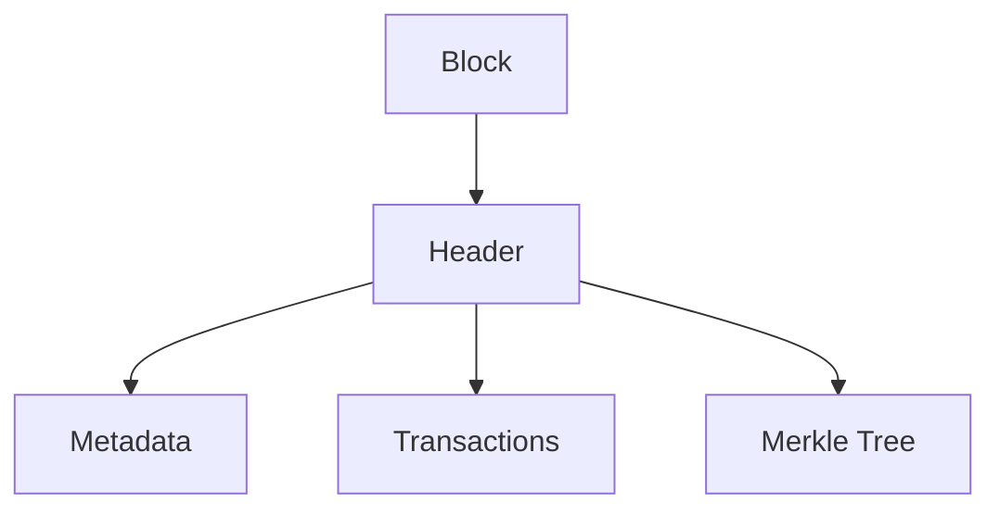
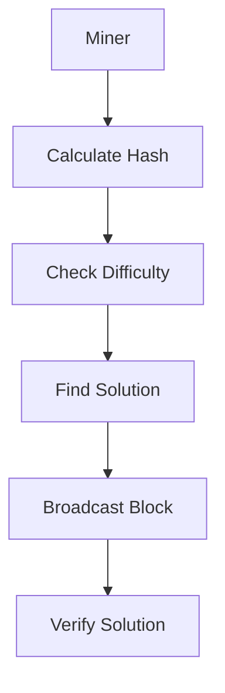
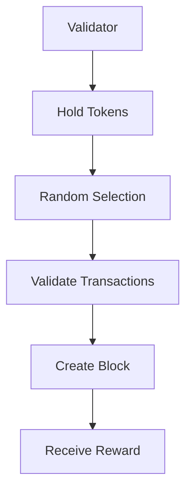
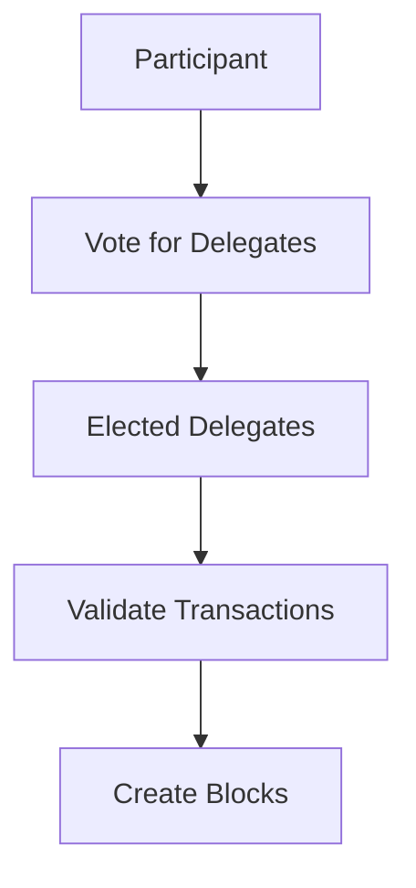

                 

### Blockchain in Digital Rights Management: Protecting Creator's Rights

#### Keywords:
- Blockchain
- Digital Rights Management
- Creator's Rights Protection
- Intellectual Property
- Decentralized Technologies

##### Abstract:
In the digital age, the management of digital content rights has become increasingly complex. Creators face numerous challenges in ensuring their work is properly attributed and compensated. Blockchain technology offers a promising solution by providing a decentralized and transparent platform for digital rights management. This article explores the fundamental concepts of blockchain and digital rights management, examines their core principles and interconnections, and delves into practical applications and solutions for protecting creator's rights.

#### 目录

1. **Introduction to Blockchain and Digital Rights Management**
   1.1 What is Blockchain?
      1.1.1 Blockchain Technology Overview
      1.1.2 Blockchain in the Digital Era
   1.2 Introduction to Digital Rights Management
      1.2.1 What is Digital Rights Management?
      1.2.2 The Challenges of DRM
   1.3 Blockchain and Digital Rights Management: A Synergy

2. **Blockchain Technology Basics**
   2.1 Understanding Blockchain
      2.1.1 Blockchain Structure
      2.1.2 Blockchain Consensus Mechanism
   2.2 Blockchain Applications in Digital Rights Management
      2.2.1 Blockchain in Content Distribution
      2.2.2 Blockchain in Intellectual Property Protection

3. **Core Concepts and Principles of Digital Rights Management**
   3.1 DRM Technologies
      3.1.1 Access Control Mechanisms
      3.1.2 Digital Watermarking
   3.2 DRM and Blockchain: Interconnections
      3.2.1 How Blockchain Enhances DRM
      3.2.2 Blockchain as a Trust Layer for DRM

4. **Blockchain Solutions for Digital Rights Management**
   4.1 Blockchain-Based DRM Systems
      4.1.1 Decentralized DRM Platforms
      4.1.2 Case Studies of Blockchain-Based DRM
   4.2 Implementing Blockchain in DRM
      4.2.1 Challenges and Solutions
      4.2.2 Future Trends in Blockchain-Based DRM

5. **Conclusion and Future Directions**
   5.1 Summary of Key Points
   5.2 Best Practices and Tips
   5.3 Final Thoughts and Recommendations
   5.4 Further Reading

### Introduction to Blockchain and Digital Rights Management

#### 1.1 What is Blockchain?

Blockchain technology was first introduced by an anonymous person or group of people under the pseudonym Satoshi Nakamoto in 2008. It is a decentralized and distributed ledger system that operates on a peer-to-peer network. Each block in the blockchain contains a list of transactions that are verified and added by network participants. Once a block is added, it is linked to the previous block, creating a chain of blocks, hence the name "blockchain".

Blockchain technology is built on several key components:

- **Blockchain Structure**: A blockchain consists of blocks that are linked together in chronological order. Each block contains a list of transactions, a timestamp, and a hash pointer to the previous block.

- **Consensus Mechanism**: Blockchain relies on a consensus mechanism to agree on the validity of transactions. Common mechanisms include Proof of Work (PoW), Proof of Stake (PoS), and Delegated Proof of Stake (DPoS).

- **Decentralization**: Unlike traditional centralized systems, blockchain operates on a decentralized network, meaning there is no single point of failure or control. This enhances security and reduces the risk of censorship or fraud.

Blockchain's decentralized nature and robust security mechanisms have attracted attention beyond the cryptocurrency space. It is now being explored for various applications, including digital rights management.

#### 1.1.1 Blockchain Technology Overview

Blockchain technology offers several advantages over traditional centralized systems. Firstly, it provides a transparent and tamper-proof ledger. Each transaction is recorded on the blockchain and is viewable to all participants in the network. This transparency makes it difficult for malicious actors to manipulate or alter the data.

Secondly, blockchain enhances security through its consensus mechanism. By requiring network participants to agree on the validity of transactions, blockchain prevents unauthorized changes to the ledger. This distributed consensus reduces the risk of fraud and enhances trust among participants.

Furthermore, blockchain's decentralized nature ensures that no single entity has control over the network. This decentralization not only increases security but also reduces the risk of censorship. In a centralized system, a single point of control can easily manipulate or block content. Blockchain removes this central point, allowing creators and consumers to transact directly with each other.

#### 1.1.2 Blockchain in the Digital Era

The digital era has brought about significant changes in how content is created, distributed, and consumed. With the rise of the internet, digital content has become ubiquitous, and traditional models of content distribution and monetization have been disrupted. This has created new challenges for content creators, who often struggle to monetize their work and protect their intellectual property.

Blockchain technology offers several solutions to these challenges. Firstly, it provides a transparent and immutable ledger that can be used to record and track digital content rights. This enables creators to prove ownership and control over their work, reducing the risk of infringement and unauthorized use.

Secondly, blockchain enables direct peer-to-peer transactions, eliminating the need for intermediaries. This allows creators to retain a larger share of the revenue from their work, as they can transact directly with consumers without the need for a third party.

Lastly, blockchain enhances security and trust in digital transactions. Its decentralized nature and robust consensus mechanism make it difficult for malicious actors to manipulate or alter the ledger. This enhances trust among participants and reduces the risk of fraud or theft.

Overall, blockchain technology has the potential to transform the digital content industry by providing a transparent, secure, and efficient platform for managing digital rights. As the digital era continues to evolve, blockchain is likely to play an increasingly important role in protecting creator's rights and enabling fair compensation for their work.

#### 1.2 Introduction to Digital Rights Management

#### 1.2.1 What is Digital Rights Management?

Digital Rights Management (DRM) refers to a set of technologies and practices designed to protect digital content from unauthorized access, use, and distribution. DRM aims to control how digital content is used and distributed, ensuring that creators and rights holders are compensated for their work.

DRM technologies can be broadly classified into two categories: access control mechanisms and usage control mechanisms.

- **Access Control Mechanisms**: These mechanisms restrict access to digital content based on user identity, device information, or other attributes. Examples include passwords, PIN codes, digital certificates, and biometric authentication.

- **Usage Control Mechanisms**: These mechanisms control how digital content is used, such as limiting the number of devices on which the content can be accessed, restricting copying or sharing, and enforcing expiration dates. Examples include digital watermarks, encryption, and digital rights licenses.

DRM technologies play a crucial role in the digital content industry, helping to protect creators' intellectual property, reduce piracy, and ensure fair compensation for their work. However, DRM has also faced criticism for limiting user freedom and accessibility, leading to a debate over the balance between content protection and user rights.

#### 1.2.2 The Challenges of DRM

While DRM technologies have been widely adopted to protect digital content, they also pose several challenges and drawbacks. One of the primary challenges is the potential for user inconvenience and frustration. Access control mechanisms such as passwords and PIN codes can be difficult to remember and may require multiple authentication steps, leading to a poor user experience.

Another challenge is the potential for circumvention and bypassing of DRM technologies. With the increasing availability of tools and techniques for breaking encryption and unlocking protected content, DRM systems can be easily compromised, undermining their effectiveness in protecting intellectual property.

Additionally, DRM technologies have been criticized for limiting user freedom and accessibility. Content owners may impose strict usage controls, such as limiting the number of devices on which content can be accessed or imposing expiration dates. These restrictions can be particularly problematic for users with disabilities or those who require long-term access to content.

Furthermore, the implementation of DRM can lead to a lack of transparency and accountability. In many cases, users are not aware of the specific terms and conditions under which they can access and use digital content. This lack of transparency can create a sense of mistrust and erode user satisfaction.

Overall, while DRM technologies offer important benefits in protecting digital content, they also pose significant challenges and drawbacks. Finding a balance between content protection and user rights remains a critical challenge in the digital content industry.

#### 1.3 Blockchain and Digital Rights Management: A Synergy

The emergence of blockchain technology presents a promising solution to the challenges faced by traditional Digital Rights Management (DRM) systems. Blockchain's decentralized and transparent nature can enhance the security and efficiency of DRM, while also addressing some of the drawbacks associated with current DRM practices.

One of the key advantages of blockchain in DRM is its ability to provide an immutable and tamper-proof ledger. Each transaction recorded on the blockchain is encrypted and linked to the previous block, creating a chain of blocks that is virtually impossible to alter or delete. This ensures that the ownership and rights associated with a digital asset are accurately recorded and can be verified by all participants in the network.

Blockchain also enables direct peer-to-peer transactions, eliminating the need for intermediaries. This allows creators to transact directly with consumers, retaining a larger share of the revenue from their work. In contrast, traditional DRM systems often involve multiple intermediaries, such as content distributors and payment processors, which can reduce the overall efficiency and fairness of the content monetization process.

Furthermore, blockchain enhances the security and trustworthiness of digital transactions. Its decentralized nature and robust consensus mechanism make it difficult for malicious actors to manipulate or alter the ledger, reducing the risk of fraud or theft. This increased security can help to deter piracy and unauthorized use of digital content, protecting the rights and interests of creators and rights holders.

Another key benefit of blockchain in DRM is its ability to provide transparent and auditable access control mechanisms. Blockchain-based smart contracts can be used to enforce usage rules and access permissions, ensuring that digital content is used in accordance with the terms and conditions set by the content owner. These smart contracts can also automatically trigger payments or other actions when certain conditions are met, further enhancing the efficiency and transparency of the DRM process.

In addition, blockchain can facilitate the creation of decentralized marketplaces for digital content, allowing creators to list and sell their work directly to consumers. These marketplaces can reduce the need for traditional intermediaries, lowering transaction costs and increasing the overall efficiency of the content distribution process.

Overall, the integration of blockchain technology with DRM offers a promising solution to many of the challenges faced by the digital content industry. By providing a secure, transparent, and efficient platform for managing digital rights, blockchain can help to protect the interests of creators and rights holders, while also enhancing the user experience and promoting fair compensation for their work.

### Blockchain Technology Basics

#### 2.1 Understanding Blockchain

Blockchain technology is a decentralized and distributed ledger system that operates on a peer-to-peer (P2P) network. It provides a secure and transparent way to record transactions and data, ensuring that all participants in the network have access to the same information. This makes blockchain an attractive technology for various applications, including digital rights management.

#### 2.1.1 Blockchain Structure

The structure of a blockchain can be visualized as a chain of blocks, where each block contains a list of transactions. These transactions are verified and added by network participants through a consensus mechanism, such as Proof of Work (PoW) or Proof of Stake (PoS).

Each block in the blockchain consists of several key components:

1. **Header**: The header contains metadata about the block, including the block number, timestamp, and hash pointer to the previous block. This creates a chain of blocks, ensuring that each block is linked to the previous one.
2. **Transactions**: The body of the block contains a list of transactions. These transactions are validated by network participants and added to the blockchain in chronological order.
3. **Merkle Tree**: The Merkle tree is a data structure that is used to efficiently and securely verify the integrity of the transactions in a block. It creates a unique hash for each transaction and links them together, forming a hierarchical structure.

The diagram below illustrates the structure of a blockchain:

#### 2.1.2 Blockchain Consensus Mechanism

The consensus mechanism is a critical component of blockchain technology. It ensures that all participants in the network agree on the validity of transactions and the state of the blockchain. There are various consensus mechanisms, each with its own advantages and disadvantages.

**Proof of Work (PoW)**

Proof of Work is one of the most commonly used consensus mechanisms. It requires network participants, known as miners, to solve a complex mathematical puzzle in order to validate transactions and add new blocks to the blockchain.

The process of solving the puzzle involves performing a large number of calculations, known as "hashing," to find a solution that satisfies specific criteria. Once a miner finds a valid solution, they broadcast the block to the network, and other miners verify its validity.

The difficulty of the puzzle is adjusted dynamically to maintain a consistent block generation rate. If the network is becoming too congested, the difficulty is increased, making it more difficult to find a valid solution. Conversely, if the network is underutilized, the difficulty is reduced.

The diagram below illustrates the PoW consensus mechanism:

**Proof of Stake (PoS)**

Proof of Stake is an alternative consensus mechanism that aims to reduce the energy consumption and computational overhead associated with Proof of Work. In PoS, network participants, known as validators, are chosen to validate transactions and create new blocks based on the number of tokens they hold and are willing to "stake" as collateral.

Validators are selected randomly or based on a combination of randomization and wealth, ensuring that those with a higher stake in the network have a higher probability of being selected. Once a validator is selected, they validate transactions and create a new block, receiving a reward in return.

The diagram below illustrates the PoS consensus mechanism:

**Delegated Proof of Stake (DPoS)**

Delegated Proof of Stake is a variant of PoS that aims to further improve the efficiency and scalability of blockchain networks. In DPoS, network participants vote for a small group of delegates who are responsible for validating transactions and creating new blocks.

Participants with more votes have a greater say in the selection of delegates. Once the delegates are elected, they take turns validating transactions and creating blocks, ensuring that the network operates smoothly and efficiently.

The diagram below illustrates the DPoS consensus mechanism:

In summary, the consensus mechanism is a crucial aspect of blockchain technology, ensuring that all participants in the network agree on the validity of transactions and the state of the blockchain. Understanding the different consensus mechanisms and their respective advantages and disadvantages is essential for effectively utilizing blockchain technology in various applications, including digital rights management.

#### 2.2 Blockchain Applications in Digital Rights Management

Blockchain technology has the potential to revolutionize the digital rights management (DRM) landscape by addressing many of the challenges faced by traditional DRM systems. By leveraging its decentralized and transparent nature, blockchain can provide a secure, tamper-proof, and efficient platform for managing digital content rights. Here are some key applications of blockchain in DRM:

**1. Transparent and Immutable Record-Keeping**

One of the primary benefits of blockchain in DRM is its ability to provide a transparent and immutable ledger for recording digital content rights. Each time a new transaction or transfer of rights occurs, it is recorded on the blockchain and linked to the previous transaction, creating a chronological and tamper-proof history of ownership and usage. This transparency ensures that all participants in the network can verify the authenticity and legitimacy of the digital assets and their associated rights.

**2. Decentralized Content Distribution**

Blockchain enables direct peer-to-peer (P2P) content distribution, eliminating the need for intermediaries. This decentralization not only reduces the complexity and costs associated with traditional content distribution models but also enhances security and trust. With blockchain, content creators can directly sell their work to consumers, retaining a larger share of the revenue. This decentralized approach also reduces the risk of content being tampered with or censored by intermediaries.

**3. Smart Contracts for Access Control**

Blockchain-based smart contracts can be used to enforce access control mechanisms for digital content. Smart contracts are self-executing contracts with the terms of the agreement directly written into code. When specific conditions are met, the smart contract can automatically release the content or grant access to authorized users. This ensures that content is distributed only to those who have paid for it or have the necessary permissions, reducing the risk of unauthorized access and piracy.

**4. Non-Repudiation and Accountability**

Blockchain technology ensures non-repudiation, meaning that once a transaction is recorded on the blockchain, the sender cannot deny their involvement in the transaction. This feature is crucial for DRM, as it allows creators and rights holders to prove ownership and prevent disputes over intellectual property rights. Furthermore, blockchain's decentralized nature and transparent ledger make it easier to trace and hold accountable those who violate digital content rights.

**5. Digital Watermarking and Provenance Tracking**

Blockchain can be combined with digital watermarking technologies to create an immutable and transparent record of the origin and history of digital content. Digital watermarks can be used to embed unique identifiers or metadata into the content, which can then be recorded on the blockchain. This allows creators to track the provenance of their work and prove ownership in the event of infringement or unauthorized use.

**6. Interoperability and Standardization**

Blockchain can facilitate interoperability and standardization across different digital content platforms and systems. By providing a common platform for recording and managing digital rights, blockchain can help to streamline content licensing, distribution, and monetization processes across different platforms and industries.

**7. Smart Licensing and Royalty Management**

Blockchain-based smart contracts can be used to create and manage smart licenses, automatically enforcing usage rules and distributing royalties to content creators and rights holders. This ensures that creators are fairly compensated for their work and can easily monitor and manage their intellectual property.

In summary, blockchain technology offers numerous applications in digital rights management, providing a secure, transparent, and efficient platform for managing digital content rights. By leveraging its decentralized nature and robust consensus mechanisms, blockchain can address many of the challenges faced by traditional DRM systems and help to protect the rights and interests of creators and rights holders in the digital age.

### Core Concepts and Principles of Digital Rights Management

#### 3.1 DRM Technologies

Digital Rights Management (DRM) is a comprehensive set of technologies and strategies designed to protect digital content from unauthorized access, use, and distribution. At its core, DRM aims to control and manage how digital assets are accessed, shared, and used by end-users. DRM technologies can be broadly categorized into access control mechanisms and usage control mechanisms.

#### 3.1.1 Access Control Mechanisms

Access control mechanisms are designed to restrict access to digital content based on user identity, device information, or other attributes. These mechanisms ensure that only authorized users can access and use digital assets. Some common access control mechanisms include:

- **User Authentication**: This involves verifying the identity of users before granting them access to digital content. Common authentication methods include passwords, PIN codes, digital certificates, and biometric authentication (such as fingerprint or facial recognition).

- **Access Tokens**: Access tokens are cryptographic tokens that are used to authenticate and authorize users to access digital content. These tokens are typically generated by an authentication server and are required to be presented whenever access to a protected resource is requested.

- **Device Authentication**: Device authentication involves verifying the identity and authenticity of the device from which a user is attempting to access digital content. This can be done through hardware-based authentication, such as Trusted Platform Modules (TPM), or through software-based methods, such as digital signatures.

- **Context-Based Authentication**: This mechanism involves using contextual information, such as the user's location, device type, or network connection, to determine whether access to digital content should be granted. For example, a user may be granted access to a premium version of an app if they are connected to a trusted network.

#### 3.1.2 Usage Control Mechanisms

Usage control mechanisms are designed to enforce usage rules and restrictions on digital content. These mechanisms ensure that digital assets are used in accordance with the terms and conditions set by the content owner. Some common usage control mechanisms include:

- **Copy Protection**: This involves preventing unauthorized copying or reproduction of digital content. Copy protection techniques include encryption, digital watermarks, and cryptographic licensing.

- **Time-Limited Access**: This mechanism restricts access to digital content for a specified period. Once the access period expires, users can no longer access the content. This is commonly used for trial versions of software or access to premium content.

- **Geo-Fencing**: This mechanism restricts access to digital content based on the user's geographic location. This is often used to comply with regional licensing agreements or to prevent the unauthorized distribution of content in certain regions.

- **Device-Locking**: This mechanism restricts access to digital content to specific devices. For example, a user may be allowed to access a piece of software only from their personal computer or smartphone. This prevents the unauthorized sharing of licenses or content between different devices.

- **Digital Watermarking**: This mechanism involves embedding unique identifiers or metadata into digital content, making it easier to trace and identify unauthorized use or distribution. Digital watermarks can be visual, audio, or invisible and are often used in combination with other DRM techniques.

#### 3.1.3 Integration and Effectiveness

The effectiveness of DRM technologies depends on their integration and the extent to which they are enforced. For example, using a combination of access control and usage control mechanisms can provide a more robust level of protection for digital content. Additionally, the enforcement of DRM policies must be consistent and transparent to users to minimize the risk of circumvention and user frustration.

While DRM technologies have been widely adopted to protect digital content, they also face significant challenges. Users may find DRM mechanisms overly restrictive, leading to a negative user experience and potential legal challenges. Furthermore, DRM technologies can be circumvented through various techniques, such as reverse-engineering or the use of unauthorized software tools.

In conclusion, DRM technologies play a crucial role in protecting digital content and ensuring that creators and rights holders are fairly compensated for their work. By understanding and effectively integrating access control and usage control mechanisms, content owners can create a more secure and user-friendly digital environment.

#### 3.2 DRM and Blockchain: Interconnections

Blockchain technology offers a transformative approach to digital rights management (DRM) by addressing several limitations inherent in traditional DRM systems. The decentralized, transparent, and immutable nature of blockchain can enhance the security, trust, and efficiency of DRM, creating a more robust and user-friendly ecosystem for managing digital content rights.

**3.2.1 How Blockchain Enhances DRM**

One of the primary advantages of blockchain in DRM is its ability to provide a transparent and tamper-proof ledger for recording digital content rights. Traditional DRM systems often rely on centralized databases, which are vulnerable to tampering or unauthorized access. In contrast, blockchain's distributed nature ensures that all transactions and rights assignments are recorded across a network of independent nodes, making it extremely difficult for any single entity to alter the data.

Furthermore, blockchain enhances the security of DRM through its robust consensus mechanisms. In a blockchain network, all transactions are validated by multiple participants, known as validators, through a process known as consensus. This ensures that only valid and legitimate transactions are added to the blockchain, reducing the risk of fraud or unauthorized access.

Another key advantage of blockchain in DRM is its ability to facilitate direct peer-to-peer (P2P) transactions, eliminating the need for intermediaries. Traditional DRM systems often involve multiple intermediaries, such as content distributors and payment processors, which can increase the complexity and cost of content distribution. Blockchain enables content creators to transact directly with consumers, reducing transaction costs and increasing the overall efficiency of the content monetization process.

**3.2.2 Blockchain as a Trust Layer for DRM**

Blockchain serves as a trust layer for DRM by providing a transparent and auditable platform for recording and managing digital content rights. This trust layer is particularly important in an era where digital content is often shared and distributed across multiple platforms and networks. Blockchain ensures that all participants in the network have access to the same, immutable, and transparent information, reducing the risk of disputes and fraud.

Blockchain's smart contract functionality further enhances its role as a trust layer in DRM. Smart contracts are self-executing contracts with the terms of the agreement directly written into code. These contracts can automatically enforce usage rules and access permissions for digital content, ensuring that content is distributed and used in accordance with the terms set by the content owner. This automation reduces the need for manual intervention and minimizes the risk of human error.

**3.2.3 Enhancing Security and Accountability**

Blockchain technology enhances the security and accountability of DRM through its decentralized and transparent nature. Traditional DRM systems often rely on a centralized authority to validate and enforce content rights, creating a single point of failure and potential for abuse. In contrast, blockchain's distributed nature ensures that no single entity has control over the network, reducing the risk of censorship, tampering, or fraud.

Blockchain also provides a tamper-proof ledger, ensuring that all transactions and rights assignments are recorded in a way that cannot be altered or deleted. This immutable ledger allows content creators and rights holders to prove ownership and control over their work, reducing the risk of infringement and unauthorized use.

Moreover, blockchain's transparent and auditable nature enables all participants in the network to verify the authenticity and legitimacy of digital content rights. This transparency builds trust and accountability, as all transactions and rights assignments are recorded in a publicly accessible ledger.

**3.2.4 Addressing the Challenges of DRM**

Blockchain technology also addresses several challenges faced by traditional DRM systems. For example, blockchain can facilitate interoperability and standardization across different digital content platforms and systems, streamlining content licensing, distribution, and monetization processes. Blockchain's smart contract functionality can be used to create and enforce smart licenses, automatically managing content access and royalty distribution.

Furthermore, blockchain can help to improve the user experience by reducing the complexity and inconvenience associated with traditional DRM systems. By enabling direct P2P transactions and automating access control mechanisms, blockchain can provide a more seamless and user-friendly digital content experience.

In summary, blockchain technology offers a transformative approach to digital rights management by enhancing security, transparency, and efficiency. As a trust layer, blockchain can provide a transparent and immutable platform for recording and managing digital content rights, addressing the limitations of traditional DRM systems and creating a more secure and user-friendly ecosystem for managing digital content in the digital age.

### Blockchain Solutions for Digital Rights Management

Blockchain technology has the potential to revolutionize the digital rights management (DRM) landscape by offering secure, transparent, and efficient solutions for managing digital content rights. In this section, we will explore various blockchain-based DRM systems and their practical applications in the real world.

#### 4.1.1 Decentralized DRM Platforms

Decentralized DRM platforms leverage the power of blockchain to provide secure and transparent content distribution while eliminating the need for intermediaries. These platforms enable content creators to manage and distribute their digital assets directly to consumers, retaining a larger share of the revenue.

**IPFS (InterPlanetary File System)**

One of the most prominent decentralized DRM platforms is the InterPlanetary File System (IPFS). IPFS is a protocol for storing and sharing files in a distributed file system. By leveraging blockchain technology, IPFS ensures that files are stored in a decentralized manner, making them highly resilient to censorship and tampering.

**Key advantages of IPFS for DRM:**

- **Decentralization**: IPFS distributes files across a network of nodes, ensuring that content is not stored in a single location, which reduces the risk of censorship and data loss.
- **Immutability**: Files stored on IPFS are immutable, meaning they cannot be altered or deleted without the consensus of the network.
- **Permanent Linkability**: IPFS provides a unique identifier (CID) for each file, enabling creators to establish a permanent link to their content, which can be used for verification and tracking.

**Case Study: Siacoin**

Siacoin is a decentralized storage platform that uses blockchain technology to provide secure and affordable storage solutions. Siacoin combines blockchain's security and decentralization with advanced cryptographic techniques to protect digital content from unauthorized access and tampering.

**Key advantages of Siacoin for DRM:**

- **Security**: Siacoin uses end-to-end encryption to secure data, ensuring that only authorized parties can access the content.
- **Decentralization**: By distributing data across a network of nodes, Siacoin reduces the risk of data breaches and censorship.
- **Affordability**: Siacoin offers competitive pricing for storage, making it an attractive option for content creators looking to reduce storage costs.

**Case Study: Mad Movie Minutes**

Mad Movie Minutes is a decentralized movie distribution platform that leverages blockchain technology to enable creators to directly monetize their work. The platform allows users to buy, sell, and rent movies using cryptocurrencies, eliminating the need for traditional intermediaries.

**Key advantages of Mad Movie Minutes for DRM:**

- **Direct Monetization**: Mad Movie Minutes enables creators to retain a larger share of the revenue from their work by eliminating intermediaries.
- **Transparency**: All transactions and ownership records are recorded on the blockchain, ensuring transparency and trust.
- **Security**: Blockchain technology ensures that movies are securely distributed and accessible only to authorized users.

#### 4.1.2 Implementing Blockchain in DRM

Implementing blockchain technology in DRM involves several challenges and considerations. However, the potential benefits of blockchain-based DRM systems make it a promising area for innovation and development.

**4.1.2.1 Challenges**

- **Scalability**: Blockchain networks can face scalability issues as the number of transactions and participants increases. This can lead to delays in processing transactions and increased costs.
- **User Adoption**: Blockchain technology is relatively new, and widespread user adoption may be challenging. Educating users about the benefits and usability of blockchain-based DRM systems is crucial.
- **Interoperability**: Integrating blockchain-based DRM systems with existing content distribution platforms and systems can be complex and require significant effort.

**4.1.2.2 Solutions**

- **Layer 2 Solutions**: Layer 2 solutions, such as Lightning Network for Bitcoin, can help improve scalability by processing transactions off the main blockchain. These solutions can reduce the load on the main network and improve transaction speeds.
- **Educational Initiatives**: Implementing educational initiatives to raise awareness about blockchain technology and its benefits for DRM can help drive user adoption. This can include workshops, tutorials, and online resources.
- **Standardization**: Developing and adopting industry standards for blockchain-based DRM systems can help ensure interoperability and ease of integration with existing platforms and systems.

In conclusion, blockchain technology offers promising solutions for digital rights management, providing secure, transparent, and efficient platforms for managing digital content rights. By addressing the challenges and leveraging the potential benefits of blockchain, content creators and rights holders can protect their work and ensure fair compensation in the digital age.

### Implementing Blockchain in DRM

#### 4.2.1 Challenges and Solutions

Implementing blockchain technology in Digital Rights Management (DRM) presents several challenges that must be addressed to ensure the effectiveness and security of the system. These challenges include scalability, user adoption, interoperability, and the technical complexity of integrating blockchain with existing DRM infrastructure. Below, we will discuss these challenges and potential solutions for overcoming them.

**1. Scalability**

One of the primary challenges of implementing blockchain in DRM is scalability. Blockchain networks can face performance issues as the number of transactions and participants increases. This can lead to slower transaction times and increased costs. Traditional blockchain networks, such as Bitcoin and Ethereum, have been criticized for their limited scalability due to the limitations of their underlying consensus mechanisms.

**Solution**: To address scalability, layer 2 solutions can be utilized. Layer 2 protocols, such as the Lightning Network for Bitcoin and Rollups for Ethereum, allow for off-chain transactions to be processed, which significantly reduces the load on the main blockchain network. These solutions can improve transaction speeds and reduce costs, making blockchain-based DRM systems more scalable and efficient.

**2. User Adoption**

Another significant challenge is user adoption. Blockchain technology is relatively new, and many users may not be familiar with its benefits or how to interact with blockchain-based platforms. This can hinder the widespread adoption of blockchain-based DRM systems.

**Solution**: To encourage user adoption, educational initiatives are essential. Providing tutorials, workshops, and online resources to help users understand blockchain technology and its applications in DRM can help build awareness and familiarity. Additionally, designing user-friendly interfaces and integrating blockchain-based DRM systems with existing platforms can make it easier for users to interact with and adopt these systems.

**3. Interoperability**

Interoperability is another critical challenge. Integrating blockchain-based DRM systems with existing content distribution platforms and DRM infrastructures can be complex and require significant effort. Ensuring that different platforms and systems can communicate and work together seamlessly is essential for the successful implementation of blockchain-based DRM.

**Solution**: Developing and adopting industry standards for blockchain-based DRM systems can help ensure interoperability. Standardization can simplify integration and make it easier for different platforms and systems to work together. Additionally, leveraging blockchain interoperability protocols, such as cross-chain communication, can enable seamless integration between different blockchain networks and platforms.

**4. Technical Complexity**

Implementing blockchain technology in DRM also involves technical complexity. Developing and maintaining a blockchain-based DRM system requires expertise in blockchain development, cryptography, and distributed systems. This can be a significant barrier for organizations without the necessary technical skills and resources.

**Solution**: Partnering with experienced blockchain developers and consultants can help overcome technical complexity. Collaborating with experts in blockchain technology can provide the necessary knowledge and support to develop and maintain a robust blockchain-based DRM system. Additionally, open-source blockchain frameworks and platforms can provide a starting point and resources for building blockchain-based applications.

**5. Regulatory Compliance**

Regulatory compliance is another consideration when implementing blockchain-based DRM systems. Compliance with data protection and privacy regulations, such as GDPR and CCPA, is essential to ensure that the system adheres to legal requirements and builds trust with users.

**Solution**: Ensuring compliance with relevant regulations requires a thorough understanding of the legal landscape and ongoing monitoring of changes in regulations. Working with legal experts and staying up-to-date with regulatory developments can help ensure that blockchain-based DRM systems are compliant and secure.

In conclusion, while implementing blockchain technology in DRM presents several challenges, these challenges can be addressed through a combination of technical solutions, educational initiatives, and compliance efforts. By overcoming these challenges, blockchain-based DRM systems can provide secure, transparent, and efficient solutions for managing digital content rights, benefiting both creators and consumers.

#### 4.2.2 Future Trends in Blockchain-Based DRM

The landscape of Digital Rights Management (DRM) is rapidly evolving, with blockchain technology emerging as a promising solution to address the challenges faced by traditional DRM systems. As the technology matures and gains wider acceptance, several future trends are likely to shape the development and implementation of blockchain-based DRM solutions.

**1. Enhanced Scalability and Performance**

One of the key trends in blockchain-based DRM is the ongoing improvement in scalability and performance. With the increasing number of transactions and participants, the scalability of blockchain networks will become increasingly important. Innovations such as Layer 2 solutions, sharding, and sidechains are expected to play a crucial role in enhancing the scalability of blockchain networks. These solutions will enable blockchain-based DRM systems to handle a larger volume of transactions and users, making them more practical for widespread adoption.

**2. Integration with Emerging Technologies**

The integration of blockchain-based DRM with other emerging technologies is another important trend. For example, the combination of blockchain with Internet of Things (IoT) devices can provide secure and transparent management of digital rights for content distributed to IoT devices. Additionally, advancements in decentralized finance (DeFi) and non-fungible tokens (NFTs) are likely to have a significant impact on the DRM landscape. DeFi protocols can enable more flexible and transparent royalty management, while NFTs can provide a new way to verify and authenticate digital assets.

**3. Enhanced User Experience**

To drive wider adoption, blockchain-based DRM solutions will need to prioritize enhancing the user experience. This includes designing user-friendly interfaces and integrating blockchain technology seamlessly with existing content platforms and systems. User education will also play a crucial role in this trend, with educational initiatives aimed at raising awareness about the benefits and functionalities of blockchain-based DRM.

**4. Regulatory Compliance and Standardization**

As blockchain-based DRM systems become more prevalent, regulatory compliance and standardization will become increasingly important. Developing and adopting industry standards for blockchain-based DRM can help ensure interoperability and streamline integration with existing content management systems. Additionally, ensuring compliance with data protection and privacy regulations will be essential to build trust with users and stakeholders.

**5. Cross-Industry Collaborations**

Cross-industry collaborations will be crucial in driving the adoption and development of blockchain-based DRM solutions. Collaborations between content creators, technology providers, and policymakers can help address common challenges, develop best practices, and promote the adoption of blockchain-based DRM systems. These collaborations can also foster innovation and accelerate the development of new solutions and technologies.

In conclusion, the future of blockchain-based DRM is promising, with ongoing advancements in technology, improved scalability, enhanced user experience, and regulatory compliance expected to drive widespread adoption. As the technology continues to evolve, it will play an increasingly important role in securing digital content rights and enabling fair compensation for creators in the digital age.

### Conclusion and Future Directions

Blockchain technology has emerged as a transformative force in the realm of Digital Rights Management (DRM), offering a secure, transparent, and efficient framework for managing digital content rights. By leveraging its decentralized nature and robust consensus mechanisms, blockchain can address many of the challenges faced by traditional DRM systems, such as censorship, fraud, and unauthorized access.

**Key Points Recap:**

1. **Transparency and Immutability**: Blockchain provides a transparent and immutable ledger for recording digital content rights, ensuring that all transactions and rights assignments are accurately recorded and tamper-proof.

2. **Direct Peer-to-Peer Transactions**: Blockchain enables direct peer-to-peer transactions, eliminating the need for intermediaries and allowing content creators to retain a larger share of the revenue from their work.

3. **Enhanced Security**: Blockchain's robust consensus mechanisms and decentralized nature enhance the security and trustworthiness of digital transactions, reducing the risk of fraud and unauthorized access.

4. **Smart Contracts**: Blockchain-based smart contracts can be used to enforce access control and usage rules, automating the DRM process and ensuring that digital content is distributed and used in accordance with the terms set by the content owner.

5. **Interoperability and Standardization**: Blockchain can facilitate interoperability and standardization across different digital content platforms and systems, streamlining content licensing, distribution, and monetization processes.

As we look to the future, several trends are likely to shape the development of blockchain-based DRM solutions. These include enhanced scalability and performance, integration with emerging technologies such as IoT and DeFi, improved user experience, and greater regulatory compliance.

**Best Practices and Tips:**

- **Educational Initiatives**: To drive user adoption, organizations should invest in educational initiatives to raise awareness about blockchain technology and its benefits for DRM.

- **User-Friendly Interfaces**: Designing intuitive and user-friendly interfaces can enhance the user experience and make blockchain-based DRM solutions more accessible to a wider audience.

- **Cross-Industry Collaboration**: Cross-industry collaborations can help address common challenges and accelerate the development of new solutions and technologies in the DRM space.

- **Regulatory Compliance**: Ensuring compliance with data protection and privacy regulations is crucial to build trust with users and stakeholders.

In conclusion, blockchain technology offers significant potential for revolutionizing the DRM landscape. By addressing the challenges of traditional DRM systems and providing a secure, transparent, and efficient platform for managing digital content rights, blockchain can help protect the interests of creators and rights holders in the digital age. As the technology continues to evolve, it will play an increasingly important role in shaping the future of digital content management and monetization.

### Final Thoughts and Recommendations

In conclusion, blockchain technology has proven to be a transformative force in the realm of Digital Rights Management (DRM). By providing a secure, transparent, and efficient framework for managing digital content rights, blockchain addresses many of the challenges faced by traditional DRM systems. The decentralized nature of blockchain ensures that digital content rights are accurately recorded and tamper-proof, while its robust consensus mechanisms enhance security and trust.

As we look to the future, there are several key areas where further research and development are needed to maximize the potential of blockchain-based DRM solutions. These include:

1. **Scalability and Performance**: To accommodate the growing volume of digital content and users, ongoing advancements in blockchain scalability and performance are essential. Innovations such as Layer 2 solutions and sharding will play a crucial role in enhancing the scalability of blockchain networks.

2. **User Adoption and Experience**: To drive widespread adoption, it is important to focus on enhancing the user experience by designing intuitive and user-friendly interfaces. Educational initiatives to raise awareness about blockchain technology and its benefits for DRM will also be critical in driving user adoption.

3. **Regulatory Compliance and Standardization**: Ensuring compliance with data protection and privacy regulations is crucial to build trust with users and stakeholders. Developing and adopting industry standards for blockchain-based DRM will streamline integration with existing content management systems and promote interoperability.

4. **Cross-Industry Collaboration**: Cross-industry collaborations can help address common challenges and foster innovation in the DRM space. By working together, content creators, technology providers, and policymakers can develop best practices and accelerate the adoption of blockchain-based DRM solutions.

**Further Reading:**

- **"Blockchain: A Practical Guide to Developing Business, Law, and Technology Solutions" by Dr. Andreas M. Antonopoulos**
- **"Digital Rights Management: Business and Legal Aspects" by Dr. Thomas J. Sander**
- **"The Blockchain Economy: Theory, Analysis, and Use Cases" by Dr. Maurice McCown**

By exploring these areas and leveraging the potential of blockchain technology, we can create a more secure and efficient digital content management ecosystem that protects the rights and interests of creators and rights holders in the digital age.

