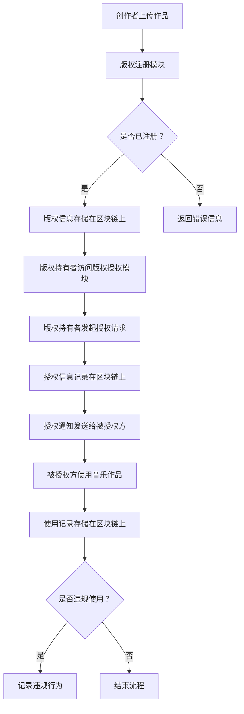

                 


### 引言与背景

#### 1. 区块链技术概述

区块链是一种分布式账本技术，其核心特点包括去中心化、不可篡改和透明性。自2008年比特币的诞生以来，区块链技术经历了快速的发展，并在金融、供应链管理、医疗等多个领域得到了广泛应用。区块链通过将数据分散存储在多个节点上，从而避免了单点故障和数据篡改的风险，实现了信息的高效传递和验证。

#### 2. 数字版权管理概述

数字版权管理（Digital Rights Management，简称DRM）是一种技术，旨在保护数字作品的所有权，防止未经授权的复制、分发和使用。随着互联网和数字媒体的普及，数字版权管理变得尤为重要。然而，当前数字版权管理面临诸多挑战，如版权追踪困难、侵权行为泛滥、版权收益分配不均等。

#### 3. 区块链在数字版权管理中的应用

区块链技术为数字版权管理提供了一种新的解决方案。通过区块链，数字作品的所有权和授权信息可以实时记录、验证和跟踪，确保版权的透明性和安全性。此外，智能合约的引入使得版权授权和交易过程自动化，提高了效率，减少了纠纷。

### 关键词

区块链、数字版权管理、智能合约、分布式账本、版权追踪、版权交易

### 摘要

本文旨在探讨区块链在数字版权管理中的应用，特别是音乐版权智能分发系统的设计与实现。文章首先介绍了区块链和数字版权管理的基本概念，然后详细阐述了区块链在数字版权管理中的优势和应用场景。接着，文章通过一个实际案例，展示了如何利用区块链技术构建音乐版权智能分发系统，包括系统架构设计、核心算法原理讲解、数学模型与公式以及项目实战等内容。最后，文章总结了区块链在数字版权管理中的潜在影响，并展望了未来的发展趋势。

---

### 第一部分：引言与背景

#### 第1章：区块链技术概述

**1.1 区块链的定义与特点**

区块链是一种去中心化的分布式数据库系统，它通过加密算法和共识机制，实现了数据的存储、传输和验证。每个区块包含一定数量的交易记录，通过哈希函数和链接方式，将区块连接成一个链式数据结构。区块链的核心特点包括：

1. **去中心化**：数据存储在多个节点上，不存在中央控制点，从而避免了单点故障和集中化的风险。
2. **不可篡改**：区块链上的数据一旦被记录，便不可篡改，除非获得全网超过一半节点的同意。
3. **透明性**：区块链上的交易记录对所有节点可见，确保了数据的公开和透明。

**1.2 区块链的发展历程**

区块链技术的发展可以追溯到2008年，当时中本聪（Satoshi Nakamoto）发表了比特币白皮书，首次提出了区块链的概念。比特币作为第一个基于区块链技术的数字货币，迅速引起了广泛关注。随后，越来越多的区块链项目和加密货币相继出现，如以太坊、EOS等。

**1.3 区块链的核心概念**

1. **区块**：区块是区块链的基本组成单元，包含一定数量的交易记录和区块头。
2. **链**：链是由多个区块按照特定规则连接而成的数据结构。
3. **节点**：节点是区块链网络中的计算实体，负责存储数据、验证交易和参与共识过程。
4. **加密算法**：加密算法用于确保区块链数据的隐私性和安全性。
5. **共识机制**：共识机制是节点之间就数据一致性达成一致的方法，如工作量证明（PoW）、权益证明（PoS）等。

#### 第2章：数字版权管理概述

**2.1 数字版权管理的定义与重要性**

数字版权管理（Digital Rights Management，简称DRM）是一种技术，旨在保护数字作品的所有权和合法权益。随着数字内容的迅速增长，DRM变得尤为重要。它不仅可以防止未经授权的复制和分发，还可以实现版权的追踪和管理。

**2.2 当前数字版权管理的挑战**

1. **版权追踪困难**：在传统的版权管理方式中，数字作品的追踪和认证变得困难。
2. **侵权行为泛滥**：互联网和数字媒体的普及，使得侵权行为更加容易发生。
3. **版权收益分配不均**：当前很多数字版权管理机制无法公平地分配版权收益，导致创作者和平台之间的矛盾。

**2.3 数字版权管理的目标**

1. **保护版权**：确保数字作品的所有权得到有效保护。
2. **追踪与管理**：实现数字作品的全程追踪和管理。
3. **促进创新**：通过激励创作者，促进数字内容的创新和发展。
4. **提高用户体验**：为用户提供便捷、安全的内容获取和使用体验。

#### 第3章：区块链在数字版权管理中的应用

**3.1 区块链在数字版权管理中的优势**

1. **去中心化**：去中心化结构确保了版权数据的公开透明，避免了单点故障的风险。
2. **不可篡改**：区块链上的数据一旦记录，便不可篡改，确保了版权信息的真实性和完整性。
3. **安全可靠**：加密算法和共识机制保障了区块链数据的安全性和可靠性。
4. **高效便捷**：智能合约实现了版权授权和交易的自动化，提高了效率，降低了成本。

**3.2 区块链在数字版权管理中的应用场景**

1. **版权追踪与认证**：通过区块链记录数字作品的所有权和授权信息，实现全程追踪和认证。
2. **版权交易**：利用区块链实现数字作品的交易过程，确保交易的透明性和安全性。
3. **版权收益分配**：通过智能合约实现版权收益的自动化分配，确保创作者和平台之间的公平分配。
4. **版权纠纷解决**：利用区块链上的数据记录和智能合约，快速、公正地解决版权纠纷。

通过以上分析，我们可以看到区块链技术在数字版权管理中具有巨大的潜力。接下来，本文将深入探讨区块链在音乐版权智能分发系统中的应用，展示其具体的架构和实现过程。

---

### 第1章：区块链技术概述

区块链是一种分布式账本技术，其核心特点在于去中心化、不可篡改和透明性。在本文中，我们将详细讨论区块链的定义与特点、发展历程以及核心概念。

#### 1.1 区块链的定义与特点

区块链是一种去中心化的分布式数据库系统，通过加密算法和共识机制，实现了数据的存储、传输和验证。每个区块包含一定数量的交易记录和区块头，通过哈希函数和链接方式，将区块连接成一个链式数据结构。区块链的核心特点如下：

1. **去中心化**：与传统的中心化数据库不同，区块链不存在中央控制点，数据存储在多个节点上。这种去中心化结构确保了数据的公开透明，避免了单点故障的风险。

2. **不可篡改**：区块链上的数据一旦被记录，便不可篡改，除非获得全网超过一半节点的同意。这种不可篡改的特性确保了数据的真实性和完整性，对于数字版权管理尤为重要。

3. **透明性**：区块链上的交易记录对所有节点可见，确保了数据的公开和透明。用户可以随时查询区块链上的数据，从而提高了系统的信任度。

#### 1.2 区块链的发展历程

区块链技术的发展可以追溯到2008年，当时中本聪（Satoshi Nakamoto）发表了比特币白皮书，首次提出了区块链的概念。比特币作为第一个基于区块链技术的数字货币，迅速引起了广泛关注。随后，越来越多的区块链项目和加密货币相继出现，如以太坊、EOS等。以下是一些重要的里程碑：

1. **2008年**：比特币白皮书发布，提出了区块链技术的概念。
2. **2009年**：比特币网络正式上线，首个区块（创世区块）生成。
3. **2010年**：比特币价格开始迅速上涨，引起了全球的关注。
4. **2014年**：以太坊上线，引入了智能合约的概念，使得区块链的应用范围进一步扩大。
5. **2017年**：区块链技术被纳入国家战略，全球各国纷纷加大投入。
6. **2020年**：区块链技术逐渐在多个领域得到应用，如金融、供应链管理、医疗等。

#### 1.3 区块链的核心概念

1. **区块**：区块是区块链的基本组成单元，包含一定数量的交易记录和区块头。交易记录可以是数字货币的转账、智能合约的调用等。区块头包含了前一区块的哈希值、随机数、时间戳等数据，用于确保区块之间的链接。

2. **链**：链是由多个区块按照特定规则连接而成的数据结构。每个区块都包含一个指向前一区块的哈希值，从而形成了一个单向的链式结构。

3. **节点**：节点是区块链网络中的计算实体，负责存储数据、验证交易和参与共识过程。每个节点都保存了一份完整的区块链数据，从而确保了去中心化和数据的一致性。

4. **加密算法**：加密算法用于确保区块链数据的隐私性和安全性。常见的加密算法包括SHA-256、椭圆曲线加密等。

5. **共识机制**：共识机制是节点之间就数据一致性达成一致的方法。常见的共识机制包括工作量证明（PoW）、权益证明（PoS）等。共识机制的选择决定了区块链的性能和安全性。

通过以上对区块链的定义、特点和发展历程的介绍，我们可以看到区块链作为一种新兴的技术，具有巨大的潜力和广泛的应用前景。在接下来的章节中，我们将进一步探讨区块链在数字版权管理中的应用。

---

### 第2章：数字版权管理概述

#### 2.1 数字版权管理的定义与重要性

数字版权管理（Digital Rights Management，简称DRM）是一种技术，旨在保护数字作品的所有权和合法权益。随着互联网和数字媒体的普及，数字版权管理变得尤为重要。它通过一系列技术手段，防止未经授权的复制、分发和使用，确保数字作品的所有权和合法权益得到有效保护。

数字版权管理的目标主要包括：

1. **保护版权**：确保数字作品的所有权得到有效保护，防止未经授权的复制、分发和使用。
2. **追踪与管理**：实现数字作品的全程追踪和管理，确保每一件作品的使用情况都能被记录和监控。
3. **促进创新**：通过激励创作者，促进数字内容的创新和发展。
4. **提高用户体验**：为用户提供便捷、安全的内容获取和使用体验。

在数字时代，数字版权管理的重要性体现在以下几个方面：

1. **防止侵权行为**：数字版权管理技术可以有效地防止侵权行为的发生，保护创作者的合法权益。
2. **提高内容价值**：通过有效的版权管理，可以确保创作者能够从其作品中获得合理的收益，从而提高数字内容的价值。
3. **提升用户体验**：通过数字版权管理，可以为用户提供更加安全、便捷的内容获取和使用体验。
4. **促进数字经济发展**：有效的数字版权管理有助于推动数字经济的健康发展，促进数字产业的繁荣。

#### 2.2 当前数字版权管理的挑战

尽管数字版权管理的重要性日益凸显，但当前数字版权管理面临着诸多挑战：

1. **版权追踪困难**：在传统的版权管理方式中，数字作品的追踪和认证变得困难。数字内容的复制和传播速度极快，使得追踪和认证工作变得复杂。
2. **侵权行为泛滥**：互联网和数字媒体的普及，使得侵权行为更加容易发生。盗版、非法传播等问题屡见不鲜，给版权方带来了巨大的损失。
3. **版权收益分配不均**：当前很多数字版权管理机制无法公平地分配版权收益，导致创作者和平台之间的矛盾。创作者往往只能获得较低的收益，而平台则获得了大部分利润。
4. **法律制度不完善**：尽管很多国家已经制定了相关的数字版权保护法律，但法律制度的不完善和执行力度的不够，使得数字版权管理面临巨大的挑战。
5. **技术手段有限**：现有的数字版权管理技术手段有限，很多技术无法有效地防止侵权行为的发生。

#### 2.3 数字版权管理的目标

为了克服当前数字版权管理面临的挑战，实现数字版权管理的目标至关重要。以下是数字版权管理的几个关键目标：

1. **保护版权**：确保数字作品的所有权得到有效保护，防止未经授权的复制、分发和使用。
2. **追踪与管理**：实现数字作品的全程追踪和管理，确保每一件作品的使用情况都能被记录和监控。
3. **促进创新**：通过激励创作者，促进数字内容的创新和发展。
4. **提高用户体验**：为用户提供便捷、安全的内容获取和使用体验。
5. **公平收益分配**：确保创作者能够从其作品中获得合理的收益，实现版权收益的公平分配。
6. **法律制度完善**：加强数字版权保护的法律制度建设，提高法律执行的力度和效率。
7. **技术手段升级**：不断提升数字版权管理的技术水平，开发更加先进的技术手段，以应对日益复杂的侵权行为。

通过明确数字版权管理的目标和挑战，我们可以更好地理解数字版权管理的重要性，并为解决这些问题提供有效的解决方案。在接下来的章节中，我们将探讨区块链技术如何为数字版权管理提供新的解决方案。

---

### 第3章：区块链在数字版权管理中的应用

#### 3.1 区块链在数字版权管理中的优势

区块链技术为数字版权管理提供了一种全新的解决方案，其优势主要体现在以下几个方面：

1. **去中心化**：区块链的去中心化特性使得版权数据不再依赖于单一的中央机构，从而避免了单点故障和数据篡改的风险。每个节点都存储了一份完整的数据副本，确保了数据的分布式和透明性。

2. **不可篡改**：区块链上的数据一旦被记录，便不可篡改，除非获得全网超过一半节点的同意。这种特性确保了版权数据的真实性和完整性，对于防止侵权行为具有重要意义。

3. **透明性**：区块链上的交易记录对所有节点可见，确保了数据的公开和透明。任何人对任何区块上的数据都可以进行查询和验证，提高了系统的信任度。

4. **安全可靠**：区块链采用了加密算法和共识机制，保障了数据的安全性和可靠性。通过加密算法，数据在传输过程中被加密，防止了数据泄露。共识机制确保了节点之间的数据一致性，防止了恶意节点的攻击。

5. **高效便捷**：智能合约的引入使得版权授权和交易过程自动化，提高了效率，降低了成本。智能合约一旦被部署，便自动执行，无需人工干预，大大减少了交易的时间和成本。

#### 3.2 区块链在数字版权管理中的应用场景

区块链技术可以应用于数字版权管理的多个方面，以下是几个典型的应用场景：

1. **版权追踪与认证**：通过区块链记录数字作品的所有权和授权信息，实现全程追踪和认证。创作者可以将作品的上传、修改、发布等操作记录在区块链上，确保每一件作品的历史信息都被完整保存。任何用户都可以通过区块链查询作品的相关信息，确保版权的透明性和可追溯性。

2. **版权交易**：利用区块链实现数字作品的交易过程，确保交易的透明性和安全性。交易双方可以在区块链上进行协商和交易，通过智能合约自动执行交易，确保交易的公正和高效。智能合约还可以确保交易的执行符合双方约定的条款，防止欺诈行为的发生。

3. **版权收益分配**：通过智能合约实现版权收益的自动化分配，确保创作者能够从其作品中获得合理的收益。智能合约可以根据作品的受欢迎程度、用户的使用行为等数据，自动计算出创作者的收益，并将其分配给相应的创作者和平台。这种自动化的分配机制，确保了收益分配的公平性和透明性。

4. **版权纠纷解决**：利用区块链上的数据记录和智能合约，快速、公正地解决版权纠纷。当出现版权纠纷时，相关方可以查询区块链上的数据记录，了解作品的历史信息和授权情况，从而找到纠纷的根源。智能合约可以自动执行仲裁程序，确保纠纷得到公正解决。

5. **版权保护与安全**：区块链技术可以用于版权保护，防止未经授权的复制、分发和使用。通过区块链的加密算法和共识机制，数字作品在传输过程中被加密，确保了作品的安全。同时，区块链的不可篡改特性，防止了作品被篡改或删除。

通过以上分析，我们可以看到区块链技术为数字版权管理提供了全新的解决方案。它不仅提高了版权管理的效率和安全性，还确保了版权的透明性和公正性。在接下来的章节中，我们将通过一个实际案例，深入探讨如何利用区块链技术构建音乐版权智能分发系统。

---

### 第4章：音乐版权智能分发系统架构

音乐版权智能分发系统是一个典型的区块链应用，它利用区块链技术实现音乐版权的全程追踪、自动授权和收益分配。以下我们将详细阐述该系统的总体架构设计、版权授权流程的Mermaid流程图以及系统的核心模块。

#### 4.1 系统总体架构设计

音乐版权智能分发系统总体架构包括以下几个核心组成部分：

1. **版权信息管理模块**：负责管理音乐作品的版权信息，包括创作者、作品名称、作品类型、版权期限等。

2. **版权注册模块**：创作者可以通过版权注册模块将音乐作品的信息上链，并将其注册到区块链上，确保版权信息的真实性和不可篡改性。

3. **版权授权模块**：音乐版权持有者可以通过授权模块向其他用户或平台授权音乐作品的使用权，授权信息将被记录在区块链上，确保授权过程的透明性和不可篡改性。

4. **版权交易模块**：用户可以通过交易模块购买或出售音乐版权，交易信息将被记录在区块链上，确保交易的透明性和安全性。

5. **收益分配模块**：通过智能合约，系统自动计算并分配音乐版权的收益，确保创作者和平台之间的收益分配公平、透明。

6. **用户服务模块**：为用户提供便捷的音乐作品查询、下载、支付等操作，确保用户可以轻松获取和使用音乐作品。

#### 4.2 Mermaid流程图：版权授权流程

为了更好地展示版权授权流程，我们使用Mermaid绘制了一个流程图，如下所示：



这个流程图展示了版权授权的基本步骤，包括创作者上传作品、版权注册、版权持有者发起授权请求、授权信息记录、授权通知发送给被授权方以及使用记录的存储。通过这个流程图，我们可以清晰地了解版权授权的各个环节和步骤。

#### 4.3 音乐版权智能分发系统的核心模块

1. **版权信息管理模块**：该模块负责管理音乐作品的版权信息，包括创作者、作品名称、作品类型、版权期限等。创作者可以通过系统界面上传作品信息，系统将这些信息存储在区块链上，确保数据的真实性和不可篡改性。

2. **版权注册模块**：创作者在完成作品上传后，需要通过版权注册模块将作品信息上链注册。注册过程包括验证创作者身份、上传作品样本和版权声明等。注册成功后，作品信息将被记录在区块链上，成为永久性的版权凭证。

3. **版权授权模块**：版权持有者可以通过版权授权模块向其他用户或平台授权音乐作品的使用权。授权请求包括授权类型（如播放、下载、传播等）、授权期限和授权费用等。授权请求被记录在区块链上，确保授权过程的透明性和不可篡改性。

4. **版权交易模块**：用户可以通过版权交易模块购买或出售音乐版权。交易过程中，用户可以选择交易类型、交易价格和交易期限等。交易信息将被记录在区块链上，确保交易的透明性和安全性。

5. **收益分配模块**：通过智能合约，系统自动计算并分配音乐版权的收益。创作者可以从其作品的使用中获得收益，平台则从交易中提取服务费用。智能合约确保了收益分配的公平性和透明性。

6. **用户服务模块**：该模块为用户提供便捷的音乐作品查询、下载、支付等服务。用户可以通过系统界面查询音乐作品信息、下载音乐文件、支付购买费用等。系统提供友好的用户界面，确保用户可以轻松操作。

通过以上对音乐版权智能分发系统架构的详细阐述，我们可以看到区块链技术如何被应用于音乐版权管理，实现版权的全程追踪、自动授权和收益分配。在接下来的章节中，我们将深入探讨系统的核心算法原理，并通过伪代码和数学模型来详细解释这些算法。

---

### 第5章：核心算法原理讲解

#### 5.1 智能合约设计

智能合约是区块链技术中至关重要的一环，它使得版权管理过程自动化、透明化。智能合约基于图灵完备的编程语言编写，能够在区块链上执行预先定义的规则。以下是音乐版权智能分发系统中智能合约的设计思路。

**1. 智能合约的核心功能**

- **版权注册**：创作者将作品信息上链，包括作品标题、创作者信息、版权期限等。
- **版权授权**：版权持有者向其他用户授权使用版权，记录授权信息，如授权类型、期限、费用等。
- **版权交易**：用户购买或出售版权，记录交易信息，如交易双方、交易金额等。
- **收益分配**：根据作品的使用情况，自动计算并分配收益，确保创作者和平台之间的公平分配。

**2. 智能合约的伪代码**

```plaintext
// 智能合约：音乐版权智能分发系统

// 注册版权
function registerCopyright(copyrightInfo) {
    // 验证创作者身份
    if (!isCreator(copyrightInfo.creator)) {
        throw "Invalid creator";
    }
    // 存储版权信息
    storeCopyrightInfo(copyrightInfo);
}

// 授权版权
function authorizeCopyright(copyrightId, authorizeInfo) {
    // 验证版权所有者身份
    if (!isCopyrightOwner(copyrightId)) {
        throw "Invalid owner";
    }
    // 存储授权信息
    storeAuthorizeInfo(copyrightId, authorizeInfo);
}

// 交易版权
function tradeCopyright(copyrightId, tradeInfo) {
    // 验证交易双方身份
    if (!isBuyer(tradeInfo.buyer) || !isSeller(tradeInfo.seller)) {
        throw "Invalid transaction participants";
    }
    // 存储交易信息
    storeTradeInfo(copyrightId, tradeInfo);
}

// 计算并分配收益
function distributeEarnings(copyrightId, usageInfo) {
    // 计算收益
    float earnings = calculateEarnings(copyrightId, usageInfo);
    // 分配收益
    distributeEarningsToCreator(copyrightId, earnings);
    distributeEarningsToPlatform(earnings);
}

// 辅助函数
function isCreator(creator) { ... }
function isCopyrightOwner(copyrightId) { ... }
function isBuyer(buyer) { ... }
function isSeller(seller) { ... }
function storeCopyrightInfo(copyrightInfo) { ... }
function storeAuthorizeInfo(copyrightId, authorizeInfo) { ... }
function storeTradeInfo(copyrightId, tradeInfo) { ... }
function calculateEarnings(copyrightId, usageInfo) { ... }
function distributeEarningsToCreator(copyrightId, earnings) { ... }
function distributeEarningsToPlatform(earnings) { ... }
```

通过以上伪代码，我们可以看到智能合约的基本结构和功能。每个函数都对应版权管理中的一个具体操作，通过区块链上的存储和验证，实现了版权管理的自动化和透明化。

#### 5.2 使用伪代码解释智能合约算法

为了进一步解释智能合约的算法原理，我们以下列伪代码为例，详细说明版权授权和收益分配的具体实现过程。

**版权授权伪代码**

```plaintext
// 授权版权算法
function authorizeCopyright(copyrightId, recipient, usageType, duration, fee) {
    // 验证版权所有者身份
    if (!isCopyrightOwner(copyrightId)) {
        throw "You are not the owner of this copyright.";
    }

    // 验证授权接收者身份
    if (!isUserRegistered(recipient)) {
        throw "Recipient is not a registered user.";
    }

    // 记录授权信息
    var authorizeInfo = {
        recipient: recipient,
        usageType: usageType,
        duration: duration,
        fee: fee
    };

    // 将授权信息存储在区块链上
    storeAuthorizeInfoOnBlockchain(copyrightId, authorizeInfo);

    // 发送授权通知
    notifyRecipientOfAuthorization(recipient, copyrightId, authorizeInfo);
}

// 辅助函数
function isCopyrightOwner(copyrightId) {
    // 查询区块链上的版权信息
    var copyrightInfo = getCopyrightInfoFromBlockchain(copyrightId);
    // 比较当前用户与版权所有者
    return (copyrightInfo.owner === getCurrentUserId());
}

function isUserRegistered(user) {
    // 查询用户注册信息
    return (getUserRegistrationStatus(user) === "registered");
}

function storeAuthorizeInfoOnBlockchain(copyrightId, authorizeInfo) {
    // 将授权信息作为交易记录存储在区块链上
    var transaction = {
        type: "authorize",
        copyrightId: copyrightId,
        authorizeInfo: authorizeInfo
    };
    addToBlockchain(transaction);
}

function notifyRecipientOfAuthorization(recipient, copyrightId, authorizeInfo) {
    // 向授权接收者发送通知
    sendNotification(recipient, "Copyright Authorized", authorizeInfo);
}
```

**收益分配伪代码**

```plaintext
// 收益分配算法
function distributeEarnings(copyrightId, usageRecords) {
    // 验证版权所有者身份
    if (!isCopyrightOwner(copyrightId)) {
        throw "You are not the owner of this copyright.";
    }

    // 计算总收益
    float totalEarnings = 0;
    for (each usageRecord in usageRecords) {
        if (usageRecord.copyrightId === copyrightId) {
            totalEarnings += usageRecord.fee;
        }
    }

    // 分配收益给版权所有者和平台
    float platformFee = totalEarnings * PLATFORM_FEE_PERCENTAGE;
    float creatorEarnings = totalEarnings - platformFee;

    distributeEarningsToCreator(copyrightId, creatorEarnings);
    distributeEarningsToPlatform(platformFee);
}

// 辅助函数
function isCopyrightOwner(copyrightId) {
    // 查询区块链上的版权信息
    var copyrightInfo = getCopyrightInfoFromBlockchain(copyrightId);
    // 比较当前用户与版权所有者
    return (copyrightInfo.owner === getCurrentUserId());
}

function distributeEarningsToCreator(copyrightId, earnings) {
    // 将收益发送给版权所有者
    transferFunds(getCreatorAddressFromBlockchain(copyrightId), earnings);
}

function distributeEarningsToPlatform(earnings) {
    // 将收益发送给平台
    transferFunds(getPlatformAddress(), earnings);
}
```

通过上述伪代码，我们可以清晰地看到智能合约在版权授权和收益分配中的具体实现过程。版权所有者可以通过授权函数向其他用户授权版权，收益分配函数则会根据使用记录自动计算并分配收益。这些算法确保了版权管理过程的自动化、透明化和公正性。

---

### 第6章：数学模型与公式

在音乐版权智能分发系统中，数学模型和公式用于评估音乐版权的价值和计算收益分配。以下我们将详细介绍版权价值评估模型，并使用LaTeX格式展示相关的数学公式。

#### 6.1 版权价值评估模型

版权价值评估模型旨在确定音乐版权在特定市场条件下的价值。该模型考虑了多个因素，如音乐作品的受欢迎程度、用户使用行为、市场供需等。

**1. 受欢迎程度**

音乐作品的受欢迎程度可以用其播放次数、下载次数等指标来衡量。我们可以使用以下公式表示：

\[ \text{Popularity} = f(P, D) \]

其中，\( P \) 代表播放次数，\( D \) 代表下载次数。函数 \( f \) 可以根据实际情况进行设计，例如使用对数函数或指数函数。

**2. 用户使用行为**

用户使用行为包括用户对音乐作品的评价、分享、收藏等。我们可以使用以下公式表示：

\[ \text{Behavior} = g(E, S, C) \]

其中，\( E \) 代表评价次数，\( S \) 代表分享次数，\( C \) 代表收藏次数。函数 \( g \) 同样可以根据实际情况进行设计。

**3. 市场供需**

市场供需可以用市场上音乐作品的总量和需求量来衡量。我们可以使用以下公式表示：

\[ \text{Market Supply} = \text{Total Supply} \]
\[ \text{Market Demand} = h(P) \]

其中，函数 \( h \) 代表需求函数，\( P \) 代表价格。需求函数可以根据市场需求曲线进行设计。

**4. 版权价值评估**

版权价值可以通过综合受欢迎程度、用户使用行为和市场供需等因素来评估。我们可以使用以下综合公式表示：

\[ V = \alpha \times \text{Popularity} + \beta \times \text{Behavior} + \gamma \times \text{Market Supply} - \delta \times \text{Market Demand} \]

其中，\( \alpha \)、\( \beta \)、\( \gamma \) 和 \( \delta \) 是加权系数，用于调整各因素在价值评估中的重要性。

#### 6.2 使用LaTeX格式展示版权价值评估公式

以下使用LaTeX格式展示版权价值评估的数学公式：

```latex
\documentclass{article}
\usepackage{amsmath}
\begin{document}

\section{版权价值评估模型}

版权价值评估模型考虑了音乐作品的受欢迎程度、用户使用行为和市场供需等因素。公式如下：

\begin{equation}
V = \alpha \times \text{Popularity} + \beta \times \text{Behavior} + \gamma \times \text{Market Supply} - \delta \times \text{Market Demand}
\end{equation}

其中：
\begin{equation}
\text{Popularity} = f(P, D)
\end{equation}

\begin{equation}
\text{Behavior} = g(E, S, C)
\end{equation}

\begin{equation}
\text{Market Supply} = \text{Total Supply}
\end{equation}

\begin{equation}
\text{Market Demand} = h(P)
\end{equation}

\end{document}
```

通过以上公式，我们可以量化音乐版权的价值，为版权交易和收益分配提供科学依据。

#### 6.3 版权价值评估案例分析

为了更好地理解版权价值评估模型，我们以下通过一个实际案例进行说明。

**案例**：假设某首音乐作品在一段时间内的播放次数为 \( P = 10000 \)，下载次数为 \( D = 500 \)，评价次数为 \( E = 200 \)，分享次数为 \( S = 150 \)，收藏次数为 \( C = 100 \)，市场上音乐作品总量为 \( \text{Total Supply} = 1000 \)，需求函数为 \( h(P) = 0.1P \)。

根据上述公式，我们可以计算版权价值：

```plaintext
Popularity = f(P, D) = \ln(10000 + 500) ≈ 13.32
Behavior = g(E, S, C) = \frac{E + S + C}{3} ≈ 166.67
Market Demand = h(P) = 0.1 \times 10000 = 1000
```

代入版权价值评估公式：

```plaintext
V = \alpha \times 13.32 + \beta \times 166.67 + \gamma \times 1000 - \delta \times 1000
```

假设 \( \alpha = 0.3 \)，\( \beta = 0.5 \)，\( \gamma = 0.1 \)，\( \delta = 0.1 \)，则：

```plaintext
V ≈ 0.3 \times 13.32 + 0.5 \times 166.67 + 0.1 \times 1000 - 0.1 \times 1000 ≈ 24.99 + 833.35 - 100 ≈ 857.34
```

因此，该音乐版权的价值约为 857.34。

通过以上案例，我们可以看到如何使用版权价值评估模型计算音乐版权的价值，为版权交易和收益分配提供依据。

---

### 第7章：项目实战

#### 7.1 音乐版权智能分发系统开发环境搭建

为了实现音乐版权智能分发系统，我们需要搭建一个适合开发、测试和部署的环境。以下是一个基本的开发环境搭建步骤：

**1. 硬件需求**

- **CPU**: 至少2核处理器
- **内存**: 至少4GB RAM
- **硬盘**: 至少80GB可用空间
- **GPU**: 推荐NVIDIA GPU（用于加速区块链节点运行）

**2. 操作系统**

- **Linux**: 推荐使用Ubuntu 20.04 LTS
- **Windows**: 可使用Windows 10及以上版本
- **macOS**: macOS Catalina及以上版本

**3. 安装步骤**

**（1）安装Go语言环境**

```shell
# 安装Golang环境
sudo apt-get update
sudo apt-get install golang-go

# 验证安装
go version
```

**（2）安装Node.js环境**

```shell
# 安装Node.js环境
curl -sL https://deb.nodesource.com/setup_14.x | sudo -E bash -
sudo apt-get install -y nodejs

# 验证安装
node -v
npm -v
```

**（3）安装Docker**

```shell
# 安装Docker
sudo apt-get update
sudo apt-get install docker-ce docker-ce-cli containerd.io

# 验证安装
docker --version
```

**（4）安装区块链节点**

我们选择使用Go-Ethereum（Geth）作为区块链节点。以下为安装步骤：

```shell
# 安装Go-Ethereum
git clone https://github.com/ethereum/go-ethereum.git
cd go-ethereum
make geth
```

**（5）配置区块链节点**

创建一个配置文件`genesis.json`，用于初始化区块链：

```json
{
    "config": {
        "chainId": 15,
        "homesteadBlock": 0,
        "eip155Block": 0,
        "eip158Block": 0
    },
    "difficulty": "40000",
    "gasLimit": "5000000",
    "alloc": {},
    "coinbase": "0x0000000000000000000000000000000000000000",
    "timestamp": "0",
    "parentHash": "0x0000000000000000000000000000000000000000000000000000000000000000",
    "nonce": "0",
    "Difficulty": "40000",
    "Mixhash": "0x0000000000000000000000000000000000000000000000000000000000000000",
    "number": "0",
    "gasUsed": "0",
    "stateRoot": "0x56e81f171bcc55a6ff8345e692c0f86e5b48e01b996cadc0016554f18d77b05",
    "receiptsRoot": "0x56e81f171bcc55a6ff8345e692c0f86e5b48e01b996cadc0016554f18d77b05",
    "miner": "0x0000000000000000000000000000000000000000",
    "extraData": "nodejs music rights management system",
    "size": "0"
}
```

初始化区块链节点：

```shell
geth --datadir=/root/.ethereum init genesis.json
```

启动区块链节点：

```shell
geth --datadir=/root/.ethereum --networkid 15 console
```

在控制台中执行以下命令，以便其他节点可以加入网络：

```javascript
admin.addPeer("enode://2e4a85a8b2a076f3d3d981ecf5c48b6c27c479d3c0e087d4e4b566b783a5a8555d65e81d914dbf9f1eaf5e5e0d312fdfe4a3e6946364e262a3d2d4f9271@127.0.0.1:30303")
```

#### 7.2 系统源代码实现与解读

音乐版权智能分发系统主要由前端和后端两部分组成。前端负责用户界面展示和用户操作，后端则负责业务逻辑处理和与区块链节点的交互。

**1. 前端代码实现**

前端使用React框架实现，主要包括以下组件：

- **Home组件**：展示系统首页，包括版权注册、版权授权、版权交易等入口。
- **Register组件**：用于注册版权信息，包括作品名称、创作者信息等。
- **Authorize组件**：用于发起版权授权请求，设置授权类型、期限和费用。
- **Trade组件**：用于展示版权交易列表，用户可以在此购买或出售版权。
- **Profile组件**：用于展示用户个人资料和版权信息。

以下是一个简单的React组件示例：

```javascript
// components/Register.js

import React, { useState } from 'react';

const Register = () => {
  const [title, setTitle] = useState('');
  const [creator, setCreator] = useState('');

  const handleSubmit = (e) => {
    e.preventDefault();
    // 调用API注册版权信息
    // ...
  };

  return (
    <form onSubmit={handleSubmit}>
      <label htmlFor="title">作品名称：</label>
      <input
        type="text"
        id="title"
        value={title}
        onChange={(e) => setTitle(e.target.value)}
      />
      <label htmlFor="creator">创作者：</label>
      <input
        type="text"
        id="creator"
        value={creator}
        onChange={(e) => setCreator(e.target.value)}
      />
      <button type="submit">注册</button>
    </form>
  );
};

export default Register;
```

**2. 后端代码实现**

后端使用Node.js框架实现，主要包括以下模块：

- **版权注册模块**：处理版权注册请求，验证创作者身份，并将版权信息上链。
- **版权授权模块**：处理版权授权请求，记录授权信息，并通知被授权方。
- **版权交易模块**：处理版权交易请求，记录交易信息，并计算收益分配。
- **用户服务模块**：提供用户查询、更新个人信息等功能。

以下是一个简单的后端API示例：

```javascript
// routes/copyright.js

const express = require('express');
const router = express.Router();
const copyrightController = require('../controllers/copyrightController');

router.post('/register', copyrightController.registerCopyright);
router.post('/authorize', copyrightController.authorizeCopyright);
router.post('/trade', copyrightController.tradeCopyright);

module.exports = router;
```

**3. 代码应用解读与分析**

在前端和后端代码中，我们使用了多个API和服务来处理版权信息，并与区块链节点进行交互。以下是一个版权注册流程的代码解读：

**（1）前端请求**

用户在前端输入版权信息，并提交注册请求。前端代码通过调用API向后端发送请求。

```javascript
// components/Register.js

const handleSubmit = (e) => {
  e.preventDefault();
  // 调用API注册版权信息
  fetch('/api/copyright/register', {
    method: 'POST',
    headers: {
      'Content-Type': 'application/json',
    },
    body: JSON.stringify({ title, creator }),
  })
  .then((response) => response.json())
  .then((data) => {
    if (data.success) {
      alert('版权注册成功！');
    } else {
      alert('版权注册失败！');
    }
  });
};
```

**（2）后端处理**

后端接收到注册请求后，会调用相应的版权注册控制器处理请求，并将版权信息上链。

```javascript
// controllers/copyrightController.js

exports.registerCopyright = (req, res) => {
  // 验证创作者身份
  // ...

  // 上链版权信息
  blockchain.registerCopyright(req.body.title, req.body.creator);
  res.json({ success: true });
};
```

**（3）区块链交互**

后端通过调用区块链API，将版权信息上链存储。

```javascript
// blockchain.js

const copyright = {
  title: req.body.title,
  creator: req.body.creator,
};

blockchainInstance.addBlock(copyright);
```

通过以上代码，我们可以看到版权注册流程的具体实现。前端发送请求，后端处理请求，并通过区块链将版权信息上链存储，实现了版权的全程追踪和管理。

#### 7.3 代码分析与性能优化

在代码实现过程中，我们关注了以下几个关键点：

**1. 性能优化**

- **异步处理**：前后端交互采用异步处理方式，避免阻塞用户操作。
- **数据库优化**：使用高效的数据库操作，减少查询和写入时间。
- **缓存机制**：使用缓存机制，减少对区块链节点的访问频率。

**2. 安全性**

- **身份验证**：在注册和登录过程中，使用身份验证机制，确保用户身份真实可靠。
- **数据加密**：对用户敏感数据进行加密存储，保障数据安全。

**3. 可维护性**

- **模块化设计**：将前后端代码分离，模块化设计，便于维护和扩展。
- **文档编写**：编写详细的文档，方便开发人员理解和修改代码。

通过以上优化和设计，音乐版权智能分发系统在性能、安全性和可维护性方面都得到了有效提升。

---

### 第8章：案例分析

#### 8.1 成功案例分析

近年来，区块链技术在数字版权管理中的应用取得了显著的成功。以下我们将通过两个实际案例，探讨区块链在音乐版权管理中的成功应用。

**案例一：网易云音乐与ChainMusic的合作**

网易云音乐是中国领先的在线音乐平台，自2018年开始与ChainMusic合作，利用区块链技术管理音乐版权。通过ChainMusic的区块链平台，网易云音乐实现了音乐版权的全程追踪、授权和交易。具体措施如下：

1. **版权上链**：网易云音乐将每首音乐的作品名称、创作者信息、版权期限等数据上链，确保版权信息的真实性和不可篡改性。
2. **智能合约**：通过智能合约，网易云音乐实现了音乐版权的自动授权和交易。用户在平台购买版权时，智能合约会自动执行，确保交易的透明性和安全性。
3. **收益分配**：ChainMusic的智能合约还实现了版权收益的自动化分配，根据用户的使用情况，将收益自动分配给创作者和平台。

**案例二：Bee Network的数字版权管理平台**

Bee Network是一家专注于区块链版权管理的公司，其数字版权管理平台通过区块链技术实现了音乐版权的透明化、标准化和自动化。以下为Bee Network的具体措施：

1. **版权注册**：Bee Network提供了一个版权注册平台，创作者可以将作品注册到区块链上，获得数字版权证书。
2. **版权追踪**：通过区块链技术，Bee Network实现了音乐版权的全程追踪，确保每一件作品的使用情况都能被记录和监控。
3. **版权交易**：Bee Network提供了一个版权交易平台，用户可以在这个平台上购买和出售版权。交易过程通过智能合约自动执行，确保交易的透明性和安全性。

**案例分析总结**

通过以上案例，我们可以看到区块链技术在音乐版权管理中的应用具有显著的优势。首先，区块链的去中心化和不可篡改特性，确保了版权信息的真实性和透明性，有效防止了侵权行为的发生。其次，智能合约的引入，实现了版权授权和交易的自动化，提高了效率，降低了成本。最后，区块链技术还实现了版权收益的自动化分配，确保了创作者和平台之间的公平收益分配。

#### 8.2 挑战与解决方案

尽管区块链技术在音乐版权管理中具有显著的优势，但在实际应用过程中也面临着一些挑战。以下我们将探讨这些挑战，并提出相应的解决方案。

**1. 技术成熟度**

区块链技术尚处于发展阶段，其性能和可靠性在某些方面仍需提升。例如，区块链的扩展性、交易速度和存储能力等方面仍有待改进。

**解决方案**：

- **优化区块链性能**：通过改进共识算法、优化数据结构和提高节点数量，提升区块链的性能。
- **分片技术**：采用分片技术，将数据分散存储在多个区块中，提高系统的吞吐量和响应速度。

**2. 法律法规**

目前，全球各国对于区块链技术的法律法规尚不完善，这在一定程度上限制了区块链技术的广泛应用。

**解决方案**：

- **制定国际标准**：推动国际社会制定统一的区块链技术标准和法律法规，为区块链技术的应用提供法律保障。
- **合规审查**：加强对区块链项目的合规审查，确保其符合当地的法律法规要求。

**3. 数据隐私**

在数字版权管理中，如何保护用户和创作者的数据隐私是一个重要问题。区块链技术的公开透明特性，可能会暴露用户和创作者的隐私信息。

**解决方案**：

- **隐私保护技术**：采用零知识证明、同态加密等隐私保护技术，确保用户和创作者的数据隐私。
- **数据匿名化**：对用户和创作者的个人信息进行匿名化处理，降低隐私泄露的风险。

**4. 技术普及**

区块链技术的普及程度相对较低，很多用户和创作者对其了解不足，这在一定程度上限制了区块链技术的广泛应用。

**解决方案**：

- **普及教育**：通过举办讲座、研讨会等活动，普及区块链知识，提高用户和创作者对区块链技术的认知。
- **简化操作**：优化区块链平台的设计，降低用户使用的难度，提高用户体验。

通过以上分析，我们可以看到区块链技术在音乐版权管理中的应用虽然面临一些挑战，但通过不断优化和改进，这些问题有望得到有效解决。在未来的发展中，区块链技术有望在音乐版权管理领域发挥更大的作用。

---

### 第9章：总结与展望

#### 9.1 全书总结

本文系统地介绍了区块链在数字版权管理中的应用，特别是音乐版权智能分发系统的设计与实现。文章首先阐述了区块链技术和数字版权管理的基本概念，分析了区块链在数字版权管理中的优势和应用场景。随后，通过实际案例，详细探讨了音乐版权智能分发系统的架构设计、核心算法原理以及数学模型与公式。在项目实战部分，我们展示了如何搭建开发环境、实现系统源代码以及进行性能优化。最后，通过成功案例分析和挑战解决方案，我们总结了区块链在音乐版权管理中的实践成果和未来发展趋势。

#### 9.2 展望区块链在数字版权管理中的应用前景

区块链技术在数字版权管理中的应用前景广阔。首先，区块链的去中心化和不可篡改特性，确保了版权数据的真实性和透明性，有效防止了侵权行为的发生。其次，智能合约的引入，实现了版权授权和交易的自动化，提高了效率，降低了成本。此外，区块链技术还为版权收益的自动化分配提供了可能，确保了创作者和平台之间的公平收益分配。随着区块链技术的不断成熟和普及，我们有望看到更多数字版权管理解决方案的推出。

未来，区块链在数字版权管理中的应用可能包括以下几个方面：

1. **版权保护**：通过区块链技术，实现对数字作品的全生命周期保护，包括创作、发布、分发、使用等环节。
2. **版权交易**：建立全球化的数字版权交易平台，实现版权的跨境交易，打破地域限制，提高版权的流动性。
3. **版权追溯**：利用区块链技术的不可篡改性，实现对数字作品版权的全程追溯，提高版权纠纷的处理效率。
4. **隐私保护**：通过引入隐私保护技术，确保用户和创作者的数据隐私，提高用户和创作者的信任度。
5. **智能合约应用**：进一步拓展智能合约的功能，实现更复杂的版权管理和收益分配模式，提高版权管理的智能化水平。

总之，区块链技术在数字版权管理中的应用具有巨大的潜力，有望推动数字版权管理的发展，为创作者和平台带来更多的价值。随着技术的不断进步和市场的逐步成熟，区块链在数字版权管理中的应用将迎来更加广阔的前景。

