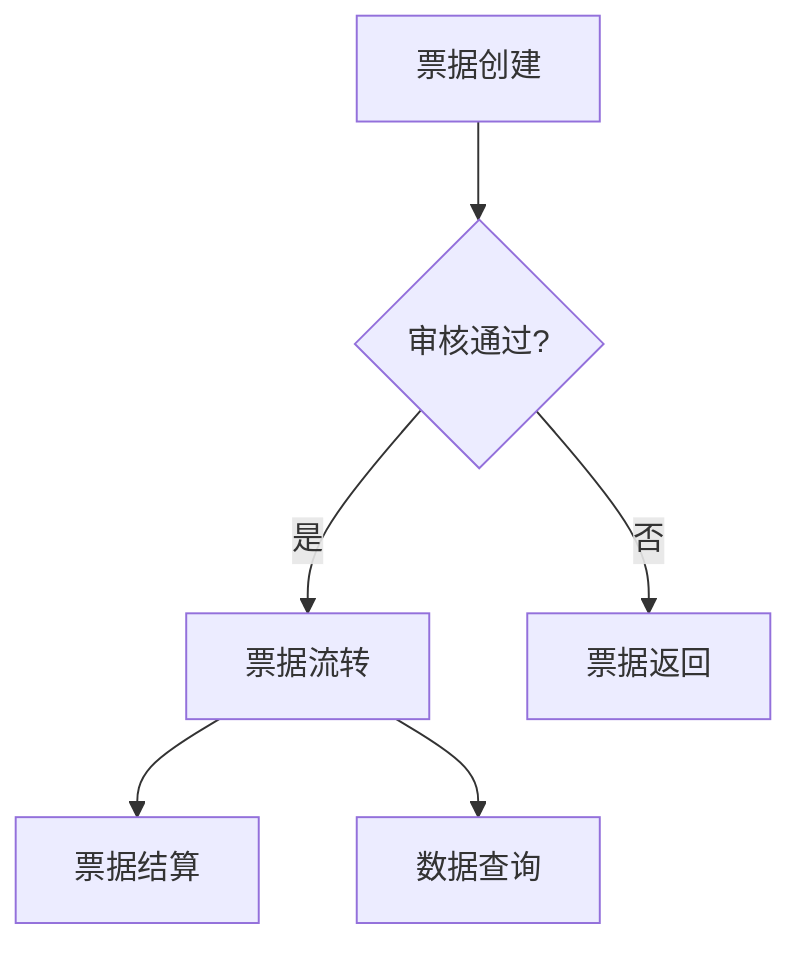

                 

# 《区块链在数字票据管理中的应用：智能票据流转平台》

## 关键词

- 区块链
- 数字票据
- 智能票据流转
- 安全性
- 透明性
- 信任机制

## 摘要

本文将深入探讨区块链技术在数字票据管理中的应用，特别是智能票据流转平台的设计与实现。首先，我们将介绍区块链的基础知识和数字票据的管理背景。接着，本文将详细分析智能票据流转平台的架构设计，包括其核心模块、工作流程和区块链在其中的作用。随后，我们将探讨核心算法原理，包括数字签名、加密算法和智能合约。文章还将通过一个实际项目，展示智能票据流转平台的开发与实践，并对未来发展趋势和挑战进行展望。通过本文的阅读，读者将全面了解区块链在数字票据管理中的应用价值和技术实现。

## 第一部分：区块链与数字票据管理概述

### 第1章：区块链技术基础

#### 1.1 区块链的定义与特点

区块链是一种分布式数据库技术，通过密码学和共识算法确保数据的不可篡改性和透明性。它由一系列按时间顺序排列的“区块”组成，每个区块包含一定数量的交易记录，并通过密码学算法相互链接，形成一个链条。区块链的核心特点包括去中心化、不可篡改、安全性和透明性。

去中心化意味着区块链不需要中心化的管理机构，每个节点都可以参与网络，共同维护区块链的完整性和安全性。不可篡改性确保了数据的可信度，一旦数据被记录在区块链上，就难以被篡改。安全性通过密码学算法和共识机制实现，使得网络攻击成本高昂，难以成功。透明性使得所有参与者可以查看区块链上的交易记录，提高了信息的公开性和信任度。

#### 1.2 区块链的工作原理

区块链的工作原理可以分为三个主要部分：交易记录、区块和链。

1. **交易记录**：交易记录是区块链上的基本数据单元，描述了数据交换的过程。每个交易记录包含发送方、接收方、金额以及交易的具体内容。

2. **区块**：区块是交易记录的集合。在区块链中，交易记录首先被发送到网络中的节点。节点将交易记录组织成区块，并通过密码学算法对区块进行加密，确保区块的完整性和安全性。

3. **链**：链是由一系列按时间顺序排列的区块组成的。新产生的区块通过密码学算法与前一个区块链接，形成一条完整的区块链。这种链接方式保证了区块链的不可篡改性。

#### 1.3 区块链的分类与结构

区块链可以分为公有链、私有链和联盟链。

- **公有链**：公有链是公开透明的区块链，所有参与者都可以参与交易和记账。比特币和以太坊是最著名的公有链。
  
- **私有链**：私有链是仅由特定组织或个人维护的区块链，通常用于企业内部或组织之间的交易。私有链的参与者和权限可以由组织自行定义。
  
- **联盟链**：联盟链是介于公有链和私有链之间的一种区块链，由多个组织共同维护，适用于跨组织的业务合作。

区块链的结构通常包括多个节点、分布式账本、共识机制和智能合约。

- **节点**：节点是区块链网络中的计算机，负责存储和验证数据。
  
- **分布式账本**：分布式账本是区块链的核心，记录了所有交易记录和状态。
  
- **共识机制**：共识机制是节点之间达成共识的算法，用于确认交易的合法性和记账的顺序。
  
- **智能合约**：智能合约是区块链上的自动化合同，可以在满足特定条件时自动执行。

#### 1.4 区块链在票据管理中的应用潜力

区块链在票据管理中的应用具有显著潜力，主要表现在以下几个方面：

- **安全性**：区块链的加密算法和共识机制确保了票据数据的不可篡改性和安全性，减少了欺诈风险。
  
- **透明性**：区块链的透明性使得票据流转的过程可以被所有参与者查看，提高了信息的透明度和信任度。
  
- **效率**：区块链的去中心化特性减少了票据流转中的中介环节，提高了流转速度和效率。
  
- **智能合约**：智能合约可以自动执行票据流转的规则，减少了人工干预，提高了票据流转的准确性。

通过以上分析，我们可以看到区块链技术为数字票据管理提供了强大的技术支持，为构建智能票据流转平台奠定了基础。

### 第2章：数字票据管理概述

#### 2.1 数字票据的定义与类型

数字票据是指通过电子方式生成的票据，其形式包括电子发票、电子支票、电子汇票等。与传统的纸质票据相比，数字票据具有更高的效率和便捷性，能够通过电子方式快速传递和处理。

数字票据可以分为以下几种类型：

- **电子发票**：电子发票是电子形式的发票，可以通过网络开具和传输。电子发票的应用范围广泛，涵盖了各种商业活动。

- **电子支票**：电子支票是电子形式的支票，可以通过网络进行支付。电子支票具有较高的安全性和便捷性，成为传统支票的有力补充。

- **电子汇票**：电子汇票是电子形式的汇票，用于企业之间的结算。电子汇票通过电子方式传递，可以减少纸质票据的流通，提高结算效率。

#### 2.2 数字票据管理的发展历程

数字票据管理的发展历程可以分为以下几个阶段：

1. **起步阶段**：在数字票据管理初期，电子票据的应用范围较小，主要应用于大型企业和金融机构。这一阶段的数字票据管理主要依赖于电子邮件和文件传输协议。

2. **发展阶段**：随着互联网技术的普及，数字票据管理开始向中小型企业扩展。这一阶段的数字票据管理引入了数字签名和加密技术，提高了票据的安全性和可信度。

3. **成熟阶段**：目前，数字票据管理已经进入成熟阶段。区块链技术的引入为数字票据管理带来了新的发展机遇，通过区块链技术可以进一步提高数字票据的安全性、透明性和效率。

#### 2.3 数字票据管理的挑战与机遇

数字票据管理面临着一系列挑战和机遇：

- **挑战**：

  1. **安全性**：数字票据容易被篡改和伪造，需要确保票据数据的真实性和完整性。

  2. **标准化**：数字票据的格式和标准尚未统一，需要制定统一的规范。

  3. **法律法规**：数字票据的法律地位和适用法律法规尚需明确。

- **机遇**：

  1. **效率**：数字票据管理可以大幅提高票据流转的速度和效率。

  2. **透明性**：数字票据管理可以提高票据流转的透明度，减少纠纷。

  3. **智能化**：区块链技术可以为数字票据管理引入智能合约，实现自动化的票据流转。

通过以上分析，我们可以看到数字票据管理在发展过程中面临着挑战，但也拥有巨大的机遇。特别是区块链技术的引入，为数字票据管理带来了新的发展方向，有助于构建高效、安全、智能的票据流转平台。

## 第二部分：智能票据流转平台架构设计

### 第3章：智能票据流转平台架构设计

#### 3.1 智能票据流转平台的概念与架构

智能票据流转平台是一种基于区块链技术的数字票据管理系统，旨在实现票据的自动化流转和管理。该平台的核心架构包括以下几个部分：

1. **用户模块**：用户模块包括票据的发起者、接收者和监管者。票据发起者负责创建票据，接收者负责接收票据并进行审核，监管者则负责监督票据的流转过程。

2. **区块链模块**：区块链模块是智能票据流转平台的核心，负责存储和管理票据数据。区块链通过密码学算法和共识机制确保票据数据的真实性和完整性。

3. **智能合约模块**：智能合约模块用于实现票据流转的自动化。智能合约是根据预设规则自动执行合约条款的计算机程序，可以确保票据流转的准确性和高效性。

4. **API接口模块**：API接口模块提供与外部系统的接口，方便其他系统调用智能票据流转平台的服务。

5. **数据存储模块**：数据存储模块用于存储票据的元数据和交易记录。数据存储模块可以采用分布式数据库技术，确保数据的高可用性和可靠性。

#### 3.2 平台核心模块介绍

智能票据流转平台的核心模块包括用户模块、区块链模块、智能合约模块和API接口模块。

1. **用户模块**：用户模块负责用户的注册、登录和权限管理。用户可以通过用户模块发起票据、接收票据和审核票据。用户模块还提供用户信息管理、角色管理和权限控制功能。

2. **区块链模块**：区块链模块负责票据数据的存储和管理。区块链模块通过将票据数据记录到区块链上，确保票据数据的真实性和不可篡改性。区块链模块还提供交易记录查询、数据备份和恢复功能。

3. **智能合约模块**：智能合约模块用于实现票据流转的自动化。智能合约可以根据预设规则自动执行，确保票据流转的准确性和高效性。智能合约模块还提供智能合约开发工具和调试环境。

4. **API接口模块**：API接口模块提供与外部系统的接口，方便其他系统调用智能票据流转平台的服务。API接口模块支持HTTP/HTTPS协议，提供RESTful接口。

#### 3.3 智能票据流转流程设计

智能票据流转平台的工作流程包括以下几个步骤：

1. **票据创建**：票据发起者创建票据，并上传票据数据到区块链上。

2. **票据审核**：票据接收者接收票据，并对其进行审核。审核通过后，票据接收者将票据数据记录到区块链上。

3. **票据流转**：票据在区块链上进行流转，每个流转节点都会记录交易数据。

4. **票据结算**：票据流转完成后，智能合约根据预设规则自动执行结算操作。

5. **数据查询**：用户可以查询票据的流转记录和历史数据。

下面是一个简单的智能票据流转流程Mermaid流程图：



通过以上分析，我们可以看到智能票据流转平台的概念与架构，以及平台核心模块的介绍。智能票据流转流程的设计确保了票据流转的自动化和高效性，为构建智能票据流转平台提供了理论基础。

### 第4章：区块链技术在智能票据流转平台中的应用

#### 4.1 区块链在票据流转中的功能

区块链技术在智能票据流转平台中的应用主要体现在以下几个方面：

1. **数据存储**：区块链通过分布式账本技术存储票据数据，确保数据的可靠性和安全性。每个区块都包含一定数量的交易记录，通过密码学算法链接形成区块链，使得数据无法被篡改。

2. **数据验证**：区块链的共识机制确保了交易记录的合法性和正确性。在智能票据流转平台中，每个节点都需要验证交易记录的有效性，只有通过验证的交易记录才能被记录在区块链上。

3. **数据共享**：区块链的透明性使得所有参与者都可以查看票据流转的过程。通过区块链技术，智能票据流转平台实现了数据的共享和透明，提高了交易的信任度。

4. **自动化执行**：智能合约是区块链技术的重要组成部分，可以自动执行票据流转的规则。在智能票据流转平台中，智能合约用于实现票据的创建、审核、流转和结算，确保票据流转的准确性和高效性。

#### 4.2 区块链在票据安全中的应用

区块链技术在票据安全中的应用主要体现在以下几个方面：

1. **数据加密**：区块链使用非对称加密算法对票据数据进行加密，确保数据在传输过程中的安全性。非对称加密算法使用公钥和私钥，只有拥有私钥的节点才能解密数据。

2. **数字签名**：区块链使用数字签名技术确保票据数据的真实性。票据创建者使用私钥对票据数据进行签名，接收者使用公钥验证签名，从而确保票据数据的来源和完整性。

3. **共识机制**：区块链的共识机制确保了交易记录的合法性和正确性。通过共识机制，多个节点共同验证交易记录，防止恶意节点篡改数据。

#### 4.3 区块链在票据信任机制中的作用

区块链技术在票据信任机制中的作用主要体现在以下几个方面：

1. **去中心化**：区块链的去中心化特性使得票据流转不需要依赖中心化的机构，减少了信任的障碍。每个节点都可以参与票据流转，共同维护区块链的完整性和安全性。

2. **透明性**：区块链的透明性使得所有参与者都可以查看票据流转的过程，提高了交易的透明度。透明性增加了参与者的信任，减少了纠纷和欺诈。

3. **不可篡改性**：区块链的不可篡改性确保了票据数据的真实性和可信度。一旦数据被记录在区块链上，就难以被篡改，从而确保了票据流转的可靠性和可信度。

通过以上分析，我们可以看到区块链技术在智能票据流转平台中的重要作用。区块链技术为票据流转提供了可靠的数据存储、数据验证、数据共享和自动化执行，确保了票据流转的安全性和可信度。同时，区块链技术还为票据流转提供了去中心化、透明性和不可篡改性的信任机制，为构建智能票据流转平台奠定了基础。

### 第5章：智能票据流转平台的核心算法

#### 5.1 数字签名与加密算法

数字签名和加密算法是区块链技术中重要的安全机制，用于保护票据数据的完整性和真实性。

**数字签名**：
数字签名是一种使用公钥加密算法的技术，用于验证数据的来源和完整性。其基本原理如下：
1. **签名生成**：数据发送方使用自己的私钥对数据生成一个签名。
2. **签名验证**：接收方使用发送方的公钥对签名进行验证，以确认数据的真实性和完整性。

**加密算法**：
加密算法用于保护数据在传输过程中的安全性。常见的加密算法包括对称加密算法和非对称加密算法。

- **对称加密算法**：对称加密算法使用相同的密钥进行加密和解密。常见的对称加密算法有DES、AES等。
  
- **非对称加密算法**：非对称加密算法使用一对密钥进行加密和解密，一个用于加密，另一个用于解密。常见的非对称加密算法有RSA、ECC等。

在智能票据流转平台中，数字签名和加密算法可以用于以下几个方面：

1. **数据完整性**：数字签名可以验证票据数据在传输过程中是否被篡改。

2. **数据真实性**：数字签名可以验证票据数据的来源，确保数据来自合法的发送方。

3. **数据机密性**：加密算法可以保护票据数据在传输过程中的机密性，防止数据被未授权的第三方访问。

#### 5.2 智能合约设计与实现

智能合约是区块链技术的重要组成部分，用于自动化执行票据流转的规则。智能合约的设计与实现包括以下几个方面：

1. **智能合约语言**：智能合约需要使用特定的编程语言进行编写。常见的智能合约语言有Solidity（以太坊）、Scilla（Tezos）和NEAR（NEAR协议）等。

2. **智能合约架构**：智能合约的架构通常包括事件、函数和状态变量。事件用于触发合约执行，函数用于实现具体的业务逻辑，状态变量用于存储合约的状态。

3. **智能合约实现**：智能合约的实现需要根据具体的业务需求进行设计。以下是一个简单的智能合约实现示例：

```solidity
// SPDX-License-Identifier: MIT
pragma solidity ^0.8.0;

contract TicketTransfer {
    address public owner;
    mapping(address => mapping(address => uint256)) public balances;

    constructor() {
        owner = msg.sender;
    }

    function transfer(address to, address from, uint256 amount) external {
        require(from != to, "Cannot transfer to the same address");
        require(balances[from][to] >= amount, "Insufficient balance");

        balances[from][to] -= amount;
        balances[to][from] += amount;

        emit Transfer(from, to, amount);
    }

    event Transfer(address from, address to, uint256 amount);
}
```

上述智能合约实现了一个简单的票据转账功能，包括转账函数和转账事件。

#### 5.3 数据隐私保护算法

数据隐私保护是区块链技术面临的重要挑战之一。为了确保票据流转过程中的数据隐私，可以使用以下几种数据隐私保护算法：

1. **零知识证明（Zero-Knowledge Proof）**：零知识证明是一种证明机制，可以证明某个陈述是正确的，而不泄露任何有关该陈述的信息。在智能票据流转平台中，零知识证明可以用于验证票据数据的合法性，而不泄露具体的票据内容。

2. **同态加密（Homomorphic Encryption）**：同态加密是一种加密技术，可以在加密数据上直接进行计算，而不需要解密数据。在智能票据流转平台中，同态加密可以用于在区块链上进行复杂的计算，同时保持数据的隐私性。

3. **差分隐私（Differential Privacy）**：差分隐私是一种保护数据隐私的方法，通过对数据集进行扰动，使得隐私数据不可分辨。在智能票据流转平台中，差分隐私可以用于保护用户数据的隐私性，同时保证数据的有效性。

通过以上算法的应用，智能票据流转平台可以在保证数据安全性和可信性的同时，确保数据隐私得到保护。

### 第6章：智能票据流转平台开发与实践

#### 6.1 开发环境搭建

为了搭建智能票据流转平台，我们需要准备以下开发环境：

1. **操作系统**：可以选择Linux或Windows操作系统。
2. **编程语言**：Solidity是智能合约开发的主要编程语言，可以使用Visual Studio Code等IDE进行开发。
3. **区块链节点**：我们需要搭建一个以太坊节点，用于运行智能合约。可以使用Geth或EthereumJS等工具。
4. **前端框架**：可以选择React、Vue或Angular等前端框架进行开发。
5. **数据库**：可以选择MongoDB或PostgreSQL等数据库进行数据存储。

#### 6.2 技术选型与工具介绍

1. **智能合约开发工具**：Truffle是一个流行的智能合约开发框架，提供测试、部署和迁移工具。
2. **区块链节点搭建**：Geth是以太坊的官方客户端，可以用于搭建以太坊节点。EthereumJS是一个JavaScript库，用于与以太坊节点进行交互。
3. **前端框架**：React是一个流行的前端框架，具有组件化、响应式和高性能的特点。
4. **后端框架**：Node.js是一个流行的后端框架，可以用于构建高效、可扩展的服务器端应用程序。
5. **数据库**：MongoDB是一个流行的NoSQL数据库，适合存储非结构化数据。

#### 6.3 开发流程与规范

1. **需求分析**：明确智能票据流转平台的功能需求，包括票据创建、审核、流转、结算和数据查询等。
2. **设计文档**：编写智能票据流转平台的设计文档，包括系统架构、数据库设计、接口设计等。
3. **智能合约开发**：使用Solidity编写智能合约，并进行单元测试和集成测试。
4. **前端开发**：使用React等前端框架实现用户界面，与智能合约进行交互。
5. **后端开发**：使用Node.js等后端框架实现业务逻辑和API接口。
6. **测试与调试**：对智能票据流转平台进行全面测试，包括功能测试、性能测试和安全性测试。
7. **部署与运维**：将智能票据流转平台部署到服务器，并进行日常运维和监控。

通过以上开发流程和规范，我们可以确保智能票据流转平台的稳定性、安全性和可扩展性。

### 第7章：智能票据流转平台项目实战

#### 7.1 项目背景与目标

智能票据流转平台项目旨在构建一个基于区块链技术的数字票据管理系统，实现票据的自动化流转和管理。项目背景如下：

1. **市场需求**：随着数字经济的快速发展，传统的票据管理方式已无法满足企业对效率和透明度的要求。智能票据流转平台可以提供更高效、更安全的票据管理解决方案。
2. **技术挑战**：区块链技术的应用需要解决数据隐私保护、性能优化和安全性问题。此外，智能票据流转平台需要与现有业务系统进行集成，确保数据的无缝流转。
3. **项目目标**：实现票据的自动化流转和管理，提高票据流转的效率；确保票据数据的安全性和透明性；与现有业务系统无缝集成，实现数据共享和流转。

#### 7.2 平台功能设计与实现

智能票据流转平台的功能设计主要包括以下方面：

1. **票据创建**：用户可以通过平台创建电子票据，填写票据信息，并进行数字签名。
2. **票据审核**：审核人员可以接收票据并进行审核，审核通过后票据将进入流转流程。
3. **票据流转**：票据在区块链上进行流转，每个流转节点都会记录交易数据。
4. **票据结算**：智能合约根据预设规则自动执行结算操作，确保结算的准确性和高效性。
5. **数据查询**：用户可以查询票据的流转记录和历史数据，确保数据的透明性。

以下是平台功能实现的详细步骤：

1. **票据创建**：

   - 用户登录系统，进入票据创建页面；
   - 用户填写票据信息，包括票据类型、金额、到期日等；
   - 用户对票据信息进行数字签名，确保票据数据的真实性；
   - 将票据数据上传到区块链节点，生成交易记录。

2. **票据审核**：

   - 审核人员登录系统，进入票据审核页面；
   - 审核人员接收票据并进行审核，审核通过后票据将进入流转流程；
   - 审核人员对票据进行数字签名，确认票据数据的真实性。

3. **票据流转**：

   - 流转节点按照预设规则接收票据并进行处理；
   - 流转节点将票据数据记录到区块链上，生成交易记录；
   - 每个流转节点都会记录交易数据，确保票据流转的可追溯性。

4. **票据结算**：

   - 智能合约根据预设规则自动执行结算操作；
   - 智能合约确保结算的准确性和高效性；
   - 结算完成后，生成交易记录并记录到区块链上。

5. **数据查询**：

   - 用户登录系统，进入数据查询页面；
   - 用户可以查询票据的流转记录和历史数据；
   - 系统提供详细的查询结果，确保数据的透明性。

#### 7.3 平台测试与优化

1. **功能测试**：

   - 对平台的功能进行全面的测试，确保所有功能正常运行；
   - 检查票据创建、审核、流转、结算和数据查询等功能的实现是否正确。

2. **性能测试**：

   - 对平台的性能进行测试，确保系统在高并发情况下能够正常运行；
   - 检查系统的响应时间和吞吐量是否符合要求。

3. **安全性测试**：

   - 对平台进行安全性测试，确保系统的安全性和数据的完整性；
   - 检查系统是否容易受到攻击，包括拒绝服务攻击、中间人攻击等。

4. **优化与调整**：

   - 根据测试结果对平台进行优化和调整；
   - 优化系统的性能和安全性，提高用户体验。

通过以上测试与优化，确保智能票据流转平台在实际应用中的稳定性和可靠性。

#### 7.4 项目总结与反思

智能票据流转平台项目取得了以下成果：

1. **成功实现票据的自动化流转和管理**：平台实现了票据的创建、审核、流转、结算和数据查询等功能，提高了票据流转的效率。

2. **确保票据数据的安全性和透明性**：平台采用了区块链技术，确保票据数据的不可篡改性和安全性，同时提供了数据查询功能，提高了票据流转的透明度。

3. **与现有业务系统无缝集成**：平台与现有业务系统进行了集成，实现了数据共享和流转，为企业提供了便捷的票据管理解决方案。

在项目实施过程中，我们也遇到了一些挑战和反思：

1. **性能优化**：在项目初期，平台的性能较低，需要进一步优化。我们采用了缓存技术、异步处理和消息队列等方式，提高了系统的响应速度和吞吐量。

2. **安全性提升**：在项目实施过程中，我们发现了潜在的安全漏洞，通过加密算法和共识机制等手段，提高了系统的安全性。

3. **用户体验**：在项目实施过程中，我们关注了用户体验，优化了用户界面和交互流程，提高了用户满意度。

通过以上总结和反思，我们为未来智能票据流转平台的发展提供了宝贵的经验和借鉴。

### 第8章：智能票据流转平台的发展趋势与挑战

#### 8.1 行业发展趋势分析

智能票据流转平台作为区块链技术在票据管理领域的应用，呈现出以下发展趋势：

1. **技术进步**：随着区块链技术的不断发展和完善，智能票据流转平台的技术基础将更加坚实，包括区块链的共识机制、加密算法和智能合约等。
   
2. **应用扩展**：智能票据流转平台的应用领域将不断扩展，从传统的商业票据到金融票据、供应链票据等领域，将实现更广泛的应用。

3. **法规完善**：随着区块链技术的发展，各国政府和监管机构将不断完善相关法律法规，为智能票据流转平台的发展提供法制保障。

4. **市场规模扩大**：随着智能票据流转平台的应用逐渐普及，其市场规模将不断扩大，成为数字票据管理的重要解决方案。

#### 8.2 技术挑战与解决方案

尽管智能票据流转平台具有广阔的发展前景，但仍然面临一系列技术挑战：

1. **性能优化**：区块链技术的性能问题仍然是一个挑战，特别是在高并发环境下，如何提高交易处理速度和系统响应时间仍需解决。

2. **数据隐私保护**：如何确保票据流转过程中的数据隐私，防止数据泄露，是智能票据流转平台需要解决的重要问题。

3. **跨链互操作性**：智能票据流转平台需要与不同区块链网络和外部系统进行互操作，实现跨链数据共享和流转，这需要解决跨链互操作性的问题。

针对以上挑战，可以采取以下解决方案：

1. **性能优化**：采用分布式数据库技术、分片技术和并行处理技术，提高区块链的性能。同时，优化智能合约的设计和实现，减少计算和存储开销。

2. **数据隐私保护**：采用零知识证明、同态加密和差分隐私等技术，确保票据流转过程中的数据隐私。同时，加强区块链网络的安全防护，防止恶意攻击。

3. **跨链互操作性**：采用跨链协议和互操作标准，实现不同区块链网络之间的数据共享和流转。同时，开发跨链桥接技术，实现区块链与其他外部系统的无缝集成。

#### 8.3 未来发展方向探讨

未来，智能票据流转平台的发展将朝着以下方向迈进：

1. **去中心化**：随着区块链技术的进步，智能票据流转平台将朝着更加去中心化的方向发展，减少对中心化机构的依赖，提高系统的安全性和可信度。

2. **智能合约的优化**：智能合约的优化将是未来的一个重要方向，包括提高智能合约的执行效率、可扩展性和安全性。

3. **行业标准的制定**：行业标准的制定将有助于推动智能票据流转平台的普及和应用，提高行业规范化水平。

4. **跨领域应用**：智能票据流转平台将在金融、供应链、物流等领域得到更广泛的应用，实现跨领域的数据共享和流转。

通过以上分析，我们可以看到智能票据流转平台在发展过程中面临的挑战和机遇。未来，随着技术的不断进步和行业标准的逐步完善，智能票据流转平台将在票据管理领域发挥更加重要的作用，为企业和个人提供高效、安全、智能的票据管理解决方案。

## 总结

本文详细介绍了区块链在数字票据管理中的应用，特别是智能票据流转平台的设计与实现。通过逐步分析，我们从区块链技术基础、数字票据管理概述、智能票据流转平台架构设计、核心算法、开发与实践，以及发展趋势与挑战等多个方面，全面探讨了区块链技术在票据管理领域的应用前景。智能票据流转平台以其高效、安全、透明的特点，为数字票据管理提供了全新的解决方案。未来，随着技术的不断进步和行业标准的逐步完善，智能票据流转平台将在票据管理领域发挥更加重要的作用，为企业和个人提供更加便捷、可靠的票据管理服务。在智能票据流转平台的发展过程中，我们仍需关注性能优化、数据隐私保护和跨链互操作性等技术挑战，并积极探索解决方案。通过持续的努力，我们有望构建一个高效、安全、智能的票据管理生态体系。

## 作者信息

作者：AI天才研究院/AI Genius Institute & 禅与计算机程序设计艺术 /Zen And The Art of Computer Programming

感谢您的阅读，希望本文能为您在区块链和数字票据管理领域提供有价值的见解和启示。在未来的研究和实践中，我们期待与您共同探索更多技术创新和应用场景。如有任何疑问或建议，欢迎随时与我们联系。再次感谢您的关注与支持！

