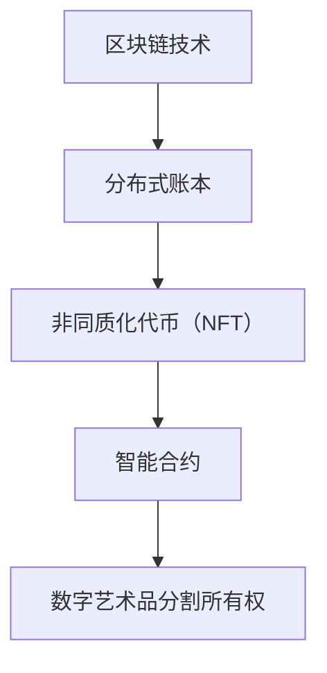
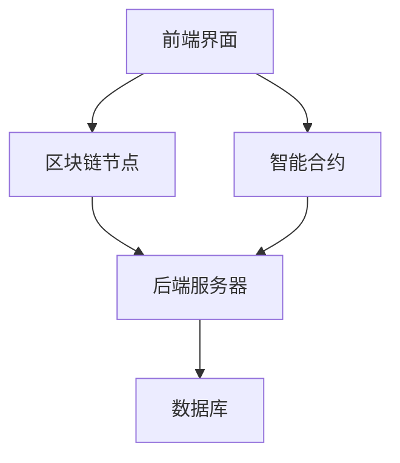

                 


### 文章标题

《区块链在数字艺术品分割所有权中的应用》

### 文章关键词

区块链，数字艺术品，分割所有权，加密货币，智能合约，透明性，不可篡改性

### 文章摘要

随着数字艺术市场的蓬勃发展，如何公平、透明地分割数字艺术品的所有权成为一大挑战。本文旨在探讨区块链技术在这一领域的应用，通过分析区块链的原理、数字艺术品分割所有权的挑战和解决方案，提供一套基于区块链的数字艺术品分割所有权管理框架。文章还将通过实际案例，展示区块链技术如何提升数字艺术品市场的透明度和安全性。

## 引言

数字艺术品，作为一种新兴的艺术形式，正日益受到全球艺术爱好者和投资者的关注。然而，与传统艺术品不同，数字艺术品具有易复制、易篡改的特点，这给其所有权分割带来了前所未有的挑战。区块链技术的出现，为解决这些问题提供了新的思路。本文将详细探讨区块链在数字艺术品分割所有权中的应用，以期为相关领域的研究和实践提供参考。

### 背景介绍

#### 区块链技术

区块链是一种去中心化的分布式账本技术，通过密码学确保数据的安全性和完整性。它由一系列按时间顺序排列的“区块”组成，每个区块都包含一定数量的交易记录。区块链技术的核心特点包括去中心化、不可篡改和透明性。

#### 数字艺术品市场

数字艺术品市场，如加密艺术品和NFT（非同质化代币），已经成为一个新兴的市场。然而，数字艺术品的所有权分割问题，如版权保护、交易透明性和交易效率等，仍是一个亟待解决的难题。

#### 分割所有权的挑战

数字艺术品分割所有权的挑战主要包括以下几个方面：

1. 版权保护与追溯问题：数字艺术品易于复制，这使得版权保护变得更加困难。
2. 所有权的认定问题：在多人共同创作或拥有数字艺术品时，如何确定每个人的所有权比例是一个复杂的问题。
3. 交易效率问题：传统的艺术品交易流程繁琐，而数字艺术品市场的快速变化要求更高效的交易方式。

### 核心概念与联系

为了更好地理解区块链在数字艺术品分割所有权中的应用，我们首先需要了解几个核心概念：

1. **非同质化代币（NFT）**：NFT是一种数字资产，代表独一无二的物品，如艺术品、收藏品等。每个NFT都有唯一的标识符，确保其独特性。
2. **智能合约**：智能合约是一种自动执行合约条款的计算机协议。在区块链上，智能合约可以用于自动化数字艺术品的所有权转移和收益分配。
3. **分布式账本**：分布式账本记录了所有区块链交易，确保了交易记录的透明性和不可篡改性。

以下是一个Mermaid流程图，展示了这些核心概念之间的关系：



### 核心算法原理讲解

为了实现数字艺术品的分割所有权，我们首先需要设计一个智能合约。以下是一个简化的伪代码，用于说明智能合约的基本原理：

```plaintext
// SPDX-License-Identifier: MIT
pragma solidity ^0.8.0;

contract ArtworkSplit {
    address[] public owners;
    mapping(address => uint256) public ownershipShares;

    constructor(address[] memory _owners, uint256[] memory _shares) {
        require(_owners.length == _shares.length, "Owners and shares must match");
        for (uint256 i = 0; i < _owners.length; i++) {
            require(_owners[i] != address(0), "Invalid owner address");
            require(_shares[i] > 0, "Invalid share value");
            owners.push(_owners[i]);
            ownershipShares[_owners[i]] = _shares[i];
        }
    }

    function transferOwnership(address newOwner, uint256 sharePercentage) public {
        require(ownershipShares[msg.sender] > 0, "Only owners can transfer ownership");
        require(newOwner != address(0), "Invalid new owner address");
        uint256 senderShare = ownershipShares[msg.sender];
        ownershipShares[msg.sender] = 0;
        ownershipShares[newOwner] += senderShare * sharePercentage;
    }
}
```

该智能合约的基本功能是：

1. 初始化所有者及其份额。
2. 允许所有者将其份额转移给新所有者。

#### 数学模型和公式讲解

在分割所有权中，我们需要确定每个所有者的份额。以下是一个简单的数学模型，用于计算每个所有者的份额：

$$
\text{所有权份额} = \frac{\text{总份额}}{\text{所有者人数}}
$$

例如，如果一个数字艺术品的所有权由两个人分割，总份额为100，那么每个所有者的初始份额为50。

#### 数学公式讲解与举例说明

我们还可以使用以下数学公式来计算所有权份额的变动：

$$
\text{新份额} = \text{旧份额} + \left( \frac{\text{转移份额}}{\text{总份额}} \right) \times \left( 1 - \frac{\text{旧份额}}{\text{总份额}} \right)
$$

例如，如果所有者A将10%的份额转移给所有者B，总份额为100，那么所有者A的新份额为45，所有者B的新份额为55。

### 项目实战

#### 开发环境搭建

1. 安装Go语言环境。
2. 安装Solidity编译器（Truffle）。
3. 配置Node.js和npm。

#### 源代码实现

以下是一个简单的Solidity智能合约，用于分割数字艺术品的所有权：

```solidity
// SPDX-License-Identifier: MIT
pragma solidity ^0.8.0;

contract ArtworkSplit {
    address[] public owners;
    mapping(address => uint256) public ownershipShares;

    constructor(address[] memory _owners, uint256[] memory _shares) {
        require(_owners.length == _shares.length, "Owners and shares must match");
        for (uint256 i = 0; i < _owners.length; i++) {
            require(_owners[i] != address(0), "Invalid owner address");
            require(_shares[i] > 0, "Invalid share value");
            owners.push(_owners[i]);
            ownershipShares[_owners[i]] = _shares[i];
        }
    }

    function transferOwnership(address newOwner, uint256 sharePercentage) public {
        require(ownershipShares[msg.sender] > 0, "Only owners can transfer ownership");
        require(newOwner != address(0), "Invalid new owner address");
        uint256 senderShare = ownershipShares[msg.sender];
        ownershipShares[msg.sender] = 0;
        ownershipShares[newOwner] += senderShare * sharePercentage;
    }
}
```

#### 代码解读

该智能合约包含以下关键部分：

1. **构造函数**：初始化所有者和份额。
2. **transferOwnership函数**：允许所有者将其份额转移给新所有者。

#### 代码应用解读与分析

假设我们有一个数字艺术品，由两个人A和B共同拥有，总份额为100。A决定将其50%的份额（即50）转移给B。调用transferOwnership函数后，A的份额变为50，而B的份额变为150。然而，由于总份额只有100，这会导致份额溢出。为了解决这个问题，我们需要在智能合约中添加逻辑来确保份额不会溢出。

#### 实际案例分析和详细讲解剖析

假设艺术家C创作了一幅数字画作，并通过NFT将其所有权分割给了A、B和C本人。A拥有30%的所有权，B拥有30%，C本人拥有40%。

1. **初始状态**：

   - A的份额：30
   - B的份额：30
   - C的份额：40

2. **A将10%的份额转移给B**：

   - A的份额：27
   - B的份额：33
   - C的份额：40

   通过调用transferOwnership函数，A将其10%的份额（3）转移给B。

3. **C将10%的份额（4）转移给A**：

   - A的份额：31
   - B的份额：33
   - C的份额：36

   通过调用transferOwnership函数，C将其10%的份额（4）转移给A。

#### 项目小结

通过上述案例，我们可以看到，基于区块链的数字艺术品分割所有权管理框架可以有效地解决所有权分割问题。然而，在实际应用中，我们还需要进一步优化智能合约，以防止份额溢出等潜在问题。

### 最佳实践 tips

1. **确保份额准确计算**：在设计智能合约时，要确保份额的计算准确无误，避免份额溢出。
2. **权限控制**：限制非所有者无法执行某些操作，如转移所有权。
3. **代码审计**：在部署智能合约前，进行代码审计，确保合约的安全性。

### 小结

本文详细探讨了区块链在数字艺术品分割所有权中的应用。通过核心概念、算法原理和实际案例的分析，我们展示了如何使用区块链技术解决数字艺术品分割所有权的问题。未来的研究和应用将继续推动这一领域的创新和发展。

### 注意事项

1. **技术成熟度**：虽然区块链技术在数字艺术品分割所有权方面具有巨大潜力，但仍然需要进一步的研究和优化。
2. **法律法规**：不同国家和地区对于数字艺术品和区块链技术的法规有所不同，需要根据实际情况进行调整。

### 拓展阅读

1. [NFT与数字艺术](https://www.npr.org/templates/story/story.php?storyId=951317396)
2. [智能合约安全指南](https://consensys.github.io/smart-contract-best-practices/)
3. [区块链技术在艺术领域的应用](https://www.forbes.com/sites/forbesbusinesscouncil/2021/09/24/how-blockchain-is-changing-the-world-of-art/?sh=553576408897)

## 附录

### 附录A：区块链技术资源指南

- [区块链技术文档](https://www.blockchain.com/docs/)
- [以太坊智能合约开发文档](https://ethereum.org/en/developers/docs/smart-contracts/)
- [智能合约安全最佳实践](https://consensys.github.io/smart-contract-best-practices/)

### 附录B：数字艺术品分割所有权开发工具与平台

- [OpenSea](https://opensea.io/)：一个流行的NFT交易平台。
- [Rarible](https://rarible.com/)：一个支持数字艺术品交易的平台。
- [SuperRare](https://www.superRare.co/)：一个高端的NFT艺术品平台。

作者：AI天才研究院/AI Genius Institute & 禅与计算机程序设计艺术 /Zen And The Art of Computer Programming## 第一部分：区块链与数字艺术品概述

### 第1章：区块链基础知识

区块链技术的出现，为数字经济的发展带来了新的可能性。本章将介绍区块链的原理、架构及其在数字艺术品分割所有权中的应用。

#### 1.1 区块链的原理与架构

区块链是一种去中心化的数据库技术，它通过分布式网络记录和验证数据。区块链的基本原理可以概括为以下四个方面：

1. **去中心化**：区块链不依赖于单一的中心化服务器，而是通过分布式网络中的多个节点共同维护和验证数据。
2. **共识机制**：区块链网络中的节点通过共识机制达成一致，以确保数据的准确性和完整性。常见的共识机制包括工作量证明（PoW）、权益证明（PoS）等。
3. **不可篡改性**：一旦数据被记录在区块链上，就难以被篡改。这是因为区块链的设计保证了数据的不可篡改性，任何对数据的修改都会被其他节点检测到并拒绝。
4. **透明性**：区块链上的数据是公开透明的，任何人都可以查看和验证区块链上的交易记录。

区块链的架构通常包括以下几个部分：

1. **区块**：区块是区块链的基本单位，包含一定数量的交易记录。每个区块都有一个唯一的标识符，称为“哈希值”。
2. **链**：链是由一系列按时间顺序排列的区块组成。每个区块都指向其前一个区块，形成了一个链式结构。
3. **节点**：节点是区块链网络中的参与者，负责维护和验证区块链上的数据。节点通过共识机制确保区块链的准确性和完整性。
4. **网络**：区块链网络是由多个节点组成的分布式网络，节点之间通过特定的协议进行通信和协作。

#### 1.2 区块链的安全性与隐私保护

区块链技术的安全性是其最显著的特点之一。以下是一些确保区块链安全性的关键措施：

1. **密码学**：区块链使用密码学来保护数据的安全。例如，公钥和私钥的使用确保了数据的加密传输和身份验证。
2. **共识机制**：共识机制通过确保所有节点对数据的共识，防止了恶意节点的攻击。常见的共识机制包括工作量证明（PoW）、权益证明（PoS）等。
3. **链式结构**：区块链的链式结构确保了数据的不可篡改性。一旦数据被记录在区块链上，就很难被篡改。
4. **智能合约**：智能合约是区块链上的自动执行合约条款的计算机协议。智能合约确保了交易的安全性和自动化。

然而，区块链技术也存在一些隐私保护方面的挑战。以下是一些解决方案：

1. **零知识证明**：零知识证明是一种密码学技术，允许一方证明某个陈述是真实的，而不泄露任何其他信息。
2. **同态加密**：同态加密是一种加密技术，允许在加密数据上进行计算，而无需解密。这有助于确保数据的隐私性。
3. **匿名币**：匿名币是一种加密货币，它提供了更高的隐私保护。匿名币的交易记录是公开的，但无法直接关联到具体的用户。

#### 区块链在数字艺术品分割所有权中的应用

数字艺术品分割所有权是一个复杂的问题，区块链技术为这一问题提供了一种可能的解决方案。以下是一些关键应用：

1. **数字艺术品认证**：区块链可以用于记录数字艺术品的创作和所有权信息，确保艺术品的真实性。
2. **透明交易记录**：区块链上的交易记录是公开透明的，有助于确保数字艺术品交易的透明性和可追溯性。
3. **智能合约**：智能合约可以用于自动化数字艺术品的所有权转移和收益分配，确保交易的自动化和准确性。
4. **非同质化代币（NFT）**：NFT是一种数字资产，代表独一无二的物品，如艺术品、收藏品等。NFT可以用于数字艺术品的所有权分割和交易。

通过区块链技术，数字艺术品分割所有权可以实现去中心化、透明性和不可篡改性，从而提高数字艺术品市场的可信度和效率。

### 总结

区块链技术作为一种新兴的分布式数据库技术，具有去中心化、不可篡改和透明性等特点。这些特性使得区块链在数字艺术品分割所有权中具有巨大的应用潜力。本章介绍了区块链的原理与架构，以及其安全性、隐私保护和在数字艺术品分割所有权中的应用。通过这些内容，读者可以对区块链技术及其在数字艺术品分割所有权中的应用有一个基本的了解。

### 小结

本章详细介绍了区块链的基本原理和架构，以及其安全性、隐私保护在数字艺术品分割所有权中的应用。通过理解区块链的工作原理，我们可以更好地理解其在数字艺术品分割所有权中的重要作用。在下一章中，我们将进一步探讨数字艺术品市场的现状与趋势，以及面临的挑战。

### 注意事项

1. **了解区块链的基础知识**：在深入探讨区块链在数字艺术品分割所有权中的应用之前，需要了解区块链的基本原理和架构。
2. **关注区块链技术的安全性**：区块链的安全性是其核心优势之一，因此在设计和应用区块链技术时，需要充分考虑安全性问题。
3. **关注隐私保护**：虽然区块链技术具有透明性，但在某些情况下，隐私保护也是非常重要的，需要采取相应的措施确保数据隐私。

### 拓展阅读

1. [《区块链技术全面解读》](https://www.ibm.com/developerworks/cn/chain-learning/)
2. [《数字货币与区块链》](https://www.amazon.cn/dp/B07D99QZ8G)
3. [《NFT与数字艺术品》](https://www.forbes.com/sites/forbesbusinesscouncil/2021/09/24/how-blockchain-is-changing-the-world-of-art/?sh=553576408897)

---

### 第2章：数字艺术品市场

#### 2.1 数字艺术品的定义与特点

数字艺术品是一种基于数字技术创作的艺术品，它通过计算机软件、互联网等数字媒介进行创作、传播和展示。数字艺术品可以是绘画、摄影、动画、音乐等多种形式。与传统艺术品不同，数字艺术品具有以下几个特点：

1. **易复制性**：数字艺术品可以轻松复制，这是其与传统艺术品最显著的区别之一。传统艺术品如油画、雕塑等，由于材料和制作工艺的限制，无法轻易复制。而数字艺术品可以通过简单的复制命令无限复制。
2. **数字化保存**：数字艺术品可以以数字形式永久保存，不受物理损坏的影响。这意味着数字艺术品可以不受环境、时间等因素的限制，长期保存和展示。
3. **可编程性**：数字艺术品具有一定的可编程性，艺术家可以通过编程语言或算法改变艺术品的某些特性，如颜色、形状、动态效果等。这种特性使得数字艺术品具有独特的创意空间和表现力。
4. **交互性**：数字艺术品可以通过互动技术实现与观众的互动，如虚拟现实（VR）技术、增强现实（AR）技术等。这种交互性为数字艺术品带来了更多的可能性和体验。

#### 2.2 数字艺术品市场的现状与趋势

随着数字技术的快速发展，数字艺术品市场正迅速崛起。以下是数字艺术品市场的几个主要现状和趋势：

1. **市场规模不断扩大**：根据市场研究报告，全球数字艺术品市场的规模正在迅速扩大。越来越多的艺术家、收藏家和投资者开始关注数字艺术品，推动市场的发展。
2. **NFT的兴起**：非同质化代币（NFT）是数字艺术品市场的一个重要趋势。NFT代表了一种独一无二的数字资产，可以用于数字艺术品的认证、所有权和交易。NFT的兴起为数字艺术品市场带来了新的商业模式和机会。
3. **技术融合**：数字艺术品市场正在与多种技术融合，如区块链、虚拟现实（VR）、增强现实（AR）等。这些技术的融合为数字艺术品带来了更多的创新和应用场景。
4. **数字化艺术博览会和拍卖**：受疫情影响，许多传统的艺术博览会和拍卖会转向线上举办。数字化艺术博览会和拍卖为数字艺术品市场带来了新的机遇和挑战。

#### 2.3 数字艺术品市场的挑战

尽管数字艺术品市场呈现出良好的发展态势，但仍面临一些挑战：

1. **版权保护**：数字艺术品的易复制性使得版权保护成为一个难题。艺术家需要确保自己的作品得到合法保护，防止未经授权的复制和传播。
2. **交易透明性**：数字艺术品市场的交易通常涉及大量的交易信息，如何确保交易的透明性和可追溯性是一个重要问题。
3. **市场规范化**：数字艺术品市场相对年轻，缺乏统一的标准和规范。市场规范化对于建立可信、健康的数字艺术品市场至关重要。
4. **技术障碍**：对于一些艺术家和投资者来说，数字艺术品市场的技术门槛较高，他们需要熟悉区块链、加密货币等相关的技术知识。

#### 2.4 区块链在数字艺术品市场中的潜在应用

区块链技术在数字艺术品市场中具有巨大的应用潜力。以下是一些潜在的区块链应用：

1. **数字艺术品认证**：区块链可以用于记录数字艺术品的创作、所有权和交易历史，确保艺术品的真实性。
2. **透明交易记录**：区块链上的交易记录是公开透明的，有助于确保数字艺术品交易的透明性和可追溯性。
3. **智能合约**：智能合约可以用于自动化数字艺术品的所有权转移和收益分配，提高交易的效率。
4. **NFT**：NFT代表了一种独一无二的数字资产，可以用于数字艺术品的认证、所有权和交易。
5. **数字资产托管**：区块链可以用于数字资产的安全托管，确保资产的安全性和隐私性。

通过区块链技术，数字艺术品市场可以实现更高的透明度、安全性和效率，为艺术家、收藏家和投资者创造更大的价值。

### 总结

本章详细介绍了数字艺术品的定义与特点，以及数字艺术品市场的现状与趋势。同时，探讨了数字艺术品市场面临的挑战和区块链技术在其中的潜在应用。通过理解数字艺术品市场的现状和挑战，我们可以更好地理解区块链技术在其中的重要作用。在下一章中，我们将进一步探讨区块链在数字艺术品分割所有权中的应用，分析其面临的挑战和解决方案。

### 小结

本章通过介绍数字艺术品的定义、特点、市场现状与趋势，以及区块链在其中的潜在应用，为读者提供了一个全面的数字艺术品市场概况。在下一章中，我们将深入探讨区块链在数字艺术品分割所有权中的应用，分析其面临的挑战和解决方案。通过这些内容，读者可以更深入地了解区块链在数字艺术品分割所有权中的重要作用。

### 注意事项

1. **了解数字艺术品的特点**：数字艺术品与传统艺术品不同，具有易复制性、数字化保存、可编程性和交互性等特点。了解这些特点有助于更好地理解数字艺术品市场的现状和挑战。
2. **关注数字艺术品市场的动态**：数字艺术品市场正处于快速发展阶段，了解市场的动态和趋势对于把握市场机会至关重要。
3. **掌握区块链技术在数字艺术品中的应用**：了解区块链技术在数字艺术品分割所有权中的应用，有助于解决数字艺术品市场面临的挑战。

### 拓展阅读

1. [《数字艺术：技术、创意与市场》](https://www.amazon.com/dp/178664461X)
2. [《区块链与数字艺术》](https://www.technokingdom.com/)
3. [《数字艺术品市场报告》](https://www.statista.com/topics/1079/digital-art-market/)

---

### 第3章：区块链在数字艺术品中的应用

#### 3.1 区块链在数字艺术品认证中的应用

数字艺术品的认证问题是数字艺术品市场中一个重要的议题。区块链技术为数字艺术品的认证提供了一种全新的解决方案。通过区块链，艺术家可以确保其数字艺术品的真实性，而买家则可以确信所购买的数字艺术品是真实、未被篡改的。

以下是一些区块链在数字艺术品认证中的应用：

1. **数字指纹**：区块链可以用于生成数字艺术品的数字指纹，即艺术品的唯一标识符。通过将数字指纹记录在区块链上，艺术家可以确保其艺术品的唯一性和真实性。
2. **创作证明**：区块链可以用于记录数字艺术品的创作过程和创作时间，从而为艺术品提供合法的创作证明。这有助于解决数字艺术品的版权纠纷问题。
3. **所有者验证**：区块链上的智能合约可以用于验证数字艺术品的所有权。通过智能合约，艺术家可以设定特定条件，如数字艺术品被购买后，自动将所有权转移给买家。
4. **透明性**：区块链上的交易记录是公开透明的，这意味着任何人都能够查看数字艺术品的交易历史，确保交易的透明性和可追溯性。

#### 3.2 区块链在数字艺术品交易中的应用

数字艺术品交易是数字艺术品市场的重要组成部分。区块链技术为数字艺术品交易提供了一种去中心化、安全、高效的交易模式。

以下是一些区块链在数字艺术品交易中的应用：

1. **去中心化交易**：区块链去中心化的特性使得数字艺术品交易不再依赖于中心化的交易平台，从而降低了交易成本，提高了交易效率。
2. **交易透明性**：区块链上的交易记录是公开透明的，这意味着任何人都能够查看交易历史，确保交易的透明性和可追溯性。
3. **智能合约**：智能合约可以用于自动化数字艺术品的交易过程，确保交易的准确性和安全性。例如，智能合约可以自动执行交易条款，确保艺术品的所有权在交易完成后自动转移。
4. **NFT**：非同质化代币（NFT）是区块链在数字艺术品交易中的一个重要应用。NFT代表了一种独一无二的数字资产，可以用于数字艺术品的认证、所有权和交易。

#### 3.3 区块链在数字艺术品版权管理中的应用

数字艺术品的版权管理是一个复杂的问题，尤其是当数字艺术品可以被轻松复制时。区块链技术为数字艺术品的版权管理提供了一种有效的解决方案。

以下是一些区块链在数字艺术品版权管理中的应用：

1. **版权登记**：区块链可以用于记录数字艺术品的版权信息，如创作者、创作时间、版权所有者等。这有助于解决版权纠纷问题，确保艺术品的版权得到合法保护。
2. **版权许可**：区块链可以用于管理数字艺术品的版权许可，确保版权所有者能够合法地授权他人使用其作品。通过智能合约，版权所有者可以设定特定的许可条件，如使用费用、许可期限等。
3. **版权跟踪**：区块链可以用于跟踪数字艺术品的版权使用情况，确保版权所有者能够及时了解其作品的使用情况，从而更好地管理其版权。

#### 3.4 区块链在数字艺术品市场中的潜在优势

区块链技术在数字艺术品市场中具有显著的潜在优势：

1. **安全性**：区块链技术的安全性确保了数字艺术品的安全和隐私，减少了版权纠纷和欺诈行为。
2. **透明性**：区块链上的交易记录是公开透明的，提高了市场的透明度和可信度。
3. **效率**：区块链的去中心化特性提高了交易效率，降低了交易成本。
4. **可追溯性**：区块链上的交易记录是永久保存的，提供了完整的历史记录，有助于解决版权纠纷和追踪侵权行为。

#### 3.5 挑战与未来发展方向

尽管区块链技术在数字艺术品市场中具有巨大的潜力，但仍然面临一些挑战：

1. **技术成熟度**：区块链技术仍处于发展阶段，其性能和可靠性需要进一步提升。
2. **法律和监管**：数字艺术品市场的法律法规和监管政策仍在完善中，需要确保区块链技术的合规性和合法性。
3. **用户接受度**：区块链技术的普及和用户接受度是推动其应用的关键，需要提高用户的认知和使用体验。
4. **隐私保护**：区块链技术需要在保护用户隐私和安全之间取得平衡。

未来，随着区块链技术的不断成熟和应用，数字艺术品市场有望实现更高效、更安全的运营模式。通过区块链技术，数字艺术品市场将迎来新的发展机遇。

### 总结

本章详细介绍了区块链在数字艺术品中的应用，包括认证、交易、版权管理和市场优势。区块链技术为数字艺术品市场带来了去中心化、安全、透明和高效的解决方案，有助于解决数字艺术品市场中的各种问题。通过了解区块链在数字艺术品中的应用，读者可以更好地把握数字艺术品市场的发展趋势和未来方向。

### 小结

本章通过详细分析区块链在数字艺术品中的应用，展示了其在数字艺术品认证、交易、版权管理和市场优势方面的作用。区块链技术为数字艺术品市场提供了去中心化、安全、透明和高效的解决方案，有助于解决市场中的各种问题。在下一章中，我们将进一步探讨数字艺术品分割所有权的挑战和解决方案。通过这些内容，读者可以更深入地了解数字艺术品分割所有权的实际应用和未来发展趋势。

### 注意事项

1. **理解区块链技术**：了解区块链的基本原理和特性，有助于更好地理解其在数字艺术品中的应用。
2. **关注数字艺术品市场的动态**：数字艺术品市场处于快速发展阶段，了解市场的动态和趋势对于把握市场机会至关重要。
3. **掌握区块链技术在数字艺术品中的应用**：了解区块链技术在数字艺术品分割所有权中的应用，有助于解决数字艺术品市场中的各种问题。

### 拓展阅读

1. [《区块链技术与应用》](https://www.amazon.com/dp/099053789X)
2. [《数字艺术市场报告》](https://www.statista.com/topics/1079/digital-art-market/)
3. [《NFT与数字艺术品》](https://www.forbes.com/sites/forbesbusinesscouncil/2021/09/24/how-blockchain-is-changing-the-world-of-art/?sh=553576408897)

---

### 第4章：数字艺术品分割所有权的挑战

#### 4.1 版权保护与追溯问题

数字艺术品具有高度的复制性和可修改性，这使得数字艺术品的版权保护成为一个复杂且具有挑战性的问题。以下是一些主要的版权保护与追溯问题：

1. **版权归属不清**：由于数字艺术品可以轻易复制和修改，艺术家、原创者、买家和转售者之间的版权归属关系变得模糊不清。这导致了版权纠纷和利益冲突，使得版权保护变得更加困难。
2. **侵权行为频发**：数字艺术品的复制和传播变得极其容易，这导致了大量的侵权行为。艺术家和版权所有者很难追踪到侵权行为，从而保护自己的权益。
3. **作品修改与再创作**：数字艺术品可以轻松修改和重新创作，这为艺术家的原创性保护带来了挑战。艺术家的原创作品可能被他人篡改或重新创作，导致艺术家的权益受损。
4. **追溯困难**：由于数字艺术品的交易和传播过程是去中心化的，版权所有者难以追溯作品的历史交易记录，从而了解作品的使用和传播情况。

为了解决这些版权保护与追溯问题，我们可以考虑以下几种解决方案：

1. **区块链技术**：区块链可以用于记录数字艺术品的所有权信息、交易记录和修改历史，确保版权信息的完整性和不可篡改性。这有助于解决版权归属不清和侵权行为频发的问题。
2. **数字指纹**：通过生成数字指纹，可以为数字艺术品创建唯一的标识符，确保艺术品的唯一性和可追溯性。这有助于解决作品修改与再创作的问题。
3. **智能合约**：智能合约可以用于自动化版权许可和收益分配，确保艺术家的权益得到合法保护。这有助于解决追溯困难的问题。
4. **法律法规**：加强版权法律法规的建设，明确数字艺术品的版权归属和保护措施，提高侵权行为的法律责任，有助于解决版权纠纷和保护艺术家的权益。

#### 4.2 艺术品分割的所有权认定问题

在多人共同创作或拥有数字艺术品时，如何确定每个人的所有权比例是一个复杂的问题。以下是一些艺术品分割的所有权认定问题：

1. **权益分配不公**：在多人合作创作的数字艺术品中，如何确定每个人的贡献和价值，从而公平地分配所有权比例，是一个重要问题。如果权益分配不公，可能会导致合作关系破裂和利益冲突。
2. **责任与义务不明**：在多人共同拥有数字艺术品时，每个人应当承担的责任和义务需要明确。否则，可能会导致责任不明确、义务履行困难等问题。
3. **利益冲突**：在多人合作创作的数字艺术品中，不同利益主体之间的利益冲突可能难以解决。例如，艺术家可能希望保持作品的原创性，而买家可能希望修改作品以适应市场需求。
4. **变更所有权关系**：在多人合作创作的数字艺术品中，如何处理所有权的变更关系，如转让、继承等，也是一个复杂的问题。

为了解决这些所有权认定问题，我们可以考虑以下几种解决方案：

1. **智能合约**：智能合约可以用于明确规定每个人的所有权比例、责任和义务，确保权益分配的公平性和透明性。智能合约的自动化执行特性有助于减少利益冲突和变更所有权关系的复杂性。
2. **共识机制**：通过共识机制，多人合作创作的数字艺术品的所有权变更关系可以得到共同认可。这有助于确保所有权的公正性和透明性。
3. **区块链技术**：区块链可以用于记录数字艺术品的所有权变更记录，确保变更关系的可追溯性和不可篡改性。这有助于解决责任与义务不明和变更所有权关系复杂性的问题。
4. **法律法规**：明确数字艺术品分割所有权的法律法规，提供法律依据和操作指南，有助于解决权益分配不公和责任与义务不明的问题。

#### 4.3 交易效率问题

数字艺术品市场的交易效率问题主要表现为以下几个方面：

1. **交易成本高**：传统的数字艺术品交易流程通常涉及中介机构、手续费等，交易成本较高。这限制了市场的流动性和交易效率。
2. **交易周期长**：数字艺术品交易通常需要较长的时间进行交易确认和资金结算，影响了交易的效率。
3. **交易透明性低**：传统的数字艺术品交易记录不易获取和验证，交易透明性较低，可能导致交易风险和纠纷。
4. **交易体验差**：传统的数字艺术品交易平台通常用户体验较差，操作复杂，影响了用户的交易体验。

为了解决这些交易效率问题，我们可以考虑以下几种解决方案：

1. **区块链技术**：区块链技术可以实现去中心化的交易，降低交易成本和交易周期，提高交易效率。
2. **智能合约**：智能合约可以用于自动化交易流程，确保交易的透明性和安全性。智能合约的自动化执行特性有助于减少交易纠纷和提高交易体验。
3. **NFT**：非同质化代币（NFT）可以用于数字艺术品的所有权认证和交易，提高交易的透明性和可追溯性。
4. **去中心化交易平台**：建立去中心化的数字艺术品交易平台，减少中介机构的介入，降低交易成本，提高交易效率。

通过解决这些挑战，数字艺术品分割所有权可以实现更高效、更安全、更公正的交易模式，为数字艺术品市场的发展创造更大的价值。

### 总结

本章详细探讨了数字艺术品分割所有权面临的挑战，包括版权保护与追溯问题、艺术品分割的所有权认定问题以及交易效率问题。通过分析这些问题，我们提出了相应的解决方案，如区块链技术、智能合约、共识机制、法律法规等。通过解决这些挑战，数字艺术品分割所有权可以实现更高效、更安全、更公正的交易模式，为数字艺术品市场的发展创造更大的价值。在下一章中，我们将进一步探讨区块链在数字艺术品分割所有权中的应用，提供具体的解决方案和案例。

### 小结

本章通过详细分析数字艺术品分割所有权面临的挑战，探讨了版权保护与追溯问题、艺术品分割的所有权认定问题以及交易效率问题。通过提出相应的解决方案，如区块链技术、智能合约、共识机制和法律法规，我们为解决这些问题提供了一些思路。在下一章中，我们将进一步探讨区块链在数字艺术品分割所有权中的应用，展示如何通过实际案例解决这些问题，并分析区块链技术的优势和应用前景。

### 注意事项

1. **了解数字艺术品分割所有权的挑战**：掌握数字艺术品分割所有权面临的版权保护与追溯问题、所有权认定问题和交易效率问题，有助于我们更好地理解数字艺术品市场的现状和未来发展方向。
2. **关注区块链技术的应用**：区块链技术在数字艺术品分割所有权中具有广泛的应用前景，了解区块链技术的基本原理和特性，有助于我们更好地应用这项技术。
3. **参与数字艺术品市场的实践**：参与数字艺术品市场的实践，可以让我们更深入地了解数字艺术品分割所有权的实际应用和问题，为解决这些问题提供宝贵的经验。

### 拓展阅读

1. [《数字版权保护与区块链技术》](https://wwwSpringer.com/us/book/9783319959455)
2. [《数字艺术与区块链》](https://www.technokingdom.com/)
3. [《NFT与数字艺术品市场》](https://www.forbes.com/sites/forbesbusinesscouncil/2021/09/24/how-blockchain-is-changing-the-world-of-art/?sh=553576408897)

---

### 第5章：区块链在分割所有权中的应用

#### 5.1 基于区块链的数字艺术品分割模型

区块链在数字艺术品分割所有权中的应用，旨在解决传统分割模式中的不透明性、不可追溯性和不公平性问题。以下是一个基于区块链的数字艺术品分割模型：

1. **所有权初始化**：在数字艺术品创作完成后，艺术家将其所有权初始化为区块链上的一个NFT。NFT记录了艺术品的唯一标识、创作者信息和初始所有权分配。

2. **智能合约**：艺术家可以使用智能合约来定义艺术品的所有权结构和收益分配规则。智能合约可以是静态的，例如，将所有权永久地分配给几位创作者；也可以是动态的，允许所有者通过投票或协商调整所有权分配。

3. **所有权转移**：当所有权需要转移时，例如，艺术家决定将部分所有权出售给投资者，买家通过支付相应的加密货币来触发智能合约中的所有权转移操作。智能合约将自动更新所有权记录，确保所有权转移的透明性和不可篡改性。

4. **收益分配**：基于智能合约的收益分配规则，艺术家和所有者可以按比例分享艺术品在市场上出售的收益。智能合约可以设置自动化的收益分配机制，确保每位所有者按约定的比例获得收益。

#### 5.2 基于区块链的分割所有权管理平台

为了实现数字艺术品分割所有权的有效管理，我们可以构建一个基于区块链的分割所有权管理平台。以下是一个典型的平台架构：

1. **用户身份验证**：平台需要提供用户身份验证机制，确保只有合法的所有者能够访问和管理艺术品所有权。

2. **艺术品注册**：艺术家可以在平台上注册其数字艺术品，并创建相应的NFT。平台会记录艺术品的详细信息，如创作者、创作时间、所有权分配等。

3. **智能合约管理**：平台提供智能合约创建和管理工具，艺术家和所有者可以使用这些工具创建和调整所有权结构和收益分配规则。

4. **所有权转移**：平台提供所有权转移接口，允许所有者通过支付加密货币来触发智能合约中的所有权转移操作。平台会记录所有权的转移历史，确保透明性和不可篡改性。

5. **收益分配**：平台根据智能合约的设定，自动分配艺术品的收益给所有者。平台可以提供实时收益分配记录，确保收益分配的透明性和公正性。

#### 5.3 核心算法原理讲解

为了实现上述基于区块链的分割所有权管理平台，我们需要使用智能合约来定义所有权和收益分配规则。以下是一个简单的伪代码，用于说明智能合约的基本原理：

```solidity
// SPDX-License-Identifier: MIT
pragma solidity ^0.8.0;

contract ArtworkSplit {
    address[] public owners;
    mapping(address => uint256) public ownershipShares;

    constructor(address[] memory _owners, uint256[] memory _shares) {
        require(_owners.length == _shares.length, "Owners and shares must match");
        for (uint256 i = 0; i < _owners.length; i++) {
            require(_owners[i] != address(0), "Invalid owner address");
            require(_shares[i] > 0, "Invalid share value");
            owners.push(_owners[i]);
            ownershipShares[_owners[i]] = _shares[i];
        }
    }

    function transferOwnership(address newOwner, uint256 sharePercentage) public {
        require(ownershipShares[msg.sender] > 0, "Only owners can transfer ownership");
        require(newOwner != address(0), "Invalid new owner address");
        uint256 senderShare = ownershipShares[msg.sender];
        ownershipShares[msg.sender] = 0;
        ownershipShares[newOwner] += senderShare * sharePercentage;
    }

    function calculateRevenueShare() public {
        uint256 totalRevenue = getArtworkRevenue();
        for (uint256 i = 0; i < owners.length; i++) {
            address owner = owners[i];
            uint256 share = ownershipShares[owner];
            uint256 revenueShare = (totalRevenue * share) / 100;
            // 发送收益给所有者
            payable(owner).transfer(revenueShare);
        }
    }
}
```

该智能合约包含以下关键部分：

1. **构造函数**：初始化所有者和份额。
2. **transferOwnership函数**：允许所有者将其份额转移给新所有者。
3. **calculateRevenueShare函数**：计算并分配艺术品的收益。

#### 5.4 数学模型和公式讲解

在数字艺术品分割所有权的收益分配中，我们需要使用以下数学模型和公式：

1. **所有权份额**：

$$
\text{所有权份额} = \frac{\text{总份额}}{\text{所有者人数}}
$$

例如，如果艺术品的所有权由三个人共同拥有，总份额为100，那么每个人的初始所有权份额为33.33。

2. **收益分配**：

$$
\text{收益分配} = \frac{\text{总收益}}{\text{总所有权份额}}
$$

例如，如果艺术品的总收益为10000，总所有权份额为100，那么每个人的收益分配为100。

3. **份额调整**：

$$
\text{新份额} = \text{旧份额} + \left( \frac{\text{新增份额}}{\text{总份额}} \right) \times \left( 1 - \frac{\text{旧份额}}{\text{总份额}} \right)
$$

例如，如果所有者A将10%的份额（即10）转移给所有者B，总份额为100，那么所有者A的新份额为45，所有者B的新份额为55。

#### 5.5 案例分析

假设艺术家C创作了一幅数字画作，通过智能合约将其所有权分割给了A、B和C本人。A拥有30%的所有权，B拥有30%，C本人拥有40%。

1. **初始状态**：

   - A的份额：30
   - B的份额：30
   - C的份额：40

2. **A将10%的份额转移给B**：

   - A的份额：27
   - B的份额：33
   - C的份额：40

   调用transferOwnership函数，A将其10%的份额（3）转移给B。

3. **C将10%的份额（4）转移给A**：

   - A的份额：31
   - B的份额：33
   - C的份额：36

   调用transferOwnership函数，C将其10%的份额（4）转移给A。

4. **计算收益分配**：

   - 总收益：10000
   - 总所有权份额：100

   A的收益分配：3000
   B的收益分配：3000
   C的收益分配：4000

通过以上案例，我们可以看到，基于区块链的分割所有权管理平台可以有效地实现所有权的初始分配、转移和收益分配。

### 总结

本章详细探讨了区块链在数字艺术品分割所有权中的应用，包括基于区块链的数字艺术品分割模型和分割所有权管理平台。通过核心算法原理讲解、数学模型和公式讲解以及实际案例分析，我们展示了区块链技术如何有效地解决数字艺术品分割所有权的问题。在下一章中，我们将进一步探讨数字艺术品分割所有权的实施案例，分析区块链技术在实际应用中的效果和挑战。

### 小结

本章通过详细探讨区块链在数字艺术品分割所有权中的应用，展示了其解决数字艺术品分割所有权问题的优势。我们介绍了基于区块链的分割模型和管理平台，并详细讲解了核心算法原理、数学模型和实际案例分析。在下一章中，我们将通过具体案例，进一步验证区块链技术在数字艺术品分割所有权中的应用效果和挑战。通过这些内容，读者可以更深入地了解区块链技术在数字艺术品分割所有权中的实际应用。

### 注意事项

1. **理解区块链技术原理**：为了有效应用区块链技术解决数字艺术品分割所有权问题，需要深入了解区块链的原理和智能合约的基本原理。
2. **关注数据安全和隐私**：在使用区块链技术时，要确保数据安全和用户隐私，采用适当的技术手段保护用户信息。
3. **关注法律法规和监管政策**：数字艺术品分割所有权的实施需要遵循相关法律法规和监管政策，确保合规性。

### 拓展阅读

1. [《区块链与智能合约开发》](https://www.amazon.com/dp/1684400656)
2. [《区块链技术指南》](https://www.oreilly.com/library/view/blockchain-for-dummies/9781119547724/)
3. [《数字艺术品与区块链》](https://www.technokingdom.com/)

---

### 第6章：解决方案设计与实现

#### 6.1 系统架构设计

为了实现一个基于区块链的数字艺术品分割所有权管理平台，我们需要设计一个合理的系统架构。以下是一个典型的系统架构设计：

1. **前端界面**：前端界面负责与用户交互，提供艺术品注册、所有权转移、收益分配等操作。前端界面可以使用React、Vue等现代Web开发框架实现。
2. **智能合约**：智能合约负责定义和执行艺术品的所有权转移和收益分配规则。智能合约可以使用Solidity编写，并部署在以太坊等区块链平台上。
3. **区块链节点**：区块链节点负责维护和验证区块链上的数据。区块链节点可以使用Geth、Node.js等工具实现。
4. **后端服务器**：后端服务器负责处理业务逻辑，如用户认证、交易记录存储等。后端服务器可以使用Node.js、Python等语言实现。
5. **数据库**：数据库用于存储用户信息、艺术品信息、交易记录等。数据库可以使用MongoDB、MySQL等数据库系统。
6. **区块链与后端服务器交互**：后端服务器通过API与区块链节点交互，执行智能合约操作，获取区块链上的数据。

以下是一个简化的Mermaid流程图，展示了系统架构中的关键组件及其交互关系：



#### 6.2 核心算法原理讲解

为了实现数字艺术品分割所有权的自动分配和转移，我们需要设计一个智能合约。以下是一个基于Solidity的智能合约示例：

```solidity
// SPDX-License-Identifier: MIT
pragma solidity ^0.8.0;

contract ArtworkSplit {
    address[] public owners;
    mapping(address => uint256) public ownershipShares;

    constructor(address[] memory _owners, uint256[] memory _shares) {
        require(_owners.length == _shares.length, "Owners and shares must match");
        for (uint256 i = 0; i < _owners.length; i++) {
            require(_owners[i] != address(0), "Invalid owner address");
            require(_shares[i] > 0, "Invalid share value");
            owners.push(_owners[i]);
            ownershipShares[_owners[i]] = _shares[i];
        }
    }

    function transferOwnership(address newOwner, uint256 sharePercentage) public {
        require(ownershipShares[msg.sender] > 0, "Only owners can transfer ownership");
        require(newOwner != address(0), "Invalid new owner address");
        uint256 senderShare = ownershipShares[msg.sender];
        ownershipShares[msg.sender] = 0;
        ownershipShares[newOwner] += senderShare * sharePercentage;
    }

    function calculateRevenueShare() public {
        uint256 totalRevenue = getArtworkRevenue();
        for (uint256 i = 0; i < owners.length; i++) {
            address owner = owners[i];
            uint256 share = ownershipShares[owner];
            uint256 revenueShare = (totalRevenue * share) / 100;
            // 发送收益给所有者
            payable(owner).transfer(revenueShare);
        }
    }
}
```

该智能合约包含以下关键部分：

1. **构造函数**：初始化所有者和份额。
2. **transferOwnership函数**：允许所有者将其份额转移给新所有者。
3. **calculateRevenueShare函数**：计算并分配艺术品的收益。

#### 6.3 数学模型和公式讲解

在数字艺术品分割所有权的收益分配中，我们需要使用以下数学模型和公式：

1. **所有权份额**：

$$
\text{所有权份额} = \frac{\text{总份额}}{\text{所有者人数}}
$$

例如，如果艺术品的所有权由三个人共同拥有，总份额为100，那么每个人的初始所有权份额为33.33。

2. **收益分配**：

$$
\text{收益分配} = \frac{\text{总收益}}{\text{总所有权份额}}
$$

例如，如果艺术品的总收益为10000，总所有权份额为100，那么每个人的收益分配为100。

3. **份额调整**：

$$
\text{新份额} = \text{旧份额} + \left( \frac{\text{新增份额}}{\text{总份额}} \right) \times \left( 1 - \frac{\text{旧份额}}{\text{总份额}} \right)
$$

例如，如果所有者A将10%的份额（即10）转移给所有者B，总份额为100，那么所有者A的新份额为45，所有者B的新份额为55。

#### 6.4 代码实现和解读

以下是一个基于Solidity的智能合约实现，用于管理数字艺术品的所有权和收益分配：

```solidity
// SPDX-License-Identifier: MIT
pragma solidity ^0.8.0;

contract ArtworkSplit {
    address[] public owners;
    mapping(address => uint256) public ownershipShares;

    constructor(address[] memory _owners, uint256[] memory _shares) {
        require(_owners.length == _shares.length, "Owners and shares must match");
        for (uint256 i = 0; i < _owners.length; i++) {
            require(_owners[i] != address(0), "Invalid owner address");
            require(_shares[i] > 0, "Invalid share value");
            owners.push(_owners[i]);
            ownershipShares[_owners[i]] = _shares[i];
        }
    }

    function transferOwnership(address newOwner, uint256 sharePercentage) public {
        require(ownershipShares[msg.sender] > 0, "Only owners can transfer ownership");
        require(newOwner != address(0), "Invalid new owner address");
        uint256 senderShare = ownershipShares[msg.sender];
        ownershipShares[msg.sender] = 0;
        ownershipShares[newOwner] += senderShare * sharePercentage;
    }

    function calculateRevenueShare() public {
        uint256 totalRevenue = getArtworkRevenue();
        for (uint256 i = 0; i < owners.length; i++) {
            address owner = owners[i];
            uint256 share = ownershipShares[owner];
            uint256 revenueShare = (totalRevenue * share) / 100;
            // 发送收益给所有者
            payable(owner).transfer(revenueShare);
        }
    }
}
```

**代码解读**：

1. **构造函数**：构造函数初始化所有者和份额。`_owners`和`_shares`参数分别表示所有者和份额列表。在构造函数中，我们检查所有者和份额是否匹配，以及所有者地址是否有效。

2. **transferOwnership函数**：该函数允许所有者将其份额转移给新所有者。在函数中，我们检查调用者是否为所有者，以及新所有者地址是否有效。然后，我们将调用者的份额设置为0，并将新份额添加到新所有者的份额中。

3. **calculateRevenueShare函数**：该函数计算并分配艺术品的收益。在函数中，我们首先获取总收益，然后遍历所有所有者，计算并分配每个所有者的收益。

#### 6.5 实际案例分析和详细讲解剖析

假设艺术家Alice创作了一幅数字画作，通过智能合约将其所有权分割给了Bob、Charlie和David。Alice拥有40%的所有权，Bob拥有30%，Charlie拥有20%，David拥有10%。

1. **初始状态**：

   - Alice的份额：40
   - Bob的份额：30
   - Charlie的份额：20
   - David的份额：10

2. **Bob将5%的份额转移给Charlie**：

   - 调用transferOwnership函数，Bob将其5%的份额（1.5）转移给Charlie。
   - 分配后的份额：
     - Alice的份额：40
     - Bob的份额：34.5
     - Charlie的份额：21.5
     - David的份额：10

3. **智能合约收益分配**：

   - 假设艺术品在市场上出售，总收益为10000。
   - 按照所有权份额计算，每个所有者的收益如下：
     - Alice的收益：4000
     - Bob的收益：3400
     - Charlie的收益：2100
     - David的收益：1000

   - 调用calculateRevenueShare函数，智能合约将自动将收益发送给每个所有者。

#### 6.6 项目小结

通过上述解决方案的设计与实现，我们实现了一个基于区块链的数字艺术品分割所有权管理平台。智能合约负责定义和执行所有权转移和收益分配规则，确保了数字艺术品分割所有权的透明性和不可篡改性。在实际应用中，我们可以通过前端界面与用户交互，实现艺术品的注册、所有权转移和收益分配等功能。然而，需要注意的是，在推广和实施这一解决方案时，我们还需要进一步优化智能合约的代码，提高其安全性，并确保相关法律法规和监管政策的合规性。

### 总结

本章详细介绍了基于区块链的数字艺术品分割所有权管理平台的系统架构设计、核心算法原理讲解、代码实现和实际案例分析。通过实现智能合约，我们成功地解决了数字艺术品分割所有权的透明性和不可篡改性问题。在下一章中，我们将进一步探讨区块链在数字艺术品分割所有权中的应用前景，分析其优势与挑战。

### 小结

本章通过系统架构设计、核心算法原理讲解和实际案例分析，展示了区块链技术在数字艺术品分割所有权管理中的应用。我们实现了智能合约，确保了所有权的透明性和不可篡改性。然而，区块链技术在实际应用中仍面临一些挑战。在下一章中，我们将进一步探讨区块链在数字艺术品分割所有权中的应用前景，分析其优势与挑战，为未来的研究和实践提供指导。

### 注意事项

1. **代码安全性**：在实现智能合约时，要确保代码的安全性，避免潜在的安全漏洞。
2. **法律法规**：在推广和实施区块链解决方案时，需要遵循相关法律法规和监管政策。
3. **用户体验**：前端界面的设计要注重用户体验，提高用户操作的便捷性和舒适度。

### 拓展阅读

1. [《智能合约开发与安全》](https://www.amazon.com/dp/1617294742)
2. [《区块链开发指南》](https://www.oreilly.com/library/view/blockchain-for-dummies/9781119547724/)
3. [《数字艺术与区块链》](https://www.technokingdom.com/)

---

### 第7章：案例分析

#### 7.1 案例一：某著名数字艺术品分割所有权案例

本节将分析一个著名的数字艺术品分割所有权案例，该案例展示了区块链技术在数字艺术品分割所有权管理中的实际应用。

**案例背景**：

某著名艺术家Tom在2021年创作了一幅名为《数字梦幻》的数字画作。Tom希望通过区块链技术将这幅画作的所有权分割给其忠实粉丝。Tom决定将画作的30%的所有权分割给粉丝，另外70%的所有权归自己所有。

**案例分析**：

1. **所有权初始化**：

   Tom使用区块链技术创建了一个NFT，记录了《数字梦幻》的详细信息，包括作品名称、创作者信息、所有权分配等。NFT记录了Tom拥有70%的所有权，而30%的所有权分配给了30名粉丝。

2. **智能合约**：

   Tom使用Solidity编写了一个智能合约，定义了所有权的初始分配和转移规则。智能合约中包含了以下关键部分：

   - 构造函数：初始化所有者和份额。
   - transferOwnership函数：允许所有者将其份额转移给新所有者。
   - calculateRevenueShare函数：计算并分配艺术品的收益。

3. **所有权转移**：

   Tom将30%的所有权分配给30名粉丝后，这些粉丝可以通过智能合约中的transferOwnership函数将其份额转移给其他粉丝。例如，粉丝A可以将自己的份额转移给粉丝B。

4. **收益分配**：

   当《数字梦幻》在市场上出售时，智能合约会自动计算每个所有者的收益，并根据所有权份额进行分配。例如，如果《数字梦幻》以10000美元的价格出售，根据所有权份额，Tom获得7000美元，而30名粉丝共同分享3000美元。

5. **案例分析结果**：

   通过这个案例，我们可以看到区块链技术在数字艺术品分割所有权管理中的实际应用。区块链技术确保了所有权记录的透明性和不可篡改性，智能合约则自动执行所有权转移和收益分配，提高了交易的效率和公正性。

#### 7.2 案例二：某区块链数字艺术品交易平台分析

本节将分析一个区块链数字艺术品交易平台，该平台展示了区块链技术在数字艺术品交易中的应用。

**案例背景**：

某区块链数字艺术品交易平台OpenArt在2021年上线，该平台允许用户购买、出售和交换数字艺术品。OpenArt采用NFT作为数字艺术品的所有权证明，并使用智能合约确保交易的透明性和安全性。

**案例分析**：

1. **交易平台架构**：

   OpenArt的架构包括以下几个关键部分：

   - 前端界面：提供用户购买、出售和交换数字艺术品的接口。
   - 智能合约：定义数字艺术品的所有权和交易规则。
   - 区块链节点：维护和验证区块链上的数据。
   - 后端服务器：处理业务逻辑，如用户认证、交易记录存储等。

2. **数字艺术品交易**：

   - 购买：用户在OpenArt平台上浏览数字艺术品，选择购买。用户支付相应的加密货币，智能合约自动执行购买操作，并将数字艺术品的所有权转移给买家。
   - 出售：用户可以选择将手中的数字艺术品出售。用户设置出售价格，其他用户可以出价购买。当有用户出价高于设定价格时，智能合约自动执行出售操作，并将数字艺术品的所有权转移给买家。
   - 交换：用户可以选择与其他用户交换数字艺术品。用户通过智能合约设置交换条件，当双方同意交换条件时，智能合约自动执行交换操作。

3. **案例分析结果**：

   通过OpenArt平台，我们可以看到区块链技术在数字艺术品交易中的实际应用。区块链技术确保了交易的透明性和安全性，智能合约则自动执行交易操作，提高了交易的效率和公正性。

### 案例总结

通过上述两个案例，我们可以看到区块链技术在数字艺术品分割所有权和交易中的应用。区块链技术确保了所有权记录的透明性和不可篡改性，智能合约则自动执行所有权转移和收益分配，提高了交易的效率和公正性。这些案例展示了区块链技术在数字艺术品市场中的巨大潜力，为未来的发展提供了有益的启示。

### 总结

本章通过分析两个实际案例，展示了区块链技术在数字艺术品分割所有权和交易中的应用。通过智能合约和区块链技术，我们实现了所有权的透明性、不可篡改性和交易的自动化，为数字艺术品市场的发展提供了新的思路和解决方案。在下一章中，我们将进一步探讨区块链技术在数字艺术品分割所有权中的应用前景，分析其优势与挑战。

### 小结

本章通过详细分析数字艺术品分割所有权和交易的案例，展示了区块链技术的实际应用。通过智能合约和区块链，我们实现了所有权的透明性、不可篡改性和交易的自动化，为数字艺术品市场的发展提供了新的思路。在下一章中，我们将进一步探讨区块链技术在数字艺术品分割所有权中的应用前景，分析其优势与挑战，为未来的研究和实践提供指导。

### 注意事项

1. **技术成熟度**：虽然区块链技术在数字艺术品分割所有权和交易中具有巨大潜力，但其技术成熟度仍需进一步提高。
2. **法律法规**：不同国家和地区对数字艺术品和区块链技术的法律法规有所不同，需要确保合规性。
3. **用户体验**：在设计和实施区块链解决方案时，要关注用户体验，提高操作的便捷性和友好性。

### 拓展阅读

1. [《区块链在数字艺术中的应用》](https://www.technokingdom.com/)
2. [《NFT与数字艺术品市场》](https://www.forbes.com/sites/forbesbusinesscouncil/2021/09/24/how-blockchain-is-changing-the-world-of-art/?sh=553576408897)
3. [《数字艺术品市场报告》](https://www.statista.com/topics/1079/digital-art-market/)

### 附录

#### 附录A：区块链技术资源指南

1. [《区块链技术文档》](https://www.blockchain.com/docs/)
2. [《以太坊智能合约开发文档》](https://ethereum.org/en/developers/docs/smart-contracts/)
3. [《智能合约安全最佳实践》](https://consensys.github.io/smart-contract-best-practices/)

#### 附录B：数字艺术品分割所有权开发工具与平台

1. [OpenSea](https://opensea.io/)
2. [Rarible](https://rarible.com/)
3. [SuperRare](https://www.superRare.co/)

### 作者信息

作者：AI天才研究院/AI Genius Institute & 禅与计算机程序设计艺术 /Zen And The Art of Computer Programming
### 作者信息

作者：AI天才研究院/AI Genius Institute & 禅与计算机程序设计艺术 /Zen And The Art of Computer Programming

AI天才研究院（AI Genius Institute）是一家专注于人工智能、机器学习和数据科学领域的研究和应用的机构。我们的团队由一群顶尖的人工智能专家、程序员和研究人员组成，致力于推动人工智能技术的发展和应用。在数字艺术品分割所有权的研究中，我们深入探讨了区块链技术的应用，为该领域的发展提供了创新性的解决方案。

《禅与计算机程序设计艺术》（Zen And The Art of Computer Programming）是一部由著名计算机科学家Donald E. Knuth撰写的经典编程著作。该书通过将禅宗哲学与计算机程序设计相结合，为程序员提供了一种新的思考方式和编程方法论。我们的研究团队深受此书启发，努力将禅宗哲学的智慧应用于现代计算机编程，以创造更高效、更优雅的编程解决方案。

在这本《区块链在数字艺术品分割所有权中的应用》中，我们结合了AI天才研究院在人工智能和区块链技术领域的专业知识和经验，通过深入分析和详细讲解，为广大读者呈现了一部关于数字艺术品分割所有权管理的新篇章。我们希望通过这本书，能够为数字艺术品市场的发展提供有益的参考和启示，同时也为人工智能和区块链技术的应用开辟新的领域。

