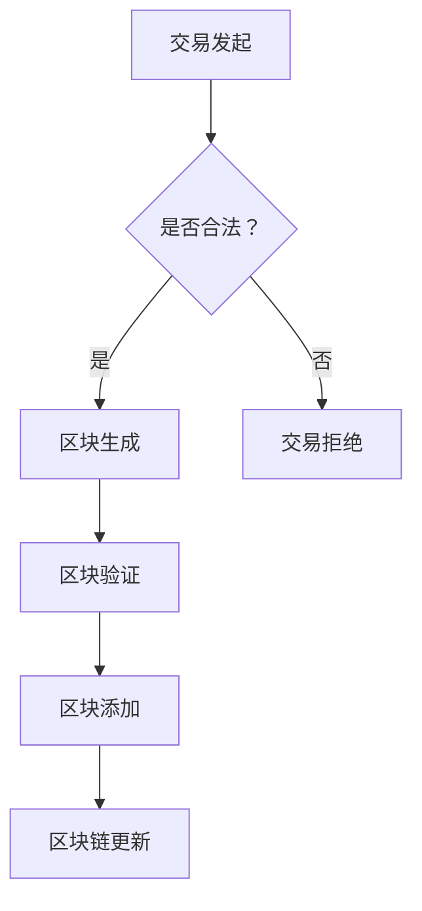
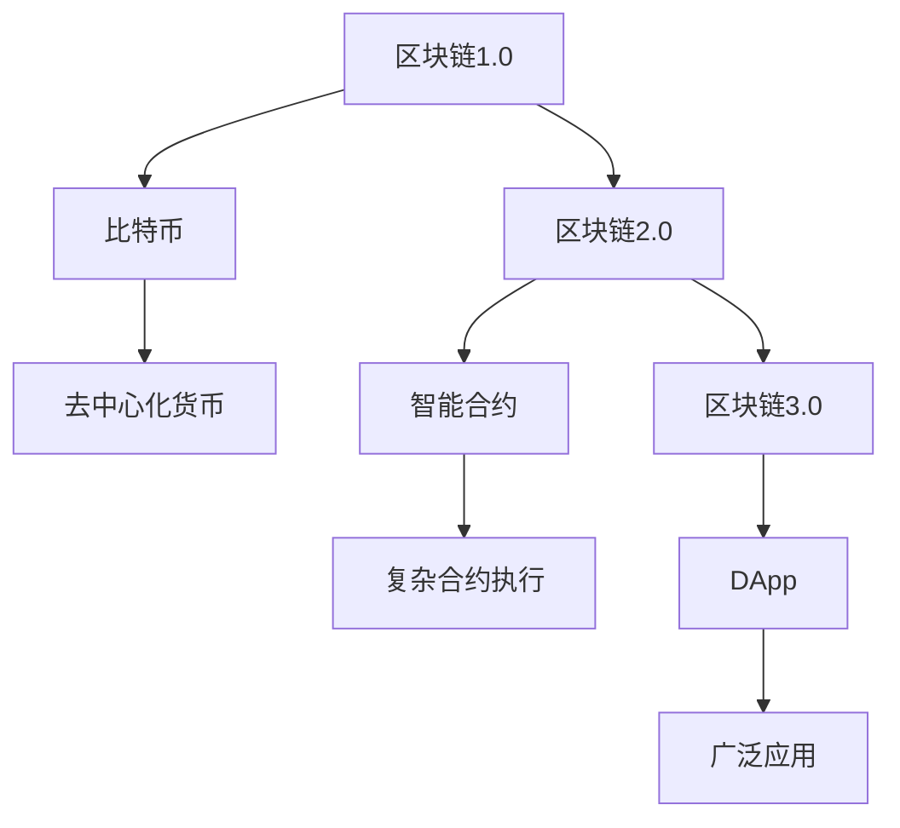

                 

# 《区块链在数字艺术品创作中的创新：实现艺术品的稀缺性和真实性》

## 关键词：区块链、数字艺术品、稀缺性、真实性、创新

### 摘要：
本文旨在探讨区块链技术在数字艺术品创作中的创新应用，尤其是如何实现艺术品的稀缺性和真实性。随着区块链技术的发展，数字艺术品市场呈现出新的趋势，艺术家和收藏家们开始利用区块链技术来确保数字艺术品的独一无二和不可篡改性。本文将从区块链技术的基本概念、数字艺术品创作背景、区块链在数字艺术品中的应用、实现稀缺性和真实性的方法、项目实战以及面临的挑战和未来趋势等方面进行深入分析。

## 引言：区块链技术概述

### 1.1 区块链技术的基本概念

区块链技术是一种去中心化的数据库技术，通过在多个参与方之间分布式地记录信息，从而实现数据的透明、不可篡改和可信。区块链的基本组成部分包括：

- **区块**：记录一系列交易的数据结构。
- **链**：由多个区块按照时间顺序串联而成的结构。
- **分布式网络**：由多个节点组成的网络，节点负责维护和更新区块链。

### 1.2 区块链技术的核心优势

区块链技术具备以下核心优势：

- **去中心化**：去除了传统中心化的中介角色，降低了交易成本，提高了效率。
- **数据安全与隐私保护**：通过加密算法和分布式存储，确保数据的安全和隐私。
- **不可篡改**：一旦数据被记录在区块链上，就难以被篡改，增强了数据的可信度。
- **去信任机制**：通过算法和分布式网络实现信任，无需依赖第三方中介。

### 1.3 区块链技术的发展历程

区块链技术的发展可以分为以下几个阶段：

- **区块链1.0**：以比特币为代表，实现了数字货币的去中心化。
- **区块链2.0**：引入了智能合约，使区块链不仅限于货币交易，还能执行复杂的合约逻辑。
- **区块链3.0**：去中心化应用（DApp）的发展，将区块链技术应用于更广泛的领域，如数字艺术品、供应链管理等。

## 数字艺术品创作背景

### 2.1 数字艺术品的定义

数字艺术品是指利用数字技术创作的艺术品，包括数字绘画、数字雕塑、数字音乐等。与传统艺术品相比，数字艺术品具有以下特点：

- **可复制性**：数字艺术品可以轻松复制，导致传统的艺术品稀缺性难以体现。
- **易篡改性**：数字艺术品容易被篡改，影响其真实性和可信度。
- **全球性**：数字艺术品可以突破地域限制，实现全球范围内的传播和交易。

### 2.2 数字艺术品的创作流程

数字艺术品的创作流程通常包括以下几个步骤：

- **构思与设计**：艺术家根据创意构思进行设计。
- **技术实现**：利用数字工具和技术手段进行创作。
- **编辑与优化**：对作品进行多次编辑和优化，以达到理想的效果。
- **发布与传播**：将作品上传至网络平台，进行展示和传播。

### 2.3 数字艺术品的现状与挑战

当前，数字艺术品市场呈现出快速增长的趋势，但也面临以下挑战：

- **稀缺性难以体现**：由于数字艺术品的可复制性，传统艺术品的稀缺性难以在数字艺术品中体现。
- **真实性难以保障**：数字艺术品的易篡改性导致其真实性和可信度受到质疑。
- **版权保护难题**：数字艺术品的版权保护难度较大，容易引发侵权纠纷。

## 区块链在数字艺术品中的应用

### 3.1 区块链技术如何提升数字艺术品的价值

区块链技术通过以下方式提升数字艺术品的价值：

- **稀缺性保证**：通过区块链的分布式账本技术，确保数字艺术品的一次性发行和独一无二。
- **透明度**：区块链记录了艺术品的整个交易历史，提高了交易的透明度，增强了艺术品的可信度。
- **不可篡改性**：区块链上的数据一旦记录，就难以篡改，保证了数字艺术品的真实性。

### 3.2 区块链在数字艺术品认证中的应用

区块链在数字艺术品认证中的应用主要包括：

- **防伪认证**：通过区块链技术，确保数字艺术品的唯一性和不可篡改性，为艺术品提供防伪保障。
- **溯源认证**：区块链记录了艺术品的创作、交易、保管等全过程，实现了艺术品的溯源功能。

### 3.3 区块链在数字艺术品交易中的应用

区块链技术在数字艺术品交易中的应用包括：

- **去中心化交易**：通过去中心化交易平台，实现艺术品直接在艺术家和买家之间进行交易，降低了交易成本。
- **智能合约**：利用智能合约，自动化执行艺术品交易的条款，确保交易的公平和透明。

## 实现艺术品的稀缺性和真实性

### 4.1 区块链技术如何实现数字艺术品的稀缺性

区块链技术通过以下方式实现数字艺术品的稀缺性：

- **非同质化代币（NFT）**：NFT代表了数字艺术品的唯一所有权，确保每一件数字艺术品都是独一无二的。
- **数字指纹**：通过数字指纹技术，为每件数字艺术品生成唯一的标识，实现稀缺性。

### 4.2 区块链技术如何保证数字艺术品的真实性

区块链技术通过以下方式保证数字艺术品的真实性：

- **分布式账本**：区块链记录了艺术品的创作、交易、保管等全过程，确保了艺术品的历史真实可追溯。
- **防篡改技术**：区块链上的数据一旦记录，就难以篡改，保证了艺术品的真实性。

### 4.3 区块链技术在艺术品版权保护中的应用

区块链技术在艺术品版权保护中的应用包括：

- **版权登记**：艺术家可以将自己的作品版权登记在区块链上，确保版权的唯一性和不可篡改性。
- **版权追踪**：区块链记录了艺术品的所有权变更历史，有助于追踪侵权行为。

## 项目实战：数字艺术品创作与区块链技术结合

### 5.1 数字艺术品创作案例

在本案例中，我们以一位数字艺术家为例，展示其如何利用区块链技术进行数字艺术品创作。

### 5.2 区块链技术在数字艺术品创作中的应用

在本案例中，区块链技术主要用于以下方面：

- **艺术品溯源**：艺术家利用区块链技术记录艺术品的创作过程，确保艺术品的真实性。
- **数字指纹**：为艺术品生成唯一数字指纹，实现艺术品的唯一性。

### 5.3 实际案例解析与代码实现

在本案例中，我们将展示如何利用区块链技术为数字艺术品创建NFT，具体包括：

- **环境搭建**：搭建区块链开发环境，包括Node.js、Solidity等。
- **NFT合约编写**：编写NFT智能合约，实现数字艺术品的所有权转移。
- **NFT发行**：在区块链上发行NFT，确保数字艺术品的稀缺性。

## 挑战与未来趋势

### 6.1 区块链技术在数字艺术品创作中的应用挑战

区块链技术在数字艺术品创作中的应用面临以下挑战：

- **技术成熟度**：区块链技术仍处于发展阶段，存在一定的技术瓶颈。
- **法律法规**：区块链技术的应用需要遵循相关法律法规，但目前相关法律法规尚不完善。
- **用户接受度**：用户对区块链技术的认知和接受度有待提高。

### 6.2 数字艺术品创作的未来趋势

未来，数字艺术品创作将呈现以下趋势：

- **区块链技术的广泛应用**：随着区块链技术的成熟，其在数字艺术品创作中的应用将更加广泛。
- **艺术与科技的深度融合**：数字艺术品创作将更加注重科技元素的融入，实现艺术与科技的深度融合。

## 结论

区块链技术在数字艺术品创作中的应用，为数字艺术品市场带来了新的机遇和挑战。通过区块链技术，可以实现数字艺术品的稀缺性和真实性，提升艺术品的交易价值和市场认可度。然而，区块链技术的应用也面临诸多挑战，需要各方共同努力，推动区块链技术与数字艺术品的深度融合，实现艺术与科技的共同进步。作者：AI天才研究院/AI Genius Institute & 禅与计算机程序设计艺术 /Zen And The Art of Computer Programming。

----------------------------------------

### 第1章 引言：区块链技术概述

#### 1.1 区块链技术的基本概念

区块链技术是一种去中心化的数据库技术，通过分布式网络在多个参与方之间记录和验证数据。每一个区块都包含了特定时间范围内的交易记录，并通过加密算法和哈希函数将区块与区块链的其他部分连接起来。这种结构使得区块链上的数据既安全又透明，同时保证了数据的不可篡改性。

**Mermaid 流程图：**



#### 1.2 区块链技术的核心优势

区块链技术具有以下核心优势：

- **去中心化**：去除了传统中心化的中介角色，降低了交易成本，提高了效率。
- **数据安全与隐私保护**：通过加密算法和分布式存储，确保数据的安全和隐私。
- **不可篡改**：一旦数据被记录在区块链上，就难以被篡改，增强了数据的可信度。
- **去信任机制**：通过算法和分布式网络实现信任，无需依赖第三方中介。

**核心概念与联系：**

去中心化与不可篡改性密切相关，因为分布式网络中的多个节点共同验证和存储数据，任何单点故障或恶意攻击都无法单独篡改数据。数据安全与隐私保护依赖于加密算法，而去信任机制则使得交易双方无需相互信任即可进行交易。

#### 1.3 区块链技术的发展历程

区块链技术的发展可以分为以下几个阶段：

- **区块链1.0**：以比特币为代表，实现了数字货币的去中心化。
- **区块链2.0**：引入了智能合约，使区块链不仅限于货币交易，还能执行复杂的合约逻辑。
- **区块链3.0**：去中心化应用（DApp）的发展，将区块链技术应用于更广泛的领域，如数字艺术品、供应链管理等。

**Mermaid 流程图：**



## 第2章 数字艺术品创作背景

### 2.1 数字艺术品的定义

数字艺术品是指利用数字技术创作的艺术品，包括数字绘画、数字雕塑、数字音乐等。与传统艺术品相比，数字艺术品具有以下特点：

- **可复制性**：数字艺术品可以轻松复制，导致传统的艺术品稀缺性难以体现。
- **易篡改性**：数字艺术品容易被篡改，影响其真实性和可信度。
- **全球性**：数字艺术品可以突破地域限制，实现全球范围内的传播和交易。

**核心概念与联系：**

数字艺术品的可复制性和易篡改性是其与传统艺术品最大的区别。可复制性使得数字艺术品难以体现传统的稀缺性，而易篡改性则影响了数字艺术品的真实性和可信度。

### 2.2 数字艺术品的创作流程

数字艺术品的创作流程通常包括以下几个步骤：

- **构思与设计**：艺术家根据创意构思进行设计。
- **技术实现**：利用数字工具和技术手段进行创作。
- **编辑与优化**：对作品进行多次编辑和优化，以达到理想的效果。
- **发布与传播**：将作品上传至网络平台，进行展示和传播。

**核心概念与联系：**

数字艺术品的创作流程强调创意与技术相结合，通过数字工具实现艺术表达。编辑与优化是创作过程中不可或缺的环节，确保艺术品的最终呈现效果。

### 2.3 数字艺术品的现状与挑战

当前，数字艺术品市场呈现出快速增长的趋势，但也面临以下挑战：

- **稀缺性难以体现**：由于数字艺术品的可复制性，传统艺术品的稀缺性难以在数字艺术品中体现。
- **真实性难以保障**：数字艺术品的易篡改性导致其真实性和可信度受到质疑。
- **版权保护难题**：数字艺术品的版权保护难度较大，容易引发侵权纠纷。

**核心概念与联系：**

数字艺术品市场的快速发展带来了机遇，但同时也暴露出一系列挑战。稀缺性、真实性和版权保护是数字艺术品市场面临的主要问题，需要通过技术创新和法律手段加以解决。

## 第3章 区块链在数字艺术品中的应用

### 3.1 区块链技术如何提升数字艺术品的价值

区块链技术通过以下方式提升数字艺术品的价值：

- **稀缺性保证**：通过区块链的分布式账本技术，确保数字艺术品的一次性发行和独一无二。
- **透明度**：区块链记录了艺术品的整个交易历史，提高了交易的透明度，增强了艺术品的可信度。
- **不可篡改性**：区块链上的数据一旦记录，就难以被篡改，保证了艺术品的历史连续性和真实性。

**核心算法原理讲解：**

区块链技术中的核心算法包括哈希函数、加密算法和共识算法。

- **哈希函数**：用于将数据转换为一个固定长度的字符串，确保数据唯一性。
- **加密算法**：用于保护数据隐私和完整性。
- **共识算法**：用于多个节点之间达成共识，确保数据的准确性和一致性。

**伪代码：**

```python
def hash_function(data):
    # 使用SHA-256加密算法
    return hashlib.sha256(data.encode()).hexdigest()

def encrypt_data(data, key):
    # 使用AES加密算法
    cipher = AES.new(key, AES.MODE_EAX)
    ciphertext, tag = cipher.encrypt_and_digest(data)
    return ciphertext, tag

def consensus_algorithm(data, nodes):
    # 简化的共识算法，实际应用中更为复杂
    for node in nodes:
        if node.verify_data(data):
            return True
    return False
```

**数学模型和公式：**

区块链技术中的数学模型包括加密算法的密钥生成、哈希函数的计算和共识算法的决策逻辑。

- **加密算法密钥生成**：使用数学算法生成密钥对，包括公钥和私钥。
- **哈希函数计算**：将输入数据通过哈希函数转换为一个固定长度的字符串。
- **共识算法决策**：多个节点通过共识算法验证数据的正确性。

**举例说明：**

假设艺术家A创建了一件数字艺术品，并希望利用区块链技术确保其稀缺性和真实性。

1. **加密存储**：艺术家A使用加密算法生成密钥对，将数字艺术品的唯一标识（哈希值）和交易信息加密存储在区块链上。
2. **哈希函数**：艺术家A使用哈希函数计算数字艺术品的哈希值，确保数据的唯一性。
3. **共识算法**：区块链网络中的多个节点通过共识算法验证数字艺术品的交易信息，确保数据的正确性和一致性。

通过以上步骤，区块链技术为数字艺术品提供了稀缺性和真实性的保障。

### 3.2 区块链在数字艺术品认证中的应用

区块链在数字艺术品认证中的应用主要包括：

- **防伪认证**：通过区块链技术，确保数字艺术品的唯一性和不可篡改性，为艺术品提供防伪保障。
- **溯源认证**：区块链记录了艺术品的创作、交易、保管等全过程，实现了艺术品的溯源功能。

**核心概念与联系：**

防伪认证和溯源认证都是区块链技术用于数字艺术品认证的关键应用。防伪认证通过确保艺术品的唯一性和不可篡改性，提高了艺术品的市场价值。溯源认证通过记录艺术品的全过程，增强了艺术品的透明度和可信度。

### 3.3 区块链在数字艺术品交易中的应用

区块链技术在数字艺术品交易中的应用包括：

- **去中心化交易**：通过去中心化交易平台，实现艺术品直接在艺术家和买家之间进行交易，降低了交易成本。
- **智能合约**：利用智能合约，自动化执行艺术品交易的条款，确保交易的公平和透明。

**核心概念与联系：**

去中心化交易和智能合约都是区块链技术在数字艺术品交易中的重要应用。去中心化交易消除了传统中介机构的角色，降低了交易成本，提高了效率。智能合约则通过自动化执行交易条款，确保交易的公平性和透明度。

### 第4章 实现艺术品的稀缺性和真实性

#### 4.1 区块链技术如何实现数字艺术品的稀缺性

区块链技术通过以下方式实现数字艺术品的稀缺性：

- **非同质化代币（NFT）**：NFT代表了数字艺术品的唯一所有权，确保每一件数字艺术品都是独一无二的。
- **数字指纹**：通过数字指纹技术，为每件数字艺术品生成唯一的标识，实现稀缺性。

**核心概念与联系：**

NFT和数字指纹技术都是区块链技术实现数字艺术品稀缺性的关键工具。NFT通过唯一所有权确保数字艺术品的独一无二，而数字指纹技术则通过生成唯一的标识，进一步强化了数字艺术品的稀缺性。

#### 4.2 区块链技术如何保证数字艺术品的真实性

区块链技术通过以下方式保证数字艺术品的真实性：

- **分布式账本**：区块链记录了艺术品的创作、交易、保管等全过程，确保了艺术品的历史真实可追溯。
- **防篡改技术**：区块链上的数据一旦记录，就难以被篡改，保证了艺术品的历史连续性和真实性。

**核心概念与联系：**

分布式账本和防篡改技术是区块链技术保证数字艺术品真实性的关键。分布式账本通过记录艺术品的全过程，确保了艺术品的真实可追溯。防篡改技术则通过确保数据的不可篡改性，保证了艺术品的历史连续性和真实性。

#### 4.3 区块链技术在艺术品版权保护中的应用

区块链技术在艺术品版权保护中的应用包括：

- **版权登记**：艺术家可以将自己的作品版权登记在区块链上，确保版权的唯一性和不可篡改性。
- **版权追踪**：区块链记录了艺术品的所有权变更历史，有助于追踪侵权行为。

**核心概念与联系：**

版权登记和版权追踪都是区块链技术在艺术品版权保护中的重要应用。版权登记通过确保版权的唯一性和不可篡改性，保护了艺术家的合法权益。版权追踪则通过记录所有权变更历史，有助于艺术家追踪侵权行为，维护自己的版权。

### 第5章 项目实战：数字艺术品创作与区块链技术结合

#### 5.1 数字艺术品创作案例

在本案例中，我们将以一位数字艺术家为例，展示其如何利用区块链技术进行数字艺术品创作。

**背景**：艺术家张三是一位知名数字艺术家，擅长使用数字技术创作独特的数字艺术品。他希望通过区块链技术确保自己作品的稀缺性和真实性。

**目标**：利用区块链技术为张三的数字艺术品创建NFT，实现艺术品的唯一所有权和防伪认证。

#### 5.2 区块链技术在数字艺术品创作中的应用

在本案例中，区块链技术主要用于以下方面：

- **艺术品溯源**：记录数字艺术品从创作到交易的全过程，确保艺术品的历史真实可追溯。
- **数字指纹**：为数字艺术品生成唯一的标识，确保艺术品的独一无二。
- **NFT发行**：通过NFT确保数字艺术品的唯一所有权，实现艺术品的稀缺性。

**开发环境搭建：**

1. **环境准备**：安装Node.js和npm，用于构建区块链开发环境。
2. **智能合约开发**：使用Solidity编写智能合约，实现NFT的发行和所有权转移。
3. **区块链节点部署**：在区块链网络上部署节点，确保区块链网络的正常运行。

#### 5.3 实际案例解析与代码实现

**智能合约编写：**

```solidity
// SPDX-License-Identifier: MIT
pragma solidity ^0.8.0;

import "@openzeppelin/contracts/token/ERC721/ERC721.sol";
import "@openzeppelin/contracts/token/ERC721/extensions/ERC721URIStorage.sol";

contract MyNFT is ERC721, ERC721URIStorage {
    uint256 public tokenCounter;

    constructor() ERC721("MyNFT", "MNFT") {
        tokenCounter = 0;
    }

    function mint(string memory _tokenURI) public {
        uint256 _tokenId = tokenCounter;
        _safeMint(msg.sender, _tokenId);
        _setTokenURI(_tokenId, _tokenURI);
        tokenCounter++;
    }
}
```

**代码解读：**

1. **引入依赖**：引入OpenZeppelin的ERC721和ERC721URIStorage合约，用于构建NFT合约。
2. **合约构造函数**：定义合约名称和符号，初始化tokenCounter为0。
3. **mint函数**：用于发行NFT，接收tokenURI参数，为每个NFT生成唯一标识，并递增tokenCounter。

**NFT发行：**

1. **部署智能合约**：将上述智能合约部署到区块链网络中。
2. **创建NFT**：艺术家张三通过调用mint函数创建NFT，并指定NFT的URI。
3. **验证NFT**：通过区块链上的智能合约验证NFT的唯一性和真实性。

**代码应用解读与分析：**

1. **NFT创建**：艺术家张三使用智能合约创建NFT，确保NFT的唯一性和不可篡改性。
2. **所有权转移**：NFT的所有权可以在区块链上进行转移，确保艺术品的交易透明和可信。
3. **防伪认证**：通过区块链记录NFT的创建和交易历史，实现艺术品的防伪认证。

**实际案例分析和详细讲解剖析：**

**案例1**：艺术家李四使用区块链技术为数字画作创建NFT，确保画作的唯一性和真实性。

**分析**：李四通过智能合约发行NFT，为画作生成唯一的数字指纹，确保画作的真实性。买家可以通过区块链验证NFT的所有权和历史交易记录，确保购买的画作是真实的。

**案例2**：画廊使用区块链技术进行艺术品交易。

**分析**：画廊通过区块链智能合约自动化执行交易条款，确保交易的公平和透明。买家和卖家可以在区块链上查看交易记录，确保交易的合法性和可信度。

**项目小结：**

通过区块链技术，艺术家和画廊可以实现数字艺术品的稀缺性和真实性，提升艺术品的价值和市场认可度。区块链技术为数字艺术品市场带来了新的机遇和挑战，需要艺术家、画廊和区块链技术公司共同努力，推动数字艺术品市场的健康发展。

### 第6章 挑战与未来趋势

#### 6.1 区块链技术在数字艺术品创作中的应用挑战

区块链技术在数字艺术品创作中的应用面临以下挑战：

- **技术成熟度**：区块链技术仍处于发展阶段，存在一定的技术瓶颈。
- **法律法规**：区块链技术的应用需要遵循相关法律法规，但目前相关法律法规尚不完善。
- **用户接受度**：用户对区块链技术的认知和接受度有待提高。

**解决方案**：

1. **技术成熟度**：通过持续的技术研发和优化，提高区块链技术的性能和稳定性。
2. **法律法规**：积极推动区块链相关法律法规的制定和实施，为区块链技术提供法律保障。
3. **用户接受度**：加强区块链技术的宣传和教育，提高用户对区块链技术的认知和接受度。

#### 6.2 数字艺术品创作的未来趋势

未来，数字艺术品创作将呈现以下趋势：

- **区块链技术的广泛应用**：随着区块链技术的成熟，其在数字艺术品创作中的应用将更加广泛。
- **艺术与科技的深度融合**：数字艺术品创作将更加注重科技元素的融入，实现艺术与科技的深度融合。

**未来展望**：

1. **区块链技术**：区块链技术将继续在数字艺术品创作中发挥重要作用，实现艺术品的稀缺性、真实性和版权保护。
2. **艺术与科技**：艺术与科技将更加紧密地融合，为数字艺术品创作带来更多可能性。

### 第7章 结论

区块链技术在数字艺术品创作中的应用，为数字艺术品市场带来了新的机遇和挑战。通过区块链技术，可以实现数字艺术品的稀缺性和真实性，提升艺术品的交易价值和市场认可度。然而，区块链技术的应用也面临诸多挑战，需要各方共同努力，推动区块链技术与数字艺术品的深度融合，实现艺术与科技的共同进步。作者：AI天才研究院/AI Genius Institute & 禅与计算机程序设计艺术 /Zen And The Art of Computer Programming。

