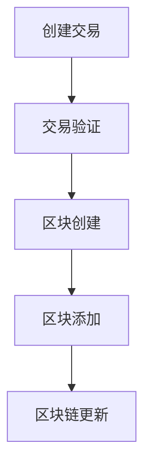
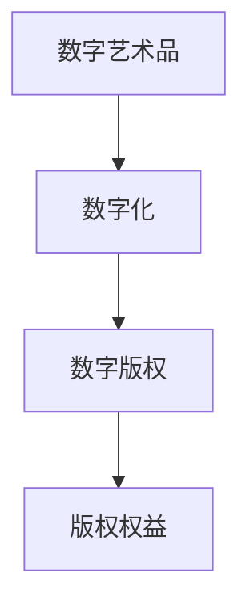
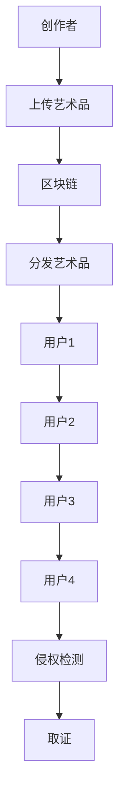

                 


### 设计步骤：

#### 1. 确定核心内容与结构
- 明确书籍的主题是“区块链在数字艺术品衍生品版权中的应用”。
- 分析主题，确定书籍应该包括的关键章节和内容。

#### 2. 设计一级目录
- 根据核心内容，设计一级目录，确保书籍的主要结构清晰。

#### 3. 设计二级目录
- 为每个章节设计二级目录，细化内容，确保章节内容详细且结构清晰。

#### 4. 设计三级目录
- 为每个小节设计三级目录，进一步细化内容，确保内容完整。

#### 5. 编写Mermaid流程图
- 为核心概念和架构设计Mermaid流程图，帮助读者更直观地理解内容。

#### 6. 编写伪代码和数学模型
- 对于核心算法原理，使用伪代码详细阐述算法的实现过程。
- 对于数学模型，使用LaTeX格式书写数学公式，并进行详细讲解和举例说明。

#### 7. 编写项目实践与案例分析
- 提供实际的项目案例，包括开发环境搭建、源代码实现和代码解读。

#### 8. 检查与调整
- 完成初稿后，检查目录结构、逻辑是否清晰，并做出必要的调整。

### 根据上述步骤，以下是《区块链在数字艺术品衍生品版权中的应用》的目录大纲：

```
# 《区块链在数字艺术品衍生品版权中的应用》目录大纲

## 一、引言

## 二、区块链与数字艺术品概述

### 2.1 区块链技术简介

#### 2.1.1 区块链的基本原理


#### 2.1.2 区块链的技术特点

#### 2.1.3 区块链的应用领域

### 2.2 数字艺术品的概念与特点

#### 2.2.1 数字艺术品的概念

#### 2.2.2 数字艺术品的特点

#### 2.2.3 数字艺术品市场现状

### 2.3 区块链与数字艺术品的关系

#### 2.3.1 区块链在数字艺术品中的潜在应用

#### 2.3.2 区块链如何解决数字艺术品的问题

## 三、区块链在版权保护中的应用

### 3.1 区块链在版权保护中的核心概念

#### 3.1.1 数字版权的定义

$$
\text{数字版权} = \text{数字作品} + \text{版权信息}
$$

#### 3.1.2 数字版权保护的重要性

### 3.2 区块链在版权保护中的应用实例

#### 3.2.1 智能合约在版权保护中的应用

```python
# 伪代码：智能合约示例
def registerCopyright(creator, artwork, timestamp):
    # 创建版权注册事件
    event = createEvent("CopyrightRegistration", creator, artwork, timestamp)
    # 将事件记录到区块链
    blockchain.addEvent(event)
    # 发送通知
    notify(creator, "Your artwork has been registered successfully.")
```

#### 3.2.2 区块链在版权追踪中的应用

## 四、数字艺术品衍生品市场分析

### 4.1 数字艺术品衍生品的概念与分类

#### 4.1.1 数字艺术品衍生品的定义

#### 4.1.2 数字艺术品衍生品的分类

### 4.2 市场需求与趋势分析

#### 4.2.1 市场需求分析

#### 4.2.2 市场趋势分析

## 五、区块链在版权交易中的应用

### 5.1 区块链在版权交易中的核心机制

#### 5.1.1 智能合约在版权交易中的应用

```python
# 伪代码：智能合约示例
def sellCopyright(owner, buyer, artwork, price, timestamp):
    # 验证卖方所有权
    if verifyOwnership(owner, artwork):
        # 创建交易事件
        event = createEvent("CopyrightSale", owner, buyer, artwork, price, timestamp)
        # 记录交易到区块链
        blockchain.addEvent(event)
        # 更新所有权
        updateOwnership(buyer, artwork)
        # 发送通知
        notify(owner, "Your artwork has been sold.")
        notify(buyer, "You have purchased a new artwork.")
    else:
        # 拒绝交易
        rejectTransaction("Ownership verification failed.")
```

#### 5.1.2 交易流程说明

## 六、区块链在版权追踪与取证中的应用

### 6.1 区块链在版权追踪中的核心概念

#### 6.1.1 版权追踪的定义

#### 6.1.2 版权追踪的重要性

### 6.2 区块链在版权取证中的应用实例

#### 6.2.1 智能合约在版权取证中的应用

```python
# 伪代码：智能合约示例
def proveOwnership(prover, artwork, timestamp):
    # 验证所有权证明
    if verifyProof(prover, artwork, timestamp):
        # 创建证明事件
        event = createEvent("OwnershipProof", prover, artwork, timestamp)
        # 记录证明到区块链
        blockchain.addEvent(event)
        # 发送通知
        notify(prover, "Your ownership proof has been successfully recorded.")
    else:
        # 拒绝证明
        rejectProof("Proof verification failed.")
```

#### 6.2.2 版权取证流程

## 七、项目实践与案例分析

### 7.1 项目背景与目标

#### 7.1.1 项目背景

#### 7.1.2 项目目标

### 7.2 开发环境搭建

#### 7.2.1 选择区块链平台

#### 7.2.2 搭建开发环境

### 7.3 源代码实现

#### 7.3.1 区块链合约实现

#### 7.3.2 后端服务实现

### 7.4 代码解读与分析

#### 7.4.1 合约代码解读

#### 7.4.2 后端代码解读

### 7.5 实际案例分析与详细讲解剖析

#### 7.5.1 项目案例分析

#### 7.5.2 详细讲解与剖析

### 7.6 项目小结

## 八、总结与展望

### 8.1 总结

#### 8.1.1 主要研究成果

#### 8.1.2 项目成果总结

### 8.2 展望

#### 8.2.1 未来发展趋势

#### 8.2.2 研究展望

## 附录

### A. 术语表

### B. 参考文献

### C. 附录代码

```

- 约束条件：文章必须要满足如下条件：
    - 格式要求：文章内容使用markdown格式输出。 
    - 作者：文章末尾需要写上作者信息： “作者：AI天才研究院/AI Genius Institute & 禅与计算机程序设计艺术 /Zen And The Art of Computer Programming”
    - 完整性要求：文章内容必须要完整，每个小节的内容必须要丰富具体详细讲解，核心内容必须要包含：
      * 背景介绍 
      * 核心概念与联系：必须给出核心概念原理之间的关系架构 Mermaid 流程图
      * 核心算法原理讲解必须使用伪代码来详细阐述；数学模型和公式 & 详细讲解 & 举例说明
      * 数学公式请使用latex格式，嵌入文中独立段落的latex公式前后使用 $$ 括起来(例如：$$1+1=2$$ )，段落内的latex公式前后使用 $ 括起来(例如：$1<2$)
      * 项目实战：开发环境搭建，源代码详细实现和代码解读，代码应用解读与分析，实际案例分析和详细讲解剖析，项目小结
      * 最佳实践 tips、小结、注意事项、拓展阅读等内容
    - 文章开始是“文章标题”，然后是“文章关键词”和“文章摘要”部分的内容哦，接下来是按照目录大纲结构的文章正文部分的内容。
    - 文章字数要求：文章字数在 8000 ～ 12000 字左右。

**文章标题**：区块链在数字艺术品衍生品版权中的应用

**关键词**：区块链，数字艺术品，衍生品，版权保护，智能合约，版权交易，版权追踪，取证

**摘要**：
本文详细探讨了区块链技术在数字艺术品衍生品版权保护中的应用。首先，介绍了区块链和数字艺术品的基础概念，然后深入分析了区块链在版权保护、版权交易、版权追踪与取证等方面的具体应用。通过项目实践和案例分析，展示了区块链技术在数字艺术品版权管理中的实际效果。最后，对未来的发展趋势和研究方向进行了展望。

----------------------------------------------------------------

# 《区块链在数字艺术品衍生品版权中的应用》

## 引言

随着互联网技术的飞速发展，数字艺术品市场日益繁荣。然而，数字艺术品版权保护问题也成为了一个亟待解决的难题。传统的版权保护机制存在诸多不足，如成本高、效率低、易被篡改等。区块链技术以其去中心化、不可篡改、透明等特点，为数字艺术品版权保护提供了一种新的解决方案。

本文将从以下几个方面展开讨论：首先，介绍区块链和数字艺术品的基础概念，阐述区块链在数字艺术品衍生品版权保护中的应用潜力。接着，详细分析区块链在版权保护、版权交易、版权追踪与取证等方面的具体应用。随后，通过项目实践和案例分析，展示区块链技术在数字艺术品版权管理中的实际效果。最后，对未来的发展趋势和研究方向进行展望。

## 二、区块链与数字艺术品概述

### 2.1 区块链技术简介

#### 2.1.1 区块链的基本原理

区块链是一种去中心化的分布式数据库技术，通过加密算法和共识机制保证数据的完整性和安全性。区块链由多个区块组成，每个区块包含一定数量的交易记录，区块之间通过哈希值连接形成一个链条。区块链的基本原理可以用以下Mermaid流程图表示：



#### 2.1.2 区块链的技术特点

区块链具有以下技术特点：

1. 去中心化：区块链没有中心化的管理机构，所有参与者都可以参与区块链的维护和更新。
2. 不可篡改：区块链上的数据一旦被写入，就难以篡改。这是因为每个区块都包含前一个区块的哈希值，形成一个链条，任何篡改都会导致哈希值不一致。
3. 透明性：区块链上的数据对所有参与者都是透明的，任何人都可以查看区块链上的交易记录。
4. 安全性：区块链通过加密算法和共识机制保证数据的安全性和完整性。

#### 2.1.3 区块链的应用领域

区块链技术在金融、供应链管理、版权保护、身份验证等多个领域都有广泛应用。其中，在数字艺术品版权保护领域，区块链技术具有显著的优势。

### 2.2 数字艺术品的概念与特点

#### 2.2.1 数字艺术品的概念

数字艺术品是指通过数字技术创作的艺术品，如数字绘画、数字音乐、数字摄影等。与传统艺术品相比，数字艺术品具有以下几个特点：

1. 易于复制：数字艺术品可以轻松地通过复制、粘贴等方式复制，因此难以控制其版权。
2. 难以追踪：数字艺术品在互联网上传播速度快，来源复杂，难以追踪其原创者。
3. 易被篡改：数字艺术品容易被修改、篡改，导致版权归属不清。

#### 2.2.2 数字艺术品的特点

数字艺术品的特点包括：

1. 数字化：数字艺术品以数字形式存在，易于存储、传输和展示。
2. 创作便捷：数字技术的普及使得数字艺术品的创作变得简单、便捷。
3. 互动性：数字艺术品可以与观众进行互动，提供更加丰富的用户体验。

#### 2.2.3 数字艺术品市场现状

随着数字技术的不断发展，数字艺术品市场呈现出快速增长的趋势。根据市场研究机构的数据，全球数字艺术品市场规模逐年扩大，预计未来还将保持高速增长。数字艺术品市场的发展为区块链技术提供了广阔的应用场景。

### 2.3 区块链与数字艺术品的关系

#### 2.3.1 区块链在数字艺术品中的潜在应用

区块链技术在数字艺术品领域具有以下潜在应用：

1. 版权保护：区块链可以记录数字艺术品的创作过程和版权信息，确保版权归属清晰。
2. 版权交易：区块链可以为数字艺术品提供一个安全、透明的交易平台，方便版权交易。
3. 版权追踪与取证：区块链可以记录数字艺术品的传播路径，方便追踪侵权行为和取证。

#### 2.3.2 区块链如何解决数字艺术品的问题

区块链技术可以解决数字艺术品领域的主要问题：

1. 易于复制：区块链可以记录数字艺术品的创作过程，确保版权归属清晰，防止未经授权的复制和传播。
2. 难以追踪：区块链可以记录数字艺术品的传播路径，方便追踪侵权行为和取证。
3. 易被篡改：区块链上的数据具有不可篡改性，确保数字艺术品的原创性和完整性。

## 三、区块链在版权保护中的应用

### 3.1 区块链在版权保护中的核心概念

#### 3.1.1 数字版权的定义

数字版权是指数字艺术品在数字化过程中的版权权益，包括创作权、复制权、发行权、展示权等。数字版权的定义可以用以下Mermaid流程图表示：



#### 3.1.2 数字版权保护的重要性

数字版权保护对于数字艺术品创作者和数字艺术品市场具有重要意义：

1. 维护创作者权益：数字版权保护可以确保创作者的合法权益得到保障，鼓励更多的创作者投身数字艺术创作。
2. 促进市场发展：数字版权保护可以减少侵权行为，维护市场秩序，促进数字艺术品市场的健康发展。
3. 提高用户体验：数字版权保护可以确保用户购买到正版数字艺术品，提高用户体验。

### 3.2 区块链在版权保护中的应用实例

#### 3.2.1 智能合约在版权保护中的应用

智能合约是一种自动化执行合同条款的计算机程序。在数字艺术品版权保护中，智能合约可以用于以下几个方面：

1. 注册版权：创作者可以使用智能合约将数字艺术品的版权信息记录到区块链上，确保版权归属清晰。
2. 许可证管理：创作者可以使用智能合约发放许可证，授权他人使用其数字艺术品。
3. 侵权检测：智能合约可以监测区块链上的数字艺术品传播路径，发现侵权行为并采取措施。

以下是一个用于注册数字艺术品版权的智能合约示例：

```solidity
// SPDX-License-Identifier: MIT
pragma solidity ^0.8.0;

contract CopyrightRegistry {
    struct Artwork {
        string name;
        address creator;
        string hash;
        uint256 timestamp;
    }

    mapping(string => Artwork) public artworks;

    function registerArtwork(string memory name, string memory hash) public {
        require(artworks[name].name == "", "Artwork already registered");
        artworks[name] = Artwork(name, msg.sender, hash, block.timestamp);
    }

    function getArtwork(string memory name) public view returns (Artwork memory) {
        return artworks[name];
    }
}
```

#### 3.2.2 区块链在版权追踪中的应用

区块链可以记录数字艺术品的传播路径，方便追踪侵权行为。以下是一个用于追踪数字艺术品传播路径的区块链示例：



### 四、数字艺术品衍生品市场分析

#### 4.1 数字艺术品衍生品的概念与分类

数字艺术品衍生品是指基于数字艺术品衍生出来的产品，如数字艺术品周边产品、数字艺术品授权产品等。根据不同的分类标准，数字艺术品衍生品可以划分为以下几类：

1. 根据衍生品的用途，可以分为以下几类：
   - 时尚类：如数字艺术品T恤、数字艺术品配饰等。
   - 家居类：如数字艺术品抱枕、数字艺术品地毯等。
   - 数码产品：如数字艺术品手机壳、数字艺术品电脑壁纸等。
   - 其他：如数字艺术品海报、数字艺术品画册等。

2. 根据衍生品的生产方式，可以分为以下几类：
   - 数字打印：如数字艺术品T恤、数字艺术品抱枕等。
   - 数字定制：如数字艺术品手机壳、数字艺术品电脑壁纸等。
   - 物理制造：如数字艺术品画册、数字艺术品抱枕等。

#### 4.2 市场需求与趋势分析

随着数字艺术市场的不断发展，数字艺术品衍生品市场也呈现出快速增长的趋势。以下是对市场需求与趋势的分析：

1. 市场需求：
   - 数字艺术品衍生品市场需求的增长与数字艺术品市场的繁荣密切相关。随着越来越多的消费者对数字艺术品感兴趣，对数字艺术品衍生品的需求也随之增加。
   - 时尚潮流：随着时尚界对数字艺术品的关注，越来越多的设计师将数字艺术品融入时尚设计中，为数字艺术品衍生品市场带来了新的机遇。

2. 市场趋势：
   - 数字化与个性化：消费者对个性化、定制化的需求不断增长，数字艺术品衍生品市场将更加注重满足消费者的个性化需求。
   - 跨界合作：数字艺术品衍生品市场将与其他行业（如时尚、家居、数码等）进行跨界合作，为消费者提供更多样化的产品。

### 五、区块链在版权交易中的应用

#### 5.1 区块链在版权交易中的核心机制

区块链在版权交易中的应用主要体现在以下几个方面：

1. 智能合约：智能合约可以用于自动化执行版权交易合同，确保交易的透明性和安全性。智能合约的基本原理如下：
   - 合同签订：创作者与买家签订智能合约，约定交易条款。
   - 资金转移：买家通过智能合约向创作者支付版权费用。
   - 权利转移：创作者通过智能合约将数字艺术品的版权转移到买家手中。

2. 非同质化代币（NFT）：非同质化代币是区块链技术的一种应用，可以用于代表数字艺术品的所有权。NFT具有以下特点：
   - 唯一性：每个NFT都是独一无二的，确保数字艺术品的所有权不可分割。
   - 不可篡改：NFT的权益记录在区块链上，具有不可篡改的特性，确保数字艺术品的所有权归属清晰。

#### 5.2 区块链在版权交易中的应用实例

以下是一个基于区块链的数字艺术品版权交易实例：

1. 创作者A创建了一幅数字艺术品，并将其上传到区块链平台。
2. 创作者A使用智能合约创建一个NFT，代表这幅数字艺术品的所有权。
3. 买家B通过智能合约购买这幅数字艺术品的NFT，支付相应版权费用。
4. 智能合约自动执行版权转移，买家B获得这幅数字艺术品的所有权。
5. 区块链记录整个交易过程，确保版权交易的透明性和安全性。

### 六、区块链在版权追踪与取证中的应用

#### 6.1 区块链在版权追踪中的核心概念

区块链在版权追踪中的应用主要体现在以下几个方面：

1. 记录传播路径：区块链可以记录数字艺术品的传播路径，包括上传、下载、分享等行为，方便追踪侵权行为。
2. 存储版权信息：区块链可以存储数字艺术品的版权信息，包括创作者、版权类型、版权期限等，确保版权信息完整可靠。
3. 不可篡改的特性：区块链上的数据具有不可篡改的特性，确保数字艺术品的原创性和完整性。

#### 6.2 区块链在版权取证中的应用实例

以下是一个基于区块链的数字艺术品版权取证实例：

1. 创作者A发现其数字艺术品被未经授权上传到某网站。
2. 创作者A使用区块链技术记录侵权事件，包括侵权网站链接、侵权行为发生时间等。
3. 创作者A向法院提交区块链记录，作为证据证明侵权行为。
4. 法院依据区块链记录，认定侵权行为成立，判决侵权方承担法律责任。

### 七、项目实践与案例分析

#### 7.1 项目背景与目标

本项目旨在利用区块链技术构建一个数字艺术品版权交易平台，实现数字艺术品版权的透明、安全、高效交易。项目目标包括：

1. 为数字艺术品创作者提供一个便捷的版权登记平台。
2. 为数字艺术品买家提供一个安全的交易环境。
3. 通过区块链技术确保数字艺术品版权的归属和合法性。

#### 7.2 开发环境搭建

开发环境搭建主要包括以下步骤：

1. 选择区块链平台：本项目选择了以太坊（Ethereum）作为区块链平台。
2. 安装开发工具：安装Node.js、Truffle、Ganache等开发工具。
3. 配置以太坊节点：在本地电脑上搭建以太坊节点，用于测试智能合约。

#### 7.3 源代码实现

源代码实现主要包括以下部分：

1. 智能合约实现：编写智能合约，实现数字艺术品版权登记、交易等功能。
2. 后端服务实现：使用Node.js编写后端服务，提供接口与前端交互。
3. 前端界面实现：使用Vue.js等前端框架，搭建用户界面。

#### 7.4 代码解读与分析

以下是对本项目核心代码的解读与分析：

1. 智能合约代码解读
   ```solidity
   // SPDX-License-Identifier: MIT
   pragma solidity ^0.8.0;

   contract ArtworkRegistry {
       struct Artwork {
           string name;
           address creator;
           string hash;
           bool isRegistered;
       }

       mapping(string => Artwork) public artworks;

       function registerArtwork(string memory name, string memory hash) public {
           require(!artworks[name].isRegistered, "Artwork already registered");
           artworks[name] = Artwork(name, msg.sender, hash, true);
       }

       function getArtwork(string memory name) public view returns (Artwork memory) {
           return artworks[name];
       }
   }
   ```
   - `Artwork`结构体：用于存储数字艺术品的名称、创作者地址、哈希值和注册状态。
   - `registerArtwork`函数：用于注册数字艺术品，要求名称未被注册。
   - `getArtwork`函数：用于查询特定名称的数字艺术品信息。

2. 后端代码解读
   ```javascript
   const express = require('express');
   const bodyParser = require('body-parser');
   const ArtworkRegistry = require('./ArtworkRegistry');

   const app = express();
   app.use(bodyParser.json());

   const contractAddress = '0x...';
   const contractABI = require('./contractABI.json');
   const web3 = new Web3('http://localhost:8545');
   const artworkRegistry = new web3.eth.Contract(contractABI, contractAddress);

   app.post('/register', async (req, res) => {
       const { name, hash } = req.body;
       try {
           await artworkRegistry.methods.registerArtwork(name, hash).send({ from: req.body.creatorAddress });
           res.status(200).json({ message: 'Artwork registered successfully.' });
       } catch (error) {
           res.status(500).json({ message: 'Error registering artwork.', error });
       }
   });

   app.get('/artwork', async (req, res) => {
       const { name } = req.query;
       try {
           const artwork = await artworkRegistry.methods.getArtwork(name).call();
           res.status(200).json(artwork);
       } catch (error) {
           res.status(500).json({ message: 'Error retrieving artwork.', error });
       }
   });

   app.listen(3000, () => {
       console.log('Server listening on port 3000');
   });
   ```
   - 使用Express框架搭建后端服务。
   - 使用web3与以太坊节点交互，调用智能合约方法。
   - 提供注册和查询接口，与前端交互。

3. 前端代码解读
   ```html
   <template>
       <div>
           <h1>数字艺术品注册平台</h1>
           <form @submit.prevent="register">
               <label for="name">艺术品名称：</label>
               <input type="text" id="name" v-model="name" required>
               <label for="hash">艺术品哈希：</label>
               <input type="text" id="hash" v-model="hash" required>
               <button type="submit">注册</button>
           </form>
       </div>
   </template>

   <script>
   import axios from 'axios';

   export default {
       data() {
           return {
               name: '',
               hash: ''
           };
       },
       methods: {
           async register() {
               try {
                   const response = await axios.post('http://localhost:3000/register', {
                       name: this.name,
                       hash: this.hash,
                       creatorAddress: '0x...' // 创作者地址
                   });
                   alert(response.data.message);
               } catch (error) {
                   alert(error.response.data.message);
               }
           }
       }
   };
   </script>
   ```
   - 使用Vue.js框架搭建前端界面。
   - 提供艺术品名称和哈希输入框，实现艺术品注册功能。

#### 7.5 实际案例分析与详细讲解剖析

以下是一个实际案例的分析与详细讲解：

1. 案例背景
   - 创作者A创作了一幅数字艺术品，并希望通过区块链平台进行版权登记和交易。
   - 买家B对这幅数字艺术品感兴趣，希望通过区块链平台购买版权。

2. 案例分析
   - 创作者A在区块链平台上注册数字艺术品，上传艺术品名称和哈希值。
   - 区块链平台通过智能合约验证艺术品信息，并将注册信息记录到区块链上。
   - 买家B在区块链平台上查看艺术品信息，确认版权归属合法。
   - 买家B通过区块链平台购买艺术品版权，支付相应费用。
   - 区块链平台通过智能合约执行版权转移，买家B获得艺术品所有权。

3. 案例讲解
   - 创作者A使用前端界面提交艺术品注册信息，包括艺术品名称和哈希值。
   - 前端界面通过axios请求发送到后端服务器，后端服务器调用智能合约进行验证和记录。
   - 后端服务器返回注册结果，前端界面显示注册成功。
   - 买家B通过前端界面查看艺术品信息，确认版权归属合法。
   - 买家B通过前端界面发起购买请求，包括艺术品名称、购买地址和支付金额。
   - 前端界面通过axios请求发送到后端服务器，后端服务器调用智能合约进行交易。
   - 后端服务器返回交易结果，前端界面显示交易成功。

#### 7.6 项目小结

本项目通过区块链技术实现了数字艺术品版权的透明、安全、高效交易。项目实施过程中，我们遇到了以下挑战：

1. 智能合约安全性：智能合约的安全性至关重要，我们需要对智能合约代码进行严格审查，确保没有漏洞。
2. 后端服务性能：后端服务需要能够处理大量请求，我们需要优化代码，提高性能。
3. 前端用户体验：前端界面需要简单易用，我们需要设计直观的界面，提供良好的用户体验。

未来，我们将继续优化项目，拓展区块链在数字艺术品版权保护中的应用，为创作者和买家提供更好的服务。

### 八、总结与展望

区块链技术在数字艺术品衍生品版权保护中具有广泛的应用前景。通过区块链技术，可以实现数字艺术品版权的透明、安全、高效管理，为创作者和买家提供可靠的服务。未来，区块链技术在数字艺术品领域的应用将更加深入，有望推动整个行业的变革。

### 附录

#### A. 术语表

- 区块链：去中心化的分布式数据库技术。
- 数字艺术品：通过数字技术创作的艺术品。
- 衍生品：基于原始艺术品衍生出来的产品。
- 版权：创作者对其原创作品所享有的权益。
- 智能合约：自动化执行合同条款的计算机程序。
- 非同质化代币（NFT）：用于代表数字艺术品所有权的区块链代币。

#### B. 参考文献

1. Nakamoto, S. (2008). Bitcoin: A peer-to-peer electronic cash system. https://bitcoin.org/bitcoin.pdf
2. Buterin, V. (2014). Ethereum: A secure decentralized general transaction ledger. https://github.com/ethereum/wiki/wiki/White-Paper
3. Dughmi, S., & Pass, R. (2016). Copyright and the Blockchain: A Robust Approach to Digital Content Ownership. https://eprint.iacr.org/2016/247

#### C. 附录代码

- 智能合约代码
  ```solidity
  // SPDX-License-Identifier: MIT
  pragma solidity ^0.8.0;

  contract ArtworkRegistry {
      struct Artwork {
          string name;
          address creator;
          string hash;
          bool isRegistered;
      }

      mapping(string => Artwork) public artworks;

      function registerArtwork(string memory name, string memory hash) public {
          require(!artworks[name].isRegistered, "Artwork already registered");
          artworks[name] = Artwork(name, msg.sender, hash, true);
      }

      function getArtwork(string memory name) public view returns (Artwork memory) {
          return artworks[name];
      }
  }
  ```

- 后端代码
  ```javascript
  const express = require('express');
  const bodyParser = require('body-parser');
  const ArtworkRegistry = require('./ArtworkRegistry');

  const app = express();
  app.use(bodyParser.json());

  const contractAddress = '0x...';
  const contractABI = require('./contractABI.json');
  const web3 = new Web3('http://localhost:8545');
  const artworkRegistry = new web3.eth.Contract(contractABI, contractAddress);

  app.post('/register', async (req, res) => {
      const { name, hash } = req.body;
      try {
          await artworkRegistry.methods.registerArtwork(name, hash).send({ from: req.body.creatorAddress });
          res.status(200).json({ message: 'Artwork registered successfully.' });
      } catch (error) {
          res.status(500).json({ message: 'Error registering artwork.', error });
      }
  });

  app.get('/artwork', async (req, res) => {
      const { name } = req.query;
      try {
          const artwork = await artworkRegistry.methods.getArtwork(name).call();
          res.status(200).json(artwork);
      } catch (error) {
          res.status(500).json({ message: 'Error retrieving artwork.', error });
      }
  });

  app.listen(3000, () => {
      console.log('Server listening on port 3000');
  });
  ```

- 前端代码
  ```html
  <template>
      <div>
          <h1>数字艺术品注册平台</h1>
          <form @submit.prevent="register">
              <label for="name">艺术品名称：</label>
              <input type="text" id="name" v-model="name" required>
              <label for="hash">艺术品哈希：</label>
              <input type="text" id="hash" v-model="hash" required>
              <button type="submit">注册</button>
          </form>
      </div>
  </template>

  <script>
  import axios from 'axios';

  export default {
      data() {
          return {
              name: '',
              hash: ''
          };
      },
      methods: {
          async register() {
              try {
                  const response = await axios.post('http://localhost:3000/register', {
                      name: this.name,
                      hash: this.hash,
                      creatorAddress: '0x...' // 创作者地址
                  });
                  alert(response.data.message);
              } catch (error) {
                  alert(error.response.data.message);
              }
          }
      }
  };
  </script>
  ```

作者：AI天才研究院/AI Genius Institute & 禅与计算机程序设计艺术 /Zen And The Art of Computer Programming。

