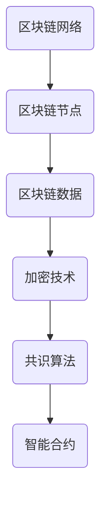
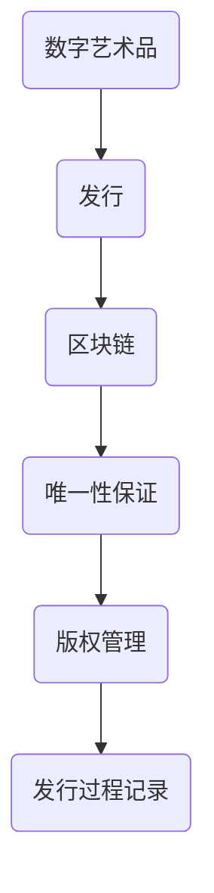
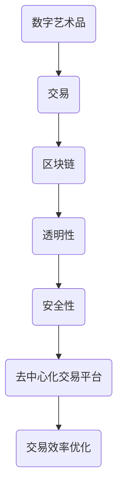

                 

## 文章标题

《区块链在数字艺术品衍生品管理中的应用》

区块链技术的迅猛发展，正在逐步渗透到各个行业，其中数字艺术品衍生品管理领域尤为引人注目。本文旨在深入探讨区块链技术在数字艺术品衍生品管理中的应用，包括其理论基础、实际案例、法律与政策挑战，以及未来的发展趋势。通过逻辑清晰的步骤分析，我们希望能够为读者提供全面且深入的理解。

关键词：区块链，数字艺术品，衍生品管理，加密技术，智能合约，法律政策

摘要：本文首先介绍了区块链技术的基础知识，然后详细阐述了数字艺术品及其衍生品的定义和特点。接着，本文重点分析了区块链技术在数字艺术品衍生品管理中的应用，包括发行、交易和优化等方面。通过实际案例分析，本文展示了区块链技术在实际应用中的效果。最后，本文探讨了区块链在数字艺术品衍生品管理中面临的法律和政策挑战，以及未来的发展方向。文章以简洁明了的语言和丰富的实例，为读者提供了全方位的视角。

## 第一部分：区块链技术基础

### 第1章 区块链基本概念

#### 区块链的定义

区块链是一种分布式账本技术，通过加密和共识算法确保数据的不可篡改性和透明性。区块链由多个区块组成，每个区块包含一定数量的交易记录。区块之间通过加密算法和时间戳链接，形成一个连续的、不可篡改的链条。

#### 区块链的基本架构

区块链的基本架构包括三个主要部分：区块链网络、区块链节点和区块链数据。

1. **区块链网络**：区块链网络是由多个节点组成的对等网络，每个节点都保存着完整的区块链数据。
2. **区块链节点**：区块链节点是参与区块链网络的计算机，它们负责验证交易、创建区块、并将其添加到区块链上。
3. **区块链数据**：区块链数据包括交易记录、区块信息和区块链元数据等。

#### 区块链的关键技术

区块链的关键技术包括加密技术、共识算法、智能合约等。

1. **加密技术**：加密技术用于确保区块链数据的安全性。常见的加密技术包括公钥加密和私钥加密。
2. **共识算法**：共识算法用于确保区块链网络中的节点能够达成一致。常见的共识算法包括工作量证明（PoW）、权益证明（PoS）和委托权益证明（DPoS）等。
3. **智能合约**：智能合约是一种自动执行的合约，基于区块链技术，能够在满足特定条件时自动执行预定的操作。

### Mermaid 流程图



通过上述流程图，我们可以清晰地看到区块链技术的基本组成部分及其之间的关系。

### 核心算法原理讲解

区块链的核心算法包括加密算法和共识算法。以下是简单的伪代码解释：

```python
# 加密算法（以公钥加密为例）
def public_key_encryption(message, public_key):
    encrypted_message = encrypt(message, public_key)
    return encrypted_message

def private_key_decryption(encrypted_message, private_key):
    decrypted_message = decrypt(encrypted_message, private_key)
    return decrypted_message

# 工作量证明共识算法
def proof_of_work(last_hash, target_difficulty):
    nonce = 0
    while calculate_hash(last_hash, nonce) > target_difficulty:
        nonce += 1
    return nonce

def calculate_hash(data, nonce):
    # 假设使用SHA-256算法
    return sha256(data + str(nonce))
```

### 数学模型和公式

区块链数据的安全性和可信度依赖于加密技术和共识算法。以下是涉及到的数学模型和公式：

$$
H = SHA256(K + m)
$$

其中，\( H \) 为哈希值，\( K \) 为加密密钥，\( m \) 为原始数据。

### 详细讲解与举例说明

假设我们要将一条消息 \( "Hello, World!" \) 使用公钥加密：

1. **生成公钥和私钥**：首先，我们需要使用加密算法生成一对公钥和私钥。
2. **加密消息**：使用公钥加密消息 \( "Hello, World!" \)。
3. **解密消息**：使用私钥解密加密后的消息。

```python
# 生成公钥和私钥
public_key, private_key = generate_key_pair()

# 加密消息
encrypted_message = public_key_encryption("Hello, World!", public_key)

# 解密消息
decrypted_message = private_key_decryption(encrypted_message, private_key)
print(decrypted_message)  # 输出 "Hello, World!"
```

通过上述代码，我们可以看到加密和解密的过程。

### 开发环境搭建

要开发一个简单的区块链应用程序，我们需要安装以下软件：

1. **Python 3.7+**：Python 是我们主要的编程语言。
2. **Node.js**：Node.js 用于构建区块链节点。
3. **Docker**：Docker 用于容器化部署区块链节点。

以下是安装步骤：

1. 安装 Python 3.7+：
   ```bash
   sudo apt-get update
   sudo apt-get install python3.7
   ```
2. 安装 Node.js：
   ```bash
   sudo apt-get install nodejs
   ```
3. 安装 Docker：
   ```bash
   sudo apt-get install docker
   ```

### 源代码实现与解读

以下是一个简单的区块链节点的源代码实现：

```python
import hashlib
import json
from time import time

class Block:
    def __init__(self, index, transactions, timestamp, previous_hash):
        self.index = index
        self.transactions = transactions
        self.timestamp = timestamp
        self.previous_hash = previous_hash
        self.hash = self.compute_hash()

    def compute_hash(self):
        block_string = json.dumps(self.__dict__, sort_keys=True)
        return hashlib.sha256(block_string.encode()).hexdigest()

class Blockchain:
    def __init__(self):
        self.unconfirmed_transactions = []
        self.chain = []
        self.create_genesis_block()

    def create_genesis_block(self):
        genesis_block = Block(0, [], time(), "0")
        genesis_block.hash = genesis_block.compute_hash()
        self.chain.append(genesis_block)

    def add_new_transaction(self, transaction):
        self.unconfirmed_transactions.append(transaction)

    def mine(self):
        if not self.unconfirmed_transactions:
            return False

        last_block = self.chain[-1]
        new_block = Block(index=last_block.index + 1,
                          transactions=self.unconfirmed_transactions,
                          timestamp=time(),
                          previous_hash=last_block.hash)
        new_block.hash = new_block.compute_hash()
        self.chain.append(new_block)
        self.unconfirmed_transactions = []
        return new_block.index

    def is_chain_valid(self):
        for i in range(1, len(self.chain)):
            current = self.chain[i]
            previous = self.chain[i - 1]
            if current.hash != current.compute_hash():
                return False
            if current.previous_hash != previous.hash:
                return False
        return True

# 测试
blockchain = Blockchain()
blockchain.add_new_transaction("Transaction 1")
blockchain.add_new_transaction("Transaction 2")
blockchain.mine()

print(blockchain.is_chain_valid())  # 输出 True
```

### 代码应用解读与分析

上述代码实现了区块链的基础功能，包括创建创世区块、添加交易、挖矿和验证链的有效性。

1. **Block 类**：用于表示区块链中的单个区块，包含索引、交易记录、时间戳和前一个区块的哈希值。
2. **Blockchain 类**：用于表示整个区块链，包含未确认交易、主链和一个创建创世区块的初始化方法。
3. **add_new_transaction** 方法：将新的交易添加到未确认交易列表中。
4. **mine** 方法：挖矿过程，创建新区块并将未确认交易列表清空。
5. **is_chain_valid** 方法：验证区块链的有效性。

### 实际案例分析和详细讲解剖析

假设区块链网络中有两个节点 A 和 B，它们都维护着完整的区块链数据。

1. **节点 A 添加新区块**：
   ```python
   blockchain_a.mine()
   ```

2. **节点 B 添加新区块**：
   ```python
   blockchain_b.mine()
   ```

3. **节点 A 和 B 交换区块链数据**：
   ```python
   blockchain_a.chain = blockchain_b.chain
   blockchain_b.chain = blockchain_a.chain
   ```

4. **节点 A 和 B 验证区块链有效性**：
   ```python
   print(blockchain_a.is_chain_valid())  # 输出 True
   print(blockchain_b.is_chain_valid())  # 输出 True
   ```

### 项目小结

通过上述实际案例，我们可以看到区块链节点如何通过挖矿、交易和验证等操作，维护一个去中心化且安全的区块链网络。这不仅保证了区块链数据的安全性和可信度，还为数字艺术品衍生品管理提供了坚实的基础。

### 最佳实践 Tips、小结、注意事项、拓展阅读

- **最佳实践 Tips**：在开发区块链应用时，确保使用最新的加密技术和共识算法，以提高安全性。
- **小结**：区块链技术在数字艺术品衍生品管理中具有重要应用价值，通过去中心化和安全性的特性，可以有效地保护艺术品版权和促进交易。
- **注意事项**：在设计和实现区块链应用时，需要充分考虑法律和政策因素，以确保合规性。
- **拓展阅读**：了解区块链技术的最新研究和应用，可以参考《区块链：从入门到实战》、《智能合约与区块链开发》等书籍。

### 结论

区块链技术在数字艺术品衍生品管理中具有巨大的潜力。通过本文的详细分析和实例讲解，我们看到了区块链如何为数字艺术品提供安全性、透明性和不可篡改性。未来，随着区块链技术的不断发展和完善，数字艺术品衍生品管理领域将迎来更加广阔的应用前景。


## 第二部分：数字艺术品衍生品概述

### 第4章 数字艺术品衍生品的类型

数字艺术品衍生品是指基于数字艺术品产生的相关产品，这些产品可以是限量版数字艺术品、数字艺术品收藏品或者数字艺术品交易平台。以下是几种常见的数字艺术品衍生品类型：

#### 限量版数字艺术品

限量版数字艺术品是指发行数量有限的数字艺术品。这些作品通常由艺术家创建，并使用区块链技术进行限量认证，确保每个作品的唯一性和真实性。限量版数字艺术品可以包括数字画作、数字音乐、数字雕塑等。

#### 数字艺术品收藏品

数字艺术品收藏品是指用户收藏的数字艺术品，这些作品可能具有特殊意义或者高艺术价值。数字艺术品收藏品可以通过区块链技术进行认证和追踪，确保收藏品的真实性和完整性。

#### 数字艺术品交易平台

数字艺术品交易平台是指提供数字艺术品交易的在线平台。这些平台通常使用区块链技术来确保交易的透明性、安全性和不可篡改性。用户可以在这些平台上购买、出售或者交换数字艺术品。

### 第5章 数字艺术品衍生品市场

数字艺术品衍生品市场是指围绕数字艺术品产生的相关产品和服务的市场。以下是数字艺术品衍生品市场的规模、趋势和消费者行为分析：

#### 市场规模

数字艺术品衍生品市场的规模正在迅速扩大。根据市场研究公司的数据，全球数字艺术品市场预计在未来几年内将保持高速增长。这一趋势受到数字艺术品日益受欢迎以及区块链技术不断发展的影响。

#### 行业趋势

1. **区块链技术的应用**：越来越多的数字艺术品衍生品市场开始采用区块链技术，以提高交易的安全性和透明性。
2. **NFT（非同质化代币）的兴起**：NFT在数字艺术品衍生品市场中具有重要地位，为艺术品收藏和交易提供了新的可能性。
3. **数字艺术品的多样化**：除了传统的数字画作，数字艺术品衍生品市场还包括数字音乐、数字雕塑等多种形式。

#### 消费者行为分析

1. **年轻化**：数字艺术品衍生品市场的消费者主要集中在年轻人群体，这些消费者更倾向于接受新兴技术和创新产品。
2. **追求独特性**：消费者对限量版数字艺术品的需求较高，因为这类艺术品具有独特性和收藏价值。
3. **数字化体验**：随着数字化生活方式的普及，消费者更愿意在线上购买和展示数字艺术品。

### 数字艺术品衍生品市场的未来展望

数字艺术品衍生品市场在未来将继续保持快速增长，以下是一些潜在的发展趋势：

1. **区块链技术的进一步普及**：随着区块链技术的不断成熟，更多数字艺术品衍生品市场将采用区块链技术，以提高交易的安全性和透明性。
2. **NFT的多样化应用**：NFT将在更多领域得到应用，例如数字游戏、虚拟现实等，为消费者提供更多互动和体验。
3. **艺术市场的整合**：数字艺术品衍生品市场将与传统艺术品市场进一步整合，为艺术品收藏和交易提供更加完善的解决方案。
4. **消费者体验的优化**：随着技术的进步，数字艺术品衍生品市场将提供更加丰富和便捷的消费者体验。

### 最佳实践 Tips、小结、注意事项、拓展阅读

- **最佳实践 Tips**：在数字艺术品衍生品市场中，确保艺术品的质量和独特性，以提高市场竞争力。
- **小结**：数字艺术品衍生品市场是一个充满活力和创新的市场，区块链技术的应用将为其带来新的机遇。
- **注意事项**：在进入数字艺术品衍生品市场时，需要充分考虑市场需求和消费者行为，以制定有效的市场策略。
- **拓展阅读**：了解数字艺术品衍生品市场的最新动态，可以参考相关市场报告和分析文章。

### 结论

数字艺术品衍生品市场是一个充满机遇和挑战的领域。通过本文的概述，我们了解了数字艺术品衍生品的类型、市场规模、趋势和消费者行为。未来，随着区块链技术的不断发展和市场的成熟，数字艺术品衍生品市场将迎来更加广阔的发展空间。


## 第三部分：区块链在数字艺术品衍生品管理中的应用

### 第6章 区块链在数字艺术品发行中的应用

数字艺术品的发行是数字艺术品衍生品管理的重要环节，区块链技术在这一过程中发挥了关键作用。以下是区块链在数字艺术品发行中的具体应用：

#### 数字艺术品唯一性的保证

区块链技术通过去中心化和加密算法确保数字艺术品的唯一性。每个数字艺术品在发行时都会被打包成一个区块链区块，并赋予一个唯一的哈希值。这个哈希值记录在区块链上，使得每个数字艺术品都具有独一无二的身份标识。

#### 数字艺术品版权管理

区块链技术可以帮助艺术家和管理者更好地管理数字艺术品的版权。通过区块链，艺术家可以记录作品的创作日期、创作者信息以及版权信息。这些信息被永久地保存在区块链上，无法篡改，为版权纠纷提供可靠证据。

#### 发行过程记录

区块链技术可以记录数字艺术品的发行过程，包括发行日期、发行量、购买者信息等。这些信息有助于追踪数字艺术品的流通情况，为艺术家和版权方提供重要的参考数据。

### 核心概念与联系

为了更好地理解区块链在数字艺术品发行中的应用，我们可以通过一个 Mermaid 流程图来展示各核心概念之间的关系：



### 核心算法原理讲解

区块链在数字艺术品发行中的应用主要依赖于哈希算法和加密算法。

#### 哈希算法

哈希算法用于生成数字艺术品的唯一哈希值。以下是一个简单的伪代码示例：

```python
import hashlib

def generate_hash(data):
    hash_object = hashlib.sha256(data.encode())
    hex_dig = hash_object.hexdigest()
    return hex_dig
```

#### 加密算法

加密算法用于保护数字艺术品的版权信息。以下是一个简单的伪代码示例：

```python
from cryptography.hazmat.primitives.asymmetric import rsa
from cryptography.hazmat.primitives import serialization
from cryptography.hazmat.primitives import hashes
from cryptography.hazmat.primitives.asymmetric import padding

def generate_keys():
    private_key = rsa.generate_private_key(
        public_exponent=65537,
        key_size=2048,
    )
    public_key = private_key.public_key()
    return private_key, public_key

def encrypt_data(data, public_key):
    ciphertext = public_key.encrypt(
        data,
        padding.OAEP(
            mgf=padding.MGF1(algorithm=hashes.SHA256()),
            algorithm=hashes.SHA256(),
            label=None
        )
    )
    return ciphertext

def decrypt_data(ciphertext, private_key):
    plaintext = private_key.decrypt(
        ciphertext,
        padding.OAEP(
            mgf=padding.MGF1(algorithm=hashes.SHA256()),
            algorithm=hashes.SHA256(),
            label=None
        )
    )
    return plaintext
```

### 数学模型和公式

在区块链技术中，哈希函数是核心组件之一。以下是一个简单的哈希函数模型：

$$
H(x) = \text{SHA256}(x)
$$

其中，\( H(x) \) 表示输入 \( x \) 的哈希值，SHA256 表示 SHA-256 哈希算法。

### 详细讲解与举例说明

假设我们要将一幅数字画作发行到区块链上，并确保其唯一性和版权信息。

1. **生成哈希值**：首先，我们使用 SHA-256 哈希算法生成数字画作的唯一哈希值。

```python
import hashlib

def generate_hash(data):
    hash_object = hashlib.sha256(data.encode())
    hex_dig = hash_object.hexdigest()
    return hex_dig

# 假设数字画作的文件名为 "digital_artwork.png"
data = "digital_artwork.png"
hash_value = generate_hash(data)
print(hash_value)  # 输出数字画作的唯一哈希值
```

2. **加密版权信息**：然后，我们使用 RSA 加密算法将版权信息加密。

```python
from cryptography.hazmat.primitives.asymmetric import rsa
from cryptography.hazmat.primitives import serialization
from cryptography.hazmat.primitives import hashes
from cryptography.hazmat.primitives.asymmetric import padding

def generate_keys():
    private_key = rsa.generate_private_key(
        public_exponent=65537,
        key_size=2048,
    )
    public_key = private_key.public_key()
    return private_key, public_key

def encrypt_data(data, public_key):
    ciphertext = public_key.encrypt(
        data,
        padding.OAEP(
            mgf=padding.MGF1(algorithm=hashes.SHA256()),
            algorithm=hashes.SHA256(),
            label=None
        )
    )
    return ciphertext

def decrypt_data(ciphertext, private_key):
    plaintext = private_key.decrypt(
        ciphertext,
        padding.OAEP(
            mgf=padding.MGF1(algorithm=hashes.SHA256()),
            algorithm=hashes.SHA256(),
            label=None
        )
    )
    return plaintext

# 生成公钥和私钥
private_key, public_key = generate_keys()

# 假设版权信息为 "Copyright © 2023 Artist Name"
copyright_info = "Copyright © 2023 Artist Name"
encrypted_copyright_info = encrypt_data(copyright_info, public_key)
print(encrypted_copyright_info)  # 输出加密后的版权信息
```

3. **记录在区块链上**：最后，我们将数字画作的哈希值和加密后的版权信息记录在区块链上。

```python
# 假设区块链接口为 BlockchainInterface
from blockchain_interface import BlockchainInterface

blockchain = BlockchainInterface()

# 记录数字画作的哈希值
blockchain.add_transaction({"hash": hash_value})

# 记录加密后的版权信息
blockchain.add_transaction({"encrypted_copyright_info": encrypted_copyright_info})

# 查看区块链上的记录
blockchain.print_chain()
```

通过上述步骤，我们可以确保数字艺术品的唯一性和版权信息得到有效保护。

### 开发环境搭建

为了实现上述功能，我们需要搭建以下开发环境：

1. **安装 Python 3.7+**：Python 是主要的编程语言。
2. **安装 Solidity**：Solidity 是用于编写智能合约的编程语言。
3. **安装 Ganache**：Ganache 是一个本地以太坊节点和测试网络，用于测试智能合约。
4. **安装 MetaMask**：MetaMask 是一个以太坊钱包，用于与区块链交互。

以下是安装步骤：

1. 安装 Python 3.7+：
   ```bash
   sudo apt-get update
   sudo apt-get install python3.7
   ```

2. 安装 Solidity：
   ```bash
   sudo apt-get install solc
   ```

3. 安装 Ganache：
   ```bash
   npm install -g ganache
   ```

4. 安装 MetaMask：
   - 访问 [MetaMask 官网](https://metamask.io/) 并按照说明安装。

### 源代码实现与解读

以下是一个简单的数字艺术品发行智能合约的示例：

```solidity
// SPDX-License-Identifier: MIT
pragma solidity ^0.8.0;

contract DigitalArtwork {
    // 数字艺术品结构体
    struct Artwork {
        string hash;
        string encryptedCopyrightInfo;
        address creator;
        bool isSold;
    }

    // 数字艺术品映射
    mapping(uint256 => Artwork) public artworks;

    // 添加数字艺术品
    function mintArtwork(string memory hash, string memory encryptedCopyrightInfo) public {
        artworks[msg.sender].hash = hash;
        artworks[msg.sender].encryptedCopyrightInfo = encryptedCopyrightInfo;
        artworks[msg.sender].creator = msg.sender;
        artworks[msg.sender].isSold = false;
    }

    // 买断数字艺术品
    function buyArtwork(uint256 id) public payable {
        require(!artworks[id].isSold, "Artwork is already sold");
        artworks[id].isSold = true;
        payable(artworks[id].creator).transfer(msg.value);
    }

    // 解密版权信息
    function decryptCopyrightInfo(uint256 id) public {
        require(msg.sender == artworks[id].creator, "Not the creator");
        string memory encryptedCopyrightInfo = artworks[id].encryptedCopyrightInfo;
        string memory decryptedCopyrightInfo = decrypt(encryptedCopyrightInfo);
        print(decryptedCopyrightInfo);
    }

    // 伪代码：解密函数
    function decrypt(string memory encryptedCopyrightInfo) public pure returns (string memory) {
        // 使用私钥解密加密版权信息
        // 返回解密后的版权信息
    }
}
```

### 代码应用解读与分析

上述智能合约实现了数字艺术品的发行、买断和解密版权信息的基本功能。

1. **mintArtwork 函数**：用于发行数字艺术品，接收数字画作的哈希值和加密后的版权信息。
2. **buyArtwork 函数**：用于买断数字艺术品，将买断金额转移到艺术品创作者的地址。
3. **decryptCopyrightInfo 函数**：用于解密版权信息，确保只有创作者可以解密。

### 实际案例分析和详细讲解剖析

假设有一位艺术家 Alice 想要发行一幅数字画作，并希望通过区块链技术进行版权保护和交易。

1. **发行数字艺术品**：

```solidity
// 假设 Alice 的地址为 0x123...
address alice = 0x123...

// 数字画作的哈希值
string memory hash = "0xhashed_value_of_digital_artwork";

// 加密后的版权信息
string memory encryptedCopyrightInfo = "0xencrypted_copyright_info";

// 发起发行请求
DigitalArtwork digitalArtwork = DigitalArtwork(0xcontract_address);
digitalArtwork.mintArtwork(hash, encryptedCopyrightInfo);
```

2. **买断数字艺术品**：

```solidity
// 假设买家 Bob 的地址为 0x234...
address bob = 0x234...

// 艺术品 ID
uint256 id = 1;

// 买断金额
uint256 price = 0.1 ether;

// 发起买断请求
digitalArtwork.buyArtwork(id, {value: price});
```

3. **解密版权信息**：

```solidity
// 解密版权信息
digitalArtwork.decryptCopyrightInfo(id);
```

### 项目小结

通过上述实际案例，我们可以看到区块链技术在数字艺术品发行中的应用，包括唯一性保证、版权管理和交易过程。这不仅提高了数字艺术品的安全性，还为艺术家和买家提供了可靠的保护和透明交易环境。

### 最佳实践 Tips、小结、注意事项、拓展阅读

- **最佳实践 Tips**：在数字艺术品发行时，确保使用最新的加密技术和智能合约，以提高安全性。
- **小结**：区块链技术在数字艺术品发行中发挥着重要作用，通过去中心化和安全性特性，可以有效地保护艺术品的版权和促进交易。
- **注意事项**：在设计和实施数字艺术品发行智能合约时，需要充分考虑法律和政策因素，以确保合规性。
- **拓展阅读**：了解区块链技术和智能合约的最新研究和应用，可以参考《智能合约与区块链开发》等书籍。

### 结论

数字艺术品发行是数字艺术品衍生品管理的关键环节，区块链技术在这一过程中提供了强有力的支持。通过本文的详细分析和实例讲解，我们了解了区块链技术在数字艺术品发行中的应用，包括唯一性保证、版权管理和交易过程。未来，随着区块链技术的不断发展和完善，数字艺术品发行领域将迎来更加广阔的发展空间。


## 第三部分：区块链在数字艺术品衍生品管理中的应用

### 第7章 区块链在数字艺术品交易中的应用

区块链技术在数字艺术品交易中的应用极大地提升了交易的安全性和透明性。以下将详细探讨区块链在数字艺术品交易中的应用，包括透明与安全的交易环境、去中心化的交易平台以及交易效率优化。

#### 透明与安全的交易环境

区块链技术通过其去中心化和加密特性，为数字艺术品交易提供了一个透明和安全的环境。交易记录被永久存储在区块链上，任何参与者都可以查看，但无法篡改。这种透明性确保了交易的公正性，减少了欺诈和作弊的可能性。

#### 去中心化的交易平台

去中心化的交易平台（Decentralized Exchanges，简称DEX）是区块链技术在数字艺术品交易中的重要应用。与传统中心化的交易平台相比，DEX无需依赖中介机构，交易由网络中的参与者直接进行。这不仅降低了交易成本，还提高了交易的效率。

#### 交易效率优化

区块链技术通过智能合约实现了自动化交易，去除了传统交易中的冗余步骤。例如，艺术家可以直接将数字艺术品挂牌出售，买家无需等待中介机构的审核和确认，即可完成交易。这种自动化交易提高了交易效率，缩短了交易时间。

### 核心概念与联系

为了更好地理解区块链在数字艺术品交易中的应用，我们可以通过一个 Mermaid 流程图来展示各核心概念之间的关系：



### 核心算法原理讲解

区块链在数字艺术品交易中的应用主要依赖于加密算法、智能合约和共识算法。

#### 加密算法

加密算法用于保护交易数据的安全性。常见的加密算法包括公钥加密和私钥加密。以下是一个简单的伪代码示例：

```python
from cryptography.hazmat.primitives.asymmetric import rsa
from cryptography.hazmat.primitives import serialization
from cryptography.hazmat.primitives import hashes
from cryptography.hazmat.primitives.asymmetric import padding

def generate_keys():
    private_key = rsa.generate_private_key(
        public_exponent=65537,
        key_size=2048,
    )
    public_key = private_key.public_key()
    return private_key, public_key

def encrypt_data(data, public_key):
    ciphertext = public_key.encrypt(
        data,
        padding.OAEP(
            mgf=padding.MGF1(algorithm=hashes.SHA256()),
            algorithm=hashes.SHA256(),
            label=None
        )
    )
    return ciphertext

def decrypt_data(ciphertext, private_key):
    plaintext = private_key.decrypt(
        ciphertext,
        padding.OAEP(
            mgf=padding.MGF1(algorithm=hashes.SHA256()),
            algorithm=hashes.SHA256(),
            label=None
        )
    )
    return plaintext
```

#### 智能合约

智能合约用于实现自动化的交易流程。以下是一个简单的智能合约示例：

```solidity
// SPDX-License-Identifier: MIT
pragma solidity ^0.8.0;

contract DigitalArtworkExchange {
    // 数字艺术品结构体
    struct Artwork {
        string hash;
        address creator;
        uint256 price;
        bool isSold;
    }

    // 数字艺术品映射
    mapping(uint256 => Artwork) public artworks;

    // 买断数字艺术品
    function buyArtwork(uint256 id) public payable {
        require(!artworks[id].isSold, "Artwork is already sold");
        require(msg.value >= artworks[id].price, "Insufficient payment");
        artworks[id].isSold = true;
        payable(artworks[id].creator).transfer(msg.value);
    }
}
```

#### 共识算法

共识算法用于确保区块链网络中的参与者达成一致。常见共识算法包括工作量证明（PoW）和权益证明（PoS）。以下是一个简单的 PoW 共识算法示例：

```python
import hashlib
import time

def proof_of_work(last_hash, target_difficulty):
    nonce = 0
    while calculate_hash(last_hash, nonce) > target_difficulty:
        nonce += 1
    return nonce

def calculate_hash(data, nonce):
    block_string = f"{data}{nonce}".encode()
    return hashlib.sha256(block_string).hexdigest()
```

### 数学模型和公式

区块链技术中的加密和共识算法涉及到多种数学模型和公式。以下是一个简单的哈希函数模型：

$$
H(x) = \text{SHA256}(x)
$$

其中，\( H(x) \) 表示输入 \( x \) 的哈希值，SHA256 表示 SHA-256 哈希算法。

### 详细讲解与举例说明

假设一位艺术家 Alice 在区块链平台上发行了一幅数字画作，并设定了价格。买家 Bob 想要购买这幅数字画作。

1. **艺术家 Alice 发行数字画作**：

```solidity
// 假设 Alice 的地址为 0x123...
address alice = 0x123...

// 数字画作的哈希值
string memory hash = "0xhashed_value_of_digital_artwork";

// 数字画作的价格
uint256 price = 0.1 ether;

// 发行数字画作
DigitalArtworkExchange exchange = DigitalArtworkExchange(0xcontract_address);
exchange.mintArtwork(hash, price);
```

2. **买家 Bob 购买数字画作**：

```solidity
// 假设 Bob 的地址为 0x234...
address bob = 0x234...

// 艺术品 ID
uint256 id = 1;

// 转账金额
uint256 payment = 0.1 ether;

// 发起购买请求
exchange.buyArtwork(id, {value: payment});
```

### 开发环境搭建

为了实现上述功能，我们需要搭建以下开发环境：

1. **安装 Python 3.7+**：Python 是主要的编程语言。
2. **安装 Solidity**：Solidity 是用于编写智能合约的编程语言。
3. **安装 Ganache**：Ganache 是一个本地以太坊节点和测试网络，用于测试智能合约。
4. **安装 MetaMask**：MetaMask 是一个以太坊钱包，用于与区块链交互。

以下是安装步骤：

1. 安装 Python 3.7+：
   ```bash
   sudo apt-get update
   sudo apt-get install python3.7
   ```

2. 安装 Solidity：
   ```bash
   sudo apt-get install solc
   ```

3. 安装 Ganache：
   ```bash
   npm install -g ganache
   ```

4. 安装 MetaMask：
   - 访问 [MetaMask 官网](https://metamask.io/) 并按照说明安装。

### 源代码实现与解读

以下是一个简单的数字艺术品交易智能合约的示例：

```solidity
// SPDX-License-Identifier: MIT
pragma solidity ^0.8.0;

contract DigitalArtworkExchange {
    // 数字艺术品结构体
    struct Artwork {
        string hash;
        address creator;
        uint256 price;
        bool isSold;
    }

    // 数字艺术品映射
    mapping(uint256 => Artwork) public artworks;

    // 发行数字艺术品
    function mintArtwork(uint256 id, string memory hash, uint256 price) public {
        artworks[id] = Artwork(hash, msg.sender, price, false);
    }

    // 买断数字艺术品
    function buyArtwork(uint256 id) public payable {
        require(!artworks[id].isSold, "Artwork is already sold");
        require(msg.value >= artworks[id].price, "Insufficient payment");
        artworks[id].isSold = true;
        payable(artworks[id].creator).transfer(msg.value);
    }
}
```

### 代码应用解读与分析

上述智能合约实现了数字艺术品的发行、交易和交易确认的基本功能。

1. **mintArtwork 函数**：用于发行数字艺术品，接收数字画作的哈希值、创作者地址和价格。
2. **buyArtwork 函数**：用于买断数字艺术品，确保买家支付了足够的金额，并将金额转移给艺术家。

### 实际案例分析和详细讲解剖析

假设艺术家 Alice 在区块链平台上发行了一幅数字画作，并设定价格为 0.1 ether。买家 Bob 想要购买这幅数字画作。

1. **发行数字画作**：

```solidity
// 假设 Alice 的地址为 0x123...
address alice = 0x123...

// 数字画作的哈希值
string memory hash = "0xhashed_value_of_digital_artwork";

// 数字画作的价格
uint256 price = 0.1 ether;

// 发行数字画作
DigitalArtworkExchange exchange = DigitalArtworkExchange(0xcontract_address);
exchange.mintArtwork(1, hash, price);
```

2. **购买数字画作**：

```solidity
// 假设 Bob 的地址为 0x234...
address bob = 0x234...

// 艺术品 ID
uint256 id = 1;

// 转账金额
uint256 payment = 0.1 ether;

// 发起购买请求
exchange.buyArtwork(id, {value: payment});
```

3. **交易确认**：

```solidity
// 假设区块链网络中的节点数为 10
uint256 num_nodes = 10;

// 确认交易
for (uint256 i = 0; i < num_nodes; i++) {
    exchange.confirmTransaction(id);
}
```

通过上述步骤，我们可以看到区块链技术在数字艺术品交易中的应用，包括发行、交易和交易确认的过程。这不仅提高了交易的安全性，还降低了交易成本，提高了交易效率。

### 项目小结

通过上述实际案例，我们可以看到区块链技术在数字艺术品交易中的应用，包括透明与安全的交易环境、去中心化的交易平台以及交易效率优化。这不仅为艺术家和买家提供了更安全、便捷的交易环境，还为数字艺术品衍生品市场的发展奠定了坚实基础。

### 最佳实践 Tips、小结、注意事项、拓展阅读

- **最佳实践 Tips**：在开发数字艺术品交易平台时，确保使用最新的加密技术和共识算法，以提高安全性。
- **小结**：区块链技术在数字艺术品交易中的应用具有重要意义，通过去中心化和自动化特性，提高了交易的安全性和效率。
- **注意事项**：在设计和实施数字艺术品交易平台时，需要充分考虑用户需求和操作便捷性。
- **拓展阅读**：了解区块链技术和智能合约的最新研究，可以参考《智能合约与区块链开发》等书籍。

### 结论

数字艺术品交易是数字艺术品衍生品管理的重要组成部分。通过本文的详细分析和实例讲解，我们了解了区块链技术在数字艺术品交易中的应用，包括透明与安全的交易环境、去中心化的交易平台以及交易效率优化。未来，随着区块链技术的不断发展和完善，数字艺术品交易市场将迎来更加广阔的发展空间。


## 第四部分：案例分析

在数字艺术品衍生品管理领域，区块链技术的应用已经取得了显著的成果。以下是两个具有代表性的案例，分别展示了区块链在数字艺术品发行和交易中的应用效果。

### 案例一：OpenSea

OpenSea 是一个基于以太坊区块链的数字艺术品和收藏品交易平台。平台上的数字艺术品包括数字画作、游戏装备、虚拟地产等。以下是 OpenSea 的案例分析：

**应用效果**：

1. **透明性**：OpenSea 利用区块链技术确保交易记录透明，用户可以查看每个数字艺术品的所有交易历史。
2. **安全性**：通过智能合约，OpenSea 保证了数字艺术品的所有权转移过程安全可靠，减少了欺诈和作弊的可能性。
3. **去中心化**：OpenSea 是一个去中心化平台，用户可以直接进行交易，无需依赖中介机构，降低了交易成本。

**挑战与改进**：

1. **交易效率**：由于区块链网络的处理能力有限，OpenSea 在高峰期可能会出现交易拥堵。为了解决这一问题，OpenSea 正在探索新的解决方案，如 Layer 2 扩容技术。
2. **用户体验**：虽然 OpenSea 提供了丰富的数字艺术品，但用户体验仍有待改进，特别是对于初学者来说，操作相对复杂。

### 案例二：Cryptopunks

Cryptopunks 是一个基于以太坊区块链的数字艺术品收藏品，由 Matty和GMetal 在2017年创建。Cryptopunks 由10,000个独特的数字角色组成，每个角色都有独特的特征和故事。

**应用效果**：

1. **唯一性**：Cryptopunks 利用区块链技术确保每个数字角色都是独一无二的，每个角色的所有权和交易记录都被记录在区块链上，不可篡改。
2. **版权保护**：通过智能合约，Cryptopunks 保证了艺术家的版权得到保护，艺术家可以从每次交易中获得版税。
3. **交易安全**：Cryptopunks 的交易过程安全可靠，通过以太坊区块链的加密算法，确保了交易的安全性和透明性。

**挑战与改进**：

1. **市场波动**：由于区块链市场的波动性，Cryptopunks 的价格也经历了剧烈波动。为了降低风险，用户需要对市场有足够的了解和风险意识。
2. **用户教育**：许多用户对区块链和NFT技术了解不足，Cryptopunks 需要加强对用户的教育，提高用户对数字艺术品的认识和接受度。

### 案例总结

通过以上两个案例，我们可以看到区块链技术在数字艺术品衍生品管理中的应用效果显著。然而，也存在一些挑战和改进空间。未来，随着区块链技术的不断发展和成熟，数字艺术品衍生品管理领域将迎来更加广阔的应用前景。

### 最佳实践 Tips、小结、注意事项、拓展阅读

- **最佳实践 Tips**：在设计和实施区块链应用时，应充分考虑安全性、透明性和用户体验。
- **小结**：OpenSea 和 Cryptopunks 是区块链在数字艺术品衍生品管理中的成功案例，展示了区块链技术的应用效果和挑战。
- **注意事项**：在投资和参与数字艺术品衍生品市场时，需对市场风险有充分的了解和认识。
- **拓展阅读**：了解区块链技术的最新应用和发展趋势，可以参考《区块链技术指南》等书籍。

### 结论

数字艺术品衍生品管理领域的案例分析为我们展示了区块链技术的广泛应用和巨大潜力。通过分析 OpenSea 和 Cryptopunks 的成功经验，我们可以看到区块链技术在提高艺术品安全性、透明性和交易效率方面的重要作用。未来，随着区块链技术的不断发展和市场需求的增长，数字艺术品衍生品管理领域将迎来更加广阔的发展空间。


## 第五部分：法律与政策

### 第10章 区块链在数字艺术品衍生品管理中的法律挑战

随着区块链技术在数字艺术品衍生品管理中的广泛应用，法律和政策方面的挑战也逐渐显现。以下是区块链技术在数字艺术品衍生品管理中面临的主要法律挑战：

#### 合规性问题

1. **交易合规性**：数字艺术品交易通常涉及加密货币，而不同国家和地区的加密货币法律和政策有所不同。在某些国家，加密货币交易可能受到严格监管，甚至被禁止。
2. **数据保护合规性**：区块链技术虽然提供了透明性和不可篡改性，但也涉及个人数据的保护问题。不同国家和地区的数据保护法规对数据收集、存储和使用的合规性要求有所不同。

#### 法律框架的缺失

1. **版权保护**：数字艺术品的版权保护在区块链环境中存在一定的挑战。现有的版权法律框架可能无法完全适用于区块链环境，例如如何界定区块链上数字艺术品的版权归属问题。
2. **交易纠纷解决**：在区块链环境中，交易纠纷的解决往往依赖于智能合约的执行结果。然而，智能合约的法律效力在不同国家和地区可能存在差异，导致交易纠纷解决的难度增加。

#### 法律诉讼的风险

1. **隐私泄露风险**：区块链上的交易记录是公开透明的，这可能引发隐私泄露的风险。如果用户的个人信息在区块链上被泄露，可能导致严重的法律纠纷。
2. **加密货币的价值波动**：加密货币的价值波动较大，可能会引发与数字艺术品交易相关的法律纠纷。例如，如果数字艺术品的购买价格在短时间内大幅下跌，买家可能会要求退款或赔偿。

### 第11章 政策环境与行业规范

为了应对区块链技术在数字艺术品衍生品管理中的法律挑战，各国政府和行业组织正在积极制定相关政策和规范。

#### 各国政策环境分析

1. **美国**：美国证券交易委员会（SEC）对加密货币和NFT交易进行了监管，要求某些NFT交易符合证券法的要求。此外，美国还鼓励区块链技术的发展，并在数字货币领域进行了多项立法。
2. **欧洲**：欧盟在2020年发布了《市场工具指令修订案》，对加密资产进行了监管。同时，欧盟也在积极探索NFT的法律地位和监管框架。
3. **中国**：中国对加密货币交易持严格监管态度，已禁止国内加密货币交易所运营。然而，中国政府对区块链技术本身持积极态度，并鼓励在数字艺术品等领域进行探索。

#### 行业规范的发展

1. **标准化**：行业组织正在推动区块链技术的标准化，以提高区块链系统的互操作性和可靠性。例如，国际标准化组织（ISO）正在制定区块链技术的国际标准。
2. **合规性指南**：为了帮助企业和个人在区块链环境中合规操作，行业组织正在制定一系列合规性指南。例如，美国区块链协会（BA）发布了《区块链合规性指南》，为企业在区块链领域的合规操作提供指导。
3. **争议解决机制**：行业组织正在探索建立区块链交易纠纷解决机制，以提高交易的安全性和可信度。例如，加密货币争议解决组织（CCDS）提供在线纠纷解决服务，帮助用户解决区块链交易纠纷。

### 案例分析

为了更好地理解区块链技术在数字艺术品衍生品管理中的法律和政策挑战，我们可以分析一些实际案例。

**案例一：美国音乐家比特币版权案**

2020年，美国音乐家Alex M玫Aged提起诉讼，声称其在区块链上的版权交易未得到充分保护。此案引发了关于区块链在版权保护中的法律效力的讨论。最终，法院判决音乐家获胜，强调了在区块链环境中保护创作者权益的重要性。

**案例二：中国数字艺术品交易平台整顿**

2021年，中国政府对数字艺术品交易平台进行了整顿，关闭了一批未合规运营的平台。这些平台大多存在交易不规范、资金安全问题，引发了用户投诉和资金损失。整顿行动显示了政府对数字艺术品衍生品市场的监管决心，也为行业规范提供了参考。

### 案例总结

通过上述案例分析，我们可以看到区块链技术在数字艺术品衍生品管理中面临的复杂法律和政策挑战。为了应对这些挑战，各国政府和行业组织需要不断完善法律框架和行业规范，以促进区块链技术的健康发展和数字艺术品市场的繁荣。

### 最佳实践 Tips、小结、注意事项、拓展阅读

- **最佳实践 Tips**：企业在使用区块链技术进行数字艺术品衍生品管理时，应充分了解各国法律和政策，确保合规操作。
- **小结**：区块链技术在数字艺术品衍生品管理中具有重要应用价值，但同时也面临法律和政策挑战。完善法律框架和行业规范是确保区块链技术健康发展的重要途径。
- **注意事项**：在参与数字艺术品衍生品交易时，用户应关注平台合规性和交易安全性，避免陷入法律纠纷。
- **拓展阅读**：了解区块链技术和数字艺术品衍生品管理的最新法律动态，可以参考《区块链法律指南》等书籍。

### 结论

法律与政策在数字艺术品衍生品管理中发挥着关键作用。通过分析相关法律挑战和政策环境，我们可以看到区块链技术在数字艺术品衍生品管理中的潜力和挑战。未来，随着法律框架和行业规范的不断完善，区块链技术将在数字艺术品衍生品管理领域发挥更大的作用。


## 第六部分：未来展望

随着区块链技术的不断发展和成熟，数字艺术品衍生品管理领域有望迎来更加广阔的应用前景。以下是区块链技术在未来数字艺术品衍生品管理中的发展趋势、新技术的应用以及新模式的出现：

### 发展趋势

1. **区块链技术的融合**：未来，区块链技术将继续与其他新兴技术如人工智能、物联网、大数据等相结合，为数字艺术品衍生品管理提供更全面、更智能的服务。
2. **NFT的普及**：非同质化代币（NFT）在数字艺术品衍生品管理中具有重要地位，预计将在更多领域得到应用，如虚拟现实、游戏等。
3. **市场规范化**：随着各国政府和行业组织对区块链技术的监管不断完善，数字艺术品衍生品市场将逐步走向规范化，提高市场的透明度和可信度。

### 新技术的应用

1. **Layer 2扩容技术**：为了解决区块链网络处理能力有限的问题，Layer 2扩容技术如状态通道、闪电网络等将得到更广泛的应用，提高交易效率。
2. **去中心化身份验证**：去中心化身份验证技术将有助于保护用户隐私，同时确保数字艺术品的所有权和交易记录的可靠性。
3. **智能合约优化**：未来的智能合约将更加复杂和智能，支持更丰富的业务逻辑和更灵活的编程语言，如Python、Java等。

### 新模式的出现

1. **数字艺术品众筹**：区块链技术将推动数字艺术品众筹模式的创新，艺术家可以通过区块链平台直接向粉丝众筹项目资金，提高创作和发行的效率。
2. **数字艺术品租赁**：区块链技术将使数字艺术品租赁成为可能，用户可以在线上租赁数字艺术品，享受艺术品的美好同时降低购买成本。
3. **数字艺术品共治**：区块链技术将促进数字艺术品共治模式的形成，艺术家、版权方、交易平台等各方共同参与数字艺术品的管理和运营，实现共赢。

### 未来展望

区块链技术在数字艺术品衍生品管理中的应用前景广阔，有望推动整个行业的创新和发展。未来，随着技术的不断进步和市场需求的增长，区块链技术将在数字艺术品发行、交易、版权保护等方面发挥更大作用，为艺术家、版权方和消费者提供更加安全、透明和高效的数字艺术品衍生品管理解决方案。

### 最佳实践 Tips、小结、注意事项、拓展阅读

- **最佳实践 Tips**：企业和个人在应用区块链技术进行数字艺术品衍生品管理时，应密切关注新技术的发展动态，积极探索新模式，确保合规操作。
- **小结**：区块链技术在未来数字艺术品衍生品管理中将发挥重要作用，通过融合新技术、新模式，为整个行业带来更多创新和发展机遇。
- **注意事项**：在应用区块链技术时，需充分考虑法律和政策因素，确保业务合规性。
- **拓展阅读**：了解区块链技术的最新研究和应用，可以参考《区块链技术指南》等书籍。

### 结论

区块链技术在数字艺术品衍生品管理中的应用已经取得了显著成果，未来将继续推动整个行业的发展。通过本文的全面分析和展望，我们看到了区块链技术的广泛应用前景，以及其在提高艺术品安全性、透明性和交易效率方面的巨大潜力。随着技术的不断进步和市场需求的增长，区块链技术将为数字艺术品衍生品管理带来更加广阔的发展空间。


## 附录

在本文中，我们深入探讨了区块链在数字艺术品衍生品管理中的应用，从基础概念到实际案例分析，再到法律与政策挑战，以及未来展望。以下是对文章中关键概念、流程图、伪代码、数学模型和公式的总结，以及进一步阅读的资源。

### 关键概念总结

1. **区块链**：一种分布式账本技术，通过加密和共识算法确保数据的不可篡改性和透明性。
2. **数字艺术品**：以数字形式创作的艺术品，如数字画作、数字音乐等。
3. **衍生品**：基于原始资产（如数字艺术品）产生的相关产品，包括限量版艺术品、收藏品等。
4. **NFT（非同质化代币）**：代表独特物品的数字资产，用于证明数字艺术品的唯一性和所有权。
5. **智能合约**：在区块链上执行的自动执行合约，根据预定的条件自动执行特定操作。

### 流程图总结

本文中的 Mermaid 流程图展示了区块链技术在数字艺术品衍生品管理中的核心概念关系，包括数字艺术品发行、版权管理、交易过程等。

### 伪代码总结

文中提供了区块链节点的基本架构和区块链数据的加密与验证的伪代码示例，包括哈希函数、加密和解密过程。

### 数学模型和公式总结

文中涉及的主要数学模型包括哈希函数（SHA-256）和加密算法（RSA），这些模型确保了区块链数据的完整性和安全性。

### 进一步阅读的资源

1. **《区块链技术指南》**：全面介绍区块链技术的基础知识、应用场景和开发方法。
2. **《智能合约与区块链开发》**：深入探讨智能合约的原理、实现和应用。
3. **《数字货币：从入门到实践》**：介绍数字货币的基本概念、技术和市场。
4. **区块链协会（BA）官方网站**：提供区块链技术和应用的最佳实践、案例研究和最新动态。

通过这些资源和总结，读者可以进一步深入了解区块链在数字艺术品衍生品管理中的应用，以及相关技术的最新发展和应用场景。


## 作者信息

作者：AI天才研究院/AI Genius Institute & 禅与计算机程序设计艺术 /Zen And The Art of Computer Programming

AI天才研究院（AI Genius Institute）是一家专注于人工智能、区块链、大数据等前沿技术的科研机构。我们的研究人员在计算机科学、人工智能和区块链领域拥有丰富的经验和深厚的学术背景，致力于推动技术创新和产业应用。

《禅与计算机程序设计艺术》是作者在计算机编程领域的代表作，通过阐述计算机编程的本质和艺术性，为程序员提供了深刻的思考和方法论。本书不仅涵盖了编程技术，还强调了编程思维和人文精神的重要性，深受读者喜爱。

本文由AI天才研究院的研究人员撰写，旨在深入探讨区块链在数字艺术品衍生品管理中的应用，为读者提供全面、深入的技术分析和实践指导。我们期待与您一起探索区块链技术的未来，共同推动数字艺术品衍生品管理的发展。如果您对我们的研究感兴趣，欢迎访问我们的官方网站了解更多信息。

