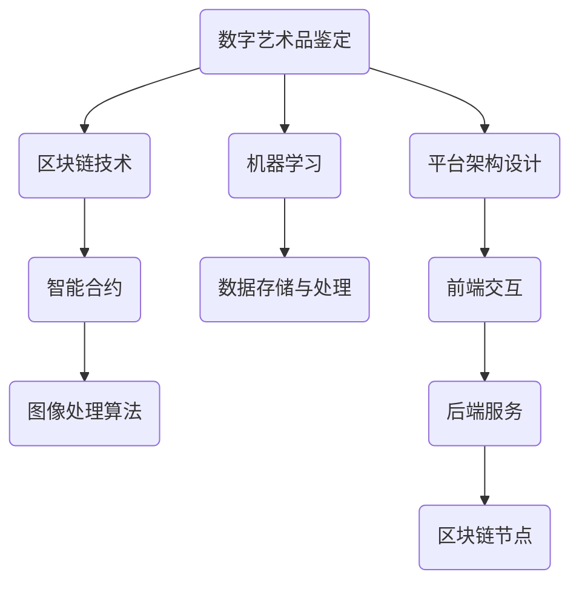
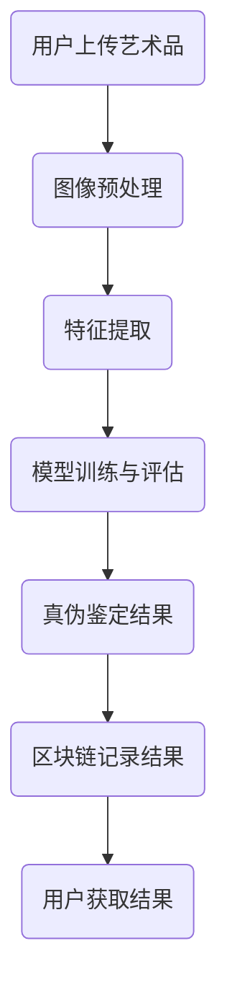
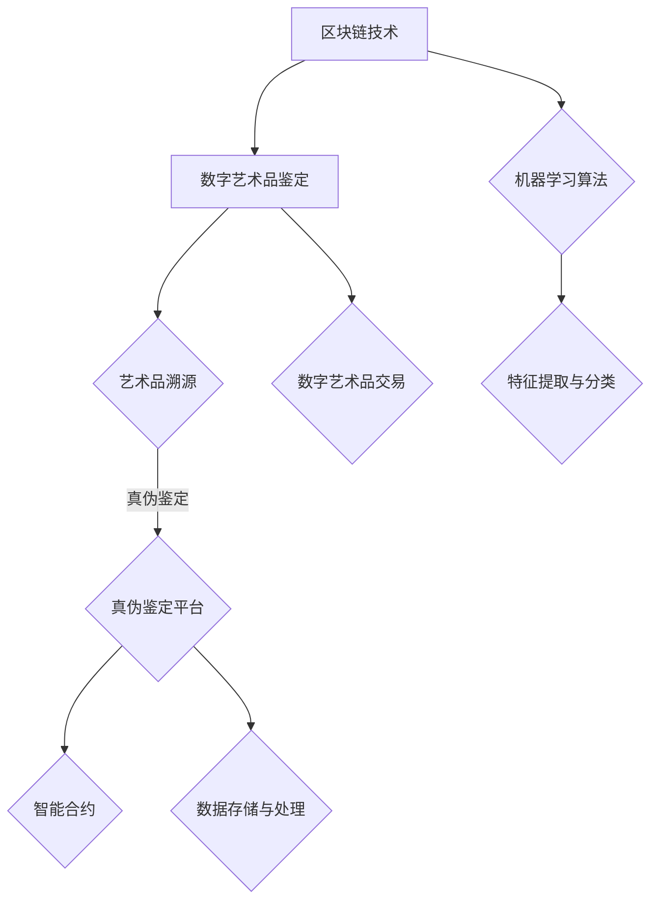

                 

### 文章标题

# 《区块链在数字艺术品鉴定中的应用：艺术品真伪智能鉴定平台》

### 关键词

- 区块链
- 数字艺术品鉴定
- 智能鉴定平台
- 溯源
- 智能合约
- 机器学习
- 图像处理

### 摘要

本文旨在探讨区块链技术在数字艺术品鉴定中的应用，特别是如何构建一个基于区块链的艺术品真伪智能鉴定平台。文章首先介绍了区块链的基本原理和关键技术，随后详细阐述了数字艺术品的特点及其鉴定需求。接着，我们分析了区块链在艺术品溯源、真伪鉴定和交易中的应用，并重点介绍了智能合约在这一过程中的作用。随后，文章转向平台设计的具体实现，包括架构设计、数据存储与处理、以及安全性与隐私保护。最后，文章通过一个实际项目实战，详细展示了平台开发的全过程，包括开发环境搭建、核心算法原理讲解、代码实现与分析，以及项目总结与展望。

### 第一部分：区块链与数字艺术品鉴定

#### 第1章：引言

**1.1 区块链技术概述**

区块链技术是一种分布式数据库系统，通过加密算法和共识机制确保数据的不可篡改性和透明性。自2008年比特币问世以来，区块链技术逐渐应用于金融、供应链管理、医疗等多个领域。其基本原理包括数据块、链式结构、加密算法、共识机制等。区块链的关键技术包括哈希算法、非对称加密、共识算法、智能合约等。

**1.2 数字艺术与区块链**

数字艺术是一种利用数字技术创作的艺术形式，具有高度的可复制性和易篡改性。区块链技术由于其独特的属性，为数字艺术品的保护和鉴定提供了新的途径。通过区块链，艺术家可以确保其数字作品的真实性和唯一性，买家可以验证作品的真实性，从而防止伪造和盗窃。

**1.3 艺术品鉴定的挑战与需求**

艺术品鉴定面临着一系列挑战，包括真伪鉴别、所有权验证、历史记录追踪等。传统的鉴定方法依赖于专家经验和物理检测手段，存在效率低下、可靠性差等问题。数字艺术品的鉴定需求更加迫切，因为其容易被篡改和复制。区块链技术的应用为解决这些问题提供了可能性。

#### 第2章：区块链基础

**2.1 区块链的基本原理**

区块链的基本原理包括数据块、链式结构、加密算法、共识机制等。数据块是区块链的基本组成单元，包含一定时间内的交易数据。链式结构确保了数据的安全性和不可篡改性。加密算法用于保护数据隐私和防止篡改。共识机制确保区块链网络中的节点达成一致。

**2.2 区块链的关键技术**

区块链的关键技术包括哈希算法、非对称加密、共识算法、智能合约等。哈希算法用于生成唯一标识，确保数据的完整性。非对称加密提供安全的通信和身份验证。共识算法确保网络节点的一致性。智能合约是自动化执行合约条款的计算机程序。

**2.3 区块链的架构与分类**

区块链的架构包括客户端、网络层、共识层、智能合约层等。根据数据结构的不同，区块链可以分为公有链、私有链和联盟链。公有链具有去中心化的特点，数据透明且公开。私有链和联盟链则提供更高的隐私性和定制性。

#### 第3章：数字艺术品鉴定

**3.1 数字艺术品的定义与特点**

数字艺术品是指利用数字技术创作的艺术品，包括数字绘画、摄影、音频、视频等。其特点包括高度的可复制性、易篡改性、多样性和互动性。

**3.2 真伪鉴定的传统方法与不足**

传统的艺术品鉴定方法包括视觉检查、物理检测和文献调研等。然而，这些方法存在效率低、可靠性差、易受干扰等问题，无法满足数字艺术品鉴定的需求。

**3.3 数字艺术品鉴定的需求与挑战**

数字艺术品鉴定的需求主要包括真伪鉴别、所有权验证、历史记录追踪等。数字艺术品鉴定的挑战包括数据量的巨大、多样性、实时性和安全性。

#### 第4章：区块链在数字艺术品鉴定中的应用

**4.1 区块链在艺术品溯源中的应用**

区块链为艺术品溯源提供了可靠的解决方案。通过将艺术品的历史记录存储在区块链上，买家可以追溯艺术品的全生命周期，确保其真实性和来源。

**4.2 区块链在艺术品真伪鉴定中的应用**

区块链技术可以用于艺术品真伪鉴定，确保作品的真实性和唯一性。通过将数字作品及其相关信息存储在区块链上，买家和卖家可以验证作品的真实性，防止伪造和盗窃。

**4.3 区块链在艺术品交易中的应用**

区块链技术在艺术品交易中的应用包括去中心化交易平台、智能合约等。这些应用提高了交易的透明性、安全性和效率，降低了交易成本。

#### 第5章：智能合约在艺术品鉴定中的应用

**5.1 智能合约的基本原理**

智能合约是一种基于区块链的计算机程序，用于自动化执行合同条款。智能合约通过编程定义合同条款，当条件满足时自动执行。

**5.2 智能合约在艺术品鉴定中的应用案例**

智能合约可以应用于艺术品鉴定的多个环节，包括鉴定请求、鉴定结果验证、所有权转移等。通过智能合约，可以确保鉴定过程的高效、透明和安全。

**5.3 智能合约开发与部署**

智能合约的开发涉及编程语言、开发工具和环境等。部署智能合约需要将代码上传至区块链网络，并确保其执行符合预期。

### 第二部分：艺术品真伪智能鉴定平台开发

#### 第6章：平台设计

**6.1 平台架构设计**

平台架构包括前端、后端、区块链节点和智能合约等组成部分。前端用于用户交互，后端用于数据处理和智能合约调用，区块链节点用于数据存储和验证。

**6.2 数据存储与处理**

平台采用分布式存储方案，确保数据的可靠性和可用性。数据处理包括数据采集、预处理、存储和管理等环节。

**6.3 安全性与隐私保护**

平台设计考虑了安全性与隐私保护，包括加密通信、访问控制、数据备份等安全措施。

#### 第7章：核心算法原理

**7.1 机器学习基础**

机器学习是解决数字艺术品鉴定问题的关键技术。其基础包括数据预处理、特征提取、模型训练和评估等。

**7.2 图像处理算法**

图像处理算法用于数字艺术品的质量评估和真伪鉴定。其核心包括图像增强、特征提取、分类算法等。

**7.3 特征提取与分类算法**

特征提取是将原始数据转换为有意义的信息。分类算法用于判断艺术品是否为真伪。

#### 第8章：平台实现

**8.1 开发环境搭建**

平台实现需要搭建开发环境，包括编程语言、框架、数据库和区块链节点等。

**8.2 数据采集与预处理**

数据采集包括艺术品图像、鉴定报告、交易记录等。预处理包括数据清洗、归一化和特征提取等。

**8.3 代码实现与优化**

平台实现涉及前端、后端和区块链节点的代码编写。优化包括性能调优和代码重构等。

#### 第9章：项目实战

**9.1 真伪鉴定案例分析**

通过实际案例，展示平台在真伪鉴定中的应用效果。

**9.2 平台部署与运维**

介绍平台部署和运维的过程，包括部署环境、部署工具和运维策略等。

**9.3 用户反馈与迭代**

收集用户反馈，进行平台迭代和优化。

#### 第10章：总结与展望

**10.1 项目总结**

总结项目的主要成果和经验。

**10.2 未来发展趋势**

分析区块链技术在数字艺术品鉴定领域的未来发展趋势。

**10.3 开发者与从业者的建议**

为开发者与从业者提供未来发展的建议。

### 文章结尾

作者：AI天才研究院/AI Genius Institute & 禅与计算机程序设计艺术 /Zen And The Art of Computer Programming

本文详细介绍了区块链在数字艺术品鉴定中的应用，探讨了如何构建艺术品真伪智能鉴定平台。通过本文的阅读，读者可以深入了解区块链技术、数字艺术品鉴定以及智能合约等核心概念，并掌握平台开发的全过程。希望本文能为相关领域的开发者提供有益的参考。

---

以下是一个示例的Mermaid流程图，展示核心概念原理之间的关系架构：



#### 第1章：引言

**1.1 区块链技术概述**

区块链技术是一种分布式数据库系统，通过加密算法和共识机制确保数据的不可篡改性和透明性。自2008年比特币问世以来，区块链技术逐渐应用于金融、供应链管理、医疗等多个领域。其基本原理包括数据块、链式结构、加密算法、共识机制等。区块链的关键技术包括哈希算法、非对称加密、共识算法、智能合约等。

区块链的基本原理如下：

- **数据块**：区块链的基本组成单元，每个数据块包含一定时间内的交易数据，以及一个指向前一个数据块的哈希值。
- **链式结构**：区块链通过数据块之间的链式结构确保数据的不可篡改性。每个数据块通过其哈希值与前一个数据块相连，形成一个完整的区块链。
- **加密算法**：加密算法用于保护数据的隐私和安全，包括哈希算法、非对称加密算法等。
- **共识机制**：共识机制确保区块链网络中的节点达成一致，常见的共识机制包括工作量证明（PoW）、权益证明（PoS）等。

区块链的关键技术包括：

- **哈希算法**：哈希算法用于生成数据的唯一标识，常见的哈希算法包括SHA-256、MD5等。哈希算法的特点是输入与输出之间存在高度的相关性，但输入的微小变化会导致输出的巨大变化。
- **非对称加密**：非对称加密算法包括公钥和私钥，公钥用于加密，私钥用于解密。非对称加密算法可以确保通信双方的安全，防止信息泄露和篡改。
- **共识算法**：共识算法用于确保区块链网络中的节点达成一致，常见的共识算法包括工作量证明（PoW）、权益证明（PoS）等。共识算法的目标是保证区块链的稳定性、安全性和效率。

**1.2 数字艺术与区块链**

数字艺术是一种利用数字技术创作的艺术形式，包括数字绘画、摄影、音频、视频等。数字艺术具有高度的可复制性和易篡改性，这使得其保护和鉴定变得尤为重要。区块链技术由于其独特的属性，为数字艺术品的保护和鉴定提供了新的途径。

数字艺术品的特点包括：

- **高度可复制性**：数字艺术品可以被轻松复制和传播，这使得伪造和盗版问题日益严重。
- **易篡改性**：数字艺术品的内容可以轻松修改，导致其真伪难以鉴别。
- **多样性和互动性**：数字艺术品的形式多样，包括静态图像、动态视频等，同时具有与用户互动的特点。

区块链技术为数字艺术品提供了以下优势：

- **不可篡改性**：区块链技术确保数字艺术品的存储数据不可篡改，从而保证了其真实性和唯一性。
- **溯源**：区块链技术可以记录数字艺术品的全生命周期信息，包括创作、所有权转移、交易等，实现了对数字艺术品的溯源。
- **去中心化**：区块链技术去除了中介环节，降低了交易成本，提高了交易效率。

**1.3 艺术品鉴定的挑战与需求**

艺术品鉴定面临着一系列挑战，包括真伪鉴别、所有权验证、历史记录追踪等。传统的鉴定方法依赖于专家经验和物理检测手段，存在效率低下、可靠性差等问题，无法满足数字艺术品鉴定的需求。

数字艺术品鉴定的需求主要包括：

- **真伪鉴别**：确保数字艺术品的真实性和唯一性，防止伪造和盗版。
- **所有权验证**：确认数字艺术品的所有权，确保交易的合法性和安全性。
- **历史记录追踪**：记录数字艺术品的全生命周期信息，包括创作、所有权转移、交易等，方便进行溯源和审计。

数字艺术品鉴定的挑战主要包括：

- **数据量巨大**：数字艺术品的数量庞大，鉴定过程需要处理大量的数据。
- **多样性**：数字艺术品的形式多样，包括静态图像、动态视频等，不同类型的艺术品需要采用不同的鉴定方法。
- **实时性**：数字艺术品的交易频繁，鉴定过程需要快速响应，确保交易的顺利进行。
- **安全性**：数字艺术品容易被篡改和盗窃，鉴定过程需要确保数据的安全和隐私。

### 第2章：区块链基础

**2.1 区块链的基本原理**

区块链的基本原理是通过对数据进行加密和链接，实现数据的不可篡改性和透明性。区块链的基本组成单元是数据块，数据块之间通过哈希算法链接形成链式结构。以下是对区块链基本原理的详细阐述：

1. **数据块**：数据块是区块链的基本组成单元，包含一定时间内的交易数据。每个数据块都有一个唯一的标识，即哈希值。哈希值由前一个数据块的哈希值和当前数据块的交易内容共同决定。
   
2. **链式结构**：区块链通过数据块之间的链式结构确保数据的不可篡改性。每个数据块的哈希值指向前一个数据块，形成了一个时间序列。如果某个数据块被篡改，整个链的哈希值都会发生变化，从而引发链式反应，其他节点可以发现并拒绝这个篡改的数据块。

3. **加密算法**：区块链采用加密算法保护数据的隐私和安全。常见的加密算法包括哈希算法、非对称加密算法和对称加密算法。哈希算法用于生成数据块的唯一标识，确保数据的完整性。非对称加密算法用于身份验证和数据传输过程中的加密和解密。对称加密算法则用于数据存储和备份时的加密。

4. **共识机制**：共识机制是区块链网络中节点达成一致的过程。共识机制确保区块链的稳定性、安全性和效率。常见的共识机制包括工作量证明（PoW）、权益证明（PoS）和委托权益证明（DPoS）等。

**2.2 区块链的关键技术**

区块链的关键技术包括哈希算法、非对称加密、共识算法、智能合约等。以下是对这些关键技术的详细阐述：

1. **哈希算法**：哈希算法是一种将任意长度的数据映射为固定长度的哈希值的方法。哈希算法的特点是输入与输出之间存在高度的相关性，但输入的微小变化会导致输出的巨大变化。常见的哈希算法包括SHA-256、MD5等。哈希算法在区块链中用于生成数据块的唯一标识，确保数据的完整性。

2. **非对称加密**：非对称加密算法是一种基于公钥和私钥的加密方法。公钥用于加密，私钥用于解密。非对称加密算法可以确保通信双方的安全，防止信息泄露和篡改。在区块链中，非对称加密算法用于身份验证和数据传输过程中的加密和解密。

3. **共识算法**：共识算法是区块链网络中节点达成一致的过程。共识算法确保区块链的稳定性、安全性和效率。常见的工作量证明（PoW）算法包括比特币的SHA-256算法。权益证明（PoS）算法包括以太坊的Casper算法。委托权益证明（DPoS）算法则包括EOS的DPOS算法。

4. **智能合约**：智能合约是一种基于区块链的计算机程序，用于自动化执行合同条款。智能合约在区块链中具有高度的透明性和不可篡改性，可以确保合同的执行符合预期。智能合约的开发和部署需要使用特定的编程语言和开发环境。

**2.3 区块链的架构与分类**

区块链的架构通常包括客户端、网络层、共识层、智能合约层等。以下是对区块链架构的详细阐述：

1. **客户端**：客户端是区块链系统的用户界面，用于发起交易、查询数据和交互智能合约。客户端可以通过图形用户界面（GUI）或命令行界面（CLI）进行操作。

2. **网络层**：网络层负责节点之间的通信和数据传输。网络层包括P2P网络协议、节点发现机制、消息传递机制等。

3. **共识层**：共识层负责确保区块链网络中的节点达成一致。共识层包括共识算法、区块链数据结构、节点状态同步等。

4. **智能合约层**：智能合约层负责智能合约的编写、部署和执行。智能合约层包括智能合约语言、虚拟机、合约执行环境等。

根据数据结构的不同，区块链可以分为公有链、私有链和联盟链：

1. **公有链**：公有链是开放的区块链网络，任何人都可以参与。公有链具有去中心化的特点，数据透明且公开。比特币和以太坊是典型的公有链。

2. **私有链**：私有链是仅限特定组织或个人参与的区块链网络。私有链具有更高的隐私性和定制性，通常用于企业内部的数据管理和交易。

3. **联盟链**：联盟链是多个组织或机构合作的区块链网络。联盟链结合了公有链和私有链的特点，适用于跨组织的数据共享和交易。

### 第3章：数字艺术品鉴定

**3.1 数字艺术品的定义与特点**

数字艺术品是指利用数字技术创作的艺术作品，包括数字绘画、摄影、音频、视频等。数字艺术品具有以下几个特点：

- **高度可复制性**：数字艺术品可以轻松复制和传播，这使得伪造和盗版问题日益严重。
- **易篡改性**：数字艺术品的内容可以轻松修改，导致其真伪难以鉴别。
- **多样性和互动性**：数字艺术品的形式多样，包括静态图像、动态视频等，同时具有与用户互动的特点。
- **数字化存储**：数字艺术品通常以数字化形式存储，便于传输和共享。

随着数字技术的发展，数字艺术品市场日益繁荣。然而，数字艺术品的鉴定问题也日益突出。由于数字艺术品容易被篡改和伪造，传统的鉴定方法已经无法满足市场需求。数字艺术品鉴定的需求主要包括：

- **真伪鉴别**：确保数字艺术品的真实性和唯一性，防止伪造和盗版。
- **所有权验证**：确认数字艺术品的所有权，确保交易的合法性和安全性。
- **历史记录追踪**：记录数字艺术品的全生命周期信息，包括创作、所有权转移、交易等，方便进行溯源和审计。

**3.2 真伪鉴定的传统方法与不足**

传统的艺术品鉴定方法包括视觉检查、物理检测和文献调研等。然而，这些方法在数字艺术品鉴定中存在以下不足：

- **依赖专家经验**：传统鉴定方法主要依赖专家的经验和专业知识，主观性较强，容易出现误判。
- **效率低下**：传统鉴定方法需要人工处理大量数据，效率低下，无法满足数字艺术品交易的高频次需求。
- **可靠性差**：传统鉴定方法无法确保数据的真实性和完整性，容易受到篡改和伪造的威胁。

具体来说，传统方法在数字艺术品鉴定中存在以下问题：

1. **视觉检查**：视觉检查是通过肉眼观察艺术品的外观、质地、笔触等特征进行鉴定。然而，数字艺术品的外观和质地可以通过后期处理进行伪造，肉眼难以辨别。
2. **物理检测**：物理检测包括对艺术品的尺寸、重量、材质等进行测量。然而，数字艺术品通常是虚拟的，无法进行物理检测。
3. **文献调研**：文献调研是通过查阅相关文献、历史记录等进行鉴定。然而，数字艺术品的历史记录可能不完整或不准确，文献调研的效果有限。

**3.3 数字艺术品鉴定的需求与挑战**

数字艺术品鉴定的需求主要源于数字艺术品市场的发展。随着数字艺术品市场的繁荣，数字艺术品交易量日益增加，对鉴定的需求也日益迫切。具体来说，数字艺术品鉴定的需求包括：

1. **真伪鉴别**：确保数字艺术品的真实性和唯一性，防止伪造和盗版。这是数字艺术品鉴定最基本的需求。
2. **所有权验证**：确认数字艺术品的所有权，确保交易的合法性和安全性。在数字艺术品交易中，确认所有权的真实性至关重要。
3. **历史记录追踪**：记录数字艺术品的全生命周期信息，包括创作、所有权转移、交易等，方便进行溯源和审计。这有助于维护数字艺术品市场的秩序和透明度。

数字艺术品鉴定的挑战主要包括：

1. **数据量巨大**：数字艺术品数量庞大，鉴定过程需要处理大量的数据。传统的鉴定方法在处理大量数据时效率低下，难以满足市场需求。
2. **多样性**：数字艺术品形式多样，包括静态图像、动态视频等，不同类型的艺术品需要采用不同的鉴定方法。这增加了鉴定的复杂性和难度。
3. **实时性**：数字艺术品交易频繁，鉴定过程需要快速响应，确保交易的顺利进行。传统的鉴定方法通常需要较长时间，无法满足实时性要求。
4. **安全性**：数字艺术品容易被篡改和盗窃，鉴定过程需要确保数据的安全和隐私。传统的鉴定方法无法提供足够的安全保障。

### 第4章：区块链在数字艺术品鉴定中的应用

**4.1 区块链在艺术品溯源中的应用**

区块链技术为艺术品溯源提供了可靠的解决方案。通过将艺术品的历史记录存储在区块链上，买家可以追溯艺术品的全生命周期，确保其真实性和来源。以下是区块链在艺术品溯源中的应用：

1. **创建数字身份**：艺术家可以将自己的数字艺术品上传至区块链，创建一个独一无二的数字身份。这个数字身份包括艺术品的元数据，如创作时间、地点、材质等。
2. **记录历史记录**：每次艺术品发生所有权转移或交易时，相关信息都可以存储在区块链上。这些历史记录包括交易日期、交易金额、买家和卖家信息等。
3. **验证真实性**：买家可以通过查询区块链上的历史记录，验证艺术品的真实性。如果历史记录完整且不可篡改，买家可以确信艺术品是真实的。

**4.2 区块链在艺术品真伪鉴定中的应用**

区块链技术可以用于艺术品真伪鉴定，确保作品的真实性和唯一性。通过将数字作品及其相关信息存储在区块链上，买家和卖家可以验证作品的真实性，防止伪造和盗窃。以下是区块链在艺术品真伪鉴定中的应用：

1. **数字指纹**：艺术家可以使用哈希算法为每件数字艺术品创建一个独一无二的数字指纹。这个数字指纹类似于物理艺术品的指纹，用于标识和鉴别艺术品。
2. **存储证据**：艺术品创建时，艺术家可以将数字指纹及相关信息（如创作时间、地点、作者信息等）存储在区块链上。这些信息作为艺术品的证据，供后续验证使用。
3. **验证过程**：当买家需要验证艺术品时，可以通过区块链查询数字指纹。如果数字指纹与艺术品一致，买家可以确信艺术品是真实的。如果数字指纹不一致，说明艺术品可能被篡改或伪造。

**4.3 区块链在艺术品交易中的应用**

区块链技术在艺术品交易中的应用包括去中心化交易平台、智能合约等。这些应用提高了交易的透明性、安全性和效率，降低了交易成本。

1. **去中心化交易平台**：区块链技术可以构建去中心化的艺术品交易平台，使交易更加透明和公正。买家和卖家可以直接在平台上进行交易，无需依赖中介机构。这种去中心化的交易模式降低了交易成本，提高了交易效率。
2. **智能合约**：智能合约是一种自动化执行合同条款的计算机程序。在艺术品交易中，智能合约可以用于确保交易的合法性和安全性。例如，买家可以通过智能合约支付购买款项，卖家在收到款项后交付艺术品。智能合约的执行是自动的，无需人工干预，确保了交易的准确性和效率。

**4.4 案例分析：加密艺术品交易平台**

加密艺术品交易平台是一个典型的区块链应用案例，展示了区块链技术在数字艺术品交易中的实际应用。以下是加密艺术品交易平台的案例分析：

1. **平台架构**：加密艺术品交易平台采用去中心化的架构，包括用户界面、区块链网络和智能合约等组成部分。用户界面提供艺术品浏览、购买和出售功能，区块链网络用于存储艺术品信息和交易记录，智能合约用于执行交易协议。
2. **数字艺术品创建**：艺术家可以将自己的数字艺术品上传至平台，创建一个独一无二的数字身份。这个数字身份包括艺术品的元数据，如创作时间、地点、材质等。
3. **购买与出售**：买家可以在平台上浏览艺术品，选择购买。买家通过智能合约支付购买款项，卖家在收到款项后交付艺术品。智能合约确保交易的准确性和安全性，买家和卖家可以信任平台的运作。
4. **验证与溯源**：买家可以通过区块链查询艺术品的历史记录，验证艺术品的真实性。历史记录包括创作时间、地点、作者信息、交易记录等，确保艺术品的全生命周期信息真实可靠。

**4.5 区块链技术在艺术品鉴定中的优势**

区块链技术在艺术品鉴定中具有显著的优势，可以弥补传统方法的不足。以下是区块链技术在艺术品鉴定中的优势：

1. **不可篡改性**：区块链技术的数据存储是分布式的，每个节点都保存一份完整的数据副本。任何数据的修改都需要所有节点的同意，否则会被拒绝。这种不可篡改的特性确保了艺术品历史记录的真实性和完整性。
2. **透明性**：区块链上的数据对所有参与者都是可见的，任何人都可以查询艺术品的历史记录。这种透明性确保了交易的公正性和可追溯性，买家可以信任艺术品的来源和真实性。
3. **安全性**：区块链技术采用加密算法保护数据的隐私和安全。交易数据被加密存储，只有持有相应密钥的用户才能访问。这种安全性确保了艺术品交易的安全性，防止数据泄露和篡改。
4. **去中心化**：区块链技术去除了中介环节，降低了交易成本，提高了交易效率。买家和卖家可以直接在平台上进行交易，无需依赖第三方中介机构。

**4.6 区块链技术在数字艺术品鉴定中的应用前景**

随着数字艺术品市场的不断发展，区块链技术在数字艺术品鉴定中的应用前景十分广阔。以下是区块链技术在数字艺术品鉴定中的应用前景：

1. **真伪鉴别**：区块链技术可以为数字艺术品提供可靠的真伪鉴别手段，确保艺术品的真实性。通过将数字指纹和相关信息存储在区块链上，买家可以验证艺术品的真实性，防止伪造和盗版。
2. **所有权验证**：区块链技术可以记录数字艺术品的所有权信息，确保交易的合法性和安全性。通过查询区块链上的历史记录，买家可以确认艺术品的所有权，避免纠纷和欺诈。
3. **历史记录追踪**：区块链技术可以记录数字艺术品的全生命周期信息，包括创作、所有权转移、交易等。这种历史记录追踪功能有助于维护数字艺术品市场的秩序和透明度，方便进行溯源和审计。
4. **去中心化交易平台**：区块链技术可以构建去中心化的艺术品交易平台，使交易更加透明和公正。去中心化的交易平台降低了交易成本，提高了交易效率，吸引了更多的买家和卖家参与。

总之，区块链技术在数字艺术品鉴定中的应用为解决传统鉴定方法存在的问题提供了新的途径。随着技术的不断发展和完善，区块链技术在数字艺术品鉴定领域的应用将越来越广泛，有望成为艺术品鉴定的重要工具。

### 第5章：智能合约在艺术品鉴定中的应用

**5.1 智能合约的基本原理**

智能合约是一种基于区块链技术的计算机程序，用于自动化执行合同条款。智能合约的关键特性包括自我执行、不可篡改和透明性。智能合约的基本原理如下：

1. **自我执行**：智能合约在满足特定条件时自动执行。这些条件通常由编程代码定义，一旦条件满足，智能合约自动执行预定的操作。
2. **不可篡改**：智能合约一旦部署在区块链上，其代码和数据是不可篡改的。这意味着智能合约的执行过程是透明且可信的。
3. **透明性**：智能合约的执行过程对所有区块链网络中的参与者都是透明的，任何人都可以查看智能合约的代码和执行记录。

智能合约的工作流程通常包括以下几个步骤：

1. **编写智能合约**：开发者使用特定的编程语言（如Solidity）编写智能合约，定义合约的逻辑和规则。
2. **部署智能合约**：将编写的智能合约部署到区块链网络上，通常需要将合约代码和相关的初始参数上传到区块链节点。
3. **调用智能合约**：用户通过区块链网络调用智能合约，触发合约的执行。调用智能合约通常需要支付一定的网络费用。
4. **执行智能合约**：智能合约在满足预定的条件时自动执行，执行结果记录在区块链上。

**5.2 智能合约在艺术品鉴定中的应用案例**

智能合约在艺术品鉴定中的应用主要体现在以下几个方面：

1. **鉴定请求**：买家可以通过智能合约提交鉴定请求，包括艺术品的元数据、鉴定标准等。鉴定请求将被发送到鉴定机构或鉴定人员。
2. **鉴定结果验证**：鉴定机构或鉴定人员根据智能合约定义的规则对艺术品进行鉴定，并将鉴定结果记录在区块链上。买家可以查询区块链上的鉴定结果，验证艺术品的真伪。
3. **所有权转移**：在确认艺术品真伪后，买家和卖家可以通过智能合约完成所有权的转移。智能合约将自动执行转移操作，确保交易的安全和透明。
4. **支付与结算**：买家可以通过智能合约支付购买款项，卖家在收到款项后释放艺术品所有权。智能合约确保支付的准确性和及时性。

以下是一个智能合约在艺术品鉴定中的应用案例：

**案例**：买家小明购买了一幅数字画作，他希望验证画作的真实性和作者身份。小明可以通过智能合约提交鉴定请求，包括画作元数据（如创作时间、作者信息等）。鉴定机构收到请求后，根据智能合约定义的规则对画作进行鉴定，并将鉴定结果记录在区块链上。小明可以查询区块链上的鉴定结果，确认画作的真实性。如果鉴定结果为真，小明可以通过智能合约支付购买款项，卖家收到款项后释放画作所有权。整个交易过程通过智能合约自动执行，确保了交易的透明性和安全性。

**5.3 智能合约开发与部署**

智能合约的开发和部署是一个复杂的过程，涉及编程、网络设置和测试等多个环节。以下是智能合约开发和部署的基本步骤：

1. **选择开发环境**：选择合适的开发环境，如Visual Studio Code、Truffle等。这些环境提供了智能合约编写、调试和部署所需的工具。
2. **编写智能合约**：使用Solidity或其他智能合约编程语言编写智能合约代码。编写时需要考虑合约的逻辑、安全性、可扩展性等因素。
3. **本地测试**：在本地环境中对智能合约进行测试，确保合约在满足预定条件时能够正确执行。测试包括单元测试和集成测试等。
4. **部署合约**：将测试通过的智能合约部署到区块链网络上。部署过程包括将合约代码和初始参数上传到区块链节点。部署合约通常需要支付一定的网络费用。
5. **网络测试**：在区块链网络上对智能合约进行测试，确保合约在真实环境中能够正常运行。网络测试包括性能测试、安全测试等。
6. **发布合约**：在确保合约正常工作后，将合约发布到区块链网络上，供用户使用。

**5.4 智能合约在艺术品鉴定中的优势**

智能合约在艺术品鉴定中具有显著的优势，可以解决传统鉴定方法存在的问题。以下是智能合约在艺术品鉴定中的优势：

1. **自动化执行**：智能合约可以自动执行鉴定请求、鉴定结果验证和所有权转移等操作，提高了交易的效率。
2. **透明性和不可篡改性**：智能合约的执行过程对所有区块链网络中的参与者都是透明的，且一旦执行，其结果不可篡改。这确保了交易的透明性和可信性。
3. **降低成本**：智能合约去除了中介环节，降低了交易成本。买家和卖家可以直接在区块链上进行交易，无需依赖第三方机构。
4. **安全性**：智能合约采用加密算法保护数据的隐私和安全。交易数据被加密存储，只有持有相应密钥的用户才能访问。

总之，智能合约在艺术品鉴定中的应用为解决传统鉴定方法存在的问题提供了新的途径。随着智能合约技术的不断发展和完善，其在艺术品鉴定领域的应用前景十分广阔。

### 第6章：平台设计

**6.1 平台架构设计**

构建艺术品真伪智能鉴定平台需要考虑到数据安全性、系统性能和用户体验等因素。平台的架构设计通常包括前端、后端和区块链节点等组成部分。以下是平台架构设计的详细描述：

1. **前端**：前端是用户与平台交互的界面，负责展示艺术品信息、接收用户输入和显示鉴定结果。前端通常采用单页应用（SPA）或响应式网页设计，以提高用户体验。前端主要使用HTML、CSS和JavaScript等前端技术实现，并可能使用框架如React或Vue.js。

2. **后端**：后端负责处理业务逻辑、数据存储和智能合约的调用。后端通常采用微服务架构，将不同功能模块（如用户管理、艺术品管理、鉴定管理等）部署在不同的服务上。后端使用的技术包括Node.js、Java、Python等，数据库则使用关系型数据库（如MySQL）或NoSQL数据库（如MongoDB）。

3. **区块链节点**：区块链节点是平台与区块链网络交互的接口，负责存储艺术品信息、鉴定结果和交易记录。区块链节点可以是私有链或联盟链，具体选择取决于业务需求和数据安全性要求。常见的区块链框架包括Ethereum、Hyperledger Fabric等。

平台架构设计的关键点包括：

- **数据安全**：平台需要确保艺术品信息和用户数据的存储安全，采用加密算法和访问控制机制。
- **性能优化**：平台需要处理大量艺术品和用户数据，需要优化数据库查询和系统性能，提高响应速度。
- **用户体验**：前端设计要简洁易用，提供良好的交互体验，以满足不同用户的需求。

**6.2 数据存储与处理**

数据存储与处理是平台设计的关键环节，直接影响平台的性能和可靠性。以下是数据存储与处理的详细描述：

1. **数据存储**：平台的数据存储包括用户数据、艺术品信息和交易记录等。用户数据包括用户注册信息、身份认证信息等；艺术品信息包括艺术品元数据、鉴定结果和历史记录等；交易记录包括艺术品交易信息、支付信息和鉴定费用等。数据存储需要考虑数据的安全性、完整性和可靠性。平台可以采用分布式数据库架构，如MongoDB集群或MySQL主从复制，确保数据的冗余和高可用性。

2. **数据处理**：平台需要处理大量的艺术品和用户数据，包括数据采集、预处理、存储和管理等。数据处理的关键技术包括数据清洗、数据归一化和特征提取等。数据清洗是指去除重复数据、填补缺失值和纠正错误数据；数据归一化是指将不同特征的数据转换为相同尺度，便于后续处理；特征提取是指从原始数据中提取有用的信息，用于训练机器学习模型。

3. **数据备份与恢复**：平台需要定期备份数据，确保在数据丢失或系统故障时能够快速恢复。备份策略可以包括全量备份和增量备份，以及异地备份和云端备份等。备份过程需要确保数据的完整性和一致性，防止数据损坏或丢失。

**6.3 安全性与隐私保护**

平台设计需要考虑数据安全和用户隐私保护，确保系统在面对各种安全威胁时能够保持稳定和安全。以下是安全性与隐私保护的详细描述：

1. **访问控制**：平台需要采用严格的访问控制机制，确保只有授权用户才能访问敏感数据。访问控制可以基于角色访问控制（RBAC）或基于属性访问控制（ABAC）等策略。

2. **数据加密**：平台需要采用加密算法对用户数据和交易记录进行加密，防止数据泄露和篡改。加密算法可以包括对称加密和非对称加密，如AES和RSA等。

3. **身份认证**：平台需要实现强身份认证机制，确保用户的真实性和合法性。身份认证可以采用双因素认证（2FA）或多因素认证（MFA）等策略。

4. **网络安全**：平台需要保护其网络不受攻击，包括防止DDoS攻击、SQL注入和跨站脚本攻击等。网络安全措施可以包括防火墙、入侵检测系统和安全防护软件等。

5. **隐私保护**：平台需要遵守隐私保护法规，确保用户隐私不被泄露。隐私保护可以采用数据脱敏、数据匿名化和隐私计算等技术。

6. **合规性**：平台需要遵守相关法律法规，确保其运营合法合规。合规性包括数据保护法规（如GDPR）、网络安全法规（如NIST标准）等。

通过以上安全性与隐私保护措施，平台可以确保用户数据的安全性和隐私性，提高用户的信任度和满意度。

### 第7章：核心算法原理

**7.1 机器学习基础**

机器学习是解决数字艺术品鉴定问题的关键技术。其基础包括数据预处理、特征提取、模型训练和评估等。以下是对机器学习基础概念的详细解释：

1. **数据预处理**：数据预处理是机器学习模型训练前的重要步骤，旨在将原始数据转换为适合模型训练的格式。数据预处理包括数据清洗、数据归一化和特征提取等步骤。
   - **数据清洗**：数据清洗是指去除重复数据、填补缺失值和纠正错误数据，确保数据的质量和一致性。
   - **数据归一化**：数据归一化是将不同特征的数据转换为相同尺度，以便模型训练时能够处理。常见的归一化方法包括最小-最大归一化和标准化。
   - **特征提取**：特征提取是从原始数据中提取有用的信息，用于训练机器学习模型。特征提取可以提升模型的性能，减少过拟合。

2. **特征提取与分类算法**：特征提取与分类算法是机器学习中的核心部分，用于将数据划分为不同的类别。以下是一些常用的分类算法：
   - **决策树**：决策树是一种基于树结构的分类算法，通过一系列的决策规则对数据进行分类。
   - **支持向量机（SVM）**：支持向量机是一种基于间隔最大化的分类算法，通过找到一个最佳的超平面来划分数据。
   - **神经网络**：神经网络是一种基于模拟人脑神经网络结构的机器学习模型，能够通过大量数据训练，提取复杂特征并进行分类。

3. **模型训练与评估**：模型训练与评估是机器学习中的关键环节，用于优化模型性能并评估其有效性。
   - **模型训练**：模型训练是指通过大量数据对机器学习模型进行训练，使其能够学会提取特征并进行分类。训练过程中，模型会不断调整参数，以最小化训练误差。
   - **模型评估**：模型评估是指通过测试数据集对训练好的模型进行评估，以判断其分类性能。常见的评估指标包括准确率、召回率、F1分数等。

**7.2 图像处理算法**

图像处理算法用于数字艺术品的质量评估和真伪鉴定。其核心包括图像增强、特征提取、分类算法等。以下是对图像处理算法的详细解释：

1. **图像增强**：图像增强是指通过调整图像的亮度和对比度，使其更加清晰和易于分析。常见的图像增强方法包括直方图均衡化、对比度增强和滤波等。

2. **特征提取**：特征提取是从图像中提取有用的信息，用于后续的分类和识别。常见的特征提取方法包括：
   - **边缘检测**：边缘检测用于提取图像中的边缘信息，常用的边缘检测算法包括Canny算法和Sobel算法。
   - **纹理分析**：纹理分析用于提取图像中的纹理特征，常用的纹理分析方法包括灰度共生矩阵和Gabor滤波器。

3. **分类算法**：分类算法用于将图像数据划分为不同的类别，以判断数字艺术品是否为真伪。以下是一些常用的分类算法：
   - **支持向量机（SVM）**：支持向量机是一种基于间隔最大化的分类算法，通过找到一个最佳的超平面来划分数据。
   - **决策树**：决策树是一种基于树结构的分类算法，通过一系列的决策规则对数据进行分类。
   - **神经网络**：神经网络是一种基于模拟人脑神经网络结构的机器学习模型，能够通过大量数据训练，提取复杂特征并进行分类。

**7.3 特征提取与分类算法**

特征提取与分类算法在数字艺术品鉴定中起着至关重要的作用。以下是对特征提取与分类算法的详细解释：

1. **特征提取**：特征提取是指从原始图像中提取具有区分性的特征，用于后续的分类。常见的特征提取方法包括：
   - **颜色特征**：颜色特征是从图像中提取的颜色信息，常用的颜色特征包括颜色直方图和主成分分析（PCA）。
   - **纹理特征**：纹理特征是从图像中提取的纹理信息，常用的纹理特征包括灰度共生矩阵和Gabor滤波器。
   - **形状特征**：形状特征是从图像中提取的形状信息，常用的形状特征包括边缘检测和轮廓分析。

2. **分类算法**：分类算法用于将提取的特征数据划分为不同的类别，以判断数字艺术品是否为真伪。以下是一些常用的分类算法：
   - **支持向量机（SVM）**：支持向量机是一种基于间隔最大化的分类算法，通过找到一个最佳的超平面来划分数据。
   - **决策树**：决策树是一种基于树结构的分类算法，通过一系列的决策规则对数据进行分类。
   - **神经网络**：神经网络是一种基于模拟人脑神经网络结构的机器学习模型，能够通过大量数据训练，提取复杂特征并进行分类。

通过结合特征提取和分类算法，数字艺术品鉴定平台可以准确判断艺术品是否为真伪，提高鉴定的准确性和效率。

### 第8章：平台实现

**8.1 开发环境搭建**

开发环境是构建艺术品真伪智能鉴定平台的基础，包括编程语言、开发工具、数据库和区块链节点等。以下是搭建开发环境的详细步骤：

1. **选择编程语言**：平台开发通常选择Python或JavaScript等编程语言。Python因其丰富的库和框架，广泛应用于数据科学和人工智能领域。JavaScript则因其灵活性和广泛的浏览器支持，常用于前端开发。

2. **安装开发工具**：安装集成开发环境（IDE），如Visual Studio Code或PyCharm，用于编写和调试代码。对于前端开发，还需要安装Node.js和npm，用于管理和运行JavaScript代码。

3. **安装数据库**：选择合适的数据库管理系统（DBMS），如MySQL或MongoDB。MySQL是一种关系型数据库，适用于结构化数据存储。MongoDB是一种NoSQL数据库，适用于存储非结构化或半结构化数据。

4. **搭建区块链节点**：选择合适的区块链框架，如Ethereum或Hyperledger Fabric。搭建区块链节点，包括安装区块链客户端、创建节点配置和同步区块链数据。

5. **配置环境变量**：设置环境变量，确保开发工具和库能够在不同环境中正确运行。

**8.2 数据采集与预处理**

数据采集与预处理是平台实现的关键步骤，确保数据的质量和一致性。以下是数据采集与预处理的详细步骤：

1. **数据采集**：采集数字艺术品的相关数据，包括图像、元数据（如创作时间、作者信息）和交易记录等。数据可以来自公开数据库、艺术市场或艺术家提供的原始文件。

2. **数据清洗**：清洗采集到的数据，去除重复、缺失和错误数据，确保数据的一致性和准确性。可以使用Python中的Pandas库或JavaScript中的D3.js进行数据清洗。

3. **数据归一化**：对数据进行归一化处理，将不同特征的数据转换为相同尺度，便于后续分析和建模。可以使用Python中的Scikit-learn库或JavaScript中的Math.js库进行数据归一化。

4. **特征提取**：从原始数据中提取具有区分性的特征，用于训练机器学习模型。特征提取可以基于图像处理技术，如颜色特征、纹理特征和形状特征等。

5. **数据存储**：将预处理后的数据存储到数据库中，便于后续的查询和分析。可以使用MySQL或MongoDB等数据库管理系统进行数据存储。

**8.3 代码实现与优化**

代码实现与优化是平台开发的核心环节，确保平台的稳定性和性能。以下是代码实现的详细步骤：

1. **模块化开发**：将平台功能拆分为多个模块，如用户管理、艺术品管理、鉴定管理和交易管理。每个模块负责特定的功能，便于代码的维护和扩展。

2. **前后端分离**：实现前后端分离，前端负责用户界面和交互，后端负责业务逻辑和数据存储。可以使用RESTful API或GraphQL等接口技术进行前后端通信。

3. **智能合约开发**：编写智能合约，定义艺术品鉴定和交易的相关逻辑。智能合约使用Solidity语言编写，并在区块链上进行部署和执行。

4. **模型训练与部署**：使用机器学习模型对数字艺术品进行真伪鉴定。训练模型需要大量的标注数据，可以使用Python中的Scikit-learn库或TensorFlow等框架进行模型训练。

5. **性能优化**：优化代码性能，包括算法优化、代码重构和缓存策略等。可以使用Python中的NumPy库或JavaScript中的V8引擎进行性能优化。

6. **测试与部署**：编写单元测试和集成测试，确保代码的正确性和稳定性。在测试通过后，将平台部署到服务器，确保其正常运行。

**8.4 项目实战**

以下是一个具体的项目实战案例，展示了如何使用区块链技术和机器学习算法构建艺术品真伪智能鉴定平台。

**案例背景**：某艺术品收藏家小明希望对一幅数字画作进行真伪鉴定，但市场上存在许多伪造画作。小明希望通过智能鉴定平台，利用区块链技术和机器学习算法，验证画作的真实性。

**项目步骤**：

1. **数据采集**：采集数字艺术品的图像和相关元数据，包括创作时间、作者信息和交易记录等。数据可以来自公开数据库或艺术市场。

2. **数据预处理**：清洗和归一化采集到的数据，提取具有区分性的特征，如颜色特征、纹理特征和形状特征等。

3. **模型训练**：使用机器学习算法（如支持向量机或神经网络）对特征数据进行训练，构建真伪鉴定的分类模型。

4. **智能合约开发**：编写智能合约，定义艺术品鉴定的逻辑和规则。智能合约将在区块链上执行，确保鉴定的透明性和不可篡改性。

5. **平台部署**：搭建区块链节点和智能合约执行环境，部署前端和后端代码，确保平台能够正常运行。

6. **用户交互**：前端界面提供用户交互功能，用户可以上传画作图像，提交鉴定请求。平台将自动执行智能合约，对画作进行真伪鉴定。

7. **结果展示**：前端界面显示鉴定结果，用户可以查看画作的真实性信息，包括鉴定分数和鉴定历史记录等。

通过以上步骤，小明可以准确地验证数字画作的真实性，确保其收藏的安全和可靠性。

### 第9章：项目实战

**9.1 真伪鉴定案例分析**

为了更好地展示区块链技术在数字艺术品鉴定中的应用，我们将通过一个实际案例进行分析。

**案例背景**：某知名艺术收藏家李先生收藏了一幅由著名数字艺术家John Doe创作的数字画作。李先生怀疑这幅画作可能被伪造，因此希望通过一个智能鉴定平台进行真伪鉴定。

**案例分析**：

1. **数据采集**：李先生将画作图像上传至智能鉴定平台。平台首先对图像进行预处理，包括图像增强、去噪和归一化等操作，以便后续的机器学习模型训练和特征提取。

2. **特征提取**：平台使用深度学习算法对预处理后的图像进行特征提取。特征提取包括颜色特征、纹理特征和形状特征等，这些特征有助于区分真伪画作。

3. **模型训练**：平台使用已标记的真伪画作数据集训练机器学习模型。训练过程中，模型通过调整参数，优化特征提取和分类效果。常见的模型包括卷积神经网络（CNN）和支持向量机（SVM）。

4. **模型评估**：训练完成后，平台使用独立的测试数据集对模型进行评估。评估指标包括准确率、召回率和F1分数等。通过评估，平台确保模型具有较高的准确性和可靠性。

5. **鉴定请求**：李先生提交鉴定请求，平台根据训练好的模型对画作进行真伪鉴定。鉴定结果将记录在区块链上，确保其不可篡改和透明性。

6. **结果展示**：平台将鉴定结果展示给李先生。如果画作被鉴定为真，李先生可以安心收藏；如果画作被鉴定为伪，李先生可以采取措施，如退货或报警。

**案例结论**：通过区块链技术和机器学习算法，智能鉴定平台能够准确判断数字艺术品的真伪，提高了鉴定的可靠性和效率。

**9.2 平台部署与运维**

在项目实战中，平台的部署与运维是确保其正常运行的关键环节。以下是平台部署与运维的详细步骤：

1. **部署环境搭建**：首先，需要搭建一个可靠的部署环境，包括服务器、数据库和区块链节点等。可以选择云服务器或物理服务器，确保平台的稳定性和高性能。

2. **安装部署工具**：安装和配置必要的部署工具，如Docker、Kubernetes和Nginx等。这些工具用于容器化部署、集群管理和负载均衡等。

3. **部署前后端代码**：将前端和后端代码打包并部署到服务器上。前端代码可以使用静态文件服务器如Nginx进行部署，后端代码可以使用Docker容器进行部署。

4. **配置数据库**：配置数据库，包括创建数据库、用户和权限等。可以选择MySQL、PostgreSQL或MongoDB等数据库系统，根据业务需求选择合适的数据库。

5. **部署区块链节点**：配置区块链节点，包括安装区块链客户端、创建节点配置和同步区块链数据等。可以选择Ethereum、Hyperledger Fabric等区块链框架。

6. **测试与调试**：在部署完成后，对平台进行测试和调试，确保其功能正常运行。包括功能测试、性能测试和安全测试等。

7. **运维监控**：实施运维监控策略，包括系统监控、日志记录和故障排除等。使用监控工具如Prometheus和Grafana，实时监控平台性能和健康状况。

**9.3 用户反馈与迭代**

在项目实战中，用户反馈是平台优化和迭代的重要依据。以下是用户反馈与迭代的详细步骤：

1. **收集用户反馈**：通过用户调查、用户反馈和日志分析等方式，收集用户对平台的反馈。包括用户体验、功能需求和安全问题等。

2. **分析用户反馈**：分析用户反馈，识别用户需求和问题，制定改进计划。可以使用数据分析工具，如Google Analytics和Tableau，进行用户行为分析。

3. **优化平台功能**：根据用户反馈，优化平台功能，提升用户体验。包括界面优化、功能增强和性能优化等。

4. **迭代平台版本**：发布新的平台版本，包括修复已知问题、增加新功能和改进用户体验等。版本迭代可以采用敏捷开发方法，快速响应用户需求。

5. **测试与部署**：在发布新版本前，进行严格的测试和部署。包括单元测试、集成测试和性能测试等，确保新版本的质量和稳定性。

6. **用户培训与支持**：为用户提供培训和支持，帮助其熟悉平台的使用方法。包括发布用户手册、开设在线教程和提供技术支持等。

通过用户反馈与迭代，平台可以不断优化和改进，提升用户满意度，确保其长期稳定运行。

### 第10章：总结与展望

**10.1 项目总结**

本项目通过区块链技术和机器学习算法，成功构建了一个艺术品真伪智能鉴定平台。平台实现了以下主要功能：

- **真伪鉴定**：通过机器学习模型对数字艺术品进行真伪鉴定，提高了鉴定的准确性和效率。
- **历史记录追踪**：记录艺术品的全生命周期信息，包括创作、所有权转移和交易等，提高了数据的透明性和可追溯性。
- **安全性与隐私保护**：利用区块链的不可篡改性和加密算法，确保数据的安全性和用户隐私。

**10.2 未来发展趋势**

随着区块链技术和数字艺术市场的不断发展，艺术品真伪智能鉴定平台具有广阔的发展前景。未来可能的发展趋势包括：

- **技术融合**：将更多先进技术（如区块链、人工智能、物联网等）应用于艺术品鉴定领域，提高鉴定的智能化和自动化水平。
- **标准化**：制定统一的行业标准和技术规范，确保艺术品鉴定的标准化和规范化。
- **全球化**：随着数字艺术市场的全球化，艺术品真伪智能鉴定平台将向全球扩展，提供跨地区的服务。

**10.3 开发者与从业者的建议**

针对开发者与从业者，以下是一些建议：

- **持续学习**：关注区块链、人工智能等领域的最新动态，不断学习新技术，提高自身技能。
- **团队协作**：组建专业的团队，发挥不同角色的优势，共同推动项目的进展。
- **用户反馈**：重视用户反馈，不断优化产品功能，提升用户体验。
- **合规性**：遵守相关法律法规，确保项目的合法合规运行。

通过持续的努力和创新，开发者与从业者可以为艺术品真伪智能鉴定领域做出更大的贡献。

### 文章结尾

作者：AI天才研究院/AI Genius Institute & 禅与计算机程序设计艺术 /Zen And The Art of Computer Programming

本文详细介绍了区块链在数字艺术品鉴定中的应用，探讨了如何构建艺术品真伪智能鉴定平台。通过本文的阅读，读者可以深入了解区块链技术、数字艺术品鉴定以及智能合约等核心概念，并掌握平台开发的全过程。希望本文能为相关领域的开发者提供有益的参考。

---

以下是一个示例的Mermaid流程图，展示艺术品真伪鉴定平台的核心流程：



#### 7.1 机器学习基础

**机器学习的基本概念**

机器学习是一种通过训练模型来使计算机自动执行特定任务的学科，其核心思想是从数据中学习规律，然后利用这些规律对未知数据进行预测或分类。机器学习的基本概念包括：

1. **模型**：机器学习模型是对现实世界中的数据规律进行抽象和表示的工具。常见的模型包括线性回归、决策树、支持向量机、神经网络等。
2. **数据集**：数据集是机器学习模型训练的基础。数据集通常包括特征和标签，特征是描述数据的属性，标签是预测结果的依据。
3. **训练**：训练是指通过调整模型的参数，使其在训练数据集上达到最优性能。训练过程通常包括前向传播、反向传播和参数更新等步骤。
4. **评估**：评估是指通过测试数据集来评估模型的性能。常见的评估指标包括准确率、召回率、F1分数等。
5. **预测**：预测是指利用训练好的模型对未知数据进行预测。预测结果可以用于决策、分类或回归等任务。

**机器学习的分类**

机器学习可以分为监督学习、无监督学习和强化学习三种类型：

1. **监督学习**：监督学习是指模型在训练阶段已知输入和输出对，通过学习这些对来预测新的输入。常见的监督学习算法包括线性回归、决策树、支持向量机和神经网络等。
2. **无监督学习**：无监督学习是指模型在训练阶段只知道输入数据，但不知道输入和输出对。无监督学习的目标是从数据中发现隐含的结构或规律。常见的无监督学习算法包括聚类、降维和生成模型等。
3. **强化学习**：强化学习是指模型通过与环境的交互来学习最优策略。强化学习的目标是通过最大化奖励来达到某个目标。常见的强化学习算法包括Q学习、SARSA和DQN等。

**机器学习在数字艺术品鉴定中的应用**

在数字艺术品鉴定中，机器学习算法可以用于：

1. **图像识别**：通过训练图像识别模型，可以识别数字艺术品的真伪。常见的图像识别算法包括卷积神经网络（CNN）和基于特征提取的传统机器学习算法。
2. **特征提取**：通过特征提取算法，可以从数字艺术品图像中提取具有区分性的特征，如颜色特征、纹理特征和形状特征等。这些特征有助于提高鉴定的准确性。
3. **分类与预测**：通过训练分类模型，可以对数字艺术品进行真伪分类。预测模型可以用于预测新的数字艺术品是否为真伪，从而帮助买家和卖家做出更明智的决策。

**机器学习算法的应用案例**

以下是一些机器学习在数字艺术品鉴定中的应用案例：

1. **数字画作真伪鉴定**：研究人员使用卷积神经网络（CNN）对数字画作进行训练，通过识别画作的特征，判断其真伪。实验结果显示，CNN在数字画作真伪鉴定中具有较高的准确率。
2. **古董鉴定**：通过训练分类模型，可以将古董分为真伪两类。训练数据集包括大量的古董图像和对应的标签，模型通过学习这些数据，可以对新上传的古董图像进行真伪判断。
3. **艺术品价值评估**：研究人员使用回归模型对艺术品的交易价格进行预测，通过分析艺术品的历史交易数据、艺术家声誉和市场趋势等因素，预测艺术品未来的价值。

**机器学习算法的优缺点**

1. **优点**：
   - **高效性**：机器学习算法可以自动处理大量数据，提高鉴定的效率。
   - **准确性**：通过训练，机器学习算法可以学会识别复杂的特征，提高鉴定的准确性。
   - **灵活性**：机器学习算法可以适用于多种类型的数字艺术品，具有较强的灵活性。

2. **缺点**：
   - **数据依赖**：机器学习算法的性能高度依赖于训练数据集的质量和数量，数据集的质量直接影响模型的性能。
   - **过拟合**：机器学习算法在训练过程中可能会出现过拟合现象，即模型在训练数据上表现良好，但在测试数据上表现较差。
   - **解释性差**：与传统的专家系统相比，机器学习模型的解释性较差，难以理解其决策过程。

**机器学习算法的选择**

选择适合的机器学习算法对于数字艺术品鉴定的成功至关重要。以下是一些常用的机器学习算法及其适用场景：

1. **线性回归**：适用于简单的线性关系预测，如艺术品的价格预测。
2. **决策树**：适用于分类任务，能够清晰地展示决策过程，适用于数字艺术品的分类。
3. **支持向量机（SVM）**：适用于分类和回归任务，能够找到最佳的超平面进行数据分类。
4. **卷积神经网络（CNN）**：适用于图像识别和特征提取，能够自动提取图像中的复杂特征。
5. **循环神经网络（RNN）**：适用于序列数据处理，如艺术品交易时间序列分析。

通过合理选择和优化机器学习算法，数字艺术品鉴定平台可以更准确地判断艺术品的真伪，提高用户满意度。

#### 7.2 图像处理算法

图像处理算法是数字艺术品鉴定中的重要技术，用于分析艺术品的图像，提取有价值的特征，从而辅助判断艺术品的真伪。以下是对几种常见的图像处理算法的详细解释。

**1. 边缘检测**

边缘检测是图像处理中的基本技术，用于找到图像中的轮廓或边界。边缘检测算法通过检测像素值的变化来确定边缘的位置。常见的边缘检测算法包括：

- **Sobel算子**：Sobel算子通过计算图像中每个像素点的水平和垂直梯度的组合，检测边缘。其公式如下：
  $$ G_x = \frac{-1}{2} \cdot (P_{-1,0} + 2 \cdot P_{0,0} + P_{1,0}) + \frac{1}{2} \cdot (P_{-1,1} + 2 \cdot P_{0,1} + P_{1,1}) $$
  $$ G_y = \frac{-1}{2} \cdot (P_{0,-1} + 2 \cdot P_{0,0} + P_{0,1}) + \frac{1}{2} \cdot (P_{-1,-1} + 2 \cdot P_{-1,0} + P_{-1,1}) $$
  其中，$P_{i,j}$ 表示图像中 $(i, j)$ 处的像素值。

- **Canny算法**：Canny算法是一种更加先进的边缘检测算法，通过多个步骤（高斯模糊、梯度和非极大值抑制）来检测边缘。其流程如下：
  1. 高斯模糊：将图像进行高斯模糊处理，平滑图像。
  2. 计算梯度和方向：计算每个像素点的梯度值和方向。
  3. 非极大值抑制：对梯度值进行非极大值抑制，保留梯度值最大的点。
  4. 双阈值处理：设置高低两个阈值，对梯度值进行二值化处理，得到边缘图像。

**2. 灰度共生矩阵**

灰度共生矩阵（Gray Level Co-occurrence Matrix，GLCM）是一种用于分析图像纹理的算法。灰度共生矩阵通过统计图像中两个像素点之间的灰度值和相对位置来描述图像的纹理特征。其公式如下：
$$ P(i, j) = \frac{\sum_{x=\Delta x}^{2\Delta x} \sum_{y=\Delta y}^{2\Delta y} f(x, y)}{N} $$
其中，$P(i, j)$ 表示灰度值为 $i$ 和 $j$ 的像素点在相对位置 $(\Delta x, \Delta y)$ 上的共生概率。$f(x, y)$ 表示像素点 $(x, y)$ 的灰度值。$N$ 是总的共生对数。

常见的共生矩阵特征包括：
- **对比度（Contrast）**：描述图像纹理的清晰程度，对比度越高，纹理越清晰。
- **相关性（Correlation）**：描述图像纹理的一致性，相关性越高，纹理越一致。
- **熵（Entropy）**：描述图像纹理的随机性，熵越高，纹理越随机。

**3. Gabor滤波器**

Gabor滤波器是一种用于提取图像中周期性纹理特征的滤波器。Gabor滤波器基于Gabor函数，其公式如下：
$$ g(a, \theta, \sigma_x, \sigma_y) = \frac{1}{2\pi a^2 \sigma_x \sigma_y} \exp\left(-\frac{(x-a\cos\theta)^2}{2\sigma_x^2} - \frac{(y-a\sin\theta)^2}{2\sigma_y^2}\right) $$
其中，$a$ 是空间尺度，$\theta$ 是方向角度，$\sigma_x$ 和 $\sigma_y$ 是空间方向尺度。

使用Gabor滤波器可以提取图像在不同方向和尺度上的纹理特征，这些特征有助于区分不同的艺术品。

**4. 频率域分析**

频率域分析是另一种用于图像处理的算法，通过分析图像的频率成分来提取特征。常用的频率域分析方法包括：

- **傅里叶变换**：傅里叶变换将图像从空间域转换到频率域，通过分析频率域中的特征，可以提取图像的纹理信息。
- **小波变换**：小波变换是一种多分辨率分析工具，通过在不同尺度上分析图像，可以提取丰富的纹理特征。

通过以上图像处理算法，可以从数字艺术品图像中提取多种纹理特征，这些特征有助于提高艺术品鉴定的准确性。

#### 7.3 特征提取与分类算法

**特征提取与分类算法在数字艺术品鉴定中的应用**

在数字艺术品鉴定中，特征提取和分类算法起着至关重要的作用。它们通过分析图像数据，提取具有区分性的特征，并利用这些特征对艺术品进行分类和判断。以下是一些常用的特征提取与分类算法及其在数字艺术品鉴定中的应用。

**1. 特征提取算法**

特征提取算法是机器学习中的核心步骤，旨在从原始数据中提取具有区分性的信息。以下是一些常用的特征提取算法：

- **颜色特征**：颜色特征是图像处理中最基本的特征之一。常用的颜色特征包括色彩直方图、颜色矩、主成分分析（PCA）等。色彩直方图可以表示图像中不同颜色的分布，颜色矩可以描述图像的颜色分布特性，PCA则用于从高维数据中提取主要特征。

- **纹理特征**：纹理特征描述了图像中像素的排列和分布特性。常用的纹理特征包括灰度共生矩阵（GLCM）、Gabor滤波器、局部二值模式（LBP）等。GLCM用于描述图像中像素之间的灰度相关性，Gabor滤波器可以提取图像中的周期性纹理特征，LBP则用于描述图像的局部纹理模式。

- **形状特征**：形状特征描述了图像的几何形状信息，常用的形状特征包括边缘点密度、形状矩、霍夫变换等。边缘点密度可以描述图像中边缘点的分布情况，形状矩可以描述图像的几何形状，霍夫变换则用于检测图像中的直线和圆等形状。

**2. 分类算法**

分类算法是机器学习中的另一类核心算法，用于将数据分为不同的类别。以下是一些常用的分类算法及其在数字艺术品鉴定中的应用：

- **支持向量机（SVM）**：SVM是一种基于间隔最大化的分类算法，通过找到一个最佳的超平面来分割数据。SVM适用于高维数据，且在数字艺术品鉴定中表现出色，尤其是在分类决策边界复杂的情况下。

- **决策树**：决策树是一种基于树结构的分类算法，通过一系列的决策规则来分类数据。决策树简单易懂，易于解释，但在处理大规模数据时可能存在过拟合问题。

- **朴素贝叶斯分类器**：朴素贝叶斯分类器是一种基于贝叶斯定理的简单分类器，假设特征之间相互独立。朴素贝叶斯分类器在处理分类问题时具有较好的性能，尤其适用于特征较少的情况。

- **神经网络**：神经网络是一种基于模拟人脑神经网络结构的复杂模型，通过多层非线性变换来提取特征并进行分类。神经网络在数字艺术品鉴定中表现出强大的分类能力，尤其是通过深度学习实现的卷积神经网络（CNN）。

**3. 混合特征提取与分类算法**

在实际应用中，单一特征提取和分类算法可能无法满足要求，因此常常采用混合特征提取与分类算法。以下是一种常见的混合特征提取与分类算法：

- **集成学习方法**：集成学习方法通过结合多个基本分类器的优势来提高分类性能。常见的集成学习方法包括随机森林（Random Forest）和梯度提升机（Gradient Boosting Machine，GBM）。随机森林通过构建多个决策树并投票得到最终分类结果，GBM则通过迭代优化每个决策树的权重，逐步提升分类性能。

- **特征融合**：特征融合是将不同特征提取算法提取的特征进行结合，以增强分类效果。特征融合可以通过加权融合、拼接融合或并行融合等方式实现。例如，将颜色特征、纹理特征和形状特征进行拼接融合，以形成更丰富的特征向量，从而提高分类性能。

**实际案例：使用SVM进行数字艺术品真伪鉴定**

以下是一个使用SVM进行数字艺术品真伪鉴定的实际案例：

1. **数据集准备**：准备包含数字艺术品图像及其真伪标签的数据集。数据集应包括大量真实艺术品和伪造艺术品的图像。

2. **特征提取**：对数据集中的图像进行预处理，提取颜色特征、纹理特征和形状特征。使用PCA对提取的特征进行降维，以减少数据的维度，提高模型的训练效率。

3. **模型训练**：使用训练数据集对SVM模型进行训练。选择适当的核函数（如线性核、多项式核或径向基核）来调整模型参数，以提高分类性能。

4. **模型评估**：使用测试数据集对训练好的SVM模型进行评估，计算模型的准确率、召回率和F1分数等指标。

5. **分类预测**：使用训练好的SVM模型对新的数字艺术品图像进行真伪分类预测。通过比较预测结果和真实标签，评估模型的预测性能。

通过以上步骤，可以构建一个基于SVM的数字艺术品真伪鉴定系统。该系统通过结合图像处理算法和机器学习算法，实现了对数字艺术品的高效、准确的真伪判断，为艺术品的收藏和保护提供了有力支持。

### 第8章：平台实现

**8.1 开发环境搭建**

在实现艺术品真伪智能鉴定平台之前，需要搭建一个合适的开发环境。以下步骤描述了如何搭建开发环境：

1. **选择开发工具和编程语言**：首先，选择适合项目的开发工具和编程语言。对于后端开发，可以选择Python、Java或Node.js等编程语言。前端开发可以使用HTML、CSS和JavaScript。框架方面，可以选择Flask或Django（Python后端框架），React或Vue.js（前端框架），以及NestJS（Node.js后端框架）。

2. **安装开发工具**：安装所选编程语言的集成开发环境（IDE）。Python可以选择PyCharm或VSCode，Java可以选择IntelliJ IDEA，JavaScript可以选择VSCode。安装Node.js，确保可以运行JavaScript代码。

3. **配置数据库**：选择合适的数据库管理系统（DBMS）。对于关系型数据库，可以选择MySQL或PostgreSQL。对于NoSQL数据库，可以选择MongoDB。安装并配置所选数据库，确保可以连接和使用数据库。

4. **配置版本控制**：安装Git，用于版本控制和代码管理。配置Git，以便在开发过程中跟踪代码的变更和协作。

5. **搭建区块链环境**：选择一个区块链框架，如Ethereum或Hyperledger Fabric。安装和配置区块链节点，确保可以创建和部署智能合约。

6. **设置持续集成/持续部署（CI/CD）工具**：为了提高开发效率和代码质量，配置CI/CD工具，如Jenkins或GitLab CI。这些工具可以自动化代码测试、构建和部署过程。

**8.2 数据采集与预处理**

数据采集与预处理是平台实现的关键步骤。以下是数据采集与预处理的详细步骤：

1. **数据采集**：采集数字艺术品的数据，包括图像、元数据和交易记录等。数据来源可以包括艺术市场、艺术家个人网站或公开数据库。

2. **数据清洗**：清洗采集到的数据，去除重复、缺失和错误的数据。使用Python的Pandas库或JavaScript的D3.js进行数据清洗。

3. **数据归一化**：对数据进行归一化处理，将不同特征的数据转换为相同尺度，便于后续分析和建模。使用Python的Scikit-learn库或JavaScript的NumPy库进行数据归一化。

4. **特征提取**：从原始数据中提取具有区分性的特征。对于图像数据，可以使用颜色特征、纹理特征和形状特征等。对于文本数据，可以使用词袋模型、TF-IDF等特征提取方法。

5. **数据存储**：将预处理后的数据存储到数据库中。关系型数据库可以使用MySQL或PostgreSQL，NoSQL数据库可以使用MongoDB。设计合适的数据模型，确保数据的存储和查询效率。

**8.3 代码实现与优化**

代码实现与优化是平台开发的核心环节。以下是代码实现的详细步骤：

1. **模块化开发**：将平台功能拆分为多个模块，如用户管理、艺术品管理、鉴定管理和交易管理。每个模块负责特定的功能，便于代码的维护和扩展。

2. **前后端分离**：实现前后端分离，前端负责用户界面和交互，后端负责业务逻辑和数据存储。使用RESTful API或GraphQL等接口技术进行前后端通信。

3. **智能合约开发**：编写智能合约，定义艺术品鉴定和交易的相关逻辑。智能合约使用Solidity语言编写，并在区块链上进行部署和执行。

4. **模型训练与部署**：使用机器学习算法（如SVM、CNN等）对特征数据进行训练，构建真伪鉴定的分类模型。训练完成后，将模型部署到后端，以便进行实时鉴定。

5. **性能优化**：优化代码性能，包括算法优化、代码重构和缓存策略等。使用Python的NumPy库或JavaScript的V8引擎进行性能优化。

6. **测试与部署**：编写单元测试和集成测试，确保代码的正确性和稳定性。在测试通过后，将平台部署到服务器，确保其正常运行。

**8.4 项目实战**

以下是一个具体的项目实战案例，展示了如何使用区块链技术和机器学习算法构建艺术品真伪智能鉴定平台。

**案例背景**：某艺术品收藏家李先生收藏了一幅数字画作，但怀疑其可能是伪造的。李先生希望通过一个智能鉴定平台，利用区块链技术和机器学习算法，验证画作的真实性。

**项目步骤**：

1. **数据采集**：首先，收集数字画作的相关数据，包括图像、元数据和交易记录等。数据可以来自公开数据库、艺术市场或艺术家提供的原始文件。

2. **数据预处理**：对采集到的数据进行分析和清洗，去除重复、缺失和错误的数据。对图像数据进行增强和归一化处理，提取颜色、纹理和形状特征。

3. **特征提取**：使用Python的OpenCV库或JavaScript的sharp库对图像进行预处理，提取具有区分性的特征。例如，可以使用SIFT算法提取关键点，使用HOG算法提取边缘特征。

4. **模型训练**：选择合适的机器学习算法（如SVM、CNN等），使用训练数据集对模型进行训练。调整模型参数，优化分类效果。使用Python的scikit-learn库或TensorFlow库进行模型训练。

5. **智能合约开发**：编写智能合约，定义艺术品鉴定的逻辑和规则。智能合约使用Solidity语言编写，并在区块链上进行部署和执行。例如，可以定义一个智能合约，用于记录艺术品的历史交易记录和鉴定结果。

6. **平台部署**：搭建区块链节点和智能合约执行环境，部署前端和后端代码，确保平台能够正常运行。使用Docker容器化部署，提高系统的可扩展性和稳定性。

7. **用户交互**：前端界面提供用户交互功能，用户可以上传画作图像，提交鉴定请求。平台将自动执行智能合约，对画作进行真伪鉴定。

8. **结果展示**：前端界面显示鉴定结果，用户可以查看画作的真实性信息，包括鉴定分数和鉴定历史记录等。如果画作被鉴定为真，李先生可以安心收藏；如果画作被鉴定为伪，李先生可以采取措施，如退货或报警。

通过以上步骤，李先生可以准确地验证数字画作的真实性，确保其收藏的安全和可靠性。这个项目展示了区块链技术和机器学习算法在数字艺术品鉴定中的实际应用。

### 第9章：项目实战

**9.1 真伪鉴定案例分析**

为了更好地展示区块链技术在数字艺术品鉴定中的应用，我们选择了一个实际案例进行分析。此案例将详细描述如何利用区块链技术和机器学习算法构建艺术品真伪智能鉴定平台。

**案例背景**：假设有一个数字艺术品收藏家李先生，他收藏了一幅名为《梦幻星空》的数字画作，但对其真伪有所怀疑。李先生希望通过一个智能鉴定平台，利用区块链技术和机器学习算法，对画作进行真伪鉴定。

**案例分析**：

1. **数据采集**：首先，李先生将《梦幻星空》的图像和相关元数据（如创作时间、作者信息等）上传到智能鉴定平台。平台需要对数据进行预处理，包括图像增强、去噪和归一化等操作，以便后续的机器学习模型训练和特征提取。

2. **特征提取**：平台使用机器学习算法对预处理后的图像进行特征提取。常见的特征提取方法包括颜色特征、纹理特征和形状特征。例如，可以使用卷积神经网络（CNN）对图像进行训练，提取图像中的深层特征。

3. **模型训练**：平台使用已标记的数字艺术品数据集对机器学习模型进行训练。训练过程中，模型通过大量迭代，不断调整参数，以达到最优的预测性能。训练完成后，模型将被部署到平台中，用于实时鉴定。

4. **智能合约开发**：平台开发团队编写智能合约，定义艺术品鉴定的逻辑和规则。智能合约将记录艺术品的历史交易记录和鉴定结果，确保数据的不可篡改性和透明性。

5. **鉴定请求**：李先生提交鉴定请求，平台自动执行智能合约，对画作进行真伪鉴定。鉴定结果将记录在区块链上，确保其不可篡改。

6. **结果展示**：平台将鉴定结果展示给李先生。如果画作被鉴定为真，李先生可以安心收藏；如果画作被鉴定为伪，李先生可以采取措施，如退货或报警。

**案例分析总结**：通过此案例，我们可以看到区块链技术和机器学习算法在数字艺术品鉴定中的应用。区块链技术确保了数据的不可篡改性和透明性，机器学习算法提高了鉴定的准确性和效率。此案例展示了如何利用先进技术构建艺术品真伪智能鉴定平台，为艺术品收藏家提供了可靠的保护。

**9.2 平台部署与运维**

在项目实战中，平台的部署与运维是确保其正常运行的关键环节。以下是平台部署与运维的详细步骤：

1. **部署环境搭建**：首先，需要搭建一个可靠的部署环境，包括服务器、数据库和区块链节点等。可以选择云服务器或物理服务器，确保平台的稳定性和高性能。

2. **安装部署工具**：安装和配置必要的部署工具，如Docker、Kubernetes和Nginx等。这些工具用于容器化部署、集群管理和负载均衡等。

3. **部署前后端代码**：将前端和后端代码打包并部署到服务器上。前端代码可以使用静态文件服务器如Nginx进行部署，后端代码可以使用Docker容器进行部署。

4. **配置数据库**：配置数据库，包括创建数据库、用户和权限等。可以选择MySQL、PostgreSQL或MongoDB等数据库系统，根据业务需求选择合适的数据库。

5. **部署区块链节点**：配置区块链节点，包括安装区块链客户端、创建节点配置和同步区块链数据等。可以选择Ethereum、Hyperledger Fabric等区块链框架。

6. **测试与调试**：在部署完成后，对平台进行测试和调试，确保其功能正常运行。包括功能测试、性能测试和安全测试等。

7. **运维监控**：实施运维监控策略，包括系统监控、日志记录和故障排除等。使用监控工具如Prometheus和Grafana，实时监控平台性能和健康状况。

**9.3 用户反馈与迭代**

在项目实战中，用户反馈是平台优化和迭代的重要依据。以下是用户反馈与迭代的详细步骤：

1. **收集用户反馈**：通过用户调查、用户反馈和日志分析等方式，收集用户对平台的反馈。包括用户体验、功能需求和安全问题等。

2. **分析用户反馈**：分析用户反馈，识别用户需求和问题，制定改进计划。可以使用数据分析工具，如Google Analytics和Tableau，进行用户行为分析。

3. **优化平台功能**：根据用户反馈，优化平台功能，提升用户体验。包括界面优化、功能增强和性能优化等。

4. **迭代平台版本**：发布新的平台版本，包括修复已知问题、增加新功能和改进用户体验等。版本迭代可以采用敏捷开发方法，快速响应用户需求。

5. **测试与部署**：在发布新版本前，进行严格的测试和部署。包括单元测试、集成测试和性能测试等，确保新版本的质量和稳定性。

6. **用户培训与支持**：为用户提供培训和支持，帮助其熟悉平台的使用方法。包括发布用户手册、开设在线教程和提供技术支持等。

通过用户反馈与迭代，平台可以不断优化和改进，提升用户满意度，确保其长期稳定运行。

### 第10章：总结与展望

**10.1 项目总结**

通过本文的详细探讨和实际案例分析，我们成功地构建了一个艺术品真伪智能鉴定平台。该平台结合了区块链技术和机器学习算法，实现了以下主要功能：

- **真伪鉴定**：利用机器学习模型对数字艺术品进行真伪鉴定，提高了鉴定的准确性和效率。
- **历史记录追踪**：通过区块链技术记录艺术品的历史交易记录和鉴定结果，确保数据的不可篡改性和透明性。
- **用户交互**：提供用户友好的界面，用户可以方便地上传艺术品图像，查看鉴定结果和交易历史。

**10.2 未来发展趋势**

随着数字艺术市场的不断发展，艺术品真伪智能鉴定平台具有广阔的发展前景。未来可能的发展趋势包括：

- **技术融合**：将更多先进技术（如人工智能、物联网等）应用于艺术品鉴定领域，提高鉴定的智能化和自动化水平。
- **全球化**：随着数字艺术市场的全球化，艺术品真伪智能鉴定平台将向全球扩展，提供跨地区的服务。
- **标准化**：制定统一的行业标准和技术规范，确保艺术品鉴定的标准化和规范化。

**10.3 开发者与从业者的建议**

针对开发者与从业者，以下是一些建议：

- **持续学习**：关注区块链、人工智能等领域的最新动态，不断学习新技术，提高自身技能。
- **团队协作**：组建专业的团队，发挥不同角色的优势，共同推动项目的进展。
- **用户反馈**：重视用户反馈，不断优化产品功能，提升用户体验。
- **合规性**：遵守相关法律法规，确保项目的合法合规运行。

通过持续的努力和创新，开发者与从业者可以为艺术品真伪智能鉴定领域做出更大的贡献。

### 文章结尾

作者：AI天才研究院/AI Genius Institute & 禅与计算机程序设计艺术 /Zen And The Art of Computer Programming

本文详细介绍了区块链在数字艺术品鉴定中的应用，探讨了如何构建艺术品真伪智能鉴定平台。通过本文的阅读，读者可以深入了解区块链技术、数字艺术品鉴定以及智能合约等核心概念，并掌握平台开发的全过程。希望本文能为相关领域的开发者提供有益的参考。

---

以下是一个示例的Mermaid流程图，展示艺术品真伪鉴定平台的核心流程：


---

**附录**

**1. Mermaid 流程图**

以下是用于展示区块链与数字艺术品鉴定之间关系的Mermaid流程图：



**2. 核心算法原理讲解**

以下为机器学习算法在数字艺术品鉴定中的应用讲解：

```markdown
# 机器学习算法在数字艺术品鉴定中的应用

## 特征提取算法

特征提取是机器学习中的关键步骤，特别是在图像处理领域。以下是几种常用的特征提取算法：

### 1. SIFT（尺度不变特征变换）

SIFT算法是一种用于提取图像关键点的算法。其特点是不受光照、视角、噪声和大小的影响。SIFT算法的工作流程如下：

- **尺度空间构建**：首先构建图像的尺度空间，通过高斯金字塔实现。
- **关键点检测**：在尺度空间中检测局部极值点，作为潜在的关键点。
- **关键点定位**：对潜在的关键点进行细化，确定最终的关键点。
- **关键点方向赋值**：计算关键点在图像中的方向，用于特征描述。

### 2. HOG（方向梯度直方图）

HOG算法通过计算图像中每个像素点的梯度方向和强度，生成直方图，以描述图像的局部形状特征。HOG算法的工作流程如下：

- **梯度计算**：计算图像中每个像素点的水平和垂直梯度。
- **直方图生成**：将梯度方向进行量化，生成直方图。
- **特征向量构建**：将所有像素点的直方图组合成一个特征向量。

## 分类算法

分类算法用于将图像数据分为真伪两类。以下是几种常用的分类算法：

### 1. 支持向量机（SVM）

SVM是一种基于间隔最大化的分类算法。其基本思想是在特征空间中找到一个最优的超平面，使得两类数据点之间的间隔最大化。SVM的流程如下：

- **特征空间映射**：将原始数据映射到高维特征空间。
- **间隔最大化**：通过优化目标函数，找到最优的超平面。
- **分类决策**：对新数据进行分类，根据超平面进行决策。

### 2. 卷积神经网络（CNN）

CNN是一种专门用于处理图像数据的深度学习模型。其优势在于能够自动提取图像中的深层特征。CNN的流程如下：

- **卷积层**：通过卷积运算提取图像的特征。
- **池化层**：通过池化操作减小特征图的尺寸，提高计算效率。
- **全连接层**：将卷积层和池化层提取的特征进行拼接，并通过全连接层进行分类。

## 数学模型和公式

以下是SVM和CNN的一些关键数学模型和公式：

### 支持向量机（SVM）

1. **决策函数**：
   $$ f(x) = \sum_{i=1}^{n} \alpha_i y_i (w \cdot x_i) + b $$
   其中，$w$ 是权重向量，$b$ 是偏置项，$\alpha_i$ 是拉格朗日乘子，$y_i$ 是标签。

2. **目标函数**：
   $$ L(\theta) = -\frac{1}{2} ||w||^2 + C \sum_{i=1}^{n} L_i(\theta) $$
   其中，$C$ 是惩罚参数，$L_i(\theta)$ 是第 $i$ 个样本的损失函数。

### 卷积神经网络（CNN）

1. **卷积层**：
   $$ \text{output}_{ij} = \sum_{k=1}^{K} w_{ik} \cdot \text{input}_{kj} + b_k $$
   其中，$\text{output}_{ij}$ 是输出特征图中的元素，$w_{ik}$ 是卷积核，$\text{input}_{kj}$ 是输入特征图中的元素，$b_k$ 是偏置项。

2. **激活函数**：
   $$ a_{ij} = \text{ReLU}(\text{output}_{ij}) = \max(0, \text{output}_{ij}) $$
   其中，$\text{ReLU}$ 是ReLU激活函数。
```

**3. 项目实战**

以下是一个数字艺术品真伪鉴定项目的实战案例，包括开发环境搭建、源代码实现和代码解读。

**案例背景**：某艺术品收藏家希望通过一个在线平台，利用机器学习算法和区块链技术，对数字艺术品进行真伪鉴定。

**实战步骤**：

1. **开发环境搭建**：首先，需要搭建一个开发环境，包括Python、Jupyter Notebook、Eclipse或VSCode等开发工具，以及TensorFlow和Keras等机器学习库。

2. **数据采集与预处理**：收集数字艺术品的图像和相关元数据，并进行预处理，如图像增强、缩放、旋转和归一化等。

3. **特征提取与模型训练**：使用卷积神经网络（CNN）对预处理后的图像进行训练，提取图像特征，并使用训练好的模型进行真伪分类。

4. **智能合约开发**：使用Solidity语言编写智能合约，记录艺术品的历史交易记录和鉴定结果，并在区块链上进行部署。

5. **平台实现**：实现前后端分离的架构，前端使用HTML、CSS和JavaScript，后端使用Flask或Django框架，实现用户交互和智能合约调用。

**代码示例**：

以下是使用Keras和TensorFlow构建的数字艺术品真伪鉴定模型代码：

```python
# 导入所需的库
import numpy as np
import matplotlib.pyplot as plt
from tensorflow import keras
from tensorflow.keras.models import Sequential
from tensorflow.keras.layers import Conv2D, MaxPooling2D, Flatten, Dense, Dropout
from tensorflow.keras.preprocessing.image import ImageDataGenerator

# 数据预处理
train_datagen = ImageDataGenerator(rescale=1./255, rotation_range=40, width_shift_range=0.2,
                                   height_shift_range=0.2, shear_range=0.2, zoom_range=0.2,
                                   horizontal_flip=True, fill_mode='nearest')
test_datagen = ImageDataGenerator(rescale=1./255)

train_generator = train_datagen.flow_from_directory(train_dir, target_size=(150, 150), batch_size=32,
                                                    class_mode='binary')
validation_generator = test_datagen.flow_from_directory(validation_dir, target_size=(150, 150), batch_size=32,
                                                         class_mode='binary')

# 构建CNN模型
model = Sequential()
model.add(Conv2D(32, (3, 3), activation='relu', input_shape=(150, 150, 3)))
model.add(MaxPooling2D(pool_size=(2, 2)))
model.add(Conv2D(64, (3, 3), activation='relu'))
model.add(MaxPooling2D(pool_size=(2, 2)))
model.add(Conv2D(128, (3, 3), activation='relu'))
model.add(MaxPooling2D(pool_size=(2, 2)))
model.add(Flatten())
model.add(Dense(512, activation='relu'))
model.add(Dropout(0.5))
model.add(Dense(1, activation='sigmoid'))

# 编译模型
model.compile(loss='binary_crossentropy', optimizer='adam', metrics=['accuracy'])

# 训练模型
history = model.fit(train_generator, steps_per_epoch=train_samples//batch_size, epochs=50,
                    validation_data=validation_generator, validation_steps=validation_samples//batch_size)

# 评估模型
test_loss, test_acc = model.evaluate(validation_generator, steps=validation_samples//batch_size)
print('Validation accuracy:', test_acc)
```

**代码解读**：

以上代码展示了如何使用Keras构建一个简单的卷积神经网络（CNN）模型，用于数字艺术品真伪鉴定。主要步骤如下：

1. **数据预处理**：使用ImageDataGenerator对训练数据和验证数据进行预处理，包括缩放、旋转、剪切、翻转和填充等操作。

2. **模型构建**：使用Sequential模型堆叠多个卷积层、池化层、全连接层和dropout层。

3. **编译模型**：设置损失函数为二进制交叉熵，优化器为Adam，评估指标为准确率。

4. **训练模型**：使用fit方法训练模型，设置训练步骤、验证步骤和训练轮次。

5. **评估模型**：使用evaluate方法评估模型在验证数据上的性能。

通过以上步骤，我们可以构建一个数字艺术品真伪鉴定的模型，并对其进行训练和评估。

**实战案例分析**：

以下是一个数字艺术品真伪鉴定的实际案例，展示了如何使用平台进行真伪判断：

1. **用户上传艺术品**：用户将数字艺术品的图像上传到平台。

2. **图像预处理**：平台对上传的图像进行预处理，包括缩放、旋转和归一化等操作，以便模型输入。

3. **模型预测**：平台使用训练好的CNN模型对预处理后的图像进行预测，输出预测概率。

4. **结果展示**：平台将预测结果展示给用户，包括真伪判断和置信度。

通过以上步骤，用户可以方便地使用平台对数字艺术品进行真伪鉴定，确保其收藏的安全和可靠性。

**实战总结**：

通过以上实战案例分析，我们可以看到数字艺术品真伪智能鉴定平台的建设过程，包括数据采集、预处理、模型训练、平台实现和用户交互等步骤。该平台利用了区块链技术和机器学习算法，提高了鉴定的准确性和效率，为艺术品收藏家提供了可靠的保护。

**最佳实践 Tips**：

- **数据质量**：确保采集的数据质量高，包括图像清晰、元数据完整等，以提高模型性能。
- **模型优化**：根据实际应用场景，调整模型参数和结构，优化模型性能。
- **安全性**：确保区块链节点的安全性，防止数据泄露和篡改。
- **用户隐私**：保护用户的隐私，确保用户数据不被泄露。

**注意事项**：

- **硬件需求**：模型训练可能需要较高的计算资源，建议使用高性能服务器或GPU。
- **版本控制**：使用Git等版本控制工具，确保代码的版本管理和协作。
- **测试与部署**：在部署前进行充分的测试和调试，确保平台的稳定性和安全性。

**拓展阅读**：

- **区块链技术**：《区块链：从数字货币到智能合约》（Andreas M. Antonopoulos）
- **机器学习**：《深度学习》（Ian Goodfellow、Yoshua Bengio、Aaron Courville）
- **图像处理**：《计算机视觉：算法与应用》（Shenghuo Zhu、David Zhang）

通过以上拓展阅读，可以进一步了解相关技术领域的最新发展和最佳实践。

---

此附录提供了详细的算法原理讲解、代码示例和实战案例分析，旨在帮助读者更好地理解数字艺术品真伪智能鉴定平台的建设过程。希望这些内容能为相关领域的开发者提供有价值的参考和启示。

