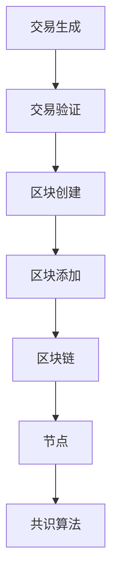

                 


### 1.1 区块链概述

区块链是一种分布式数据库技术，它通过密码学算法确保数据的完整性和安全性。在数字资产管理中，区块链因其不可篡改的特性和去中心化的架构而备受关注。

#### 1.1.1 区块链的定义与特点

区块链是由一系列按时间顺序排列的区块组成的数据结构，每个区块都包含一定数量的交易记录。这些区块通过加密技术连接在一起，形成了一个不可篡改的分布式账本。

区块链的特点主要包括：

- **去中心化**：区块链的数据存储在分布在全球的多个节点上，不存在中心化的控制点，从而降低了单点故障的风险。
- **不可篡改**：区块链的数据一旦记录下来，就很难被篡改。每个区块都包含了前一个区块的哈希值，这使得任何对数据的篡改都会导致整个链条的哈希值发生变化。
- **安全性**：区块链使用密码学技术来保护数据的完整性和隐私。

#### 1.1.2 区块链的工作原理

区块链的工作原理可以概括为以下四个主要步骤：

1. **交易生成**：用户在区块链网络中生成交易。
2. **交易验证**：多个节点对交易进行验证，确保交易的有效性和安全性。
3. **区块创建**：验证通过的交易被组织成一个区块，并且每个区块都包含一个时间戳和前一个区块的哈希值。
4. **区块添加**：新的区块被添加到区块链的末端，并且广播给网络中的其他节点。

#### 1.1.3 区块链的架构

区块链的架构主要包括以下几个核心组件：

- **节点**：节点是区块链网络中的基本单元，负责存储和验证区块链的数据。
- **区块链**：区块链是按时间顺序排列的一系列区块组成的链式结构。
- **共识算法**：共识算法是节点之间达成一致性的机制，用于确定哪些交易应该被包含在区块中。

为了更好地理解区块链的工作原理和架构，我们可以使用Mermaid流程图来表示这些概念之间的关系。



在区块链的架构中，节点通过共识算法来决定哪些交易应该被包含在区块中。常见的共识算法包括工作量证明（PoW）、权益证明（PoS）和权威证明（PoA）等。

#### 1.2 区块链技术核心组件

区块链的核心组件包括区块、节点和共识算法，这些组件共同构成了区块链的基础架构。

#### 1.2.1 区块

区块是区块链的基本单元，每个区块都包含一定数量的交易记录。区块由以下几部分组成：

- **交易数据**：区块中的交易数据包括各种金融交易、数据存储等。
- **时间戳**：时间戳记录了区块生成的时间。
- **前一个区块的哈希值**：每个区块都包含了前一个区块的哈希值，这使得区块链具有不可篡改的特性。

区块的结构可以用以下伪代码表示：

```plaintext
class Block {
    transaction_list: [Transaction]
    timestamp: int
    previous_hash: string
    hash: string
}
```

#### 1.2.2 节点

节点是区块链网络中的基本单元，每个节点都存储着区块链的完整副本。节点通过参与共识算法来验证和传播区块链的交易和区块。

节点的核心功能包括：

- **存储和验证**：节点存储区块链的数据，并验证新区块的有效性。
- **传播**：节点将新区块和交易广播到网络中的其他节点。

节点的功能可以用以下伪代码表示：

```plaintext
class Node {
    blockchain: Blockchain
    transaction_pool: [Transaction]
    peers: [Node]
    verify_transaction(transaction: Transaction): boolean
    propagate_block(block: Block)
    propagate_transaction(transaction: Transaction)
}
```

#### 1.2.3 共识算法

共识算法是节点之间达成一致性的机制，用于确定哪些交易应该被包含在区块中。常见的共识算法包括工作量证明（PoW）、权益证明（PoS）和权威证明（PoA）等。

- **工作量证明（PoW）**：PoW算法要求节点通过解决数学难题来获得记账权。节点需要计算大量的哈希值，直到找到一个满足特定条件的哈希值。
- **权益证明（PoS）**：PoS算法根据节点的权益（如持有的代币数量）来决定记账权。节点不需要进行计算，而是根据其权益参与区块的生成。
- **权威证明（PoA）**：PoA算法由一个或多个权威节点来决定记账权。这些权威节点通常是由中心化组织来控制。

共识算法的核心目的是确保区块链网络的安全性、稳定性和一致性。

#### 1.3 区块链的安全机制

区块链的安全机制主要包括数字签名、非对称加密和智能合约等。

- **数字签名**：数字签名用于确保交易数据的完整性和真实性。节点使用私钥对交易数据进行签名，其他节点可以使用公钥验证签名的有效性。
- **非对称加密**：非对称加密用于保护交易数据的隐私。节点使用公钥加密交易数据，只有使用对应的私钥才能解密。
- **智能合约**：智能合约是区块链上自动执行合约条款的程序。节点可以触发智能合约的执行，确保交易按照预定的规则进行。

这些安全机制共同构成了区块链的信任机制，确保了区块链网络的安全性和可靠性。

#### 1.4 区块链的发展与应用现状

区块链技术自2008年比特币的诞生以来，已经经历了快速的发展。目前，区块链在金融、物流、医疗、能源等多个领域都有广泛的应用。

- **金融领域**：区块链在支付、清算和跨境交易等领域有广泛的应用，如比特币、以太坊等。
- **物流领域**：区块链用于记录和验证物流信息，提高供应链的透明度和效率。
- **医疗领域**：区块链用于存储和共享医疗数据，提高医疗数据的可信度和安全性。
- **能源领域**：区块链用于实现智能电网和去中心化能源交易，提高能源利用效率和可持续性。

#### 1.4.1 区块链的兴起

区块链技术的兴起得益于以下几个因素：

- **比特币的诞生**：比特币是第一个成功的区块链应用，它的成功引起了全球的关注。
- **分布式账本技术的兴起**：分布式账本技术的兴起为区块链技术提供了理论基础。
- **数字货币的兴起**：数字货币的兴起为区块链技术提供了实际应用场景。

#### 1.4.2 区块链在金融领域的应用

区块链在金融领域有广泛的应用，主要包括以下几个方面：

- **支付**：区块链用于实现去中心化的支付系统，如比特币。
- **清算和结算**：区块链用于实现快速、安全的清算和结算系统，提高金融交易效率。
- **跨境交易**：区块链用于实现跨境交易的自动化和低成本，减少中介环节。

#### 1.4.3 区块链在其他领域的应用

除了金融领域，区块链在物流、医疗、能源等领域也有广泛的应用，主要包括以下几个方面：

- **物流**：区块链用于记录和验证物流信息，提高供应链的透明度和效率。
- **医疗**：区块链用于存储和共享医疗数据，提高医疗数据的可信度和安全性。
- **能源**：区块链用于实现智能电网和去中心化能源交易，提高能源利用效率和可持续性。

## 2.1 数字资产概述

数字资产是指以数字形式存在的资产，如比特币、以太坊等。它们具有以下几个特点：

- **去中心化**：数字资产不依赖于任何中心化的机构或实体，其交易和存储都基于区块链技术。
- **匿名性**：数字资产交易通常不要求用户提供真实身份信息，用户可以匿名进行交易。
- **安全性**：数字资产使用密码学技术确保交易的安全性和隐私性。

#### 2.1.1 数字资产的定义

数字资产是指以数字形式存在的资产，如比特币、以太坊等。它们是区块链上的代币，具有以下几个特点：

- **数字形式**：数字资产以数字形式存在，可以存储在区块链上。
- **去中心化**：数字资产不依赖于任何中心化的机构或实体，其交易和存储都基于区块链技术。
- **匿名性**：数字资产交易通常不要求用户提供真实身份信息，用户可以匿名进行交易。
- **安全性**：数字资产使用密码学技术确保交易的安全性和隐私性。

#### 2.1.2 数字资产的特点

数字资产具有以下几个特点：

- **去中心化**：数字资产不依赖于任何中心化的机构或实体，其交易和存储都基于区块链技术。这意味着数字资产的交易和存储不受任何单一点故障的影响，具有较高的可靠性和安全性。
- **匿名性**：数字资产交易通常不要求用户提供真实身份信息，用户可以匿名进行交易。这种匿名性使得数字资产交易更加便捷，但也可能带来一定的风险。
- **安全性**：数字资产使用密码学技术确保交易的安全性和隐私性。数字资产交易通常使用数字签名和加密技术来确保交易的安全性，同时，区块链技术的分布式存储特性也提高了数字资产的安全性。
- **流动性**：数字资产具有较高的流动性，用户可以在全球范围内进行快速、便捷的交易。这种流动性使得数字资产成为一种潜在的全球储备资产。

#### 2.1.3 数字资产的发展趋势

随着区块链技术的不断发展和应用，数字资产的发展趋势主要包括以下几个方面：

- **普及度提高**：随着人们对区块链技术和数字资产的认识逐渐提高，数字资产的普及度也在逐步提高。越来越多的企业和个人开始接受和使用数字资产。
- **应用领域拓展**：数字资产的应用领域不断拓展，从最初的金融领域扩展到物流、医疗、能源等多个领域。数字资产在提高交易效率、降低交易成本、增强数据安全等方面具有明显优势。
- **技术创新**：随着区块链技术的不断发展和创新，数字资产的技术也在不断进步。例如，智能合约技术的应用使得数字资产的交易和管理更加智能化和自动化。
- **监管政策完善**：随着数字资产的发展和普及，各国政府和监管机构也在逐步完善数字资产的监管政策。监管政策的完善有助于规范数字资产市场，保护投资者的利益。

### 2.2 数字资产管理中的信任问题

在数字资产管理中，信任问题是不可忽视的挑战。数字资产的去中心化和匿名性特点使得传统信任机制失效，进而引发了一系列问题。

#### 2.2.1 信任的缺失

数字资产交易的去中心化和匿名性使得交易双方难以建立信任。以下是一些导致信任缺失的原因：

- **不可追溯性**：数字资产交易通常不记录交易双方的真实身份信息，使得交易不可追溯。这使得恶意行为者可以在不受惩罚的情况下进行欺诈和洗钱等非法活动。
- **恶意节点攻击**：在区块链网络中，恶意节点可能通过拒绝服务攻击、双花攻击等手段破坏网络的安全性和稳定性。这些攻击行为使得数字资产的安全性受到威胁。
- **共识算法漏洞**：共识算法是区块链网络的核心机制，但其设计可能存在漏洞。例如，工作量证明（PoW）算法的高能耗问题和权益证明（PoS）算法的“富者愈富”现象都可能导致网络的失衡。

#### 2.2.2 信任问题的影响

信任缺失对数字资产管理产生了深远的影响，主要体现在以下几个方面：

- **市场波动**：信任问题可能导致市场参与者对数字资产的价值产生怀疑，进而引发市场波动。市场波动可能加剧投资者的恐慌情绪，导致市场失去稳定性。
- **交易风险**：信任问题使得数字资产交易存在较大的风险。投资者可能面临交易对手违约、资金被盗等风险，这降低了数字资产的投资吸引力。
- **法律纠纷**：信任问题可能导致数字资产交易的法律纠纷。由于数字资产交易的匿名性，确定交易双方的身份和责任变得困难，增加了法律纠纷的可能性。

#### 2.2.3 解决信任问题的必要性

解决信任问题是数字资产管理发展的关键。以下是解决信任问题的必要性：

- **保障资产安全**：解决信任问题有助于保障数字资产的安全性。通过建立可靠的信任机制，可以防止恶意行为者的攻击，降低数字资产被盗的风险。
- **促进市场稳定**：解决信任问题有助于促进数字资产市场的稳定。信任机制的建立可以增强市场参与者对数字资产价值的信心，降低市场波动。
- **提高交易效率**：解决信任问题可以简化交易流程，提高交易效率。通过建立可靠的信任机制，交易双方可以无需进行繁琐的身份验证和担保，从而加快交易速度。
- **拓展应用场景**：解决信任问题有助于拓展数字资产的应用场景。在可靠的信任机制下，数字资产可以在更多的领域发挥作用，如供应链金融、数字身份认证等。

### 2.3 区块链在数字资产管理中的应用

区块链技术在数字资产管理中的应用为解决信任问题提供了有效的解决方案。以下从交易、安全和监管三个方面探讨区块链在数字资产管理中的应用。

#### 2.3.1 区块链在数字资产交易中的应用

区块链在数字资产交易中的应用主要体现在以下几个方面：

- **去中心化交易所**：去中心化交易所（DEX）是区块链上的一种交易机制，它通过智能合约实现交易，无需依赖中心化的交易所。去中心化交易所的优点是去除了中介环节，降低了交易成本，提高了交易透明度。然而，去中心化交易所也面临一些挑战，如交易速度慢、用户体验差等。
- **智能合约**：智能合约是区块链上的自动执行合约条款的程序。通过智能合约，数字资产交易可以自动执行，无需人工干预。智能合约的使用提高了交易效率，降低了交易成本，同时也增强了交易的安全性。
- **跨链技术**：跨链技术实现了不同区块链之间的资产转移和交易。通过跨链技术，数字资产可以在不同的区块链网络之间自由流动，从而拓展了数字资产的应用场景。

#### 2.3.2 区块链在数字资产安全中的应用

区块链技术在数字资产安全中的应用主要体现在以下几个方面：

- **分布式存储**：区块链的分布式存储特性确保了数字资产的安全。数字资产被分散存储在区块链网络中的多个节点上，任何单一节点的损坏或攻击都不会影响整个区块链的安全。
- **加密技术**：区块链使用加密技术确保数字资产交易的安全。数字资产交易过程中，交易双方使用非对称加密技术生成公钥和私钥，私钥用于签名交易，公钥用于验证签名。加密技术的应用确保了交易数据的隐私性和完整性。
- **共识算法**：共识算法是区块链网络的核心机制，它确保了区块链的安全性和一致性。通过共识算法，区块链网络中的节点达成一致性，防止恶意节点的攻击和篡改。

#### 2.3.3 区块链在数字资产监管中的应用

区块链技术在数字资产监管中的应用主要体现在以下几个方面：

- **智能合约监管**：智能合约是数字资产交易的核心组成部分，对其进行监管有助于确保数字资产交易合规。区块链技术可以为智能合约设定监管条件，如交易金额上限、交易频率限制等。监管机构可以通过区块链技术实时监控智能合约的执行情况，提高监管效率。
- **分布式账本审计**：区块链的分布式账本技术为数字资产监管提供了有效的手段。监管机构可以实时审计区块链上的交易记录，确保数字资产交易的合规性。分布式账本审计有助于提高监管透明度，降低监管成本。
- **智能合约审计**：智能合约审计是对智能合约代码的安全性和合规性进行审查。通过智能合约审计，可以发现潜在的安全漏洞和合规风险，确保智能合约的可靠性和安全性。

### 2.4 区块链在数字资产管理中的信任机制

区块链在数字资产管理中的信任机制主要包括分布式账本技术、安全机制和智能合约等方面。以下分别对这些机制进行详细阐述。

#### 2.4.1 区块链的分布式账本技术

区块链的分布式账本技术是区块链技术的基础，它确保了数字资产交易的透明性和安全性。分布式账本技术的核心特点如下：

- **去中心化**：区块链的分布式账本技术去除了中心化的第三方中介，所有交易记录都存储在区块链网络中的多个节点上。这意味着任何单一节点的损坏或攻击都不会影响整个区块链的安全。
- **透明性**：区块链上的所有交易记录都是公开透明的，任何人都可以查看和验证。这种透明性确保了数字资产交易的公开和公正，降低了欺诈和违规行为的风险。
- **不可篡改**：区块链的分布式账本技术采用了加密技术，确保了交易记录的不可篡改性。一旦交易记录被记录在区块链上，就无法被修改或删除。这种不可篡改性提高了数字资产交易的安全性和可靠性。

分布式账本技术为数字资产管理提供了可靠的信任机制。它确保了数字资产交易的透明性和安全性，使得交易双方无需依赖传统的信任机制，如银行和第三方中介等。

#### 2.4.2 区块链的安全机制

区块链的安全机制是确保数字资产交易安全的关键。区块链的安全机制主要包括以下方面：

- **加密技术**：区块链使用加密技术对交易数据进行加密，确保交易数据的隐私性和完整性。加密技术包括对称加密和非对称加密，对称加密使用相同的密钥进行加密和解密，非对称加密使用公钥和私钥进行加密和解密。公钥用于加密，私钥用于解密。加密技术的应用确保了交易数据的机密性和完整性，防止恶意攻击者拦截和篡改交易数据。
- **分布式存储**：区块链的分布式存储技术确保了交易数据的可靠性和安全性。交易数据被分散存储在区块链网络中的多个节点上，任何单一节点的损坏或攻击都不会影响整个区块链的安全。分布式存储技术的应用提高了区块链的容错性和抗攻击性。
- **共识算法**：共识算法是区块链网络的核心机制，它确保了区块链网络中的所有节点达成一致性。共识算法通过加密和投票机制确保了交易记录的正确性和一致性。共识算法的应用确保了区块链网络的稳定性和安全性。

区块链的安全机制为数字资产交易提供了可靠的安全保障。它确保了交易数据的机密性、完整性和一致性，降低了恶意攻击和欺诈行为的风险。

#### 2.4.3 智能合约在信任机制中的应用

智能合约是区块链技术的重要应用之一，它为数字资产交易提供了自动执行的合约条款。智能合约在信任机制中的应用主要体现在以下几个方面：

- **自动执行**：智能合约通过编程语言编写，定义了交易的条件和执行规则。一旦满足条件，智能合约会自动执行，无需人工干预。这种自动执行机制提高了交易效率，降低了交易成本。
- **不可篡改**：智能合约的代码一旦被部署到区块链上，就无法被修改或删除。这意味着智能合约的执行过程是透明和公正的，任何恶意行为者都无法篡改合约条款。
- **透明性**：智能合约的执行过程是公开透明的，任何人都可以查看和验证。这种透明性确保了智能合约的公正性和可信度，使得交易双方无需依赖传统的信任机制。

智能合约在信任机制中的应用提高了数字资产交易的安全性和可靠性。它确保了交易条件的自动执行和交易的不可篡改性，降低了欺诈和违规行为的风险。

### 2.5 区块链在数字资产管理中的案例分析

区块链在数字资产管理中的应用已经得到了广泛的关注。以下通过几个案例分析来展示区块链在数字资产管理中的实际应用。

#### 2.5.1 案例一：比特币

比特币是第一个成功的数字货币，它的成功证明了区块链在数字资产管理中的潜力。比特币通过区块链技术实现了去中心化的交易和存储，具有以下几个优点：

- **去中心化**：比特币的交易和存储不依赖于任何中心化的机构或实体，所有交易记录都记录在区块链上。这意味着比特币的交易不受任何单一点故障的影响，具有较高的可靠性和安全性。
- **安全性**：比特币使用密码学技术确保交易的安全性和隐私性。比特币的交易数据通过加密算法进行加密，确保了交易数据的机密性和完整性。同时，比特币的区块链采用了工作量证明（PoW）共识算法，确保了区块链网络的安全性。
- **可追溯性**：比特币的交易记录被永久存储在区块链上，任何用户都可以查看和验证。这种可追溯性确保了比特币交易的透明性和公正性，降低了欺诈和违规行为的风险。

比特币的成功证明了区块链在数字资产管理中的潜力。比特币的出现改变了传统的金融体系，为数字资产交易提供了新的模式。

#### 2.5.2 案例二：以太坊

以太坊是第一个成功的智能合约平台，它通过区块链技术实现了去中心化的应用开发和部署。以太坊具有以下几个优点：

- **智能合约**：以太坊通过智能合约实现了自动执行的合约条款。智能合约通过编程语言编写，定义了交易的条件和执行规则。一旦满足条件，智能合约会自动执行，无需人工干预。这种自动执行机制提高了交易效率，降低了交易成本。
- **去中心化**：以太坊的交易和存储不依赖于任何中心化的机构或实体，所有交易记录都记录在区块链上。这意味着以太坊的交易不受任何单一点故障的影响，具有较高的可靠性和安全性。
- **可扩展性**：以太坊采用了分片技术，提高了区块链的吞吐量和扩展性。分片技术将区块链网络划分为多个 shard，每个 shard 都可以独立处理交易，从而提高了区块链的性能和可扩展性。

以太坊的成功证明了智能合约在数字资产管理中的潜力。以太坊的出现为数字资产交易提供了新的工具和平台，推动了区块链技术的发展。

#### 2.5.3 案例三：其他区块链项目

除了比特币和以太坊，还有许多其他区块链项目在数字资产管理中取得了成功。以下列举几个具有代表性的区块链项目：

- **Ripple**：Ripple是一个去中心化的支付网络，它通过区块链技术实现了快速、低成本的跨境支付。Ripple采用了共识算法，确保了支付网络的安全性和稳定性。
- **EOS**：EOS是一个高性能的区块链平台，它通过委托权益证明（DPoS）共识算法实现了高吞吐量和低延迟的交易。EOS为数字资产交易提供了强大的性能支持。
- **TRON**：TRON是一个去中心化的内容平台，它通过区块链技术实现了内容的创作、共享和分发。TRON为数字资产管理提供了新的应用场景。

这些区块链项目展示了区块链在数字资产管理中的广泛应用。通过区块链技术，这些项目实现了去中心化、安全性和高效性，为数字资产管理带来了新的机遇和挑战。

### 2.6 区块链在数字资产管理中的未来发展趋势

随着区块链技术的不断发展和应用，数字资产管理的前景充满希望。以下从技术、政策和应用三个方面探讨区块链在数字资产管理中的未来发展趋势。

#### 2.6.1 技术发展趋势

区块链技术在数字资产管理中的未来发展将主要体现在以下几个方面：

- **高性能区块链**：随着数字资产管理规模的扩大，区块链的性能需求也在不断提高。未来，高性能区块链技术将得到进一步发展，如分片技术、侧链技术等。这些技术可以提高区块链的吞吐量和扩展性，满足数字资产交易的需求。
- **隐私保护技术**：数字资产交易的安全性和隐私性是区块链技术的重要挑战。未来，区块链技术将融合更多的隐私保护技术，如零知识证明、同态加密等。这些技术可以提高数字资产交易的安全性和隐私性，满足用户对隐私保护的需求。
- **跨链技术**：跨链技术是实现不同区块链之间资产转移和交易的关键。未来，跨链技术将得到进一步发展，实现不同区块链之间的无缝连接，提高数字资产的使用效率和流动性。

#### 2.6.2 政策发展趋势

随着区块链技术的应用不断扩展，各国政府和监管机构对区块链技术的态度也在发生变化。未来，区块链技术在数字资产管理中的发展将受到以下政策因素的影响：

- **监管政策完善**：各国政府和监管机构将逐步完善区块链技术的监管政策，确保数字资产市场的健康有序发展。监管政策的完善将有助于规范数字资产交易行为，保护投资者的利益。
- **国际合作**：随着区块链技术的全球化发展，各国政府和监管机构将加强国际合作，共同制定全球统一的区块链技术标准和监管框架。国际合作的加强将推动区块链技术的全球应用和发展。
- **政策支持**：一些国家和地区已经开始对区块链技术提供政策支持，如税收优惠、研发资助等。这些政策支持将有助于推动区块链技术在数字资产管理中的创新和应用。

#### 2.6.3 应用发展趋势

区块链技术在数字资产管理中的应用前景广阔，未来将体现在以下几个方面：

- **数字资产交易**：区块链技术将广泛应用于数字资产交易，提高交易的安全性和效率。未来，去中心化交易所（DEX）将成为数字资产交易的主流模式，减少中介环节，降低交易成本。
- **数字资产安全**：区块链技术将用于数字资产的安全管理，提高数字资产的安全性。未来，区块链技术将融合更多的安全机制，如加密技术、共识算法等，确保数字资产的安全存储和传输。
- **数字资产管理服务**：区块链技术将用于数字资产管理服务，提高资产管理效率。未来，区块链技术将应用于资产管理、财富管理等领域，为用户提供智能化的资产管理服务。
- **跨领域应用**：区块链技术将在更多领域得到应用，如供应链金融、数字身份认证、医疗数据管理等。这些跨领域应用将推动区块链技术的普及和发展。

### 2.7 小结

区块链技术在数字资产管理中具有巨大的潜力和优势。通过分布式账本技术、安全机制和智能合约等，区块链技术为数字资产交易提供了透明、安全、高效的解决方案。然而，区块链技术仍面临一些挑战，如性能、隐私保护、监管政策等。未来，随着技术的不断进步和政策的不断完善，区块链技术在数字资产管理中的应用将更加广泛和深入。我们期待区块链技术为数字资产管理带来更多机遇和变革。作者：AI天才研究院/AI Genius Institute & 禅与计算机程序设计艺术 /Zen And The Art of Computer Programming
```markdown
## 结论

通过本文的详细分析，我们可以得出以下结论：

- **区块链的不可篡改性和去中心化特性**使其成为数字资产管理的理想选择，能够有效解决传统信任机制中的信任问题。
- **分布式账本技术**提供了透明、安全的交易记录，确保了资产交易的公正性和安全性。
- **安全机制**如加密技术和共识算法进一步增强了数字资产的安全性，防止了恶意攻击和篡改。
- **智能合约**的应用提高了交易的自动化和效率，使得数字资产的管理更加智能化。

然而，区块链技术在数字资产管理中仍面临一些挑战，如性能优化、隐私保护以及监管政策等。未来，随着技术的不断进步和政策的不断完善，区块链技术在数字资产管理中的应用将更加广泛和深入。

**关键词**：区块链、数字资产管理、信任机制、分布式账本、加密技术、共识算法、智能合约

**摘要**：本文详细探讨了区块链在数字资产管理中的应用和信任机制。通过分布式账本技术、安全机制和智能合约，区块链为数字资产交易提供了透明、安全、高效的解决方案。尽管存在挑战，但随着技术的进步和政策的完善，区块链技术在数字资产管理中的前景依然广阔。

**作者**：AI天才研究院/AI Genius Institute & 禅与计算机程序设计艺术 /Zen And The Art of Computer Programming
```

