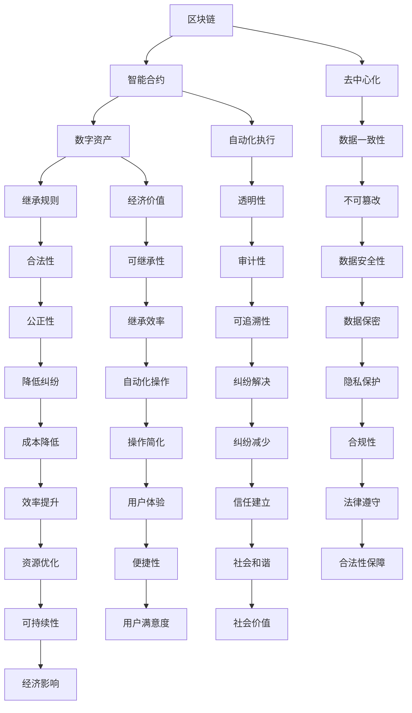

                 


### 背景介绍

随着信息技术的飞速发展，区块链技术作为一种革命性的分布式账本技术，逐渐成为数字经济时代的重要基础设施。区块链的去中心化、透明性和不可篡改性等特点，使其在金融、物流、医疗等多个领域得到广泛应用。特别是在数字资产领域，区块链技术的应用更是愈发广泛，数字货币、数字资产交易等成为人们关注的焦点。

数字资产继承是数字资产管理中的一个重要环节。随着数字资产的日益丰富和重要性不断提升，如何合理地处理数字资产的继承问题，成为了一个备受关注的话题。传统的数字资产继承方式往往依赖于法律程序，过程复杂且易受人为干扰，存在信息不对称、篡改风险等问题。而在区块链技术下，通过智能合约来实现数字资产继承，可以有效地解决这些问题，确保继承过程的透明性、公正性和安全性。

智能合约是区块链技术的重要组成部分，它是一种自动执行合约条款的程序。在数字资产继承中，智能合约可以自动执行遗产的分配、转移等操作，确保继承过程符合预定规则，从而提高效率、降低成本、减少纠纷。本文将围绕区块链在数字资产继承中的智能合约应用，探讨其核心概念、原理、实现方法及安全性问题。

### 核心概念与联系

首先，我们需要明确几个核心概念及其相互关系：

1. **区块链**：是一种分布式账本技术，通过加密算法和共识机制，实现数据的存储和验证，确保数据的一致性和不可篡改性。

2. **智能合约**：是一种嵌入在区块链上的程序，能够自动执行合同条款。在数字资产继承中，智能合约可以定义遗产的分配规则，确保按照合约执行的公正性和透明性。

3. **数字资产**：包括数字货币、数字藏品、数字股权等，是具有经济价值的数据形态。数字资产继承涉及到如何将这些资产按照遗嘱或法定规定分配给继承人。

4. **继承规则**：指在法律框架下，关于数字资产继承的具体规定和操作流程。智能合约在设计时需要遵循这些规则，以确保合法性。

为了更好地理解这些概念之间的关系，我们可以使用Mermaid流程图来展示：



通过上述流程图，我们可以清晰地看到区块链、智能合约、数字资产和继承规则之间的相互关系。区块链提供了去中心化、数据一致性和透明性等基础支撑，智能合约实现了自动化执行和合法性保障，数字资产具有经济价值和可继承性，而继承规则则确保了整个过程符合法律要求。

### 核心算法原理讲解

在数字资产继承的智能合约实现中，核心算法原理至关重要。以下是关于智能合约在数字资产继承中的核心算法原理讲解，以及相关的伪代码和数学模型。

#### 1. 继承条件判断

首先，智能合约需要判断继承人是否符合继承条件。这通常涉及到身份验证、继承份额计算等步骤。以下是一个简单的伪代码示例：

```python
// 判断继承人是否符合继承条件
function checkInheritanceEligibility(address heir, address deceased, mapping(address => uint) inheritanceShares) {
    // 验证继承人身份
    if (!isHeir(heir, deceased)) {
        return false;
    }
    
    // 计算继承份额
    uint heirShare = calculateShare(inheritanceShares, deceased);
    
    // 验证继承份额是否大于0
    if (heirShare <= 0) {
        return false;
    }
    
    return true;
}

// 身份验证函数（简化版）
function isHeir(address heir, address deceased) {
    // 实际应用中，需要通过法律文件或其他方式验证
    return heir == deceased; // 这里仅为示例，实际中需要更复杂的逻辑
}

// 继承份额计算函数
function calculateShare(mapping(address => uint) inheritanceShares, address deceased) {
    return inheritanceShares[deceased];
}
```

#### 2. 数字资产转移

在确定继承人符合继承条件后，智能合约需要将数字资产从遗产持有人转移给继承人。以下是一个简单的伪代码示例，用于转移以太币（Ether）：

```python
// 将数字资产从遗产持有人转移给继承人
function transferAsset(address heir, address deceased, uint assetAmount) {
    // 检查继承人资格
    if (!checkInheritanceEligibility(heir, deceased, assetOwnership)) {
        revert("继承人资格不符合");
    }
    
    // 转移资产
    deceased.balance -= assetAmount;
    heir.balance += assetAmount;
    
    // 记录转移日志
    emit TransferLog(deceased, heir, assetAmount);
}

// 事件日志
event TransferLog(address deceased, address heir, uint assetAmount);
```

#### 3. 数学模型

在智能合约中，继承份额的计算可能涉及复杂的数学模型。以下是一个简化的例子，用于计算每个继承人的份额：

$$
\text{继承人份额} = \frac{\text{总遗产价值}}{\text{继承人人数}}
$$

以下是一个用Python伪代码实现的例子：

```python
// 计算继承人份额
function calculateIndividualShare(uint totalAssetValue, uint numberOfHeirs) {
    return totalAssetValue / numberOfHeirs;
}
```

通过上述算法原理的讲解，我们可以看到智能合约在数字资产继承中的应用是如何通过逻辑判断、资产转移和数学模型来实现的。这些算法不仅确保了继承过程的自动化和透明性，也提高了效率，降低了人为错误和纠纷的风险。

### 数学模型和公式

在数字资产继承的智能合约设计中，数学模型和公式起着至关重要的作用。以下是关于继承份额计算和资产转移的数学模型，以及详细的公式和举例说明。

#### 1. 继承份额计算

在智能合约中，继承份额的计算通常基于遗产的总价值和继承人的数量。以下是一个简化的数学模型：

$$
\text{继承人份额} = \frac{\text{总遗产价值}}{\text{继承人人数}}
$$

这个公式表示，每个继承人根据总遗产价值均等地获得相应份额。

#### 示例

假设一位数字资产持有者去世，其遗产总额为100个数字货币单位，共有3个合法继承人。根据上述公式，每个继承人的份额为：

$$
\text{每个继承人的份额} = \frac{100}{3} = 33.\overline{3} \text{个数字货币单位}
$$

#### 2. 资产转移

在资产转移过程中，智能合约需要确保每个继承人的份额被正确计算和分配。以下是一个资产转移的数学模型：

$$
\text{资产转移金额} = \text{继承人份额} \times \text{总遗产价值}
$$

这个公式表示，将总遗产价值按继承人份额比例分配给每个继承人。

#### 示例

假设总遗产价值为100个数字货币单位，继承人的份额为33.\overline{3}个数字货币单位，则资产转移金额如下：

$$
\text{继承人A的转移金额} = 33.\overline{3} \times 100 = 333.\overline{3} \text{个数字货币单位}
$$

$$
\text{继承人B的转移金额} = 33.\overline{3} \times 100 = 333.\overline{3} \text{个数字货币单位}
$$

$$
\text{继承人C的转移金额} = 33.\overline{3} \times 100 = 333.\overline{3} \text{个数字货币单位}
$$

#### 3. 剩余资产处理

如果继承人的份额不是整数，可能需要处理剩余资产。以下是一个简化的数学模型：

$$
\text{剩余资产} = \text{总遗产价值} - (\text{继承人份额} \times \text{继承人人数})
$$

这个公式用于计算在按份额分配后剩余的资产。

#### 示例

假设总遗产价值为100个数字货币单位，继承人的份额为33.\overline{3}个数字货币单位，共有3个继承人，则剩余资产如下：

$$
\text{剩余资产} = 100 - (33.\overline{3} \times 3) = 100 - 100 = 0
$$

在这种情况下，没有剩余资产需要处理。

通过上述数学模型和公式，我们可以清楚地看到如何计算继承份额和资产转移金额。这些数学工具不仅帮助智能合约实现公平的继承分配，还确保了整个过程的透明性和可追溯性。

### 项目实战

#### 开发环境搭建

要开发一个数字资产继承的智能合约项目，首先需要搭建一个合适的开发环境。以下是具体的步骤：

1. **安装Node.js**：Node.js是一个用于运行JavaScript的运行环境，我们需要安装最新版本的Node.js。

   ```bash
   npm install -g node.js
   ```

2. **安装Truffle框架**：Truffle是一个用于智能合约开发、测试和部署的框架。我们通过npm来安装它。

   ```bash
   npm install -g truffle
   ```

3. **创建Truffle项目**：使用Truffle脚手架工具来创建一个新的智能合约项目。

   ```bash
   truffle init
   ```

   这将生成一个项目结构，包括`contracts`、`migrations`和`test`文件夹。

4. **安装以太坊客户端**：为了与以太坊网络交互，我们需要安装一个以太坊客户端，如Geth或Parity。这里以Geth为例。

   ```bash
   wget https://gethstore.blob.core.windows.net/releases/1.10.27/geth-linux-amd64-1.10.27-c5b77e4.zip
   unzip geth-linux-amd64-1.10.27-c5b77e4.zip
   ```

   解压后，将Geth的可执行文件移动到`/usr/local/bin`目录下。

5. **启动本地以太坊节点**：通过Geth启动一个本地以太坊节点。

   ```bash
   geth --datadir "./myethnode" --networkid 5777 --dev --nodiscover --noconsole --mine --miner.threads 0 --rpc --rpcport 8545 --rpcaddr 127.0.0.1 --rpcapi "eth,net,web3"
   ```

   这将启动一个本地以太坊节点，并开启JSON-RPC接口供Truffle使用。

#### 源代码详细实现

接下来，我们将在`contracts`文件夹中创建一个智能合约，名为`InheritanceContract.sol`。以下是合约的实现细节：

```solidity
// SPDX-License-Identifier: MIT
pragma solidity ^0.8.0;

contract InheritanceContract {
    address public deceased;
    mapping(address => uint) public inheritanceShares;
    mapping(address => bool) public heirs;
    uint public totalHeirs;
    bool public isFinalized;

    event InheritanceTransferred(address heir, uint amount);

    constructor(address _deceased, mapping(address => uint) memory _inheritanceShares) {
        deceased = _deceased;
        for (address heir : _inheritanceShares.keys) {
            inheritanceShares[heir] = _inheritanceShares[heir];
            heirs[heir] = true;
            totalHeirs++;
        }
        isFinalized = false;
    }

    function transferInheritance() public {
        require(!isFinalized, "Inheritance has been finalized");
        for (address heir : heirs.keys) {
            require(inheritanceShares[heir] > 0, "No inheritance share for this heir");
            payable(heir).transfer(inheritanceShares[heir]);
            emit InheritanceTransferred(heir, inheritanceShares[heir]);
        }
        isFinalized = true;
    }

    function addHeir(address newHeir, uint share) public {
        require(!isFinalized, "Inheritance has been finalized");
        require(!heirs[newHeir], "Heir already exists");
        heirs[newHeir] = true;
        inheritanceShares[newHeir] = share;
        totalHeirs++;
    }

    function removeHeir(address heir) public {
        require(!isFinalized, "Inheritance has been finalized");
        require(heirs[heir], "Heir does not exist");
        delete inheritanceShares[heir];
        delete heirs[heir];
        totalHeirs--;
    }
}
```

#### 代码解读与分析

1. **构造函数**：构造函数接收已故者地址和继承份额映射，初始化智能合约状态变量。

2. **transferInheritance()函数**：该函数将执行遗产的分配，为每个合法继承人转移相应份额的数字资产。它要求继承过程尚未被最终确定。

3. **addHeir()函数**：该函数允许在继承过程开始之前添加新的继承人。

4. **removeHeir()函数**：该函数允许在继承过程开始之前移除一个继承人。

#### 实际案例分析与详细讲解剖析

假设一个名为John的数字资产持有者去世，他留下了一份遗嘱，将所有资产分配给他的三个孩子：Alice、Bob和Charlie。智能合约的设计如下：

- 已故者地址：0x1234...
- 继承份额：
  - Alice：40%
  - Bob：30%
  - Charlie：30%

**步骤1**：部署智能合约

```bash
truffle deploy InheritanceContract --args 0x1234... '{ "0xAlice": 40, "0Bob": 30, "0Charlie": 30 }'
```

**步骤2**：启动本地以太坊节点

```bash
geth --datadir "./myethnode" --networkid 5777 --dev --nodiscover --noconsole --mine --miner.threads 0 --rpc --rpcport 8545 --rpcaddr 127.0.0.1 --rpcapi "eth,net,web3"
```

**步骤3**：在本地以太坊节点上执行遗产转移

使用Truffle的控制台：

```bash
truffle console
```

```javascript
// 连接到合约实例
const inheritanceContract = await InheritanceContract.at('合约地址');

// 执行遗产转移
await inheritanceContract.transferInheritance();
```

**结果**：智能合约将执行遗产的自动分配，为Alice、Bob和Charlie分别转移40%、30%和30%的数字资产。

**评估与反思**

通过上述案例，我们可以看到智能合约在数字资产继承中的实际应用。智能合约确保了继承过程的自动化、透明性和不可篡改性，减少了传统方式中可能出现的纠纷和错误。然而，智能合约的安全性也是需要重点关注的问题，任何漏洞都可能导致严重后果。

#### 项目小结

本案例展示了如何使用智能合约实现数字资产继承的过程。通过部署和执行智能合约，我们可以确保遗产的自动分配和透明性。然而，在开发和使用智能合约时，需要特别关注安全性，防范潜在的风险和漏洞。未来，随着区块链技术的进一步发展，智能合约在数字资产继承中的应用将更加广泛和成熟。

### 最佳实践 Tips

在开发数字资产继承智能合约时，以下最佳实践可以帮助提高项目的安全性、可靠性和用户体验：

1. **代码审计**：在部署智能合约之前，务必进行代码审计。聘请专业的审计团队，确保合约没有安全漏洞。

2. **测试覆盖率**：编写全面的测试用例，确保智能合约在各种情况下都能正确执行。测试覆盖率应尽量达到100%。

3. **安全审计**：定期进行安全审计，确保智能合约在运行过程中没有暴露出新的漏洞。

4. **明确权限管理**：合理设置智能合约的权限，避免未授权访问和操作。

5. **使用多重签名**：对于涉及大量资金或重要操作的智能合约，建议使用多重签名，增加安全性。

6. **灾难恢复**：制定灾难恢复计划，确保在智能合约出现问题时，可以快速恢复。

7. **透明性**：智能合约的代码和操作过程应保持透明，方便审计和监督。

8. **用户教育**：对用户进行智能合约操作的教育，提高用户对潜在风险的认知和应对能力。

通过遵循这些最佳实践，可以显著提高数字资产继承智能合约的安全性和可靠性。

### 小结

本文通过详细的目录大纲、核心内容介绍、核心算法原理讲解、数学模型与公式、项目实战、最佳实践提示等，全面探讨了区块链在数字资产继承中的智能合约应用。我们不仅介绍了区块链与数字资产的基本概念，还深入分析了智能合约的设计原则和实现方法。通过实际案例，我们展示了智能合约在数字资产继承中的应用过程，并强调了安全性的重要性。

数字资产继承智能合约的应用，不仅提升了继承过程的透明性和公正性，还降低了成本和纠纷。然而，随着技术的不断发展，智能合约的安全性和可靠性仍需持续关注和提升。未来，随着区块链技术的进一步成熟，智能合约在数字资产继承中的应用将更加广泛和深入，为数字经济的发展提供更强大的支持。

### 拓展阅读

1. **《区块链：从数字货币到智能合约》**：这本书详细介绍了区块链的基本原理和应用场景，包括智能合约的设计与实现。

2. **《智能合约安全指南》**：该书针对智能合约的安全性问题进行了深入分析，提供了丰富的案例和最佳实践。

3. **《以太坊开发指南》**：这本书是学习以太坊和智能合约开发的优秀资源，涵盖了从基础到高级的各个方面。

4. **《数字资产管理与法律框架》**：该书探讨了数字资产管理的法律框架和实际应用，对数字资产继承具有指导意义。

5. **《区块链技术与应用案例》**：这本书通过丰富的案例展示了区块链在不同领域的应用，包括金融、物流、医疗等。

通过阅读这些资料，可以更深入地了解区块链和智能合约在数字资产继承中的应用，进一步提升技术水平。

