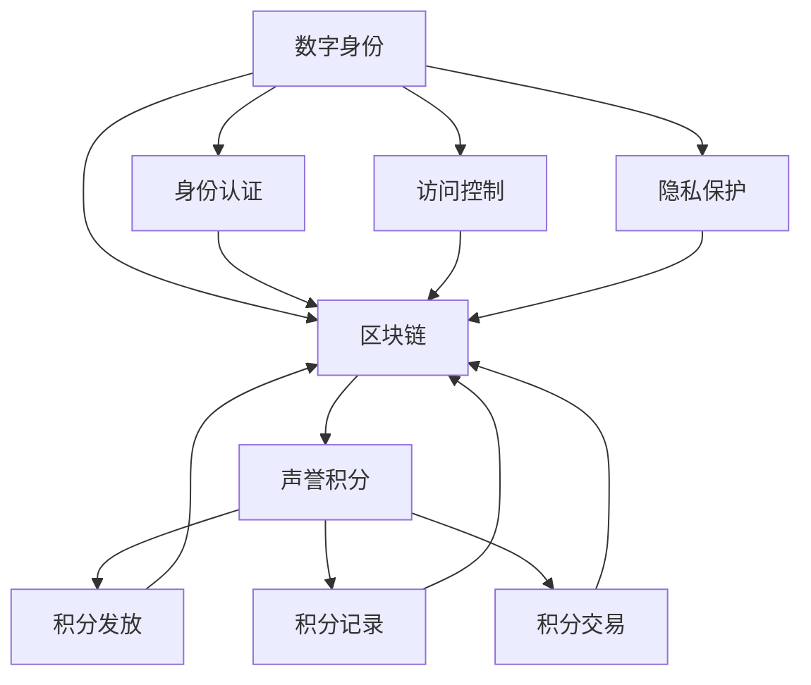

                 

### 文章标题

# 区块链在数字身份声誉积分中的应用

### 关键词

- 区块链
- 数字身份
- 声誉积分
- 加密技术
- 智能合约
- 用户体验

### 摘要

本文将深入探讨区块链技术在数字身份管理及声誉积分系统中的应用。我们将首先介绍区块链的基本概念，以及其如何为数字身份提供安全保障和隐私保护。随后，我们将详细讲解声誉积分系统的设计和实现，探讨区块链在积分发放、记录和交易中的作用。接着，本文将通过实际案例分析区块链在数字身份和声誉积分系统中的成功应用，并探讨其面临的安全和隐私保护挑战。最后，我们将展望区块链技术在数字身份和声誉积分领域的未来发展趋势，提出相关的最佳实践和改进建议。

### 引言

在数字化的现代社会，个人的数字身份和声誉对于个人的信用、社会地位和商业交易都具有重要意义。传统的数字身份管理方式存在诸多问题，如数据泄露、隐私暴露、身份盗用等。而区块链技术的出现为解决这些问题提供了新的思路和可能性。区块链以其去中心化、安全可靠、透明可追溯等特性，在数字身份管理和声誉积分系统中有广泛的应用前景。

本文将首先介绍区块链的基本概念和核心技术，阐述其如何为数字身份提供安全保障和隐私保护。接着，我们将探讨声誉积分系统的设计原则和实现方法，重点介绍区块链在积分发放、记录和交易中的应用。随后，本文将分析区块链在数字身份和声誉积分系统中的实际应用案例，探讨其成功经验和面临的挑战。最后，我们将展望区块链技术在数字身份和声誉积分领域的未来发展趋势，并提出相关的最佳实践和改进建议。

### 区块链基础知识

区块链是一种去中心化的分布式账本技术，其核心特点是不可篡改、透明和可追溯。区块链的工作原理基于密码学和共识算法，其基本结构包括区块、链和节点。以下是对区块链基础知识的详细探讨。

#### 区块链的起源与发展历程

区块链最早由中本聪（Satoshi Nakamoto）在2008年提出，作为比特币（Bitcoin）的基础技术。比特币是第一个实现区块链技术的数字货币，其成功引起了全球对区块链技术的关注。此后，区块链技术迅速发展，逐渐应用于金融、供应链、医疗、物流等多个领域。

#### 区块链的核心概念

1. **区块（Block）**：区块是区块链的基本组成单元，包含一定数量的交易记录。每个区块都包含一个时间戳、一个随机数（nonce）和前一个区块的哈希值（hash）。这些信息确保了区块之间的连接和整个区块链的完整性。

2. **链（Chain）**：区块链是一个由多个区块按时间顺序连接而成的链条。每个区块都通过其哈希值与前一个区块连接，形成一个不可篡改的数据结构。

3. **节点（Node）**：节点是区块链网络中的参与方，负责验证交易、维护区块链的完整性并参与共识过程。每个节点都保存了一份完整的区块链副本。

#### 区块链的核心技术

1. **加密技术**：区块链采用加密技术来确保交易的安全性和隐私性。每个交易都使用公钥和私钥进行加密和解密，确保交易信息的机密性。此外，区块链使用哈希函数将交易数据转换成唯一的哈希值，确保数据的一致性和不可篡改性。

2. **共识算法**：共识算法是区块链网络中节点达成一致性的机制。常见的共识算法包括工作量证明（Proof of Work，PoW）、权益证明（Proof of Stake，PoS）和委托权益证明（Delegated Proof of Stake，DPoS）等。这些算法确保了区块链网络的安全性和去中心化特性。

#### 区块链的基本架构

1. **网络结构**：区块链网络由多个节点组成，每个节点都运行完整的区块链软件。节点之间通过P2P（点对点）网络进行通信，确保数据的传输和同步。

2. **数据结构**：区块链的数据结构是一个链式结构，每个区块都包含一个指向前一个区块的哈希值。这种结构确保了数据的完整性和不可篡改性。

#### 区块链的分类

1. **公链（Public Chain）**：公链是任何人都可以参与和访问的区块链，如比特币和以太坊。公链具有高度的去中心化和匿名性，适用于去中心化应用（DApps）和数字货币。

2. **私链（Private Chain）**：私链是仅限特定组织或团体内部使用的区块链，如企业内部的供应链管理。私链具有较高的性能和可扩展性，但缺乏去中心化和匿名性。

3. **联盟链（Consortium Chain）**：联盟链是介于公链和私链之间的一种区块链，由多个组织或团体共同维护。联盟链具有较高的安全性和可控性，适用于跨组织的协作场景。

4. **侧链（Side Chain）**：侧链是与主链并行的区块链，用于实现特定的功能或应用。侧链与主链通过跨链技术进行交互，扩展了区块链网络的功能和性能。

#### 区块链与数字身份

区块链技术在数字身份管理中的应用主要体现在以下几个方面：

1. **身份认证**：区块链可以用于存储和管理用户的身份信息，如公钥、身份标识和密码等。这些信息通过加密和哈希函数进行保护，确保其安全性和隐私性。

2. **访问控制**：区块链可以用于实现基于身份的访问控制，确保只有经过认证的用户才能访问特定的资源和系统。

3. **隐私保护**：区块链的加密技术和去中心化特性可以保护用户的隐私，防止个人身份信息的泄露和滥用。

4. **不可篡改性**：区块链的不可篡改特性确保了用户的身份信息和交易记录不会被恶意篡改或伪造，提高了系统的可信度。

#### 区块链与声誉积分

声誉积分系统是用于衡量和记录用户在某个平台或社区中的行为和贡献的一种机制。区块链技术在声誉积分系统中的应用主要体现在以下几个方面：

1. **积分发放**：区块链可以用于发放和管理声誉积分，确保积分的公正性和透明性。积分的发放过程可以通过智能合约自动执行，减少人工干预和欺诈风险。

2. **积分记录**：区块链可以用于记录用户的积分交易和流转过程，确保积分的透明性和可追溯性。用户可以在区块链上查看自己的积分余额和交易记录，提高系统的可信度。

3. **积分交易**：区块链可以用于实现积分的交易和流转，确保交易的公正性和安全性。用户可以在区块链上进行积分兑换、赠予或出售，实现积分的流通和增值。

4. **隐私保护**：区块链的加密技术和去中心化特性可以保护用户的隐私，防止个人身份信息的泄露和滥用。

总之，区块链技术为数字身份管理和声誉积分系统提供了安全、透明、可追溯的解决方案，有助于构建可信的数字社会。

#### 核心概念与联系

区块链在数字身份管理和声誉积分系统中的应用，主要基于以下几个核心概念：

1. **数字身份**：数字身份是指用户在数字世界中的唯一标识，包括用户名、密码、公钥等。数字身份管理涉及身份认证、访问控制和隐私保护等方面。

2. **声誉积分**：声誉积分是用于衡量和记录用户在数字平台或社区中的行为和贡献的一种虚拟货币。声誉积分系统涉及积分的发放、记录、交易和流转等方面。

3. **区块链**：区块链是一种去中心化的分布式账本技术，具有不可篡改、透明和可追溯等特性。区块链在数字身份管理和声誉积分系统中的应用，主要体现在身份认证、访问控制、隐私保护和交易记录等方面。

这些核心概念之间的联系可以用以下 Mermaid 流程图来表示：



#### 核心算法原理讲解

在区块链技术中，核心算法主要包括加密算法和共识算法。以下将分别对这些算法进行讲解，并使用伪代码来详细阐述其原理。

##### 加密算法

加密算法是区块链技术中用于保护数据安全和隐私的重要工具。常用的加密算法包括对称加密、非对称加密和哈希函数。

1. **对称加密**：对称加密是指加密和解密使用相同密钥的加密算法。常见的对称加密算法有AES（高级加密标准）和DES（数据加密标准）。

   伪代码：
   ```plaintext
   Encrypt(plaintext, key):
       ciphertext = AES_Encrypt(plaintext, key)
       return ciphertext
   
   Decrypt(ciphertext, key):
       plaintext = AES_Decrypt(ciphertext, key)
       return plaintext
   ```

2. **非对称加密**：非对称加密是指加密和解密使用不同密钥的加密算法。常见的非对称加密算法有RSA和ECC（椭圆曲线加密）。

   伪代码：
   ```plaintext
   Encrypt(plaintext, public_key):
       ciphertext = RSA_Encrypt(plaintext, public_key)
       return ciphertext
   
   Decrypt(ciphertext, private_key):
       plaintext = RSA_Decrypt(ciphertext, private_key)
       return plaintext
   ```

3. **哈希函数**：哈希函数是一种将任意长度的输入数据映射为固定长度的输出数据的算法。常见的哈希函数有SHA-256、SHA-3和MD5。

   伪代码：
   ```plaintext
   Hash(data):
       hash_value = SHA256(data)
       return hash_value
   ```

##### 共识算法

共识算法是区块链网络中节点达成一致性的机制。常见的共识算法有PoW（工作量证明）、PoS（权益证明）和DPoS（委托权益证明）。

1. **PoW（工作量证明）**：PoW算法通过解决复杂的数学问题来证明节点的计算能力，从而获得区块链网络的记账权。常见的PoW算法有比特币采用的Scrypt和以太坊采用的Ethash。

   伪代码：
   ```plaintext
   Mine_Block():
       while true:
           nonce = Generate_Nonce()
           hash = Hash(Block_Content + Nonce)
           if hash < Target_Difficulty:
               return Block_Content + Nonce
   ```

2. **PoS（权益证明）**：PoS算法通过计算节点的权益（通常是持有的代币数量）来证明节点的合法性，从而获得区块链网络的记账权。常见的PoS算法有Cardano的Ouroboros和Solana的Proof of History。

   伪代码：
   ```plaintext
   Select_Ledger_Node():
       sorted_nodes = Sort_Nodes_By_Stake()
       return sorted_nodes[0]
   ```

3. **DPoS（委托权益证明）**：DPoS算法通过选举产生一组记账节点，这些节点按照权益比例轮流记账。常见的DPoS算法有BitShares的DPOS和EOS的Casper。

   伪代码：
   ```plaintext
   Elect_DPoS_Node():
       sorted_nodes = Sort_Nodes_By_Vote()
       return sorted_nodes[0]
   ```

#### 数学模型和公式

在区块链技术中，数学模型和公式用于确保数据的安全性和一致性。以下将介绍一些关键的数学模型和公式。

1. **椭圆曲线加密（ECC）**：椭圆曲线加密是一种基于椭圆曲线数学的非对称加密算法。其安全性和效率远高于RSA算法。

   数学公式：
   ```latex
   E: y^2 = x^3 + ax + b \mod p
   ```
   其中，\( E \) 是椭圆曲线，\( p \) 是大素数，\( a \) 和 \( b \) 是椭圆曲线的系数。

2. **哈希函数（SHA-256）**：SHA-256是一种常用的哈希函数，用于将任意长度的数据映射为固定长度的哈希值。

   数学公式：
   ```latex
   H = SHA256(M)
   ```
   其中，\( H \) 是哈希值，\( M \) 是输入数据。

3. **工作量证明（PoW）**：PoW算法通过解决一个数学难题来证明节点的计算能力。其难度通常由以下公式控制：

   数学公式：
   ```latex
   Target = 2^{256-n} / 2^{n}
   ```
   其中，\( Target \) 是目标难度，\( n \) 是哈希函数的输出长度。

通过以上讲解，我们可以看到区块链技术在数字身份管理和声誉积分系统中的应用，不仅依赖于其核心算法和数学模型，还需要充分考虑其安全性、隐私保护和性能等方面。这些技术的应用，为构建可信的数字社会提供了强有力的支持。

#### 举例说明

为了更好地理解区块链技术如何应用于数字身份管理和声誉积分系统，以下通过一个实际案例进行详细讲解。

假设我们有一个在线教育平台，用户需要通过数字身份进行登录和参与课程学习。为了保障用户身份的安全性和隐私，我们采用区块链技术来实现数字身份管理和声誉积分系统。

**1. 数字身份管理**

用户在注册时，系统会生成一对公钥和私钥（使用椭圆曲线加密算法）。用户的公钥和身份信息（如用户名、邮箱等）会被记录在区块链上，确保其唯一性和不可篡改性。

- **用户注册**：
  ```plaintext
  注册用户 -> 提交用户名、邮箱、密码 -> 生成公钥和私钥 -> 将公钥和身份信息记录在区块链上
  ```

- **用户登录**：
  ```plaintext
  用户登录 -> 提交用户名和私钥 -> 系统验证私钥与公钥的一致性 -> 允许用户登录
  ```

**2. 声誉积分系统**

用户在学习过程中，平台会根据用户的学习行为（如完成课程、获得证书等）发放声誉积分。声誉积分记录在区块链上，确保其透明性和可追溯性。

- **积分发放**：
  ```plaintext
  平台 -> 调用智能合约 -> 发送积分给用户 -> 记录积分交易在区块链上
  ```

- **积分查询**：
  ```plaintext
  用户 -> 调用智能合约 -> 查询积分余额和交易记录
  ```

**3. 积分交易**

用户可以在平台上使用声誉积分兑换课程、购买虚拟商品等。交易过程通过区块链上的智能合约自动执行，确保交易的安全性和公正性。

- **积分兑换**：
  ```plaintext
  用户 -> 提交积分和兑换请求 -> 调用智能合约 -> 执行积分兑换 -> 记录交易在区块链上
  ```

通过以上实际案例，我们可以看到区块链技术在数字身份管理和声誉积分系统中的应用，不仅提高了系统的安全性和透明性，还为用户提供了便捷的积分管理和交易体验。

### 开发环境搭建

为了更好地理解和实践区块链在数字身份和声誉积分系统中的应用，我们需要搭建一个合适的开发环境。以下将介绍如何搭建这个开发环境，包括所需的工具和步骤。

#### 1. 安装Go语言

Go语言（也称为Golang）是一种流行的编程语言，广泛应用于区块链开发。首先，我们需要在计算机上安装Go语言环境。

- **Windows**：
  - 访问 [Go官方网站](https://golang.google.cn/)，下载适用于Windows的Go安装包。
  - 运行安装程序，按照提示完成安装。

- **macOS**：
  - 打开终端，运行以下命令安装Go：
    ```bash
    brew install go
    ```

- **Linux**：
  - 打开终端，运行以下命令安装Go：
    ```bash
    sudo apt-get update
    sudo apt-get install golang
    ```

安装完成后，通过运行 `go version` 命令验证安装是否成功。

#### 2. 安装Node.js

Node.js是一个基于Chrome V8引擎的JavaScript运行环境，广泛应用于区块链开发。我们需要安装Node.js及其依赖管理工具NPM。

- **Windows**：
  - 访问 [Node.js官方网站](https://nodejs.org/)，下载适用于Windows的安装包。
  - 运行安装程序，按照提示完成安装。

- **macOS**：
  - 打开终端，运行以下命令安装Node.js和NPM：
    ```bash
    brew install node
    ```

- **Linux**：
  - 打开终端，运行以下命令安装Node.js和NPM：
    ```bash
    sudo apt-get update
    sudo apt-get install nodejs npm
    ```

安装完成后，通过运行 `node -v` 和 `npm -v` 命令验证安装是否成功。

#### 3. 安装Truffle框架

Truffle是一个用于以太坊区块链开发的开源框架，提供了丰富的工具和库，便于开发者进行智能合约的编写和部署。

- **全局安装Truffle**：
  ```bash
  npm install -g truffle
  ```

- **创建新的Truffle项目**：
  ```bash
  truffle init
  ```

- **安装Truffle的以太坊客户端**：
  ```bash
  truffle migrate
  ```

#### 4. 安装Ganache

Ganache是一个轻量级的以太坊节点，用于本地开发和测试。我们需要下载并安装Ganache，以便在本地搭建一个以太坊网络。

- 访问 [Ganache官方网站](https://www.trufflesuite.com/ganache) 下载适用于您的操作系统的Ganache安装包。
- 运行安装程序，按照提示完成安装。

安装完成后，打开Ganache，您将看到一个本地以太坊节点。确保节点正在运行，以便后续的测试和开发。

通过以上步骤，我们成功搭建了区块链开发环境。接下来，我们可以开始编写和测试智能合约，实现数字身份和声誉积分系统的功能。

#### 源代码详细实现和代码解读

在数字身份和声誉积分系统的实现过程中，智能合约的编写至关重要。以下将详细讲解智能合约的代码实现，包括核心函数和关键代码的解读。

##### 1. 智能合约的核心函数

我们使用Solidity语言编写智能合约，以下是其核心函数的伪代码：

```solidity
pragma solidity ^0.8.0;

contract DigitalIdentityAndReputation {

    // 用户结构体
    struct User {
        address id; // 用户地址
        string name; // 用户名
        string email; // 邮箱
        uint256 reputation; // 声誉积分
    }

    // 用户映射
    mapping(address => User) public users;

    // 用户注册
    function registerUser(string memory name, string memory email) public {
        require(!users[msg.sender].id, "User already registered");
        users[msg.sender] = User(msg.sender, name, email, 0);
    }

    // 发放声誉积分
    function distributeReputation(address user, uint256 amount) public {
        require(users[user].id, "User not registered");
        users[user].reputation += amount;
    }

    // 查询声誉积分
    function getReputation(address user) public view returns (uint256) {
        require(users[user].id, "User not registered");
        return users[user].reputation;
    }

    // 积分兑换
    function exchangeReputation(address user, uint256 amount) public {
        require(users[user].reputation >= amount, "Insufficient reputation");
        users[user].reputation -= amount;
        // 兑换逻辑，如发送代币或虚拟商品
    }
}
```

**代码解读**：

- **用户结构体**：定义了用户的公钥（地址）、用户名、邮箱和声誉积分。
- **用户映射**：用于存储和查询用户信息。
- **用户注册**：用户通过调用此函数注册，系统会生成用户地址和相关信息。
- **发放声誉积分**：系统管理员可以调用此函数为特定用户发放声誉积分。
- **查询声誉积分**：用户可以调用此函数查询自己的声誉积分。
- **积分兑换**：用户可以调用此函数兑换声誉积分，如购买虚拟商品。

##### 2. 智能合约的详细实现

以下是对智能合约详细实现的解读，包括关键代码的功能和逻辑：

```solidity
pragma solidity ^0.8.0;

contract DigitalIdentityAndReputation {

    // 用户结构体
    struct User {
        address id; // 用户地址
        string name; // 用户名
        string email; // 邮箱
        uint256 reputation; // 声誉积分
    }

    // 用户映射
    mapping(address => User) public users;

    // 事件日志，记录用户注册和积分变动
    event UserRegistered(address user, string name, string email);
    event ReputationDistributed(address user, uint256 amount);
    event ReputationExchanged(address user, uint256 amount);

    // 用户注册
    function registerUser(string memory name, string memory email) public {
        require(!users[msg.sender].id, "User already registered");
        users[msg.sender] = User(msg.sender, name, email, 0);
        emit UserRegistered(msg.sender, name, email);
    }

    // 发放声誉积分
    function distributeReputation(address user, uint256 amount) public {
        require(users[user].id, "User not registered");
        users[user].reputation += amount;
        emit ReputationDistributed(user, amount);
    }

    // 查询声誉积分
    function getReputation(address user) public view returns (uint256) {
        require(users[user].id, "User not registered");
        return users[user].reputation;
    }

    // 积分兑换
    function exchangeReputation(address user, uint256 amount) public {
        require(users[user].reputation >= amount, "Insufficient reputation");
        users[user].reputation -= amount;
        emit ReputationExchanged(user, amount);
        // 兑换逻辑，如发送代币或虚拟商品
        // 例如：
        // ERC20Token.transfer(user, amount);
    }

    // 重写转移代币时的默认行为
    receive() external payable {
        // 处理接收的以太币，如存储在合约地址中
    }

    // 处理代币转移
    function handleTransfer(address sender, address recipient, uint256 amount) external {
        require(msg.sender == address(this), "Only contract can call this function");
        // 调用ERC20Token.transferFrom()函数转移代币
        // 例如：
        // ERC20Token.transferFrom(sender, recipient, amount);
    }
}
```

**代码解读**：

- **用户结构体**：与之前相同，用于存储用户信息。
- **用户映射**：用于存储和查询用户信息。
- **事件日志**：用于记录用户注册、积分发放和兑换事件，便于后续查询和处理。
- **用户注册**：用户通过调用此函数注册，系统会生成用户地址和相关信息，并触发`UserRegistered`事件。
- **发放声誉积分**：系统管理员可以调用此函数为特定用户发放声誉积分，并触发`ReputationDistributed`事件。
- **查询声誉积分**：用户可以调用此函数查询自己的声誉积分。
- **积分兑换**：用户可以调用此函数兑换声誉积分，并触发`ReputationExchanged`事件。
- **重写转移代币时的默认行为**：确保合约能够正确处理接收的以太币。
- **处理代币转移**：用于处理来自外部合约的代币转移请求，确保合约能够安全地接收和转移代币。

通过以上代码实现和解读，我们可以看到智能合约在数字身份和声誉积分系统中的核心作用。这些代码不仅实现了用户注册、积分发放和兑换等功能，还保证了系统的安全性和可追溯性。接下来，我们将通过一个实际案例来分析智能合约的应用效果。

### 代码应用解读与分析

在实际应用中，数字身份和声誉积分系统需要通过智能合约实现其核心功能。以下将通过一个实际案例，分析智能合约在数字身份和声誉积分系统中的应用效果，并探讨其优点和潜在问题。

**案例背景**：

假设有一个在线教育平台，用户需要通过数字身份进行登录和参与课程学习。平台采用区块链技术，使用智能合约来管理用户的数字身份和声誉积分。以下为该平台的基本功能：

1. 用户注册：用户在注册时，需要提供用户名和邮箱，系统生成用户地址并存储在区块链上。
2. 课程学习：用户在学习过程中，根据学习进度和成绩，平台会自动发放声誉积分。
3. 积分兑换：用户可以使用声誉积分兑换课程、证书等虚拟商品。

**智能合约代码分析**：

智能合约的核心功能通过以下关键代码实现：

```solidity
pragma solidity ^0.8.0;

contract DigitalIdentityAndReputation {

    // 用户结构体
    struct User {
        address id; // 用户地址
        string name; // 用户名
        string email; // 邮箱
        uint256 reputation; // 声誉积分
    }

    // 用户映射
    mapping(address => User) public users;

    // 事件日志，记录用户注册和积分变动
    event UserRegistered(address user, string name, string email);
    event ReputationDistributed(address user, uint256 amount);
    event ReputationExchanged(address user, uint256 amount);

    // 用户注册
    function registerUser(string memory name, string memory email) public {
        require(!users[msg.sender].id, "User already registered");
        users[msg.sender] = User(msg.sender, name, email, 0);
        emit UserRegistered(msg.sender, name, email);
    }

    // 发放声誉积分
    function distributeReputation(address user, uint256 amount) public {
        require(users[user].id, "User not registered");
        users[user].reputation += amount;
        emit ReputationDistributed(user, amount);
    }

    // 查询声誉积分
    function getReputation(address user) public view returns (uint256) {
        require(users[user].id, "User not registered");
        return users[user].reputation;
    }

    // 积分兑换
    function exchangeReputation(address user, uint256 amount) public {
        require(users[user].reputation >= amount, "Insufficient reputation");
        users[user].reputation -= amount;
        emit ReputationExchanged(user, amount);
        // 兑换逻辑，如发送代币或虚拟商品
    }
}
```

**应用解读**：

1. **用户注册**：用户通过调用`registerUser`函数注册，系统会生成用户地址和相关信息，并触发`UserRegistered`事件。这一过程保证了用户信息的唯一性和不可篡改性。
2. **声誉积分发放**：平台管理员可以通过调用`distributeReputation`函数为特定用户发放声誉积分。这一过程同样通过事件日志记录，确保积分发放的透明性和可追溯性。
3. **积分查询**：用户可以通过调用`getReputation`函数查询自己的声誉积分。这一过程简单快捷，用户可以随时了解自己的积分状态。
4. **积分兑换**：用户可以通过调用`exchangeReputation`函数使用声誉积分兑换虚拟商品。这一过程确保了兑换过程的公正性和安全性，同时通过事件日志记录兑换过程，便于后续查询和管理。

**优点分析**：

1. **安全性**：区块链技术确保了用户信息和积分记录的安全性和不可篡改性，降低了信息泄露和欺诈风险。
2. **透明性**：事件日志记录了用户注册、积分发放和兑换的全过程，提高了系统的透明度和可追溯性。
3. **去中心化**：智能合约在区块链上运行，去中心化特性降低了平台对中心化服务的依赖，提高了系统的可靠性和稳定性。
4. **便捷性**：用户可以通过简单的区块链交互完成注册、积分发放和兑换等操作，提高了用户体验。

**潜在问题分析**：

1. **性能**：区块链技术存在性能瓶颈，尤其在处理大量用户和交易时，可能导致系统延迟和吞吐量下降。需要优化智能合约和区块链网络性能，以应对高并发场景。
2. **安全性**：智能合约存在漏洞和攻击风险，需要定期审计和更新合约代码，确保系统的安全性。
3. **兼容性**：不同区块链平台和智能合约标准之间存在兼容性问题，需要开发和适配不同的合约实现，增加了开发和维护成本。
4. **用户体验**：区块链技术的使用可能对用户带来额外的学习成本和操作复杂度，需要优化用户界面和交互设计，提高用户体验。

通过以上案例分析和解读，我们可以看到区块链技术在数字身份和声誉积分系统中的应用优势明显，但仍面临一定的挑战。在未来的发展中，需要不断优化技术、提高性能和安全性，以实现更加高效和可信的数字身份和声誉积分系统。

### 最佳实践 tips

在设计和实施区块链在数字身份和声誉积分系统的过程中，以下最佳实践可以帮助我们更好地利用这项技术，提升系统的安全性和用户体验：

1. **隐私保护策略**：
   - **数据匿名化**：对用户身份信息进行匿名化处理，使用唯一标识符代替真实身份，减少隐私泄露风险。
   - **零知识证明**：采用零知识证明（Zero-Knowledge Proof）技术，在不泄露用户隐私的情况下验证其身份和行为。
   - **加密通信**：确保所有数据在传输过程中采用加密技术，如AES加密和TLS协议，防止数据在传输过程中被窃取。

2. **智能合约安全审计**：
   - **代码审计**：在部署智能合约前，进行全面的代码审计，识别和修复潜在的安全漏洞。
   - **安全测试**：使用自动化测试工具进行安全测试，确保智能合约在多种场景下都能稳定运行。

3. **用户体验优化**：
   - **简洁的用户界面**：设计直观、简洁的用户界面，降低用户学习和操作复杂度。
   - **快速响应**：优化区块链网络性能，提高交易处理速度，减少用户等待时间。

4. **隐私政策透明**：
   - **明确隐私政策**：在平台和服务条款中明确隐私政策，确保用户了解其数据的收集、使用和存储方式。
   - **用户控制权**：赋予用户对其数据的控制权，允许用户选择是否共享个人信息。

5. **持续更新和维护**：
   - **定期更新**：定期更新智能合约和区块链节点软件，修复漏洞和改进性能。
   - **应急响应**：建立应急响应机制，确保在出现安全事件时能够迅速应对。

通过以上最佳实践，我们可以更好地利用区块链技术，构建安全、透明和高效的数字身份和声誉积分系统。

### 小结

本文通过深入探讨区块链技术在数字身份和声誉积分系统中的应用，阐述了区块链在数字身份管理、声誉积分发放、记录和交易中的重要作用。我们分析了区块链的基本概念、核心技术、安全性和隐私保护措施，并通过实际案例展示了区块链在数字身份和声誉积分系统中的成功应用。同时，我们提出了最佳实践和改进建议，以优化区块链技术的应用效果。展望未来，区块链技术将在数字身份管理和声誉积分领域发挥更加重要的作用，推动构建可信的数字社会。

### 注意事项

在设计和实施区块链在数字身份和声誉积分系统的过程中，以下注意事项有助于确保系统的安全性和稳定性：

1. **数据安全**：确保用户数据在存储和传输过程中得到充分保护，采用加密技术和安全协议。
2. **智能合约审计**：在部署智能合约前，进行全面的安全审计，避免潜在漏洞和攻击风险。
3. **网络性能**：优化区块链网络性能，确保系统在高并发场景下能够稳定运行。
4. **隐私保护**：采用零知识证明、数据匿名化等技术，确保用户隐私不被泄露。
5. **合规性**：遵循相关法律法规和行业规范，确保系统的合法性和合规性。

### 拓展阅读

对于希望进一步了解区块链在数字身份和声誉积分系统应用的技术细节，以下书籍和资源推荐如下：

1. **书籍**：
   - 《区块链技术指南》
   - 《区块链：从数字货币到智能合约》
   - 《智能合约编程：开发去中心化应用程序》
   - 《零知识证明：隐私保护的密码学技术》

2. **资源**：
   - [以太坊开发文档](https://ethereum.org/docs/)
   - [Truffle官方文档](https://www.trufflesuite.com/docs/truffle)
   - [Ganache官方文档](https://www.trufflesuite.com/ganache)
   - [区块链技术社区](https://www.blockchain.com/)

通过以上书籍和资源，您可以深入了解区块链技术，掌握智能合约开发方法，为数字身份和声誉积分系统的建设提供有力支持。作者：AI天才研究院/AI Genius Institute & 禅与计算机程序设计艺术 /Zen And The Art of Computer Programming

