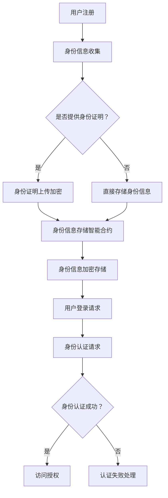
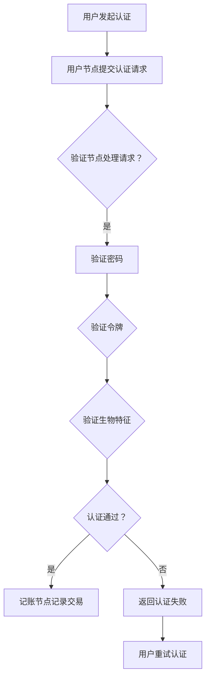

                 

### 引言

区块链技术自2008年由中本聪（Satoshi Nakamoto）首次提出以来，迅速在全球范围内获得了广泛关注。作为一种去中心化的分布式数据库技术，区块链不仅改变了金融领域的支付和交易方式，也在数字身份管理、供应链管理、医疗记录管理等多个领域展现出了巨大的潜力。随着数字经济的发展，人们对于数据安全和个人隐私的关注日益增加，如何实现高效且安全的数字身份认证成为了一个亟待解决的问题。

数字身份认证是指通过验证个人的身份信息，确保只有授权用户才能访问和使用相关服务或资源的一种技术手段。传统的数字身份认证方法主要依赖于中央认证机构，这种集中式系统虽然能够保证认证的可靠性，但同时也存在着较高的风险，如中心点故障、数据泄露等问题。为了解决这些问题，多因素认证机制应运而生，它通过结合多种认证方式（如密码、生物特征、硬件令牌等）来提高认证的安全性。

多因素认证机制是一种强认证方法，它要求用户在登录或访问系统时，需要提供两种或两种以上的认证因素。这种方法有效提高了账户的安全性，因为单一因素被破解的可能性较低。然而，传统的多因素认证机制也存在一些不足，例如用户需要记住多个密码或携带多个认证设备，增加了使用难度和复杂性。

区块链作为一种去中心化的分布式账本技术，具有不可篡改、透明、安全等特点。将区块链技术与数字身份认证相结合，可以构建一个更加安全、高效、透明的数字身份认证系统。本文将探讨区块链在数字身份多因素认证中的应用，包括设计思路、核心算法原理、数学模型和公式、项目实战等多个方面，旨在为读者提供一个全面的技术解析。

### 文章关键词

区块链、数字身份、多因素认证、分布式账本、安全加密、智能合约、共识算法、身份验证、隐私保护、应用案例。

### 摘要

本文旨在探讨区块链在数字身份多因素认证中的应用，首先介绍了区块链、数字身份和多重认证的基本概念，阐述了它们之间的联系。接着，本文详细讲解了基于区块链的数字身份模型和多因素认证算法，包括其设计思路、实现原理和数学模型。通过具体的案例，本文展示了如何在实际项目中应用这些算法和模型，并分析了区块链在数字身份认证中的优势与挑战。本文旨在为研究人员和开发者提供有价值的参考，推动区块链技术在数字身份认证领域的应用和发展。

### 第一部分：区块链与数字身份基础

#### 1.1 区块链概述

**1.1.1 区块链的定义与特点**

区块链是一种去中心化的分布式数据库技术，其核心特点包括不可篡改性、透明性、安全性和去中心化。区块链通过多个节点共同维护一个共享的账本，每个节点都保存一份完整的账本副本。任何一次交易记录都必须经过网络中多个节点的验证和确认，才能被添加到区块链中。这一过程确保了区块链的不可篡改性，即一旦交易记录被写入区块链，便无法被修改或删除。

区块链的去中心化特性意味着它不需要一个中央机构来管理，而是由网络中的所有节点共同维护。这使得区块链在应对中心点故障、数据泄露等风险时具有更高的鲁棒性。此外，区块链的透明性使得每个节点的交易记录都可以被公众查看，从而增强了系统的可信度。

**1.1.2 区块链的基本架构**

区块链的基本架构主要包括以下几个部分：区块、链、节点和挖矿。区块是区块链的基本单位，包含一定数量的交易记录、一个时间戳和一个随机数。每个区块都与前一个区块通过哈希函数连接，形成一个链式结构，这就是区块链。节点是区块链网络中的基本单元，负责存储区块链的数据、验证交易和参与网络中的共识过程。挖矿是区块链网络中产生新区块的过程，矿工通过解决数学难题来验证交易，并竞争获得区块链网络的奖励。

**1.1.3 区块链的技术发展与应用现状**

自区块链技术诞生以来，其应用领域不断扩展。在金融领域，区块链技术已被用于支付系统、证券交易、保险理赔等多个方面，显著提高了交易的效率和安全性能。在非金融领域，区块链技术同样展现出了广泛的应用前景。例如，在供应链管理中，区块链可以用于跟踪产品的生产、运输和销售过程，确保信息的透明性和可追溯性。在医疗领域，区块链可以用于管理患者的健康记录，保障隐私和数据安全。

目前，全球各国政府和金融机构都在积极推动区块链技术的研发和应用。例如，中国人民银行正在研究基于区块链的数字货币，美国、欧盟等地区也在积极探索区块链在政务、司法等领域的应用。此外，众多初创企业和科技公司也纷纷加入区块链技术的研发和应用，为区块链技术的发展注入了新的活力。

#### 1.2 数字身份的概念与重要性

**1.2.1 数字身份的定义**

数字身份是指个体在数字世界中的唯一标识，它通常由一系列电子化的身份信息组成，包括用户名、密码、电子邮件地址、电话号码、身份认证凭证等。与物理世界的身份不同，数字身份是虚拟的，存在于互联网和各种在线服务系统中。

数字身份的建立和管理对于个体在数字世界的活动至关重要。通过数字身份，用户可以安全地访问各种在线服务和资源，如社交媒体、电商平台、在线银行等。此外，数字身份还为个人数据的管理提供了基础，使得用户能够控制自己的个人信息，并防止数据泄露和滥用。

**1.2.2 数字身份在现代社会的作用**

随着互联网和数字技术的快速发展，数字身份在现代社会中的作用越来越重要。首先，数字身份是网络安全的基础。只有通过合法的数字身份认证，用户才能访问受保护的资源和信息。其次，数字身份有助于建立个人信用体系。金融机构、电商平台等机构可以通过数字身份信息了解用户的信用状况，从而提供更加个性化的服务。此外，数字身份还在社会治理、公共服务等方面发挥着重要作用。例如，政府可以通过数字身份认证来提供便捷的政务服务，如在线办理证件、缴纳税费等。

**1.2.3 数字身份面临的挑战**

尽管数字身份在现代社会中具有重要性，但同时也面临着一系列挑战。首先，数字身份的泄露风险较高。随着黑客技术的不断发展，许多用户的数字身份信息（如密码、身份证号等）被非法获取，导致个人隐私泄露和数据滥用。其次，数字身份的统一性较差。不同的在线服务和平台通常采用不同的身份认证方式，用户需要记住多个身份信息和密码，增加了使用难度和复杂性。

此外，数字身份的管理和验证机制也面临挑战。传统的集中式认证系统容易成为攻击目标，一旦中心点被攻破，整个系统的安全性将受到严重威胁。为了提高数字身份的安全性，需要发展更加先进的技术，如多因素认证、区块链等。

#### 1.3 多因素认证机制

**1.3.1 多因素认证的基本原理**

多因素认证（Multi-Factor Authentication，MFA）是一种强认证方法，它要求用户在登录或访问系统时，需要提供两种或两种以上的认证因素。这些因素通常分为以下三类：

1. **知识因素**：这是用户知道的信息，如密码、PIN码、答案等。
2. **拥有因素**：这是用户拥有的实物，如硬件令牌、智能卡、手机等。
3. **生物因素**：这是与用户生物特征相关的信息，如指纹、面部识别、虹膜扫描等。

多因素认证通过结合多种认证因素，有效提高了账户的安全性。因为单一因素被破解的可能性较低，即使一个因素被攻破，攻击者也无法通过其他因素来访问系统。例如，用户可能知道密码，但如果需要同时提供指纹或面部识别，攻击者将很难获得访问权限。

**1.3.2 多因素认证的分类**

根据使用的认证因素不同，多因素认证可以有多种分类方法。以下是几种常见的分类：

1. **二因素认证**：使用两种认证因素，如密码和硬件令牌。
2. **三因素认证**：使用三种认证因素，如密码、硬件令牌和生物特征。
3. **四因素认证**：使用四种认证因素，如密码、硬件令牌、手机验证码和生物特征。

不同的多因素认证方法适用于不同的应用场景。例如，二因素认证通常用于普通用户访问互联网服务，而三因素认证或四因素认证则用于对安全性要求较高的场景，如银行系统、政务服务等。

**1.3.3 多因素认证的优势与局限性**

多因素认证具有显著的优势，主要包括：

1. **提高安全性**：通过结合多种认证因素，多因素认证能够有效防止账户被破解。
2. **降低欺诈风险**：多因素认证可以减少因密码泄露导致的不当交易或欺诈行为。
3. **提高用户体验**：一些多因素认证方法（如手机验证码）使用方便，用户无需记住多个密码或携带多个认证设备。

然而，多因素认证也存在一些局限性，主要包括：

1. **使用复杂性**：多因素认证要求用户在登录时提供多种认证因素，增加了使用难度和复杂性。
2. **成本较高**：一些高级的多因素认证方法（如生物特征识别）需要特殊设备或软件支持，增加了系统的成本。
3. **易受攻击**：虽然多因素认证提高了安全性，但某些情况下仍可能受到社会工程学攻击（如钓鱼攻击）的影响。

#### 1.4 区块链与数字身份、多因素认证的关系

**1.4.1 区块链在数字身份中的应用**

区块链技术为数字身份管理提供了一种新的解决方案。通过将数字身份信息存储在区块链上，可以实现去中心化的身份认证，提高身份信息的可信度和安全性。区块链的不可篡改性和透明性确保了身份信息的真实性和完整性，而多节点分布式存储则提高了系统的鲁棒性和抗攻击能力。

区块链上的数字身份模型可以通过智能合约来实现。智能合约是一段自动执行且不可篡改的代码，它可以根据预先设定的规则自动执行交易和认证过程。例如，用户可以创建一个智能合约来管理自己的数字身份信息，并在登录时自动验证身份。

**1.4.2 区块链在多因素认证中的应用**

区块链技术同样可以应用于多因素认证。通过将多种认证因素存储在区块链上，可以实现更加安全的多因素认证过程。例如，用户可以通过区块链上的智能合约来生成和存储密码、硬件令牌和生物特征信息，并在登录时通过智能合约验证这些因素的有效性。

区块链上的多因素认证具有以下优势：

1. **安全性**：区块链的加密技术确保了认证过程中的信息不会被窃取或篡改。
2. **透明性**：区块链上的交易记录是公开的，用户可以随时查看自己的身份认证过程。
3. **可追溯性**：区块链上的交易记录是永久保存的，可以用于审计和纠纷解决。

**1.4.3 区块链如何提升数字身份和多因素认证的安全性**

区块链技术通过以下几种方式提升了数字身份和多因素认证的安全性：

1. **去中心化**：区块链的去中心化特性避免了中心点故障和数据泄露的风险，提高了系统的鲁棒性。
2. **加密技术**：区块链使用加密技术保护交易和身份信息，确保其不会被非法访问或篡改。
3. **智能合约**：智能合约自动执行认证过程，减少了人为错误和恶意攻击的风险。
4. **共识算法**：区块链的共识算法确保了交易的有效性和安全性，所有节点必须达成一致才能确认交易。

总之，区块链技术为数字身份和多因素认证提供了一种全新的解决方案，通过去中心化、加密技术和智能合约等手段，有效提升了认证的安全性和可信度。随着区块链技术的不断发展和应用，未来数字身份和多因素认证将变得更加安全、便捷和高效。

### 第二部分：区块链在数字身份多因素认证中的应用算法

#### 2.1 基于区块链的数字身份模型

在区块链中实现数字身份模型，需要构建一个既安全又高效的架构。以下是一个基本的设计思路：

**2.1.1 数字身份模型的构建**

1. **用户身份信息**：用户在区块链上注册时，需要提供一系列身份信息，包括用户名、密码、邮箱地址、手机号码等。这些信息将通过加密技术存储在区块链上，确保隐私和安全。

2. **身份认证因素**：用户需要设置多种身份认证因素，如密码、硬件令牌和生物特征。这些认证因素将存储在区块链的智能合约中，并在用户登录时进行验证。

3. **身份证明文件**：用户可以上传和存储电子版的身份证明文件，如身份证、护照等。这些文件将经过加密处理，存储在区块链上，以防止篡改和泄露。

**2.1.2 Mermaid流程图：数字身份模型实现流程**

下面是一个简化的Mermaid流程图，展示数字身份模型的实现流程：



**2.1.3 数字身份模型的安全性与隐私保护**

区块链上的数字身份模型在保证安全性和隐私保护方面具有以下特点：

1. **加密存储**：所有用户身份信息和认证因素都经过加密处理，存储在区块链上，确保不会被非法访问或篡改。

2. **智能合约验证**：身份认证过程通过智能合约自动执行，减少了人为干预和恶意攻击的风险。

3. **去中心化**：区块链的去中心化特性确保了系统的鲁棒性和抗攻击能力，防止中心点故障和数据泄露。

4. **透明性**：区块链上的交易记录是公开的，用户可以随时查看自己的身份信息和管理记录。

5. **隐私保护**：虽然区块链上的信息是公开的，但通过加密技术，用户的敏感信息（如密码、生物特征）只能被授权用户访问，从而保护用户隐私。

#### 2.2 多因素认证算法设计

**2.2.1 多因素认证算法的基本原理**

多因素认证算法的核心思想是通过结合多种认证方式，提高系统的安全性。在区块链上实现多因素认证，需要设计一种既能确保安全性，又能高效运行的算法。以下是一个基本的多因素认证算法设计：

1. **密码认证**：用户输入密码，系统通过智能合约验证密码的正确性。

2. **硬件令牌认证**：用户需要持有硬件令牌，并在登录时输入令牌生成的动态密码。

3. **生物特征认证**：用户通过指纹、面部识别或虹膜扫描等生物特征进行身份验证。

**2.2.2 伪代码：多因素认证算法实现**

以下是一个简化的伪代码，展示多因素认证算法的实现过程：

```plaintext
函数 MultiFactorAuthentication(username, password, token, biometric)
    如果 (!VerifyPassword(username, password))
        返回 "密码错误"
    如果 (!VerifyToken(token))
        返回 "令牌错误"
    如果 (!VerifyBiometric(biometric))
        返回 "生物特征验证失败"
    如果 (所有认证通过)
        返回 "认证成功"
    否则
        返回 "认证失败"
```

**2.2.3 多因素认证算法的性能优化**

为了提高多因素认证算法的性能，可以考虑以下优化措施：

1. **并行处理**：将认证过程分解为多个子任务，并在多个节点上并行处理，以缩短响应时间。

2. **缓存机制**：将常用认证信息（如密码、令牌）缓存起来，减少数据库查询次数。

3. **加密优化**：使用高效加密算法，减少加密和解密所需的时间。

4. **负载均衡**：通过负载均衡技术，合理分配认证请求到不同节点，避免单点过载。

#### 2.3 数学模型与公式

在区块链上的多因素认证算法中，加密技术是确保安全性的关键。以下是一些常用的数学模型和公式：

**2.3.1 数字签名与加密算法**

1. **加密算法**：设$E_k(m)$为加密算法，其中$k$为密钥，$m$为明文，$c$为密文。
    $$ c = E_k(m) $$

2. **解密算法**：设$D_k(c)$为解密算法，其中$k$为密钥，$c$为密文，$m$为明文。
    $$ m = D_k(c) $$

**2.3.2 消息认证码（MAC）**

消息认证码（MAC）是一种用于验证消息完整性和真实性的算法。以下是一个简单的MAC算法：

1. **MAC算法**：设$H_k(m)$为MAC算法，其中$k$为密钥，$m$为明文，$t$为MAC值。
    $$ t = H_k(m) $$

通过这些数学模型和公式，可以在区块链上实现安全的多因素认证算法。

#### 2.4 区块链在多因素认证中的实现

**2.4.1 区块链节点的角色与职责**

在区块链上的多因素认证系统中，不同节点扮演着不同的角色和职责：

1. **用户节点**：用户节点负责发起认证请求，并存储和管理自己的数字身份信息。

2. **验证节点**：验证节点负责验证用户提交的认证因素，如密码、令牌和生物特征。

3. **记账节点**：记账节点负责记录和确认交易，确保区块链的完整性和一致性。

**2.4.2 Mermaid流程图：区块链上的多因素认证流程**

以下是一个简化的Mermaid流程图，展示区块链上的多因素认证流程：



**2.4.3 区块链在多因素认证中的应用案例分析**

以下是一个基于区块链的多因素认证案例：

1. **背景**：某金融公司希望通过区块链技术提高客户账户的安全性，采用多因素认证机制。

2. **实现过程**：
    - 用户注册时，需提供身份证明文件、密码、手机号码等，所有信息加密后存储在区块链上。
    - 用户登录时，需提供密码、短信验证码、面部识别等信息，通过智能合约验证身份。
    - 认证过程完全自动化，减少了人为错误和恶意攻击的风险。

3. **效果**：通过区块链上的多因素认证，客户账户的安全性得到了显著提高，同时用户体验也得到了优化。

4. **小结**：区块链技术为多因素认证提供了一种高效、安全的解决方案，有助于提升数字身份认证的安全性和可信度。

#### 总结与未来展望

区块链在数字身份多因素认证中的应用展示了其强大的潜力和优势。通过去中心化的架构、加密技术和智能合约，区块链可以有效提高认证的安全性和可信度，同时简化认证流程，提升用户体验。然而，区块链技术也面临一些挑战，如交易性能、隐私保护、法律法规等方面。未来，随着技术的不断发展和完善，区块链在数字身份认证领域的应用前景将更加广阔。

**最佳实践 Tips**：

1. **确保身份信息加密存储**：使用强大的加密算法确保用户身份信息的保密性。
2. **多因素认证结合使用**：根据实际需求，结合多种认证因素，提高系统安全性。
3. **定期审计与更新**：定期审计和更新区块链上的认证信息，确保系统的安全性和可靠性。

**注意事项**：

1. **保护用户隐私**：在实现数字身份认证时，需特别关注用户隐私保护，避免敏感信息泄露。
2. **防范恶意攻击**：加强网络安全防护，防范各种恶意攻击，确保系统安全运行。

**拓展阅读**：

1. 《区块链技术指南》
2. 《智能合约设计与开发》
3. 《区块链在数字身份认证中的应用研究》

通过本文的详细分析和案例展示，读者可以更好地理解区块链在数字身份多因素认证中的应用，为其在实际项目中的应用提供有益的参考。

### 作者信息

作者：AI天才研究院/AI Genius Institute & 禅与计算机程序设计艺术 /Zen And The Art of Computer Programming

### 附录

#### 附录A：相关工具与资源

1. **区块链开发工具**：
    - Ethereum开发工具：Web3.js、Truffle、Ganache
    - Hyperledger Fabric开发工具：Fabric SDK、Composer

2. **加密算法库**：
    - OpenSSL：提供广泛的加密算法支持
    - PyCrypto：Python加密库，支持多种加密算法
    - Cryptography：Python加密库，提供高级加密功能

3. **开源数字身份项目介绍**：
    - uPort：基于区块链的数字身份平台
    - Blockstack：基于区块链的域名系统和身份认证系统
    - Sovrin：去中心化的身份验证和数字资产平台

#### 附录B：参考文献

1. Nakamoto, S. (2008). Bitcoin: A peer-to-peer electronic cash system.
2. Microsoft. (2018). Multi-Factor Authentication Design.
3. IBM. (2019). Blockchain Basics.
4. Ethereum Foundation. (2020). Ethereum Development Tools.
5. Hyperledger Project. (2021). Hyperledger Fabric Developer Guide.

