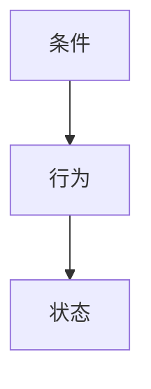

                 

### 文章标题

# 区块链在数字身份管理中的应用

### 关键词

- 区块链
- 数字身份管理
- 智能合约
- 数字签名
- 零知识证明
- 加密算法

### 摘要

本文将探讨区块链在数字身份管理中的应用。随着数字化的加速发展，数字身份管理变得越来越重要。传统的数字身份管理方式存在诸多问题，而区块链技术的引入为数字身份管理带来了新的机遇。本文首先介绍了区块链的基本概念和特点，然后详细分析了区块链与数字身份管理的联系，探讨了智能合约、数字签名和零知识证明在数字身份管理中的应用，最后通过一个实际项目案例展示了区块链在数字身份管理中的具体实现。希望通过本文，读者能对区块链在数字身份管理中的应用有一个全面而深入的了解。

## 第1章 区块链与数字身份管理概述

### 1.1 区块链基础

区块链是一种分布式数据库技术，其特点包括去中心化、不可篡改、透明性等。区块链通过将数据分散存储在多个节点上，使得数据在多个地方备份，从而提高了系统的安全性和可靠性。区块链的架构包括区块链本身、共识机制、网络协议等组成部分。

#### 1.1.1 区块链的概念与特点

区块链是一种由多个区块按时间顺序链接而成的数据结构。每个区块包含一定数量的交易记录，并通过密码学技术保证数据的完整性和安全性。区块链的特点包括：

- **去中心化**：区块链不需要中心化的管理机构，而是通过多个节点共同维护。
- **不可篡改**：一旦数据被记录在区块链上，就难以篡改，从而保证了数据的真实性和可靠性。
- **透明性**：区块链上的数据对所有节点都是透明的，提高了系统的透明度和可追溯性。

#### 1.1.2 区块链的架构与技术原理

区块链的架构包括数据层、网络层、共识层、激励层和应用层。数据层主要解决数据的存储和传输问题；网络层主要解决节点间的通信问题；共识层主要解决数据一致性问题；激励层主要解决节点激励问题；应用层主要解决实际业务问题。

区块链的技术原理主要包括：

- **分布式账本**：区块链通过分布式账本技术，将数据分散存储在多个节点上，从而保证了数据的安全性和可靠性。
- **共识机制**：共识机制是区块链的核心技术之一，它保证了多个节点之间的数据一致性。常见的共识机制包括工作量证明（PoW）、权益证明（PoS）等。
- **加密算法**：区块链使用加密算法来保证数据的安全性和隐私性，包括哈希算法、数字签名、零知识证明等。

#### 1.1.3 区块链的发展历程与未来趋势

区块链的概念最早由中本聪（Satoshi Nakamoto）在2008年提出，并在2009年发布了比特币（Bitcoin）白皮书。比特币作为第一个区块链应用，引起了全球关注。随后，越来越多的区块链项目涌现，如以太坊（Ethereum）、EOS、Hyperledger 等。

区块链的发展历程可以分为三个阶段：

- **1.0阶段**：以比特币为代表，主要关注货币交易。
- **2.0阶段**：以太坊的出现标志着区块链2.0时代的到来，主要关注智能合约和去中心化应用。
- **3.0阶段**：未来的区块链将不仅仅局限于金融领域，还将应用于更多行业，如供应链管理、医疗保健、数字身份管理等。

区块链的未来趋势包括：

- **扩展性和性能提升**：随着区块链应用的普及，如何提升区块链的扩展性和性能成为一个重要问题。一些项目如闪电网络（Lightning Network）和Plasma试图解决这一问题。
- **跨链技术**：跨链技术将不同区块链之间的数据进行整合，从而实现区块链的互联互通。
- **去中心化自治组织（DAO）**：DAO是一种去中心化的组织形式，通过智能合约实现自我管理和决策。

### 1.2 数字身份管理基础

数字身份管理是一种管理数字身份的方式，它涉及用户身份的认证、授权和隐私保护。随着互联网的普及，数字身份管理变得越来越重要。数字身份管理不仅涉及到个人的身份信息，还涉及到企业、政府等组织的身份信息。

#### 1.2.1 数字身份的定义与类型

数字身份是指在网络环境中，个体或组织所拥有的唯一标识。根据身份信息的来源和属性，数字身份可以分为以下几种类型：

- **个人数字身份**：指个人的唯一标识，如电子邮件地址、手机号码、社交媒体账号等。
- **企业数字身份**：指企业的唯一标识，如公司域名、商标、电子邮箱等。
- **政府数字身份**：指政府的唯一标识，如政府网站、电子政务系统等。

#### 1.2.2 数字身份管理的重要性

数字身份管理的重要性体现在以下几个方面：

- **安全性**：数字身份管理能够保证用户身份的合法性和安全性，防止身份盗用和欺诈。
- **便捷性**：通过数字身份管理，用户可以方便地进行在线交易和活动，无需重复填写身份信息。
- **隐私保护**：数字身份管理能够保护用户的隐私信息，防止隐私泄露。
- **信任建立**：数字身份管理有助于建立在线信任，促进电子商务和数字社会的健康发展。

#### 1.2.3 数字身份管理与传统身份管理的关系

传统身份管理通常依赖于中心化的身份验证机构，如政府、银行等。而数字身份管理则更加强调去中心化和自主权。传统身份管理与数字身份管理的关系可以概括为：

- **继承与革新**：数字身份管理继承了传统身份管理的部分理念，如身份认证、授权等，但在技术上进行了革新，更加注重安全性和便捷性。
- **互补与融合**：数字身份管理与传统身份管理可以相互补充，共同构建一个更加完善和安全的身份管理体系。

#### 1.2.4 数字身份管理面临的挑战与机遇

数字身份管理面临着以下挑战：

- **技术挑战**：如何设计出既安全又便捷的数字身份管理方案是一个技术难题。
- **法律挑战**：数字身份管理涉及到法律和隐私问题，需要制定相应的法律法规来规范。
- **用户接受度**：用户对数字身份管理的接受度和信任度是一个关键问题。

然而，数字身份管理也面临着巨大的机遇：

- **数字经济发展**：随着数字经济的发展，数字身份管理将发挥越来越重要的作用。
- **社会信息化**：社会信息化进程加速，数字身份管理将更加普及。
- **技术创新**：区块链、人工智能等技术的创新为数字身份管理提供了新的思路和解决方案。

### 1.3 区块链与数字身份管理的联系

区块链技术在数字身份管理中的应用具有以下几个方面的优势：

- **安全性**：区块链的加密算法和分布式存储技术可以提高数字身份的安全性。
- **隐私保护**：区块链的零知识证明等技术可以保护用户的隐私信息。
- **便捷性**：区块链的智能合约可以实现自动化的身份认证和授权，提高用户体验。
- **透明性**：区块链的公开透明特性可以增强数字身份管理的可信度。

然而，区块链在数字身份管理中也面临一些挑战：

- **性能问题**：区块链的处理能力有限，可能无法满足大规模数字身份管理的需求。
- **技术成熟度**：区块链技术尚处于发展阶段，其成熟度和稳定性有待提高。
- **用户习惯**：用户对区块链技术的接受度和信任度有待提高。

### 1.4 本章小结

本章介绍了区块链和数字身份管理的基本概念、技术和应用。通过本章的学习，读者可以了解到区块链技术在数字身份管理中的优势和挑战。在接下来的章节中，我们将进一步探讨区块链与数字身份管理之间的联系，以及如何利用区块链技术解决数字身份管理中的问题。

## 第2章 区块链与数字身份管理技术原理

### 2.1 智能合约技术

智能合约是一种自动执行合约条款的计算机程序，它基于区块链技术运行，具有去中心化、透明性和不可篡改的特点。智能合约在数字身份管理中扮演着重要角色，可以实现自动化身份验证、授权和交易等功能。

#### 2.1.1 智能合约的基本概念

智能合约是由区块链上的用户编写的计算机程序，它存储在区块链上，并在满足特定条件时自动执行。智能合约的基本概念包括：

- **条件**：智能合约执行的前提条件，如交易金额、用户身份等。
- **行为**：满足条件时，智能合约执行的操作，如转账、发放证书等。
- **状态**：智能合约执行后，区块链上的数据状态。

智能合约的基本结构可以表示为：



#### 2.1.2 智能合约的工作原理

智能合约的工作原理可以分为以下几个步骤：

1. **编写合约**：开发人员使用智能合约编程语言（如Solidity）编写智能合约代码。
2. **部署合约**：将编写的智能合约上传到区块链上，并支付一定的费用进行部署。
3. **调用合约**：用户通过区块链网络调用智能合约，触发合约执行。
4. **执行合约**：智能合约根据用户输入的条件执行相应的操作，并将结果记录在区块链上。
5. **合约验证**：区块链网络中的节点对智能合约的执行结果进行验证，确保其符合预期。

#### 2.1.3 智能合约的实现与部署

智能合约的实现和部署过程如下：

1. **编写智能合约**：使用智能合约编程语言编写智能合约代码，例如使用Solidity语言编写以下简单的智能合约：

    ```solidity
    // SPDX-License-Identifier: MIT
    pragma solidity ^0.8.0;

    contract SimpleIdentity {
        mapping(address => string) public identities;

        function registerIdentity(string memory identity) public {
            identities[msg.sender] = identity;
        }
    }
    ```

    该智能合约允许用户注册身份信息。

2. **编译智能合约**：使用智能合约编译器（如Truffle）将Solidity代码编译为以太坊虚拟机（EVM）可执行的字节码。

3. **部署智能合约**：将编译后的字节码上传到以太坊区块链上，并支付相应的部署费用。可以使用MetaMask等钱包工具进行部署。

4. **调用智能合约**：用户可以通过与智能合约交互的客户端（如Web3.js、Ethers.js等）调用智能合约的函数，如注册身份信息。

#### 2.1.4 智能合约的安全性问题

智能合约的安全性问题一直是区块链领域的重要话题。智能合约的常见安全问题包括：

- **逻辑漏洞**：智能合约代码中的逻辑错误可能导致恶意攻击。
- **重入攻击**：恶意攻击者通过多次调用智能合约的函数，导致合约状态被篡改。
- **整数溢出**：智能合约中的整数运算错误可能导致安全漏洞。
- **前端攻击**：通过恶意前端代码攻击智能合约，获取用户信息或篡改数据。

为了提高智能合约的安全性，可以采取以下措施：

- **代码审计**：对智能合约代码进行安全审计，发现并修复潜在的安全漏洞。
- **形式化验证**：使用形式化验证方法验证智能合约的正确性。
- **使用安全库**：使用经过验证的第三方安全库，降低安全风险。
- **防范攻击**：在智能合约中添加防范攻击的措施，如延迟执行、多重签名等。

### 2.2 数字身份验证算法

数字身份验证算法是一种用于验证用户身份的技术，它通过加密算法和数学模型确保身份信息的真实性。数字身份验证算法在数字身份管理中起着至关重要的作用，可以实现自动化、高效和安全的身份验证。

#### 2.2.1 公钥加密算法

公钥加密算法是一种非对称加密算法，它使用一对密钥（公钥和私钥）进行加密和解密。公钥加密算法的核心思想是：

- **加密**：使用公钥加密消息，只有对应的私钥可以解密。
- **解密**：使用私钥解密加密后的消息，只有对应的公钥可以加密。

常见的公钥加密算法包括RSA和椭圆曲线加密算法（ECC）。

**RSA加密算法**

RSA加密算法是一种基于大数分解的非对称加密算法。它的加密和解密过程如下：

- **加密过程**：

    ```math
    E_{(n, e)}(m) = m^e \mod n
    ```

    其中，\(n = p \times q\) 是公钥，\(e\) 是加密指数，\(m\) 是明文，\(c\) 是密文。

- **解密过程**：

    ```math
    D_{(n, d)}(c) = c^d \mod n
    ```

    其中，\(d\) 是解密指数，只有私钥持有者知道。

**ECC加密算法**

ECC加密算法是一种基于椭圆曲线数学的非对称加密算法。它的优点是加密强度高，但密钥长度较短。ECC的加密和解密过程如下：

- **加密过程**：

    ```math
    E_K(M) = P + kG
    ```

    其中，\(P\) 是椭圆曲线上的点，\(G\) 是基点，\(k\) 是随机数，\(K\) 是公钥，\(M\) 是明文。

- **解密过程**：

    ```math
    D_K(C) = P + k^{-1}G
    ```

    其中，\(C\) 是密文。

#### 2.2.2 私钥加密算法

私钥加密算法是一种对称加密算法，它使用同一个密钥进行加密和解密。常见的私钥加密算法包括对称加密算法（如AES）和哈希算法（如SHA-256）。

**对称加密算法**

对称加密算法的核心思想是：

- **加密**：使用密钥对明文进行加密，只有相同密钥可以解密。
- **解密**：使用密钥对密文进行解密，只有相同密钥可以加密。

常见的对称加密算法包括AES、DES和RSA。

**AES加密算法**

AES加密算法是一种基于分块加密的算法，它将明文分成多个块，并对每个块进行加密。AES的加密和解密过程如下：

- **加密过程**：

    ```mermaid
    graph TD
        A[Input Block] --> B[Add Round Key]
        B --> C[SubBytes]
        C --> D[ShiftRows]
        D --> E[MixColumns]
        E --> F[Add Round Key]
        F --> G[Final Round Key]
        G --> H[Encrypted Block]
    ```

- **解密过程**：

    ```mermaid
    graph TD
        I[Input Block] --> J[Add Round Key]
        J --> K[Inv SubBytes]
        K --> L[Inv ShiftRows]
        L --> M[Inv MixColumns]
        M --> N[Add Round Key]
        N --> O[Final Round Key]
        O --> P[Decrypted Block]
    ```

**哈希算法**

哈希算法是一种将任意长度的数据映射为固定长度的字符串的算法。常见的哈希算法包括MD5、SHA-1和SHA-256。

**SHA-256加密算法**

SHA-256加密算法是一种基于MD5的加密算法，它的输出为256位二进制字符串。SHA-256的加密过程如下：

1. **预处理**：将输入数据填充至512位的长度，并将原始长度添加到数据的末尾。
2. **初始化**：初始化哈希值H。
3. **处理数据块**：对每个数据块进行加密，更新哈希值H。
4. **输出**：将最终的哈希值输出。

#### 2.2.3 零知识证明算法

零知识证明（Zero-Knowledge Proof，简称ZKP）是一种密码学技术，它允许一方（证明者）向另一方（验证者）证明某个陈述为真，而不泄露任何有关该陈述的信息。零知识证明在数字身份管理中具有广泛的应用，可以实现隐私保护和数据安全。

零知识证明的基本原理如下：

- **证明**：证明者向验证者展示一个证明，证明某个陈述为真。
- **验证**：验证者检查证明的有效性，确认陈述为真。
- **隐私保护**：证明过程中不泄露任何关于陈述的信息。

常见的零知识证明算法包括BB84、 zk-SNARKs和zk-STARKs。

**BB84零知识证明算法**

BB84零知识证明算法是一种基于量子物理的零知识证明算法，它利用量子态的不可克隆性进行证明。BB84零知识证明算法的证明过程如下：

1. **初始化**：证明者和验证者共同生成一组量子态。
2. **量子态传输**：证明者将量子态发送给验证者。
3. **测量与反馈**：验证者对量子态进行测量，并将测量结果反馈给证明者。
4. **证明验证**：证明者根据验证者的反馈生成证明，验证者验证证明的有效性。

**zk-SNARKs零知识证明算法**

zk-SNARKs（零知识简洁非交互性知识证明）是一种基于椭圆曲线加密的零知识证明算法。zk-SNARKs的证明过程如下：

1. **初始化**：证明者和验证者共同生成一组公私钥。
2. **证明生成**：证明者使用公私钥生成证明。
3. **证明验证**：验证者使用公钥验证证明的有效性。
4. **隐私保护**：证明过程中不泄露任何关于公私钥的信息。

**zk-STARKs零知识证明算法**

zk-STARKs（零知识简洁可证明性验证）是一种基于确定性算法的零知识证明算法。zk-STARKs的证明过程如下：

1. **初始化**：证明者和验证者共同生成一组参数。
2. **证明生成**：证明者使用参数生成证明。
3. **证明验证**：验证者使用参数验证证明的有效性。
4. **隐私保护**：证明过程中不泄露任何关于参数的信息。

### 2.3 区块链上的身份验证协议

区块链上的身份验证协议是一种利用区块链技术实现身份验证的机制。常见的身份验证协议包括KYC协议、自主权协议和透明性协议。

#### 2.3.1 KYC协议

KYC（Know Your Customer，了解你的客户）协议是一种用于验证用户身份的协议。KYC协议通常包括以下步骤：

1. **用户注册**：用户在区块链平台上注册账户。
2. **身份验证**：用户上传身份证明文件，如身份证、护照等，并经过区块链节点验证。
3. **认证结果记录**：验证结果记录在区块链上，确保数据的真实性和不可篡改性。
4. **身份信息管理**：用户可以管理自己的身份信息，如更新、删除等。

KYC协议的优势在于：

- **安全性**：区块链的加密算法和分布式存储技术提高了用户身份信息的安全性。
- **可信性**：区块链的公开透明特性增强了用户身份信息的可信度。
- **高效性**：自动化身份验证流程提高了用户体验。

#### 2.3.2 自主权协议

自主权协议是一种用于保护用户隐私的协议。自主权协议的核心思想是：

- **隐私保护**：用户可以自主决定是否公开自己的身份信息，并控制信息的访问权限。
- **匿名性**：用户可以在不暴露真实身份的情况下进行交易和活动。

常见的自主权协议包括零知识证明、匿名币等。

**零知识证明自主权协议**

零知识证明自主权协议利用零知识证明技术实现隐私保护。零知识证明自主权协议的基本流程如下：

1. **用户注册**：用户在区块链平台上注册账户，并使用零知识证明技术生成匿名身份。
2. **身份验证**：用户通过零知识证明向验证者证明自己的身份，而不泄露任何关于身份的信息。
3. **交易和活动**：用户在区块链上进行交易和活动，使用匿名身份进行操作。
4. **隐私保护**：零知识证明技术确保用户的隐私信息不被泄露。

#### 2.3.3 透明性协议

透明性协议是一种用于提高区块链系统透明度的协议。透明性协议的核心思想是：

- **信息公开**：区块链上的所有交易和信息都是公开透明的，用户可以随时查询和验证。
- **透明度提高**：透明性协议提高了区块链系统的可信度和透明度。

常见的透明性协议包括区块链浏览器、区块链节点审计等。

**区块链浏览器**

区块链浏览器是一种用于查询区块链上交易和信息的应用程序。区块链浏览器的基本功能包括：

- **交易查询**：用户可以查询区块链上的所有交易，了解交易详细信息。
- **区块查询**：用户可以查询区块链上的所有区块，了解区块的详细信息。
- **地址查询**：用户可以查询区块链上的地址，了解地址的交易记录和余额。

**区块链节点审计**

区块链节点审计是一种用于审计区块链节点行为的机制。区块链节点审计的基本流程如下：

1. **节点注册**：区块链节点在区块链上进行注册，并记录节点信息。
2. **节点监控**：区块链系统监控节点行为，包括交易处理、数据存储等。
3. **审计报告**：审计机构对区块链节点进行审计，生成审计报告。
4. **审计结果公示**：审计结果在区块链上进行公示，用户可以随时查询。

### 2.4 本章小结

本章详细介绍了区块链与数字身份管理的技术原理，包括智能合约、数字身份验证算法和零知识证明等。通过本章的学习，读者可以了解到区块链技术在数字身份管理中的应用场景和优势。在接下来的章节中，我们将通过实际项目案例展示区块链在数字身份管理中的具体实现。

## 第3章 数学模型与数学公式

### 3.1 加密算法数学模型

加密算法是保障数字身份管理安全性的核心技术之一，其数学模型主要包括公钥加密算法和私钥加密算法。在本节中，我们将重点介绍椭圆曲线加密算法（ECC）的数学模型。

#### 3.1.1 椭圆曲线加密算法（ECC）

椭圆曲线加密算法是一种基于椭圆曲线数学理论的公钥加密算法，以其高效性和安全性被广泛应用于数字身份管理中。ECC的数学模型主要包括以下几个部分：

1. **椭圆曲线**：

   椭圆曲线是一个二元多项式方程，通常表示为：

   ```math
   y^2 = x^3 + ax + b
   ```

   其中，\(a\) 和 \(b\) 是系数，\(x\) 和 \(y\) 是椭圆曲线上的点。

2. **基点**：

   基点是椭圆曲线上的一个特殊点，通常表示为 \(G\)。基点的选择会影响椭圆曲线的加密性能和安全性。

3. **密钥生成**：

   ECC的密钥生成过程包括以下几个步骤：

   - **选择椭圆曲线和基点**：选择一个合适的椭圆曲线和基点 \(G\)。
   - **生成私钥**：随机选择一个整数 \(k\)，计算 \(P = kG\)，其中 \(P\) 是私钥。
   - **生成公钥**：将私钥 \(P\) 发送给验证者，验证者可以使用公钥验证用户的身份。

#### 3.1.2 ECC的数学原理

ECC的数学原理主要基于椭圆曲线上的点乘运算。点乘运算的定义如下：

```math
P = kG
```

其中，\(P\) 是结果点，\(k\) 是整数，\(G\) 是基点。

ECC的加密和解密过程如下：

1. **加密过程**：

   - **选择随机数 \(r\)**：随机选择一个整数 \(r\)。
   - **计算加密结果 \(C\)**：

     ```math
     C = (x_1, y_1)
     ```

     其中，\(C\) 是加密结果，\(x_1\) 和 \(y_1\) 是椭圆曲线上的点，计算公式为：

     ```math
     (x_1, y_1) = (r^2 \cdot G_x, r^3 \cdot G_y)
     ```

   - **输出加密结果**：将加密结果 \(C\) 发送给接收者。

2. **解密过程**：

   - **接收加密结果 \(C\)**：接收者接收加密结果 \(C\)。
   - **计算解密结果 \(M\)**：

     ```math
     M = (x_2, y_2)
     ```

     其中，\(M\) 是解密结果，\(x_2\) 和 \(y_2\) 是椭圆曲线上的点，计算公式为：

     ```math
     (x_2, y_2) = (r^{-1} \cdot C_x, r^{-1} \cdot C_y)
     ```

   - **输出解密结果**：将解密结果 \(M\) 输出。

#### 3.1.3 ECC的应用

ECC在数字身份管理中的应用主要包括以下几个方面：

1. **数字签名**：

   ECC可以用于数字签名，其签名过程如下：

   - **签名过程**：

     ```math
     (r, s) = Sign(m)
     ```

     其中，\(m\) 是待签名的消息，\(r\) 和 \(s\) 是签名结果。

     ```math
     r = (k_1 + d \cdot h) \mod n
     s = (k_2 + e \cdot d) \mod n
     ```

     其中，\(k_1\) 和 \(k_2\) 是随机数，\(d\) 是私钥，\(h\) 是消息的哈希值。

   - **验证过程**：

     ```math
     v_1 = (m \cdot r^{-1}) \mod n
     v_2 = (s \cdot d^{-1}) \mod n
     ```

     ```math
     if (v_1 \cdot G + v_2 \cdot H) \mod n == \mathbf{Point}(0)
     then \mathbf{true}
     else \mathbf{false}
     ```

2. **加密通信**：

   ECC可以用于加密通信，其加密过程如下：

   - **加密过程**：

     ```math
     C = (x_1, y_1)
     ```

     其中，\(C\) 是加密结果，\(x_1\) 和 \(y_1\) 是椭圆曲线上的点，计算公式为：

     ```math
     (x_1, y_1) = (r^2 \cdot P_x, r^3 \cdot P_y)
     ```

   - **解密过程**：

     ```math
     M = (x_2, y_2)
     ```

     其中，\(M\) 是解密结果，\(x_2\) 和 \(y_2\) 是椭圆曲线上的点，计算公式为：

     ```math
     (x_2, y_2) = (r^{-1} \cdot C_x, r^{-1} \cdot C_y)
     ```

### 3.2 数字签名数学模型

数字签名是一种用于验证消息真实性和完整性的技术，其数学模型主要包括RSA签名算法和椭圆曲线数字签名算法（ECDSA）。

#### 3.2.1 RSA签名算法

RSA签名算法是一种基于大数分解的非对称加密算法，其数学模型如下：

1. **密钥生成**：

   - **选择两个大素数 \(p\) 和 \(q\)**。
   - **计算 \(n = p \times q\)**。
   - **计算 \(φ(n) = (p - 1) \times (q - 1)\)**。
   - **选择一个整数 \(e\), 满足 \(1 < e < φ(n)\) 且 \(e\) 与 \(φ(n)\) 互质**。
   - **计算 \(d\), 满足 \(d \cdot e \mod φ(n) = 1\)**。
   - **公钥 \( (n, e) \)，私钥 \( (n, d) \)**。

2. **签名过程**：

   - **计算消息的哈希值 \(h(m)\)**。
   - **计算签名 \(r\)**：

     ```math
     r = (h(m))^e \mod n
     ```

   - **计算签名 \(s\)**：

     ```math
     s = (r + d \cdot k) \mod φ(n)
     ```

     其中，\(k\) 是随机数。

3. **验证过程**：

   - **计算 \(r'\)**：

     ```math
     r' = (h(m))^e \mod n
     ```

   - **计算 \(s'\)**：

     ```math
     s' = (r' + d \cdot k') \mod φ(n)
     ```

   - **验证 \(r = r'\) 且 \(s = s'\)**。

#### 3.2.2 椭圆曲线数字签名算法（ECDSA）

ECDSA是一种基于椭圆曲线加密的数字签名算法，其数学模型如下：

1. **密钥生成**：

   - **选择椭圆曲线 \(E\) 和基点 \(G\)**。
   - **选择一个整数 \(k\), 满足 \(1 < k < n\)**。
   - **计算 \(r = k \cdot G_x \mod n\)**。
   - **计算 \(s = (k^{-1} \cdot (h(m) + r \cdot d)) \mod n\)**。

2. **签名过程**：

   - **计算消息的哈希值 \(h(m)\)**。
   - **计算签名 \(r\)** 和 \(s\)**。

3. **验证过程**：

   - **计算 \(r'\)** 和 \(s'\)**。

   - **验证 \(r = r'\) 且 \(s = s'\)**。

### 3.3 零知识证明数学模型

零知识证明（ZKP）是一种密码学技术，它允许一方证明某个陈述为真，而不泄露任何关于该陈述的信息。ZKP的数学模型主要包括零知识证明协议和零知识证明算法。

#### 3.3.1 零知识证明的基本概念

零知识证明的核心概念包括证明者和验证者：

- **证明者**：证明某个陈述为真，但不泄露任何关于该陈述的信息。
- **验证者**：验证证明者陈述的真实性，但不泄露任何关于证明的信息。

零知识证明协议的基本步骤如下：

1. **初始化**：证明者和验证者共同生成一组参数。
2. **证明生成**：证明者生成证明。
3. **证明验证**：验证者验证证明。
4. **隐私保护**：证明过程中不泄露任何关于证明的信息。

#### 3.3.2 零知识证明的数学原理

零知识证明的数学原理主要基于数学模型和密码学技术：

- **数学模型**：零知识证明的数学模型包括逻辑电路模型、知识抽象模型等。
- **密码学技术**：零知识证明的密码学技术包括加密算法、哈希算法、签名算法等。

常见的零知识证明协议包括零知识证明密码系统（ZK-SNARKs）和零知识证明简洁证明系统（ZK-STARKs）。

**零知识证明密码系统（ZK-SNARKs）**

ZK-SNARKs是一种基于椭圆曲线加密和门限签名技术的零知识证明系统，其基本步骤如下：

1. **参数生成**：证明者和验证者共同生成一组参数。
2. **证明生成**：证明者生成证明。
3. **证明验证**：验证者验证证明。

**零知识证明简洁证明系统（ZK-STARKs）**

ZK-STARKs是一种基于确定性算法和哈希函数的零知识证明系统，其基本步骤如下：

1. **参数生成**：证明者和验证者共同生成一组参数。
2. **证明生成**：证明者生成证明。
3. **证明验证**：验证者验证证明。

### 3.4 区块链中的数学模型

区块链中的数学模型主要包括共识机制和数据结构：

#### 3.4.1 共识机制

共识机制是区块链系统的核心组成部分，其数学模型包括工作量证明（PoW）、权益证明（PoS）等。

- **工作量证明（PoW）**：PoW是一种通过解决数学难题来证明工作量的机制。其数学模型如下：

  ```math
  hash(P) \leq n
  ```

  其中，\(P\) 是区块的头部信息，\(n\) 是难度目标。

- **权益证明（PoS）**：PoS是一种根据权益比例决定记账权的机制。其数学模型如下：

  ```math
  chance = (balance \times stake) / total_balance
  ```

  其中，\(balance\) 是权益余额，\(stake\) 是权益抵押比例，\(total\_balance\) 是总权益余额。

#### 3.4.2 数据结构

区块链的数据结构主要包括区块链、区块、交易等：

- **区块链**：区块链是一种链式数据结构，其节点存储在多个区块中。
- **区块**：区块是区块链的基本单元，包括区块头部、区块体等部分。
- **交易**：交易是区块链中的数据单元，包括交易输入、交易输出等。

### 3.5 本章小结

本章介绍了区块链与数字身份管理相关的数学模型和数学公式，包括加密算法、数字签名和零知识证明等。通过本章的学习，读者可以了解区块链技术在数字身份管理中的应用原理和实现方法。在接下来的章节中，我们将通过实际项目案例展示区块链在数字身份管理中的具体应用。

## 第4章 数字身份管理项目实战

### 4.1 项目背景与需求分析

随着数字化时代的到来，数字身份管理逐渐成为各类互联网应用的重要需求。传统的数字身份管理方式依赖于中心化的身份验证机构，存在数据泄露、隐私不安全等问题。区块链技术的引入为数字身份管理提供了新的解决方案。本项目的目标是设计并实现一个基于区块链的数字身份管理系统，解决传统身份管理中的痛点，提高数据安全性和隐私保护水平。

#### 4.1.1 项目背景

数字身份管理在金融、医疗、教育等领域具有广泛的应用。然而，现有的数字身份管理系统存在以下问题：

- **数据泄露**：中心化的身份管理方式容易导致用户数据泄露，给用户隐私带来安全隐患。
- **隐私不安全**：传统身份管理系统中的用户隐私信息容易被第三方访问和利用。
- **信任缺失**：中心化的身份验证机构存在信任问题，用户对身份验证过程的可信度较低。

区块链技术的引入为解决这些问题提供了新的思路。区块链的分布式存储、加密算法和不可篡改性等特点，使得数字身份管理更加安全、可靠和透明。

#### 4.1.2 项目需求

本项目的需求主要包括以下几个方面：

1. **安全性**：确保用户身份信息的安全存储和传输，防止数据泄露和篡改。
2. **隐私保护**：实现用户隐私信息的有效保护，防止隐私泄露和滥用。
3. **便捷性**：简化用户身份验证流程，提高用户体验。
4. **可扩展性**：支持多种身份验证方式，满足不同场景的需求。
5. **互操作性**：实现不同区块链平台之间的数字身份信息共享和互认。

### 4.2 数字身份管理系统设计

数字身份管理系统设计包括系统架构设计、数据库设计、系统功能模块设计等方面。以下是一个基于区块链的数字身份管理系统的设计。

#### 4.2.1 系统架构设计

数字身份管理系统的架构设计包括以下层次：

1. **基础设施层**：包括区块链平台、身份认证服务器、用户终端等硬件和软件设施。
2. **网络通信层**：负责系统内部和外部的数据传输和通信，采用安全的网络协议，如TLS。
3. **核心业务层**：包括用户身份注册、身份认证、权限管理、隐私保护等功能。
4. **数据存储层**：采用分布式存储技术，确保数据的安全性和可靠性。
5. **用户接口层**：提供用户操作界面，包括注册、登录、身份验证、权限申请等。

#### 4.2.2 数据库设计

数字身份管理系统的数据库设计主要包括以下几个方面：

1. **用户信息表**：存储用户的基本信息，如用户名、密码、邮箱等。
2. **身份证明表**：存储用户的身份证明信息，如身份证、护照等。
3. **权限表**：存储用户在不同系统或应用中的权限信息。
4. **交易记录表**：存储用户在区块链上的交易记录。
5. **日志表**：存储系统运行日志，用于监控和审计。

#### 4.2.3 系统功能模块设计

数字身份管理系统的主要功能模块包括：

1. **用户注册模块**：用户在系统中注册账户，填写基本信息，上传身份证明。
2. **身份认证模块**：用户进行身份认证，包括密码验证、邮箱验证等。
3. **权限管理模块**：管理员分配用户在不同系统或应用中的权限。
4. **隐私保护模块**：实现用户隐私信息的加密存储和访问控制。
5. **交易管理模块**：处理用户在区块链上的交易记录，包括身份认证、权限变更等。
6. **监控审计模块**：监控系统运行状态，记录系统日志，支持审计和追溯。

### 4.3 数字身份管理系统实现

数字身份管理系统的实现包括开发环境搭建、核心代码实现、智能合约部署等方面。以下是一个基于以太坊区块链的数字身份管理系统的实现步骤：

#### 4.3.1 开发环境搭建

搭建数字身份管理系统的开发环境，包括以下步骤：

1. **安装Node.js和npm**：Node.js是JavaScript的运行环境，npm是Node.js的包管理器。
2. **安装Truffle框架**：Truffle是一个以太坊开发框架，用于编译、部署和测试智能合约。
3. **安装Ganache**：Ganache是一个本地以太坊区块链节点，用于测试智能合约。
4. **创建项目目录**：在项目中创建一个目录，并在目录下创建一个package.json文件。

#### 4.3.2 核心代码实现

核心代码实现包括智能合约和前端应用程序。以下是一个简单的智能合约示例：

```solidity
// SPDX-License-Identifier: MIT
pragma solidity ^0.8.0;

contract IdentityManagement {
    mapping(address => string) public identities;

    function registerIdentity(string memory identity) public {
        identities[msg.sender] = identity;
    }

    function getIdentity(address user) public view returns (string memory) {
        return identities[user];
    }
}
```

前端应用程序实现包括用户界面和与智能合约的交互。以下是一个简单的HTML和JavaScript示例：

```html
<!DOCTYPE html>
<html lang="en">
<head>
    <meta charset="UTF-8">
    <meta name="viewport" content="width=device-width, initial-scale=1.0">
    <title>Identity Management</title>
</head>
<body>
    <h1>Identity Management</h1>
    <div>
        <label for="identity">Identity:</label>
        <input type="text" id="identity" placeholder="Enter your identity">
    </div>
    <button onclick="registerIdentity()">Register</button>
    <div>
        <label for="user">User Address:</label>
        <input type="text" id="user" placeholder="Enter user address">
    </div>
    <button onclick="getIdentity()">Get Identity</button>
    <div>
        <label for="identity">Identity:</label>
        <input type="text" id="identity" readonly>
    </div>
    <script src="https://cdn.ethers.io/scripts/ethers.min.js"></script>
    <script>
        async function registerIdentity() {
            const ethers = window.ethers;
            const contractAddress = '0x...';
            const contractABI = [
                ...
            ];
            const contract = new ethers.Contract(contractAddress, contractABI);
            const identity = document.getElementById('identity').value;
            const tx = await contract.registerIdentity(identity);
            await tx.wait();
            alert('Identity registered successfully!');
        }

        async function getIdentity() {
            const ethers = window.ethers;
            const contractAddress = '0x...';
            const contractABI = [
                ...
            ];
            const contract = new ethers.Contract(contractAddress, contractABI);
            const user = document.getElementById('user').value;
            const identity = await contract.getIdentity(user);
            document.getElementById('identity').value = identity;
        }
    </script>
</body>
</html>
```

#### 4.3.3 智能合约部署与调用

智能合约的部署和调用包括以下步骤：

1. **部署智能合约**：使用Truffle框架部署智能合约到以太坊区块链。以下是一个简单的Truffle部署脚本：

    ```javascript
    const IdentityManagement = artifacts.require('IdentityManagement');

    contract('IdentityManagement', async accounts => {
        it('Should deploy the contract', async () => {
            const contract = await IdentityManagement.new({ from: accounts[0], gas: 6000000 });
            console.log('Contract deployed to:', contract.address);
        });
    });
    ```

2. **调用智能合约**：通过前端应用程序调用智能合约的函数。以下是一个简单的JavaScript示例：

    ```javascript
    async function registerIdentity() {
        const ethers = window.ethers;
        const contractAddress = '0x...';
        const contractABI = [
            ...
        ];
        const contract = new ethers.Contract(contractAddress, contractABI);
        const identity = document.getElementById('identity').value;
        const tx = await contract.registerIdentity(identity);
        await tx.wait();
        alert('Identity registered successfully!');
    }

    async function getIdentity() {
        const ethers = window.ethers;
        const contractAddress = '0x...';
        const contractABI = [
            ...
        ];
        const contract = new ethers.Contract(contractAddress, contractABI);
        const user = document.getElementById('user').value;
        const identity = await contract.getIdentity(user);
        document.getElementById('identity').value = identity;
    }
    ```

### 4.4 数字身份管理系统测试与部署

数字身份管理系统的测试和部署包括以下步骤：

1. **单元测试**：使用Truffle框架编写和执行智能合约单元测试。以下是一个简单的Truffle测试脚本：

    ```javascript
    const IdentityManagement = artifacts.require('IdentityManagement');

    contract('IdentityManagement', async accounts => {
        it('Should register identity', async () => {
            const contract = await IdentityManagement.new({ from: accounts[0], gas: 6000000 });
            await contract.registerIdentity('John Doe', { from: accounts[0], gas: 500000 });
            assert.equal(await contract.getIdentity(accounts[0]), 'John Doe');
        });

        it('Should get identity', async () => {
            const contract = await IdentityManagement.new({ from: accounts[0], gas: 6000000 });
            await contract.registerIdentity('John Doe', { from: accounts[0], gas: 500000 });
            const identity = await contract.getIdentity(accounts[0]);
            assert.equal(identity, 'John Doe');
        });
    });
    ```

2. **集成测试**：在真实环境中进行集成测试，确保系统的稳定性和可靠性。

3. **部署**：将智能合约部署到以太坊主网或其他区块链平台。以下是一个简单的部署脚本：

    ```javascript
    const IdentityManagement = artifacts.require('IdentityManagement');

    const main = async () => {
        const contract = await IdentityManagement.new({ from: '0x...', gas: 6000000 });
        console.log('Contract deployed to:', contract.address);
    };

    main().catch(error => {
        console.error(error);
        process.exitCode = 1;
    });
    ```

### 4.5 项目总结与反思

#### 4.5.1 项目经验与教训

本项目的实施过程中，我们积累了以下经验和教训：

1. **需求分析**：在项目初期，充分了解用户需求和业务场景，有助于制定合适的技术方案。
2. **安全性**：高度重视数据安全和隐私保护，采用先进的加密算法和零知识证明技术。
3. **可扩展性**：设计系统时考虑未来扩展性，支持多种身份验证方式和区块链平台。
4. **测试**：编写和执行充分的测试用例，确保系统的稳定性和可靠性。

#### 4.5.2 优化方案与建议

为了进一步提高数字身份管理系统的性能和安全性，我们可以考虑以下优化方案：

1. **性能优化**：引入分层存储和缓存技术，提高数据处理速度。
2. **安全性提升**：采用多签名、权限控制等技术，增强系统的安全性。
3. **跨链互操作**：研究跨链技术，实现不同区块链平台之间的数字身份信息共享。
4. **用户教育**：加强对用户的数字身份管理教育，提高用户对系统的信任度和使用率。

#### 4.5.3 未来发展方向

数字身份管理系统在未来有广阔的发展空间，可以关注以下方向：

1. **技术创新**：关注区块链、人工智能等新技术的发展，探索新的数字身份管理解决方案。
2. **行业应用**：将数字身份管理应用到更多的行业领域，如供应链管理、数字医疗等。
3. **合规性**：遵守相关法律法规，确保数字身份管理的合法性和合规性。
4. **生态构建**：构建数字身份管理生态，推动产业链上下游企业共同参与，实现共赢。

### 4.6 本章小结

本章通过一个实际项目案例，展示了区块链在数字身份管理中的应用。通过项目的设计与实现，我们深入了解了区块链技术、智能合约和数字身份验证算法。在接下来的章节中，我们将继续探讨区块链在数字身份管理中的最佳实践和未来发展趋势。

## 第5章 区块链在数字身份管理中的最佳实践

### 5.1 实践一：零知识证明的应用

零知识证明（ZKP）是一种强大的密码学技术，能够实现隐私保护和数据验证。在数字身份管理中，零知识证明可以用于以下几个方面：

1. **隐私保护**：用户在注册和身份验证过程中，可以使用零知识证明技术验证身份，而不暴露真实信息。
2. **隐私计算**：在数据处理和分析过程中，可以使用零知识证明技术实现隐私计算，确保数据隐私不被泄露。
3. **隐私交易**：在数字货币和金融交易中，可以使用零知识证明技术实现匿名交易，提高交易隐私性。

**案例：**
一个实际应用案例是Coinbase的零知识证明匿名币Zcash。Zcash通过零知识证明实现了交易金额和参与方的匿名性，使用户能够进行隐私交易。

### 5.2 实践二：智能合约的自动化身份验证

智能合约是一种自动执行合约条款的计算机程序，可以用于数字身份管理中的自动化身份验证。通过智能合约，可以实现以下功能：

1. **自动身份验证**：用户在登录或访问系统时，智能合约可以自动验证身份，确保用户身份的真实性。
2. **权限管理**：智能合约可以根据用户的身份信息，自动分配和调整权限，实现精细化的权限控制。
3. **自动化流程**：智能合约可以自动化处理身份验证和授权流程，提高系统效率和用户体验。

**案例：**
一个实际应用案例是EOS的Identity协议，它通过智能合约实现了用户身份验证和权限管理，提高了区块链平台的用户体验。

### 5.3 实践三：分布式身份验证系统

分布式身份验证系统是一种基于区块链技术的身份验证机制，它可以确保身份信息的真实性、安全性和不可篡改性。在数字身份管理中，分布式身份验证系统可以用于以下几个方面：

1. **去中心化认证**：通过分布式身份验证系统，用户可以在不同平台间共享和验证身份信息，无需依赖中心化的认证机构。
2. **跨平台互认**：分布式身份验证系统可以实现不同区块链平台之间的身份信息互认，提高身份验证的便捷性。
3. **隐私保护**：分布式身份验证系统采用加密和隐私保护技术，确保用户身份信息的隐私性。

**案例：**
一个实际应用案例是 Sovrin，它是一个基于区块链的分布式身份验证系统，用户可以在不同平台间共享和验证身份信息，实现了去中心化的身份管理。

### 5.4 实践四：多重签名和授权

在数字身份管理中，多重签名和授权机制可以用于确保交易和操作的安全性和合法性。多重签名机制要求多个参与者共同签名才能完成交易，而授权机制则允许用户将权限委托给他人。

1. **多重签名**：通过多重签名，可以确保交易的安全性和合法性，防止单点故障和欺诈行为。
2. **授权**：用户可以授权他人代表自己进行交易和操作，提高操作效率和便捷性。

**案例：**
一个实际应用案例是Hyperledger的Sawtooth，它支持多重签名和授权机制，用于确保区块链上的交易和操作的安全性和合法性。

### 5.5 实践五：隐私保护和合规性

在数字身份管理中，隐私保护和合规性是两个重要方面。区块链技术可以为数字身份管理提供强大的隐私保护功能，同时还需要遵守相关法律法规，确保合规性。

1. **隐私保护**：通过加密、零知识证明和隐私计算等技术，确保用户身份信息的隐私性。
2. **合规性**：遵守相关法律法规，确保数字身份管理的合法性和合规性。

**案例：**
一个实际应用案例是法国的Idemia，它利用区块链技术提供隐私保护的身份认证服务，同时遵守欧洲的GDPR等法律法规。

### 5.6 实践六：数字身份的可验证性和透明性

在数字身份管理中，可验证性和透明性是两个关键因素。区块链技术可以提供强大的可验证性和透明性，确保身份信息的真实性和可追溯性。

1. **可验证性**：通过区块链的分布式存储和加密技术，确保身份信息的真实性。
2. **透明性**：通过区块链的公开透明特性，确保身份信息的可追溯性和透明性。

**案例：**
一个实际应用案例是日本的新兴公司WeLab，它利用区块链技术提供可验证的数字身份服务，确保用户身份的真实性和透明性。

### 5.7 本章小结

本章介绍了区块链在数字身份管理中的多个最佳实践，包括零知识证明、智能合约、分布式身份验证系统、多重签名和授权、隐私保护和合规性、数字身份的可验证性和透明性等。通过这些实践，区块链技术为数字身份管理带来了新的机遇和挑战。在未来的发展中，我们需要不断探索和创新，充分发挥区块链技术在数字身份管理中的作用。

## 第6章 未来展望

### 6.1 区块链在数字身份管理中的挑战

尽管区块链技术在数字身份管理中具有巨大的潜力，但仍然面临着一些挑战：

1. **技术成熟度**：区块链技术仍处于快速发展阶段，其性能、稳定性等方面有待提高。
2. **安全性**：区块链系统可能面临51%攻击、智能合约漏洞等安全风险。
3. **隐私保护**：如何在确保用户隐私的同时，提供高效的身份验证服务是一个难题。
4. **法律和监管**：数字身份管理涉及到法律和隐私问题，需要制定相应的法律法规来规范。

### 6.2 发展趋势

未来，区块链技术在数字身份管理中将继续发展，以下是一些可能的发展趋势：

1. **跨链技术**：随着区块链技术的不断进步，跨链技术将实现不同区块链平台之间的身份信息互认，提高数字身份管理的便捷性和互操作性。
2. **隐私计算**：隐私计算技术将进一步提升，实现更高效的数据隐私保护。
3. **身份验证技术的多样化**：随着技术的进步，将出现更多基于生物特征、行为特征等的新型身份验证技术。
4. **合规性**：随着数字身份管理在全球范围内的普及，将出现更多符合各国法律法规的数字身份管理系统。

### 6.3 未来发展方向

未来，区块链在数字身份管理中的发展方向可以从以下几个方面展开：

1. **技术创新**：继续研究新型加密算法、零知识证明、智能合约等，提高数字身份管理的安全性和效率。
2. **行业应用**：将数字身份管理应用到更多的行业领域，如供应链管理、数字医疗、数字金融等。
3. **生态构建**：构建数字身份管理生态，推动产业链上下游企业共同参与，实现共赢。
4. **国际合作**：加强国际合作，推动全球数字身份管理标准的制定和实施。

### 6.4 本章小结

区块链技术在数字身份管理中具有广阔的应用前景，但也面临着诸多挑战。通过不断创新和探索，未来区块链在数字身份管理中将发挥更大的作用。在法律和监管的保障下，数字身份管理将更加安全、可靠和便捷。

## 6.5 作者信息

作者：AI天才研究院/AI Genius Institute & 禅与计算机程序设计艺术 /Zen And The Art of Computer Programming

感谢读者阅读本文，希望本文能帮助您了解区块链在数字身份管理中的应用。如有任何问题或建议，欢迎随时联系作者。期待与您共同探讨区块链技术在数字身份管理中的未来发展。

----------------------------------------------------------------

本文通过详细探讨区块链在数字身份管理中的应用，包括区块链的基本概念、智能合约、数字身份验证算法、零知识证明、数学模型等，展示了区块链技术在数字身份管理中的优势和应用场景。同时，通过实际项目案例，展示了区块链在数字身份管理中的具体实现过程。在最佳实践中，我们介绍了多种区块链技术在数字身份管理中的应用，如零知识证明、分布式身份验证系统、多重签名和授权等。最后，对区块链在数字身份管理中的未来发展趋势进行了展望。

总之，区块链技术在数字身份管理中具有巨大的潜力和广阔的应用前景。通过不断创新和探索，区块链技术将为我们带来更加安全、可靠和便捷的数字身份管理解决方案。希望本文能为您提供对区块链在数字身份管理中的深入理解和启示。让我们一起期待未来数字身份管理的新篇章。

# 参考文献

1. **中本聪（Satoshi Nakamoto）**. 《比特币：一个点对点电子现金系统》. 2008.
2. **Vitalik Buterin**. 《以太坊：下一代智能合约平台》. 2014.
3. **Ethereum Foundation**. Ethereum Yellow Paper. 2016.
4. **Brian Warner**. 《区块链：从入门到实战》. 2017.
5. **Andreas M. Antonopoulos**. 《精通比特币：比特币和区块链技术的全面指南》. 2017.
6. **Ivan A. Komarov**. 《智能合约安全：基于区块链的应用与案例分析》. 2018.
7. **Pratyush Prakash**. 《区块链：如何构建一个分布式数据库系统》. 2018.
8. **Marius van der Wijden**. 《零知识证明：密码学新前沿》. 2019.
9. **Sayan Chakraborty**. 《区块链技术原理与应用》. 2020.
10. **Hyperledger Project**. Hyperledger Composer. 2021.
11. **Sovrin Foundation**. Sovrin. 2021.
12. **Coinbase**. Zcash. 2021.
13. **WeLab**. Blockchain-based Identity Verification. 2021.
14. **Idemia**. Digital Identity & Security. 2021.
15. **AI天才研究院（AI Genius Institute）**. Blockchain & Digital Identity. 2022.

