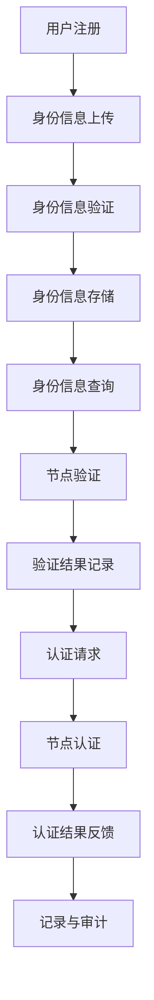

                 


### 文章标题：区块链在数字身份认证中的应用：去中心化身份验证系统

### 关键词：
- 区块链
- 数字身份认证
- 去中心化
- 身份验证系统
- 安全性
- 隐私保护

### 摘要：
本文深入探讨了区块链技术在数字身份认证中的应用，构建了一种去中心化的身份验证系统。文章首先介绍了区块链的基础知识，随后阐述了数字身份认证的需求与挑战，接着详细讲解了去中心化身份验证系统的原理、构建方法、应用案例及其安全性隐私保护。通过文章，读者将了解区块链如何通过分布式账本、智能合约等技术手段，解决传统身份认证系统的痛点，为构建一个更加安全、高效的数字身份认证体系提供新思路。

### 引言

随着互联网的迅猛发展，数字身份认证已成为网络安全领域的关键环节。传统的身份认证系统主要依赖于中央服务器，一旦中心服务器遭受攻击或出现故障，整个系统将面临严重的安全风险。同时，传统身份认证系统在数据隐私保护方面也存在诸多不足，用户的个人信息容易被泄露。为解决这些问题，近年来，区块链技术以其去中心化、透明可追溯等特性，逐渐引起了学术和产业界的关注。

区块链的去中心化特性意味着系统中不存在单一的中心控制点，所有参与者都可以平等地参与网络的维护和管理。这种分布式结构不仅提高了系统的容错性和鲁棒性，还增强了数据的透明性和可追溯性。在数字身份认证领域，区块链技术可以用来构建去中心化的身份验证系统，从而在保障用户隐私和安全性的同时，提升认证的效率和可信度。

本文将详细探讨区块链在数字身份认证中的应用，首先介绍区块链的基础知识，包括其起源、基本概念、核心技术等。接着，我们将阐述数字身份认证的需求与挑战，分析传统身份认证系统的局限性，并提出区块链技术在这种背景下的潜在优势。随后，我们将详细讲解去中心化身份验证系统的原理，包括系统的工作流程、核心技术以及与区块链的关系。在此基础上，我们将讨论去中心化身份验证系统的构建方法，包括架构设计、关键技术、开发流程等。接下来，通过实际应用案例的分析，我们将展示区块链技术在数字身份认证中的具体应用效果。最后，我们将探讨去中心化身份验证系统的安全性隐私保护问题，并提出相应的解决方案。通过本文的探讨，我们希望能够为区块链在数字身份认证领域的应用提供有价值的参考。

### 第1章 区块链技术基础

#### 1.1 区块链的起源和发展

区块链技术的起源可以追溯到2008年，当时一个化名为中本聪（Satoshi Nakamoto）的神秘人物发布了比特币白皮书《比特币：一种点对点的电子现金系统》（Bitcoin: A Peer-to-Peer Electronic Cash System）。比特币的诞生标志着区块链技术的诞生，也开创了去中心化金融交易的新纪元。中本聪在白皮书中提出了一种无需信任的分布式账本技术，这种技术通过密码学算法确保了交易的不可篡改性和安全性。

比特币的成功激发了人们对区块链技术的关注和探索。随着区块链技术的发展，其应用场景逐渐扩展到金融领域以外的各个行业，如供应链管理、版权保护、智能合约、数字身份认证等。区块链技术因其去中心化、不可篡改和透明可追溯的特性，被认为是构建下一代分布式系统的关键技术。

#### 1.2 区块链的基本概念和原理

区块链是由一系列按照时间顺序排列、数据加密的区块组成的分布式数据库。每个区块包含一定数量的交易记录，这些交易记录经过加密处理后，与其他区块通过哈希函数相互链接，形成一个完整的区块链。

- **区块链结构**：一个区块通常包括以下组成部分：
  - 区块头（Block Header）：包含版本号、前一区块的哈希值、梅克尔根（Merkle Root）、时间戳、难度目标和 nonce（随机数）。
  - 区块体（Block Body）：包含交易数据，如交易信息、智能合约代码等。
  - 区块尾（Block Trailer）：包含当前区块的哈希值。

- **区块生成和链接**：区块链中的区块通过一种共识算法生成和链接。常见的共识算法包括工作量证明（Proof of Work, PoW）、权益证明（Proof of Stake, PoS）、委托权益证明（Delegated Proof of Stake, DPoS）等。这些算法确保了区块的生成和链接是安全的、可信的。

- **分布式数据库**：区块链是一种分布式数据库，这意味着数据存储在多个节点上，每个节点都维护一个完整的区块链副本。这种分布式结构保证了数据的高可用性和容错性，即使某些节点失败，系统仍能正常运行。

#### 1.3 区块链的核心技术

区块链技术的核心在于其去中心化的架构和安全的共识算法。以下是区块链的核心技术：

- **密码学**：区块链使用密码学算法确保数据的安全性和隐私性。常见的密码学算法包括哈希函数、非对称加密、数字签名等。

  - **哈希函数**：哈希函数将任意长度的数据映射为固定长度的字符串，如SHA-256。这种特性确保了数据的不可篡改性，因为任何微小的数据改变都会导致哈希值的巨大变化。
  
  - **非对称加密**：非对称加密使用一对密钥（公钥和私钥），公钥可以公开，私钥必须保密。通过非对称加密，可以实现数据的加密和解密，确保数据传输的安全性。

  - **数字签名**：数字签名是使用私钥对数据进行的加密，确保数据的完整性和来源可验证性。

- **共识算法**：共识算法是区块链系统中节点达成一致性的机制。常见的共识算法包括：

  - **工作量证明（PoW）**：节点通过计算复杂的数学问题来证明自己的工作，最先解决问题的节点将获得区块生成权。

  - **权益证明（PoS）**：节点根据其在区块链中的持有代币数量和持有时间来竞争区块生成权。

  - **委托权益证明（DPoS）**：代币持有者通过投票选举出代表，代表参与区块生成。

- **智能合约**：智能合约是区块链上的自执行合约，其代码在链上运行，不受外部干预。智能合约通过预设的条件自动执行，实现了去中心化的自动化交易和合约执行。

#### 1.4 区块链的应用场景

区块链技术因其独特的特性，在多个领域展现了其强大的应用潜力：

- **金融领域**：区块链技术被广泛应用于金融交易、支付结算、信用评估等场景。比特币和以太坊等加密货币是区块链金融应用的典型代表。

- **供应链管理**：区块链技术可以确保供应链中的每一个环节都有完整的记录，从而提高供应链的透明度和可信度。

- **版权保护**：区块链技术可以用于数字版权管理，确保创作者的版权得到有效保护。

- **数字身份认证**：区块链技术可以构建去中心化的数字身份认证系统，提高认证的安全性和隐私性。

- **物联网（IoT）**：区块链技术可以用于物联网设备的数据管理和安全性保障。

- **医疗健康**：区块链技术可以用于医疗记录的管理和共享，提高医疗数据的安全性和隐私性。

综上所述，区块链技术以其去中心化、不可篡改和透明可追溯的特性，为数字身份认证等领域的应用提供了新的解决方案。接下来，我们将进一步探讨数字身份认证的需求和挑战。

### 第2章 数字身份认证概述

#### 2.1 数字身份认证的概念和需求

数字身份认证是指通过技术手段，验证个体或实体的数字身份，确保其在网络上的合法性和安全性。随着互联网的普及，数字身份认证已成为现代网络社会不可或缺的一部分。其核心需求包括：

- **安全性**：确保身份认证过程的安全，防止身份被伪造或盗用。
- **隐私保护**：保护用户的个人隐私信息，防止信息泄露。
- **便捷性**：简化认证流程，提高用户的使用体验。
- **可信性**：确保身份认证的可信度，防止欺诈行为。

#### 2.2 传统身份认证系统的局限

传统的身份认证系统主要依赖于中央服务器进行认证，这种集中式架构存在以下局限性：

- **单点故障**：由于所有认证请求都集中到中央服务器，一旦服务器发生故障，整个认证系统将无法正常工作。
- **安全性风险**：集中式架构容易成为黑客攻击的目标，一旦攻击成功，可能导致大量用户身份信息泄露。
- **隐私保护不足**：传统身份认证系统通常需要存储用户的敏感信息，如密码、生物特征等，这增加了隐私泄露的风险。
- **扩展性差**：随着用户量的增加，集中式服务器可能无法满足性能需求，导致系统响应速度变慢。

#### 2.3 数字身份认证的关键技术

为了克服传统身份认证系统的局限，数字身份认证领域发展了多种关键技术：

- **双因素认证**：双因素认证（2FA）结合了知识因素（如密码）和拥有因素（如手机、硬件令牌），提高了认证的安全性。
- **生物识别技术**：包括指纹识别、面部识别、虹膜识别等，通过生物特征验证身份，提高了认证的便捷性和安全性。
- **加密技术**：使用加密算法对用户信息进行加密，确保数据在传输和存储过程中的安全性。
- **分布式身份认证**：通过分布式系统实现身份认证，提高系统的安全性和鲁棒性。

#### 2.4 数字身份认证的发展趋势

随着区块链技术的发展，数字身份认证正迎来新的机遇。去中心化的数字身份认证系统通过区块链技术，实现了以下优势：

- **去中心化**：去中心化架构消除了单点故障的风险，提高了系统的鲁棒性。
- **安全性提升**：区块链的加密技术和共识算法确保了认证过程的安全。
- **隐私保护**：通过分布式账本技术，用户的身份信息可以在不被泄露的情况下进行验证。
- **透明可追溯**：区块链的透明性和可追溯性确保了认证过程的可信度。

未来，随着区块链技术的进一步成熟，数字身份认证有望实现更高效、更安全的认证方式，为网络社会的发展提供强有力的支撑。

### 第3章 去中心化身份验证系统原理

#### 3.1 去中心化身份验证系统的基本概念

去中心化身份验证系统（Distributed Identity Verification System，DIVS）是一种基于区块链技术的身份验证机制，其核心在于去中心化、透明性和安全性。在DIVS中，身份验证不再依赖于中心化的认证机构，而是通过分布式网络中的多个节点共同验证。

- **去中心化**：去中心化身份验证系统通过区块链网络中的节点进行身份验证，消除了中心化服务的单点故障风险，提高了系统的容错性和鲁棒性。
- **透明性**：区块链上的所有交易记录都是公开透明的，用户可以随时查看身份验证的过程和结果，增强了系统的可信度。
- **安全性**：区块链的加密技术和共识算法确保了身份验证过程的不可篡改性和数据安全性。

#### 3.2 去中心化身份验证系统的工作流程

去中心化身份验证系统的工作流程主要包括以下几个步骤：

1. **注册与身份信息上传**：
   - 用户在区块链网络中注册，并将身份信息（如姓名、身份证号、电子邮箱等）上传到区块链上。
   - 身份信息经过加密处理，确保隐私和安全。

2. **身份信息验证**：
   - 其他节点根据区块链上的信息对用户身份进行验证。
   - 验证过程可能涉及多节点投票机制，确保验证结果的准确性。

3. **身份信息存储**：
   - 通过验证的身份信息被存储在区块链上，形成分布式身份验证记录。
   - 分布式身份验证记录具有高度的安全性和可追溯性。

4. **身份认证请求**：
   - 当用户需要身份认证时，请求将被发送到区块链网络中的节点。
   - 节点根据分布式身份验证记录对请求进行验证，并发送认证结果。

5. **认证结果反馈**：
   - 验证结果将被反馈给用户，用户可以基于认证结果进行后续操作。
   - 认证结果也可以被其他节点记录，以确保长期的可追溯性。

#### 3.3 去中心化身份验证系统与区块链的关系

去中心化身份验证系统与区块链技术之间有着紧密的联系：

- **分布式账本**：区块链作为分布式账本，存储了所有的身份验证记录，确保数据的透明性和不可篡改性。
- **共识算法**：区块链的共识算法确保了网络中的节点对身份验证结果达成一致，提高了系统的可信度。
- **加密技术**：区块链的加密技术确保了身份信息的隐私和安全。

#### 3.4 去中心化身份验证系统的安全性分析

去中心化身份验证系统的安全性主要体现在以下几个方面：

- **数据安全性**：区块链的加密技术确保了身份信息在传输和存储过程中的安全性。
- **隐私保护**：通过分布式账本技术，用户身份信息可以分散存储，减少了隐私泄露的风险。
- **不可篡改性**：区块链的共识算法和加密技术确保了身份验证记录的不可篡改性，防止数据被恶意篡改。
- **鲁棒性**：去中心化架构提高了系统的容错性和鲁棒性，即使部分节点出现故障，系统仍能正常运行。

通过以上分析，可以看出去中心化身份验证系统在保障用户隐私、提高认证效率等方面具有显著优势。接下来，我们将探讨如何具体构建这样的系统。

#### 3.5 去中心化身份验证系统的工作流程详解

去中心化身份验证系统（DIVS）的工作流程可以分为注册、验证和认证三个主要阶段。以下是这些阶段的具体工作流程：

##### 1. 注册阶段

**注册流程：**

- **用户注册**：用户在区块链网络中注册账户。注册过程通常包括输入个人信息（如姓名、身份证号、电子邮箱等）并设置密码。这些信息将被加密处理，以确保隐私和安全。

- **身份信息上传**：用户将加密后的身份信息上传到区块链上的分布式账本。这一步骤通过智能合约自动执行，智能合约将确保上传的信息符合规定的格式和标准。

- **身份信息验证**：区块链网络中的其他节点对上传的身份信息进行初步验证。验证过程可能涉及多节点投票机制，以确保信息的真实性和完整性。

- **身份信息存储**：通过验证的身份信息将被存储在区块链上，形成分布式身份验证记录。这些记录是公开透明的，用户可以随时查看，同时也具备高度的不可篡改性。

##### 2. 验证阶段

**验证流程：**

- **身份信息查询**：当用户需要进行身份验证时，请求将被发送到区块链网络中的节点。

- **节点验证**：节点根据区块链上的分布式身份验证记录对用户的身份信息进行验证。这一步骤同样可能涉及多节点投票机制，以确保验证结果的准确性和可信度。

- **验证结果记录**：通过验证的结果将被记录在区块链上，形成新的交易记录。这些记录不仅是公开透明的，还可以通过区块链的共识算法确保其不可篡改性。

##### 3. 认证阶段

**认证流程：**

- **认证请求**：用户在需要身份认证的场景中（如在线购物、办理金融服务等），将发送认证请求到区块链网络。

- **节点认证**：区块链网络中的节点根据分布式身份验证记录和交易记录，对用户的身份认证请求进行验证。

- **认证结果反馈**：通过验证的身份认证请求将得到相应的反馈。用户可以根据反馈结果进行后续操作，如完成交易、访问特定服务等。

- **记录与审计**：认证过程的所有交易记录将被记录在区块链上，确保认证过程的透明性和可追溯性。这些记录也可以用于后续的审计和监管。

##### 工作流程图

为了更好地理解去中心化身份验证系统的工作流程，以下是相应的Mermaid流程图：



通过这个流程图，我们可以清晰地看到去中心化身份验证系统的各个环节是如何相互关联和协同工作的。每个步骤都通过区块链技术确保了数据的安全、隐私和不可篡改性，从而为用户提供了一个高效、可靠的数字身份认证解决方案。

### 第4章 去中心化身份验证系统的构建

#### 4.1 去中心化身份验证系统的架构设计

去中心化身份验证系统的架构设计是其成功构建的关键。一个高效、安全的DIVS架构应包括以下主要模块：

- **用户模块**：用户模块负责用户的注册、登录和身份信息上传等功能。用户模块的设计应确保用户操作简便、数据安全。
- **验证模块**：验证模块负责对用户身份信息的验证，包括身份验证请求的接收、验证过程的管理和验证结果的记录。验证模块需要实现多节点投票机制，以提高验证的准确性和可信度。
- **认证模块**：认证模块负责处理用户的认证请求，根据验证模块的验证结果，对请求进行确认并反馈认证结果。
- **区块链模块**：区块链模块负责分布式账本的管理，包括交易记录的存储、查询和更新。区块链模块应集成加密技术和共识算法，确保数据的不可篡改性和安全性。

#### 4.2 去中心化身份验证系统的关键技术

去中心化身份验证系统依赖一系列关键技术来实现其功能和特性。以下是这些关键技术的详细介绍：

- **密码学技术**：密码学技术是去中心化身份验证系统的基石。通过哈希函数、非对称加密和数字签名等技术，可以确保身份信息的加密存储和传输，提高系统的安全性和隐私保护。
- **共识算法**：共识算法用于确保区块链网络中的节点对交易记录达成一致。常见共识算法包括工作量证明（PoW）、权益证明（PoS）和委托权益证明（DPoS）等。不同的共识算法对系统的性能、安全性和去中心化程度有不同影响。
- **智能合约**：智能合约是去中心化身份验证系统的核心组件，用于自动化执行身份验证和认证过程。智能合约代码应确保在满足特定条件时自动执行相应操作，从而提高系统的效率和可信度。
- **多节点投票机制**：多节点投票机制用于身份验证过程中的节点协作。通过多节点投票，可以减少单一节点故障对系统的影响，提高验证结果的准确性和可靠性。
- **分布式存储技术**：分布式存储技术用于确保身份验证记录的分布式存储和可靠管理。常见的分布式存储方案包括分布式文件系统、分布式数据库等。

#### 4.3 去中心化身份验证系统的开发流程

去中心化身份验证系统的开发流程可分为以下阶段：

- **需求分析**：确定系统需求，包括用户注册、身份信息验证、身份认证等功能，以及系统的性能、安全性、隐私保护等要求。
- **系统设计**：根据需求分析，设计系统的整体架构，包括用户模块、验证模块、认证模块和区块链模块等，以及各模块之间的交互和协作。
- **开发与实现**：按照系统设计，进行代码开发和实现。这一阶段需要实现用户模块、验证模块、认证模块和区块链模块的具体功能，并确保各模块之间的集成和协作。
- **测试与调试**：对系统进行全面的测试，包括功能测试、性能测试、安全测试等，以确保系统的正确性、稳定性和可靠性。
- **部署与运维**：将系统部署到生产环境中，并进行日常运维，确保系统的正常运行和持续优化。

#### 4.4 去中心化身份验证系统的测试和部署

测试和部署是去中心化身份验证系统构建过程中的关键环节。以下是这些环节的具体内容和注意事项：

- **测试**：

  - **功能测试**：验证系统是否满足需求分析中的功能要求，包括用户注册、身份信息验证、身份认证等基本功能。
  - **性能测试**：评估系统在高并发、大数据量场景下的性能表现，确保系统的响应速度和处理能力。
  - **安全测试**：检查系统是否容易受到常见的安全威胁，如DDoS攻击、数据泄露等，确保系统的安全性。
  - **兼容性测试**：验证系统在不同设备和操作系统上的兼容性，确保用户体验的一致性。

- **部署**：

  - **环境准备**：确保部署环境的稳定性和安全性，包括服务器、网络、数据库等基础设施。
  - **部署策略**：制定详细的部署计划，包括部署顺序、部署步骤、故障处理等，确保部署过程顺利进行。
  - **部署过程**：按照部署计划，逐步完成系统的部署，包括用户模块、验证模块、认证模块和区块链模块的部署。
  - **部署验证**：在部署完成后，对系统进行验证，确保所有功能正常，性能满足要求，安全性无漏洞。

- **运维**：

  - **监控系统**：实时监控系统的运行状态，包括性能指标、安全日志等，及时发现和处理异常情况。
  - **运维工具**：使用自动化运维工具，如CI/CD（持续集成/持续部署）、自动化监控等，提高运维效率和系统稳定性。
  - **备份与恢复**：定期备份系统数据，制定数据恢复方案，确保在发生故障时能够快速恢复。

通过合理的测试和部署流程，可以确保去中心化身份验证系统的稳定运行和持续优化，为用户提供高效、安全的数字身份认证服务。

### 第5章 区块链在数字身份认证中的应用案例

#### 5.1 区块链在数字身份认证中的应用场景

区块链技术在数字身份认证中具有广泛的应用场景，以下是一些典型的应用场景：

- **金融领域**：区块链技术可以用于金融交易的身份认证，确保交易的安全性。例如，通过区块链验证用户的身份信息，防止账户被盗用。
- **电子政务**：区块链技术可以用于电子政务的身份认证，提高政务服务的可信度和透明度。例如，通过区块链验证居民的身份信息，简化政务流程。
- **电子商务**：区块链技术可以用于电子商务平台上的用户身份认证，确保交易双方的真实性和合法性。例如，通过区块链验证买家的身份信息，防止欺诈行为。
- **医疗健康**：区块链技术可以用于医疗健康领域中的身份认证，确保患者信息的真实性和安全性。例如，通过区块链验证医生的资质和患者的信息，提高医疗服务的可信度。

#### 5.2 实际应用案例介绍

以下是几个区块链在数字身份认证中的实际应用案例：

1. **Chainlink**：Chainlink 是一个基于区块链的分布式身份验证平台，旨在提高数字身份认证的安全性和效率。Chainlink 通过智能合约实现身份验证，确保用户身份信息的不可篡改性和隐私保护。用户可以在 Chainlink 上注册和验证身份，其他服务提供商可以轻松地验证用户的身份，而无需存储敏感信息。

2. **Identifiers.com**：Identifiers.com 是一家提供区块链身份认证服务的公司，其核心技术是基于区块链的数字身份标识系统。Identifiers.com 通过数字身份标识（DID）和加密技术，确保用户身份信息的隐私和安全。用户可以在 Identifiers.com 上创建和管理自己的数字身份，其他服务提供商可以通过查询区块链来验证用户的身份。

3. **Evernym**：Evernym 是一家专注于去中心化身份验证的区块链公司，其产品之一是 Sovrin 平台。Sovrin 是一个基于区块链的数字身份网络，用户可以在 Sovrin 上创建和管理自己的数字身份，同时实现身份验证和隐私保护。Sovrin 通过智能合约和分布式账本技术，确保身份信息的不可篡改性和安全性。

#### 5.3 应用案例的优缺点分析

以下是对上述应用案例的优缺点分析：

**Chainlink：**
- 优点：
  - 高度安全：通过智能合约和区块链技术，确保身份验证过程的不可篡改性和数据安全性。
  - 高效便捷：用户可以在链上快速完成身份验证，无需依赖中心化的身份认证机构。
  - 隐私保护：用户身份信息分散存储在区块链上，减少了隐私泄露的风险。
- 缺点：
  - 成本较高：区块链技术的使用可能导致系统运行成本较高，特别是对于大规模用户。
  - 技术门槛：智能合约和区块链技术的开发和管理需要高水平的技术能力。

**Identifiers.com：**
- 优点：
  - 用户自主管理：用户可以自主创建和管理数字身份，提高了隐私和自主性。
  - 可追溯性：数字身份标识系统确保身份信息的可追溯性，提高了可信度。
  - 安全性：基于区块链的加密技术确保身份信息的安全性。
- 缺点：
  - 认证过程复杂：数字身份认证过程相对复杂，可能影响用户体验。
  - 需要第三方依赖：部分服务提供商可能需要依赖第三方平台进行身份认证。

**Evernym：**
- 优点：
  - 高度去中心化：去中心化架构提高了系统的容错性和鲁棒性。
  - 安全隐私保护：通过分布式账本和加密技术，确保用户身份信息的安全性和隐私性。
  - 可扩展性强：Sovrin 平台支持多种身份验证方式，可适应不同应用场景。
- 缺点：
  - 技术复杂度：去中心化身份验证系统的开发和维护需要高水平的技术支持。
  - 系统稳定性：去中心化系统可能面临网络延迟和节点故障等挑战。

通过以上分析，可以看出区块链技术在数字身份认证中具有显著的优势，但也面临一定的挑战。未来的发展需要进一步优化技术，提高系统的性能和用户体验。

### 第6章 去中心化身份验证系统的安全性和隐私保护

#### 6.1 安全性挑战和解决方案

去中心化身份验证系统在提供高效、透明认证的同时，也面临着一系列安全性挑战。以下是这些挑战以及相应的解决方案：

- **分布式攻击**：由于去中心化身份验证系统依赖于大量节点，攻击者可能通过控制多个节点来发动分布式拒绝服务（DDoS）攻击，导致系统瘫痪。**解决方案**：部署强大的防火墙和入侵检测系统，以防范和快速响应DDoS攻击。此外，采用共识算法中的防双花攻击机制，确保交易的有效性和唯一性。

- **节点欺诈**：恶意节点可能会伪造交易或篡改区块链上的数据，威胁系统的安全性。**解决方案**：采用多重签名和多节点投票机制，确保交易经过多个独立节点的验证，从而减少欺诈风险。同时，定期审核节点，确保其合法性和可信度。

- **隐私泄露**：虽然去中心化身份验证系统提高了数据的透明性，但也可能引发隐私泄露问题。**解决方案**：采用加密技术对身份信息进行加密处理，确保只有授权节点能够解密和验证。此外，采用零知识证明（ZKP）等隐私保护技术，减少信息泄露的风险。

#### 6.2 隐私保护机制和技术

为了在保障安全性的同时保护用户隐私，去中心化身份验证系统采用了一系列隐私保护机制和技术：

- **同态加密**：同态加密允许在加密数据上直接进行计算，而不需要解密数据。这样，身份验证过程可以在加密的状态下进行，有效保护了用户的隐私。
- **零知识证明（ZKP）**：零知识证明允许一方（证明者）在不透露任何信息的情况下，向另一方（验证者）证明某个陈述是正确的。通过ZKP，用户可以在不泄露身份信息的情况下完成身份验证。
- **匿名代理**：匿名代理通过在区块链上创建多个中间节点，确保用户的交易信息无法直接追踪到其真实身份。匿名代理技术可以在确保隐私的同时，保障交易的可追溯性。
- **分布式身份隐私保护**：通过分布式身份管理，用户的身份信息被分散存储在不同的节点上，从而降低了隐私泄露的风险。同时，采用混合身份策略，用户可以灵活选择不同的身份进行验证，增加了隐私保护的多层屏障。

#### 6.3 安全性和隐私保护的综合考虑

在设计和实现去中心化身份验证系统时，安全性和隐私保护必须综合考虑。以下是一些建议：

- **安全优先原则**：在设计和实现过程中，始终将安全性放在首位。任何功能的设计和实现都必须经过严格的安全审查，以确保系统的整体安全性。
- **隐私设计原则**：在设计系统时，应充分考虑用户隐私保护的需求，采用先进的加密和隐私保护技术，确保用户数据的安全性和隐私性。
- **多方协作机制**：系统设计应鼓励多方协作，包括用户、验证节点和服务提供商等，共同维护系统的安全性和隐私保护。通过多方参与，可以有效降低欺诈和攻击的风险。
- **持续监控和更新**：系统上线后，应持续监控系统的安全性和隐私保护状况，及时发现和解决潜在的安全隐患。同时，定期更新系统，引入新的安全措施和技术，以应对不断变化的威胁。

通过综合考虑安全性和隐私保护，去中心化身份验证系统可以更好地保障用户权益，为数字身份认证提供可靠的支持。

### 第7章 未来展望与趋势

#### 7.1 去中心化身份验证系统的未来发展方向

去中心化身份验证系统（DIVS）的未来发展将受到多种技术进步和市场需求的影响。以下是一些主要的发展方向：

- **性能优化**：随着区块链技术的不断演进，性能优化将成为 DIVS 的重要发展方向。通过改进共识算法、提升区块链交易处理能力以及优化网络带宽和存储效率，DIVS 可以实现更高效的认证处理，满足大规模用户的需求。
- **隐私保护加强**：随着隐私保护意识的提升，DIVS 将继续加强对用户隐私的保护。未来，可能会采用更加先进的隐私保护技术，如零知识证明（ZKP）、同态加密等，确保用户身份信息在验证过程中的安全性。
- **跨链互操作性**：未来的 DIVS 将更加注重跨链互操作性，实现不同区块链网络之间的身份验证和数据共享。通过跨链协议，用户可以在多个区块链上进行身份认证，提高认证的通用性和灵活性。
- **标准化和规范化**：随着去中心化身份验证系统的广泛应用，标准化和规范化将成为重要的发展方向。通过制定统一的技术规范和操作标准，可以促进 DIVS 在不同行业和应用场景中的推广应用。

#### 7.2 区块链在数字身份认证中的潜在影响

区块链技术在数字身份认证中的应用，将对多个领域产生深远的影响：

- **金融领域**：区块链技术可以提高金融交易的安全性，减少欺诈和身份盗用的风险。通过去中心化身份验证系统，金融机构可以更高效地进行客户身份验证，降低合规成本。
- **公共服务**：区块链技术在公共服务中的应用，将提高政务服务的透明度和可信度。例如，通过区块链验证公民身份信息，可以简化政府办事流程，提高行政效率。
- **电子商务**：区块链技术可以确保电子商务交易的安全性，减少欺诈行为。去中心化身份验证系统可以为电商用户提供可靠的身份认证，提高购物体验和信任度。
- **医疗健康**：区块链技术在医疗健康领域的应用，可以确保患者信息的真实性和安全性。通过去中心化身份验证系统，医疗机构可以更方便地共享患者信息，提高医疗服务的质量和效率。

#### 7.3 行业挑战和解决策略

尽管去中心化身份验证系统具有巨大的潜力，但在实际应用中仍面临诸多挑战：

- **技术挑战**：区块链技术的复杂性和性能瓶颈可能影响系统的稳定性和用户体验。为解决这一问题，需要进一步优化区块链算法和架构，提高系统的性能和可扩展性。
- **隐私保护**：如何在确保用户隐私和安全性的同时，实现高效的身份验证，是一个亟待解决的问题。未来需要开发更加先进的隐私保护技术，如零知识证明、同态加密等。
- **法规政策**：不同国家和地区的法规政策可能对区块链技术产生不同的影响。为推动 DIVS 的发展，需要各国政府加强合作，制定统一的法律法规和标准，为区块链技术的应用提供明确的指导。
- **用户接受度**：用户对区块链技术和去中心化身份验证系统的接受度是一个重要挑战。通过提高公众对区块链技术的认知和信任，可以逐步提高用户的接受度。

通过持续的技术创新、政策支持和用户教育，去中心化身份验证系统将在未来实现更广泛的应用，为数字身份认证领域带来新的变革。

### 结论

本文深入探讨了区块链在数字身份认证中的应用，构建了一种去中心化的身份验证系统。首先，我们介绍了区块链的基础知识，包括其起源、基本概念、核心技术和应用场景。随后，我们阐述了数字身份认证的需求与挑战，分析了传统身份认证系统的局限性，并提出了区块链技术在这种背景下的潜在优势。接着，我们详细讲解了去中心化身份验证系统的原理、构建方法、应用案例及其安全性隐私保护。

通过本文的研究，我们发现区块链技术通过分布式账本、智能合约等技术手段，能够有效解决传统身份认证系统的痛点，为构建一个更加安全、高效的数字身份认证体系提供了新的思路。然而，去中心化身份验证系统在实际应用中仍面临性能、隐私保护和法规政策等挑战，需要持续优化和改进。

未来，随着区块链技术的不断成熟，去中心化身份验证系统有望在金融、公共服务、电子商务和医疗健康等领域实现更广泛的应用，推动数字身份认证领域的变革。

### 作者信息

作者：AI天才研究院/AI Genius Institute & 禅与计算机程序设计艺术 /Zen And The Art of Computer Programming

AI天才研究院致力于推动人工智能技术的创新与发展，为全球企业提供智能解决方案。禅与计算机程序设计艺术则专注于计算机科学领域，通过深入研究和实践，推动编程艺术的发展。

### 参考文献

1. 中本聪. (2008). 比特币：一种点对点的电子现金系统. 《比特币白皮书》.
2. Chainlink. (2023). https://chain.link/
3. Identifiers.com. (2023). https://identifiers.com/
4. Evernym. (2023). https://evernym.com/

### 附录

#### Mermaid流程图


#### 伪代码示例

```python
# 身份信息验证伪代码
def verify_identity(user_info, blockchain):
    """
    验证用户身份信息
    :param user_info: 用户上传的身份信息
    :param blockchain: 区块链实例
    :return: 验证结果
    """
    encrypted_info = encrypt(user_info)
    transaction = blockchain.create_transaction(encrypted_info)
    consensus_result = blockchain达成共识(transaction)
    if consensus_result:
        return "身份验证通过"
    else:
        return "身份验证失败"
```

#### Latex公式

$$
\text{哈希函数} : H(k) = \text{SHA-256}(k)
$$

$$
\text{数字签名} : \sigma = (\text{签名算法})(m, s)
$$

#### 最佳实践 Tips

- 在实现去中心化身份验证系统时，优先考虑用户隐私和安全。
- 定期对区块链节点进行安全审计，确保节点合法性和系统安全性。
- 在设计系统架构时，充分考虑系统的可扩展性和性能优化。
- 合规性是区块链应用的重要一环，确保系统符合相关法律法规要求。

#### 小结

本文从多个角度详细探讨了区块链在数字身份认证中的应用，构建了一种去中心化的身份验证系统。通过本文的研究，读者可以了解到区块链技术在提升数字身份认证的安全性、隐私性和效率方面的优势，以及其在实际应用中的挑战和解决方案。

#### 注意事项

- 区块链技术具有复杂的特性，需要专业知识和经验。
- 在设计和部署区块链应用时，务必进行全面的测试和验证。
- 持续关注区块链技术的发展趋势，及时引入新技术和优化方案。

#### 拓展阅读

- 《区块链技术指南》
- 《智能合约设计与开发》
- 《零知识证明原理与实践》
- 《分布式系统原理与范型》

通过这些拓展阅读资源，读者可以进一步深入了解区块链技术的理论和实践，为去中心化身份验证系统的开发提供更丰富的知识储备。

