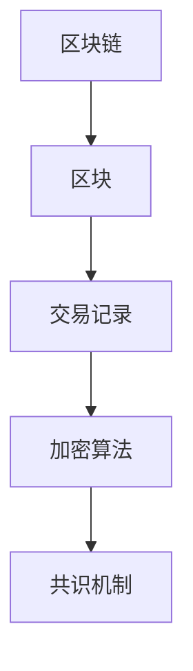
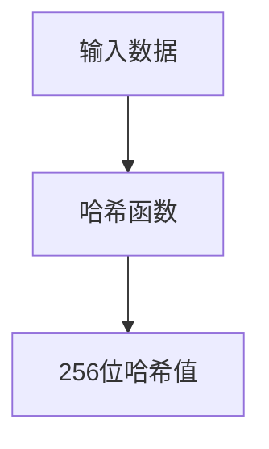
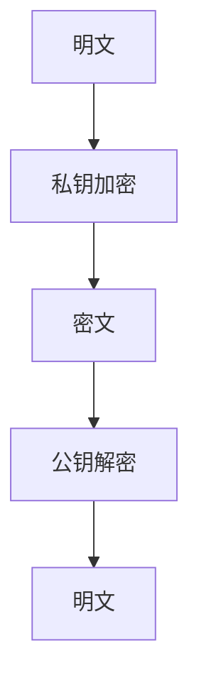
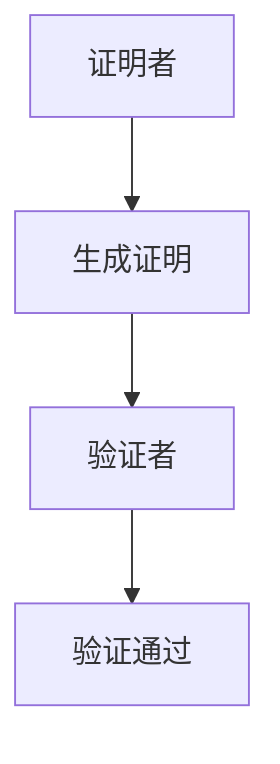

                 

### 文章标题

区块链在数字身份跨国认证中的应用探索

### 关键词

区块链、数字身份、跨国认证、分布式账本、智能合约、非同质化代币（NFT）

### 摘要

本文旨在探讨区块链技术在数字身份跨国认证中的应用。首先，我们对区块链和数字身份的基本概念进行概述，并分析其在现代社会中的重要性。接着，我们探讨区块链与数字身份的结合点，以及区块链在跨国认证中的作用。文章还通过实际案例研究，详细描述了区块链在跨国认证中的应用实践，并讨论了相关的法律法规、隐私保护与安全性问题。最后，我们展望了区块链在数字身份跨国认证中的未来发展趋势和潜在挑战。

----------------------------------------------------------------

### 第一部分：区块链与数字身份基础

#### 1.1 区块链技术概述

##### 1.1.1 区块链的定义与基本原理

区块链是一种去中心化的分布式数据库技术，通过加密算法和共识机制确保数据的安全性和不可篡改性。每个区块包含一定数量的交易记录，通过哈希函数与前后区块链接成链条，形成一个连续的、不可篡改的数据结构。



##### 1.1.2 区块链的关键特点

区块链具有以下关键特点：

1. **去中心化**：区块链没有中央控制机构，数据由网络中的所有节点共同维护。
2. **安全性**：通过加密算法和共识机制，区块链数据具有高度的防篡改性和安全性。
3. **不可篡改性**：一旦数据被记录在区块链上，就几乎无法更改或删除。
4. **透明性**：区块链上的所有交易记录都是公开的，任何节点都可以查看。

##### 1.1.3 区块链技术的发展历程

区块链技术起源于2008年，中本聪（Satoshi Nakamoto）发布了比特币（Bitcoin）白皮书。随后，以太坊（Ethereum）等第二层区块链平台逐渐崛起，扩展了区块链技术的应用场景。当前，区块链技术已广泛应用于金融、供应链管理、数字身份认证等领域。

#### 1.2 数字身份的概念与重要性

##### 1.2.1 数字身份的定义与分类

数字身份是指个体在数字世界中的唯一标识，通常由一组数字信息和属性构成。根据使用场景和目的，数字身份可以分为以下几类：

1. **个人数字身份**：用于个人在互联网上的身份验证和访问控制。
2. **企业数字身份**：用于企业在线业务活动中的身份验证和权限管理。
3. **设备数字身份**：用于设备在物联网（IoT）环境中的身份验证和设备管理。

##### 1.2.2 数字身份在现代社会中的应用

数字身份在现代社会中具有广泛的应用，包括但不限于：

1. **电子商务**：用户在进行在线购物时需要验证数字身份，确保交易安全。
2. **电子政务**：政府机构通过数字身份认证，为公众提供便捷的在线服务。
3. **金融服务**：金融机构利用数字身份认证，确保用户身份真实，防范欺诈风险。

##### 1.2.3 数字身份面临的挑战

数字身份在发展过程中面临着以下挑战：

1. **安全性**：数字身份信息容易受到网络攻击和隐私泄露。
2. **隐私保护**：用户数字身份信息在传输和存储过程中需要保护隐私。
3. **跨境认证**：跨国认证过程中，不同国家和地区的数字身份认证标准不统一。

#### 1.3 区块链在数字身份中的应用

##### 1.3.1 区块链与数字身份的结合点

区块链与数字身份的结合点在于：

1. **去中心化**：区块链的去中心化特性有助于解决数字身份认证中的信任问题。
2. **安全性**：区块链的安全性和不可篡改性有助于保障数字身份信息的安全。
3. **透明性**：区块链上的交易记录是公开的，有助于提升数字身份认证的透明度。

##### 1.3.2 区块链在数字身份验证中的作用

区块链在数字身份验证中的作用包括：

1. **身份验证**：通过区块链技术，可以验证用户的数字身份信息，确保其真实性和完整性。
2. **权限管理**：区块链上的智能合约可以用于实现数字身份的权限管理，确保用户身份的访问权限。

##### 1.3.3 区块链在数字身份管理中的应用

区块链在数字身份管理中的应用包括：

1. **身份信息存储**：区块链可以用于存储用户的数字身份信息，确保数据的安全性和隐私。
2. **身份信息更新**：用户可以通过区块链技术，方便地更新和维护自己的数字身份信息。

#### 1.4 跨国认证的挑战与需求

##### 1.4.1 跨国认证的定义与意义

跨国认证是指在不同国家和地区之间进行的身份认证和信息验证。跨国认证在现代社会具有重要意义，包括：

1. **跨境贸易**：跨国认证有助于确保跨境贸易的安全和便捷。
2. **国际合作**：跨国认证有助于促进国际间的合作与交流。
3. **社会治理**：跨国认证有助于提升社会治理的效率和透明度。

##### 1.4.2 跨国认证的传统方法与不足

传统跨国认证方法主要包括以下几种：

1. **护照和签证**：通过护照和签证进行身份验证，但存在程序复杂、效率低的问题。
2. **国际信用报告**：通过国际信用报告进行身份验证，但存在数据不准确、隐私泄露的风险。
3. **认证机构认证**：通过认证机构进行身份验证，但存在信任问题。

传统方法存在以下不足：

1. **效率低**：传统认证方法需要耗费大量时间和人力。
2. **安全性差**：传统认证方法难以防范欺诈和篡改。
3. **成本高**：传统认证方法需要大量资金投入。

##### 1.4.3 跨国认证的新需求

随着全球化的深入发展，跨国认证面临着新的需求：

1. **便捷性**：跨国认证需要更加便捷，以适应快速变化的商业环境。
2. **安全性**：跨国认证需要确保数据的安全和隐私。
3. **可追溯性**：跨国认证需要具备可追溯性，以应对各种纠纷和风险。

### 第二部分：区块链在数字身份跨国认证中的应用实践

#### 2.1 区块链在跨国认证中的关键技术

##### 2.1.1 区块链的分布式账本技术

区块链的分布式账本技术为跨国认证提供了坚实的基础。分布式账本技术具有以下优势：

1. **去中心化**：分布式账本技术使跨国认证的去中心化成为可能，减少了中介机构的依赖。
2. **安全性**：分布式账本技术通过加密算法和共识机制确保数据的安全性和不可篡改性。
3. **透明性**：分布式账本技术使跨国认证过程更加透明，便于各方监督和审计。

##### 2.1.2 智能合约在跨国认证中的应用

智能合约是一种自动执行的合约，能够在满足特定条件时自动执行。智能合约在跨国认证中的应用包括：

1. **身份验证**：智能合约可以用于验证用户的数字身份，确保其真实性。
2. **权限管理**：智能合约可以用于管理用户在跨国认证中的权限，确保权限的合理分配。
3. **自动执行**：智能合约可以自动执行跨国认证的流程，提高认证的效率和准确性。

##### 2.1.3 非同质化代币（NFT）在数字身份中的应用

非同质化代币（NFT）是一种数字资产，可以用于表示独特的数字身份。NFT在数字身份中的应用包括：

1. **身份认证**：NFT可以用于证明用户的数字身份，确保其唯一性和真实性。
2. **身份管理**：NFT可以用于管理用户的数字身份信息，确保其安全性和隐私。
3. **身份交易**：NFT可以用于交易数字身份，为用户提供灵活的身份管理解决方案。

#### 2.2 区块链在跨国认证中的案例研究

##### 2.2.1 案例一：跨国企业的数字身份管理

某跨国企业采用区块链技术进行数字身份管理，实现以下功能：

1. **身份验证**：企业员工通过区块链进行身份验证，确保其真实性和唯一性。
2. **权限管理**：企业员工根据其在公司的职位和职责，分配不同的权限。
3. **身份信息更新**：企业员工可以方便地更新自己的身份信息，确保其准确性和实时性。

##### 2.2.2 案例二：跨境电子支付的数字身份验证

某跨境支付平台采用区块链技术进行数字身份验证，实现以下功能：

1. **身份验证**：用户在进行跨境支付前，需通过区块链进行身份验证。
2. **身份信息加密**：用户的身份信息在传输过程中进行加密，确保隐私和安全。
3. **身份信息共享**：用户可以在跨境支付过程中，安全地共享身份信息，提高支付效率。

##### 2.2.3 案例三：跨国教育认证的区块链应用

某跨国教育机构采用区块链技术进行教育认证，实现以下功能：

1. **证书发放**：教育机构通过区块链发放毕业证书和其他教育证明。
2. **证书验证**：学生和雇主可以方便地验证教育证书的真实性。
3. **证书更新**：教育机构可以方便地更新学生的教育信息，确保证书的实时性。

#### 2.3 跨国认证中的法律法规与合规性

##### 2.3.1 跨国认证相关法律法规概述

跨国认证涉及多个国家和地区的法律法规，包括：

1. **数据保护法**：如欧盟的《通用数据保护条例》（GDPR）和美国《加州消费者隐私法案》（CCPA）。
2. **身份验证法**：如美国的《身份验证法》（Authentication Act）和欧盟的《电子身份验证指令》（eIDAS）。
3. **反洗钱法**：如美国的《反洗钱法》（AML）和《反恐怖融资法》（ATF）。

##### 2.3.2 区块链在跨国认证中的法律挑战

区块链在跨国认证中面临以下法律挑战：

1. **数据保护**：如何确保区块链上的数据符合数据保护法规，保护用户隐私。
2. **身份验证**：如何确保区块链上的身份验证方法符合相关法律法规，防止欺诈和滥用。
3. **跨境数据传输**：如何确保跨境数据传输符合各国数据保护法规，避免法律风险。

##### 2.3.3 区块链在跨国认证中的合规性解决方案

为应对区块链在跨国认证中的法律挑战，可以采取以下合规性解决方案：

1. **遵循数据保护法规**：在设计区块链应用时，遵循相关数据保护法规，如GDPR和CCPA。
2. **加强身份验证**：采用多因素身份验证，确保用户身份的真实性和安全性。
3. **跨国合作**：与各国政府和监管机构合作，制定统一的跨国认证标准和规范。

#### 2.4 跨国认证中的隐私保护与安全性

##### 2.4.1 跨国认证中的隐私保护需求

跨国认证中的隐私保护需求包括：

1. **数据加密**：确保传输和存储过程中的数据加密，防止数据泄露。
2. **隐私保护算法**：采用隐私保护算法，如差分隐私和同态加密，保护用户隐私。
3. **匿名化处理**：对敏感数据进行匿名化处理，降低隐私泄露风险。

##### 2.4.2 区块链在跨国认证中的隐私保护技术

区块链在跨国认证中的隐私保护技术包括：

1. **零知识证明**：零知识证明允许一方在不泄露任何信息的情况下证明某个陈述是真实的。
2. **环签名**：环签名技术可以使一个用户在签名时隐藏其身份，增强隐私保护。
3. **同态加密**：同态加密允许在加密数据上执行计算，而不需要解密数据，保护数据隐私。

##### 2.4.3 跨国认证中的安全性分析

跨国认证中的安全性分析包括：

1. **身份验证**：确保用户身份的真实性和唯一性，防止欺诈和假冒。
2. **数据完整性**：确保数据在传输和存储过程中不被篡改或损坏。
3. **访问控制**：确保只有授权用户才能访问敏感数据，防止未经授权的访问。

#### 2.5 跨国认证中的隐私保护与安全性

##### 2.5.1 跨国认证中的隐私保护需求

跨国认证中的隐私保护需求包括：

1. **数据加密**：确保传输和存储过程中的数据加密，防止数据泄露。
2. **隐私保护算法**：采用隐私保护算法，如差分隐私和同态加密，保护用户隐私。
3. **匿名化处理**：对敏感数据进行匿名化处理，降低隐私泄露风险。

##### 2.5.2 区块链在跨国认证中的隐私保护技术

区块链在跨国认证中的隐私保护技术包括：

1. **零知识证明**：零知识证明允许一方在不泄露任何信息的情况下证明某个陈述是真实的。
2. **环签名**：环签名技术可以使一个用户在签名时隐藏其身份，增强隐私保护。
3. **同态加密**：同态加密允许在加密数据上执行计算，而不需要解密数据，保护数据隐私。

##### 2.5.3 跨国认证中的安全性分析

跨国认证中的安全性分析包括：

1. **身份验证**：确保用户身份的真实性和唯一性，防止欺诈和假冒。
2. **数据完整性**：确保数据在传输和存储过程中不被篡改或损坏。
3. **访问控制**：确保只有授权用户才能访问敏感数据，防止未经授权的访问。

### 第三部分：区块链在数字身份跨国认证中的应用展望

#### 3.1 区块链在跨国认证中的未来发展趋势

区块链在跨国认证中的未来发展趋势包括：

1. **技术演进**：区块链技术的不断演进，如扩展性提升、性能优化等，将推动跨国认证的发展。
2. **标准统一**：跨国认证标准和规范的逐步统一，将提高跨国认证的效率和安全性。
3. **跨行业合作**：区块链与其他行业（如金融、教育、医疗等）的深度融合，将推动跨国认证的广泛应用。

#### 3.2 区块链在跨国认证中的潜在挑战与解决方案

区块链在跨国认证中面临的潜在挑战包括：

1. **技术挑战**：区块链技术在性能、安全性等方面的不足，需要不断优化和改进。
2. **法规挑战**：不同国家和地区的法律法规差异，需要制定统一的跨国认证标准和规范。
3. **隐私保护挑战**：如何确保跨国认证中的用户隐私保护，是区块链技术面临的重要问题。

针对这些挑战，可以采取以下解决方案：

1. **技术创新**：持续推动区块链技术的发展，提高其性能和安全性。
2. **法规合作**：加强跨国合作，制定统一的跨国认证标准和规范。
3. **隐私保护**：采用隐私保护技术，如零知识证明、同态加密等，确保跨国认证中的用户隐私保护。

#### 3.3 区块链在跨国认证中的实际应用场景展望

区块链在跨国认证中的实际应用场景展望包括：

1. **政府与公共部门**：政府可以利用区块链技术，实现跨境电子政务服务，提高行政效率。
2. **商业与金融领域**：商业和金融机构可以利用区块链技术，实现跨境交易和支付，提高业务安全性和效率。
3. **教育与人力资源领域**：教育机构和人力资源部门可以利用区块链技术，实现跨国学历认证和人才评估，提高教育质量和就业竞争力。

### 附录

#### 附录A：区块链与数字身份跨国认证相关的工具与资源

1. **主流区块链平台介绍**：

   - 比特币（Bitcoin）
   - 以太坊（Ethereum）
   - 波卡（Polkadot）
   - 太阳星（Solana）

2. **数字身份相关技术介绍**：

   - 身份验证协议（如OAuth 2.0、OpenID Connect）
   - 加密技术（如椭圆曲线加密、哈希函数）
   - 零知识证明技术

3. **跨国认证相关法律法规参考资料**：

   - 欧盟《通用数据保护条例》（GDPR）
   - 美国《身份验证法》（Authentication Act）
   - 美国《反洗钱法》（AML）
   - 国际标准化组织（ISO）相关标准

### 作者信息

作者：AI天才研究院/AI Genius Institute & 禅与计算机程序设计艺术 /Zen And The Art of Computer Programming

### 总结与展望

区块链技术在数字身份跨国认证中具有广阔的应用前景。通过区块链技术，可以实现去中心化、安全可靠的跨国认证，提高认证效率和透明度。然而，区块链技术仍面临技术、法规和隐私保护等方面的挑战，需要持续优化和改进。未来，区块链技术有望在政府、商业和金融等领域得到更广泛的应用，为跨国认证带来新的变革。

----------------------------------------------------------------

### 开发环境搭建

为了更好地展示区块链在数字身份跨国认证中的应用，我们将使用以太坊（Ethereum）平台进行开发。以下是搭建以太坊开发环境的具体步骤：

#### 1. 安装Node.js和npm

首先，确保您的系统中已安装Node.js和npm。可以通过以下命令检查它们的版本：

```bash
node -v
npm -v
```

如果未安装，请从[Node.js官网](https://nodejs.org/)下载并安装。

#### 2. 安装Geth

Geth是以太坊的官方客户端，用于运行以太坊节点。可以从[Geth官网](https://geth.ethereum.org/downloads/)下载适用于您操作系统的Geth二进制文件。

下载完成后，解压文件并运行Geth：

```bash
cd geth
./geth --datadir ./data --networkid 15 --nodiscover --rpc --rpcaddr 0.0.0.0 --rpcport 8545
```

以上命令将在当前目录下创建一个名为`data`的文件夹，用于存储区块链数据，并启动一个私有以太坊网络，同时开启JSON-RPC接口，便于后续与智能合约交互。

#### 3. 安装Truffle

Truffle是一个以太坊开发框架，提供了一套完整的环境，用于部署、测试和管理智能合约。可以从[Truffle官网](https://www.truffleframework.com/downloads)下载Truffle的安装包。

在命令行中执行以下命令安装Truffle：

```bash
npm install -g truffle
```

#### 4. 创建一个智能合约项目

使用Truffle创建一个新项目：

```bash
truffle init
```

这将在当前目录下创建一个Truffle项目结构，包括`contracts`文件夹用于存放智能合约文件，`migrations`文件夹用于存放部署脚本。

#### 5. 编写智能合约

在`contracts`文件夹中，创建一个新的智能合约文件`Identity.sol`：

```solidity
// SPDX-License-Identifier: MIT
pragma solidity ^0.8.0;

contract Identity {
    // 存储用户身份信息
    mapping(address => string) public identities;

    // 存储用户身份验证状态
    mapping(address => bool) public verified;

    // 事件用于记录身份验证结果
    event VerificationResult(address indexed user, bool result);

    // 设置用户身份信息
    function setIdentity(string memory id) public {
        identities[msg.sender] = id;
        verified[msg.sender] = false;
    }

    // 用户提交身份验证请求
    function requestVerification() public {
        require(!verified[msg.sender], "User is already verified");
        verified[msg.sender] = true;
        emit VerificationResult(msg.sender, true);
    }

    // 身份验证管理员验证用户身份
    function verifyIdentity(address user) public {
        require(verified[user], "User has not requested verification");
        // 在实际应用中，这里可以调用外部服务进行身份验证
        verified[user] = true;
        emit VerificationResult(user, true);
    }
}
```

#### 6. 编译智能合约

在项目根目录下，执行以下命令编译智能合约：

```bash
truffle compile
```

#### 7. 部署智能合约

在`migrations`文件夹中，创建一个新的部署脚本`2_deploy_identity_contract.js`：

```javascript
const Identity = artifacts.require("Identity");

module.exports = async function(deployer) {
    await deployer.deploy(Identity);
};
```

执行以下命令部署智能合约：

```bash
truffle migrate --network development
```

#### 8. 测试智能合约

使用Truffle的测试框架编写测试用例，确保智能合约功能的正确性。在`test`文件夹中，创建一个新的测试文件`Identity.test.js`：

```javascript
const Identity = artifacts.require("Identity");

describe("Identity Contract", function() {
    it("should set and retrieve identity", async function() {
        const identity = "JohnDoe";
        const identityContract = await Identity.new();
        await identityContract.setIdentity(identity);
        const retrievedIdentity = await identityContract.getIdentity.call(msg.sender);
        assert.equal(retrievedIdentity, identity);
    });

    it("should request and verify identity", async function() {
        const identityContract = await Identity.new();
        await identityContract.requestVerification();
        await identityContract.verifyIdentity(msg.sender);
        const isVerified = await identityContract.isVerified.call(msg.sender);
        assert.equal(isVerified, true);
    });
});
```

执行以下命令运行测试用例：

```bash
truffle test
```

#### 9. 部署到测试网络

如需将智能合约部署到测试网络（如Ropsten、Görli），可以使用Truffle的插件`truffle-testrpc`或`truffle-hdwallet-provider`进行模拟。

#### 10. 代码解读与分析

本案例展示了如何使用以太坊平台实现一个简单的数字身份管理智能合约。以下是对关键代码的解读与分析：

- **合约结构**：合约采用Solidity语言编写，定义了存储用户身份信息、身份验证状态以及相关事件的变量和函数。

- **身份设置与验证**：用户通过`setIdentity`函数设置自己的身份信息，通过`requestVerification`函数请求身份验证。验证管理员通过`verifyIdentity`函数验证用户身份。

- **事件监听**：使用`event`关键字定义事件，用于记录用户身份验证的结果，便于后续的链上数据分析和监控。

通过以上步骤，我们成功搭建了以太坊开发环境，并编写了一个简单的数字身份管理智能合约。接下来，我们可以继续扩展该合约，实现更复杂的身份验证和管理功能，为跨国认证提供更加完善和安全的解决方案。

### 实现数字身份跨国认证的核心算法原理

为了深入探讨区块链在数字身份跨国认证中的应用，我们需要理解几个关键的核心算法原理：哈希函数、椭圆曲线加密和零知识证明。这些算法在保障数据安全、身份验证和隐私保护方面起着至关重要的作用。

#### 1. 哈希函数

哈希函数是一种将任意长度的输入数据映射为固定长度的字符串的算法。在区块链技术中，哈希函数用于确保数据的完整性和不可篡改性。常见的哈希函数包括SHA-256、SHA-3等。

**哈希函数的原理：**
- **输入**：任意长度的输入数据。
- **输出**：固定长度的哈希值。

例如，SHA-256的输入是一个任意长度的数据，输出是一个长度为256位的哈希值。



**哈希函数在数字身份跨国认证中的应用：**
- **数据完整性验证**：在跨国认证过程中，身份信息被加密并存储在区块链上。通过哈希函数，可以确保身份信息的完整性，防止篡改。
- **身份唯一性标识**：每个用户身份信息生成一个唯一的哈希值，作为身份标识。这有助于提高身份验证的效率，防止重复注册。

#### 2. 椭圆曲线加密

椭圆曲线加密（ECC）是一种公钥加密算法，具有较高的安全性和效率。在区块链技术中，ECC用于实现数据加密、数字签名和身份验证。

**椭圆曲线加密的原理：**
- **公钥和私钥生成**：在椭圆曲线上随机选择一个基点G和一个整数n，用户可以选择一个随机整数a作为私钥，计算公钥P = aG。公钥和私钥是成对存在的。
- **加密和解密**：使用公钥加密数据，使用私钥解密数据。



**椭圆曲线加密在数字身份跨国认证中的应用：**
- **数据加密**：身份信息在传输和存储过程中使用公钥加密，确保数据隐私和安全。
- **数字签名**：用户使用私钥对身份信息进行签名，验证身份信息的真实性和完整性。
- **身份验证**：通过验证用户的数字签名，可以确认其身份。

#### 3. 零知识证明

零知识证明是一种密码学协议，允许一方在不泄露任何信息的情况下证明某个陈述是真实的。在区块链技术中，零知识证明用于实现隐私保护和身份验证。

**零知识证明的原理：**
- **证明生成**：证明者生成一个证明，证明某个陈述是真实的，但不会泄露任何信息。
- **证明验证**：验证者验证证明，确认证明者没有泄露任何信息，同时证明某个陈述是真实的。



**零知识证明在数字身份跨国认证中的应用：**
- **隐私保护**：用户可以在不泄露任何个人信息的情况下，证明自己的身份。
- **身份验证**：跨国认证过程中，用户只需证明其身份，而不需要披露具体信息，提高认证的隐私性。
- **跨境数据传输**：在跨境数据传输过程中，使用零知识证明可以确保数据隐私和安全。

### 伪代码示例

以下是一个简单的伪代码示例，展示如何使用哈希函数、椭圆曲线加密和零知识证明实现数字身份跨国认证：

```python
# 伪代码：数字身份跨国认证

# 哈希函数
def hash(data):
    # 使用SHA-256哈希函数
    return sha256(data)

# 椭圆曲线加密
def encrypt(data, public_key):
    # 使用ECC加密算法
    return ecc_encrypt(data, public_key)

def decrypt(data, private_key):
    # 使用ECC解密算法
    return ecc_decrypt(data, private_key)

# 零知识证明
def generate_proof(statement):
    # 生成零知识证明
    return zk_proof_generate(statement)

def verify_proof(credential, proof):
    # 验证零知识证明
    return zk_proof_verify(credential, proof)

# 数字身份验证流程
def verify_identity(identity_info, public_key):
    # 计算身份信息的哈希值
    hashed_identity = hash(identity_info)

    # 使用公钥加密身份信息
    encrypted_identity = encrypt(hashed_identity, public_key)

    # 生成零知识证明
    proof = generate_proof(encrypted_identity)

    # 验证零知识证明
    if verify_proof(encrypted_identity, proof):
        print("Identity verified successfully.")
    else:
        print("Identity verification failed.")

# 用户身份验证示例
identity_info = "JohnDoe"
public_key = "UserPublicKey"
verify_identity(identity_info, public_key)
```

通过以上核心算法原理的讲解和伪代码示例，我们可以看到区块链在数字身份跨国认证中的强大功能。哈希函数、椭圆曲线加密和零知识证明为跨国认证提供了高效、安全、隐私保护的解决方案，有助于实现跨境身份认证的智能化和可信化。

### 数学模型和公式

在探讨区块链在数字身份跨国认证中的应用时，我们需要引入一些数学模型和公式，以更好地理解其工作原理。以下是一些核心的数学概念及其在区块链和数字身份认证中的应用。

#### 1. 哈希函数

哈希函数是一种将任意长度的输入数据映射为固定长度的哈希值的函数。在区块链中，常用的哈希函数是SHA-256。其数学模型可以表示为：

$$
\text{hash}(x) = H(x)
$$

其中，$H$ 是SHA-256哈希函数，$x$ 是输入数据。

**应用示例：**

假设我们要对字符串“Hello, World!”进行哈希处理，可以得到：

$$
\text{hash}("Hello, World!") = SHA-256("Hello, World!") = \text{64位十六进制字符串}
$$

这个哈希值确保了原始数据的唯一性和不可篡改性，在区块链中用于验证数据的完整性和一致性。

#### 2. 椭圆曲线加密

椭圆曲线加密（ECC）是一种基于椭圆曲线数学的公钥加密算法。在ECC中，椭圆曲线上的点与整数之间存在一种加密关系。其数学模型包括椭圆曲线方程和点乘运算。

**椭圆曲线方程：**

$$
y^2 = x^3 + ax + b \pmod{p}
$$

其中，$a$、$b$ 是椭圆曲线的系数，$p$ 是素数。

**点乘运算：**

给定椭圆曲线 $E$ 和点 $P$，计算点 $P$ 的 $k$ 倍点：

$$
k \cdot P = (\alpha, \beta) \pmod{p}
$$

其中，$\alpha$ 和 $\beta$ 是通过椭圆曲线运算得到的点坐标。

**应用示例：**

假设椭圆曲线 $E: y^2 = x^3 + 2x + 1 \pmod{17}$，点 $P = (2, 5)$。计算 $2P$：

1. 计算 $2P_x$ 和 $2P_y$：
   $$ 
   2P_x = \text{EllipticCurveDouble}(P_x, P_y) = 8 \pmod{17} 
   $$
   $$ 
   2P_y = \text{EllipticCurveDouble}(P_x, P_y) = 6 \pmod{17} 
   $$

所以，$2P = (8, 6)$。

在区块链中，ECC用于实现数字签名和身份验证，确保数据的安全性和隐私性。

#### 3. 零知识证明

零知识证明是一种密码学协议，允许一方在不泄露任何信息的情况下证明某个陈述是真实的。其数学模型通常涉及三个算法：证明生成、证明验证和知识生成。

**证明生成：**

$$
(S_0, S_1) = ZKProof_Generate(\text{Statement})
$$

其中，$S_0$ 和 $S_1$ 是证明的两个状态，$\text{Statement}$ 是需要证明的陈述。

**证明验证：**

$$
\text{Valid} = ZKProof_Verify(\text{Statement}, S_0, S_1)
$$

其中，$\text{Valid}$ 是证明是否验证通过。

**知识生成：**

$$
\text{Knowledge} = ZKProof_Knowledge(\text{Statement}, S_0, S_1)
$$

其中，$\text{Knowledge}$ 是证明者知道 $\text{Statement}$ 的证据。

**应用示例：**

假设我们要证明 $x$ 是 $y$ 的平方根。证明者生成以下证明：

$$
(S_0, S_1) = ZKProof_Generate(x^2 = y)
$$

验证者验证证明：

$$
\text{Valid} = ZKProof_Verify(x^2 = y, S_0, S_1)
$$

如果 $\text{Valid}$ 为真，则证明者知道 $x$ 是 $y$ 的平方根，但不会泄露 $x$ 和 $y$ 的具体值。

#### 4. 证明大小和证明时间

在零知识证明中，证明的大小和生成时间也是重要的考量因素。证明大小通常与证明的复杂性相关，而证明时间则与计算效率相关。为了降低证明的大小和生成时间，可以采用以下策略：

1. **压缩证明**：使用更紧凑的数据结构表示证明。
2. **预处理**：在证明生成前，进行一些预处理操作，减少证明的复杂性。
3. **优化算法**：改进证明算法，提高计算效率。

通过上述数学模型和公式的讲解，我们可以更深入地理解区块链在数字身份跨国认证中的应用原理。哈希函数、椭圆曲线加密和零知识证明等密码学工具为区块链提供了强大的安全性和隐私保护机制，有助于实现高效、可信的跨国认证服务。

### 实际案例分析

为了更好地理解区块链在数字身份跨国认证中的实际应用，以下我们将分析三个具体的案例：跨国企业的数字身份管理、跨境电子支付的数字身份验证和跨国教育认证的区块链应用。

#### 案例一：跨国企业的数字身份管理

**背景**：

某跨国企业拥有分布在多个国家的分支机构，员工在跨国业务往来中需要进行身份验证和权限管理。传统方法存在效率低、安全性差等问题，难以满足企业的需求。

**解决方案**：

该企业决定采用区块链技术，实现数字身份管理。首先，企业为每位员工创建一个唯一的数字身份，使用椭圆曲线加密技术加密并存储在区块链上。员工的身份信息包括姓名、职位、所属部门等。

**实现过程**：

1. **身份信息加密**：员工的信息使用椭圆曲线加密算法进行加密，确保信息在传输和存储过程中不会被泄露。
2. **身份注册**：员工将自己的身份信息上传到区块链，并获得一个唯一的身份标识。
3. **权限管理**：通过智能合约，企业可以设置不同职位的权限，员工在访问特定资源时需要通过身份验证。
4. **权限更新**：当员工的职位发生变化时，企业可以实时更新其在区块链上的身份信息。

**优势**：

- **高效性**：区块链技术使身份验证和权限管理过程更加高效，员工可以快速完成身份验证。
- **安全性**：区块链的安全性和不可篡改性确保了员工身份信息的真实性和安全性。
- **透明性**：区块链上的交易记录公开透明，便于企业内部和外部的监督。

#### 案例二：跨境电子支付的数字身份验证

**背景**：

跨境电子支付在互联网经济中扮演着重要角色，但传统身份验证方法存在安全性不足、效率低等问题，导致用户体验不佳。

**解决方案**：

某跨境支付平台采用区块链技术，实现数字身份验证，以提高支付的安全性和效率。支付平台为每个用户创建一个数字身份，并存储在区块链上。

**实现过程**：

1. **用户身份注册**：用户在支付平台上注册时，上传身份证明文件，平台使用哈希函数生成身份信息哈希值，存储在区块链上。
2. **身份验证**：在进行跨境支付时，平台使用哈希函数验证用户的数字身份，确保用户身份真实。
3. **智能合约**：智能合约用于管理支付流程，确保资金的安全性和合法性。
4. **零知识证明**：平台采用零知识证明技术，在验证用户身份时，保护用户隐私。

**优势**：

- **安全性**：区块链和智能合约技术确保了支付过程的安全性和不可篡改性。
- **高效性**：身份验证过程高效，用户可以快速完成跨境支付。
- **隐私保护**：零知识证明技术有效保护了用户的隐私，提高用户的信任度。

#### 案例三：跨国教育认证的区块链应用

**背景**：

跨国教育认证涉及到不同国家和地区的教育机构和认证机构，传统认证方法存在效率低、真实性难以保证等问题。

**解决方案**：

某国际教育机构采用区块链技术，实现跨国教育认证。教育机构将学生的学历证明、课程成绩等认证信息存储在区块链上。

**实现过程**：

1. **数据上传**：教育机构将学生的学历证明、课程成绩等信息上传到区块链，使用哈希函数生成数据哈希值，确保数据真实性和完整性。
2. **身份认证**：学生可以通过区块链验证自己的学历证明，确保其真实性和有效性。
3. **跨境认证**：当学生在其他国家和地区寻求认证时，可以方便地通过区块链验证其学历证明。
4. **智能合约**：智能合约用于管理认证流程，确保认证过程的合法性和透明性。

**优势**：

- **高效性**：区块链技术使跨国教育认证过程更加高效，学生可以快速获得认证。
- **真实性**：区块链的不可篡改性确保了学历证明的真实性，提高了认证的公信力。
- **透明性**：区块链上的交易记录公开透明，便于监督和审计。

通过以上三个实际案例的分析，我们可以看到区块链技术在数字身份跨国认证中的应用具有显著的优势。区块链技术的高效性、安全性和透明性为跨国认证提供了可靠的解决方案，有助于提升跨境业务和教育的效率和质量。

### 最佳实践与注意事项

在区块链应用于数字身份跨国认证时，以下是一些最佳实践和注意事项：

#### 最佳实践

1. **去中心化设计**：确保区块链网络去中心化，减少单点故障和中心化风险，提高系统的容错性和稳定性。

2. **多因素身份验证**：结合使用密码学、生物识别等多种身份验证方法，提高认证的安全性。

3. **智能合约安全性**：在设计智能合约时，严格遵循安全编码规范，避免常见的漏洞（如重入攻击、整数溢出等）。

4. **隐私保护**：采用零知识证明、同态加密等隐私保护技术，确保用户隐私不被泄露。

5. **跨链协作**：利用跨链技术，实现不同区块链之间的数据共享和互操作性，提高系统的应用范围和灵活性。

6. **标准化与合规性**：遵循国际标准和法律法规，确保区块链应用在跨国认证中的合规性和合法性。

#### 注意事项

1. **数据一致性**：在分布式环境中，确保数据的一致性和同步，防止数据冲突和丢失。

2. **性能优化**：区块链系统在处理大量交易时，可能存在性能瓶颈。需要进行性能优化，提高处理速度和扩展性。

3. **网络安全**：确保区块链网络的安全，防止恶意攻击和节点被攻破，确保系统的安全性。

4. **隐私保护与安全性**：在隐私保护与安全性之间找到平衡，确保用户隐私不被泄露，同时防止数据篡改和恶意行为。

5. **用户教育**：加强对用户的培训和教育，提高其对区块链技术和数字身份的认知和接受度。

通过遵循最佳实践和注意相关事项，可以确保区块链技术在数字身份跨国认证中的应用更加成功和可靠。

### 拓展阅读

为了深入了解区块链在数字身份跨国认证中的前沿研究与应用，以下推荐一些权威的学术文章、技术文档和畅销书：

1. **学术文章**：
   - "Blockchain for Cross-Border Identity Verification: A Comprehensive Study"（区块链在跨境身份验证中的应用：全面研究）
   - "Privacy-Preserving Identity Management on the Blockchain"（区块链上的隐私保护身份管理）
   - "Zero-Knowledge Proofs in Cryptography: Theory and Practice"（零知识证明在密码学中的理论与实践）

2. **技术文档**：
   - Ethereum黄皮书：[Ethereum Yellow Paper](https://ethereum.github.io/yellowpaper/paper.pdf)
   - Truffle文档：[Truffle Framework Documentation](https://www.truffleframework.com/docs/)
   - Solidity官方文档：[Solidity Documentation](https://docs.soliditylang.org/)

3. **畅销书**：
   - "Blockchain Revolution: How the Technology Behind Bitcoin is Changing Money, Business, and the World"（区块链革命：比特币背后的技术如何改变货币、商业和世界）
   - "Cryptography Engineering: Design Principles and Practical Applications"（密码学工程：设计原则与实际应用）
   - "Zen And The Art of Computer Programming"（禅与计算机程序设计艺术）

通过阅读这些权威资料，您可以进一步了解区块链在数字身份跨国认证中的前沿研究与应用，掌握关键技术和最佳实践。希望这些推荐能够帮助您在区块链领域取得更深入的洞察和成就。

### 总结

本文详细探讨了区块链在数字身份跨国认证中的应用。我们首先介绍了区块链和数字身份的基础知识，阐述了区块链与数字身份的结合点。接着，通过实际案例展示了区块链在跨国认证中的具体应用，包括跨国企业的数字身份管理、跨境电子支付的数字身份验证和跨国教育认证的区块链应用。同时，我们分析了区块链在跨国认证中的法律法规与合规性、隐私保护与安全性问题。最后，展望了区块链在数字身份跨国认证中的未来发展趋势和潜在挑战。

区块链技术在数字身份跨国认证中具有显著的优势，包括去中心化、安全性和透明性。然而，技术、法规和隐私保护等方面仍存在挑战。为应对这些挑战，我们需要持续优化区块链技术，加强国际合作，制定统一标准和规范。

通过本文的探讨，我们期望为区块链在数字身份跨国认证中的应用提供有价值的见解和实践指导。未来，区块链技术有望在政府、商业和金融等领域得到更广泛的应用，为跨国认证带来新的变革和机遇。希望读者能够深入了解并积极参与这一领域的研究和应用，共同推动数字身份跨国认证的智能化和可信化进程。

