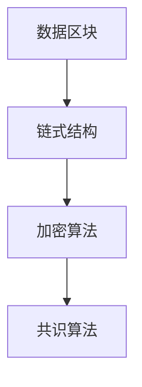
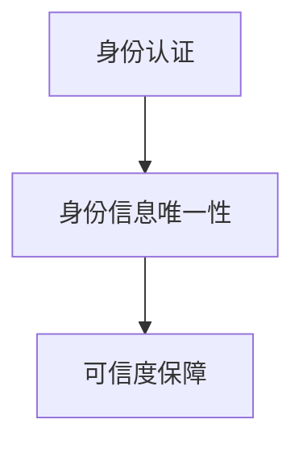

                 


### 文章标题：区块链在数字身份跨境认证中的应用

#### 关键词：区块链，数字身份，跨境认证，加密算法，共识机制，智能合约，分布式账本

#### 摘要：
本文将深入探讨区块链技术在数字身份跨境认证中的应用。首先，我们介绍区块链技术和数字身份的基础知识，然后分析跨境认证的需求和挑战，接着阐述区块链在数字身份跨境认证中的应用场景和实现方法，最后讨论相关法律与监管问题，并对未来发展进行展望。

---

### 第一部分：区块链与数字身份基础

#### 第1章：区块链技术概述

##### 1.1 区块链的定义与特点

区块链是一种分布式数据库技术，通过加密算法和共识机制确保数据的不可篡改和透明性。区块链的基本原理包括数据区块、链式结构、加密算法和共识算法。

**核心概念与联系流程图：**


##### 1.2 区块链的技术架构

区块链的技术架构主要包括数据区块、链式结构、共识算法和网络通信。数据区块是区块链的基本单元，包含一定数量的交易记录。链式结构通过将新的区块附加到链的末尾形成一条不断延伸的数据链。共识算法用于确保网络中的所有节点对数据的共识，网络通信则保证节点之间的数据交换。

**核心算法原理讲解：**

**加密算法：**
加密算法是区块链技术中的重要组成部分，用于保护数据的安全性和隐私性。常见的加密算法包括对称加密（如AES）和非对称加密（如RSA）。

**伪代码：**
```python
# 对称加密算法（AES）
def encrypt_aes(plaintext, key):
    ciphertext = aes_encrypt(plaintext, key)
    return ciphertext

# 非对称加密算法（RSA）
def encrypt_rsa(plaintext, public_key):
    ciphertext = rsa_encrypt(plaintext, public_key)
    return ciphertext
```

##### 1.3 区块链的发展与应用

区块链技术自2008年比特币的诞生以来，已经历了快速的发展。区块链在不同领域的应用案例丰富多样，如金融、供应链、医疗等。

#### 第2章：数字身份的概念与体系

##### 2.1 数字身份的定义与重要性

数字身份是指个人或实体在数字世界中的身份表示，对于保障在线交易的安全性和隐私性具有重要意义。数字身份的定义包括身份认证、身份信息的唯一性和可信度。

**核心概念与联系流程图：**


##### 2.2 数字身份的体系结构

数字身份的体系结构包括身份认证与授权、身份信息的存储与管理、身份隐私保护等部分。身份认证与授权用于验证用户的身份和权限，身份信息的存储与管理保障身份信息的安全和可用性，身份隐私保护则防止身份信息的泄露。

##### 2.3 当前数字身份解决方案

当前主流的数字身份解决方案包括基于密码学的数字签名、基于生物特征的识别技术、区块链身份认证等。每种方案都有其优缺点，适用于不同的应用场景。

#### 第3章：跨境认证的需求与挑战

##### 3.1 跨境认证的需求分析

跨境认证是跨境交易和安全的重要保障。跨境认证的需求包括身份验证的可靠性、交易数据的完整性、跨境认证的便捷性等。

##### 3.2 跨境认证的挑战

跨境认证面临的挑战包括法律法规的差异、技术标准的不一致、数据隐私与安全等问题。这些挑战对跨境认证的效率和安全造成影响。

### 第二部分：区块链在数字身份跨境认证中的应用

#### 第4章：区块链技术在数字身份跨境认证中的应用

##### 4.1 区块链技术在数字身份中的应用

区块链技术在数字身份中的应用包括身份信息的存储与管理、身份认证与授权等。通过区块链技术，可以实现身份信息的不可篡改性和透明性，提高跨境认证的效率和安全。

##### 4.2 区块链在跨境认证中的价值

区块链在跨境认证中的价值主要体现在流程优化、安全保障等方面。区块链技术可以简化跨境认证的流程，提高认证的效率和准确性，同时保障交易数据的完整性和安全性。

##### 4.3 区块链在数字身份跨境认证中的案例分析

通过国内外区块链数字身份跨境认证的案例，分析区块链技术在跨境认证中的应用效果和前景。

#### 第5章：区块链数字身份跨境认证的技术实现

##### 5.1 区块链数字身份跨境认证的技术框架

区块链数字身份跨境认证的技术框架包括身份信息管理模块、身份认证模块、交易处理模块等。通过这些模块的协同工作，实现跨境认证的功能。

##### 5.2 数据加密与隐私保护

数据加密与隐私保护是区块链数字身份跨境认证的重要环节。通过加密算法和隐私保护机制，确保身份信息和交易数据的安全性和隐私性。

##### 5.3 跨境认证流程与协议

跨境认证流程与协议的设计和实现是区块链数字身份跨境认证的关键。通过制定统一的认证流程和协议，提高跨境认证的标准化和便捷性。

#### 第6章：区块链在数字身份跨境认证中的法律与监管问题

##### 6.1 区块链数字身份跨境认证的法律问题

区块链数字身份跨境认证的法律问题包括法律法规的适用性、跨境认证的法律责任等。需要充分考虑各国法律体系的差异，确保跨境认证的合法性。

##### 6.2 区块链数字身份跨境认证的监管挑战

区块链数字身份跨境认证的监管挑战主要包括监管机构的角色、监管机制的构建等。需要建立完善的监管框架，确保跨境认证的合规性和安全性。

##### 6.3 国际合作与法律协调

国际合作与法律协调是区块链数字身份跨境认证的重要保障。通过国际合作，建立统一的法律标准和监管机制，促进跨境认证的顺利进行。

#### 第7章：区块链在数字身份跨境认证中的未来展望

##### 7.1 区块链在数字身份跨境认证中的发展趋势

区块链在数字身份跨境认证中的发展趋势包括技术的持续创新、应用的拓展、政策法规的完善等。随着技术的发展和政策的引导，区块链在数字身份跨境认证中的应用前景广阔。

##### 7.2 区块链数字身份跨境认证的潜在挑战

区块链数字身份跨境认证的潜在挑战包括技术瓶颈、社会接受度等。需要积极应对这些挑战，推动区块链数字身份跨境认证的可持续发展。

##### 7.3 区块链数字身份跨境认证的可持续发展

区块链数字身份跨境认证的可持续发展需要从技术、政策、社会等多个方面进行考虑。通过持续创新、完善政策法规、提高社会接受度，推动区块链数字身份跨境认证的健康发展。

### 附录

#### 附录A：区块链数字身份跨境认证技术术语表

提供区块链数字身份跨境认证相关的技术术语解释，帮助读者更好地理解相关概念。

#### 附录B：区块链数字身份跨境认证相关法律法规汇总

汇总各国区块链数字身份跨境认证相关的法律法规，为读者提供参考。

#### 附录C：区块链数字身份跨境认证项目开发指南

提供区块链数字身份跨境认证项目的开发指南，包括开发环境搭建、源代码实现、代码解读等，帮助读者进行实际应用。

### 作者信息

**作者：** AI天才研究院/AI Genius Institute & 禅与计算机程序设计艺术 /Zen And The Art of Computer Programming

---

本文通过逐步分析区块链、数字身份和跨境认证的核心概念、技术实现、法律与监管问题，全面阐述了区块链在数字身份跨境认证中的应用。文章结构清晰，内容丰富，旨在为读者提供深入了解区块链在数字身份跨境认证中的应用价值和实现方法的参考。希望本文能够对相关领域的专业人士和研究者有所启发。

