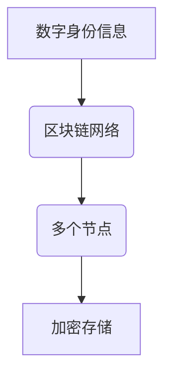
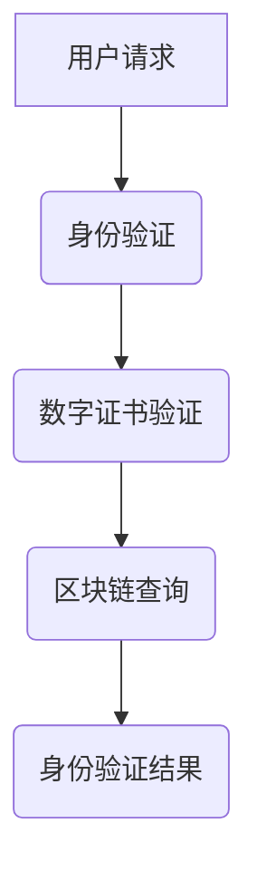
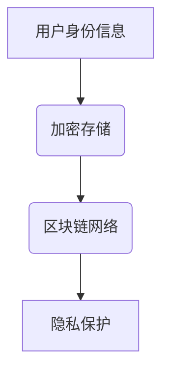

                 

### 文章标题：区块链在数字身份跨境认证中的应用

#### 关键词：区块链，数字身份，跨境认证，安全技术，应用实例

> 摘要：本文深入探讨了区块链技术在数字身份跨境认证中的广泛应用及其潜在优势。首先，对区块链和数字身份的概念进行了详细阐述，并分析了它们之间的内在联系。接着，讨论了跨境认证的需求与挑战，以及区块链技术如何在这些方面提供解决方案。随后，通过具体的算法原理讲解和数学模型，展示了区块链在数字身份跨境认证中的技术实现。文章还通过实际案例分析了区块链技术在该领域的应用效果，并提出了未来发展的建议。本文旨在为区块链在数字身份跨境认证中的研究和实践提供有价值的参考。

## 第一部分：区块链基础

### 第1章：区块链概述

区块链作为一种分布式账本技术，近年来在全球范围内受到了广泛关注。其基本原理是通过加密算法和时间戳技术，将交易记录分散存储在多个节点上，形成一种去中心化的数据库。区块链的不可篡改性和透明性使其在金融、物流、医疗等多个领域具有广泛的应用潜力。

#### 1.1 区块链的定义与特点

区块链是由多个数据块按时间顺序链接而成的链条，每个数据块包含了若干交易记录，并附加了时间戳和哈希值。区块链具有以下主要特点：

- **去中心化**：区块链不依赖于中心化的机构或服务器，所有节点都具有相同的权限，数据存储在多个节点上，提高了系统的容错性和抗攻击能力。
- **不可篡改**：区块链通过加密算法确保数据一旦被记录，就不能被修改或删除，保证了数据的完整性和可靠性。
- **透明性**：区块链上的所有交易记录都是公开透明的，参与者可以随时查看和验证交易记录，提高了数据的可信度。

#### 1.2 区块链的核心技术

区块链的核心技术主要包括加密算法、共识机制、智能合约等。

- **加密算法**：区块链使用非对称加密算法来保证交易的安全性和隐私性。非对称加密算法包括公钥和私钥，公钥用于加密，私钥用于解密。
- **共识机制**：共识机制是区块链节点之间就交易记录达成一致的方式。常见的共识机制包括工作量证明（PoW）、权益证明（PoS）等。
- **智能合约**：智能合约是一种自动执行的合同，当满足特定条件时，合约会自动执行预定的操作。智能合约通过编程语言编写，运行在区块链上，保证了交易的高效性和不可篡改性。

#### 1.3 区块链与数字身份的关系

区块链技术为数字身份提供了安全、透明、可验证的解决方案。在数字身份系统中，用户的身份信息被加密存储在区块链上，并通过多种加密技术保证隐私性和安全性。区块链技术还可以用于身份验证和权限管理，确保用户身份的合法性和唯一性。

## 第二部分：数字身份

### 第2章：数字身份概述

数字身份是指在网络空间中代表个体的身份标识，它是虚拟世界与真实世界之间的桥梁。数字身份在电子商务、金融服务、社交媒体等场景中具有广泛应用，其安全性直接影响到用户的隐私和财产安全。

#### 2.1 数字身份的定义与类型

数字身份包括个人身份和法人身份两种类型：

- **个人身份**：个人数字身份通常包含姓名、出生日期、身份证号码等个人信息，是个人在网络空间中的唯一标识。
- **法人身份**：法人数字身份则包括公司名称、注册号、法定代表人等信息，是企业或机构在网络空间中的唯一标识。

#### 2.2 数字身份的关键技术

数字身份的关键技术主要包括数字证书、生物识别技术、密码学等。

- **数字证书**：数字证书是数字身份的一种验证方式，它由可信第三方（如证书授权中心）签发，用于证明身份的真实性和合法性。
- **生物识别技术**：生物识别技术通过识别个体的生物特征（如指纹、面部识别等）来验证身份，具有高安全性和便利性。
- **密码学**：密码学技术用于加密和解密数字身份信息，保护隐私和安全。

#### 2.3 数字身份的安全与隐私问题

数字身份的安全和隐私问题主要涉及身份信息泄露、身份盗用、隐私侵犯等。区块链技术通过去中心化、加密算法、智能合约等技术手段，提供了一种有效解决数字身份安全与隐私问题的方案。

## 第三部分：跨境认证

### 第3章：跨境认证基础

跨境认证是指在跨国界的情况下，对个人或法人身份的验证。跨境认证的需求源于全球化经济的发展，以及国际贸易、金融服务、国际交流等领域的需求。然而，跨境认证面临着诸多挑战，如跨国认证标准不统一、身份信息泄露风险、认证效率低下等。

#### 3.1 跨境认证的需求与挑战

- **需求**：跨境认证的需求主要包括身份真实性验证、跨国金融服务、国际贸易、国际交流等。
- **挑战**：跨境认证面临的挑战主要有以下几个方面：
  - **跨国认证标准不统一**：各国认证标准不同，导致跨境认证流程复杂、效率低下。
  - **身份信息泄露风险**：跨境认证过程中，身份信息容易泄露，导致用户隐私和安全受到威胁。
  - **认证效率低下**：传统的跨境认证方式往往需要人工干预，认证时间长、效率低下。

#### 3.2 跨境认证的技术手段

- **数字证书**：数字证书是跨境认证的重要技术手段，通过数字证书可以确保身份信息的真实性和合法性。
- **生物识别技术**：生物识别技术可以用于跨境认证，如指纹识别、面部识别等。
- **区块链技术**：区块链技术可以提供去中心化、安全、透明的跨境认证解决方案。

#### 3.3 跨境认证的国际法规与标准

跨境认证的国际法规与标准主要包括以下几方面：

- **数据保护法规**：如欧盟的《通用数据保护条例》（GDPR）等，规定了跨境认证过程中个人数据的使用和保护。
- **跨境认证协议**：各国之间签订的跨境认证协议，规定了认证标准和流程。
- **技术标准**：如ISO/IEC 27001信息安全管理体系标准等，为跨境认证提供了技术指南。

## 第四部分：区块链在数字身份跨境认证中的应用

### 第4章：区块链在数字身份管理中的应用

区块链技术在数字身份管理中具有广泛的应用潜力。通过区块链技术，可以实现对数字身份的安全存储、可靠验证和管理。

#### 4.1 区块链在数字身份存储中的应用

区块链技术可以用于存储数字身份信息，确保身份信息的安全和隐私。以下是一个简单的区块链结构示例：

在这个示例中，数字身份信息被加密存储在区块链网络中的多个节点上，通过加密算法和时间戳技术确保数据的安全性和不可篡改性。

#### 4.2 区块链在数字身份验证中的应用

区块链技术可以用于数字身份验证，确保身份信息的真实性和合法性。以下是一个简单的区块链验证过程：

在这个示例中，用户请求通过数字证书进行身份验证，然后通过区块链查询验证身份信息的真实性和合法性。

#### 4.3 区块链在数字身份隐私保护中的应用

区块链技术可以用于数字身份隐私保护，通过去中心化和加密算法保护用户的隐私。以下是一个简单的区块链隐私保护过程：

在这个示例中，用户身份信息被加密存储在区块链网络上，通过加密算法和时间戳技术保护用户的隐私。

### 第5章：区块链在跨境认证中的应用

区块链技术在跨境认证中具有显著优势，可以有效解决跨境认证的需求与挑战。

#### 5.1 区块链在跨境认证中的优势

- **去中心化**：区块链去中心化的特点使跨境认证过程更加高效、透明，减少了人工干预和中介机构。
- **不可篡改**：区块链的不可篡改特性确保了跨境认证过程中身份信息的真实性和完整性。
- **透明性**：区块链上的所有交易记录都是公开透明的，用户可以随时查看和验证交易记录，提高了跨境认证的可信度。

#### 5.2 区块链在跨境认证中的应用场景

- **国际贸易**：区块链技术可以用于国际贸易中的跨境认证，确保贸易参与者的身份真实性和交易记录的完整性。
- **金融服务**：区块链技术可以用于跨境金融服务中的身份验证和风险控制，提高金融服务的安全性和效率。
- **国际交流**：区块链技术可以用于国际交流中的身份认证，确保参与者的身份真实性和交流记录的可信度。

#### 5.3 区块链在跨境认证中的技术实现

区块链在跨境认证中的技术实现主要包括以下几个方面：

- **身份信息存储**：将跨境认证过程中涉及的身份信息存储在区块链上，通过加密算法和时间戳技术确保数据的安全性和不可篡改性。
- **身份验证**：通过区块链查询和验证身份信息的真实性和合法性，确保跨境认证过程中的身份验证准确无误。
- **交易记录**：将跨境认证过程中的交易记录存储在区块链上，确保交易记录的完整性和可追溯性。

### 第6章：区块链在跨境认证中的案例分析

本章节将分析几个区块链在跨境认证中的应用案例，以展示区块链技术的实际效果和潜力。

#### 6.1 案例一：区块链在跨境贸易中的应用

**案例描述**：某跨国贸易公司使用区块链技术进行跨境认证，确保贸易参与者的身份真实性和交易记录的完整性。

**解决方案**：
- **身份信息存储**：将贸易参与者的身份信息（如公司名称、注册号、法定代表人等）存储在区块链上，通过加密算法和时间戳技术确保数据的安全性和不可篡改性。
- **身份验证**：通过区块链查询和验证贸易参与者的身份信息，确保身份信息的真实性和合法性。
- **交易记录**：将贸易交易记录存储在区块链上，确保交易记录的完整性和可追溯性。

**效果**：通过区块链技术的应用，该跨国贸易公司实现了身份验证的高效、准确和透明，减少了人工干预和中介机构，提高了贸易流程的效率。

#### 6.2 案例二：区块链在跨境金融服务中的应用

**案例描述**：某国际银行使用区块链技术进行跨境金融服务中的身份验证和风险控制。

**解决方案**：
- **身份信息存储**：将客户身份信息存储在区块链上，通过加密算法和时间戳技术确保数据的安全性和不可篡改性。
- **身份验证**：通过区块链查询和验证客户身份信息，确保身份信息的真实性和合法性。
- **风险控制**：利用区块链的智能合约功能，实现跨境金融交易的风险控制，确保交易的安全性。

**效果**：通过区块链技术的应用，该国际银行实现了客户身份验证的高效、准确和透明，提高了跨境金融服务的安全性和效率。

#### 6.3 案例三：区块链在跨境身份认证中的应用

**案例描述**：某国际旅行公司使用区块链技术进行跨境身份认证，确保游客的身份真实性和旅行记录的可信度。

**解决方案**：
- **身份信息存储**：将游客身份信息存储在区块链上，通过加密算法和时间戳技术确保数据的安全性和不可篡改性。
- **身份验证**：通过区块链查询和验证游客身份信息，确保身份信息的真实性和合法性。
- **旅行记录**：将游客旅行记录存储在区块链上，确保旅行记录的完整性和可追溯性。

**效果**：通过区块链技术的应用，该国际旅行公司实现了游客身份验证的高效、准确和透明，提高了游客旅行记录的可信度和安全性。

### 第7章：区块链在数字身份跨境认证中的未来发展

区块链技术在数字身份跨境认证中的应用前景广阔，但同时也面临着一系列挑战。未来，区块链技术有望在以下几个方面实现进一步发展：

#### 7.1 区块链在数字身份跨境认证中的潜在发展方向

- **身份信息标准化**：推动各国身份信息标准化，简化跨境认证流程，提高认证效率。
- **跨链互操作**：实现不同区块链之间的互操作，构建全球化的区块链跨境认证网络。
- **隐私保护**：进一步优化区块链隐私保护技术，确保用户隐私安全。

#### 7.2 区块链在数字身份跨境认证中的挑战与应对策略

- **技术成熟度**：提高区块链技术的成熟度和稳定性，确保大规模应用的安全性和可靠性。
- **法律监管**：制定合理的法律法规，确保区块链跨境认证的合规性和安全性。

#### 7.3 区块链在数字身份跨境认证中的未来趋势

- **跨境认证网络化**：构建全球化的区块链跨境认证网络，实现跨境认证的全球互通。
- **智能化认证**：利用人工智能技术，实现智能化的数字身份跨境认证。

### 附录：区块链与数字身份跨境认证的扩展阅读

#### 附录A：区块链核心概念与联系

- **区块链的定义**：区块链是一种分布式账本技术，通过加密算法和时间戳技术确保数据的安全性和不可篡改性。
- **区块链的核心技术**：包括加密算法、共识机制、智能合约等。

#### 附录B：区块链核心算法原理讲解

- **加密算法**：非对称加密算法，包括公钥和私钥。
- **共识机制**：包括工作量证明（PoW）、权益证明（PoS）等。

#### 附录C：区块链数学模型和数学公式

- **哈希函数**：哈希函数是将输入数据映射为固定长度的字符串。
- **椭圆曲线加密**：椭圆曲线加密是一种高效的非对称加密算法。

#### 附录D：区块链项目实战

- **开发环境搭建**：搭建区块链开发环境，包括节点搭建、网络配置等。
- **源代码实现**：实现区块链的核心功能，如交易记录、身份信息存储等。
- **代码解读与分析**：对源代码进行解读和分析，理解区块链的核心原理。

#### 附录E：最佳实践 tips、小结、注意事项、拓展阅读等内容

- **最佳实践 tips**：在实际应用中，遵循最佳实践，确保系统安全性和可靠性。
- **小结**：总结区块链在数字身份跨境认证中的应用效果和挑战。
- **注意事项**：关注区块链技术的最新发展，遵循法律法规，确保合规性。
- **拓展阅读**：推荐进一步了解区块链和数字身份跨境认证的相关资料。

### 作者信息

**作者：AI天才研究院/AI Genius Institute & 禅与计算机程序设计艺术 /Zen And The Art of Computer Programming**。

本文旨在为区块链在数字身份跨境认证中的研究和实践提供有价值的参考。希望读者能够在阅读本文后，对区块链技术在数字身份跨境认证中的应用有更深入的理解。谢谢阅读！

