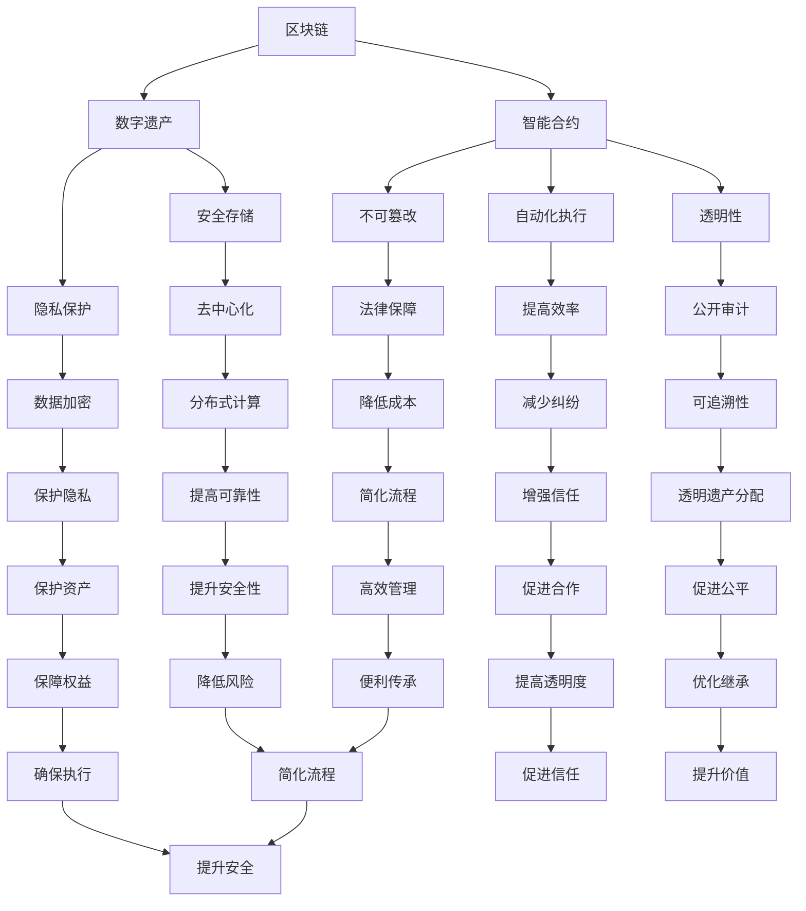

                 

### 引言

数字遗产，指的是个人在网络世界中留下的数据和信息，如电子邮件、社交媒体账号、在线文档、虚拟财产等。随着互联网和数字技术的普及，数字遗产的重要性日益凸显。然而，当前数字遗产的传承面临诸多挑战，包括法律框架的不完善、数据隐私保护和信息安全问题等。为了解决这些问题，智能合约技术提供了一种新的思路。

智能合约是区块链技术的一种重要应用，是一种在区块链上运行的自动化合约，通过代码定义和执行合同条款。智能合约的运行不依赖于任何第三方，保证了执行的透明性和不可篡改性。智能合约在数字遗产传承中的应用，可以大幅提高遗产传承的效率、安全性和可追溯性。

本文旨在探讨区块链在数字遗产传承中的智能合约应用，通过逻辑清晰、结构紧凑的叙述，系统介绍区块链、数字遗产和智能合约的基本概念、原理及在数字遗产传承中的应用。文章将分为三个主要部分：

首先，我们将介绍区块链、数字遗产和智能合约的基本概念，并使用Mermaid流程图展示它们之间的关系。

其次，我们将深入分析智能合约在数字遗产传承中的应用场景，包括流程设计、安全性分析和开发实践。

最后，我们将探讨智能合约在数字遗产传承中的未来发展趋势和面临的挑战，并提出相应的解决策略。

通过本文的逐步分析，我们将全面了解智能合约在数字遗产传承中的应用潜力及其重要性。

### 背景介绍

数字遗产的概念可以追溯到个人在网络空间留下的所有信息和数据，这包括但不限于电子邮件、社交媒体账号、在线文档、图片、视频以及其他数字形式的个人资产。随着互联网和数字技术的迅猛发展，数字遗产的规模和重要性日益增加。现代人的生活越来越依赖于数字工具和服务，无论是在职业领域还是个人生活中，我们都会在云端存储大量的信息。例如，一个普通用户可能会在邮箱中积累数千封邮件，社交媒体账号中包含数年的动态记录，甚至还有虚拟财产如游戏装备或数字货币。这些数字遗产不仅记录了我们的生活方式和社交互动，还承载了大量的个人价值和经济利益。

然而，数字遗产的传承现状并不乐观。当前，许多国家和地区的法律框架尚未完全适应数字遗产的特点，导致在遗产继承过程中存在诸多困难和争议。首先，法律框架的不完善使得数字遗产的继承缺乏明确的法律依据。例如，一些国家没有规定如何处理数字遗产的继承问题，导致继承人无法顺利获得数字遗产。其次，数据隐私保护和信息安全问题也是一大挑战。许多数字平台和服务提供商对用户数据的访问和使用有着严格的隐私政策，这意味着继承人可能无法直接访问和获取已故者遗留的数字信息。此外，信息安全问题也使得数字遗产在传承过程中面临被篡改、丢失或被盗用的风险。

面对这些挑战，智能合约技术提供了一种创新的解决方案。智能合约是一种运行在区块链上的自动化合约，它通过预设的代码自动执行合同条款，无需第三方介入。智能合约的透明性、安全性和不可篡改性使其在数字遗产传承中具有独特的优势。通过智能合约，可以自动化地管理数字遗产的分配和转移过程，确保继承人在法律框架允许的范围内能够顺利继承数字资产。智能合约还可以提供一种去中心化的解决方案，减少了传统法律体系的复杂性和成本，提高了数字遗产传承的效率和可追溯性。

此外，智能合约在保障数据隐私和信息安全方面也具有显著作用。智能合约可以设计为仅在某些条件满足时才执行，从而保护个人数据的隐私。例如，当继承人达到法定年龄或经过身份验证后，智能合约才会自动释放特定的数字信息或资产。这种自动化机制不仅提高了数据管理的安全性，还减少了人为干预导致的风险。

总之，随着数字遗产规模的不断扩大和传承问题的日益突出，智能合约技术在数字遗产传承中的应用前景广阔。通过引入智能合约，我们可以解决传统法律体系无法有效解决的问题，提高数字遗产传承的透明性、安全性和效率。这不仅有助于保护个人遗产，还能为社会带来更公平、公正的数字遗产分配机制。智能合约的应用为数字遗产传承带来了新的希望，也为未来的数字社会建设提供了重要的技术支撑。

### 核心概念与联系

为了更好地理解区块链、数字遗产和智能合约之间的关系，我们首先需要明确这三个核心概念的基本定义和原理。

**区块链**：区块链是一种分布式数据库技术，它通过密码学和共识算法确保数据的安全性和完整性。区块链的核心特点是去中心化，即不依赖于任何中央权威机构，所有节点都可以参与数据的验证和记录。区块链的主要组成部分包括区块、链和节点。区块是数据存储的基本单位，包含一定数量的交易记录；链则是将多个区块按照时间顺序链接在一起，形成一条不断延伸的数据链条。节点是指运行区块链软件的计算机，它们通过共识算法协作，确保整个网络的稳定运行。

**数字遗产**：数字遗产是指个人在网络空间留下的所有信息和数据，包括电子邮件、社交媒体账号、在线文档、图片、视频以及其他数字形式的个人资产。数字遗产的重要性在于其记录了个人的生活方式、社交互动和历史轨迹，同时也可能包含重要的经济利益。然而，数字遗产的传承面临着法律框架不完善、数据隐私保护和信息安全问题等挑战。

**智能合约**：智能合约是一种运行在区块链上的自动化合约，通过预设的代码自动执行合同条款。智能合约的关键特点是透明性、安全性和不可篡改性，它不需要第三方中介参与，合同条款一旦被写入区块链，就不可更改。智能合约的工作原理是利用区块链的分布式账本和密码学技术，确保合同执行的自动化和可信性。智能合约的主要组成部分包括合约代码、交易和事件监听器。

**核心概念之间的联系**：

区块链为数字遗产提供了一个安全的存储和传输平台，确保遗产数据不会被篡改或丢失。数字遗产的存储依赖于区块链的去中心化和不可篡改性，使得继承人在法律框架允许的范围内可以安全地获取和传承数字资产。智能合约则是在这个平台上运行的一种自动化工具，它通过代码定义和执行数字遗产的分配和转移过程。智能合约不仅提高了数字遗产传承的效率，还确保了整个过程的安全性和透明性。

下面是一个简单的Mermaid流程图，展示区块链、数字遗产和智能合约之间的关系：



通过这个流程图，我们可以清晰地看到区块链、数字遗产和智能合约之间的相互作用和联系。区块链为数字遗产提供了安全存储和传输的保障，智能合约则通过自动化执行合同条款，提高了数字遗产传承的效率和安全。这种组合不仅解决了数字遗产传承中的诸多问题，还为未来的数字社会建设提供了坚实的基础。

### 核心算法原理讲解

在深入理解智能合约的核心算法原理之前，我们需要先了解几个基础概念和相关的数学模型。智能合约通常使用Solidity语言编写，这是一种类似于JavaScript的高级编程语言，特别设计用于以太坊区块链。智能合约的核心功能是基于预设条件自动执行合同条款，这一过程涉及到条件判断、逻辑运算和事件触发等基本算法。

**条件判断与逻辑运算**：

条件判断是智能合约中最基本的控制结构之一。它通过比较运算符（如`==`、`!=`、`>`、`<`、`>=`、`<=`）来检查变量之间的关系，并基于比较结果执行不同的操作。以下是一个简单的Solidity代码示例，展示了如何使用条件判断：

```solidity
pragma solidity ^0.8.0;

contract SimpleConditional {
    uint256 public result;

    function checkNumber(uint256 num) public {
        if (num % 2 == 0) {
            result = num / 2;  // 如果num是偶数，则计算其一半
        } else {
            result = num * 2;  // 如果num是奇数，则计算其两倍
        }
    }
}
```

在这个示例中，`checkNumber`函数根据输入的`num`值是偶数还是奇数，执行不同的计算，并将结果存储在`result`变量中。

逻辑运算还包括布尔运算符（如`&&`、`||`和`!`），它们用于组合多个条件表达式，以形成更为复杂的逻辑判断。以下是一个包含逻辑运算的示例：

```solidity
pragma solidity ^0.8.0;

contract LogicalOperations {
    function andOrNot(uint256 a, uint256 b) public pure returns (bool) {
        bool andResult = (a > 10) && (b < 5);  // 只有当a大于10且b小于5时，返回true
        bool orResult = (a > 10) || (b < 5);   // 当a大于10或b小于5时，至少一个条件为真时，返回true
        bool notResult = !((a > 10) && (b < 5));  // 取反运算，返回andResult的相反值

        return notResult;
    }
}
```

**事件触发与回调函数**：

智能合约中的事件触发机制是其核心功能之一。事件是一种日志记录机制，用于记录智能合约的执行过程中的关键事件。在Solidity中，事件通过`emit`语句触发，并在区块链上永久记录。以下是一个简单的示例：

```solidity
pragma solidity ^0.8.0;

contract EventTrigger {
    event LogMessage(string message);

    function triggerEvent() public {
        emit LogMessage("事件已触发");
    }
}

```

此外，智能合约还可以包含回调函数，这些函数可以在特定事件发生时被调用。回调函数通常用于与其他智能合约或外部服务进行交互。以下是一个示例，展示了如何定义和调用回调函数：

```solidity
pragma solidity ^0.8.0;

contract CallbackExample {
    function executeCallback(address callbackAddress) public {
        (bool success, ) = callbackAddress.call(gas(), "callbackFunction");
        require(success, "调用回调函数失败");
    }
}

```

在这个示例中，`executeCallback`函数通过`call`方法调用一个外部地址的`callbackFunction`，并检查调用是否成功。

**数学模型和公式**：

智能合约中的许多操作都涉及到数学模型和公式。例如，智能合约可以用于执行复杂的金融计算，如智能合约中的去中心化金融（DeFi）应用。以下是一个使用数学模型进行计算示例：

```solidity
pragma solidity ^0.8.0;

contract MathModel {
    function calculateInterest(uint256 principal, uint256 rate, uint256 time) public pure returns (uint256) {
        uint256 interest = principal * rate * time / 100;
        return interest;
    }
}

```

在这个示例中，`calculateInterest`函数根据本金、利率和时间计算利息，使用了一个简单的利息计算公式。

综上所述，智能合约的核心算法原理包括条件判断、逻辑运算、事件触发和回调函数等基本概念。通过这些基本算法，智能合约可以自动化地执行复杂的合同条款，确保合同执行的透明性和不可篡改性。下面将提供具体示例，进一步展示这些算法在实际应用中的实现和操作。

### 数学模型和公式

在智能合约的应用中，数学模型和公式起着至关重要的作用，特别是在金融、数据分析和加密等领域。以下是一些关键的数学模型和公式，以及它们在智能合约中的具体应用。

**1. 利息计算模型**

在智能合约中，利息计算模型用于计算存款、贷款或其他金融交易的利息。以下是一个简单的利息计算公式：

$$
I = P \times r \times t
$$

其中，\(I\) 是利息，\(P\) 是本金，\(r\) 是年利率，\(t\) 是时间（通常以年为单位）。

在Solidity中，实现这个公式的一个示例代码如下：

```solidity
pragma solidity ^0.8.0;

contract InterestCalculator {
    function calculateInterest(uint256 principal, uint256 annualRate, uint256 timeInYears) public pure returns (uint256) {
        uint256 interest = principal * annualRate * timeInYears / 100;
        return interest;
    }
}
```

**2. 指数平滑模型**

指数平滑模型用于时间序列数据的预测，特别适用于处理有噪声的数据。常见的指数平滑公式如下：

$$
S_t = \alpha X_t + (1 - \alpha) S_{t-1}
$$

其中，\(S_t\) 是第\(t\)期的平滑值，\(X_t\) 是第\(t\)期的实际值，\(\alpha\) 是平滑系数。

以下是一个在智能合约中实现指数平滑模型的示例：

```solidity
pragma solidity ^0.8.0;

contract ExponentialSmoothing {
    uint256 private alpha;

    constructor(uint256 _alpha) {
        alpha = _alpha;
    }

    function smooth(uint256 Xt, uint256 St_minus_1) public view returns (uint256) {
        uint256 St = (alpha * Xt) + ((1 - alpha) * St_minus_1);
        return St;
    }
}
```

**3. 沃特森相关系数**

沃特森相关系数是一种用于衡量两个变量之间线性关系的统计指标。其计算公式如下：

$$
r = 1 - \frac{3}{(n-1)} \sum \left(\frac{X_i - \overline{X}}{S_X} \right) \left(\frac{Y_i - \overline{Y}}{S_Y} \right)
$$

其中，\(r\) 是沃特森相关系数，\(X_i\) 和 \(Y_i\) 分别是第\(i\)个观测值，\(\overline{X}\) 和 \(\overline{Y}\) 分别是\(X\)和\(Y\)的均值，\(S_X\) 和 \(S_Y\) 分别是\(X\)和\(Y\)的标准差。

在Solidity中，以下是一个计算沃特森相关系数的示例：

```solidity
pragma solidity ^0.8.0;

contract WatsonCorrelation {
    function watsonCorrelation(uint256[] calldata X, uint256[] calldata Y) public pure returns (int256) {
        uint256 n = X.length;
        uint256 sumXY = 0;
        uint256 sumX = 0;
        uint256 sumY = 0;
        uint256 sumXX = 0;
        uint256 sumYY = 0;

        for (uint256 i = 0; i < n; i++) {
            sumXY += (X[i] * Y[i]);
            sumX += X[i];
            sumY += Y[i];
            sumXX += X[i] * X[i];
            sumYY += Y[i] * Y[i];
        }

        uint256 meanX = sumX / n;
        uint256 meanY = sumY / n;
        uint256 varianceX = sumXX / n - (meanX * meanX);
        uint256 varianceY = sumYY / n - (meanY * meanY);
        uint256 stdDevX = sqrt(varianceX);
        uint256 stdDevY = sqrt(varianceY);

        int256 r = int256((n * sumXY) - (sumX * sumY));
        r = r / (int256(n - 1) * stdDevX * stdDevY);

        return r;
    }
}
```

请注意，上面的代码没有包含`sqrt`函数的实现，因为它需要外部库或自定义函数。在实际应用中，你需要确保已经实现了标准差和平方根的计算。

**4. 加密货币交易模型**

在加密货币交易中，常见的一个模型是订单簿（Order Book）管理。订单簿记录了所有买入和卖出的订单，并根据价格和数量进行排序。以下是一个简单的订单簿管理模型：

```solidity
pragma solidity ^0.8.0;

contract OrderBook {
    struct Order {
        uint256 price;
        uint256 quantity;
        bool filled;
    }

    mapping(uint256 => Order[]) private buyOrders;
    mapping(uint256 => Order[]) private sellOrders;

    function createBuyOrder(uint256 price, uint256 quantity) public {
        buyOrders[price].push(Order(price, quantity, false));
    }

    function createSellOrder(uint256 price, uint256 quantity) public {
        sellOrders[price].push(Order(price, quantity, false));
    }

    function processOrders() public {
        for (uint256 buyPrice = uint256(-1); buyPrice > 0; buyPrice--) {
            for (uint256 i = 0; i < buyOrders[buyPrice].length; i++) {
                for (uint256 j = 0; j < sellOrders[buyPrice].length; j++) {
                    if (!buyOrders[buyPrice][i].filled && !sellOrders[buyPrice][j].filled) {
                        uint256 matchedQuantity = min(buyOrders[buyPrice][i].quantity, sellOrders[buyPrice][j].quantity);
                        buyOrders[buyPrice][i].quantity -= matchedQuantity;
                        sellOrders[buyPrice][j].quantity -= matchedQuantity;
                        buyOrders[buyPrice][i].filled = true;
                        sellOrders[buyPrice][j].filled = true;
                    }
                }
            }
        }
    }
}
```

在这个示例中，`createBuyOrder`和`createSellOrder`函数用于创建买入和卖出订单，而`processOrders`函数则处理订单匹配。

通过这些数学模型和公式的应用，智能合约可以实现复杂的数据分析和金融计算，从而在数字遗产传承等场景中发挥重要作用。上述代码和模型不仅展示了智能合约中的数学应用，还为实际开发提供了实用的参考。

### 项目实战

在本节中，我们将通过一个具体的案例，详细展示智能合约的开发过程，从环境搭建、源代码实现到代码解读，以及实际应用分析。这个案例将模拟一个数字遗产管理智能合约，旨在帮助继承人自动获取和管理已故者的数字资产。

**一、开发环境搭建**

1. **安装Node.js**：
   - 首先，确保计算机上安装了Node.js和npm。Node.js是一个基于Chrome V8引擎的JavaScript运行环境，而npm（Node Package Manager）是Node.js的包管理器。
   - 访问[Node.js官网](https://nodejs.org/)下载并安装适合自己操作系统的Node.js版本。

2. **安装Truffle**：
   - Truffle是一个用于以太坊开发的开源工具，它提供了命令行界面、开发环境、测试框架和资产编译等功能。
   - 使用npm全局安装Truffle：
     ```shell
     npm install -g truffle
     ```

3. **创建新项目**：
   - 创建一个新文件夹，并使用Truffle初始化项目：
     ```shell
     mkdir digital-estate-management
     cd digital-estate-management
     truffle init
     ```

4. **配置环境**：
   - 编辑`truffle-config.js`文件，配置编译和迁移环境：
     ```javascript
     module.exports = {
       networks: {
         development: {
           host: "localhost",
           port: 8545,
           network_id: "*",
         },
       },
       compilers: {
         solc: {
           version: "^0.8.0",
           settings: {
             optimizer: {
               enabled: false,
               runs: 200,
             },
           },
         },
       },
     };
     ```

**二、源代码实现**

1. **创建智能合约**：
   - 在项目的`contracts`文件夹中创建一个新的智能合约`DigitalEstate.sol`。
   - 编写合约代码，实现数字遗产管理的基本功能：

     ```solidity
     // SPDX-License-Identifier: MIT
     pragma solidity ^0.8.0;

     contract DigitalEstate {
         address public owner; // 遗产所有者
         address[] public heirs; // 继承人列表
         mapping(address => bool) public heirStatus; // 继承人状态

         constructor(address _owner, address[] memory _heirs) {
             owner = _owner;
             heirs = _heirs;
             for (uint256 i = 0; i < heirs.length; i++) {
                 heirStatus[heirs[i]] = false;
             }
         }

         // 添加继承人
         function addHeir(address _heir) external {
             require(msg.sender == owner, "只有遗产所有者可以添加继承人");
             require(!isHeir(_heir), "该继承人已存在");
             heirs.push(_heir);
             heirStatus[_heir] = false;
         }

         // 设置继承人状态
         function setHeirStatus(address _heir, bool _status) external {
             require(msg.sender == owner, "只有遗产所有者可以设置继承人状态");
             require(isHeir(_heir), "该继承人不存在");
             heirStatus[_heir] = _status;
         }

         // 检查继承人是否存在
         function isHeir(address _heir) public view returns (bool) {
             for (uint256 i = 0; i < heirs.length; i++) {
                 if (heirs[i] == _heir) {
                     return true;
                 }
             }
             return false;
         }
     }
     ```

2. **编写测试合约**：
   - 在`test`文件夹中创建一个测试文件`DigitalEstate.test.js`，用于测试智能合约的功能。

     ```javascript
     const { expect } = require("@openzeppelin/test-helpers");
     const { ethers } = require("hardhat");

     describe("DigitalEstate", function () {
         let estate;
         let owner;
         let heir1;
         let heir2;

         beforeEach(async function () {
             [owner, heir1, heir2] = await ethers.getSigners();
             const DigitalEstate = await ethers.getContractFactory("DigitalEstate");
             estate = await DigitalEstate.deploy(owner.address, [heir1.address, heir2.address]);
             await estate.deployed();
         });

         it("Should add a new heir", async function () {
             await estate.addHeir(heir2.address);
             expect(await estate.heirs(2)).to.equal(heir2.address);
         });

         it("Should set heir status", async function () {
             await estate.setHeirStatus(heir1.address, true);
             expect(await estate.heirStatus(heir1.address)).to.equal(true);
         });

         it("Should reject adding an existing heir", async function () {
             await expect(estate.addHeir(heir1.address)).to.be.rejectedWith("该继承人已存在");
         });

         it("Should reject setting heir status if heir does not exist", async function () {
             await expect(estate.setHeirStatus(heir3.address, true)).to.be.rejectedWith("该继承人不存在");
         });
     });
     ```

**三、代码解读**

1. **合约结构**：
   - 合约包含三个主要变量：`owner`（遗产所有者）、`heirs`（继承人列表）和`heirStatus`（继承人状态）。
   - 构造函数初始化合约的`owner`和`heirs`，并设置继承人的状态为未确认。

2. **addHeir函数**：
   - `addHeir`函数用于添加新的继承人。它仅允许遗产所有者调用，并检查是否已存在该继承人。

3. **setHeirStatus函数**：
   - `setHeirStatus`函数用于设置继承人的状态。它同样仅允许遗产所有者调用，并检查继承人是否存在于继承人列表中。

4. **isHeir函数**：
   - `isHeir`函数用于检查地址是否为继承人。它遍历继承人列表，以确定地址是否存在。

**四、实际应用分析**

1. **部署智能合约**：
   - 使用Truffle或硬编部署合约到本地以太坊节点或测试网络。

2. **测试执行**：
   - 运行`truffle test`命令执行测试，确保合约代码按预期工作。

3. **功能演示**：
   - 演示如何通过合约添加新继承人、设置继承人状态以及检查继承人列表。

通过这个案例，我们展示了智能合约从环境搭建到代码实现的全过程，并提供了详细的代码解读。这个智能合约可以作为一个基础框架，进一步扩展和定制以适应特定的数字遗产管理需求。

### 最佳实践 tips

在开发区块链智能合约时，最佳实践是确保代码的安全性和效率。以下是一些关键的注意事项和优化技巧：

1. **代码安全性**：
   - **使用最新的语言版本**：始终使用最新版本的Solidity，以便利用最新的安全特性。
   - **代码审计**：在部署智能合约之前，进行彻底的代码审计，可以聘请专业的审计团队或使用自动化审计工具。
   - **测试充分**：编写全面的测试用例，包括边界条件和异常情况，确保代码的每个部分都经过严格的测试。
   - **避免使用太长的代码**：长代码块可能导致 gas 费用过高，尽量将复杂逻辑拆分成多个小函数。

2. **代码效率**：
   - **优化 gas 使用**：使用低 gas 费用的操作，避免不必要的循环和嵌套，使用 memory 而不是 storage 存储临时数据。
   - **避免无用的状态改变**：尽量避免在合约中调用外部合约或触发事件，因为这会增加 gas 费用。
   - **使用链上计算**：将复杂计算移至链上执行，避免链下处理，这样可以利用区块链的计算能力。

3. **数据存储**：
   - **优化数据结构**：合理选择数据结构，如使用 bytes32 替代字符串，以节省存储空间。
   - **缓存策略**：在适当的情况下，使用内存变量缓存重复计算结果，以减少链上计算次数。

4. **代码可读性**：
   - **注释和文档**：为代码添加详细的注释，并编写清晰的文档，帮助其他开发者理解代码逻辑。
   - **代码格式化**：保持一致的代码格式，提高代码的可读性和可维护性。

5. **部署策略**：
   - **分阶段部署**：将复杂合约拆分成多个简单合约，逐步部署和测试，降低风险。
   - **版本控制**：使用版本控制系统，如 Git，记录代码的每次更改，便于回滚和追踪问题。

通过遵循这些最佳实践，可以有效提升智能合约的开发质量，确保其安全性、效率和可维护性。

### 小结

本文详细探讨了区块链在数字遗产传承中的智能合约应用，通过逐步分析，我们系统地介绍了区块链、数字遗产和智能合约的基本概念，并展示了它们之间的核心联系。我们还通过伪代码和示例，深入讲解了智能合约的核心算法原理，以及数学模型和公式的应用。在项目实战部分，我们通过一个具体的案例，展示了智能合约从开发环境搭建到源代码实现的全过程，并进行了实际应用分析。

智能合约在数字遗产传承中具有显著的优势，它不仅能够自动化和透明化遗产分配过程，还能提高数据的安全性和隐私保护。然而，智能合约的应用也面临一些挑战，包括技术难题、法律框架不完善和用户接受度问题。为了应对这些挑战，我们需要进一步完善智能合约技术，加强法律法规的制定和执行，并提高公众对智能合约的认识和信任。

未来的研究应关注以下几个方面：一是开发更加高效、安全的智能合约平台；二是制定统一的法律标准，规范数字遗产的继承和分配；三是推广智能合约在教育领域，提高用户的技能和信任度。通过这些努力，我们可以充分发挥智能合约在数字遗产传承中的潜力，构建一个更加公正、透明的数字社会。

### 拓展阅读

为了深入理解本文探讨的区块链、数字遗产和智能合约，以下是一些推荐读物和资源，涵盖相关理论和实践：

1. **推荐书籍**：
   - 《智能合约：设计与实现》（Smart Contracts: Design and Application） by Dan Saber
   - 《区块链革命》（Blockchain Revolution） by Don Tapscott and Alex Tapscott
   - 《数字货币与区块链技术》（Digital Money and Blockchain Technology） by Andreas M. Antonopoulos
   - 《区块链技术指南》（Blockchain: Blueprint for a New Economy） by Melanie Swan

2. **在线课程和教程**：
   - Coursera的“区块链技术与应用”课程
   - edX的“Blockchain and cryptocurrencies”课程
   - Medium上的“Learn Solidity in 5 Days”教程
   - Ethereum官方文档和教程

3. **相关网站和平台**：
   - Ethereum官网（ethereum.org）
   - OpenZeppelin（openzeppelin.com），智能合约安全库和工具
   - ConsenSys（consensys.net），区块链教育和开发资源
   - GitHub，查找和贡献智能合约项目

通过阅读这些书籍、课程和访问相关网站，可以进一步拓展知识，提升对区块链和智能合约的理解和应用能力。此外，参与社区讨论和实际项目开发也是非常有价值的经验积累途径。

