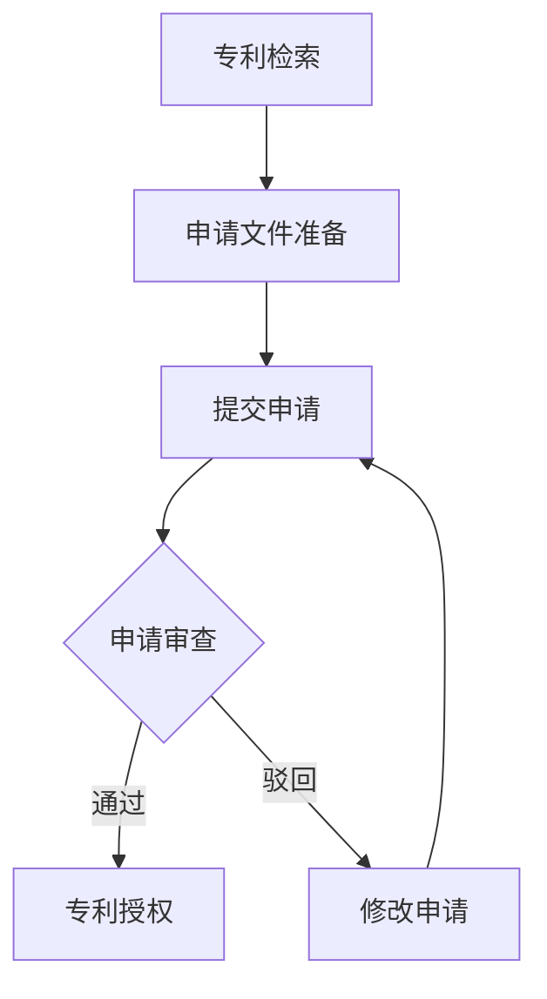

                 

## 文章标题

《区块链在知识产权保护中的应用：简化专利申请和管理》

### 关键词

区块链，知识产权，专利申请，专利管理，去中心化，智能合约，哈希算法，共识机制

### 摘要

本文将深入探讨区块链技术在知识产权保护中的应用，特别是如何简化专利申请和管理的流程。通过分析区块链的核心技术，如哈希算法和共识机制，以及智能合约的应用，我们将阐述区块链如何提高专利的透明度、安全性和可追溯性。文章还将详细介绍专利申请流程的优化，以及专利管理系统的设计原则和实施步骤。通过实际案例的分析，我们将展示区块链在知识产权保护中的实际效果，并提出未来的发展趋势和挑战。

## 导言

知识产权是现代社会中不可或缺的组成部分，它涵盖了专利、商标、版权和商业秘密等多种形式。知识产权的创造、保护和管理对于企业和国家的发展具有重要意义。然而，传统的知识产权保护方式存在许多局限性，如信息不透明、安全性低、维权成本高和跨国协作困难等问题。随着区块链技术的迅猛发展，人们开始探索如何利用这一新兴技术来简化知识产权保护流程，提高其效率和质量。

区块链技术以其去中心化、透明性和不可篡改的特性，被认为在知识产权保护领域具有巨大的潜力。通过区块链，专利申请和管理的透明度、安全性和可追溯性将得到显著提升。本文旨在通过详细探讨区块链在知识产权保护中的应用，特别是专利申请和管理方面的应用，为读者提供一个全面的视角，了解这一新兴技术的实际价值。

## 区块链技术基础

### 区块链的定义

区块链是一种分布式数据库技术，它通过加密和分布式共识机制确保数据的不可篡改性和透明性。区块链由多个区块组成，每个区块包含一定数量的交易记录，这些区块按照时间顺序链接在一起，形成一条不可篡改的链。区块链的核心特点包括去中心化、透明性和安全性。

### 区块链的核心技术

1. **哈希算法**：哈希算法是区块链技术的基础，它可以将任意长度的数据转换成固定长度的哈希值。这个哈希值具有唯一性，即相同的输入数据会产生相同的哈希值，而任何微小的改变都会导致哈希值的巨大变化。这种特性确保了区块链数据的不可篡改性。

2. **链式结构**：区块链采用链式结构，每个区块都包含一个指向前一个区块的哈希值。这种结构使得区块链具有连续性和不可篡改性。

3. **共识机制**：共识机制是区块链网络中各个节点达成共识的一种算法。它确保所有节点对区块链的状态和最新数据达成一致。常见的共识机制包括工作量证明（PoW）、权益证明（PoS）和委托权益证明（DPoS）等。

4. **智能合约**：智能合约是一种自动执行的合约，它在区块链上存储和执行代码。智能合约基于图灵完备的编程语言编写，能够根据预设的规则自动执行合约条款，无需人工干预。

### 区块链与传统数据库的区别

传统数据库通常集中存储数据，依赖于中心化的服务器来管理数据。而区块链是一种去中心化的分布式数据库，数据存储在多个节点上，任何单一节点都无法控制整个网络。此外，区块链的数据一旦被写入，便不可篡改，而传统数据库的数据则容易受到篡改。此外，区块链的透明性和安全性也远高于传统数据库。

## 知识产权保护原理

### 知识产权的定义与分类

知识产权是指人类智力劳动创造的成果所享有的权利。它主要包括以下几类：

1. **专利**：专利是对发明创造的独占性权利，包括发明专利、实用新型专利和外观设计专利。
2. **商标**：商标是用于区别不同商品或服务的标识，如文字、图形、颜色等。
3. **版权**：版权是对文学、艺术和科学作品的独占性权利，包括著作权、邻接权等。
4. **商业秘密**：商业秘密是指不为公众所知悉、具有商业价值并采取保密措施的技术信息和经营信息。

### 知识产权保护的法律法规

知识产权保护在全球范围内都有相应的法律法规。例如：

- **《专利法》**：规定了专利的申请、审查、授权、保护和诉讼等方面的内容。
- **《商标法》**：规定了商标的注册、使用、保护和管理等方面的内容。
- **《著作权法》**：规定了著作权的保护范围、权利行使、侵权处理等方面的内容。
- **《反不正当竞争法》**：规定了商业秘密的保护范围、侵权行为和处理方式等方面的内容。

### 知识产权侵权与维权

知识产权侵权是指未经授权使用他人知识产权的行为。常见的侵权行为包括专利侵权、商标侵权、版权侵权和商业秘密侵权等。知识产权维权是保护权利人合法权益的重要手段，通常包括以下步骤：

1. **初步调查**：确认是否存在侵权行为，收集相关证据。
2. **谈判和解**：与侵权方进行谈判，争取达成和解协议。
3. **申请仲裁或诉讼**：如果无法通过谈判解决，可以向仲裁机构申请仲裁或向法院提起诉讼。
4. **执行判决**：如果侵权方被判定侵权，权利人可以申请执行判决，包括赔偿损失、停止侵权行为等。

## 专利申请流程

### 专利申请的基本步骤

专利申请流程通常包括以下步骤：

1. **专利检索**：在申请专利之前，需要对现有技术进行检索，以确定发明是否具有新颖性和创造性。
2. **申请文件的准备**：根据检索结果，准备专利申请文件，包括专利说明书、权利要求书、摘要和图纸等。
3. **专利申请的提交**：将专利申请文件提交给专利局或相应的国际专利组织。
4. **专利申请的审批**：专利局对专利申请进行审查，包括形式审查和实质审查。如果申请符合要求，专利局将授予专利权。
5. **专利授权和维权**：专利权被授予后，权利人可以依法维权，防止他人侵权。

### 专利申请的提交材料

专利申请的提交材料通常包括：

1. **专利说明书**：详细描述发明的技术方案和实施例。
2. **权利要求书**：明确专利权的保护范围。
3. **摘要**：简要概括发明的主要技术内容。
4. **图纸**：用于展示发明的结构或操作过程。
5. **其他必要的文件**：如优先权证明、优先权文件等。

### 专利申请过程中的注意事项

1. **新颖性和创造性**：发明必须具有新颖性和创造性，即与现有技术相比有显著的改进。
2. **申请文件的撰写**：申请文件需要清晰、准确、完整，避免因表述不清导致申请被驳回。
3. **避免重复申请**：避免重复申请同一发明，否则可能导致专利权无效。
4. **及时提交答复**：在专利申请审查过程中，需要及时提交各种答复和意见，以免影响审查进度。

## 专利管理系统设计

### 专利管理系统的功能模块

专利管理系统通常包括以下功能模块：

1. **专利检索模块**：用于检索国内外专利信息，帮助用户了解现有技术的状况。
2. **专利申请管理模块**：用于管理专利申请的全过程，包括申请文件的撰写、提交、审批等。
3. **专利维护管理模块**：用于维护已授权专利的状态，包括续费、变更、失效等。
4. **专利分析报告模块**：用于生成专利分析报告，帮助用户了解专利竞争状况和趋势。

### 专利管理系统的前端设计

专利管理系统的前端设计需要考虑用户体验和操作便捷性。以下是一些设计原则：

1. **简洁明了的界面**：界面设计应简洁明了，避免复杂的布局和操作。
2. **友好的用户交互**：提供直观、便捷的用户交互方式，如拖拽、筛选、搜索等。
3. **响应式设计**：适应不同设备尺寸和分辨率，提供一致的用户体验。

### 专利管理系统的后端设计

专利管理系统的后端设计需要考虑数据存储、处理和安全等方面。以下是一些设计要点：

1. **数据库设计**：设计合适的数据库结构，确保数据的完整性和一致性。
2. **服务端架构**：选择合适的服务端架构，如微服务架构，提高系统的可扩展性和可维护性。
3. **安全性**：确保系统的安全性，如数据加密、访问控制、安全审计等。

## 区块链在专利管理中的应用

### 区块链技术在专利管理中的应用场景

区块链技术在专利管理中的应用主要体现在以下几个方面：

1. **专利申请的透明性**：通过区块链，专利申请的每一个步骤都可以被记录和追踪，提高专利申请的透明度。
2. **专利交易的便捷性**：区块链可以实现专利的快速交易，减少交易流程和时间。
3. **专利维权的有效性**：区块链的不可篡改特性有助于维权，确保专利权利人的合法权益。

### 区块链专利管理系统实例

以下是一个区块链专利管理系统的实例：

1. **系统架构设计**：
   - **前端**：采用Vue.js框架，实现用户友好的界面。
   - **后端**：采用Node.js和MongoDB，实现数据存储和处理。
   - **区块链**：采用以太坊区块链，实现专利信息的记录和验证。

2. **系统功能实现**：
   - **专利检索**：通过区块链上的智能合约，实现专利信息的实时检索。
   - **专利申请**：用户可以在前端界面提交专利申请，后端将数据写入区块链。
   - **专利管理**：用户可以查看和管理自己的专利，包括续费、变更等。
   - **专利交易**：实现专利的快速交易，减少交易流程。

## 案例分析

### 案例一：区块链专利管理系统的构建

1. **项目背景**：
   - 随着专利数量的激增，传统的专利管理系统已经无法满足企业对专利信息实时性、安全性和透明性的需求。
   - 区块链技术的兴起为专利管理系统提供了新的解决方案。

2. **技术选型**：
   - **区块链**：采用以太坊区块链，因其成熟的技术和广泛的应用。
   - **前端框架**：采用Vue.js，因其易用性和良好的用户体验。
   - **后端框架**：采用Node.js，因其高效和易于扩展。

3. **实施步骤**：
   - **需求分析**：了解企业的具体需求，明确系统的功能模块。
   - **系统设计**：设计系统架构和数据库结构，确保系统的稳定性和安全性。
   - **开发与测试**：按照设计进行开发和测试，确保功能的完整性和可靠性。
   - **部署上线**：将系统部署到服务器，确保系统的稳定运行。

4. **成效评估**：
   - **提高专利申请的透明度**：通过区块链技术，专利申请的每一个步骤都被记录在链上，提高了透明度。
   - **减少专利交易流程**：区块链实现了专利的快速交易，减少了交易流程和时间。
   - **增强专利维权的有效性**：区块链的不可篡改特性有助于维权，确保专利权利人的合法权益。

### 案例二：区块链在专利维权中的应用

1. **案例背景**：
   - 随着专利纠纷的增多，传统的维权方式存在时间成本高、证据易被篡改等问题。
   - 区块链技术为专利维权提供了新的解决方案。

2. **应用场景**：
   - **证据收集与存储**：通过区块链技术，将专利纠纷的证据上链，确保证据的真实性和完整性。
   - **争议解决**：通过智能合约自动执行裁决结果，提高争议解决的效率。

3. **解决方案**：
   - **智能合约**：设计智能合约，实现自动执行裁决结果，减少人为干预。
   - **链上证据存储**：将证据存储在区块链上，确保其不可篡改。
   - **透明投票机制**：通过区块链实现投票机制的透明性，确保裁决过程的公正。

4. **预期效果**：
   - **降低维权成本**：通过区块链技术，降低专利维权的时间和费用。
   - **提高维权效率**：智能合约和透明投票机制有助于提高维权效率。
   - **增强维权证据的可靠性**：区块链技术确保证据的真实性和完整性，增强维权证据的可靠性。

## 未来发展趋势与挑战

### 区块链在知识产权保护中的未来发展趋势

1. **技术不断创新**：随着区块链技术的不断发展，更多先进的技术将被应用到知识产权保护中，如分布式存储、隐私保护等。
2. **法律法规完善**：各国将不断完善知识产权保护法律法规，为区块链技术在知识产权保护中的应用提供更好的法律环境。
3. **市场应用扩大**：区块链技术在知识产权保护中的应用将逐步扩大，涵盖更多领域，如版权、商标、商业秘密等。

### 区块链在知识产权保护中的挑战

1. **技术安全**：区块链技术的安全性和稳定性仍需进一步提高，以应对潜在的安全威胁。
2. **法律合规**：区块链技术的应用需要遵循相关法律法规，特别是在跨国应用中，面临复杂的法律合规问题。
3. **实施成本**：区块链技术的实施和维护成本较高，需要企业进行充分的经济评估。

## 结论

区块链技术在知识产权保护中的应用具有显著的优势，如提高透明度、安全性和可追溯性。通过简化专利申请和管理流程，区块链为知识产权保护提供了新的解决方案。尽管面临一些挑战，但区块链技术的未来发展前景依然广阔。我们期待区块链技术在知识产权保护领域发挥更大的作用，推动知识产权保护进入一个全新的时代。

### 作者信息

作者：AI天才研究院/AI Genius Institute & 禅与计算机程序设计艺术 /Zen And The Art of Computer Programming

### 最佳实践 Tips

- **重视数据安全**：在应用区块链技术时，要特别关注数据的安全和隐私保护。
- **遵循法律法规**：在区块链技术的应用过程中，要确保符合相关法律法规，避免法律风险。
- **持续技术创新**：紧跟区块链技术的发展趋势，不断探索新的应用场景和技术突破。

### 小结

本文通过详细探讨区块链在知识产权保护中的应用，特别是专利申请和管理的简化流程，展示了区块链技术的巨大潜力。我们期待区块链技术在知识产权保护领域发挥更大的作用，为知识产权保护带来新的机遇和挑战。

### 注意事项

- **技术安全**：在应用区块链技术时，要确保数据的安全和隐私保护，采取有效的安全措施。
- **法律合规**：要遵循相关法律法规，特别是在跨国应用中，要了解并遵守不同国家的法律要求。
- **成本控制**：在实施区块链技术时，要充分考虑成本，进行经济评估，避免不必要的开支。

### 拓展阅读

- 《区块链：从原理到实践》
- 《智能合约：设计与实现》
- 《知识产权法律实务》

## 附录

### Mermaid 流程图

以下是用于描述专利申请流程的Mermaid流程图：



### 伪代码

以下是用于描述智能合约的伪代码：

```plaintext
function patentApplication(innovationDescription, inventorDetails) {
    if (isNovel(innovationDescription)) {
        storeData("patentRequests", {
            "description": innovationDescription,
            "inventor": inventorDetails,
            "status": "pending"
        });
        return "Application submitted successfully";
    } else {
        return "Innovation is not novel";
    }
}

function isNovel(innovationDescription) {
    // Implement logic to check novelty
    return true; // Placeholder
}
```

### 数学公式

以下是用于描述哈希算法的数学公式：

$$
H = hash(input)
$$

其中，\( H \) 是哈希值，\( hash \) 是哈希函数，\( input \) 是输入数据。

### 项目实战

以下是构建区块链专利管理系统的项目实战：

1. **开发环境搭建**：
   - 安装Node.js、npm、MongoDB、Truffle等工具。
   - 配置以太坊本地节点。

2. **源代码实现**：
   - 编写智能合约，实现专利申请、检索、管理和交易功能。
   - 使用Truffle框架进行智能合约的部署和测试。

3. **代码解读**：
   - 分析智能合约的代码，理解其功能和工作原理。
   - 使用Web3.js库与区块链进行交互。

4. **代码应用解读与分析**：
   - 测试系统的功能，确保其正确性和可靠性。
   - 分析系统在实际应用中的表现和效果。

5. **实际案例分析和详细讲解剖析**：
   - 分析实际案例，如某企业的区块链专利管理系统应用。
   - 详细讲解系统的工作流程和技术实现。

6. **项目小结**：
   - 总结项目的成功经验和面临的挑战。
   - 提出未来改进和发展的方向。

