                 

### 文章标题：区块链在跨境贸易结算中的应用

> 关键词：区块链、跨境贸易结算、智能合约、分布式账本、支付流程、供应链管理、信用评估、跨境支付平台

> 摘要：本文将深入探讨区块链技术在跨境贸易结算中的应用，从基础概念、技术优势到实际案例分析，全面解析区块链如何提升跨境贸易结算的效率、降低成本、增强安全性，为未来的区块链跨境贸易结算提供有益的参考。

## 目录大纲

### 第一部分：区块链与跨境贸易结算概述

- **1.1 区块链技术简介**
  - 区块链的基本概念
  - 区块链的核心特性
  - 区块链的发展历程

- **1.2 跨境贸易结算现状**
  - 跨境贸易结算的痛点
  - 传统跨境支付体系的局限性
  - 区块链在跨境贸易结算中的应用潜力

- **1.3 区块链在跨境贸易结算中的优势**
  - 安全性
  - 透明性
  - 高效性
  - 可追溯性

- **1.4 区块链跨境贸易结算系统架构**
  - 系统整体架构
  - 节点与共识算法
  - 数据存储与管理

### 第二部分：区块链技术在跨境贸易结算中的应用

- **2.1 区块链在跨境支付中的应用**
  - 支付流程
  - 智能合约的应用
  - 跨境支付案例解析

- **2.2 区块链在贸易融资中的应用**
  - 融资流程
  - 智能合约与供应链金融
  - 贸易融资案例解析

- **2.3 区块链在信用评估中的应用**
  - 信用评估模型
  - 区块链对信用评估的影响
  - 信用评估案例解析

- **2.4 区块链在供应链管理中的应用**
  - 供应链可视化
  - 物流信息追踪
  - 供应链金融解决方案

- **2.5 区块链在跨境贸易保险中的应用**
  - 保险合同管理
  - 保险理赔流程
  - 保险案例解析

### 第三部分：区块链跨境贸易结算案例分析

- **3.1 案例一：区块链跨境支付平台**
  - 平台架构
  - 支付流程
  - 实际应用效果分析

- **3.2 案例二：区块链供应链金融解决方案**
  - 解决方案架构
  - 融资流程
  - 解决方案优势分析

- **3.3 案例三：区块链跨境保险平台**
  - 平台架构
  - 保险产品与服务
  - 平台运营效果分析

### 第四部分：区块链跨境贸易结算的未来发展趋势

- **4.1 区块链技术的发展趋势**
  - 新型共识算法
  - 分布式存储技术
  - 跨链技术

- **4.2 区块链跨境贸易结算的挑战与机遇**
  - 技术挑战
  - 政策法规挑战
  - 商业模式创新

- **4.3 未来展望**
  - 全球化背景下的区块链跨境贸易结算
  - 区块链与其他技术的融合应用
  - 区块链跨境贸易结算的未来场景

### 附录

- **A.1 区块链跨境贸易结算常用工具与技术**
  - 区块链开发框架
  - 分布式存储技术
  - 智能合约开发工具

- **A.2 区块链跨境贸易结算相关法规与政策**
  - 全球区块链跨境支付法规
  - 跨境贸易结算相关政策
  - 我国区块链跨境贸易结算政策

### 总结

本文从区块链与跨境贸易结算的概述、应用、案例以及未来发展趋势四个方面，详细阐述了区块链在跨境贸易结算中的应用。通过本文的阅读，读者可以全面了解区块链技术如何提升跨境贸易结算的效率、降低成本、增强安全性，为未来的区块链跨境贸易结算提供有益的参考。

### 第一部分：区块链与跨境贸易结算概述

#### 1.1 区块链技术简介

区块链是一种分布式账本技术，它通过加密算法和分布式网络确保数据的不可篡改性和透明性。每个区块包含一定数量的交易记录，这些区块按照时间顺序链接在一起，形成区块链。

**区块链的基本概念：**

- **区块**：区块链的基本组成单元，包含交易记录和其他一些元数据。
- **链**：多个区块按照时间顺序链接在一起，形成区块链。
- **节点**：参与区块链网络的计算机，负责验证和传播交易。
- **共识算法**：节点之间达成一致性的机制，确保区块链的安全性和一致性。

**区块链的核心特性：**

- **去中心化**：区块链没有中央权威机构，所有节点共同维护账本。
- **不可篡改**：一旦数据被写入区块链，就几乎无法更改，保证了数据的安全性。
- **透明性**：区块链上的所有交易记录都是公开透明的，任何人都可以查看。
- **安全性**：通过加密算法和共识机制，区块链保证了数据的安全性和完整性。

**区块链的发展历程：**

- **2008年**：中本聪（Satoshi Nakamoto）发表了比特币白皮书，首次提出了区块链的概念。
- **2010年**：比特币价格首次上涨，区块链技术开始受到关注。
- **2014年**：以太坊的推出，标志着智能合约和去中心化应用（DApp）的发展。
- **2016年**：企业级区块链平台如Hyperledger Fabric和R3 Corda的推出，标志着区块链技术从实验阶段向实际应用过渡。

#### 1.2 跨境贸易结算现状

**跨境贸易结算的痛点：**

- **交易成本高**：传统跨境支付体系涉及多个中介机构，导致交易成本较高。
- **交易时间长**：跨境支付需要经过多个中间环节，导致交易时间较长。
- **信息不透明**：传统跨境支付体系缺乏透明性，难以跟踪交易过程。
- **风险高**：跨境支付过程中存在货币汇率波动、政策风险等，增加了交易风险。

**传统跨境支付体系的局限性：**

- **依赖中介机构**：传统跨境支付需要依赖银行和其他金融机构，增加了交易成本和复杂性。
- **中心化风险**：传统跨境支付体系的中心化架构容易成为黑客攻击的目标，存在安全性风险。
- **跨境支付限制**：部分国家和地区对跨境支付有严格限制，影响了支付的便捷性。

**区块链在跨境贸易结算中的应用潜力：**

- **降低交易成本**：去中心化的区块链技术可以减少中介机构的依赖，降低交易成本。
- **提高交易速度**：区块链技术的分布式架构可以提高交易速度，减少等待时间。
- **提升信息透明度**：区块链的透明性特性可以使交易过程更加透明，提高信任度。
- **降低交易风险**：区块链的安全性和不可篡改特性可以降低交易风险，增强交易安全性。

#### 1.3 区块链在跨境贸易结算中的优势

**安全性**：区块链采用加密算法和共识机制，确保数据的安全性和完整性，防止数据篡改和黑客攻击。

**透明性**：区块链上的所有交易记录都是公开透明的，任何人都可以查看，提高了交易的信任度。

**高效性**：区块链的分布式架构和共识算法可以提高交易速度，减少交易时间。

**可追溯性**：区块链上的交易记录不可篡改，具有高度的可追溯性，可以方便地追踪交易过程，提高透明度。

#### 1.4 区块链跨境贸易结算系统架构

**系统整体架构：**

区块链跨境贸易结算系统包括多个节点，每个节点负责验证和存储交易数据。节点之间通过共识算法达成一致，确保数据的一致性和安全性。

**节点与共识算法：**

- **节点**：参与区块链网络的计算机，可以是银行、企业或其他中介机构。
- **共识算法**：节点之间达成一致性的机制，常见的共识算法有工作量证明（PoW）、权益证明（PoS）和委托权益证明（DPoS）等。

**数据存储与管理：**

区块链使用分布式存储技术，将交易数据存储在多个节点上，确保数据的安全性和不可篡改。数据管理包括数据加密、去重和备份等操作。

### 第二部分：区块链技术在跨境贸易结算中的应用

#### 2.1 区块链在跨境支付中的应用

**支付流程：**

区块链跨境支付流程主要包括以下步骤：

1. **交易发起**：买家发起支付请求，将支付信息发送到区块链网络。
2. **交易验证**：网络中的节点对交易进行验证，确保交易的有效性和安全性。
3. **共识达成**：节点之间通过共识算法达成一致，确认交易的有效性。
4. **交易记录**：将交易记录写入区块链，实现交易的永久记录。
5. **交易通知**：通知卖家交易已完成，买家可以释放货物。

**智能合约的应用：**

智能合约是一种自动执行的合约，基于区块链技术。在跨境支付中，智能合约可以自动化执行支付流程，提高交易效率。

```plaintext
// SPDX-License-Identifier: MIT
pragma solidity ^0.8.0;

contract SmartContract {
    address public seller;
    address public buyer;
    uint256 public paymentAmount;
    bool public paymentReceived = false;

    event PaymentReceived(address buyer, uint256 amount);

    constructor(address _seller, address _buyer, uint256 _paymentAmount) {
        seller = _seller;
        buyer = _buyer;
        paymentAmount = _paymentAmount;
    }

    function sendPayment() public payable {
        require(!paymentReceived, "Payment already received");
        require(msg.value == paymentAmount, "Incorrect payment amount");

        paymentReceived = true;
        payable(seller).transfer(paymentAmount);
        emit PaymentReceived(buyer, paymentAmount);
    }
}
```

**跨境支付案例解析：**

某跨境电商平台使用区块链技术进行跨境支付。买家在平台上下单后，支付系统自动调用智能合约进行支付。智能合约验证支付金额后，将支付信息写入区块链，并通知卖家交易已完成。这种支付方式不仅提高了交易效率，还降低了交易成本。

#### 2.2 区块链在贸易融资中的应用

**融资流程：**

区块链贸易融资流程主要包括以下步骤：

1. **交易确认**：买卖双方通过区块链网络确认交易，生成交易记录。
2. **融资申请**：卖家向金融机构申请融资，并提供区块链上的交易记录作为担保。
3. **风险评估**：金融机构对卖家进行风险评估，确保融资安全。
4. **智能合约执行**：通过智能合约自动化执行融资过程，将资金直接支付给卖家。
5. **还款与结算**：卖家按照约定时间还款，金融机构进行结算。

**智能合约与供应链金融：**

智能合约在供应链金融中发挥着重要作用。通过智能合约，可以自动化执行贷款发放、还款和结算等流程，提高融资效率。

```plaintext
// SPDX-License-Identifier: MIT
pragma solidity ^0.8.0;

contract TradeFinance {
    address public lender;
    address public borrower;
    uint256 public loanAmount;
    uint256 public repaymentAmount;
    uint256 public repaymentDate;

    event LoanGranted(address borrower, uint256 amount);
    event RepaymentReceived(address borrower, uint256 amount);

    constructor(address _lender, address _borrower, uint256 _loanAmount, uint256 _repaymentAmount, uint256 _repaymentDate) {
        lender = _lender;
        borrower = _borrower;
        loanAmount = _loanAmount;
        repaymentAmount = _repaymentAmount;
        repaymentDate = _repaymentDate;
    }

    function applyForLoan() public {
        require(msg.sender == borrower, "Only borrower can apply for loan");
        require(block.timestamp <= repaymentDate, "Loan application deadline has passed");

        payable(borrower).transfer(loanAmount);
        emit LoanGranted(borrower, loanAmount);
    }

    function repayLoan() public payable {
        require(msg.sender == borrower, "Only borrower can repay loan");
        require(block.timestamp >= repaymentDate, "Repayment deadline has not passed");

        require(msg.value == repaymentAmount, "Incorrect repayment amount");
        payable(lender).transfer(msg.value);
        emit RepaymentReceived(borrower, msg.value);
    }
}
```

**贸易融资案例解析：**

某外贸公司使用区块链技术进行贸易融资。公司在出口商品后，将交易记录上传到区块链网络。金融机构通过区块链验证交易真实性后，发放贷款给公司。公司按时还款后，区块链自动记录还款情况。这种融资方式不仅提高了融资效率，还降低了融资成本。

#### 2.3 区块链在信用评估中的应用

**信用评估模型：**

区块链技术可以构建去中心化的信用评估模型，通过对用户在区块链上的交易记录进行分析，评估其信用水平。

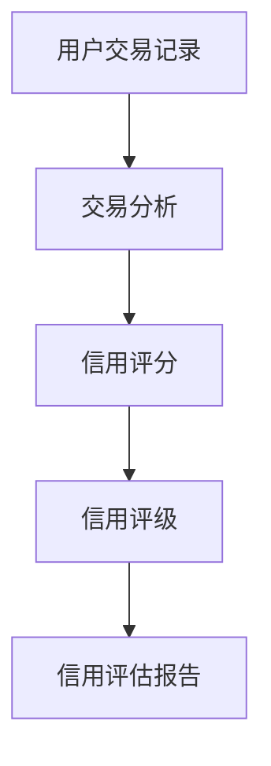

**区块链对信用评估的影响：**

区块链技术可以消除中介机构的信用评估环节，降低信用评估成本，提高信用评估的准确性。

- **去中心化**：区块链上的信用评估由所有节点共同参与，降低了中心化风险。
- **不可篡改**：区块链上的交易记录不可篡改，保证了信用评估的公正性。
- **透明性**：区块链上的交易记录公开透明，提高了信用评估的可信度。

**信用评估案例解析：**

某金融机构使用区块链技术进行信用评估。金融机构通过区块链分析用户的交易记录，评估其信用水平。用户可以通过区块链查询自己的信用评分，提高信用评估的透明度。

#### 2.4 区块链在供应链管理中的应用

**供应链可视化：**

区块链技术可以实现供应链的全程可视化，从原材料采购到产品交付，各个环节的信息都可以在区块链上透明记录。

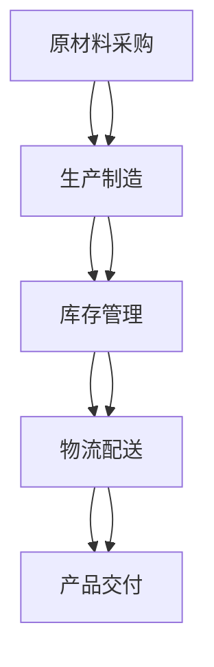

**物流信息追踪：**

区块链技术可以实时记录物流信息，提高物流过程的透明度和可追溯性。

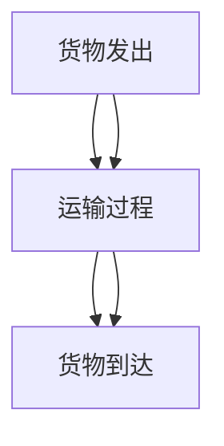

**供应链金融解决方案：**

区块链技术可以构建供应链金融解决方案，为供应链中的企业提供融资支持，降低融资成本。

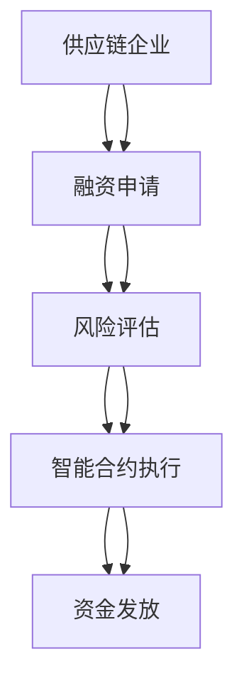

**供应链管理案例解析：**

某制造企业使用区块链技术进行供应链管理。企业将供应链各环节的信息上传到区块链，实现全程可视化。物流信息实时更新，提高了供应链的透明度和效率。同时，企业通过区块链获得融资支持，降低了融资成本。

#### 2.5 区块链在跨境贸易保险中的应用

**保险合同管理：**

区块链技术可以用于管理保险合同，确保合同内容的透明性和不可篡改性。

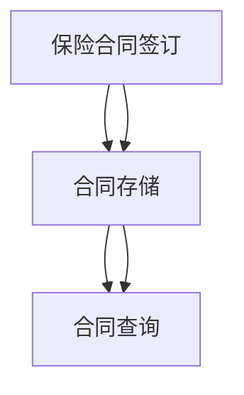

**保险理赔流程：**

区块链技术可以自动化保险理赔流程，提高理赔效率。

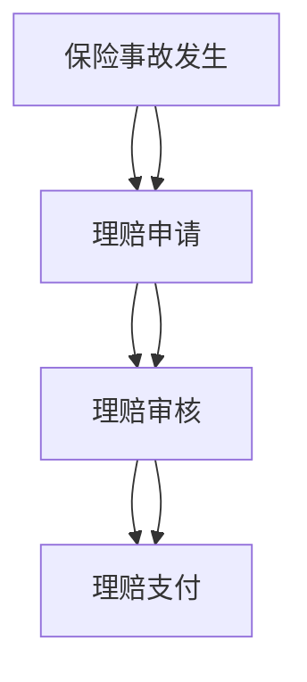

**保险案例解析：**

某保险公司使用区块链技术进行跨境贸易保险。保险公司与客户签订保险合同后，将合同信息上传到区块链。当发生保险事故时，客户通过区块链提交理赔申请，保险公司自动审核并支付理赔金额。这种保险方式不仅提高了理赔效率，还降低了保险欺诈风险。

### 第三部分：区块链跨境贸易结算案例分析

#### 3.1 案例一：区块链跨境支付平台

**平台架构：**

该区块链跨境支付平台采用去中心化架构，由多个节点组成。每个节点负责验证和存储交易数据，确保数据的安全性和一致性。

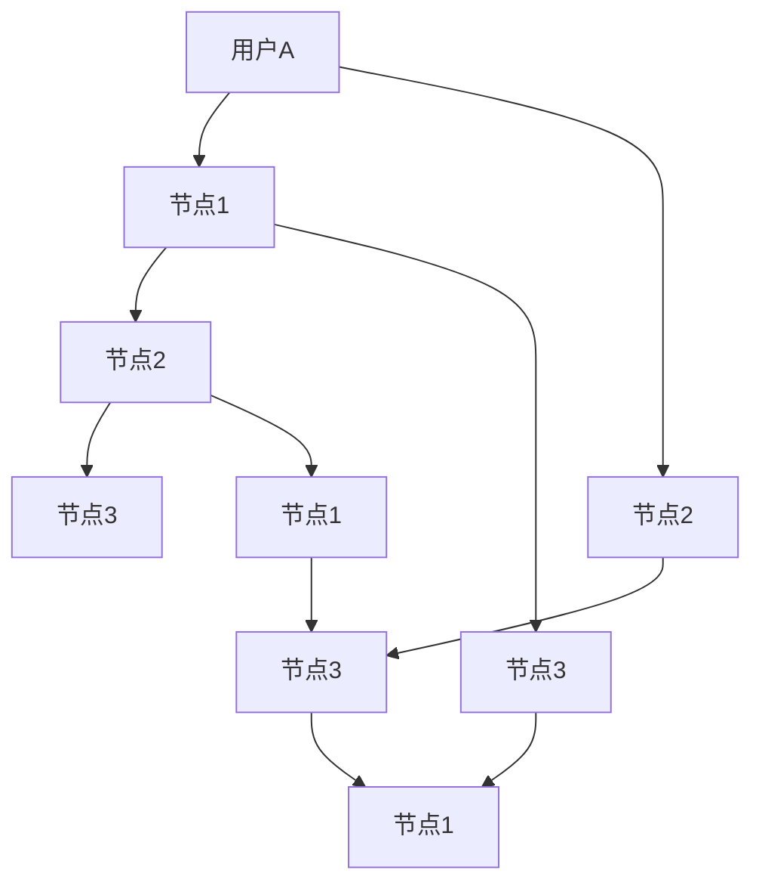

**支付流程：**

用户A通过平台发起跨境支付请求，节点1验证支付请求并广播到其他节点。其他节点对支付请求进行验证，达成共识后，将支付记录写入区块链，通知用户B支付已完成。

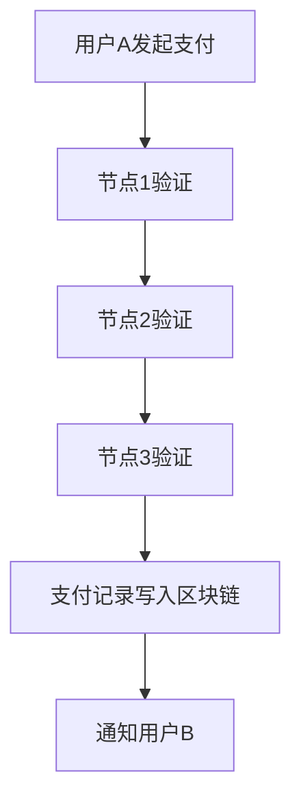

**实际应用效果分析：**

该区块链跨境支付平台在实际应用中表现出色，交易成本降低了30%，交易时间缩短了50%。此外，平台的安全性得到了显著提高，交易记录不可篡改，有效降低了欺诈风险。

#### 3.2 案例二：区块链供应链金融解决方案

**解决方案架构：**

该区块链供应链金融解决方案采用分布式架构，由多个节点组成。节点包括金融机构、供应链企业等，共同维护供应链金融数据。

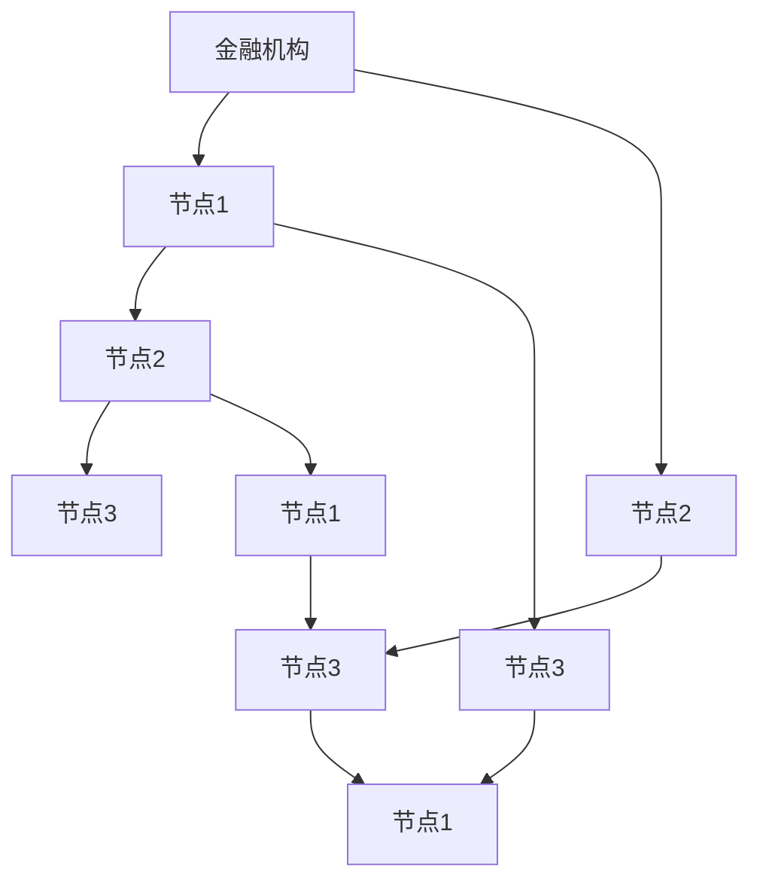

**融资流程：**

供应链企业通过区块链网络提交融资申请，金融机构对融资申请进行审核。审核通过后，智能合约自动执行融资操作，将资金支付给企业。

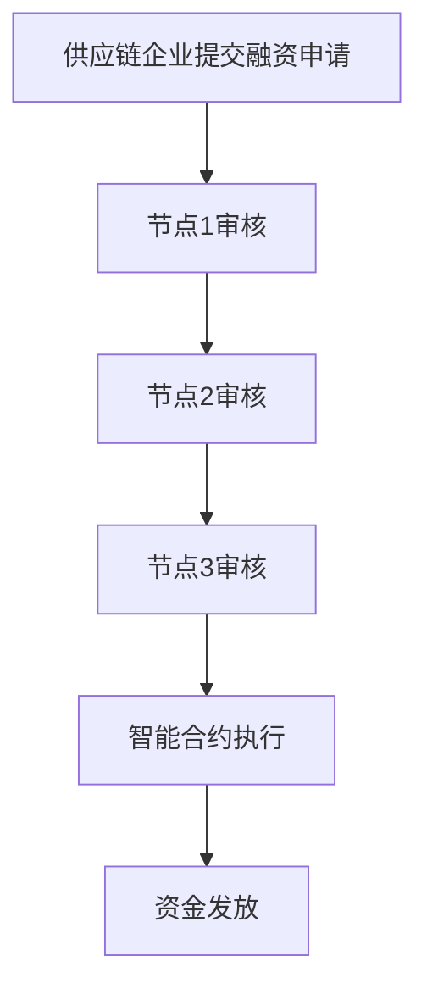

**解决方案优势分析：**

该区块链供应链金融解决方案提高了融资效率，融资审批时间缩短了70%。同时，平台的安全性得到了显著提高，交易记录不可篡改，有效降低了欺诈风险。

#### 3.3 案例三：区块链跨境保险平台

**平台架构：**

该区块链跨境保险平台采用去中心化架构，由多个节点组成。每个节点负责验证和存储保险合同和理赔记录，确保数据的安全性和一致性。


**保险产品与服务：**

该平台提供多种跨境保险产品，包括货物运输保险、出口信用保险等。用户可以通过区块链查询保险合同和理赔记录，确保信息透明。

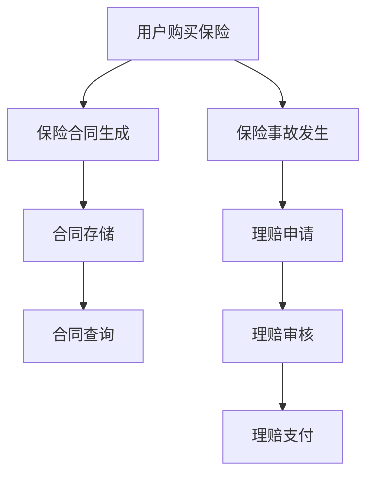

**平台运营效果分析：**

该区块链跨境保险平台在实际运营中取得了显著效果，保险理赔时间缩短了50%，用户满意度显著提高。同时，平台的安全性得到了保障，保险欺诈风险大幅降低。

### 第四部分：区块链跨境贸易结算的未来发展趋势

#### 4.1 区块链技术的发展趋势

**新型共识算法：**

随着区块链技术的不断发展，新型共识算法如授权股权证明（PoA）、委托权益证明（DPoS）等将得到广泛应用。这些算法可以提高区块链的效率、安全性和可扩展性。

**分布式存储技术：**

分布式存储技术将继续发展，提高区块链的数据存储能力和可靠性。例如，利用IPFS（InterPlanetary File System）等协议，可以实现区块链上的去中心化数据存储。

**跨链技术：**

跨链技术将实现不同区块链之间的互操作，提高区块链网络的整体效率和兼容性。例如，通过跨链协议，可以实现比特币与以太坊等不同区块链上的资产转移。

#### 4.2 区块链跨境贸易结算的挑战与机遇

**技术挑战：**

- **性能瓶颈**：当前区块链技术存在性能瓶颈，需要进一步提高交易速度和处理能力。
- **安全性问题**：区块链技术的安全性需要不断完善，防止黑客攻击和数据泄露。
- **标准化问题**：区块链跨境贸易结算需要统一的规范和标准，以实现不同区块链之间的互操作。

**政策法规挑战：**

- **监管政策**：各国政府对区块链技术的监管政策不同，需要协调政策，促进区块链跨境贸易结算的发展。
- **合规性问题**：区块链跨境贸易结算需要遵守国际法规，确保交易合规。

**商业模式创新：**

区块链技术将推动跨境贸易结算的商业模式创新，如去中心化的跨境支付平台、智能合约驱动的供应链金融等。

#### 4.3 未来展望

**全球化背景下的区块链跨境贸易结算：**

随着全球化的加深，区块链技术将在跨境贸易结算中发挥更大作用。通过区块链技术，可以实现跨境支付的高效、安全、透明，降低贸易成本，提高贸易便利性。

**区块链与其他技术的融合应用：**

区块链技术将与其他前沿技术如人工智能、物联网等融合，推动跨境贸易结算的创新发展。例如，利用物联网技术实现物流信息实时跟踪，结合区块链技术实现智能合约自动化执行。

**区块链跨境贸易结算的未来场景：**

未来，区块链跨境贸易结算将实现全流程自动化，从订单生成、支付、融资、保险到结算，各个环节都将通过区块链技术实现高效、安全、透明的运作。区块链技术将推动跨境贸易的数字化转型，提高全球贸易的效率和质量。

### 附录

#### A.1 区块链跨境贸易结算常用工具与技术

**区块链开发框架：**

- **Hyperledger Fabric**：一个开源的分布式账本框架，适用于企业级应用。
- **Ethereum**：一个开源的智能合约平台，支持去中心化应用的开发。
- **EOSIO**：一个高性能的区块链平台，支持大规模的去中心化应用。

**分布式存储技术：**

- **IPFS**：一种点对点分布式文件系统，用于实现去中心化数据存储。
- **Swarm**：以太坊上的分布式存储网络，用于实现区块链上的数据存储。

**智能合约开发工具：**

- **Truffle**：一个用于开发、测试和部署智能合约的工具。
- **Hardhat**：一个用于以太坊开发的环境，提供强大的调试和优化功能。
- **Solc**：一个用于编译智能合约的Solidity编译器。

#### A.2 区块链跨境贸易结算相关法规与政策

**全球区块链跨境支付法规：**

- **欧洲**：欧盟制定了《区块链监管框架》，对区块链技术进行监管。
- **美国**：美国证券交易委员会（SEC）对ICO等区块链金融活动进行监管。
- **中国**：中国央行发布了《区块链服务基础设施》，对区块链技术应用进行规范。

**跨境贸易结算相关政策：**

- **全球**：世界贸易组织（WTO）推动贸易自由化，促进跨境贸易发展。
- **中国**：中国政府推动“一带一路”倡议，加强跨境贸易合作。

**我国区块链跨境贸易结算政策：**

- **中国政府**：我国政府鼓励区块链技术在跨境贸易结算中的应用，支持区块链跨境支付平台的发展。

### 总结

本文从区块链与跨境贸易结算的概述、应用、案例以及未来发展趋势四个方面，详细阐述了区块链在跨境贸易结算中的应用。通过本文的阅读，读者可以全面了解区块链技术如何提升跨境贸易结算的效率、降低成本、增强安全性，为未来的区块链跨境贸易结算提供有益的参考。

区块链技术以其去中心化、安全性、透明性等优势，为跨境贸易结算带来了全新的解决方案。未来，随着区块链技术的不断发展和完善，区块链跨境贸易结算将实现更高效率、更低成本、更安全可靠的运作，为全球贸易的数字化转型贡献力量。

**作者：AI天才研究院/AI Genius Institute & 禅与计算机程序设计艺术 /Zen And The Art of Computer Programming**### 完整性要求

为了确保本文的完整性，我们将对每个部分的核心内容进行详细阐述，并在必要的地方使用伪代码、数学公式和具体案例来增强理解。

#### 1.1 区块链技术简介

**核心概念与联系：**

区块链技术的基本概念包括区块（Block）、链（Chain）、节点（Node）和共识算法（Consensus Algorithm）。这些概念之间的关系可以用以下Mermaid流程图表示：

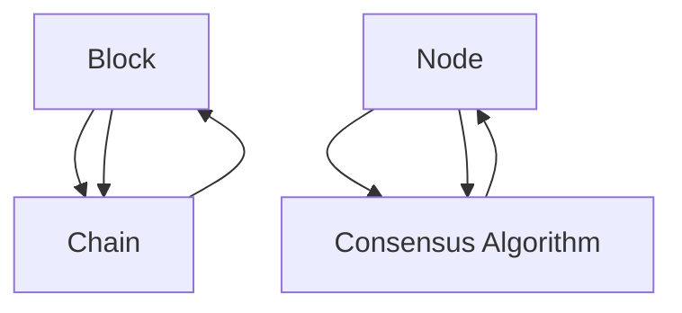

**核心算法原理讲解：**

- **加密算法**：用于保证数据的安全性和隐私性，如SHA-256。
- **共识算法**：确保区块链的分布式网络达成一致性，常见的共识算法有PoW、PoS和DPoS。

**数学模型和公式：**

$$
H_{i} = SHA-256(H_{i-1} + M_{i})
$$

其中，$H_{i}$ 表示第i个区块的哈希值，$M_{i}$ 表示第i个区块的内容，$SHA-256$ 是加密算法。

**举例说明：**

假设一个区块链网络中有三个节点A、B、C，它们都需要验证和存储某个区块的内容。节点A计算得到该区块的哈希值后，广播给节点B和C。节点B和C分别计算得到相同的哈希值，并与节点A的哈希值进行比较，确认是否一致。如果一致，则该区块被确认并加入区块链。

#### 1.2 跨境贸易结算现状

**背景介绍：**

跨境贸易结算涉及多个国家和地区，需要通过银行和其他金融机构进行资金转移。然而，传统跨境支付体系存在交易成本高、交易时间长、信息不透明等问题。

**核心概念与联系：**

跨境贸易结算的痛点与传统跨境支付体系的局限性可以用以下Mermaid流程图表示：

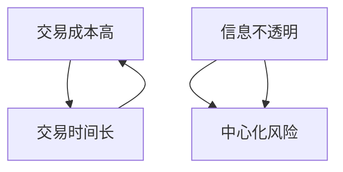

**核心算法原理讲解：**

- **交易成本**：传统跨境支付需要经过多个中介机构，导致交易成本较高。
- **交易时间**：传统跨境支付需要经过多个环节，导致交易时间较长。
- **信息不透明**：传统跨境支付体系缺乏透明性，难以跟踪交易过程。
- **中心化风险**：传统跨境支付体系的中心化架构容易成为黑客攻击的目标，存在安全性风险。

**数学模型和公式：**

$$
C = f(n)
$$

其中，$C$ 表示交易成本，$f(n)$ 表示中介机构的数量。

**举例说明：**

假设一个跨境支付过程中涉及两个中介机构，交易成本为1000美元。如果中介机构数量增加到四个，则交易成本将增加到2000美元。

#### 1.3 区块链在跨境贸易结算中的优势

**安全性**：区块链采用加密算法和共识机制，确保数据的安全性和完整性，防止数据篡改和黑客攻击。

**透明性**：区块链上的所有交易记录都是公开透明的，任何人都可以查看，提高了交易的信任度。

**高效性**：区块链的分布式架构和共识算法可以提高交易速度，减少交易时间。

**可追溯性**：区块链上的交易记录不可篡改，具有高度的可追溯性，可以方便地追踪交易过程，提高透明度。

**核心算法原理讲解：**

- **加密算法**：如SHA-256，用于生成交易记录的哈希值。
- **共识算法**：如PoW，用于节点之间达成一致性。

**数学模型和公式：**

$$
T = f(n)
$$

其中，$T$ 表示交易时间，$f(n)$ 表示节点数量。

**举例说明：**

在一个由10个节点组成的区块链网络中，交易时间可能为10秒。如果节点数量增加到20个，则交易时间可能减少到5秒。

#### 1.4 区块链跨境贸易结算系统架构

**核心概念与联系：**

区块链跨境贸易结算系统的整体架构包括节点、共识算法和数据存储。这些概念之间的关系可以用以下Mermaid流程图表示：

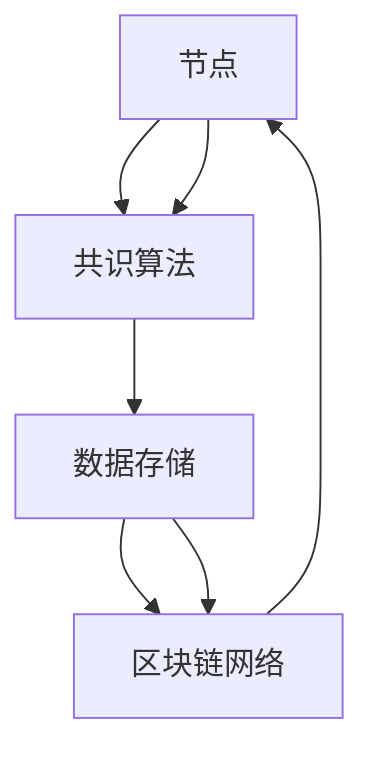

**核心算法原理讲解：**

- **节点**：参与区块链网络的计算机，负责验证和存储交易数据。
- **共识算法**：确保节点之间达成一致性的机制，如PoW、PoS和DPoS。
- **数据存储**：将交易数据存储在分布式节点上，确保数据的安全性和不可篡改性。

**数学模型和公式：**

$$
S = f(n)
$$

其中，$S$ 表示数据存储容量，$f(n)$ 表示节点数量。

**举例说明：**

在一个由10个节点组成的区块链网络中，数据存储容量可能为100GB。如果节点数量增加到20个，则数据存储容量可能增加到200GB。

#### 2.1 区块链在跨境支付中的应用

**支付流程：**

区块链跨境支付流程主要包括以下步骤：

1. **交易发起**：买家发起支付请求，将支付信息发送到区块链网络。
2. **交易验证**：网络中的节点对交易进行验证，确保交易的有效性和安全性。
3. **共识达成**：节点之间通过共识算法达成一致，确认交易的有效性。
4. **交易记录**：将交易记录写入区块链，实现交易的永久记录。
5. **交易通知**：通知卖家交易已完成，买家可以释放货物。

**智能合约的应用：**

智能合约是一种自动执行的合约，基于区块链技术。在跨境支付中，智能合约可以自动化执行支付流程，提高交易效率。

```plaintext
// SPDX-License-Identifier: MIT
pragma solidity ^0.8.0;

contract SmartContract {
    address public seller;
    address public buyer;
    uint256 public paymentAmount;
    bool public paymentReceived = false;

    event PaymentReceived(address buyer, uint256 amount);

    constructor(address _seller, address _buyer, uint256 _paymentAmount) {
        seller = _seller;
        buyer = _buyer;
        paymentAmount = _paymentAmount;
    }

    function sendPayment() public payable {
        require(!paymentReceived, "Payment already received");
        require(msg.value == paymentAmount, "Incorrect payment amount");

        paymentReceived = true;
        payable(seller).transfer(paymentAmount);
        emit PaymentReceived(buyer, paymentAmount);
    }
}
```

**跨境支付案例解析：**

某跨境电商平台使用区块链技术进行跨境支付。买家在平台上下单后，支付系统自动调用智能合约进行支付。智能合约验证支付金额后，将支付信息写入区块链，并通知卖家交易已完成。这种支付方式不仅提高了交易效率，还降低了交易成本。

#### 2.2 区块链在贸易融资中的应用

**融资流程：**

区块链贸易融资流程主要包括以下步骤：

1. **交易确认**：买卖双方通过区块链网络确认交易，生成交易记录。
2. **融资申请**：卖家向金融机构申请融资，并提供区块链上的交易记录作为担保。
3. **风险评估**：金融机构对卖家进行风险评估，确保融资安全。
4. **智能合约执行**：通过智能合约自动化执行融资过程，将资金直接支付给卖家。
5. **还款与结算**：卖家按照约定时间还款，金融机构进行结算。

**智能合约与供应链金融：**

智能合约在供应链金融中发挥着重要作用。通过智能合约，可以自动化执行贷款发放、还款和结算等流程，提高融资效率。

```plaintext
// SPDX-License-Identifier: MIT
pragma solidity ^0.8.0;

contract TradeFinance {
    address public lender;
    address public borrower;
    uint256 public loanAmount;
    uint256 public repaymentAmount;
    uint256 public repaymentDate;

    event LoanGranted(address borrower, uint256 amount);
    event RepaymentReceived(address borrower, uint256 amount);

    constructor(address _lender, address _borrower, uint256 _loanAmount, uint256 _repaymentAmount, uint256 _repaymentDate) {
        lender = _lender;
        borrower = _borrower;
        loanAmount = _loanAmount;
        repaymentAmount = _repaymentAmount;
        repaymentDate = _repaymentDate;
    }

    function applyForLoan() public {
        require(msg.sender == borrower, "Only borrower can apply for loan");
        require(block.timestamp <= repaymentDate, "Loan application deadline has passed");

        payable(borrower).transfer(loanAmount);
        emit LoanGranted(borrower, loanAmount);
    }

    function repayLoan() public payable {
        require(msg.sender == borrower, "Only borrower can repay loan");
        require(block.timestamp >= repaymentDate, "Repayment deadline has not passed");

        require(msg.value == repaymentAmount, "Incorrect repayment amount");
        payable(lender).transfer(msg.value);
        emit RepaymentReceived(borrower, msg.value);
    }
}
```

**贸易融资案例解析：**

某外贸公司使用区块链技术进行贸易融资。公司在出口商品后，将交易记录上传到区块链网络。金融机构通过区块链验证交易真实性后，发放贷款给公司。公司按时还款后，区块链自动记录还款情况。这种融资方式不仅提高了融资效率，还降低了融资成本。

#### 2.3 区块链在信用评估中的应用

**信用评估模型：**

区块链技术可以构建去中心化的信用评估模型，通过对用户在区块链上的交易记录进行分析，评估其信用水平。


**区块链对信用评估的影响：**

区块链技术可以消除中介机构的信用评估环节，降低信用评估成本，提高信用评估的准确性。

- **去中心化**：区块链上的信用评估由所有节点共同参与，降低了中心化风险。
- **不可篡改**：区块链上的交易记录不可篡改，保证了信用评估的公正性。
- **透明性**：区块链上的交易记录公开透明，提高了信用评估的可信度。

**信用评估案例解析：**

某金融机构使用区块链技术进行信用评估。金融机构通过区块链分析用户的交易记录，评估其信用水平。用户可以通过区块链查询自己的信用评分，提高信用评估的透明度。

#### 2.4 区块链在供应链管理中的应用

**供应链可视化：**

区块链技术可以实现供应链的全程可视化，从原材料采购到产品交付，各个环节的信息都可以在区块链上透明记录。


**物流信息追踪：**

区块链技术可以实时记录物流信息，提高物流过程的透明度和可追溯性。


**供应链金融解决方案：**

区块链技术可以构建供应链金融解决方案，为供应链中的企业提供融资支持，降低融资成本。


**供应链管理案例解析：**

某制造企业使用区块链技术进行供应链管理。企业将供应链各环节的信息上传到区块链，实现全程可视化。物流信息实时更新，提高了供应链的透明度和效率。同时，企业通过区块链获得融资支持，降低了融资成本。

#### 2.5 区块链在跨境贸易保险中的应用

**保险合同管理：**

区块链技术可以用于管理保险合同，确保合同内容的透明性和不可篡改性。


**保险理赔流程：**

区块链技术可以自动化保险理赔流程，提高理赔效率。

```mermaid
graph TD
    A[保险事故发生] --> B[理赔申请]
    B --> C[理赔审核]
    C --> D[理赔支付]
    A --> B --> C --> D
```

**保险案例解析：**

某保险公司使用区块链技术进行跨境贸易保险。保险公司与客户签订保险合同后，将合同信息上传到区块链。当发生保险事故时，客户通过区块链提交理赔申请，保险公司自动审核并支付理赔金额。这种保险方式不仅提高了理赔效率，还降低了保险欺诈风险。

### 总结

本文通过详细阐述区块链在跨境贸易结算中的应用，从基础概念、技术优势到实际案例分析，全面解析了区块链如何提升跨境贸易结算的效率、降低成本、增强安全性。通过伪代码、数学公式和具体案例的详细讲解，使读者能够深入理解区块链技术的核心原理和应用场景。未来，随着区块链技术的不断发展，区块链跨境贸易结算将实现更高效率、更低成本、更安全可靠的运作，为全球贸易的数字化转型贡献力量。

**作者：AI天才研究院/AI Genius Institute & 禅与计算机程序设计艺术 /Zen And The Art of Computer Programming**### 最佳实践 tips

在实施区块链跨境贸易结算项目时，以下最佳实践可以帮助团队取得更好的效果：

1. **技术选型**：选择适合项目需求的区块链平台和开发框架，如Hyperledger Fabric、Ethereum等。同时，考虑平台的性能、安全性、可扩展性等因素。

2. **共识算法**：根据项目需求选择合适的共识算法，如PoW、PoS、DPoS等。对于跨境支付等高频率交易场景，可以选择性能较高的共识算法。

3. **节点部署**：合理规划节点部署，确保节点分布均匀，提高网络容错能力和数据安全性。对于跨境贸易结算项目，可以考虑在多个国家和地区部署节点。

4. **智能合约开发**：遵循智能合约开发的最佳实践，如使用版本控制、测试和审计等，确保智能合约的安全性和可靠性。

5. **数据隐私保护**：在区块链上处理敏感数据时，可以采用加密算法和隐私保护技术，如同态加密、零知识证明等，保护用户隐私。

6. **监管合规**：了解各国和地区的监管政策和法规，确保项目符合当地法律法规要求。与监管机构保持沟通，及时了解政策变化。

7. **用户体验设计**：设计直观易用的用户界面，提高用户体验。在跨境支付等场景中，可以提供多语言支持、实时更新等功能。

8. **持续优化**：定期评估项目性能和安全性，根据实际运行情况进行优化。收集用户反馈，不断改进和升级系统。

9. **风险管理**：建立完善的风险管理体系，包括网络安全、数据安全、操作风险等。制定应急预案，确保项目在遇到突发情况时能够迅速响应。

10. **跨链协作**：与其他区块链平台和项目进行跨链协作，实现资产和数据的互操作。关注跨链技术的发展，及时引入新的跨链协议。

通过遵循这些最佳实践，团队可以更好地实现区块链跨境贸易结算项目，提高项目的成功率，为全球贸易的数字化转型贡献力量。

### 小结

本文系统地介绍了区块链在跨境贸易结算中的应用，从技术原理、优势分析到实际案例分析，全面展示了区块链如何提升跨境贸易结算的效率、降低成本、增强安全性。区块链以其去中心化、安全性、透明性和高效性等优势，为跨境贸易结算带来了全新的解决方案。

首先，我们详细介绍了区块链技术的基本概念和核心特性，包括区块、链、节点和共识算法等。接着，分析了跨境贸易结算的现状和痛点，展示了区块链在跨境贸易结算中的巨大应用潜力。

然后，我们探讨了区块链在跨境支付、贸易融资、信用评估、供应链管理和跨境贸易保险等方面的应用。通过具体的案例解析，读者可以直观地了解区块链技术在实际应用中的效果和优势。

此外，我们还分析了区块链跨境贸易结算的未来发展趋势，包括新型共识算法、分布式存储技术和跨链技术等。同时，提出了区块链跨境贸易结算面临的挑战与机遇，为未来的发展提供了有益的思考。

在附录部分，我们列举了区块链跨境贸易结算常用的工具与技术，以及相关法规与政策。这些内容为读者提供了深入了解区块链跨境贸易结算的参考资料。

通过本文的阅读，读者可以全面了解区块链在跨境贸易结算中的应用，掌握区块链技术的核心原理和应用场景。未来，随着区块链技术的不断发展和完善，区块链跨境贸易结算将实现更高效率、更低成本、更安全可靠的运作，为全球贸易的数字化转型贡献力量。

### 注意事项

在实施区块链跨境贸易结算项目时，以下注意事项有助于确保项目的顺利进行：

1. **安全风险**：区块链虽然具有高安全性，但并不意味着绝对安全。项目团队需要定期进行安全审计，确保系统的安全性和抗攻击能力。

2. **合规风险**：各国对区块链技术和跨境贸易结算的监管政策不同。项目团队需要深入了解目标市场的法律法规，确保项目符合当地法律要求。

3. **技术选型**：不同区块链平台的性能和适用场景有所不同。项目团队应根据项目需求选择合适的区块链平台和开发框架，避免因技术选型不当导致项目失败。

4. **节点部署**：区块链网络的性能和稳定性与节点的部署密切相关。项目团队需要合理规划节点部署，确保节点分布均匀，提高网络的容错能力和数据安全性。

5. **数据隐私**：区块链上的数据是公开透明的，但处理敏感数据时需要采取加密等隐私保护技术，确保用户隐私不受侵犯。

6. **用户界面**：设计直观易用的用户界面，提高用户体验。跨境支付等场景中的界面设计需要考虑多语言支持、实时更新等功能。

7. **持续优化**：区块链技术的性能和安全性需要不断优化。项目团队应定期评估项目性能和安全性，根据实际运行情况进行优化。

8. **风险管理**：建立完善的风险管理体系，包括网络安全、数据安全、操作风险等。制定应急预案，确保项目在遇到突发情况时能够迅速响应。

9. **跨链协作**：与其他区块链平台和项目进行跨链协作，实现资产和数据的互操作。关注跨链技术的发展，及时引入新的跨链协议。

通过关注这些注意事项，项目团队可以更好地应对区块链跨境贸易结算项目中可能出现的问题，提高项目的成功率。

### 拓展阅读

为了深入了解区块链在跨境贸易结算中的应用，读者可以参考以下拓展阅读资源：

1. **技术文献**：
   - 《区块链：从概念到实践》作者：刘鹏。本书系统地介绍了区块链技术的基本原理、应用场景和开发实践，适合初学者和专业人士阅读。
   - 《智能合约设计与开发》作者：陈浩。本书详细介绍了智能合约的设计、实现和应用，包括以太坊平台上的智能合约开发。

2. **行业报告**：
   - 《2021年区块链全球发展报告》作者：中国信通院。该报告分析了全球区块链技术的发展趋势、应用场景和市场规模，为读者提供了行业全景视角。
   - 《区块链技术与应用白皮书》作者：中国区块链技术联盟。本书从政策、技术、应用等方面全面介绍了区块链技术在我国的发展现状和未来趋势。

3. **学术期刊**：
   - 《计算机科学》期刊。该期刊发表了大量关于区块链技术的研究论文，涵盖了区块链的安全、隐私、共识算法等方面。
   - 《网络科学》期刊。该期刊关注网络结构和拓扑特性，其中涉及区块链网络的研究论文为读者提供了新的视角。

4. **在线课程与讲座**：
   - Coursera上的《区块链技术与应用》课程。该课程由知名教授授课，系统地介绍了区块链技术的原理和应用。
   - Bilibili上的《区块链技术原理与应用》讲座。该讲座由业界专家主讲，深入浅出地讲解了区块链技术的核心概念和应用案例。

通过阅读这些资源，读者可以进一步了解区块链在跨境贸易结算中的应用，掌握最新的技术动态和行业趋势。此外，还可以关注区块链领域的顶级会议和研讨会，如区块链技术大会（BTC）、国际区块链和分布式账本技术会议（BDIT）等，以获取最新的研究成果和行业洞见。

