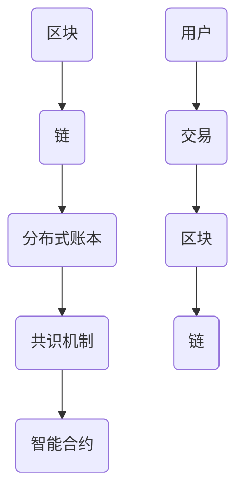

                 

### 《区块链技术在数字政务中的创新实践》

#### 关键词：区块链、数字政务、创新实践、应用场景、案例分析

> 摘要：本文旨在探讨区块链技术在数字政务领域的创新实践。首先，通过介绍区块链的基本概念和核心技术，阐述其在数字政务中的潜在应用场景。随后，通过具体案例分析和项目实战，展示区块链在数字政务中的实际应用效果。最后，总结区块链技术在数字政务中的发展趋势和未来展望，为相关政策制定和技术实施提供参考。

## 第一部分：区块链技术基础

### 第1章：区块链技术概述

#### 1.1 背景介绍

区块链是一种分布式账本技术，通过密码学和共识算法确保数据的不可篡改性和透明性。自2008年比特币诞生以来，区块链技术迅速发展，并逐渐应用于多个领域，包括金融、医疗、供应链等。近年来，区块链在数字政务领域的应用也开始受到广泛关注，其潜在的优势在于提升政务效率、增强数据安全和促进透明度。

#### 1.2 核心概念与联系

区块链的核心概念包括区块、链、分布式账本、共识机制和智能合约。以下是一个简化的Mermaid流程图，展示了这些概念之间的联系：



**图1：区块链核心概念关系架构**

#### 1.3 核心算法原理讲解

- **加密算法**：区块链使用非对称加密算法来保护交易数据的安全性。以下是交易加密的伪代码：

```python
def encrypt_transaction(transaction, public_key):
    encrypted_transaction = asymmetric_encrypt(transaction, public_key)
    return encrypted_transaction
```

- **分布式存储**：区块链通过分布式存储技术确保数据的安全性和可用性。以下是分布式存储的伪代码：

```python
def distribute_data(data, nodes):
    for node in nodes:
        send_data_to_node(data, node)
```

- **共识机制**：共识机制是区块链网络中确保数据一致性的关键算法。以下是工作量证明（PoW）算法的伪代码：

```python
def proof_of_work(target_difficulty):
    nonce = 0
    while calculate_hash(block) > target_difficulty:
        nonce += 1
    return nonce
```

## 第二部分：数字政务的概念与特点

### 第2章：数字政务的概念与特点

#### 2.1 数字政务的定义

数字政务是指利用数字技术和网络平台，实现政府管理、服务和社会治理的现代化和智能化。它涵盖电子政务、智能政务和数字治理等多个方面，旨在提高政务效率、增强服务质量和提升治理能力。

#### 2.2 数字政务的特点

- **网络化**：数字政务依托互联网和移动通信技术，实现政务信息的快速传播和实时交互。
- **信息化**：数字政务通过信息技术手段，实现政务数据的收集、存储、处理和共享。
- **智能化**：数字政务利用人工智能、大数据和区块链等技术，实现智能决策和智能服务。
- **高效化**：数字政务通过优化流程、减少中间环节和自动化处理，提高政务工作效率。
- **安全化**：数字政务注重数据安全和隐私保护，确保政务信息的可靠性和完整性。

#### 2.3 数字政务的发展现状与挑战

- **全球发展趋势**：数字政务在全球范围内得到了广泛推广，许多国家都在积极建设数字政府，推动政务服务数字化转型。
- **我国实践**：我国在数字政务领域取得了一定的成果，但同时也面临数据安全、隐私保护、技术标准等方面的问题。
- **面临的挑战**：数字政务的发展面临技术、政策、人才和资金等多方面的挑战。

## 第三部分：区块链在数字政务中的应用

### 第3章：区块链在数字政务中的应用

#### 3.1 区块链在电子身份认证中的应用

电子身份认证是数字政务的重要基础，区块链技术可以提供安全、可靠的电子身份认证服务。以下是区块链在电子身份认证中的核心概念：

- **身份验证**：通过区块链记录用户的身份信息，确保信息的真实性和不可篡改性。
- **权限管理**：利用智能合约实现权限管理，根据用户身份和权限，提供相应的政务服务。
- **隐私保护**：通过加密技术保护用户隐私，确保政务信息的安全性和保密性。

#### 3.2 区块链在数据共享与安全中的应用

数据共享和安全是数字政务的关键问题，区块链技术可以提供高效、安全的解决方案。以下是区块链在数据共享与安全中的应用：

- **数据共享**：利用区块链分布式账本技术，实现政务数据的安全共享和透明访问。
- **数据安全**：通过加密和共识算法，确保政务数据的安全性和完整性。
- **隐私保护**：利用零知识证明等隐私保护技术，实现政务数据的隐私保护。

#### 3.3 区块链在智能合约和智能审批中的应用

智能合约和智能审批是数字政务的创新应用，区块链技术可以提供高效、智能的解决方案。以下是区块链在智能合约和智能审批中的应用：

- **智能合约**：利用区块链的智能合约技术，实现自动化、透明的政务流程。
- **智能审批**：通过区块链记录审批流程，实现审批过程的透明化和高效化。

## 第四部分：案例分析

### 第4章：案例分析

#### 4.1 国内区块链在数字政务的实践案例

我国在区块链数字政务领域进行了许多实践，以下是其中几个典型的案例：

- **长三角地区区块链政务服务**：长三角地区通过区块链技术实现了跨区域的政务服务协同，提升了政务服务效率。
- **深圳区块链电子发票**：深圳推出了区块链电子发票，有效解决了发票安全、真伪验证等问题。
- **福建数字身份认证**：福建省通过区块链技术实现了数字身份认证，提高了政务服务的安全性和便利性。

#### 4.2 国际区块链在数字政务的实践案例

国际上也有一系列区块链数字政务的实践案例，以下是其中的几个例子：

- **爱沙尼亚电子政务**：爱沙尼亚是全球电子政务的领先者，其电子政务系统大量采用了区块链技术。
- **乌克兰电子护照**：乌克兰推出了基于区块链的电子护照，提高了护照的安全性和便捷性。
- **美国医疗记录区块链**：美国一些医疗机构利用区块链技术存储和管理医疗记录，提升了医疗数据的安全性和可用性。

#### 4.3 案例分析总结与启示

通过对国内外的区块链数字政务案例进行分析，我们可以得出以下启示：

- **技术优势**：区块链技术具有数据安全、透明性和不可篡改性的优势，适合用于数字政务领域。
- **应用场景**：区块链技术可以广泛应用于电子身份认证、数据共享与安全、智能合约和智能审批等领域。
- **政策支持**：政府需要出台相关政策，鼓励和支持区块链技术在数字政务中的应用。

## 第五部分：区块链在数字政务中的创新实践

### 第5章：区块链在数字政务中的创新实践

#### 5.1 创新实践的理论基础

区块链在数字政务中的创新实践，基于其分布式账本、智能合约和加密算法等技术特点。以下是区块链创新实践的理论基础：

- **分布式账本**：分布式账本技术确保政务数据的安全性和透明性，提高了数据共享的效率。
- **智能合约**：智能合约技术实现政务流程的自动化和透明化，提升了政务服务的效率。
- **加密算法**：加密算法技术保障政务数据的安全性和隐私性，提高了数据保护的能力。

#### 5.2 创新实践的技术路径

区块链在数字政务中的创新实践，涉及多个技术环节。以下是创新实践的技术路径：

- **需求分析**：根据政务需求，确定区块链应用场景和功能。
- **架构设计**：设计区块链系统的整体架构，包括网络架构、数据架构和合约架构。
- **系统开发**：根据架构设计，开发区块链系统的前端、后端和智能合约部分。
- **测试与部署**：对区块链系统进行测试，确保其稳定性和安全性，然后进行部署上线。

#### 5.3 创新实践的风险与挑战

区块链在数字政务中的创新实践，面临一系列风险和挑战。以下是主要风险和挑战：

- **技术成熟度**：区块链技术尚处于发展阶段，其稳定性和性能可能无法满足大规模政务应用的需求。
- **数据隐私**：区块链上的数据是公开的，如何保护用户隐私是一个重要问题。
- **法律合规**：区块链技术的应用需要遵守相关法律法规，如何确保合规性是一个挑战。
- **人才短缺**：区块链技术的应用需要专业的技术人才，人才短缺可能影响项目推进。

## 第六部分：区块链在数字政务中的未来展望

### 第6章：区块链在数字政务中的未来展望

#### 6.1 区块链技术在数字政务的发展趋势

随着区块链技术的不断成熟，其在数字政务领域的应用也将不断拓展。以下是区块链技术在数字政务的发展趋势：

- **应用范围扩大**：区块链技术将在更多政务领域得到应用，如社会管理、公共服务等。
- **技术深度融合**：区块链技术将与人工智能、大数据等技术深度融合，提升政务智能化水平。
- **跨领域合作**：政府、企业和社会组织将加强合作，共同推进区块链技术在数字政务中的应用。

#### 6.2 区块链与人工智能、大数据等技术的融合

区块链技术与人工智能、大数据等技术的融合，将为数字政务带来更多创新。以下是融合方向：

- **智能决策**：利用区块链技术，实现政务数据的智能分析和决策支持。
- **数据治理**：利用区块链技术，实现政务数据的全生命周期管理和安全治理。
- **智能服务**：利用区块链技术，提供个性化、智能化的政务服务。

#### 6.3 未来数字政务的发展方向

未来数字政务的发展方向，将更加注重用户体验、数据安全和智能化水平。以下是发展方向：

- **用户体验**：通过优化政务流程、提升服务效率，提高政务服务的用户体验。
- **数据安全**：通过强化数据安全措施、保障用户隐私，提高政务数据的安全性。
- **智能化**：通过引入人工智能、大数据等技术，提升政务服务的智能化水平。

## 第七部分：区块链在数字政务中的应用指南

### 第7章：区块链在数字政务中的应用指南

#### 7.1 如何评估区块链在数字政务中的可行性

在评估区块链在数字政务中的可行性时，需要考虑以下几个方面：

- **需求分析**：分析政务需求，确定区块链技术是否能够解决现有问题。
- **技术评估**：评估区块链技术的成熟度和性能，确保其能够满足政务应用需求。
- **成本效益**：评估区块链技术在成本和效益方面的表现，确保其具有经济可行性。

#### 7.2 如何制定区块链在数字政务中的应用策略

制定区块链在数字政务中的应用策略，需要考虑以下几个方面：

- **目标明确**：明确区块链应用的目标，如提高效率、降低成本、增强安全性等。
- **技术选型**：选择适合的区块链技术，如公有链、私有链或联盟链。
- **实施计划**：制定详细的实施计划，包括开发、测试和部署等环节。

#### 7.3 如何实施区块链在数字政务中的项目

实施区块链在数字政务中的项目，需要遵循以下步骤：

- **需求分析**：明确项目需求，确定区块链技术的应用场景。
- **架构设计**：设计区块链系统的整体架构，包括网络架构、数据架构和合约架构。
- **开发与测试**：进行区块链系统的开发、测试和调试，确保其稳定性和安全性。
- **部署上线**：将区块链系统部署到生产环境，确保其正常运行。

### 附录

#### 附录A：区块链技术相关资源

- **开源区块链框架**：Ethereum、Hyperledger Fabric、EOSIO等
- **区块链书籍**：《区块链革命》、《区块链：从数字货币到信用社会》等
- **区块链社区**：Blockchain.com、Reddit区块链社区等

#### 附录B：区块链应用实践案例

- **案例1：深圳区块链电子发票**：详细介绍深圳区块链电子发票的应用场景、技术架构和实施效果。
- **案例2：爱沙尼亚电子政务**：详细介绍爱沙尼亚电子政务系统的建设背景、应用技术和成果。

### 作者信息

- **作者：AI天才研究院/AI Genius Institute & 禅与计算机程序设计艺术 /Zen And The Art of Computer Programming**

本文基于区块链技术在数字政务领域的创新实践，通过逻辑清晰、结构紧凑、简单易懂的撰写方式，详细介绍了区块链技术的基础知识、应用场景、案例分析、创新实践和未来展望。希望本文能为区块链技术在数字政务领域的应用提供有益的参考和启示。

