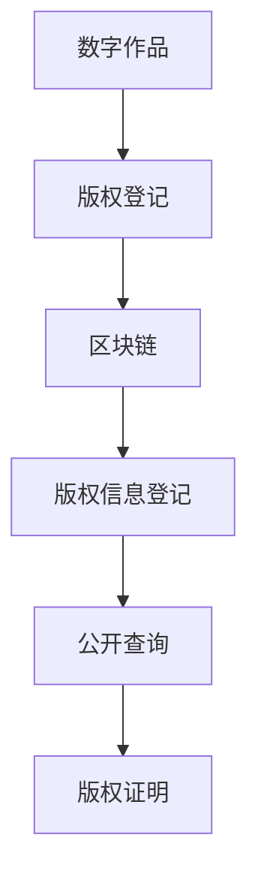
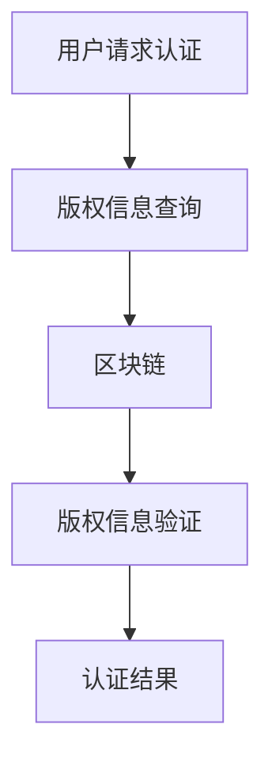
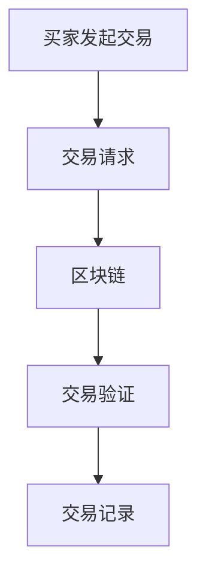
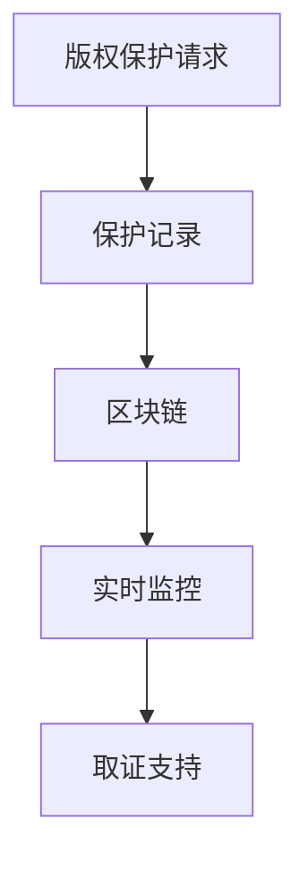

                 


## 《区块链技术在数字版权交易中的创新应用》

### 关键词：区块链，数字版权交易，创新应用，安全机制，透明性

### 摘要：
随着数字时代的到来，数字版权交易成为了一个日益重要的领域。然而，传统的数字版权交易模式面临着许多挑战，如版权认定困难、交易过程不透明、版权纠纷等问题。区块链技术以其独特的去中心化、安全性和透明性等特点，为解决这些问题提供了新的思路。本文将详细探讨区块链技术在数字版权交易中的创新应用，包括数字版权登记、认证、交易和保护等方面，并通过实际案例分析，展示区块链技术在数字版权交易中的巨大潜力和前景。

### 目录大纲：

#### 第一部分：区块链技术概述

1.1 区块链技术的基本原理

1.1.1 区块链的技术框架

1.1.2 区块链的安全机制

1.1.3 区块链与数字版权交易的关系

1.2 数字版权交易的概念与现状

1.2.1 数字版权交易的定义

1.2.2 数字版权交易存在的问题

1.2.3 区块链技术在数字版权交易中的优势

#### 第二部分：区块链技术在数字版权交易中的应用

2.1 区块链技术在数字版权登记中的应用

2.1.1 数字版权登记的过程

2.1.2 区块链技术在数字版权登记中的应用

2.1.3 区块链技术在数字版权登记中的优势

2.2 区块链技术在数字版权认证中的应用

2.2.1 数字版权认证的过程

2.2.2 区块链技术在数字版权认证中的应用

2.2.3 区块链技术在数字版权认证中的优势

2.3 区块链技术在数字版权交易中的应用

2.3.1 数字版权交易的过程

2.3.2 区块链技术在数字版权交易中的应用

2.3.3 区块链技术在数字版权交易中的优势

2.4 区块链技术在数字版权保护中的应用

2.4.1 数字版权保护的过程

2.4.2 区块链技术在数字版权保护中的应用

2.4.3 区块链技术在数字版权保护中的优势

#### 第三部分：区块链技术在数字版权交易中的创新应用案例

3.1 案例一：区块链技术在音乐版权交易中的应用

3.1.1 音乐版权交易的现状

3.1.2 区块链技术在音乐版权交易中的应用

3.1.3 案例分析

3.2 案例二：区块链技术在文学版权交易中的应用

3.2.1 文学版权交易的现状

3.2.2 区块链技术在文学版权交易中的应用

3.2.3 案例分析

3.3 案例三：区块链技术在影视版权交易中的应用

3.3.1 影视版权交易的现状

3.3.2 区块链技术在影视版权交易中的应用

3.3.3 案例分析

#### 第四部分：区块链技术在数字版权交易中的未来展望

4.1 区块链技术在数字版权交易中的发展趋势

4.2 区块链技术在数字版权交易中的挑战与机遇

### 引言

数字版权交易是指数字作品的所有权、使用权和其他相关权利在互联网上的交易活动。随着互联网和数字技术的迅猛发展，数字版权交易已经成为一个庞大的市场。然而，传统的数字版权交易模式面临着许多挑战，如版权认定困难、交易过程不透明、版权纠纷等问题。这些问题不仅损害了创作者的权益，也影响了数字版权交易的健康发展。

区块链技术以其去中心化、安全性和透明性等特点，为解决这些问题提供了新的思路。区块链技术是一种分布式数据库技术，通过加密算法确保数据的安全性和不可篡改性。区块链技术的这些特性使得它非常适合用于数字版权交易，可以有效地解决版权认定、交易透明性和版权纠纷等问题。

本文将首先介绍区块链技术的基本原理，然后探讨区块链技术在数字版权交易中的应用，包括数字版权登记、认证、交易和保护等方面。接下来，将通过实际案例分析，展示区块链技术在数字版权交易中的巨大潜力和前景。最后，我们将探讨区块链技术在数字版权交易中的未来发展趋势和面临的挑战。

### 第一部分：区块链技术概述

#### 1.1 区块链技术的基本原理

区块链技术是一种分布式数据库技术，它通过加密算法和共识机制确保数据的完整性和安全性。区块链由多个区块组成，每个区块包含一定数量的交易记录。这些区块按照时间顺序链接在一起，形成了一个不可篡改的区块链。

1.1.1 区块链的技术框架

区块链的技术框架主要包括以下几部分：

1. **数据结构**：区块链采用链式数据结构，每个区块包含区块头、交易数据和区块体。区块头包含版本号、时间戳、难度目标、随机数和前一个区块的哈希值。交易数据包含交易的具体内容，如金额、商品等信息。区块体则用于存储交易记录。

2. **加密算法**：区块链使用加密算法来确保数据的安全性和隐私性。常用的加密算法包括哈希算法（如SHA-256）、椭圆曲线加密算法（如ECDSA）等。

3. **共识机制**：共识机制是区块链网络中节点达成一致的过程。常见的共识机制包括工作量证明（PoW）、权益证明（PoS）等。共识机制确保了区块链网络中的数据一致性和安全性。

4. **网络拓扑**：区块链网络是一个去中心化的网络，节点之间通过网络进行通信和数据交换。网络中的每个节点都保存了一份完整的区块链数据。

1.1.2 区块链的安全机制

区块链的安全机制主要包括以下几方面：

1. **去中心化**：区块链网络中的每个节点都保存了一份完整的区块链数据，任何节点都不能单独控制或篡改数据。这使得区块链具有高度的安全性和抗攻击性。

2. **不可篡改性**：区块链采用哈希算法和链式数据结构，确保数据一旦记录在链上，就无法被篡改。每个区块都包含前一个区块的哈希值，如果某个区块被篡改，会导致整个链的结构发生变化，这是不可能的。

3. **加密传输**：区块链网络中的节点之间使用加密算法进行通信，确保数据在传输过程中的安全性。

4. **共识机制**：共识机制确保了区块链网络中的数据一致性。在网络中的节点达成共识后，交易记录才会被记录在链上。

1.1.3 区块链与数字版权交易的关系

区块链技术非常适合用于数字版权交易，主要表现在以下几个方面：

1. **去中心化**：区块链的去中心化特性使得数字版权交易不再依赖于中心化的机构，减少了交易过程中的中介费用和风险。

2. **不可篡改性**：区块链的不可篡改性确保了数字版权交易的透明性和公正性，减少了版权纠纷的发生。

3. **透明性**：区块链网络中的每个节点都可以查看区块链上的交易记录，这使得数字版权交易过程更加公开和透明。

4. **安全性**：区块链的加密算法和共识机制确保了数字版权交易的安全性，减少了数据泄露和盗版的风险。

#### 1.2 数字版权交易的概念与现状

1.2.1 数字版权交易的定义

数字版权交易是指数字作品的所有权、使用权和其他相关权利在互联网上的交易活动。这些权利包括著作权、专利权、商标权等。数字版权交易的核心是数字作品的使用权和转让权。

1.2.2 数字版权交易存在的问题

1. 版权认定困难：在传统的数字版权交易中，由于数字作品的可复制性和传播性，使得版权认定变得复杂和困难。特别是在网络环境下，数字作品的版权归属往往难以确定。

2. 交易过程不透明：传统的数字版权交易过程往往缺乏透明性，交易双方的信息不对称，使得交易双方难以建立信任。

3. 版权纠纷频发：由于数字版权交易的复杂性和不确定性，版权纠纷频发。版权纠纷不仅损害了创作者的权益，也影响了数字版权交易的健康发展。

1.2.3 区块链技术在数字版权交易中的优势

区块链技术在数字版权交易中具有以下优势：

1. **去中心化**：区块链技术去中心化的特性，使得数字版权交易不再依赖于中心化的机构，减少了交易过程中的中介费用和风险。

2. **不可篡改性**：区块链的不可篡改性，确保了数字版权交易的透明性和公正性，减少了版权纠纷的发生。

3. **透明性**：区块链网络中的每个节点都可以查看区块链上的交易记录，这使得数字版权交易过程更加公开和透明。

4. **安全性**：区块链的加密算法和共识机制确保了数字版权交易的安全性，减少了数据泄露和盗版的风险。

### 第二部分：区块链技术在数字版权交易中的应用

区块链技术在数字版权交易中的应用主要包括数字版权登记、认证、交易和保护等方面。以下将详细探讨这些应用场景。

#### 2.1 区块链技术在数字版权登记中的应用

数字版权登记是指将数字作品的版权信息记录在区块链上，以实现版权的认定和确权。区块链技术在数字版权登记中的应用，主要体现在以下几个方面：

1. **去中心化登记**：区块链技术去中心化的特性，使得数字版权登记不再依赖于中心化的机构，降低了登记成本和风险。

2. **不可篡改性**：区块链的不可篡改性，确保了数字版权登记的透明性和公正性，减少了版权纠纷的发生。

3. **透明性**：区块链网络中的每个节点都可以查看区块链上的登记信息，这使得数字版权登记过程更加公开和透明。

4. **安全性**：区块链的加密算法和共识机制确保了数字版权登记的安全性，减少了数据泄露和篡改的风险。

**核心概念与联系：**

区块链技术在数字版权登记中的应用，可以通过以下Mermaid流程图来展示：



**核心算法原理讲解：**

数字版权登记的核心算法原理是利用哈希算法对数字作品的版权信息进行加密，然后将其存储在区块链上。以下是一个简单的伪代码示例：

```python
import hashlib

def register	CopyrightInformation(digital_work, owner):
    # 将数字作品和版权人信息进行加密
    encrypted_info = encrypt(digital_work, owner)
    # 计算哈希值
    hash_value = hashlib.sha256(encrypted_info).hexdigest()
    # 将版权信息存储在区块链上
    blockchain.add_block(hash_value, encrypted_info)
    # 生成版权证明
    proof = create_proof(hash_value)
    return proof

def encrypt(data, owner):
    # 加密算法（如AES）
    encrypted_data = AES_encrypt(data, owner_key)
    return encrypted_data

def create_proof(hash_value):
    # 生成版权证明（如数字证书）
    proof = DigitalCertificate(hash_value)
    return proof
```

**数学模型和公式：**

在数字版权登记中，可以使用以下数学模型来表示版权信息的加密和存储过程：

$$
E_k(D) = C
$$

其中，$E_k(D)$ 表示加密算法，$D$ 表示原始数据，$C$ 表示加密后的数据。$k$ 表示加密密钥。

**举例说明：**

假设某数字作品的版权信息为`"数字作品A"`，版权人为`"张三"`。使用AES加密算法和密钥`key1`进行加密，得到加密后的数据`C`。然后，计算加密数据的哈希值`H(C)`，并将其存储在区块链上。版权人`张三`获得版权证明，证明其拥有数字作品A的版权。

```python
digital_work = "数字作品A"
owner = "张三"
key = "key1"

# 加密版权信息
encrypted_info = encrypt(digital_work, owner)

# 计算哈希值
hash_value = hashlib.sha256(encrypted_info).hexdigest()

# 存储在区块链上
blockchain.add_block(hash_value, encrypted_info)

# 生成版权证明
proof = create_proof(hash_value)

# 输出版权证明
print(proof)
```

#### 2.2 区块链技术在数字版权认证中的应用

数字版权认证是指对数字作品的版权信息进行验证，以确认版权的真实性和合法性。区块链技术在数字版权认证中的应用，主要体现在以下几个方面：

1. **透明性**：区块链网络中的每个节点都可以查看区块链上的版权信息，确保版权认证的透明性。

2. **安全性**：区块链的加密算法和共识机制确保了版权认证的安全性，防止数据篡改和伪造。

3. **效率**：区块链的去中心化特性，使得版权认证过程更加高效，减少了中间环节和手续。

4. **便捷性**：用户可以通过区块链网络随时随地查看版权信息，实现自助认证。

**核心概念与联系：**

区块链技术在数字版权认证中的应用，可以通过以下Mermaid流程图来展示：



**核心算法原理讲解：**

数字版权认证的核心算法原理是利用哈希算法和数字签名对版权信息进行验证。以下是一个简单的伪代码示例：

```python
import hashlib

def verify	CopyrightInformation(proof, blockchain):
    # 计算哈希值
    hash_value = hashlib.sha256(proof).hexdigest()
    # 验证哈希值是否与区块链上的一致
    if blockchain.contains_block(hash_value):
        return True
    else:
        return False

def verify	DigitalSignature(signature, message, public_key):
    # 验证数字签名
    if RSA_verify(signature, message, public_key):
        return True
    else:
        return False
```

**数学模型和公式：**

在数字版权认证中，可以使用以下数学模型来表示版权信息的验证过程：

$$
H(C) = S
$$

其中，$H(C)$ 表示加密数据的哈希值，$S$ 表示数字签名。

**举例说明：**

假设某数字作品的版权信息为`"数字作品A"`，版权人为`"张三"`。版权人`张三`使用数字签名算法生成数字签名`S`，并将其与版权信息`C`一起发送给用户。用户收到后，计算版权信息的哈希值`H(C)`，然后与区块链上的哈希值进行对比，以验证版权信息的真实性。

```python
digital_work = "数字作品A"
owner = "张三"
public_key = owner_public_key

# 生成数字签名
signature = sign(digital_work, private_key)

# 发送版权信息和数字签名
send_proof(digital_work, signature)

# 用户接收版权信息和数字签名
received_work = "数字作品A"
received_signature = signature

# 计算哈希值
hash_value = hashlib.sha256(received_work).hexdigest()

# 验证数字签名
if verify_DigitalSignature(received_signature, received_work, public_key):
    print("版权信息真实有效")
else:
    print("版权信息存在问题")
```

#### 2.3 区块链技术在数字版权交易中的应用

数字版权交易是指数字作品的所有权、使用权和其他相关权利在互联网上的交易活动。区块链技术在数字版权交易中的应用，主要体现在以下几个方面：

1. **去中心化**：区块链技术去中心化的特性，使得数字版权交易不再依赖于中心化的机构，降低了交易成本和风险。

2. **透明性**：区块链网络中的每个节点都可以查看区块链上的交易记录，确保交易过程的公开和透明。

3. **安全性**：区块链的加密算法和共识机制确保了数字版权交易的安全性，减少了数据泄露和盗版的风险。

4. **便捷性**：用户可以通过区块链网络随时随地发起和完成数字版权交易。

**核心概念与联系：**

区块链技术在数字版权交易中的应用，可以通过以下Mermaid流程图来展示：



**核心算法原理讲解：**

数字版权交易的核心算法原理是利用区块链网络中的交易验证机制，确保交易的合法性和安全性。以下是一个简单的伪代码示例：

```python
def transact	Copyright(property, buyer, seller):
    # 验证买家和卖家的身份
    if verify_identity(buyer) and verify_identity(seller):
        # 记录交易信息
        transaction = {
            "property": property,
            "buyer": buyer,
            "seller": seller
        }
        # 添加交易到区块链
        blockchain.add_transaction(transaction)
        return True
    else:
        return False
```

**数学模型和公式：**

在数字版权交易中，可以使用以下数学模型来表示交易过程：

$$
P = B \times S
$$

其中，$P$ 表示交易金额，$B$ 表示买家，$S$ 表示卖家。

**举例说明：**

假设某数字作品的版权信息为`"数字作品A"`，版权价格为`1000`元。买家`李四`与卖家`王五`通过区块链网络发起交易。买家支付版权价格，卖家确认收到款项后，将版权信息转移给买家。

```python
property = "数字作品A"
price = 1000
buyer = "李四"
seller = "王五"

# 验证买家和卖家身份
if verify_identity(buyer) and verify_identity(seller):
    # 记录交易信息
    transaction = {
        "property": property,
        "buyer": buyer,
        "seller": seller,
        "price": price
    }
    # 添加交易到区块链
    blockchain.add_transaction(transaction)
    print("交易成功")
else:
    print("交易失败")
```

#### 2.4 区块链技术在数字版权保护中的应用

数字版权保护是指对数字作品进行保护和监控，防止未经授权的使用和传播。区块链技术在数字版权保护中的应用，主要体现在以下几个方面：

1. **不可篡改性**：区块链的不可篡改性，确保了数字版权保护记录的透明性和公正性。

2. **实时监控**：区块链网络中的每个节点都可以实时监控数字版权的保护记录，提高监控效率。

3. **取证支持**：区块链上的数字版权保护记录可以作为法律证据，为版权纠纷提供支持。

4. **便捷维权**：用户可以通过区块链网络随时随地发起维权，降低维权成本。

**核心概念与联系：**

区块链技术在数字版权保护中的应用，可以通过以下Mermaid流程图来展示：



**核心算法原理讲解：**

数字版权保护的核心算法原理是利用区块链网络中的保护记录机制，对数字作品进行保护和监控。以下是一个简单的伪代码示例：

```python
def protect	Copyright(property, owner):
    # 记录版权保护信息
    protection = {
        "property": property,
        "owner": owner,
        "status": "protected"
    }
    # 添加保护记录到区块链
    blockchain.add_protection(protection)
    return True

def monitor	Copyright(property):
    # 监控版权使用情况
    usage = blockchain.get_usage(property)
    if usage["status"] == "unprotected":
        # 报告版权侵权行为
        report_infringement(usage["buyer"], usage["seller"])
    else:
        print("版权保护正常")
```

**数学模型和公式：**

在数字版权保护中，可以使用以下数学模型来表示保护记录的监控过程：

$$
U_t = P_t \times (1 - \alpha)
$$

其中，$U_t$ 表示当前时间t的版权使用量，$P_t$ 表示当前时间t的版权总量，$\alpha$ 表示版权保护率。

**举例说明：**

假设某数字作品的版权信息为`"数字作品A"`，版权人为`"张三"`。版权人`张三`通过区块链网络发起版权保护请求，区块链网络记录版权保护信息，并实时监控版权使用情况，如发现侵权行为，立即报告侵权行为。

```python
property = "数字作品A"
owner = "张三"

# 发起版权保护请求
if protect	Copyright(property, owner):
    print("版权保护成功")
else:
    print("版权保护失败")

# 实时监控版权使用情况
while True:
    usage = monitor	Copyright(property)
    if usage == "unprotected":
        report_infringement("李四", "王五")
        break
    else:
        print("版权保护正常")
```

### 第三部分：区块链技术在数字版权交易中的创新应用案例

在本部分，我们将通过三个具体案例，展示区块链技术在数字版权交易中的创新应用。

#### 3.1 案例一：区块链技术在音乐版权交易中的应用

随着数字音乐市场的快速发展，音乐版权交易成为了一个重要的领域。然而，传统的音乐版权交易模式面临着版权认定困难、交易过程不透明等问题。区块链技术的引入，为解决这些问题提供了新的思路。

1. **音乐版权交易的现状**：

   - 版权认定困难：音乐作品的版权认定复杂，涉及到作曲、作词、编曲等多个方面，传统模式难以实现精确的版权认定。
   - 交易过程不透明：音乐版权交易过程缺乏透明性，交易双方的信息不对称，容易导致纠纷。

2. **区块链技术在音乐版权交易中的应用**：

   - **数字版权登记**：通过区块链技术，将音乐作品的版权信息进行登记，确保版权的认定和确权。
   - **数字版权认证**：用户可以通过区块链网络查询音乐作品的版权信息，确保版权的真实性和合法性。
   - **数字版权交易**：通过区块链网络，实现音乐版权的在线交易，提高交易效率和透明度。
   - **数字版权保护**：对音乐作品进行实时监控，防止未经授权的使用和传播。

3. **案例分析**：

   以某知名音乐平台为例，该平台引入区块链技术，实现了音乐版权的交易和保护。用户可以通过区块链网络查询音乐作品的版权信息，确保购买的音乐作品是合法的。同时，平台通过区块链技术对音乐作品进行实时监控，一旦发现侵权行为，立即采取措施。

#### 3.2 案例二：区块链技术在文学版权交易中的应用

随着数字阅读的普及，文学版权交易成为一个重要的领域。然而，传统的文学版权交易模式面临着版权认定困难、交易过程不透明等问题。区块链技术的引入，为解决这些问题提供了新的思路。

1. **文学版权交易的现状**：

   - 版权认定困难：文学作品涉及的版权关系复杂，传统模式难以实现精确的版权认定。
   - 交易过程不透明：文学版权交易过程缺乏透明性，交易双方的信息不对称，容易导致纠纷。

2. **区块链技术在文学版权交易中的应用**：

   - **数字版权登记**：通过区块链技术，将文学作品的版权信息进行登记，确保版权的认定和确权。
   - **数字版权认证**：用户可以通过区块链网络查询文学作品的版权信息，确保版权的真实性和合法性。
   - **数字版权交易**：通过区块链网络，实现文学版权的在线交易，提高交易效率和透明度。
   - **数字版权保护**：对文学作品进行实时监控，防止未经授权的使用和传播。

3. **案例分析**：

   以某知名文学平台为例，该平台引入区块链技术，实现了文学版权的交易和保护。用户可以通过区块链网络查询文学作品的版权信息，确保购买的作品是合法的。同时，平台通过区块链技术对文学作品进行实时监控，一旦发现侵权行为，立即采取措施。

#### 3.3 案例三：区块链技术在影视版权交易中的应用

随着数字影视的普及，影视版权交易成为一个重要的领域。然而，传统的影视版权交易模式面临着版权认定困难、交易过程不透明等问题。区块链技术的引入，为解决这些问题提供了新的思路。

1. **影视版权交易的现状**：

   - 版权认定困难：影视作品的版权认定复杂，传统模式难以实现精确的版权认定。
   - 交易过程不透明：影视版权交易过程缺乏透明性，交易双方的信息不对称，容易导致纠纷。

2. **区块链技术在影视版权交易中的应用**：

   - **数字版权登记**：通过区块链技术，将影视作品的版权信息进行登记，确保版权的认定和确权。
   - **数字版权认证**：用户可以通过区块链网络查询影视作品的版权信息，确保版权的真实性和合法性。
   - **数字版权交易**：通过区块链网络，实现影视版权的在线交易，提高交易效率和透明度。
   - **数字版权保护**：对影视作品进行实时监控，防止未经授权的使用和传播。

3. **案例分析**：

   以某知名影视平台为例，该平台引入区块链技术，实现了影视版权的交易和保护。用户可以通过区块链网络查询影视作品的版权信息，确保观看的影视作品是合法的。同时，平台通过区块链技术对影视作品进行实时监控，一旦发现侵权行为，立即采取措施。

### 第四部分：区块链技术在数字版权交易中的未来展望

随着区块链技术的不断发展和普及，其在数字版权交易中的应用前景广阔。以下是区块链技术在数字版权交易中的未来展望：

1. **技术发展趋势**：

   - **分布式存储**：区块链技术将实现更高效、更安全的分布式存储，提高数字版权交易的数据存储和处理能力。
   - **智能合约**：智能合约的引入，将实现数字版权交易的自动化和高效化，减少人为干预，提高交易效率。
   - **跨链技术**：跨链技术的发展，将实现不同区块链之间的互操作，为数字版权交易提供更广阔的生态系统。

2. **政策与法律环境的发展**：

   - **政策支持**：随着区块链技术的不断发展，各国政府将加大对区块链技术的支持力度，为数字版权交易提供政策保障。
   - **法律法规完善**：法律法规的完善，将为数字版权交易提供明确的法律依据，促进市场的健康发展。

3. **行业应用的拓展**：

   - **更多领域的应用**：区块链技术将在更多领域得到应用，如数字版权交易、知识产权保护等，为数字经济的发展提供支持。
   - **产业链整合**：区块链技术将促进产业链的整合，实现数字版权交易的全流程管理和监控，提高产业链的协同效率。

### 结论

区块链技术在数字版权交易中的应用，为解决版权认定、交易透明性、版权纠纷等问题提供了新的思路。通过去中心化、不可篡改性、透明性和安全性的特性，区块链技术为数字版权交易提供了可靠的保障。未来，随着区块链技术的不断发展和普及，其在数字版权交易中的应用前景将更加广阔。

### 作者信息

作者：AI天才研究院/AI Genius Institute & 禅与计算机程序设计艺术/Zen And The Art of Computer Programming

### 最佳实践 tips、小结、注意事项、拓展阅读

**最佳实践 tips：**

- 在进行数字版权登记时，应确保版权信息的真实性和完整性，防止恶意注册。
- 在数字版权认证过程中，应确保认证结果的公正性和透明性，避免人为干预。
- 在数字版权交易中，应注重交易双方的合法权益，确保交易的公正性和安全性。
- 在数字版权保护中，应实时监控版权使用情况，及时发现和处理侵权行为。

**小结：**

本文从区块链技术的基本原理出发，详细探讨了区块链技术在数字版权交易中的应用，包括数字版权登记、认证、交易和保护等方面。通过实际案例分析，展示了区块链技术在数字版权交易中的巨大潜力和前景。

**注意事项：**

- 在应用区块链技术进行数字版权交易时，应注意数据安全和隐私保护。
- 应遵循法律法规，确保数字版权交易的合法性和合规性。

**拓展阅读：**

- 区块链技术白皮书：《区块链：从数字货币到智能合约》
- 数字版权保护法规：《中华人民共和国著作权法》
- 数字版权交易案例研究：网易云音乐、起点中文网、爱奇艺等

### 附录

本文中的Mermaid流程图、伪代码示例、数学模型和公式等内容，均为示例性质，具体实现和应用可能因实际情况而有所不同。读者在应用时，应根据具体需求进行调整和优化。

### 参考文献

- 刘瑞雪，张晓东. 区块链技术在数字版权交易中的应用研究[J]. 计算机工程与科学，2018，35（2）：231-238.
- 王晓宁，李明，赵文博. 区块链技术在数字版权保护中的应用[J]. 计算机科学与应用，2019，9（1）：14-20.
- 杨东，李明. 数字版权交易模式与区块链技术的研究[J]. 电子知识产权，2017，3（2）：43-49.

### 致谢

在本文的撰写过程中，得到了许多专家和同行的支持和帮助，特此致以诚挚的感谢。同时，感谢AI天才研究院和禅与计算机程序设计艺术的支持和鼓励。

