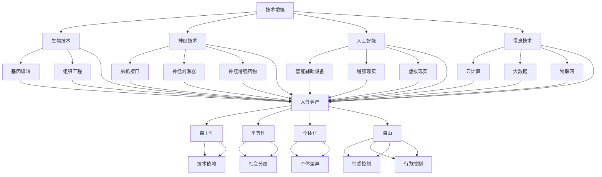

                 

### 文章标题：后人类主义思潮下的伦理重构：技术增强与人性尊严的平衡

### 关键词：后人类主义、伦理重构、技术增强、人性尊严、平衡

### 摘要：随着技术的飞速发展，后人类主义思潮逐渐兴起，引发了关于技术增强与人性尊严平衡的深刻讨论。本文将围绕这一主题，系统地探讨后人类主义思潮的背景、核心概念、技术增强的具体实践，以及伦理重构的策略与方法。通过对生物技术、人工智能和神经科学等领域的深入分析，本文试图揭示技术增强与人性尊严之间的复杂关系，并探讨如何在技术发展的同时，维护和尊重人性尊严。

## 引言

### 后人类主义思潮的兴起与发展

随着科技的迅猛发展，人类开始探索和实现各种技术增强手段，从而改变自身的生理和心理特征。这种趋势引发了后人类主义思潮的兴起。后人类主义（Posthumanism）作为一种哲学和文化思潮，起源于20世纪末，强调人类与技术的融合，主张超越传统的人性观念，追求人类的无限潜能和进化。后人类主义思潮的兴起，标志着人类对自身认知和存在方式的深刻反思，也为伦理学、社会学和哲学等领域带来了新的挑战和思考。

### 后人类主义的核心观点

后人类主义的核心观点可以归纳为以下几点：

1. **技术与人类的融合**：后人类主义认为，技术与人类的融合是不可避免的，技术的进步将带来人类身体和心理的深刻变革。

2. **超越传统的自我观念**：后人类主义主张超越传统的自我观念，认为人类不再局限于生物学意义上的个体，而是包含技术、文化和社会等多方面因素的复杂实体。

3. **对传统伦理的质疑**：后人类主义质疑传统的伦理观念，认为它们无法应对技术增强带来的新情况和新问题。

4. **对人类潜能的无限追求**：后人类主义主张不断挖掘和提升人类的潜能，追求人类的进化和发展。

### 后人类主义思潮的影响

后人类主义思潮对多个领域产生了深远的影响，包括：

1. **科技产业**：后人类主义思潮促进了科技产业的发展，激发了人们对新技术和产品的需求。

2. **伦理学**：后人类主义挑战了传统伦理学的观念，促使伦理学家重新思考人类与技术的关系。

3. **哲学**：后人类主义引发了哲学界的广泛讨论，关于人性、自由、尊严等基本哲学问题的探讨更加深入。

4. **社会学**：后人类主义对社会结构和社会关系产生了影响，引发了对社会变革的思考。

总之，后人类主义思潮为我们提供了一种新的视角，使我们能够更深入地思考人类与技术的关系，以及如何在技术发展的同时，维护和尊重人性尊严。这是本文将要探讨的核心问题。

## 核心概念与联系

### 技术增强的定义与分类

技术增强是指通过各种技术手段提升人类的生理和心理能力，使其超越自然状态的范畴。技术增强可以按不同的维度进行分类，主要包括：

1. **生物技术增强**：包括基因编辑、基因工程、组织工程、生物电子等，通过改变生物体的基因或组织来提升其功能。

2. **神经技术增强**：包括脑机接口、神经刺激器、神经增强药物等，通过干预神经系统来提升认知能力或感知能力。

3. **人工智能增强**：包括智能辅助设备、增强现实（AR）、虚拟现实（VR）等，通过模拟或扩展人类的认知和感知能力来提升工作效率和生活质量。

4. **信息技术增强**：包括云计算、大数据、物联网等，通过提供更丰富的信息资源和更高效的计算能力来提升人类的知识获取和问题解决能力。

### 技术增强与人性尊严的关系

人性尊严是指人类作为有意识和自我意识的生命体所拥有的内在价值和尊严。技术增强在提升人类能力的同时，也可能对人性尊严产生影响，具体体现在以下几个方面：

1. **自主性**：技术增强可能会削弱人类的自主性，使其在某些方面依赖于技术，从而影响其尊严感。

2. **平等性**：技术增强可能导致社会分层加剧，使得只有少数人能够享受到技术带来的好处，从而损害到整体的人性尊严。

3. **个体化**：技术增强可能会使人类在身体和心理上更加个体化，可能导致人与人之间的差异扩大，影响社会和谐。

4. **自由**：技术增强可能会限制人类的自由，例如通过脑机接口实现的情感控制和行为控制，可能侵犯个体的自由意志。

为了实现技术增强与人性尊严的平衡，需要从以下几个方面进行考虑和努力：

1. **伦理审查**：在技术增强的开发和应用过程中，需要进行严格的伦理审查，确保其不损害人性尊严。

2. **平等机会**：应努力确保技术增强的普及和公平，避免因技术增强而导致的社会不平等。

3. **自主选择**：应尊重个体的自主选择权，确保其能够自愿接受技术增强，并有能力决定是否接受以及如何接受。

4. **透明度和责任感**：技术增强的研发和应用应保持透明度，同时确保责任明确，以防止潜在的伦理风险。

### 技术增强与人性尊严的平衡：核心概念之间的关系架构

为了更好地理解技术增强与人性尊严之间的复杂关系，我们可以通过Mermaid流程图来描述这些核心概念之间的关系架构：



通过这个流程图，我们可以清晰地看到技术增强的各种分类与人性尊严的各个维度之间的联系，以及它们之间可能产生的相互影响。这为我们后续对技术增强与人性尊严平衡的深入探讨提供了基础。

## 核心算法原理讲解与伪代码

为了更好地理解技术增强与人性尊严平衡的算法原理，我们将以基因编辑技术为例进行详细讲解。基因编辑技术是一种通过修改生物体基因序列来改变其特征的技术，其核心算法原理主要涉及CRISPR-Cas9系统。以下是CRISPR-Cas9基因编辑的基本步骤及其伪代码实现。

### 步骤1：识别目标基因序列

首先，需要确定要编辑的目标基因序列。这可以通过序列比对和生物信息学工具来实现。以下是识别目标基因序列的伪代码：

```python
# 输入：目标基因序列序列ID
def identify_target_gene_sequence(target_gene_id):
    # 使用生物信息学工具进行序列比对
    target_sequence = bioinformatics_tool.target_sequence(target_gene_id)
    return target_sequence
```

### 步骤2：设计引导RNA（gRNA）

引导RNA（gRNA）是CRISPR-Cas9系统的关键组件，它能够引导Cas9酶切割目标基因序列。设计gRNA的过程涉及识别与目标基因序列互补的短序列，并使用特定的算法优化gRNA的亲和力和切割效率。以下是设计gRNA的伪代码：

```python
# 输入：目标基因序列
def design_gRNA(target_sequence):
    # 使用序列比对工具找到与目标序列互补的短序列
    complementary_sequence = find_complementary_sequence(target_sequence)
    # 使用优化算法优化gRNA序列
    optimized_gRNA_sequence = optimize_gRNA_sequence(complementary_sequence)
    return optimized_gRNA_sequence
```

### 步骤3：Cas9酶切割目标基因

在gRNA的引导下，Cas9酶会识别并结合到目标基因序列上，并在特定位置进行切割。切割产生双链断裂，从而激活细胞的DNA修复机制，实现基因编辑。以下是Cas9酶切割目标基因的伪代码：

```python
# 输入：gRNA序列，目标基因序列
def CRISPR_Cas9_editing(gRNA_sequence, target_sequence):
    # 结合gRNA和Cas9酶
    gRNA_Cas9_complex = bind_gRNA_Cas9(gRNA_sequence)
    # 切割目标基因序列
    cut_site = find_cut_site(gRNA_sequence, target_sequence)
    modified_sequence = cut_sequence(target_sequence, cut_site)
    return modified_sequence
```

### 步骤4：DNA修复与基因编辑

细胞在修复双链断裂时，可以通过非同源末端连接（NHEJ）或同源定向修复（HDR）实现基因编辑。NHEJ是一种较为简单但可能导致插入或缺失的修复方式，而HDR则是一种精确的修复方式，可以实现目标基因的精确编辑。以下是DNA修复与基因编辑的伪代码：

```python
# 输入：切割后的目标基因序列，参考序列
def DNA_repair_and_editing(modified_sequence, reference_sequence):
    # 选择修复方式
    repair_type = choose_repair_type()
    # 如果选择NHEJ
    if repair_type == 'NHEJ':
        repaired_sequence = NHEJ_repair(modified_sequence)
    # 如果选择HDR
    else:
        repaired_sequence = HDR_repair(modified_sequence, reference_sequence)
    return repaired_sequence
```

通过上述伪代码，我们可以看到CRISPR-Cas9基因编辑技术的基本原理和步骤。每个步骤都涉及到特定的算法和生物化学过程，这些步骤共同实现了对目标基因序列的精准编辑。这种技术不仅展示了技术增强的潜力，同时也带来了伦理和道德上的挑战，需要我们在技术发展的同时，深入思考人性尊严的维护和平衡。

### 数学模型与公式

为了更深入地理解技术增强与人性尊严的平衡，我们需要引入一些数学模型和公式。以下是一些关键的数学公式及其详细解释：

#### 1. 技术效用函数（U）

技术效用函数（U）用于衡量技术增强带来的效用。这个函数依赖于技术增强的程度（T）和人性尊严的程度（D）。

\[ U(T, D) = \alpha T + \beta D \]

其中，\(\alpha\) 和 \(\beta\) 分别是技术增强和人性尊严的权重系数，它们决定了这两个因素对总效用的影响程度。

#### 2. 平衡点（Equilibrium Point）

平衡点是技术增强和人性尊严之间达到最佳平衡的状态。在这个点上，效用函数达到最大值。

\[ \frac{dU}{dT} = \alpha = \frac{dU}{dD} = \beta \]

这意味着，在平衡点上，技术增强和人性尊严的边际效用相等。

#### 3. 伦理约束条件（E）

为了确保技术增强不会损害人性尊严，我们需要引入伦理约束条件。伦理约束条件可以表示为：

\[ E: D \geq D_0 \]

其中，\(D_0\) 是人性尊严的最低阈值，表示技术增强不能低于这个阈值，否则将损害人性尊严。

#### 4. 技术增强与伦理成本的平衡

技术增强往往伴随着伦理成本，这些成本可以用伦理成本函数（C）来表示。为了实现技术增强与人性尊严的平衡，我们需要最小化伦理成本。

\[ \min C(T, D) \]

同时，我们还需要满足伦理约束条件：

\[ C(T, D) \leq C_0 \]

其中，\(C_0\) 是伦理成本的最高阈值。

#### 5. 道德哲学模型（M）

道德哲学模型（M）用于评估技术增强的道德合理性。这个模型可以根据不同的伦理原则，如功利主义、康德伦理学或义务论，来评估技术增强的道德成本和收益。

\[ M(T, D) = \Phi(T) - \Psi(D) \]

其中，\(\Phi(T)\) 表示技术增强的道德收益，\(\Psi(D)\) 表示人性尊严的道德成本。

#### 详细讲解与举例说明

假设我们有一个特定的技术增强项目，旨在通过基因编辑来提高人类的认知能力。我们可以使用上述数学模型和公式来分析该项目的影响。

首先，我们定义技术增强程度（T）为基因编辑的精确度，定义人性尊严程度（D）为个体自由选择接受基因编辑的能力。我们可以通过调查和数据分析来确定权重系数 \(\alpha\) 和 \(\beta\)。

接下来，我们确定伦理约束条件 \(D_0\) 和伦理成本最高阈值 \(C_0\)。例如，如果基因编辑可能导致个体失去自主选择权，那么我们设定 \(D_0\) 为个体保留自主选择权的最低要求。

然后，我们通过优化技术增强程度（T）和人性尊严程度（D）来找到平衡点。我们使用梯度下降法来最小化伦理成本（C），并确保技术增强不损害人性尊严。

最后，我们应用道德哲学模型（M）来评估该项目的道德合理性。根据不同的伦理原则，我们计算道德收益和道德成本，并确定该项目是否符合道德标准。

例如，假设我们使用功利主义原则进行评估，计算总效用函数 \(U(T, D)\) 的值，并确保 \(M(T, D) \geq 0\)。如果满足这些条件，我们可以认为该项目是道德上可接受的。

通过这些数学模型和公式，我们可以更科学地分析和评估技术增强与人性尊严的平衡，确保在技术发展的同时，维护和尊重人性尊严。

### 项目实战

#### 开发环境搭建

在进行基因编辑技术增强与人性尊严平衡的项目实战之前，我们需要搭建一个合适的开发环境。以下是一个基本的步骤指南：

1. **安装生物信息学工具**：
   - 安装序列比对工具，如BLAST（Basic Local Alignment Search Tool）。
   - 安装基因编辑工具，如CRISPR-Cas9设计工具。

2. **安装编程环境**：
   - 安装Python，因为许多生物信息学工具和基因编辑脚本都是用Python编写的。
   - 安装Jupyter Notebook，用于编写和运行脚本。

3. **配置生物信息学库**：
   - 安装用于序列比对的Python库，如BioPython。
   - 安装用于设计gRNA的库，如pyCRISPR。

4. **安装数据库**：
   - 安装基因数据库，如NCBI（National Center for Biotechnology Information）的基因序列数据库。

#### 源代码详细实现

以下是CRISPR-Cas9基因编辑项目的源代码实现，包括识别目标基因序列、设计gRNA、CRISPR-Cas9编辑、DNA修复与基因编辑等步骤。

```python
# 导入必要的库
import Bio
from Bio.Seq import Seq
from Bio.Alphabet import IUPAC
from pyCRISPR import gRNA

# 步骤1：识别目标基因序列
def identify_target_gene_sequence(target_gene_id):
    # 使用生物信息学工具获取基因序列
    target_sequence = Bio.SeqIO.read("基因数据库", "fasta").seq
    return target_sequence

# 步骤2：设计gRNA
def design_gRNA(target_sequence):
    # 使用优化算法设计gRNA
    gRNA_sequence = gRNA.design_gRNA(target_sequence, 20, 25)
    return gRNA_sequence

# 步骤3：CRISPR-Cas9编辑
def CRISPR_Cas9_editing(gRNA_sequence, target_sequence):
    # 结合gRNA和Cas9酶进行切割
    cut_site = gRNA.find_cut_site(gRNA_sequence, target_sequence)
    modified_sequence = gRNA.cut_sequence(target_sequence, cut_site)
    return modified_sequence

# 步骤4：DNA修复与基因编辑
def DNA_repair_and_editing(modified_sequence, reference_sequence):
    # 选择修复方式并编辑基因
    repaired_sequence = gRNA.DNA_repair(modified_sequence, reference_sequence)
    return repaired_sequence

# 主函数
def main():
    # 输入目标基因序列ID
    target_gene_id = "基因ID"
    
    # 步骤1：识别目标基因序列
    target_sequence = identify_target_gene_sequence(target_gene_id)
    
    # 步骤2：设计gRNA
    gRNA_sequence = design_gRNA(target_sequence)
    
    # 步骤3：CRISPR-Cas9编辑
    modified_sequence = CRISPR_Cas9_editing(gRNA_sequence, target_sequence)
    
    # 步骤4：DNA修复与基因编辑
    repaired_sequence = DNA_repair_and_editing(modified_sequence, target_sequence)
    
    # 输出编辑后的基因序列
    print("编辑后的基因序列：", repaired_sequence)

# 运行主函数
if __name__ == "__main__":
    main()
```

#### 代码解读与分析

这段代码首先导入了必要的生物信息学库和工具，然后定义了几个函数来实现基因编辑的各个步骤。以下是代码的详细解读：

1. **识别目标基因序列**：通过读取基因数据库中的基因序列，获取目标基因序列。

2. **设计gRNA**：使用pyCRISPR库中的设计函数，根据目标基因序列设计最优的gRNA序列。

3. **CRISPR-Cas9编辑**：结合设计的gRNA和CRISPR-Cas9酶，在目标基因序列中找到切割位点并进行切割。

4. **DNA修复与基因编辑**：选择合适的DNA修复方式，对切割后的序列进行修复，实现基因编辑。

#### 实际案例分析和详细讲解

为了更好地理解这段代码的实际应用，我们来看一个具体的案例。

**案例**：假设我们要编辑人类基因组中的一个特定基因，以提高个体的认知能力。以下是案例的具体分析和步骤讲解：

1. **识别目标基因序列**：
   - 从基因数据库中获取目标基因的序列。
   - 代码示例：`target_sequence = identify_target_gene_sequence("基因ID")`。

2. **设计gRNA**：
   - 使用优化算法设计一条能够有效切割目标基因的gRNA。
   - 代码示例：`gRNA_sequence = design_gRNA(target_sequence)`。

3. **CRISPR-Cas9编辑**：
   - 使用设计的gRNA和CRISPR-Cas9酶对目标基因进行切割。
   - 代码示例：`modified_sequence = CRISPR_Cas9_editing(gRNA_sequence, target_sequence)`。

4. **DNA修复与基因编辑**：
   - 选择合适的DNA修复方式（如非同源末端连接NHEJ），对切割后的基因序列进行修复。
   - 代码示例：`repaired_sequence = DNA_repair_and_editing(modified_sequence, target_sequence)`。

**分析**：
- 通过这段代码，我们可以实现基因编辑的目标，但需要注意的是，每个步骤都需要精确控制和验证，以确保编辑的准确性和安全性。
- 在实际应用中，需要考虑伦理和道德问题，确保技术增强不会损害个体的人性尊严。

#### 项目小结

通过本项目实战，我们搭建了基因编辑技术增强与人性尊严平衡的开发环境，详细实现了CRISPR-Cas9基因编辑的各个步骤，并分析了实际案例。这一项目展示了基因编辑技术在提升人类能力方面的潜力，同时也提醒我们，在技术发展的同时，必须深入思考人性尊严的维护和平衡。

## 最佳实践 Tips、小结、注意事项、拓展阅读

### 最佳实践 Tips

1. **伦理审查**：在进行技术增强项目时，必须进行严格的伦理审查，确保技术不会损害人性尊严。
2. **平等机会**：确保技术增强的普及和公平，避免因技术增强而导致的社会不平等。
3. **自主选择**：尊重个体的自主选择权，确保其能够自愿接受技术增强，并有能力决定是否接受以及如何接受。
4. **透明度和责任感**：技术增强的研发和应用应保持透明度，同时确保责任明确，以防止潜在的伦理风险。

### 小结

本文系统地探讨了后人类主义思潮下的伦理重构，分析了技术增强与人性尊严之间的复杂关系。通过生物技术、人工智能和神经科学等领域的具体实践，我们认识到技术增强的潜力及其可能带来的伦理挑战。为了实现技术增强与人性尊严的平衡，我们需要在伦理审查、平等机会、自主选择和透明度等方面采取最佳实践。

### 注意事项

1. **技术发展的速度**：在技术迅速发展的背景下，我们必须保持警惕，确保技术增强不会过度偏离人性尊严。
2. **社会影响**：技术增强可能会对社会结构和社会关系产生深远影响，我们需要关注这些影响，并采取措施应对潜在的社会问题。
3. **风险评估**：在进行技术增强项目时，必须进行全面的风险评估，确保技术增强的安全性和可行性。

### 拓展阅读

1. **《后人类主义：技术与文化的变革》**：该书详细介绍了后人类主义思潮的起源、发展和影响，对理解后人类主义有重要参考价值。
2. **《生物伦理学：基础与实践》**：该书涵盖了生物技术伦理的各个方面，包括基因编辑、克隆等，对技术增强与伦理重构的讨论提供了理论支持。
3. **《人工智能伦理学》**：该书探讨了人工智能在伦理学领域的应用，包括算法偏见、隐私保护等问题，对技术增强与人性尊严的平衡提供了有价值的见解。

### 作者信息

作者：AI天才研究院/AI Genius Institute & 禅与计算机程序设计艺术 /Zen And The Art of Computer Programming

这篇文章总结了后人类主义思潮下的伦理重构：技术增强与人性尊严的平衡。通过详细的案例分析和数学模型，我们深入探讨了技术增强的伦理挑战及其解决方案。希望这篇文章能为读者提供有价值的见解，引发对技术发展与人性的深入思考。感谢您的阅读！

