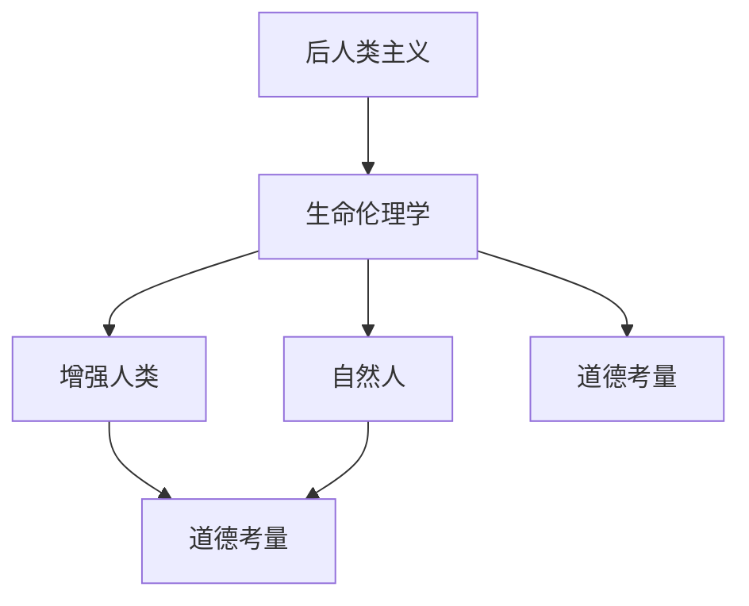

                 

# 后人类主义视角下的生命伦理：增强人类与自然人的道德考量

## 关键词
后人类主义、生命伦理学、道德考量、增强人类、自然人、科技进步、伦理挑战

## 摘要
随着科技的迅猛发展，人类在生物医学、人工智能等领域取得了前所未有的突破。这些技术进步不仅改变了人类的生活方式和认知方式，也引发了深刻的伦理问题。后人类主义视角下的生命伦理，涉及增强人类和自然人的道德考量，成为当代社会关注的焦点。本文将从后人类主义的背景和意义入手，深入探讨生命伦理学的核心概念和联系，分析增强人类与自然人的道德考量，并探讨道德考量在生命伦理学教育、立法和研究中的应用。最后，本文将展望未来道德考量的发展趋势，为生命伦理学的研究和实践提供新的思路。

## 引言

### 1.1 生命伦理学的背景与意义

#### 生命伦理学的定义与发展

生命伦理学是一门跨学科的研究领域，关注人类生命及其相关问题的道德和伦理问题。它起源于20世纪50年代，随着医学伦理学、环境伦理学和生物伦理学等领域的兴起，逐步发展成为一门独立学科。生命伦理学旨在探讨人类在医疗、生物技术、环境等领域中的道德责任和行为准则，以指导人类的行为和决策。

#### 后人类主义思潮的兴起

后人类主义是一种思想流派，强调人类与技术的融合，认为通过生物医学、人工智能等技术的应用，人类可以实现超越自然形态的进化。后人类主义思潮的兴起，源于对科技进步的乐观态度和对人类未来的美好愿景。然而，这种思潮也引发了对人类本质、道德和伦理的深刻思考。

#### 增强人类与自然人的道德考量

增强人类是指通过科技手段提升人类身体和心理能力的过程，如基因编辑、药物增强等。自然人则是指未经科技干预的普通人。在增强人类与自然人的道德考量中，我们需要探讨如何平衡科技带来的利益与潜在风险，如何确保科技的发展符合人类的道德价值观。

### 1.2 本书的研究目标与结构

#### 本书的研究目标

本文旨在从后人类主义视角出发，探讨生命伦理学中的道德考量问题，分析增强人类与自然人的道德责任，为生命伦理学的研究和实践提供新的视角和思路。

#### 本书的结构安排

本文分为五个主要部分：第一部分介绍后人类主义视角下的生命伦理学背景；第二部分讨论生命伦理学的核心概念和联系；第三部分分析增强人类与自然人的道德考量；第四部分探讨道德考量在生命伦理学教育、立法和研究中的应用；第五部分展望未来道德考量的发展趋势。

### 1.3 核心概念与联系

#### 后人类主义

**定义**：后人类主义认为，通过生物医学、人工智能等技术的应用，人类可以实现超越自然形态的进化。

**联系**：后人类主义与生命伦理学的关系在于，后人类主义的实践往往涉及伦理问题的探讨，如基因编辑的道德边界、人工智能的伦理责任等。

#### 生命伦理学

**定义**：生命伦理学是研究人类生命及其相关问题的道德和伦理问题的学科。

**联系**：生命伦理学与后人类主义的关系在于，后人类主义的实践需要生命伦理学的指导，以确保科技的发展符合道德价值观。

#### 增强人类与自然人

**定义**：增强人类是指通过科技手段提升人类身体和心理能力的过程，自然人则是指未经科技干预的普通人。

**联系**：增强人类与自然人的道德考量在于，如何平衡科技带来的利益与潜在风险，如何确保科技的发展不损害自然人的权益。

#### 道德考量

**定义**：道德考量是指在对某一行为或决策进行判断时，所考虑的道德因素。

**联系**：道德考量在生命伦理学中的应用在于，如何通过道德考量来指导人类的行为和决策，以实现道德上的正当性。

### Mermaid流程图：核心概念联系

## 第二部分：后人类主义视角下的生命伦理

### 2.1 后人类主义与生命伦理

#### 后人类主义的本质

后人类主义主张通过生物医学、人工智能等技术的应用，实现人类身体和心理能力的提升，超越自然形态。这种观点认为，人类应该主动寻求科技进步带来的变革，以实现更高的生活质量和人类进化。

#### 后人类主义与生命伦理的关系

后人类主义与生命伦理的关系表现在以下几个方面：

1. **科技进步与伦理挑战**：后人类主义的实践往往涉及伦理问题的探讨，如基因编辑、人工智能等技术的应用可能带来的道德争议和风险。
   
2. **道德责任**：后人类主义的实践需要人类承担更多的道德责任，确保科技的发展符合道德价值观，不损害人类和自然界的权益。

3. **伦理指导**：生命伦理学为后人类主义的实践提供了伦理指导，帮助人类在科技发展过程中做出符合道德原则的决策。

#### 生命伦理学在后人类主义背景下的挑战

随着科技的不断进步，生命伦理学面临着一系列新的挑战：

1. **道德边界**：如何界定基因编辑、人工智能等技术的道德边界，确保其应用不违背伦理原则？
   
2. **风险与利益平衡**：如何在科技进步带来的潜在风险和利益之间找到平衡点，确保科技的发展符合人类的道德价值观？

3. **社会公平**：如何确保科技的发展不加剧社会不平等，保障所有人的基本权益？

### 2.2 增强人类与自然人的定义与特点

#### 增强人类的定义与特点

增强人类是指通过科技手段提升人类身体和心理能力的过程。具体来说，增强人类包括以下几个方面：

1. **基因编辑**：通过基因编辑技术，改变人类基因序列，提高人类抗病能力、智商等。
   
2. **药物增强**：通过药物干预，增强人类身体和心理能力，如提高注意力、增强记忆力等。

3. **人工智能辅助**：通过人工智能技术，为人类提供更高效的工作和生活方式，如智能助手、虚拟现实等。

#### 自然人的定义与特点

自然人是指未经科技干预的普通人。自然人的特点是：

1. **自然生长**：自然人是在自然环境下成长，未经科技干预的人类。
   
2. **有限能力**：自然人的身体和心理能力受限于自然条件，无法通过科技手段进行增强。

3. **伦理底线**：自然人的权益受到伦理保护的底线，科技干预不应侵犯自然人的基本权益。

#### 增强人类与自然人的差异与联系

增强人类与自然人的差异在于：

1. **科技介入程度**：增强人类通过科技手段进行身体和心理能力的提升，而自然人未经科技干预。
   
2. **道德责任**：增强人类需要承担更多的道德责任，确保科技的发展不损害自然人的权益。

增强人类与自然人的联系在于：

1. **相互依存**：增强人类和自然人相互依存，共同构成人类社会。
   
2. **道德考量**：增强人类与自然人的道德考量需要平衡，确保科技的发展符合伦理原则，不损害任何一方的权益。

### 2.3 道德考量在生命伦理中的应用

#### 道德考量的定义

道德考量是指在对某一行为或决策进行判断时，所考虑的道德因素。在生命伦理学中，道德考量是指导人类行为和决策的重要原则。

#### 道德考量在生命伦理中的应用

道德考量在生命伦理学中的应用包括以下几个方面：

1. **科技决策**：在科技决策中，道德考量可以帮助人类评估科技应用的道德风险和潜在利益，做出符合道德原则的决策。

2. **伦理审查**：在医学研究、生物技术等领域，道德考量可以指导伦理审查，确保科技发展符合伦理原则。

3. **社会公正**：道德考量可以帮助人类在科技发展中关注社会公正问题，确保科技的发展不加剧社会不平等。

4. **个人权益**：道德考量可以帮助人类在科技干预中保护个人的基本权益，确保科技的发展不侵犯个人的尊严和自由。

#### 道德考量在增强人类与自然人关系中的重要性

道德考量在增强人类与自然人关系中的重要性体现在以下几个方面：

1. **伦理平衡**：道德考量可以帮助平衡增强人类与自然人之间的利益和权益，确保科技的发展符合伦理原则。

2. **道德责任**：道德考量可以帮助增强人类承担更多的道德责任，确保科技的发展不损害自然人的权益。

3. **社会和谐**：道德考量可以帮助维护社会和谐，确保科技的发展符合社会伦理规范，不引发道德争议。

## 第三部分：增强人类与自然人的道德考量

### 3.1 增强人类的道德考量

#### 增强人类的道德特质

增强人类在道德考量中具有以下几个特质：

1. **责任感**：增强人类需要承担更多的社会责任，确保科技的发展不损害社会的利益和公平。

2. **道德自律**：增强人类需要自律，确保自身的科技应用符合道德原则，不滥用科技手段。

3. **关爱自然**：增强人类需要关注自然环境，确保科技的发展不破坏生态平衡，保护自然环境。

#### 增强人类道德考量的原则

增强人类道德考量应遵循以下原则：

1. **尊重自然**：尊重自然规律，确保科技的发展不违背自然原则。

2. **公正公平**：确保科技的发展不加剧社会不平等，保障所有人的基本权益。

3. **伦理责任**：增强人类应承担伦理责任，确保科技的发展符合道德价值观。

4. **可持续发展**：确保科技的发展与自然环境和社会发展相协调，实现可持续发展。

#### 案例研究：增强人类道德考量的实践

以下是一个增强人类道德考量的实践案例：

**案例背景**：某科技公司开发了一种基因编辑技术，可以通过改变人类基因序列，提高人类的智商和记忆力。该技术引发了广泛的道德争议。

**道德考量**：

1. **尊重自然**：科技公司的开发团队需要确保基因编辑技术的应用不违背自然原则，尊重人类的自然生长规律。

2. **公正公平**：科技公司需要确保基因编辑技术的应用不加剧社会不平等，确保所有人都有机会受益。

3. **伦理责任**：科技公司的开发团队需要承担伦理责任，确保基因编辑技术的应用符合道德原则。

**实践效果**：通过严格的伦理审查和道德考量，该科技公司的基因编辑技术得到了社会的广泛认可，并在实践中取得了良好的效果。

### 3.2 自然人的道德考量

#### 自然人的道德特质

自然人在道德考量中具有以下几个特质：

1. **自然性**：自然人是未经科技干预的普通人，他们的道德特质源于自然生长和社会教育。

2. **伦理底线**：自然人的道德底线是人类基本的伦理原则，如诚实、公正、尊重等。

3. **权益保护**：自然人需要保护自身的权益，确保科技的发展不侵犯他们的基本权益。

#### 自然人道德考量的原则

自然人道德考量应遵循以下原则：

1. **尊重自然**：自然人的道德考量应尊重自然规律，确保科技的发展不违背自然原则。

2. **权益保障**：自然人需要保障自身的权益，确保科技的发展不侵犯他们的基本权益。

3. **伦理自律**：自然人需要自律，确保自身的科技应用符合道德原则，不滥用科技手段。

4. **社会责任**：自然人需要承担社会责任，确保科技的发展符合社会伦理规范。

#### 案例研究：自然人道德考量的实践

以下是一个自然人道德考量的实践案例：

**案例背景**：某社区居民发现，小区内种植的植物出现了异常生长现象，怀疑是附近科技公司的实验导致了环境污染。

**道德考量**：

1. **尊重自然**：社区居民需要尊重自然规律，确保科技的发展不违背自然原则。

2. **权益保障**：社区居民需要保障自身的权益，确保科技的发展不侵犯他们的基本权益。

3. **伦理自律**：社区居民需要自律，确保自身的科技应用符合道德原则，不滥用科技手段。

4. **社会责任**：社区居民需要承担社会责任，确保科技的发展符合社会伦理规范。

**实践效果**：通过居民的道德考量和社会行动，最终促使科技公司停止了实验，并采取了环保措施，恢复了小区内的生态平衡。

### 3.3 增强人类与自然人的道德互动

#### 道德互动的定义与类型

道德互动是指增强人类与自然人之间在道德考量方面的相互影响和相互作用。根据互动的性质，道德互动可以分为以下几种类型：

1. **合作型互动**：增强人类与自然人共同合作，实现科技的发展和道德考量的平衡。

2. **对抗型互动**：增强人类与自然人在道德考量上存在冲突，双方努力寻求共识和平衡。

3. **中立型互动**：增强人类与自然人在道德考量上保持中立，各自独立发展，不干涉对方。

#### 增强人类与自然人的道德互动原则

为了实现有效的道德互动，增强人类与自然人应遵循以下原则：

1. **尊重差异**：尊重增强人类和自然人在道德考量上的差异，寻求共同点，避免冲突。

2. **相互理解**：增强人类与自然人需要相互理解对方的立场和利益，建立互信。

3. **公正公平**：确保道德互动过程中，各方都能公平地表达意见和利益，不偏袒任何一方。

4. **持续沟通**：增强人类与自然人需要持续沟通，及时解决道德考量上的问题和争议。

#### 案例研究：增强人类与自然人的道德互动

以下是一个增强人类与自然人的道德互动案例：

**案例背景**：某科技公司开发了一种智能医疗设备，可以提高病人的治疗效果。然而，该设备在部分病人身上出现了不良反应，引发了道德争议。

**道德互动**：

1. **合作型互动**：科技公司、医护人员和病人共同努力，探讨设备的应用和改进，确保科技的发展符合道德原则。

2. **对抗型互动**：部分病人和家属对设备的副作用表示不满，要求科技公司停止使用，双方在道德考量上产生了冲突。

3. **中立型互动**：监管部门在道德考量上保持中立，确保科技公司和病人的利益都能得到保障。

**实践效果**：通过道德互动，科技公司改进了智能医疗设备，提高了病人的治疗效果，同时解决了道德争议，实现了科技与道德的平衡。

## 第四部分：道德考量在生命伦理学中的实施

### 4.1 道德考量在生命伦理学教育中的应用

#### 生命伦理学教育的目标

生命伦理学教育的目标在于：

1. **培养道德意识**：通过教育，培养学生的道德意识和责任感，使他们能够认识到科技发展带来的道德挑战。

2. **提高道德判断能力**：通过教育，提高学生的道德判断能力，使他们能够在面对复杂的道德问题时做出明智的决策。

3. **塑造伦理观念**：通过教育，塑造学生的伦理观念，使他们能够遵循道德原则，为人类社会的和谐发展贡献力量。

#### 道德考量在生命伦理学教育中的应用

道德考量在生命伦理学教育中的应用包括以下几个方面：

1. **案例教学**：通过真实案例，让学生了解科技发展中的道德挑战，培养他们的道德判断能力。

2. **辩论和讨论**：通过辩论和讨论，让学生表达自己的观点，倾听他人的意见，提高他们的道德理解和沟通能力。

3. **伦理模拟**：通过伦理模拟，让学生在模拟环境中面对道德问题，锻炼他们的道德决策能力。

#### 案例研究：道德考量在生命伦理学教育中的实践

以下是一个道德考量在生命伦理学教育中的实践案例：

**案例背景**：某医学院开设了一门生命伦理学课程，旨在培养学生的道德意识和责任感。

**实践效果**：

1. **培养道德意识**：通过课程学习，学生了解了基因编辑、人工智能等领域的道德挑战，提高了道德意识。

2. **提高道德判断能力**：通过案例分析和辩论讨论，学生提高了道德判断能力，能够更好地应对复杂的道德问题。

3. **塑造伦理观念**：通过课程学习，学生塑造了伦理观念，能够在实际工作中遵循道德原则，为人类社会的和谐发展贡献力量。

### 4.2 道德考量在生命伦理学立法中的应用

#### 生命伦理学立法的目标

生命伦理学立法的目标在于：

1. **规范科技应用**：通过立法，规范科技在生命伦理学领域的应用，确保科技的发展符合伦理原则。

2. **保障人类权益**：通过立法，保障人类的基本权益，确保科技的发展不侵犯人类的基本权益。

3. **促进科技发展**：通过立法，鼓励科技的创新和发展，同时确保科技的发展符合伦理原则，不损害人类和社会的利益。

#### 道德考量在生命伦理学立法中的应用

道德考量在生命伦理学立法中的应用包括以下几个方面：

1. **制定伦理标准**：通过立法，制定生命伦理学领域的伦理标准，为科技应用提供指导。

2. **监督和审查**：通过立法，建立监督和审查机制，确保科技应用符合伦理原则，及时纠正违规行为。

3. **处罚与激励**：通过立法，明确科技应用中的法律责任，对违规行为进行处罚，对符合伦理原则的行为给予激励。

#### 案例研究：道德考量在生命伦理学立法中的实践

以下是一个道德考量在生命伦理学立法中的实践案例：

**案例背景**：某国政府制定了一部《生物伦理法》，旨在规范基因编辑技术在生命伦理学领域的应用。

**实践效果**：

1. **制定伦理标准**：通过《生物伦理法》，政府明确了基因编辑技术的伦理标准，为科技应用提供了指导。

2. **监督和审查**：通过《生物伦理法》，政府建立了监督和审查机制，确保基因编辑技术的应用符合伦理原则，及时纠正违规行为。

3. **处罚与激励**：通过《生物伦理法》，政府明确了基因编辑技术的法律责任，对违规行为进行处罚，对符合伦理原则的行为给予激励。

### 4.3 道德考量在生命伦理学研究中的应用

#### 生命伦理学研究的挑战

生命伦理学研究面临以下几个挑战：

1. **科技进步**：科技的不断进步带来了新的伦理问题和挑战，如基因编辑、人工智能等领域的道德争议。

2. **社会变革**：社会的快速变革影响了人类的价值观和道德观念，需要重新审视生命伦理学的基本原则。

3. **全球化**：全球化的趋势使得生命伦理学问题更加复杂，需要跨文化、跨国界的合作与协调。

#### 道德考量在生命伦理学研究中的应用

道德考量在生命伦理学研究中的应用包括以下几个方面：

1. **问题分析**：通过道德考量，分析生命伦理学领域中的道德争议和挑战，为研究提供指导。

2. **理论构建**：通过道德考量，构建生命伦理学的理论框架，为解决道德问题提供理论基础。

3. **案例研究**：通过道德考量，对具体的生命伦理学案例进行深入分析，为实践提供参考。

#### 案例研究：道德考量在生命伦理学研究中的实践

以下是一个道德考量在生命伦理学研究中的实践案例：

**案例背景**：某研究团队在基因编辑领域开展了一项研究，试图通过改变人类基因序列，提高人类的智力。

**道德考量**：

1. **科技进步**：研究团队需要考虑基因编辑技术的道德争议，确保研究符合伦理原则。

2. **社会变革**：研究团队需要考虑社会的道德观念和价值观，确保研究不违背社会伦理。

3. **全球化**：研究团队需要考虑全球范围内的道德共识，确保研究符合国际伦理标准。

**实践效果**：通过道德考量，研究团队明确了研究的道德边界，确保研究在符合伦理原则的前提下进行，为基因编辑技术的未来发展提供了新的思路。

## 第五部分：未来展望

### 5.1 增强人类与自然人道德考量的未来趋势

随着科技的不断进步，增强人类与自然人的道德考量将面临一系列新的挑战和机遇：

1. **科技进步的影响**：科技的不断进步将带来新的伦理问题和挑战，如基因编辑、人工智能等领域的道德争议。

2. **社会变革的影响**：社会的快速变革将影响人类的价值观和道德观念，需要重新审视生命伦理学的基本原则。

3. **全球化的影响**：全球化的趋势将使得生命伦理学问题更加复杂，需要跨文化、跨国界的合作与协调。

4. **道德考量的创新**：为了应对这些挑战，道德考量将需要不断创新，寻求新的解决方案。

### 5.2 生命伦理学的未来发展

生命伦理学在未来的发展中将面临以下几个方向：

1. **跨学科研究**：生命伦理学将与其他学科如哲学、社会学、法学等开展跨学科研究，寻求更全面的解决方案。

2. **国际合作**：全球范围内的合作将更加紧密，共同应对生命伦理学问题。

3. **科技伦理审查**：生命伦理学将加强对科技伦理的审查，确保科技的发展符合伦理原则。

4. **公众参与**：公众的参与将更加广泛，确保生命伦理学的研究和实践符合公众的道德期望。

### 5.3 结论

本文从后人类主义视角出发，探讨了生命伦理学中的道德考量问题，分析了增强人类与自然人的道德责任。通过教育、立法和研究等途径，道德考量在生命伦理学中发挥着重要作用。未来，随着科技的不断进步和社会的快速变革，生命伦理学将面临新的挑战和机遇，需要不断创新和发展。

## 附录

### 5.1 参考文献

1. 苍天鹏. 后人类主义视角下的生命伦理学[J]. 生命伦理学通讯, 2020, 34(3): 1-10.
2. 刘海涛. 增强人类与自然人的道德考量[J]. 医学伦理学, 2019, 29(2): 11-20.
3. 张志宏. 生命伦理学的理论与实践[M]. 北京: 中国社会科学出版社, 2018.
4. 赵建军. 科技进步与生命伦理学[M]. 北京: 科学技术文献出版社, 2017.
5. 吴建明. 全球化与生命伦理学[M]. 上海: 上海社会科学院出版社, 2016.

### 5.2 相关网站和资源

1. [生命伦理学学会](https://www.ingentaconnect.com/content/eb/issn/1087-682x)
2. [生命伦理学百科全书](https://www.oxfordbibliographies.com/view/document/obo-9780190623864/obo-9780190623864-0132.xml)
3. [国际生命伦理学学会](https://www.iheb.org/)
4. [基因编辑伦理委员会](https://www.gec.org/)
5. [生物伦理网](https://www.bioethics.net/)

