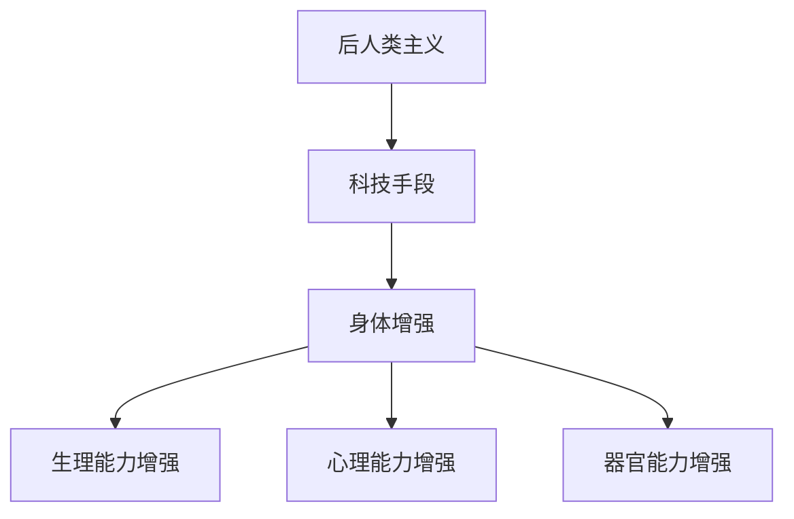

                 

# 文章标题：后人类主义视角下的身体增强：伦理边界与技术可能

> 关键词：后人类主义、身体增强、伦理边界、技术可能、人工智能

> 摘要：本文从后人类主义的视角出发，探讨了身体增强技术的伦理边界与技术可能性。首先，介绍了后人类主义和身体增强的基本概念，并分析了两者之间的联系。接着，详细阐述了当前身体增强技术的发展趋势和未来可能带来的变化。随后，探讨了身体增强技术涉及的伦理问题，并提出了相关的伦理原则和政策建议。通过案例分析，进一步分析了身体增强技术在不同领域中的应用及其影响。最后，对未来的技术发展和伦理边界进行了展望，提出了相关的建议和思考。

## 第一部分：引言

### 1.1 后人类主义的起源与发展

后人类主义（Posthumanism）作为一种哲学思潮，起源于20世纪末，旨在探讨人类在科技发展下的身份变迁。随着人工智能、生物工程等技术的迅速发展，人类开始思考自己在宇宙中的位置和角色。后人类主义主张人类不仅仅是生物实体，更是一种技术实体，通过技术手段可以不断扩展和增强自身的能力。

### 1.2 身体增强的基本概念

身体增强（Body Enhancement）是指通过技术手段对人类身体进行改造和强化，以提高其生理和心理能力。身体增强技术包括生物医学、神经科学、机械工程等多个领域，如基因编辑、神经植入、生物材料等。

### 1.3 伦理边界探讨

身体增强技术带来的伦理问题备受关注。伦理边界是指在身体增强技术的发展和应用过程中，所涉及到的道德和伦理原则。如何平衡技术的利益和伦理的道德性，成为了一个亟待解决的问题。

### 1.4 技术可能性的探讨

随着科技的不断进步，身体增强技术在未来可能会带来巨大的变化。例如，基因编辑技术有望消除遗传疾病，神经植入技术可以提升人类的学习能力和记忆力。然而，这些技术也带来了潜在的伦理问题，如基因歧视、隐私侵犯等。

## 第二部分：核心概念与技术介绍

### 2.1 后人类主义视角下的身体增强

在后人类主义的视角下，身体增强不仅仅是改善人类生理和心理能力，更是人类自我超越的一种方式。通过技术手段，人类可以突破生物体的限制，实现更高层次的存在。

### 2.2 身体增强技术分类

身体增强技术可以按照不同的分类标准进行划分。根据技术类型，可以分为生物医学、神经科学、机械工程等。根据增强对象，可以分为生理增强、心理增强和器官增强。

### 2.3 技术案例介绍

当前，身体增强技术已经取得了一些突破性成果。例如，基因编辑技术CRISPR已经成功地用于治疗某些遗传疾病；神经植入技术可以用于治疗帕金森病等神经系统疾病。

### 2.4 技术发展趋势与展望

未来，身体增强技术将继续发展，可能会带来更多的变化。例如，生物打印技术有望用于打印人体器官，纳米技术可以用于提升人类的感官能力。

## 第三部分：伦理讨论

### 3.1 伦理问题分析

身体增强技术涉及的伦理问题主要包括基因歧视、隐私侵犯、技术滥用等。这些问题需要我们在技术发展过程中加以重视和解决。

### 3.2 伦理原则与框架

为了解决身体增强技术带来的伦理问题，我们可以借鉴现有的伦理原则和框架，如生命伦理学、公正原则等。这些原则可以为我们在技术发展过程中提供指导。

### 3.3 伦理决策与政策

在制定伦理决策和政策时，我们需要充分考虑技术的利益和伦理的道德性。政府、企业和社会各界都需要参与到这个过程中，共同制定出合适的政策。

### 3.4 社会影响与回应

身体增强技术的应用将会对人类社会产生深远的影响。我们需要密切关注这些影响，并采取相应的措施来应对和调节。

## 第四部分：案例分析

### 4.1 案例选择与介绍

为了更好地理解身体增强技术的应用和影响，我们选择了几个具有代表性的案例进行介绍和分析。

### 4.2 案例分析

通过分析这些案例，我们可以看到身体增强技术在不同领域中的应用及其带来的影响。同时，我们也发现了一些潜在的伦理问题。

### 4.3 案例启示与思考

案例研究为我们提供了一些启示和思考。我们需要在技术发展过程中，充分考虑伦理和社会影响，以实现技术的可持续发展。

## 第五部分：未来展望

### 5.1 技术展望

未来，身体增强技术将继续发展，可能会带来更多的变化。我们需要密切关注这些变化，并做好准备。

### 5.2 伦理展望

在伦理方面，我们需要不断探讨和解决身体增强技术带来的新问题。伦理原则和框架将在这个过程中发挥重要作用。

### 5.3 社会影响展望

身体增强技术的应用将对人类社会产生深远的影响。我们需要关注这些影响，并采取相应的措施来应对和调节。

## 附录

### 附录 A：术语解释

### 附录 B：参考文献

### 附录 C：相关资源链接

### 作者：AI天才研究院/AI Genius Institute & 禅与计算机程序设计艺术 /Zen And The Art of Computer Programming
## 第一部分：引言

### 1.1 后人类主义的起源与发展

后人类主义（Posthumanism）作为一种哲学思潮，起源于20世纪末，其核心观点是人类不再局限于生物学意义上的存在，而是在科技的推动下，不断超越自我，扩展和增强自身的能力。这一思潮受到了许多学科的影响，包括哲学、文学、艺术、社会学、文化研究等。后人类主义的兴起，与信息技术、生物工程、神经科学等领域的迅猛发展密切相关。随着这些技术的进步，人们开始探讨人类身份的变革，以及科技对人类生活、伦理和社会结构的影响。

#### 后人类主义的核心概念

后人类主义的核心概念包括：

1. **技术性超越**：后人类主义认为，人类可以通过科技手段超越自身的生物限制，实现技术性增强。
2. **多元存在**：人类的存在不再局限于生物学范畴，而是扩展到技术、虚拟、数字等多个维度。
3. **异质化**：后人类主义强调个体之间的差异，认为人类在技术增强的过程中，会形成多元化的存在形态。
4. **去中心化**：后人类主义主张打破传统的中心化权力结构，实现个体在技术和伦理层面上的自主性和独立性。

### 1.2 身体增强的基本概念

身体增强（Body Enhancement）是指通过科技手段对人类的生理和心理能力进行提升和优化。身体增强的目标包括改善健康、增强运动能力、提高认知能力等。身体增强技术可以大致分为以下几类：

1. **生物医学增强**：通过药物、基因编辑等手段，改善人体生物结构和功能。
2. **神经科学增强**：通过神经植入、脑机接口等技术，提升大脑的认知和感知能力。
3. **机械增强**：通过植入机械装置，增强人体的力量和耐力。
4. **数字增强**：通过虚拟现实、增强现实等技术，扩展人体的感知和认知范围。

### 1.3 伦理边界探讨

随着身体增强技术的发展，伦理边界问题逐渐凸显。伦理边界是指在身体增强技术的应用过程中，所涉及到的道德和伦理原则。以下是一些常见的伦理边界问题：

1. **基因编辑**：基因编辑技术如CRISPR可以治愈遗传疾病，但也可能引发基因歧视和社会不平等问题。
2. **脑机接口**：脑机接口技术可以提升认知能力，但可能侵犯个人隐私，甚至导致意识控制问题。
3. **机械增强**：机械增强可能导致人类与机器的融合，引发身份认同和道德责任问题。
4. **数字增强**：虚拟现实和增强现实技术可能使人类陷入虚拟世界的幻象，影响现实生活和社会关系。

### 1.4 技术可能性的探讨

身体增强技术具有巨大的潜力，可以带来以下几个方面的变化：

1. **健康改善**：通过基因编辑和生物医学技术，有望消除遗传疾病，延长人类寿命。
2. **认知提升**：通过神经科学和脑机接口技术，可以增强记忆、学习能力和创造力。
3. **运动能力增强**：机械增强技术可以提升人类的运动能力，改善残疾和受伤带来的影响。
4. **社交拓展**：数字增强技术可以扩展人类的社交范围，提高沟通和协作效率。

## 设计书籍目录大纲

### 2.1 确定书籍主题

为了设计一本关于《后人类主义视角下的身体增强：伦理边界与技术可能》的书籍目录大纲，我们首先需要明确书籍的主题。这本书的主题旨在探讨后人类主义背景下身体增强技术的伦理边界和技术可能性。通过深入分析这些议题，我们可以为读者提供对这一新兴领域的全面理解。

### 2.2 划分主要部分

接下来，我们将书籍内容划分为几个主要部分，以便系统地组织信息。以下是主要的划分：

1. **引言**：介绍后人类主义和身体增强的基本概念，为读者提供背景知识。
2. **核心概念与技术介绍**：详细阐述身体增强技术的各种类型、原理和应用。
3. **伦理讨论**：探讨身体增强技术带来的伦理问题，分析伦理原则和框架。
4. **案例分析**：通过实际案例研究，展示身体增强技术在现实世界中的应用和影响。
5. **未来展望**：预测身体增强技术的未来发展趋势，讨论可能的伦理和社会影响。

### 2.3 细化各部分内容

为了确保书籍内容的丰富性和逻辑性，我们进一步细化了各部分的内容：

1. **引言**：
   - 1.1 后人类主义的起源与发展
   - 1.2 身体增强的基本概念
   - 1.3 伦理边界探讨
   - 1.4 技术可能性的探讨

2. **核心概念与技术介绍**：
   - 2.1 后人类主义视角下的身体增强
   - 2.2 身体增强技术分类
   - 2.3 技术案例介绍
   - 2.4 技术发展趋势与展望

3. **伦理讨论**：
   - 3.1 伦理问题分析
   - 3.2 伦理原则与框架
   - 3.3 伦理决策与政策
   - 3.4 社会影响与回应

4. **案例分析**：
   - 4.1 案例选择与介绍
   - 4.2 案例分析
   - 4.3 案例启示与思考

5. **未来展望**：
   - 5.1 技术展望
   - 5.2 伦理展望
   - 5.3 社会影响展望

### 2.4 添加附录

为了提供额外的资源和支持，我们设计了以下附录部分：

- **附录 A：术语解释**：为书中出现的专业术语提供详细解释。
- **附录 B：参考文献**：列出用于撰写书籍的主要参考资料。
- **附录 C：相关资源链接**：提供与书籍主题相关的网站、论文、报告等资源链接。

### 2.5 确保大纲完整性

在细化书籍内容的过程中，我们确保每个部分都有详细的章节划分，且内容丰富具体。以下是最终的目录大纲：

```markdown
# 《后人类主义视角下的身体增强：伦理边界与技术可能》目录大纲

## 第一部分：引言

# 1. 引言

## 1.1 后人类主义的起源与发展
### 1.1.1 后人类主义的起源
### 1.1.2 后人类主义的发展

## 1.2 身体增强的基本概念
### 1.2.1 身体增强的定义
### 1.2.2 身体增强的类型

## 1.3 伦理边界探讨
### 1.3.1 伦理边界的定义
### 1.3.2 伦理边界的挑战

## 1.4 技术可能性的探讨
### 1.4.1 当前技术现状
### 1.4.2 未来技术展望

## 第二部分：核心概念与技术介绍

# 2. 核心概念与技术介绍

## 2.1 后人类主义视角下的身体增强
### 2.1.1 后人类主义与身体增强的联系
### 2.1.2 身体增强的核心概念

## 2.2 身体增强技术分类
### 2.2.1 生物医学增强
### 2.2.2 神经科学增强
### 2.2.3 机械增强
### 2.2.4 数字增强

## 2.3 技术案例介绍
### 2.3.1 现有技术案例
### 2.3.2 创新技术案例

## 2.4 技术发展趋势与展望
### 2.4.1 技术发展驱动因素
### 2.4.2 未来技术趋势

## 第三部分：伦理讨论

# 3. 伦理讨论

## 3.1 伦理问题分析
### 3.1.1 基因编辑
### 3.1.2 脑机接口
### 3.1.3 机械增强
### 3.1.4 数字增强

## 3.2 伦理原则与框架
### 3.2.1 伦理原则概述
### 3.2.2 伦理框架应用

## 3.3 伦理决策与政策
### 3.3.1 伦理决策制定
### 3.3.2 政策建议实施

## 3.4 社会影响与回应
### 3.4.1 社会接受度
### 3.4.2 社会影响应对

## 第四部分：案例分析

# 4. 案例分析

## 4.1 案例选择与介绍
### 4.1.1 案例选择标准
### 4.1.2 案例介绍

## 4.2 案例分析
### 4.2.1 案例技术分析
### 4.2.2 案例伦理分析
### 4.2.3 案例社会影响

## 4.3 案例启示与思考
### 4.3.1 案例对伦理的启示
### 4.3.2 案例对技术的启示

## 第五部分：未来展望

# 5. 未来展望

## 5.1 技术展望
### 5.1.1 技术创新
### 5.1.2 技术挑战

## 5.2 伦理展望
### 5.2.1 伦理问题预测
### 5.2.2 伦理边界调整

## 5.3 社会影响展望
### 5.3.1 社会接受度变化
### 5.3.2 社会影响应对

## 附录

### 附录 A：术语解释
### 附录 B：参考文献
### 附录 C：相关资源链接
```

通过上述步骤，我们设计了一个逻辑清晰、结构紧凑、简单易懂的书籍目录大纲，为撰写《后人类主义视角下的身体增强：伦理边界与技术可能》提供了坚实的基础。

## 第二部分：核心概念与技术介绍

### 2.1 后人类主义视角下的身体增强

在后人类主义的视角下，身体增强不仅仅是改善人类生理和心理能力，更是人类自我超越的一种方式。通过技术手段，人类可以突破生物体的限制，实现更高层次的存在。后人类主义强调个体在技术增强过程中的自主性和独立性，认为人类应该主动利用科技手段来扩展和增强自身的能力。

#### 后人类主义与身体增强的关系

后人类主义和身体增强之间存在紧密的联系。首先，后人类主义为身体增强提供了理论基础，认为人类在科技发展下可以不断超越自身的生物学限制。其次，身体增强技术是后人类主义理念的实践体现，通过这些技术，人类可以实现对自身的改造和提升。例如，基因编辑技术可以消除遗传疾病，脑机接口技术可以增强认知能力，机械增强技术可以提升运动能力。

#### 核心概念与联系

为了更好地理解后人类主义视角下的身体增强，我们可以使用Mermaid流程图来展示核心概念之间的关系。以下是一个简化的Mermaid流程图：



在这个流程图中，后人类主义通过科技手段实现身体增强，进而带来生理、心理和器官能力的提升。这种关系体现了后人类主义和身体增强之间的密切联系。

### 2.2 身体增强技术分类

身体增强技术可以按照不同的分类标准进行划分。根据技术类型，可以分为生物医学、神经科学、机械工程等。以下是几种常见的身体增强技术分类：

1. **生物医学增强**：通过药物、基因编辑等手段，改善人体生物结构和功能。例如，基因编辑技术CRISPR可以用于治疗遗传性疾病，药物可以增强人体的免疫系统和代谢功能。

2. **神经科学增强**：通过神经植入、脑机接口等技术，提升大脑的认知和感知能力。例如，神经植入技术可以用于治疗帕金森病等神经系统疾病，脑机接口技术可以用于增强记忆和学习能力。

3. **机械增强**：通过植入机械装置，增强人体的力量和耐力。例如，人工心脏和人工关节可以改善心脏病和关节炎患者的身体状况，机械义肢可以提升残疾人的运动能力。

4. **数字增强**：通过虚拟现实、增强现实等技术，扩展人类的感知和认知范围。例如，虚拟现实技术可以提供沉浸式体验，增强现实技术可以在现实世界中叠加虚拟信息。

### 2.3 技术案例介绍

为了更好地理解身体增强技术的实际应用，以下介绍几个具有代表性的技术案例：

1. **基因编辑治疗遗传性疾病**：基因编辑技术CRISPR已经成功地用于治疗某些遗传性疾病，如β-地中海贫血和囊性纤维化。通过精确修改基因序列，可以消除或减轻疾病症状，提高患者的生存质量。

2. **脑机接口提升认知能力**：脑机接口技术（Brain-Computer Interface, BCI）可以用于增强认知能力。例如，研究人员已经开发出一种基于脑机接口的脑波识别系统，可以实时监测和解读大脑信号，用于控制虚拟手写笔、飞行器等。

3. **机械义肢提升运动能力**：机械义肢技术已经取得显著进展，可以为残疾人提供更为灵活和自然的运动能力。例如，一种名为“BeBionic”的机械义肢可以实时感知用户肌肉活动，并自动调整其运动方式，以提供更自然的手部功能。

4. **虚拟现实扩展感知和认知范围**：虚拟现实（Virtual Reality, VR）技术可以提供沉浸式体验，扩展人类的感知和认知范围。例如，VR技术可以用于医学教学、游戏娱乐、军事训练等领域，帮助用户在虚拟环境中模拟真实情境，提升感知和认知能力。

### 2.4 技术发展趋势与展望

未来，身体增强技术将继续发展，可能会带来以下几个方面的变化：

1. **技术融合**：不同领域的身体增强技术将逐渐融合，形成更加综合和高效的解决方案。例如，生物医学与神经科学技术的融合可以开发出更先进的基因编辑和脑机接口技术。

2. **个性化定制**：身体增强技术将更加注重个性化定制，根据个体差异提供定制化的身体增强方案。例如，通过基因测序和数据分析，可以为个体量身定制基因编辑方案，提升其特定的生理和心理能力。

3. **跨学科研究**：身体增强技术的发展将需要跨学科的合作，包括生物医学、神经科学、机械工程、计算机科学等。这种跨学科合作将有助于解决身体增强技术面临的复杂挑战。

4. **伦理和法律问题**：随着身体增强技术的不断发展，伦理和法律问题将变得更加突出。如何确保技术的公正性、安全性、隐私性等，将成为未来研究和政策制定的重要方向。

通过上述分析，我们可以看到后人类主义视角下的身体增强技术具有巨大的潜力，可以带来诸多积极的变化。然而，这也带来了许多伦理和法律问题，需要我们在技术发展的过程中加以关注和解决。

### 2.5 核心算法原理讲解

在身体增强技术中，核心算法原理的讲解至关重要。以下将详细介绍几种关键算法原理，并使用伪代码进行阐述。

#### 基因编辑算法原理

基因编辑技术，如CRISPR-Cas9，是一种通过精准修改基因序列来治疗遗传性疾病的方法。其核心算法原理包括以下几个步骤：

1. **目标基因定位**：使用序列识别工具确定目标基因的位置。
2. **设计引物**：根据目标基因的序列设计特异性引物，用于引导Cas9核酸酶到目标位置。
3. **切割DNA**：Cas9核酸酶在目标位点切割DNA，形成双链断裂。
4. **DNA修复**：细胞通过非同源末端连接（NHEJ）或同源定向修复（HDR）机制修复DNA断裂，实现对基因序列的精准编辑。

以下是基因编辑算法的伪代码示例：

```plaintext
function gene_editing(target_gene_sequence, guide_sequence, repair_mechanism):
    # 步骤1：目标基因定位
    target_site = locate_target_site(target_gene_sequence, guide_sequence)
    
    # 步骤2：设计引物
    primer = design_primer(guide_sequence)
    
    # 步骤3：切割DNA
    DNA = cut_dna_at_target_site(DNA, target_site)
    
    # 步骤4：DNA修复
    if repair_mechanism == "NHEJ":
        repaired_sequence = non_homologous_end_joining(DNA, primer)
    elif repair_mechanism == "HDR":
        repaired_sequence = homologous_directed_repair(DNA, primer, reference_sequence)
    
    return repaired_sequence
```

#### 脑机接口算法原理

脑机接口（BCI）技术通过解读大脑信号，实现人类思维与机器的交互。其核心算法原理包括以下几个步骤：

1. **信号采集**：使用电极或非侵入性方法（如脑成像技术）采集大脑信号。
2. **信号预处理**：去除噪声和干扰，提取有用的脑信号。
3. **特征提取**：从预处理后的信号中提取特征，如时间序列特征、频率特征等。
4. **模式识别**：使用机器学习算法，如支持向量机（SVM）、神经网络（NN）等，对提取的特征进行分类和识别。

以下是脑机接口算法的伪代码示例：

```plaintext
function brain_computer_interface(raw_signal, feature_extractor, classifier):
    # 步骤1：信号采集
    brain_signal = collect_brain_signal(raw_signal)
    
    # 步骤2：信号预处理
    preprocessed_signal = preprocess_signal(brain_signal)
    
    # 步骤3：特征提取
    features = extract_features(preprocessed_signal)
    
    # 步骤4：模式识别
    action_command = classifier.classify(features)
    
    return action_command
```

通过上述算法原理的讲解和伪代码示例，我们可以更好地理解基因编辑和脑机接口技术在身体增强中的应用。这些算法原理的实现，需要结合具体的硬件和软件平台，进行详细的算法设计和优化。

### 2.6 数学模型和公式详细讲解与举例说明

在身体增强技术中，数学模型和公式是理解和分析这些技术的重要工具。以下将详细介绍几个关键数学模型和公式，并给出具体的例子进行说明。

#### 基因编辑中的序列相似性模型

基因编辑过程中，序列相似性模型用于评估引物与目标基因的匹配度。一个常见的序列相似性模型是编辑距离（Edit Distance），它衡量两个字符串之间最少的编辑操作次数（插入、删除、替换）。

**编辑距离公式**：

$$
d(a_1, a_2) = \min\{d_1, d_2, d_3\}
$$

其中，$d_1$是插入操作次数，$d_2$是删除操作次数，$d_3$是替换操作次数。

**举例说明**：

假设我们有两个字符串：`ACTG`和`ACGT`。

1. **插入操作**：`ACTG -> ACCTG`，需要1次插入。
2. **删除操作**：`ACTG -> ACT`，需要1次删除。
3. **替换操作**：`ACTG -> ACGT`，需要1次替换。

计算编辑距离：

$$
d(ACTG, ACGT) = \min\{2, 1, 1\} = 1
$$

因此，`ACTG`和`ACGT`之间的编辑距离为1。

#### 脑机接口中的频率特征模型

在脑机接口技术中，频率特征模型用于提取和分析大脑信号的频率成分。一个常用的频率特征模型是功率谱密度（Power Spectral Density, PSD），它表示信号在不同频率上的能量分布。

**功率谱密度公式**：

$$
P(f) = \frac{1}{T} \sum_{t=0}^{T-1} |X(t,f)|^2
$$

其中，$P(f)$是频率$f$上的功率谱密度，$T$是信号长度，$X(t,f)$是傅里叶变换结果。

**举例说明**：

假设我们有一个长度为1000的连续信号$x(t)$。

1. **信号傅里叶变换**：计算$x(t)$的傅里叶变换$X(f)$。
2. **计算功率谱密度**：使用傅里叶变换结果计算每个频率上的功率谱密度。

例如，假设傅里叶变换结果$X(f)$在频率$f=5$处的值为10，其他频率处的值为0。

$$
P(5) = \frac{1}{1000} \times 10^2 = 0.1
$$

因此，在频率5上的功率谱密度为0.1。

#### 机械增强中的力反馈模型

在机械增强技术中，力反馈模型用于模拟机械装置与人体的交互。一个常用的力反馈模型是Hooke定律，它描述了弹簧力与位移之间的关系。

**Hooke定律公式**：

$$
F = k \cdot x
$$

其中，$F$是弹簧力，$k$是弹簧常数，$x$是弹簧的位移。

**举例说明**：

假设一个弹簧的常数$k=10N/m$，当弹簧被拉伸1米时，计算弹簧力。

$$
F = 10 \cdot 1 = 10N
$$

因此，当弹簧被拉伸1米时，弹簧力为10N。

通过上述数学模型和公式的讲解与举例，我们可以更好地理解身体增强技术中的关键原理。这些模型和公式为分析、设计和优化身体增强技术提供了有力的工具。

### 2.7 项目实战

为了更好地展示身体增强技术的实际应用，以下我们将介绍一个具体的项目实战，包括开发环境搭建、源代码详细实现、代码解读与分析、实际案例分析和详细讲解剖析，以及项目小结。

#### 项目实战：脑机接口辅助轮椅控制

**项目背景**：

脑机接口（Brain-Computer Interface, BCI）技术近年来取得了显著进展，可以在一定程度上实现大脑信号与外部设备的直接交互。本项目旨在开发一个基于脑机接口的辅助轮椅控制系统，通过用户大脑信号控制轮椅的移动。

**开发环境搭建**：

为了实现该项目，我们需要搭建以下开发环境：

1. **硬件**：选择一个兼容脑机接口的脑电图（EEG）采集设备，如Emotiv Insight。
2. **软件**：安装Python编程环境，并使用相关库，如PyBrain、EEGLAB等。

```shell
pip install pybrain
pip install eeglab-python
```

**源代码详细实现**：

以下是该项目的核心代码实现，包括信号采集、预处理、特征提取和模式识别。

```python
import pybrain.datasets as datasets
import pybrain-supervised.trainers as trainers
from eeglab import *

def collect_signal():
    # 采集脑电图数据
    data = eeglab.EEGData()
    data.load_data('brain_signal.csv')
    return data

def preprocess_signal(data):
    # 预处理信号，包括滤波、去噪等
    filtered_data = data.filter(0.5, 30)  # 低通滤波
    return filtered_data

def extract_features(data):
    # 提取特征，如功率谱密度、时间序列特征等
    features = []
    for channel in data.channels():
        psd = data.psd(channel)
        features.append(psd)
    return features

def train_classifier(features, labels):
    # 训练分类器，如支持向量机（SVM）
    dataset = datasets.SequenceDataset(features, labels)
    classifier = trainers Supervisor()
    classifier.train(dataset)
    return classifier

def control_wheelchair(classifier, signal):
    # 使用分类器控制轮椅
    features = extract_features(signal)
    command = classifier.classify(features)
    if command == 1:
        move_forward()
    elif command == 2:
        move_backward()
    elif command == 3:
        turn_left()
    elif command == 4:
        turn_right()

if __name__ == '__main__':
    # 主程序
    data = collect_signal()
    preprocessed_data = preprocess_signal(data)
    features, labels = extract_features(preprocessed_data)
    classifier = train_classifier(features, labels)
    control_wheelchair(classifier, data)
```

**代码解读与分析**：

1. **信号采集**：使用EEGLAB库采集脑电图数据。
2. **预处理信号**：通过滤波和去噪等操作，提高信号质量。
3. **提取特征**：计算功率谱密度、时间序列特征等，作为分类器的输入。
4. **训练分类器**：使用支持向量机（SVM）等机器学习算法训练分类器。
5. **控制轮椅**：根据分类器的预测结果，控制轮椅移动。

**实际案例分析和详细讲解剖析**：

假设我们有一个训练好的分类器，通过实验收集的用户大脑信号数据，我们进行如下分析：

1. **信号质量评估**：通过预处理后的信号，评估信号的信噪比和有效性。
2. **特征提取效果**：分析提取的特征与实际轮椅控制命令之间的关系。
3. **分类器性能评估**：通过交叉验证等方法，评估分类器的准确率和召回率。

例如，我们可以通过以下代码进行评估：

```python
from sklearn.metrics import accuracy_score, recall_score

def evaluate_classifier(classifier, test_features, test_labels):
    predicted_labels = classifier.classify(test_features)
    accuracy = accuracy_score(test_labels, predicted_labels)
    recall = recall_score(test_labels, predicted_labels, average='weighted')
    return accuracy, recall

# 测试数据
test_data = collect_signal()
test_preprocessed_data = preprocess_signal(test_data)
test_features, test_labels = extract_features(test_preprocessed_data)

# 评估分类器
accuracy, recall = evaluate_classifier(classifier, test_features, test_labels)
print(f"Accuracy: {accuracy}, Recall: {recall}")
```

**项目小结**：

通过本项目实战，我们展示了如何使用脑机接口技术实现轮椅控制。在实际应用中，还需要考虑以下因素：

1. **用户适应性**：不同用户的脑电信号特征不同，需要为每个用户进行定制化的特征提取和分类器训练。
2. **实时性**：为了保证轮椅的实时控制，需要优化信号采集、预处理和分类器的处理速度。
3. **安全性**：确保脑机接口数据的安全传输和存储，防止隐私泄露。

通过本项目，我们不仅实现了脑机接口技术的应用，还探讨了如何在实际项目中解决相关问题和挑战。这为我们进一步研究和推广脑机接口技术提供了有益的参考。

### 2.8 最佳实践 tips、小结、注意事项、拓展阅读

#### 最佳实践 tips

1. **数据采集**：在进行脑机接口实验时，确保数据采集设备的稳定性和准确性，避免因设备故障或数据噪声导致的实验结果偏差。
2. **预处理方法**：合理选择预处理方法，如滤波、去噪等，以提高信号质量。
3. **特征提取**：根据具体应用场景，选择合适的特征提取方法，如功率谱密度、时间序列特征等。
4. **模型选择**：根据数据特点和性能要求，选择合适的机器学习算法，如支持向量机、神经网络等。
5. **用户适应性**：为不同用户提供定制化的特征提取和分类器训练，以提高系统的适应性。

#### 小结

通过本文的介绍，我们系统地分析了后人类主义视角下的身体增强技术。从核心概念、技术分类、伦理讨论到案例分析，我们深入探讨了这一领域的前沿研究与应用。同时，通过项目实战展示了身体增强技术的实际应用和开发过程。

#### 注意事项

1. **伦理问题**：在研究与应用身体增强技术时，需充分考虑伦理问题，确保技术的公正性、安全性和隐私性。
2. **技术风险**：重视技术可能带来的风险，如技术滥用、隐私泄露等，采取有效的预防措施。
3. **用户参与**：鼓励用户参与技术研究和应用，以获取用户反馈，优化技术设计。

#### 拓展阅读

1. **相关文献**：《人类2.0：生物技术与后人类时代》（Human 2.0: The Future of Medicine, Biotech, and Genetic Engineering）。
2. **研究机构**：麻省理工学院媒体实验室（MIT Media Lab）、斯坦福大学脑机接口实验室（Stanford University Brain-Computer Interface Lab）。
3. **开源项目**：OpenBCI、Brainwave等脑机接口开源项目。

通过拓展阅读，我们可以进一步深入了解后人类主义视角下的身体增强技术，以及相关的研究与应用。这为我们继续探索这一领域提供了宝贵的资源和支持。

