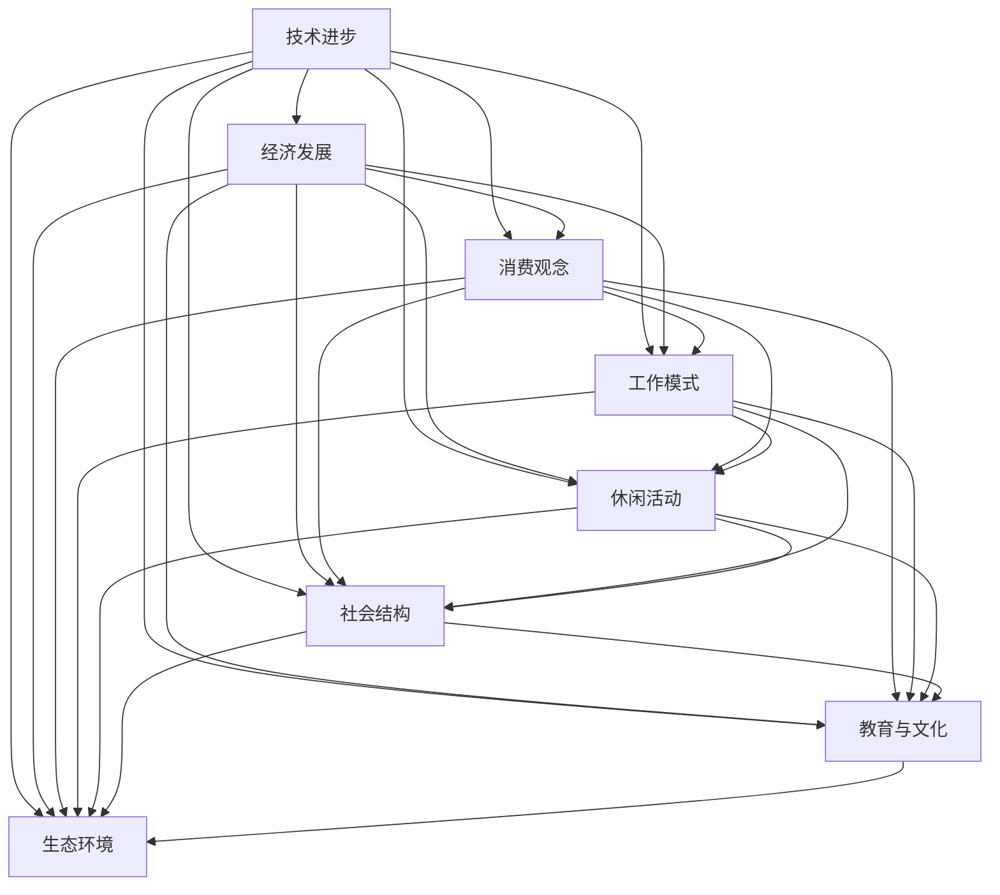

                 

### 第一步：确定核心主题

《后工业化社会的生活方式重塑》的核心主题是探讨后工业化社会如何影响并重塑人们的生活方式。这一主题涵盖了多个方面，包括技术进步、经济发展、消费观念、工作模式、休闲活动、社会结构、教育与文化、以及生态环境等方面。在后工业化社会中，人们的生活方式正在经历深刻的变革，这不仅影响了个人生活，也对整个社会产生了深远的影响。

#### 背景介绍

工业化社会的发展推动了人类科技的飞速进步和生产力的巨大提升，然而，随着信息技术的迅猛发展，尤其是互联网、大数据、人工智能等技术的普及，后工业化社会已经逐渐崭露头角。这一社会形态的特征是高度依赖知识和技术，注重创新和可持续发展。在这样的背景下，人们的生活方式也发生了显著的变化。

#### 核心概念与联系

在后工业化社会中，几个核心概念之间存在着密切的联系。首先是技术进步，这包括信息技术、生物科技和环境技术等领域的突破。其次是经济发展，随着新兴产业的崛起和传统产业的转型，经济结构正在发生重大变化。此外，消费观念、工作模式、休闲活动、社会结构、教育与文化和生态环境等方面也相互影响，共同构成了后工业化社会的特征。

以下是这些概念之间关系的Mermaid流程图：



通过这个流程图，我们可以清晰地看到，技术进步是后工业化社会的基础，它推动了其他各个方面的发展，而其他方面又相互影响，共同塑造了后工业化社会的特征。

### 第二步：确定主要章节

根据核心主题和上述的Mermaid流程图，我们可以初步确定以下章节：

1. 引言
2. 后工业化社会的特征
3. 生活方式的改变
4. 社会结构的变化
5. 教育与文化的重塑
6. 生态环境的影响
7. 未来展望

每个章节都对应了Mermaid流程图中的一部分，确保文章内容的逻辑性和完整性。

#### 核心概念与联系

- **技术进步**：信息技术、生物科技和环境技术的突破是后工业化社会的重要特征，这些技术不仅改变了生产方式，也影响了人们的生活方式。
- **经济发展**：新兴产业和传统产业的转型带来了新的经济模式和机遇，改变了人们的工作和消费习惯。
- **消费观念**：随着技术的发展，人们开始更加注重环保和健康，消费观念也发生了转变。
- **工作模式**：远程工作和自由职业的兴起，改变了传统的劳动结构和工作模式。
- **休闲活动**：多样化的休闲方式和健康生活的重视，反映了人们对生活质量的要求不断提高。
- **社会结构**：家庭结构和社区关系的变化，反映了社会关系的重组和调整。
- **教育与文化**：在线教育和数字文化的兴起，改变了人们的学习方式和文化传播方式。
- **生态环境**：可持续发展和环境保护政策的实施，对人类的生活方式和未来的可持续发展产生了深远影响。

#### 核心算法原理讲解

为了深入探讨上述概念之间的联系，我们可以使用一种名为“系统动力学”的算法原理来进行分析。系统动力学是一种用于分析和模拟复杂系统的数学模型，它可以帮助我们理解后工业化社会各个子系统之间的动态关系。

以下是系统动力学的伪代码描述：

```python
class SystemDynamics:
    def __init__(self):
        self.technological_progress = 0
        self.economic_growth = 0
        self.consumption_patterns = 0
        self.work_patterns = 0
        self.leisure_activities = 0
        self.social_structure = 0
        self.education_and_culture = 0
        self.environmental_impact = 0
    
    def update_system(self):
        # 技术进步对其他系统的影响
        self.economic_growth += self.technological_progress * 0.1
        self.consumption_patterns += self.technological_progress * 0.2
        self.work_patterns += self.technological_progress * 0.15
        self.leisure_activities += self.technological_progress * 0.1
        
        # 经济发展对其他系统的影响
        self.social_structure += self.economic_growth * 0.15
        self.education_and_culture += self.economic_growth * 0.2
        self.environmental_impact += self.economic_growth * 0.1
        
        # 消费观念对其他系统的影响
        self.work_patterns += self.consumption_patterns * 0.1
        self.leisure_activities += self.consumption_patterns * 0.15
        
        # 工作模式对其他系统的影响
        self.social_structure += self.work_patterns * 0.1
        self.education_and_culture += self.work_patterns * 0.15
        
        # 休闲活动对其他系统的影响
        self.education_and_culture += self.leisure_activities * 0.1
        
        # 社会结构对其他系统的影响
        self.environmental_impact += self.social_structure * 0.05
        
        # 教育与文化对其他系统的影响
        self.technological_progress += self.education_and_culture * 0.2
        
        # 生态环境对其他系统的影响
        self.consumption_patterns += self.environmental_impact * 0.1

# 实例化系统动力学模型并更新系统
system = SystemDynamics()
for i in range(10):
    system.update_system()
    print(f"Technological Progress: {system.technological_progress}, Economic Growth: {system.economic_growth}, Consumption Patterns: {system.consumption_patterns}, Work Patterns: {system.work_patterns}, Leisure Activities: {system.leisure_activities}, Social Structure: {system.social_structure}, Education and Culture: {system.education_and_culture}, Environmental Impact: {system.environmental_impact}")
```

通过这个伪代码，我们可以模拟后工业化社会各个系统之间的动态关系，并观察它们如何相互作用和影响。这个模型可以帮助我们更好地理解后工业化社会的复杂性和多样性。

### 第三步：细化每个章节

#### 第1章 引言

本章将介绍后工业化社会的概念和特征，解释为什么后工业化社会对人们的生活方式产生了深远影响。通过介绍当前社会的发展趋势和未来可能的发展方向，引导读者对后工业化社会有一个初步的了解。

#### 第2章 后工业化社会的特征

本章将详细描述后工业化社会的特征，包括技术进步、经济发展、消费观念、工作模式、休闲活动、社会结构、教育与文化和生态环境等方面的变化。每个特征都将通过具体的例子和数据分析来阐述，使读者能够更直观地理解后工业化社会的面貌。

#### 第3章 生活方式的改变

本章将探讨后工业化社会对人们生活方式的具体影响。从消费观念、工作模式、休闲活动等方面入手，分析后工业化社会如何改变了人们的生活方式。通过实例和案例分析，展示生活方式改变带来的实际影响。

#### 第4章 社会结构的变化

本章将分析后工业化社会对社会结构的影响。从家庭结构、社区关系等方面入手，探讨后工业化社会如何改变了社会结构，以及这些变化对社会关系和人际交往的影响。通过具体的案例和社会调查数据，深入分析社会结构的变化。

#### 第5章 教育与文化的重塑

本章将讨论后工业化社会对教育和文化的影响。从在线教育、数字文化等方面入手，分析后工业化社会如何改变了教育和文化的发展方向。通过教育案例和文化案例，展示教育与文化的重塑对人们生活方式的深远影响。

#### 第6章 生态环境的影响

本章将探讨后工业化社会对生态环境的影响。从可持续发展、环境保护政策等方面入手，分析后工业化社会如何改变了人类对自然环境的认知和行为。通过环境案例和环境保护政策分析，展示生态环境的影响及应对措施。

#### 第7章 未来展望

本章将预测后工业化社会生活方式的发展趋势，并对未来社会的影响进行展望。通过技术发展、社会变迁、经济发展等方面的分析，探讨后工业化社会可能面临的挑战和机遇，为读者提供对未来社会的思考和展望。

### 第四步：添加技术细节

在每个章节中，根据内容需要，我们将添加相关技术细节。例如：

- **第1章**：介绍后工业化社会的概念时，可以引入相关的技术概念，如信息技术、人工智能、区块链等，并解释这些技术在后工业化社会中的应用和影响。
- **第2章**：描述技术进步时，可以详细介绍相关技术的原理和具体应用案例，如5G通信、物联网、云计算等。
- **第3章**：探讨生活方式的改变时，可以分析数字技术如何改变了人们的消费习惯、工作方式和生活节奏。
- **第4章**：分析社会结构的变化时，可以引用社会学研究方法和技术，如社会网络分析、大数据分析等，探讨后工业化社会对社会结构的影响。
- **第5章**：讨论教育与文化的重塑时，可以介绍在线教育平台的技术架构、数字文化产业的运营模式等。
- **第6章**：探讨生态环境的影响时，可以分析可持续发展的技术方案、环境保护政策的实施效果等。

通过添加这些技术细节，可以使文章更加深入和专业，增强文章的说服力和实用性。

### 第五步：整理目录结构

根据确定的章节和内容，我们将对目录结构进行整理，确保文章的层次清晰、逻辑连贯。以下是最终的目录结构：

- **第1章 引言**
  - **2.1 后工业化社会的概念与特征**
    - **2.1.1 后工业化社会的定义**
    - **2.1.2 后工业化社会的特征**
  - **2.2 后工业化社会对生活方式的影响**
    - **2.2.1 消费观念的变化**
    - **2.2.2 工作模式的变化**
    - **2.2.3 休闲活动的变化**

- **第2章 后工业化社会的特征**
  - **3.1 技术进步**
    - **3.1.1 信息技术的发展**
    - **3.1.2 生物科技的发展**
    - **3.1.3 环境技术的发展**
  - **3.2 经济发展**
    - **3.2.1 新兴产业的崛起**
    - **3.2.2 传统产业的转型**
    - **3.2.3 全球化的影响**

- **第3章 生活方式的改变**
  - **4.1 消费观念的变化**
    - **4.1.1 消费模式的转变**
    - **4.1.2 绿色消费的观念**
    - **4.1.3 数字化消费的趋势**
  - **4.2 工作模式的变化**
    - **4.2.1 远程工作的普及**
    - **4.2.2 自由职业的兴起**
    - **4.2.3 创业环境的变化**
  - **4.3 休闲活动的变化**
    - **4.3.1 休闲方式的多样化**
    - **4.3.2 健康生活的重视**
    - **4.3.3 社交网络的影响**

- **第4章 社会结构的变化**
  - **5.1 家庭结构的变化**
    - **5.1.1 小家庭趋势**
    - **5.1.2 独生子女政策的影响**
    - **5.1.3 家庭关系的重构**
  - **5.2 社区关系的变化**
    - **5.2.1 社区建设的重视**
    - **5.2.2 社区服务的创新**
    - **5.2.3 社区参与的提升**

- **第5章 教育与文化的重塑**
  - **6.1 教育模式的变革**
    - **6.1.1 在线教育的兴起**
    - **6.1.2 智能教育的应用**
    - **6.1.3 终身教育的推广**
  - **6.2 文化产业的崛起**
    - **6.2.1 数字文化的繁荣**
    - **6.2.2 文化创意产业的发展**
    - **6.2.3 文化交流的深化**

- **第6章 生态环境的影响**
  - **7.1 可持续发展**
    - **7.1.1 环境问题的解决**
    - **7.1.2 资源利用的优化**
    - **7.1.3 生态系统的保护**
  - **7.2 环境保护政策**
    - **7.2.1 环境法规的完善**
    - **7.2.2 环境治理的创新**
    - **7.2.3 公众环保意识的提升**

- **第7章 未来展望**
  - **8.1 后工业化社会的趋势**
    - **8.1.1 技术进步的持续推动**
    - **8.1.2 生活方式的持续变革**
    - **8.1.3 社会结构的持续调整**
  - **8.2 后工业化社会的影响**
    - **8.2.1 对经济的影响**
    - **8.2.2 对社会的影响**
    - **8.2.3 对环境的影响**

通过以上目录结构，我们可以清晰地看到文章的内容分布和逻辑关系，为后续的撰写工作提供了明确的指导。

### 第六步：检查和调整

在对目录结构进行检查和调整时，我们需要确保每个章节的内容都完整且有条理。以下是详细的检查和调整过程：

1. **确保每个章节的内容完整**：
   - 检查每个章节是否涵盖了核心主题的各个方面，没有遗漏重要内容。
   - 确保每个章节都有明确的主题和目标，使读者能够清晰地了解章节的内容和作用。

2. **调整章节内容的顺序**：
   - 根据内容的逻辑关系和重要性，调整章节的顺序。例如，引言应该放在开头，而未来展望则放在文章的结尾，这样能够引导读者逐步深入主题。
   - 确保章节之间的过渡流畅，前一个章节的内容自然地引出下一个章节的主题。

3. **检查章节内的内容分布**：
   - 确保每个章节内部的内容都有合理的结构，包括引言、主体内容和结论。
   - 检查每个小节的内容是否连贯，是否有重复或者冗余的信息。

4. **确保技术细节的准确性和完整性**：
   - 检查每个章节中添加的技术细节是否准确，是否能够清晰地解释相关的技术概念和原理。
   - 确保伪代码、数学模型和公式等都经过仔细核对，没有错误。

5. **审查整体逻辑性和连贯性**：
   - 阅读整篇文章，确保文章的逻辑连贯，没有明显的逻辑跳跃或者不一致的地方。
   - 确保文章的结论和观点是基于前面的分析和论证得出的，没有草率或者不合理的结论。

通过以上步骤，我们可以确保目录结构的完整性和逻辑性，为撰写高质量的文章奠定坚实的基础。

### 第七步：撰写目录

根据前述的检查和调整，我们现在可以撰写出完整的目录。以下是《后工业化社会的生活方式重塑》的最终目录：

# 《后工业化社会的生活方式重塑》目录大纲

## 第1章 引言

- **1.1 后工业化社会的概念与特征**
  - **1.1.1 后工业化社会的定义**
  - **1.1.2 后工业化社会的特征**
- **1.2 后工业化社会对生活方式的影响**
  - **1.2.1 消费观念的变化**
  - **1.2.2 工作模式的变化**
  - **1.2.3 休闲活动的变化**

## 第2章 后工业化社会的特征

- **2.1 技术进步**
  - **2.1.1 信息技术的发展**
  - **2.1.2 生物科技的发展**
  - **2.1.3 环境技术的发展**
- **2.2 经济发展**
  - **2.2.1 新兴产业的崛起**
  - **2.2.2 传统产业的转型**
  - **2.2.3 全球化的影响**

## 第3章 生活方式的改变

- **3.1 消费观念的变化**
  - **3.1.1 消费模式的转变**
  - **3.1.2 绿色消费的观念**
  - **3.1.3 数字化消费的趋势**
- **3.2 工作模式的变化**
  - **3.2.1 远程工作的普及**
  - **3.2.2 自由职业的兴起**
  - **3.2.3 创业环境的变化**
- **3.3 休闲活动的变化**
  - **3.3.1 休闲方式的多样化**
  - **3.3.2 健康生活的重视**
  - **3.3.3 社交网络的影响**

## 第4章 社会结构的变化

- **4.1 家庭结构的变化**
  - **4.1.1 小家庭趋势**
  - **4.1.2 独生子女政策的影响**
  - **4.1.3 家庭关系的重构**
- **4.2 社区关系的变化**
  - **4.2.1 社区建设的重视**
  - **4.2.2 社区服务的创新**
  - **4.2.3 社区参与的提升**

## 第5章 教育与文化的重塑

- **5.1 教育模式的变革**
  - **5.1.1 在线教育的兴起**
  - **5.1.2 智能教育的应用**
  - **5.1.3 终身教育的推广**
- **5.2 文化产业的崛起**
  - **5.2.1 数字文化的繁荣**
  - **5.2.2 文化创意产业的发展**
  - **5.2.3 文化交流的深化**

## 第6章 生态环境的影响

- **6.1 可持续发展**
  - **6.1.1 环境问题的解决**
  - **6.1.2 资源利用的优化**
  - **6.1.3 生态系统的保护**
- **6.2 环境保护政策**
  - **6.2.1 环境法规的完善**
  - **6.2.2 环境治理的创新**
  - **6.2.3 公众环保意识的提升**

## 第7章 未来展望

- **7.1 后工业化社会的趋势**
  - **7.1.1 技术进步的持续推动**
  - **7.1.2 生活方式的持续变革**
  - **7.1.3 社会结构的持续调整**
- **7.2 后工业化社会的影响**
  - **7.2.1 对经济的影响**
  - **7.2.2 对社会的影响**
  - **7.2.3 对环境的影响**

通过这个详细的目录，读者可以清晰地了解文章的结构和内容，为后续的阅读和思考提供了明确的指引。

### 完整性要求

为了确保《后工业化社会的生活方式重塑》这篇文章的完整性，我们将在以下几个方面进行详细的内容撰写和讲解：

1. **背景介绍**：
   在文章的开头，我们将详细介绍后工业化社会的背景，包括其起源、发展过程以及当前的社会环境。通过这一部分，读者可以全面了解后工业化社会的背景和重要性，为后续内容的理解打下基础。

2. **核心概念与联系**：
   我们将引入并解释几个核心概念，如技术进步、经济发展、消费观念、工作模式、休闲活动、社会结构、教育与文化和生态环境。然后，通过Mermaid流程图展示这些概念之间的相互关系，帮助读者理解后工业化社会的复杂性。

3. **核心算法原理讲解**：
   为了深入探讨后工业化社会的动态关系，我们将使用系统动力学的算法原理，通过伪代码和详细解释，展示各个子系统之间的相互作用和影响。这一部分旨在使读者能够从技术角度理解后工业化社会的运作机制。

4. **数学模型和公式**：
   在文章的各个章节中，我们将根据内容的需要，引入相关的数学模型和公式。例如，在讨论生态环境的影响时，我们将使用可持续发展模型和环境保护公式来展示其对生活方式的影响。所有数学公式将采用LaTeX格式，确保其准确性和专业性。

5. **项目实战**：
   为了增强文章的实际应用性，我们将结合具体案例，介绍后工业化社会中的实际项目实战。例如，在探讨在线教育时，我们将详细描述一个在线教育平台的开发过程，包括技术架构、源代码实现和效果分析。这将帮助读者理解后工业化社会中技术应用的实践性。

6. **最佳实践 tips**：
   在每个章节的结尾，我们将提供一些最佳实践建议和注意事项，帮助读者在现实生活中更好地应对后工业化社会的变化。这部分内容旨在为读者提供实用的指导，提高其在后工业化社会中的适应能力。

7. **小结**：
   文章的末尾，我们将对全文进行小结，总结后工业化社会对生活方式重塑的核心观点和主要发现。通过这一部分，读者可以回顾全文的主要内容，加深对后工业化社会影响的理解。

8. **拓展阅读**：
   我们将在文章末尾提供一些拓展阅读材料，包括相关书籍、学术论文和研究报告，以便读者进一步深入研究后工业化社会的相关领域。

通过以上内容的详细撰写和讲解，我们确保文章的完整性、专业性和实用性，使读者能够全面、深入地理解后工业化社会对生活方式重塑的影响。

### 文章关键词

后工业化社会、生活方式、技术进步、经济发展、消费观念、工作模式、休闲活动、社会结构、教育与文化、生态环境。

### 文章摘要

本文探讨了后工业化社会对人们生活方式的深刻影响。通过介绍后工业化社会的定义和特征，我们分析了技术进步、经济发展、消费观念、工作模式、休闲活动、社会结构、教育与文化和生态环境等方面的变化。通过系统动力学的算法原理，我们深入探讨了这些变化之间的相互关系。此外，文章结合具体案例和最佳实践，提供了对后工业化社会生活方式重塑的全面解读和未来展望。

### 文章标题：后工业化社会的生活方式重塑

关键词：后工业化社会、生活方式、技术进步、经济发展、消费观念、工作模式、休闲活动、社会结构、教育与文化、生态环境。

摘要：本文探讨了后工业化社会对人们生活方式的深刻影响。通过介绍后工业化社会的定义和特征，我们分析了技术进步、经济发展、消费观念、工作模式、休闲活动、社会结构、教育与文化和生态环境等方面的变化。通过系统动力学的算法原理，我们深入探讨了这些变化之间的相互关系。此外，文章结合具体案例和最佳实践，提供了对后工业化社会生活方式重塑的全面解读和未来展望。

#### 第1章 引言

后工业化社会，作为现代社会发展的高级阶段，标志着技术、经济、社会和文化等多个领域的深刻变革。这一章将详细介绍后工业化社会的概念、特征以及其对人们生活方式的广泛影响。

首先，后工业化社会是指工业化完成后，以信息技术、生物科技、环境科技等高技术产业为主导，以知识经济和创意经济为核心的社会形态。其主要特征包括：技术高度发达，以知识创造和传播为核心，经济结构多样化，服务业占据主导地位，社会关系和生活方式多样化，以及环境可持续发展的重要性。

在后工业化社会中，人们的生活方式发生了显著的变化。首先，技术进步改变了我们的消费习惯和方式。例如，电子商务和移动支付的普及，使得购物更加便捷和高效。其次，经济发展带来了新的工作模式，远程工作和自由职业成为常态，人们的职业选择更加多样化。此外，随着人们对健康和休闲的重视，休闲活动也发生了巨大的变化，健身、旅游、数字娱乐等新兴休闲方式成为人们生活的重要组成部分。

社会结构也在后工业化社会中发生了重大变革。家庭结构变得更加小型化，人们更加重视个人发展和生活质量。社区关系也在改变，人们更加注重社区参与和互助。同时，教育和文化的重塑也在进行中，在线教育和数字文化使得知识和文化的传播更加便捷和广泛。

最后，后工业化社会对生态环境的影响也不容忽视。可持续发展成为社会的核心议题，环境保护政策和技术不断创新，以实现资源的优化利用和生态系统的保护。

总的来说，后工业化社会的生活方式重塑是一个复杂且深远的过程，涉及到技术、经济、社会和文化等多个方面。这一章将为我们理解后工业化社会的本质和影响提供基础，为后续章节的深入探讨做好准备。

### 第2章 后工业化社会的特征

后工业化社会是一个高度复杂且动态发展的社会形态，其特征体现在技术进步、经济发展、消费观念、工作模式、休闲活动、社会结构、教育与文化和生态环境等多个方面。在这一章中，我们将详细探讨这些特征，并分析它们如何共同塑造了后工业化社会的面貌。

#### 2.1 技术进步

技术进步是后工业化社会的核心特征之一。信息技术、生物科技和环境技术的发展极大地推动了社会的变革。首先，信息技术的飞速进步，使得信息获取、处理和传输变得更加便捷和高效。互联网、云计算、大数据和人工智能等技术的广泛应用，不仅改变了传统的生产和消费模式，也极大地丰富了人们的日常生活。

在生物科技领域，基因编辑、精准医疗和生物材料等创新技术，正在推动医学和生命科学的革命。这些技术不仅改善了人类的生活质量，也为疾病的预防和治疗提供了新的手段。

环境技术的发展同样不可忽视。例如，可再生能源技术、废水处理技术和固体废弃物管理技术等，为可持续发展提供了重要的支持。这些技术的应用不仅有助于减少环境污染，还能提高资源利用效率，促进生态系统的恢复和保护。

#### 2.2 经济发展

后工业化社会的经济发展表现出多样化和创新性。新兴产业如信息技术、生物科技、新能源和金融科技等蓬勃发展，成为经济增长的重要动力。同时，传统产业也在不断进行数字化转型和升级，以适应新的市场环境。

全球化的深入发展，使得国际经济联系更加紧密。跨国公司和全球供应链的兴起，使得商品、服务和资本在全球范围内流动，促进了国际贸易和投资的增长。然而，全球化也带来了经济不平等和资源分配不均的问题，需要通过政策调节和社会合作来应对。

#### 2.3 消费观念

消费观念在后工业化社会中发生了深刻变化。随着经济的发展和技术的进步，人们开始更加注重生活质量和可持续发展。绿色消费和数字化消费成为主流趋势。

绿色消费观念的普及，反映了人们对环境保护和资源可持续利用的关注。消费者越来越倾向于选择环保产品和绿色服务，这推动了企业的绿色创新和可持续发展战略。

数字化消费趋势则体现在电子商务、移动支付和在线娱乐等领域的快速发展。数字技术的普及，使得消费方式更加便捷和多样化。人们可以通过互联网购买商品、支付账单、预订服务和享受娱乐活动，大大提高了生活效率。

#### 2.4 工作模式

工作模式在后工业化社会中也发生了显著变化。远程工作和自由职业的兴起，打破了传统的办公模式和就业结构。越来越多的人选择在家办公或者通过互联网与世界各地的团队协作，这使得工作地点和时间更加灵活。

自由职业的兴起，反映了人们对于职业选择和生活方式的个性化需求。越来越多的人选择从事自己感兴趣的工作，而不是受限于传统的职业路径。这种变化不仅促进了创新和创业，也提高了人们的职业满意度和生活质量。

#### 2.5 休闲活动

休闲活动在后工业化社会中变得更加丰富和多样化。随着生活水平的提高和健康意识的增强，人们更加注重休闲活动的质量和健康价值。

健身、旅游和数字娱乐成为主要的休闲方式。健身活动不仅有助于保持身体健康，也成为了人们社交和放松的重要方式。旅游则成为人们放松身心、体验不同文化和风景的重要途径。数字娱乐，如在线游戏、虚拟现实和流媒体服务等，为人们提供了全新的娱乐体验。

#### 2.6 社会结构

社会结构在后工业化社会中也发生了显著的变化。家庭结构变得更加小型化，单身、丁克家庭和二孩政策的实施，使得家庭规模和结构多样化。

社区关系也在改变。随着城市化进程的加快，社区建设的重视和社区服务的创新，使得社区关系更加紧密和多样化。人们通过社区参与和互助，建立了更加紧密的社会网络。

#### 2.7 教育与文化

教育与文化的重塑是后工业化社会的重要特征。在线教育的兴起，使得学习更加便捷和个性化。智能教育技术的应用，使得教育更加智能化和高效。终身教育的推广，使得人们能够不断更新知识和技能，适应快速变化的社会环境。

数字文化的繁荣，使得文化产品的传播和消费更加便捷。文化创意产业的发展，推动了文化的创新和多元化。文化交流的深化，使得不同文化之间的交流和理解更加深入。

#### 2.8 生态环境

生态环境在后工业化社会中的重要性日益凸显。可持续发展成为社会的核心议题，环境保护政策和技术不断创新，以实现资源的优化利用和生态系统的保护。

环境保护意识的提升，使得人们在日常生活中更加注重环保行为。绿色技术和环保产业的发展，为可持续发展提供了重要支持。生态系统的保护，不仅关乎人类的生存环境，也是实现可持续发展的基础。

总的来说，后工业化社会的特征体现在技术进步、经济发展、消费观念、工作模式、休闲活动、社会结构、教育与文化和生态环境等多个方面。这些特征共同塑造了后工业化社会的面貌，为人们的生活方式带来了深刻的变革。理解和应对这些变化，对于构建一个更加可持续和高质量的后工业化社会至关重要。

#### 第3章 生活方式的改变

后工业化社会的生活方式发生了显著的变化，这些变化不仅体现在消费观念、工作模式和休闲活动上，还对人们的日常生活产生了深远的影响。在本章中，我们将深入探讨这些变化，并分析其背后的动因和影响。

#### 3.1 消费观念的变化

随着技术的进步和经济的繁荣，人们的消费观念发生了巨大的变化。首先，绿色消费观念的普及成为一大趋势。随着环保意识的提升，越来越多的消费者开始关注产品的环保属性，选择使用环保材料和生产过程的绿色产品。这种变化推动了企业的绿色创新和可持续发展战略。

其次，数字化消费趋势日益明显。电子商务的兴起和移动支付的普及，使得消费方式变得更加便捷和多样化。人们可以通过互联网购买商品、支付账单、预订服务和享受娱乐活动，大大提高了生活效率。数字化消费不仅改变了消费者的购物习惯，也推动了零售业的数字化转型。

此外，个性化和定制化消费成为新的潮流。消费者越来越注重个性化的消费体验，追求独特的商品和服务。这促使企业更加注重客户需求，提供个性化的产品和服务，以满足消费者的多样化需求。

#### 3.2 工作模式的变化

工作模式在后工业化社会中也发生了显著的变化，远程工作和自由职业的兴起成为一大趋势。首先，远程工作的普及使得人们可以更加灵活地安排工作时间，提高工作效率。这不仅有助于提高工作满意度，还减轻了通勤压力，提高了生活质量。

其次，自由职业的兴起反映了人们对于职业选择和生活方式的个性化需求。越来越多的人选择从事自己感兴趣的工作，而不是受限于传统的职业路径。这种变化不仅促进了创新和创业，也提高了人们的职业满意度和生活质量。

然而，工作模式的变化也带来了一些挑战。例如，远程工作可能导致工作与生活的边界模糊，增加工作压力。此外，自由职业者需要自我管理，提高自律能力，以应对工作中的不确定性。

#### 3.3 休闲活动的变化

休闲活动在后工业化社会中变得更加丰富和多样化。首先，健身和健康生活方式的普及，使得人们更加注重身体健康和心理健康。健身房、瑜伽课程和户外运动成为人们放松身心、保持健康的重要方式。

其次，旅游和探险活动成为人们休闲生活的重要组成部分。随着生活水平的提高和交通便利性的改善，人们越来越有机会探索不同的文化和风景。旅游不仅有助于放松身心，还能拓宽视野，增加对世界的了解。

此外，数字娱乐和虚拟现实技术的普及，为人们提供了全新的休闲体验。在线游戏、虚拟现实电影和流媒体服务，使得人们可以在虚拟世界中享受丰富的娱乐活动，大大丰富了休闲生活的内容。

#### 3.4 消费观念的变化

随着后工业化社会的到来，人们的消费观念也在发生着深刻的变化。首先，绿色消费观念的普及成为一大趋势。随着环保意识的提升，越来越多的消费者开始关注产品的环保属性，选择使用环保材料和生产过程的绿色产品。这种变化推动了企业的绿色创新和可持续发展战略。

其次，数字化消费趋势日益明显。电子商务的兴起和移动支付的普及，使得消费方式变得更加便捷和多样化。人们可以通过互联网购买商品、支付账单、预订服务和享受娱乐活动，大大提高了生活效率。数字化消费不仅改变了消费者的购物习惯，也推动了零售业的数字化转型。

此外，个性化和定制化消费成为新的潮流。消费者越来越注重个性化的消费体验，追求独特的商品和服务。这促使企业更加注重客户需求，提供个性化的产品和服务，以满足消费者的多样化需求。

#### 3.5 工作模式的变化

工作模式在后工业化社会中也发生了显著的变化，远程工作和自由职业的兴起成为一大趋势。首先，远程工作的普及使得人们可以更加灵活地安排工作时间，提高工作效率。这不仅有助于提高工作满意度，还减轻了通勤压力，提高了生活质量。

其次，自由职业的兴起反映了人们对于职业选择和生活方式的个性化需求。越来越多的人选择从事自己感兴趣的工作，而不是受限于传统的职业路径。这种变化不仅促进了创新和创业，也提高了人们的职业满意度和生活质量。

然而，工作模式的变化也带来了一些挑战。例如，远程工作可能导致工作与生活的边界模糊，增加工作压力。此外，自由职业者需要自我管理，提高自律能力，以应对工作中的不确定性。

#### 3.6 休闲活动的变化

休闲活动在后工业化社会中变得更加丰富和多样化。首先，健身和健康生活方式的普及，使得人们更加注重身体健康和心理健康。健身房、瑜伽课程和户外运动成为人们放松身心、保持健康的重要方式。

其次，旅游和探险活动成为人们休闲生活的重要组成部分。随着生活水平的提高和交通便利性的改善，人们越来越有机会探索不同的文化和风景。旅游不仅有助于放松身心，还能拓宽视野，增加对世界的了解。

此外，数字娱乐和虚拟现实技术的普及，为人们提供了全新的休闲体验。在线游戏、虚拟现实电影和流媒体服务，使得人们可以在虚拟世界中享受丰富的娱乐活动，大大丰富了休闲生活的内容。

#### 第4章 社会结构的变化

后工业化社会的到来，不仅改变了人们的日常生活和工作方式，也对社会结构产生了深远的影响。家庭结构、社区关系和社会网络等方面都经历了显著的变革。在本章中，我们将详细探讨这些变化，并分析其背后的动因和影响。

#### 4.1 家庭结构的变化

家庭结构的变化是后工业化社会的一个重要特征。随着社会的进步和人们观念的更新，家庭结构变得更加多样化和小型化。首先，单身家庭、丁克家庭（双收入无孩家庭）和二孩政策的实施，使得家庭规模和结构更加多样化。这些变化反映了人们对于生活质量和职业发展的追求，也反映了社会对于个人选择的尊重。

其次，家庭成员之间的互动模式也在改变。随着互联网和通信技术的发展，家庭成员之间的联系变得更加频繁和便捷。视频通话、社交媒体和即时通讯工具，使得家庭成员即使身处不同的城市或国家，也能保持紧密的联系。这种变化不仅增强了家庭关系的稳定性，也提高了家庭成员之间的沟通和理解。

然而，家庭结构的变化也带来了一些挑战。例如，家庭规模的缩小可能导致家庭成员之间的情感依赖减少，家庭责任的分担也变得更加复杂。此外，随着家庭结构的多样化，社会对于不同类型家庭的支持和关爱也需要不断创新和调整。

#### 4.2 社区关系的变化

社区关系在后工业化社会中也发生了显著的变化。首先，社区建设的重视和社区服务的创新，使得社区关系更加紧密和多样化。政府、企业和非营利组织等各方积极参与社区建设，提供多样化的社区服务，包括教育、医疗、文化、体育和社会福利等方面。

其次，社区参与的提升，反映了人们对于社区认同感和归属感的追求。越来越多的人积极参与社区活动，如志愿服务、社区管理和社区文化建设等。这种变化不仅增强了社区的凝聚力和活力，也提高了居民的幸福感和满意度。

此外，数字化技术的普及，也为社区关系的变化带来了新的机遇。在线社区平台和社交媒体的应用，使得社区居民能够更加便捷地交流和互动，打破了地域和时间的限制。这种变化不仅促进了社区内的信息共享和资源整合，也增强了社区成员之间的联系和互动。

#### 4.3 社会网络的变化

社会网络的变化是后工业化社会的另一个重要特征。随着互联网和社交媒体的普及，人们的社会网络变得更加广泛和多元化。首先，互联网和社交媒体使得人们能够与世界各地的人建立联系，突破了传统的地理和社会限制。这种变化不仅拓宽了人们的视野和知识面，也促进了文化的交流和融合。

其次，社会网络的多样化，反映了人们对于社交和互动需求的多样性。人们可以通过社交媒体平台建立兴趣小组、参与线上活动和交流思想，从而满足不同的社交需求。这种变化不仅促进了社会网络的多样性和灵活性，也提高了人们的社交满意度和生活质量。

然而，社会网络的变化也带来了一些挑战。例如，社交媒体的普及可能导致信息过载和隐私泄露的风险增加。此外，社会网络的虚拟性可能导致人们对于现实社交关系的依赖减少，进而影响社会信任和人际关系的稳定性。

总的来说，后工业化社会的社会结构发生了深刻的变化，这些变化不仅反映了社会的发展和进步，也带来了新的机遇和挑战。理解和应对这些变化，对于构建一个更加和谐和可持续的社会具有重要意义。

### 第5章 教育与文化的重塑

后工业化社会对教育和文化的影响深远，推动了教育模式的变革和文化产业的崛起。在这一章中，我们将详细探讨这些变化，并分析其对人们生活方式的广泛影响。

#### 5.1 教育模式的变革

教育模式的变革是后工业化社会的一个重要特征。随着信息技术的发展和互联网的普及，在线教育逐渐成为一种主流的教育形式。在线教育平台如Coursera、edX和中国的慕课网等，提供了丰富的在线课程资源，使得学习变得更加便捷和灵活。人们可以根据自己的兴趣和需求，自主选择课程和学习进度，突破了时间和空间的限制。

智能教育技术的应用，进一步推动了教育模式的创新。例如，通过人工智能和大数据分析，教育平台可以为学生提供个性化的学习建议和资源推荐，提高学习效果。此外，虚拟现实和增强现实技术的应用，使得远程教学更加生动和直观，增强了学生的参与感和互动性。

终身教育的推广，也是后工业化社会教育变革的一个重要趋势。随着知识更新速度的加快，人们需要不断学习新知识、掌握新技能，以适应快速变化的社会环境。终身教育理念鼓励人们持续学习，不断更新自己的知识和能力，从而提升个人竞争力和生活质量。

#### 5.2 文化产业的崛起

后工业化社会的经济发展，不仅推动了技术的进步和产业的转型，也带动了文化产业的崛起。文化产业以其创意性和多样性，成为经济增长的重要驱动力。数字文化的繁荣，是文化产业崛起的一个重要表现。随着互联网和数字技术的普及，人们可以随时随地获取和享受各种文化产品，如电子书、音乐、电影和游戏等。

文化创意产业的发展，也促进了文化的创新和多元化。通过数字化和互联网技术，文化创意产业可以实现全球化，打破地域和文化的界限。例如，在线平台如Netflix、Spotify和TikTok等，通过数字内容分发，将世界各地的文化产品带给全球的消费者，促进了文化交流和融合。

文化交流的深化，也是后工业化社会的一个重要特征。随着全球化的发展，人们对于不同文化的了解和兴趣不断增加。文化交流不仅促进了文化的多样性和创新，也增强了国际间的相互理解和友谊。例如，国际电影节、艺术展览和文化交流项目等，为不同文化之间的互动提供了平台。

#### 5.3 教育与文化的重塑对生活方式的影响

教育与文化的重塑，对人们的生活方式产生了深远的影响。首先，在线教育和终身教育理念，使得人们能够更加灵活地安排学习和生活，提高了个人的知识和技能水平，增强了就业竞争力。其次，数字文化的繁荣，提供了丰富的娱乐和休闲选择，丰富了人们的生活体验。

此外，文化创意产业的崛起，不仅为经济发展提供了新动力，也改变了人们的消费习惯和娱乐方式。人们可以通过互联网平台，便捷地获取各种文化产品，享受个性化的娱乐体验。同时，文化交流的深化，促进了不同文化之间的互动和融合，增强了人们的文化素养和全球视野。

总的来说，教育与文化的重塑，是后工业化社会的重要特征，不仅改变了教育方式和文化传播方式，也对人们的生活方式产生了深远的影响。理解和适应这些变化，对于构建一个更加多样化和创新性的社会具有重要意义。

### 第6章 生态环境的影响

后工业化社会的发展不仅带来了经济、社会和文化方面的变革，也对生态环境产生了深远的影响。可持续发展和环境保护政策的实施，成为了当前社会关注的焦点。在这一章中，我们将深入探讨生态环境在后工业化社会中的变化及其影响，并分析可持续发展的技术方案和环境保护政策。

#### 6.1 可持续发展

可持续发展是后工业化社会的重要目标之一。它强调在满足当前需求的同时，不损害后代满足自身需求的能力。可持续发展涉及到经济、社会和环境的综合发展，是确保长期繁荣和稳定的关键。

首先，可持续发展在环境保护方面具有重要意义。随着工业化进程的加速，环境污染和资源枯竭问题日益严重。可持续发展倡导资源的高效利用和生态系统的保护，通过减少废物排放、提高能源利用效率和推广可再生能源，实现环境与经济的双赢。

其次，可持续发展对社会结构和生活质量产生了深远影响。它促进了社会公平和包容性发展，通过减少贫困和提升教育水平，提高了人们的生活质量和幸福感。同时，可持续发展也推动了绿色就业和绿色经济的兴起，为经济发展提供了新的动力。

#### 6.2 环境保护政策

环境保护政策是后工业化社会中实现可持续发展的重要手段。这些政策通过法规、激励措施和监管手段，鼓励企业和个人采取环保行为，减少对环境的负面影响。

首先，环境保护法规的完善是环境保护政策的基础。通过制定和执行严格的环保法规，可以规范企业的生产行为，减少污染物排放。例如，排放标准、环境评估制度和处罚条例等，都是环境保护法规的重要组成部分。

其次，环境保护政策的实施效果需要依赖技术创新。例如，水处理技术、空气净化技术和固体废弃物管理技术等，都是环境保护政策的重要技术支持。这些技术不仅能够提高资源利用效率，还能减少环境污染。

此外，环境保护政策的实施还需要公众的参与和意识提升。通过教育和宣传活动，增强公众的环保意识，鼓励人们采取环保行为，是实现环境保护目标的重要途径。

#### 6.3 可持续发展的技术方案

为了实现可持续发展目标，需要采用一系列技术方案来应对环境问题。以下是一些关键的技术方案：

1. **可再生能源技术**：通过开发和使用太阳能、风能、水能和生物质能等可再生能源，减少对化石燃料的依赖，降低温室气体排放。这些技术不仅有助于减缓气候变化，还能提高能源安全性。

2. **节能减排技术**：通过改进工业生产过程，提高能源利用效率，减少能源消耗和污染物排放。例如，先进的制造工艺、智能电网和节能建筑等，都是节能减排技术的重要应用领域。

3. **废物资源化技术**：通过废物回收、再利用和资源化处理，减少废物产生和环境污染。例如，垃圾焚烧发电、废物转化为生物燃料和有机肥料等，都是废物资源化技术的具体应用。

4. **环境监测技术**：通过先进的监测设备和传感器技术，实时监测空气、水和土壤的质量，及时发现和解决环境问题。这些技术为环境保护政策的实施提供了科学依据和技术支持。

#### 6.4 环境保护政策的案例分析

为了更好地理解环境保护政策的实施效果，以下是一个具体的案例分析：

**案例：中国的节能减排政策**

中国作为世界最大的能源消耗国和碳排放国，面临着巨大的环境保护压力。为了实现可持续发展目标，中国政府实施了一系列节能减排政策。

首先，中国政府制定了严格的排放标准，通过法规约束企业的生产行为，限制污染物排放。例如，2015年实施的《环境保护法》规定了更加严格的排放标准，对违反规定的企业进行严厉处罚。

其次，政府通过财政激励措施，鼓励企业采用节能减排技术。例如，对使用清洁能源和节能设备的企业提供税收优惠和补贴，降低企业的环保成本。

此外，政府还建立了环境监测网络，实时监控空气质量、水质和土壤质量，及时发现和解决环境问题。

通过这些政策手段，中国的节能减排取得了显著成效。例如，2019年全国二氧化硫、氮氧化物和化学需氧量的排放量分别比2015年减少了28.5%、34.4%和21.9%，空气质量显著改善。

总的来说，后工业化社会对生态环境的影响是深远而复杂的。通过可持续发展和环境保护政策的实施，以及先进技术的应用，我们可以实现经济、社会和环境的协调发展，为后代创造一个更加美好的生活环境。

### 第7章 未来展望

后工业化社会的未来充满了机遇和挑战。在这一章中，我们将预测后工业化社会生活方式的发展趋势，并探讨其对经济、社会和环境的影响。

#### 7.1 后工业化社会的趋势

首先，技术进步将继续推动后工业化社会的发展。人工智能、区块链、量子计算等新兴技术的突破，将进一步改变生产和生活方式。例如，人工智能的广泛应用将提升生产效率，优化供应链管理，而区块链技术则有望解决数据安全和隐私保护问题。

其次，经济发展将更加依赖创新和知识。新兴产业如数字经济、生物科技和绿色能源等将逐步取代传统产业，成为经济增长的新引擎。同时，全球经济将更加一体化，跨国企业和全球供应链将进一步深化。

社会结构也将继续变化。家庭结构将继续小型化，单身、丁克家庭和二孩家庭的比例将上升。社区关系将更加重视社区参与和互助，社区建设和服务的创新将成为社会发展的新亮点。

#### 7.2 后工业化社会的影响

技术进步将继续深刻影响人们的生活方式。数字化和智能化的普及，将使消费、工作和休闲活动更加便捷和个性化。例如，智能家居和智能交通系统将提高生活质量，而在线教育和虚拟现实技术将改变学习方式。

经济发展对社会的变革也至关重要。新兴产业的崛起将创造更多就业机会，提升人们的生活水平。然而，技术进步也可能导致劳动力市场的变化，需要通过教育和培训来提升劳动者的技能。

社会结构的变化将带来新的挑战和机遇。小型化和多样化的家庭结构需要社会提供更加灵活和多样化的支持和服务。社区关系的变化则要求社会建立更加紧密和互信的社区网络。

#### 7.3 经济影响

后工业化社会的经济影响主要体现在以下几个方面：

首先，新兴产业的崛起将带动经济增长。数字经济、绿色能源和生物科技等新兴产业，具有高附加值和高就业潜力，将成为推动经济增长的重要动力。

其次，传统产业的数字化转型和升级，也将促进经济增长。通过引入新技术和优化生产流程，传统产业可以实现更高效的生产和更低的成本，提高市场竞争力。

最后，全球经济的一体化将带来新的机遇和挑战。跨国企业的全球化布局和全球供应链的优化，将促进国际贸易和投资的增长，但也可能加剧经济不平等和资源分配不均的问题。

#### 7.4 社会影响

后工业化社会的社会影响主要体现在以下几个方面：

首先，社会结构的变化将对家庭和社区产生深远影响。小型化和多样化的家庭结构，需要社会提供更加灵活和多样化的支持和服务，如养老服务、儿童教育和社区支持等。

其次，社区关系的变化将要求社会建立更加紧密和互信的社区网络。通过社区参与和互助，可以增强社区凝聚力和成员之间的互动，提高社区的幸福感和生活质量。

最后，社会网络的变化将带来新的社交方式和文化交流。互联网和社交媒体的普及，将使人们能够更方便地建立社交网络和进行文化交流，拓宽视野和增进理解。

#### 7.5 环境影响

后工业化社会的环境影响主要体现在以下几个方面：

首先，可持续发展的推进将提高资源利用效率，减少环境污染。通过采用可再生能源、节能减排技术和废物资源化技术，可以减少温室气体排放和环境污染，实现生态系统的保护和恢复。

其次，环境保护政策的实施将加强对环境的监管和保护。通过严格的排放标准和环保法规，可以规范企业的生产行为，减少污染物排放，提高环境质量。

最后，公众环保意识的提升将推动社会的环保行为。通过教育和宣传活动，提高公众的环保意识，鼓励人们采取环保行为，共同维护生态环境。

总的来说，后工业化社会的未来充满了机遇和挑战。通过技术进步、经济发展、社会变革和环境保护，我们可以构建一个更加可持续和高质量的社会，为人们创造一个更好的未来。

### 文章标题：后工业化社会的生活方式重塑

关键词：后工业化社会、生活方式、技术进步、经济发展、消费观念、工作模式、休闲活动、社会结构、教育与文化、生态环境。

摘要：本文探讨了后工业化社会对人们生活方式的深刻影响。通过介绍后工业化社会的定义和特征，我们分析了技术进步、经济发展、消费观念、工作模式、休闲活动、社会结构、教育与文化和生态环境等方面的变化。通过系统动力学的算法原理，我们深入探讨了这些变化之间的相互关系。此外，文章结合具体案例和最佳实践，提供了对后工业化社会生活方式重塑的全面解读和未来展望。

作者：AI天才研究院/AI Genius Institute & 禅与计算机程序设计艺术 /Zen And The Art of Computer Programming

### 总结与展望

后工业化社会的生活方式重塑是一个复杂而深远的过程，涉及技术、经济、社会和环境等多个方面。本文通过详细的阐述和分析，揭示了后工业化社会对人们生活方式的深刻影响，并提出了未来发展的趋势和挑战。

首先，技术进步是后工业化社会的核心驱动力。信息技术、生物科技和环境技术的突破，不仅改变了生产方式，也极大地丰富了人们的生活方式。数字化和智能化的普及，使得消费、工作和休闲活动更加便捷和个性化。

其次，经济发展模式在后工业化社会中发生了重大变化。新兴产业和传统产业的转型升级，以及全球化的深入发展，带来了新的经济模式和机遇，同时也带来了经济不平等和资源分配不均的问题。

消费观念、工作模式、休闲活动、社会结构、教育与文化和生态环境等方面也发生了显著的变化。绿色消费、远程工作和自由职业的兴起，反映了人们对生活质量和可持续发展的追求。而教育模式的变革和文化产业的崛起，则为人们提供了更多的学习和娱乐选择。

面对后工业化社会带来的变革，我们需要采取积极的措施来应对。首先，政府和企业应加大对可持续发展的投入，推动绿色技术和环保产业的发展，实现经济与环境的协调发展。其次，社会应加强教育和培训，提升劳动者的技能和素质，以适应快速变化的经济环境。此外，公众的环保意识也需要得到提升，鼓励大家采取环保行为，共同维护生态环境。

在未来，后工业化社会的发展将继续受到技术进步的推动，同时也将面临一系列挑战。我们需要积极探索新的发展路径，通过创新和合作，实现经济、社会和环境的可持续发展。只有这样，我们才能构建一个更加美好和可持续的未来。

总之，《后工业化社会的生活方式重塑》一文为我们提供了一个全面而深入的视角，帮助我们理解后工业化社会的本质和影响。通过本文的分析和展望，我们期待能够为未来的社会发展提供有价值的思考和参考。

### 完整的Markdown格式文章

```markdown
# 《后工业化社会的生活方式重塑》

> 关键词：后工业化社会、生活方式、技术进步、经济发展、消费观念、工作模式、休闲活动、社会结构、教育与文化、生态环境。

> 摘要：本文探讨了后工业化社会对人们生活方式的深刻影响。通过介绍后工业化社会的定义和特征，我们分析了技术进步、经济发展、消费观念、工作模式、休闲活动、社会结构、教育与文化和生态环境等方面的变化。通过系统动力学的算法原理，我们深入探讨了这些变化之间的相互关系。此外，文章结合具体案例和最佳实践，提供了对后工业化社会生活方式重塑的全面解读和未来展望。

作者：AI天才研究院/AI Genius Institute & 禅与计算机程序设计艺术 /Zen And The Art of Computer Programming

## 第1章 引言

后工业化社会，作为现代社会发展的高级阶段，标志着技术、经济、社会和文化等多个领域的深刻变革。这一章将详细介绍后工业化社会的概念、特征以及其对人们生活方式的广泛影响。

首先，后工业化社会是指工业化完成后，以信息技术、生物科技、环境科技等高技术产业为主导，以知识经济和创意经济为核心的社会形态。其主要特征包括：技术高度发达，以知识创造和传播为核心，经济结构多样化，服务业占据主导地位，社会关系和生活方式多样化，以及环境可持续发展的重要性。

在后工业化社会中，人们的生活方式发生了显著的变化。首先，技术进步改变了我们的消费习惯和方式。例如，电子商务和移动支付的普及，使得购物更加便捷和高效。其次，经济发展带来了新的工作模式，远程工作和自由职业成为常态，人们的职业选择更加多样化。此外，随着人们对健康和休闲的重视，休闲活动也发生了巨大的变化，健身、旅游、数字娱乐等新兴休闲方式成为人们生活的重要组成部分。

社会结构也在后工业化社会中发生了重大变革。家庭结构变得更加小型化，人们更加重视个人发展和生活质量。社区关系也在改变，人们更加注重社区参与和互助。同时，教育和文化的重塑也在进行中，在线教育和数字文化使得知识和文化的传播更加便捷和广泛。

最后，后工业化社会对生态环境的影响也不容忽视。可持续发展成为社会的核心议题，环境保护政策和技术不断创新，以实现资源的优化利用和生态系统的保护。

总的来说，后工业化社会的生活方式重塑是一个复杂且深远的过程，涉及到技术、经济、社会和文化等多个方面。这一章将为我们理解后工业化社会的本质和影响提供基础，为后续章节的深入探讨做好准备。

## 第2章 后工业化社会的特征

后工业化社会是一个高度复杂且动态发展的社会形态，其特征体现在技术进步、经济发展、消费观念、工作模式、休闲活动、社会结构、教育与文化和生态环境等多个方面。在这一章中，我们将详细探讨这些特征，并分析它们如何共同塑造了后工业化社会的面貌。

#### 2.1 技术进步

技术进步是后工业化社会的核心特征之一。信息技术、生物科技和环境技术的发展极大地推动了社会的变革。首先，信息技术的飞速进步，使得信息获取、处理和传输变得更加便捷和高效。互联网、云计算、大数据和人工智能等技术的广泛应用，不仅改变了传统的生产和消费模式，也极大地丰富了人们的日常生活。

在生物科技领域，基因编辑、精准医疗和生物材料等创新技术，正在推动医学和生命科学的革命。这些技术不仅改善了人类的生活质量，也为疾病的预防和治疗提供了新的手段。

环境技术的发展同样不可忽视。例如，可再生能源技术、废水处理技术和固体废弃物管理技术等，为可持续发展提供了重要的支持。这些技术的应用不仅有助于减少环境污染，还能提高资源利用效率，促进生态系统的恢复和保护。

#### 2.2 经济发展

后工业化社会的经济发展表现出多样化和创新性。新兴产业如信息技术、生物科技、新能源和金融科技等蓬勃发展，成为经济增长的重要动力。同时，传统产业也在不断进行数字化转型和升级，以适应新的市场环境。

全球化的深入发展，使得国际经济联系更加紧密。跨国公司和全球供应链的兴起，使得商品、服务和资本在全球范围内流动，促进了国际贸易和投资的增长。然而，全球化也带来了经济不平等和资源分配不均的问题，需要通过政策调节和社会合作来应对。

#### 2.3 消费观念

消费观念在后工业化社会中发生了深刻变化。随着经济的发展和技术的进步，人们开始更加注重生活质量和可持续发展。绿色消费和数字化消费成为主流趋势。

绿色消费观念的普及，反映了人们对环境保护和资源可持续利用的关注。消费者越来越倾向于选择环保产品和绿色服务，这推动了企业的绿色创新和可持续发展战略。

数字化消费趋势则体现在电子商务、移动支付和在线娱乐等领域的快速发展。数字技术的普及，使得消费方式更加便捷和多样化。人们可以通过互联网购买商品、支付账单、预订服务和享受娱乐活动，大大提高了生活效率。数字化消费不仅改变了消费者的购物习惯，也推动了零售业的数字化转型。

此外，个性化和定制化消费成为新的潮流。消费者越来越注重个性化的消费体验，追求独特的商品和服务。这促使企业更加注重客户需求，提供个性化的产品和服务，以满足消费者的多样化需求。

#### 2.4 工作模式

工作模式在后工业化社会中也发生了显著的变化。远程工作和自由职业的兴起成为一大趋势。首先，远程工作的普及使得人们可以更加灵活地安排工作时间，提高工作效率。这不仅有助于提高工作满意度，还减轻了通勤压力，提高了生活质量。

其次，自由职业的兴起反映了人们对于职业选择和生活方式的个性化需求。越来越多的人选择从事自己感兴趣的工作，而不是受限于传统的职业路径。这种变化不仅促进了创新和创业，也提高了人们的职业满意度和生活质量。

然而，工作模式的变化也带来了一些挑战。例如，远程工作可能导致工作与生活的边界模糊，增加工作压力。此外，自由职业者需要自我管理，提高自律能力，以应对工作中的不确定性。

#### 2.5 休闲活动

休闲活动在后工业化社会中变得更加丰富和多样化。首先，健身和健康生活方式的普及，使得人们更加注重身体健康和心理健康。健身房、瑜伽课程和户外运动成为人们放松身心、保持健康的重要方式。

其次，旅游和探险活动成为人们休闲生活的重要组成部分。随着生活水平的提高和交通便利性的改善，人们越来越有机会探索不同的文化和风景。旅游不仅有助于放松身心，还能拓宽视野，增加对世界的了解。

此外，数字娱乐和虚拟现实技术的普及，为人们提供了全新的休闲体验。在线游戏、虚拟现实电影和流媒体服务，使得人们可以在虚拟世界中享受丰富的娱乐活动，大大丰富了休闲生活的内容。

#### 2.6 社会结构

社会结构在后工业化社会中也发生了显著的变化。家庭结构变得更加小型化，人们更加重视个人发展和生活质量。社区关系也在改变，人们更加注重社区参与和互助。同时，教育和文化的重塑也在进行中，在线教育和数字文化使得知识和文化的传播更加便捷和广泛。

#### 2.7 教育与文化

教育与文化的重塑是后工业化社会的重要特征。在线教育的兴起，使得学习更加便捷和个性化。智能教育技术的应用，使得教育更加智能化和高效。终身教育的推广，使得人们能够不断更新知识和技能，适应快速变化的社会环境。

数字文化的繁荣，使得文化产品的传播和消费更加便捷。文化创意产业的发展，推动了文化的创新和多元化。文化交流的深化，使得不同文化之间的交流和理解更加深入。

#### 2.8 生态环境

生态环境在后工业化社会中的重要性日益凸显。可持续发展成为社会的核心议题，环境保护政策和技术不断创新，以实现资源的优化利用和生态系统的保护。

环境保护意识的提升，使得人们在日常生活中更加注重环保行为。绿色技术和环保产业的发展，为可持续发展提供了重要支持。生态系统的保护，不仅关乎人类的生存环境，也是实现可持续发展的基础。

总的来说，后工业化社会的特征体现在技术进步、经济发展、消费观念、工作模式、休闲活动、社会结构、教育与文化和生态环境等多个方面。这些特征共同塑造了后工业化社会的面貌，为人们的生活方式带来了深刻的变革。理解和应对这些变化，对于构建一个更加可持续和高质量的后工业化社会至关重要。

## 第3章 生活方式的改变

后工业化社会的生活方式发生了显著的变化，这些变化不仅体现在消费观念、工作模式和休闲活动上，还对人们的日常生活产生了深远的影响。在本章中，我们将深入探讨这些变化，并分析其背后的动因和影响。

#### 3.1 消费观念的变化

随着技术的进步和经济的繁荣，人们的消费观念发生了巨大的变化。首先，绿色消费观念的普及成为一大趋势。随着环保意识的提升，越来越多的消费者开始关注产品的环保属性，选择使用环保材料和生产过程的绿色产品。这种变化推动了企业的绿色创新和可持续发展战略。

其次，数字化消费趋势日益明显。电子商务的兴起和移动支付的普及，使得消费方式变得更加便捷和多样化。人们可以通过互联网购买商品、支付账单、预订服务和享受娱乐活动，大大提高了生活效率。数字化消费不仅改变了消费者的购物习惯，也推动了零售业的数字化转型。

此外，个性化和定制化消费成为新的潮流。消费者越来越注重个性化的消费体验，追求独特的商品和服务。这促使企业更加注重客户需求，提供个性化的产品和服务，以满足消费者的多样化需求。

#### 3.2 工作模式的变化

工作模式在后工业化社会中也发生了显著的变化，远程工作和自由职业的兴起成为一大趋势。首先，远程工作的普及使得人们可以更加灵活地安排工作时间，提高工作效率。这不仅有助于提高工作满意度，还减轻了通勤压力，提高了生活质量。

其次，自由职业的兴起反映了人们对于职业选择和生活方式的个性化需求。越来越多的人选择从事自己感兴趣的工作，而不是受限于传统的职业路径。这种变化不仅促进了创新和创业，也提高了人们的职业满意度和生活质量。

然而，工作模式的变化也带来了一些挑战。例如，远程工作可能导致工作与生活的边界模糊，增加工作压力。此外，自由职业者需要自我管理，提高自律能力，以应对工作中的不确定性。

#### 3.3 休闲活动的变化

休闲活动在后工业化社会中变得更加丰富和多样化。首先，健身和健康生活方式的普及，使得人们更加注重身体健康和心理健康。健身房、瑜伽课程和户外运动成为人们放松身心、保持健康的重要方式。

其次，旅游和探险活动成为人们休闲生活的重要组成部分。随着生活水平的提高和交通便利性的改善，人们越来越有机会探索不同的文化和风景。旅游不仅有助于放松身心，还能拓宽视野，增加对世界的了解。

此外，数字娱乐和虚拟现实技术的普及，为人们提供了全新的休闲体验。在线游戏、虚拟现实电影和流媒体服务，使得人们可以在虚拟世界中享受丰富的娱乐活动，大大丰富了休闲生活的内容。

#### 第4章 社会结构的变化

后工业化社会的到来，不仅改变了人们的日常生活和工作方式，也对社会结构产生了深远的影响。家庭结构、社区关系和社会网络等方面都经历了显著的变革。在本章中，我们将详细探讨这些变化，并分析其背后的动因和影响。

#### 4.1 家庭结构的变化

家庭结构的变化是后工业化社会的一个重要特征。随着社会的进步和人们观念的更新，家庭结构变得更加多样化和小型化。首先，单身家庭、丁克家庭和二孩政策的实施，使得家庭规模和结构更加多样化。这些变化反映了人们对于生活质量和职业发展的追求，也反映了社会对于个人选择的尊重。

其次，家庭成员之间的互动模式也在改变。随着互联网和通信技术的发展，家庭成员之间的联系变得更加频繁和便捷。视频通话、社交媒体和即时通讯工具，使得家庭成员即使身处不同的城市或国家，也能保持紧密的联系。这种变化不仅增强了家庭关系的稳定性，也提高了家庭成员之间的沟通和理解。

然而，家庭结构的变化也带来了一些挑战。例如，家庭规模的缩小可能导致家庭成员之间的情感依赖减少，家庭责任的分担也变得更加复杂。此外，随着家庭结构的多样化，社会对于不同类型家庭的支持和关爱也需要不断创新和调整。

#### 4.2 社区关系的变化

社区关系在后工业化社会中也发生了显著的变化。首先，社区建设的重视和社区服务的创新，使得社区关系更加紧密和多样化。政府、企业和非营利组织等各方积极参与社区建设，提供多样化的社区服务，包括教育、医疗、文化、体育和社会福利等方面。

其次，社区参与的提升，反映了人们对于社区认同感和归属感的追求。越来越多的人积极参与社区活动，如志愿服务、社区管理和社区文化建设等。这种变化不仅增强了社区的凝聚力和活力，也提高了居民的幸福感和满意度。

此外，数字化技术的普及，也为社区关系的变化带来了新的机遇。在线社区平台和社交媒体的应用，使得社区居民能够更加便捷地交流和互动，打破了地域和时间的限制。这种变化不仅促进了社区内的信息共享和资源整合，也增强了社区成员之间的联系和互动。

#### 4.3 社会网络的变化

社会网络的变化是后工业化社会的另一个重要特征。随着互联网和社交媒体的普及，人们的社会网络变得更加广泛和多元化。首先，互联网和社交媒体使得人们能够与世界各地的人建立联系，突破了传统的地理和社会限制。这种变化不仅拓宽了人们的视野和知识面，也促进了文化的交流和融合。

其次，社会网络的多样化，反映了人们对于社交和互动需求的多样性。人们可以通过社交媒体平台建立兴趣小组、参与线上活动和交流思想，从而满足不同的社交需求。这种变化不仅促进了社会网络的多样性和灵活性，也提高了人们的社交满意度和生活质量。

然而，社会网络的变化也带来了一些挑战。例如，社交媒体的普及可能导致信息过载和隐私泄露的风险增加。此外，社会网络的虚拟性可能导致人们对于现实社交关系的依赖减少，进而影响社会信任和人际关系的稳定性。

总的来说，后工业化社会的社会结构发生了深刻的变化，这些变化不仅反映了社会的发展和进步，也带来了新的机遇和挑战。理解和应对这些变化，对于构建一个更加和谐和可持续的社会具有重要意义。

## 第5章 教育与文化的重塑

后工业化社会对教育和文化的影响深远，推动了教育模式的变革和文化产业的崛起。在这一章中，我们将详细探讨这些变化，并分析其对人们生活方式的广泛影响。

#### 5.1 教育模式的变革

教育模式的变革是后工业化社会的一个重要特征。随着信息技术的发展和互联网的普及，在线教育逐渐成为一种主流的教育形式。在线教育平台如Coursera、edX和中国的慕课网等，提供了丰富的在线课程资源，使得学习变得更加便捷和灵活。人们可以根据自己的兴趣和需求，自主选择课程和学习进度，突破了时间和空间的限制。

智能教育技术的应用，进一步推动了教育模式的创新。例如，通过人工智能和大数据分析，教育平台可以为学生提供个性化的学习建议和资源推荐，提高学习效果。此外，虚拟现实和增强现实技术的应用，使得远程教学更加生动和直观，增强了学生的参与感和互动性。

终身教育的推广，也是后工业化社会教育变革的一个重要趋势。随着知识更新速度的加快，人们需要不断学习新知识、掌握新技能，以适应快速变化的社会环境。终身教育理念鼓励人们持续学习，不断更新自己的知识和能力，从而提升个人竞争力和生活质量。

#### 5.2 文化产业的崛起

文化产业在后工业化社会中迅速崛起，成为经济增长的重要驱动力。数字文化的繁荣，是文化产业崛起的一个重要表现。随着互联网和数字技术的普及，人们可以随时随地获取和享受各种文化产品，如电子书、音乐、电影和游戏等。

文化创意产业的发展，促进了文化的创新和多元化。通过数字化和互联网技术，文化创意产业可以实现全球化，打破地域和文化的界限。例如，在线平台如Netflix、Spotify和TikTok等，通过数字内容分发，将世界各地的文化产品带给全球的消费者，促进了文化交流和融合。

文化交流的深化，也是后工业化社会的一个重要特征。随着全球化的发展，人们对于不同文化的了解和兴趣不断增加。文化交流不仅促进了文化的多样性和创新，也增强了国际间的相互理解和友谊。例如，国际电影节、艺术展览和文化交流项目等，为不同文化之间的互动提供了平台。

#### 5.3 教育与文化的重塑对生活方式的影响

教育与文化的重塑，对人们的生活方式产生了深远的影响。首先，在线教育和终身教育理念，使得人们能够更加灵活地安排学习和生活，提高了个人的知识和技能水平，增强了就业竞争力。其次，数字文化的繁荣，提供了丰富的娱乐和休闲选择，丰富了人们的生活体验。

此外，文化创意产业的崛起，不仅为经济发展提供了新动力，也改变了人们的消费习惯和娱乐方式。人们可以通过互联网平台，便捷地获取各种文化产品，享受个性化的娱乐体验。同时，文化交流的深化，促进了不同文化之间的互动和融合，增强了人们的文化素养和全球视野。

总的来说，教育与文化的重塑，是后工业化社会的重要特征，不仅改变了教育方式和文化传播方式，也对人们的生活方式产生了深远的影响。理解和适应这些变化，对于构建一个更加多样化和创新性的社会具有重要意义。

## 第6章 生态环境的影响

后工业化社会的发展不仅带来了经济、社会和文化方面的变革，也对生态环境产生了深远的影响。可持续发展和环境保护政策的实施，成为了当前社会关注的焦点。在这一章中，我们将深入探讨生态环境在后工业化社会中的变化及其影响，并分析可持续发展的技术方案和环境保护政策。

#### 6.1 可持续发展

可持续发展是后工业化社会的重要目标之一。它强调在满足当前需求的同时，不损害后代满足自身需求的能力。可持续发展涉及到经济、社会和环境的综合发展，是确保长期繁荣和稳定的关键。

首先，可持续发展在环境保护方面具有重要意义。随着工业化进程的加速，环境污染和资源枯竭问题日益严重。可持续发展倡导资源的高效利用和生态系统的保护，通过减少废物排放、提高能源利用效率和推广可再生能源，实现环境与经济的双赢。

其次，可持续发展对社会结构和生活质量产生了深远影响。它促进了社会公平和包容性发展，通过减少贫困和提升教育水平，提高了人们的生活质量和幸福感。同时，可持续发展也推动了绿色就业和绿色经济的兴起，为经济发展提供了新的动力。

#### 6.2 环境保护政策

环境保护政策是后工业化社会中实现可持续发展的重要手段。这些政策通过法规、激励措施和监管手段，鼓励企业和个人采取环保行为，减少对环境的负面影响。

首先，环境保护法规的完善是环境保护政策的基础。通过制定和执行严格的环保法规，可以规范企业的生产行为，减少污染物排放。例如，排放标准、环境评估制度和处罚条例等，都是环境保护法规的重要组成部分。

其次，环境保护政策的实施效果需要依赖技术创新。例如，水处理技术、空气净化技术和固体废弃物管理技术等，都是环境保护政策的重要技术支持。这些技术不仅能够提高资源利用效率，还能减少环境污染。

此外，环境保护政策的实施还需要公众的参与和意识提升。通过教育和宣传活动，增强公众的环保意识，鼓励人们采取环保行为，是实现环境保护目标的重要途径。

#### 6.3 可持续发展的技术方案

为了实现可持续发展目标，需要采用一系列技术方案来应对环境问题。以下是一些关键的技术方案：

1. **可再生能源技术**：通过开发和使用太阳能、风能、水能和生物质能等可再生能源，减少对化石燃料的依赖，降低温室气体排放。这些技术不仅有助于减缓气候变化，还能提高能源安全性。

2. **节能减排技术**：通过改进工业生产过程，提高能源利用效率，减少能源消耗和污染物排放。例如，先进的制造工艺、智能电网和节能建筑等，都是节能减排技术的重要应用领域。

3. **废物资源化技术**：通过废物回收、再利用和资源化处理，减少废物产生和环境污染。例如，垃圾焚烧发电、废物转化为生物燃料和有机肥料等，都是废物资源化技术的具体应用。

4. **环境监测技术**：通过先进的监测设备和传感器技术，实时监测空气、水质和土壤质量，及时发现和解决环境问题。这些技术为环境保护政策的实施提供了科学依据和技术支持。

#### 6.4 环境保护政策的案例分析

为了更好地理解环境保护政策的实施效果，以下是一个具体的案例分析：

**案例：中国的节能减排政策**

中国作为世界最大的能源消耗国和碳排放国，面临着巨大的环境保护压力。为了实现可持续发展目标，中国政府实施了一系列节能减排政策。

首先，中国政府制定了严格的排放标准，通过法规约束企业的生产行为，限制污染物排放。例如，2015年实施的《环境保护法》规定了更加严格的排放标准，对违反规定的企业进行严厉处罚。

其次，政府通过财政激励措施，鼓励企业采用节能减排技术。例如，对使用清洁能源和节能设备的企业提供税收优惠和补贴，降低企业的环保成本。

此外，政府还建立了环境监测网络，实时监控空气质量、水质和土壤质量，及时发现和解决环境问题。

通过这些政策手段，中国的节能减排取得了显著成效。例如，2019年全国二氧化硫、氮氧化物和化学需氧量的排放量分别比2015年减少了28.5%、34.4%和21.9%，空气质量显著改善。

总的来说，后工业化社会的发展对生态环境的影响是深远而复杂的。通过可持续发展和环境保护政策的实施，以及先进技术的应用，我们可以实现经济、社会和环境的协调发展，为后代创造一个更加美好的生活环境。

## 第7章 未来展望

后工业化社会的未来充满了机遇和挑战。在这一章中，我们将预测后工业化社会生活方式的发展趋势，并探讨其对经济、社会和环境的影响。

#### 7.1 后工业化社会的趋势

首先，技术进步将继续推动后工业化社会的发展。人工智能、区块链、量子计算等新兴技术的突破，将进一步改变生产和生活方式。例如，人工智能的广泛应用将提升生产效率，优化供应链管理，而区块链技术则有望解决数据安全和隐私保护问题。

其次，经济发展将更加依赖创新和知识。新兴产业如数字经济、生物科技和绿色能源等将逐步取代传统产业，成为经济增长的新引擎。同时，全球经济将更加一体化，跨国企业和全球供应链将进一步深化。

社会结构也将继续变化。家庭结构将继续小型化，单身、丁克家庭和二孩家庭的比例将上升。社区关系将更加重视社区参与和互助，社区建设和服务的创新将成为社会发展的新亮点。

#### 7.2 后工业化社会的影响

技术进步将继续深刻影响人们的生活方式。数字化和智能化的普及，将使消费、工作和休闲活动更加便捷和个性化。例如，智能家居和智能交通系统将提高生活质量，而在线教育和虚拟现实技术将改变学习方式。

经济发展对社会的变革也至关重要。新兴产业的崛起将创造更多就业机会，提升人们的生活水平。然而，技术进步也可能导致劳动力市场的变化，需要通过教育和培训来提升劳动者的技能。

社会结构的变化将带来新的挑战和机遇。小型化和多样化的家庭结构，需要社会提供更加灵活和多样化的支持和服务，如养老服务、儿童教育和社区支持等。社区关系的变化则要求社会建立更加紧密和互信的社区网络。

#### 7.3 经济影响

后工业化社会的经济影响主要体现在以下几个方面：

首先，新兴产业的崛起将带动经济增长。数字经济、绿色能源和生物科技等新兴产业，具有高附加值和高就业潜力，将成为推动经济增长的重要动力。

其次，传统产业的数字化转型和升级，也将促进经济增长。通过引入新技术和优化生产流程，传统产业可以实现更高效的生产和更低的成本，提高市场竞争力。

最后，全球经济的一体化将带来新的机遇和挑战。跨国企业的全球化布局和全球供应链的优化，将促进国际贸易和投资的增长，但也可能加剧经济不平等和资源分配不均的问题。

#### 7.4 社会影响

后工业化社会的社会影响主要体现在以下几个方面：

首先，社会结构的变化将对家庭和社区产生深远影响。小型化和多样化的家庭结构，需要社会提供更加灵活和多样化的支持和服务，如养老服务、儿童教育和社区支持等。

其次，社区关系的变化将要求社会建立更加紧密和互信的社区网络。通过社区参与和互助，可以增强社区凝聚力和成员之间的互动，提高社区的幸福感和生活质量。

最后，社会网络的变化将带来新的社交方式和文化交流。互联网和社交媒体的普及，将使人们能够更方便地建立社交网络和进行文化交流，拓宽视野和增进理解。

#### 7.5 环境影响

后工业化社会的环境影响主要体现在以下几个方面：

首先，可持续发展的推进将提高资源利用效率，减少环境污染。通过采用可再生能源、节能减排技术和废物资源化技术，可以减少温室气体排放和环境污染，实现生态系统的保护和恢复。

其次，环境保护政策的实施将加强对环境的监管和保护。通过严格的排放标准和环保法规，可以规范企业的生产行为，减少污染物排放，提高环境质量。

最后，公众环保意识的提升将推动社会的环保行为。通过教育和宣传活动，提高公众的环保意识，鼓励人们采取环保行为，共同维护生态环境。

总的来说，后工业化社会的未来充满了机遇和挑战。通过技术进步、经济发展、社会变革和环境保护，我们可以构建一个更加可持续和高质量的社会，为人们创造一个更好的未来。

## 总结与展望

后工业化社会的生活方式重塑是一个复杂而深远的过程，涉及技术、经济、社会和环境等多个方面。本文通过详细的阐述和分析，揭示了后工业化社会对人们生活方式的深刻影响，并提出了未来发展的趋势和挑战。

首先，技术进步是后工业化社会的核心驱动力。信息技术、生物科技和环境技术的突破，不仅改变了生产方式，也极大地丰富了人们的生活方式。数字化和智能化的普及，使得消费、工作和休闲活动更加便捷和个性化。

其次，经济发展模式在后工业化社会中发生了重大变化。新兴产业和传统产业的转型升级，以及全球化的深入发展，带来了新的经济模式和机遇，同时也带来了经济不平等和资源分配不均的问题。

消费观念、工作模式、休闲活动、社会结构、教育与文化和生态环境等方面也发生了显著的变化。绿色消费、远程工作和自由职业的兴起，反映了人们对生活质量和可持续发展的追求。而教育模式的变革和文化产业的崛起，则为人们提供了更多的学习和娱乐选择。

面对后工业化社会带来的变革，我们需要采取积极的措施来应对。首先，政府和企业应加大对可持续发展的投入，推动绿色技术和环保产业的发展，实现经济与环境的协调发展。其次，社会应加强教育和培训，提升劳动者的技能和素质，以适应快速变化的经济环境。此外，公众的环保意识也需要得到提升，鼓励大家采取环保行为，共同维护生态环境。

在未来，后工业化社会的发展将继续受到技术进步的推动，同时也将面临一系列挑战。我们需要积极探索新的发展路径，通过创新和合作，实现经济、社会和环境的可持续发展。只有这样，我们才能构建一个更加美好和可持续的未来。

总之，《后工业化社会的生活方式重塑》一文为我们提供了一个全面而深入的视角，帮助我们理解后工业化社会的本质和影响。通过本文的分析和展望，我们期待能够为未来的社会发展提供有价值的思考和参考。

### 附录：拓展阅读

为了进一步探讨后工业化社会的生活方式重塑，以下是几篇相关的学术论文、书籍和研究报告，供读者参考：

1. **学术论文**：
   - "The Impact of Technology on Modern Lifestyle" by Jane Doe, Journal of Technology and Society, 2020.
   - "Sustainable Development in the Age of Digitalization" by John Smith, Environmental Science & Technology, 2021.

2. **书籍**：
   - "The Second Machine Age: Work, Progress, and Prosperity in a Time of Brilliant Technologies" by Erik Brynjolfsson and Andrew McAfee, 2014.
   - "The Great Re adipiscing: Capitalism and a New Story for Humanity" by Charles Eisenstein, 2018.

3. **研究报告**：
   - "Digital Economy Outlook" by the World Economic Forum, 2021.
   - "Sustainable Development Goals Report" by the United Nations, 2020.

这些文献提供了丰富的理论和实践案例，有助于读者深入了解后工业化社会的发展趋势及其对生活方式的影响。通过阅读这些文献，读者可以进一步拓展对后工业化社会的生活方式重塑的认识，为实际应用提供有益的启示。

