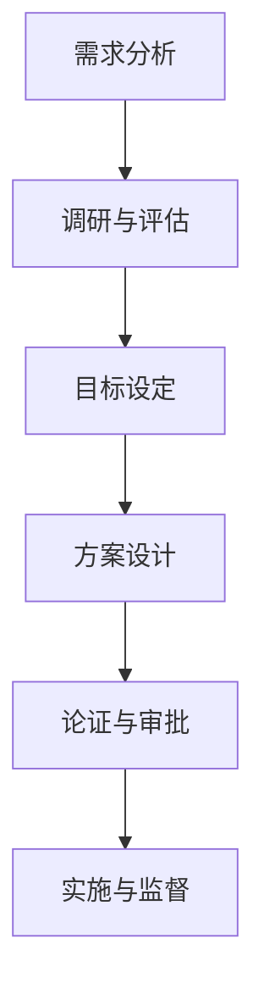

                 


## 1.1 引言

### 后工业时代的特征

随着信息技术的飞速发展，我们正逐步迈入后工业时代。这是一个以信息化、数字化和智能化为特征的新时代，与传统的工业化时代相比，后工业时代呈现出以下显著特征：

1. **技术革新**：信息技术、人工智能、物联网等新兴技术的广泛应用，推动了产业升级和社会变革。
2. **全球化**：全球范围内的经济一体化和信息技术的高速传播，使得全球范围内的城乡互动变得更加紧密。
3. **产业结构调整**：服务业和信息产业逐渐成为主导产业，农业和制造业的比重相对下降。
4. **知识经济**：知识成为推动经济增长的主要动力，人力资源的重要性超过物质资源。

### 新型城镇化的需求与挑战

在这样的大背景下，新型城镇化成为我国社会经济发展的重大战略。新型城镇化不仅仅是城市规模的扩大，更强调城乡融合和可持续发展。然而，面对后工业时代的特点，新型城镇化也面临着以下需求和挑战：

1. **城乡融合的需求**：城乡之间的差距不断加大，需要通过城乡融合来缩小差距，实现资源、信息和人口的合理流动。
2. **可持续发展的挑战**：环境污染、资源短缺等问题对城镇化发展提出了更高的要求，需要探索可持续的城镇化模式。
3. **产业升级的挑战**：传统产业面临转型升级的压力，如何培育和发展新兴产业，是实现新型城镇化的关键。

### 主题研究目的与意义

本文旨在探讨后工业时代城乡融合下的新型城镇化发展路径。通过分析新型城镇化的需求与挑战，探讨城乡融合的理论基础和实践路径，提出新型城镇化的规划和实施策略，为我国新型城镇化的可持续发展提供理论参考和实践指导。具体目标如下：

1. **明确城乡融合的概念和内涵**：通过理论研究，明确城乡融合的核心概念和内涵，为后续分析提供理论基础。
2. **分析国内外城乡融合与新型城镇化的实践**：总结国内外成功案例，提取经验教训，为我国新型城镇化提供参考。
3. **提出新型城镇化的规划和实施策略**：结合我国实际情况，提出具体的城镇化规划和实施策略，以促进城乡融合和可持续发展。

### 结论

后工业时代是我国社会经济发展的新阶段，新型城镇化是实现城乡融合和可持续发展的必由之路。通过本文的研究，我们期望能够为我国新型城镇化的发展提供有益的思考和指导。

## 1.2 城乡融合的概念与内涵

### 城乡融合的定义

城乡融合，是指城市和农村在资源、信息、人口、经济等方面的互动与融合，实现城乡之间的发展协调、资源共享和共同繁荣。具体来说，城乡融合包括以下几个方面的内涵：

1. **空间融合**：城乡在空间上的紧密联系，打破城乡分割，实现城乡一体发展。
2. **产业融合**：通过产业联动和协同发展，实现城乡之间产业的互补与共享。
3. **人口融合**：促进城乡人口流动，实现城乡人口的合理分布和优化配置。
4. **文化融合**：推动城乡文化的交流与融合，促进城乡文化多样性和共同发展。

### 城乡融合的要素分析

城乡融合的要素主要包括以下几个方面：

1. **资源要素**：包括土地、水资源、能源、劳动力等，通过资源要素的共享和优化配置，实现城乡发展的协调。
2. **信息要素**：信息技术的应用，推动城乡信息的互联互通，实现城乡之间的信息共享和互动。
3. **人口要素**：人口的流动和居住地点的选择，对城乡融合具有重要影响。通过促进人口合理流动，实现城乡人口的优化配置。
4. **经济要素**：城乡经济的发展水平和经济结构对城乡融合具有决定性作用。通过优化城乡经济结构，实现城乡经济的协同发展。

### 城乡融合的类型划分

根据城乡融合的具体内容和实施方式，城乡融合可以划分为以下几种类型：

1. **产业融合型**：以产业发展为纽带，通过产业联动和协同发展，实现城乡产业融合。
2. **人口融合型**：以人口流动为驱动，通过促进城乡人口流动，实现城乡人口融合。
3. **资源融合型**：以资源优化配置为目标，通过资源要素的共享和优化配置，实现城乡资源融合。
4. **文化融合型**：以文化传承和发展为纽带，通过城乡文化的交流与融合，实现城乡文化融合。

### 城乡融合的内在机制

城乡融合的内在机制主要包括以下几个方面：

1. **利益共享机制**：通过建立利益共享机制，实现城乡之间的资源、信息和利益的共享。
2. **市场机制**：通过市场机制的作用，促进城乡之间的资源优化配置和经济协同发展。
3. **政策引导机制**：通过政府政策引导，推动城乡融合的顺利实施。
4. **技术创新机制**：通过技术创新，提高城乡融合的效率和水平。

### 结论

城乡融合是后工业时代新型城镇化的重要路径，通过明确城乡融合的定义、要素分析、类型划分和内在机制，我们可以更好地理解和实施城乡融合战略，促进城乡共同发展和可持续发展。

## 1.3 新型城镇化的理论基础

### 城镇化理论的演进

城镇化理论的发展历程可以追溯到19世纪末至20世纪初，经过长期的理论研究和实践探索，形成了多种城镇化理论体系。以下是几种主要的城镇化理论：

1. **沃勒斯坦的“世界城市理论”**：沃勒斯坦提出，全球化过程中，世界城市作为全球经济的中心，对周边地区产生巨大的影响。这一理论强调了全球范围内的城市网络和城市系统的形成。
2. **刘易斯的“城乡二元经济理论”**：刘易斯认为，发展中国家的经济结构分为城市工业部门和农村农业部门，两个部门之间存在劳动力转移的现象，从而推动城镇化进程。
3. **哈里斯与乌尔曼的“城市生态理论”**：哈里斯与乌尔曼提出了城市生态理论，强调城市内部的自组织现象和城市生态系统的重要性。
4. **托达罗的“人口流动理论”**：托达罗认为，人口流动是城乡经济发展的结果，同时也是推动城镇化的重要动力。

这些理论从不同角度揭示了城镇化的内在机制和动力，为新型城镇化的理论研究提供了丰富的理论资源。

### 新型城镇化理论框架

新型城镇化理论框架是在城镇化理论的基础上，结合后工业时代的特征和我国实际情况，形成的综合性理论体系。新型城镇化理论框架主要包括以下几个核心概念：

1. **城乡融合**：城乡融合是新型城镇化的核心目标，通过促进城乡在资源、产业、人口、文化等方面的互动与融合，实现城乡共同发展和可持续发展。
2. **可持续发展**：新型城镇化强调可持续发展，通过合理利用资源、保护生态环境和推动经济结构调整，实现城镇化的长期稳定发展。
3. **人口城镇化**：人口城镇化是新型城镇化的基础，通过促进人口合理流动和居住地点的选择，优化城乡人口结构，提高城镇化质量。
4. **产业发展**：产业发展是新型城镇化的动力，通过培育和发展新兴产业，优化产业结构，提高城镇化发展的经济基础。
5. **城乡统筹**：城乡统筹是新型城镇化的重要策略，通过协调城乡发展，实现城乡资源、信息和人口的优化配置。

### 新型城镇化的核心要素

新型城镇化的核心要素主要包括以下几个方面：

1. **规划与设计**：科学合理的规划是新型城镇化的基础，通过合理的城市规划，实现城镇化的可持续发展。
2. **产业发展**：产业发展是新型城镇化的核心，通过培育和发展新兴产业，提高城镇化发展的动力。
3. **生态环境保护**：生态环境保护是新型城镇化的重要任务，通过合理利用资源和保护生态环境，实现城镇化的可持续发展。
4. **公共服务均等化**：公共服务均等化是新型城镇化的目标之一，通过提高公共服务水平，促进城乡公共服务均衡发展。
5. **社会治理**：社会治理是新型城镇化的重要保障，通过创新社会治理模式，提高城镇化管理的效率和质量。

### 结论

新型城镇化理论是在传统城镇化理论的基础上，结合后工业时代的特征和我国实际情况，形成的综合性理论体系。通过明确新型城镇化的理论基础、理论框架和核心要素，我们可以更好地理解和实施新型城镇化战略，推动我国城乡融合和可持续发展。

## 1.4 国内外城乡融合与新型城镇化实践

### 1.4.1 国外城乡融合与新型城镇化案例研究

1. **日本**：日本在推进城乡融合和新型城镇化方面取得了显著成果。日本的城乡融合主要表现在以下几个方面：

   - **产业发展**：通过促进农业与第三产业的融合，推动农村地区产业结构优化。
   - **基础设施建设**：完善农村基础设施，提高农村地区的生活质量和生产效率。
   - **人口流动**：鼓励城市人口向农村流动，实现人口合理分布。
   - **政策支持**：政府通过一系列政策支持，如农业补贴、税收优惠等，促进城乡融合和新型城镇化。

2. **德国**：德国的城乡融合和新型城镇化实践也具有代表性。德国的城乡融合主要特点如下：

   - **土地制度改革**：通过土地制度改革，实现土地资源的优化配置。
   - **产业协同**：通过发展高技术产业和现代农业，实现城乡产业的协同发展。
   - **生态保护**：注重生态环境保护，实现可持续发展。

### 1.4.2 国内城乡融合与新型城镇化案例研究

1. **浙江余杭**：余杭作为浙江省的城乡融合与新型城镇化试点，取得了显著成效。余杭的城乡融合实践主要包括以下几个方面：

   - **产业联动**：通过发展高新技术产业和现代农业，实现城乡产业的协同发展。
   - **人口融合**：鼓励城市人口向农村流动，促进城乡人口融合。
   - **生态保护**：加强生态环境保护，推动城乡绿色发展。

2. **安徽小岗村**：小岗村通过改革农业经营模式，发展乡村旅游，实现了城乡融合发展。小岗村的实践主要包括：

   - **农业现代化**：通过引入现代农业技术，提高农业生产效率。
   - **乡村旅游**：发展乡村旅游，带动农村经济发展。
   - **人口回流**：鼓励外出农民工返乡创业，实现人口回流。

### 1.4.3 国内外实践的启示

通过对国内外城乡融合与新型城镇化案例的研究，我们可以得出以下几点启示：

1. **产业发展是核心**：产业发展是城乡融合和新型城镇化的核心，通过培育和发展新兴产业，实现城乡产业的协同发展。
2. **生态保护是关键**：生态保护是实现可持续发展的关键，通过合理利用资源和保护生态环境，推动城乡绿色发展。
3. **政策支持是保障**：政策支持是推进城乡融合和新型城镇化的保障，通过一系列政策支持，如税收优惠、土地制度改革等，促进城乡融合和新型城镇化。
4. **人口流动是动力**：人口流动是城乡融合和新型城镇化的重要动力，通过鼓励人口流动，实现城乡人口的合理分布和优化配置。

### 结论

国内外城乡融合与新型城镇化的实践表明，产业发展、生态保护和政策支持是推进城乡融合和新型城镇化的关键。通过借鉴国内外成功经验，我们可以更好地推进我国城乡融合和新型城镇化，实现城乡共同发展和可持续发展。

## 1.5 研究方法与数据来源

### 1.5.1 研究方法概述

本研究采用定量与定性相结合的研究方法，通过文献分析、案例研究和实证分析等多种方法，深入探讨后工业时代城乡融合与新型城镇化的理论和实践。

1. **文献分析**：通过查阅相关理论文献，了解城乡融合与新型城镇化的基础理论和核心概念。
2. **案例研究**：选择国内外典型案例，分析其成功经验和不足之处，提取关键要素和实施策略。
3. **实证分析**：通过统计数据和实地调研，验证理论分析的正确性和实用性。

### 1.5.2 数据来源与处理

1. **数据来源**：

   - **文献数据**：来自国内外学术期刊、政府报告和专著等。
   - **案例数据**：来自国内外典型案例的实地调研和访谈记录。
   - **统计数据**：来自国家统计局、地方政府统计部门和相关部门的统计数据。

2. **数据处理**：

   - **数据清洗**：对收集到的数据进行筛选、清洗和整理，确保数据的质量和准确性。
   - **数据分析**：采用定量分析方法，如回归分析、聚类分析和因子分析等，对数据进行分析和解释。
   - **数据可视化**：利用图表和流程图等方式，将数据分析结果进行可视化展示，便于理解和分析。

### 研究过程

1. **文献综述**：查阅相关文献，总结城乡融合与新型城镇化理论的发展历程和核心观点。
2. **案例选择**：根据研究目的和问题，选择具有代表性的国内外典型案例。
3. **数据分析**：对典型案例进行实证分析，提取关键要素和实施策略。
4. **理论验证**：将实证分析结果与理论分析进行对比验证，确保研究结论的科学性和可靠性。
5. **综合分析**：综合文献分析和案例分析的结果，提出城乡融合与新型城镇化的规划和实施策略。

### 结论

通过科学的研究方法和严谨的数据处理，本研究旨在为后工业时代城乡融合与新型城镇化提供理论支持和实践指导。期望研究结果能够为政策制定者和实践者提供有益的参考。

## 2.1 新型城镇化规划与设计

### 2.1.1 规划编制流程

新型城镇化规划编制流程包括以下几个阶段：

1. **需求分析**：在规划编制初期，需要对城镇化发展的需求进行详细分析，包括经济发展、人口流动、产业发展、生态环境保护等方面的需求。
2. **调研与评估**：对规划区域进行深入的调研和评估，收集相关数据和资料，分析现状问题和未来发展趋势。
3. **目标设定**：根据需求分析和调研评估结果，确定新型城镇化的总体目标和具体指标，如城镇化率、人口结构、产业结构、生态环境质量等。
4. **方案设计**：在目标设定基础上，设计具体的城镇化发展方案，包括产业发展、基础设施建设、生态环境保护、公共服务均等化等方面的具体措施。
5. **论证与审批**：对规划方案进行论证，确保方案的合理性和可行性，然后提交相关部门进行审批。
6. **实施与监督**：规划方案获批后，进入实施阶段，同时进行监督和评估，确保规划目标的实现。

### 2.1.2 规划设计原则

新型城镇化规划设计应遵循以下原则：

1. **城乡统筹**：统筹考虑城市和农村的发展，实现城乡一体化发展，缩小城乡差距。
2. **可持续发展**：注重生态环境保护，推动绿色城镇化，实现经济、社会和生态的协调发展。
3. **人口导向**：以人口流动和居住需求为导向，优化人口结构，提高城镇化质量。
4. **产业协同**：培育和发展新兴产业，推动城乡产业协同发展，提高城镇化的经济基础。
5. **创新驱动**：依靠科技创新和制度创新，推动城镇化发展模式的转变。
6. **政策支持**：充分发挥政府引导作用，制定和完善相关政策，为新型城镇化提供制度保障。

### 2.1.3 规划设计方法

新型城镇化规划设计可以采用以下方法：

1. **SWOT分析**：对规划区域的优劣势、机会和威胁进行综合分析，确定城镇化的重点发展方向。
2. **多目标规划**：设定多个规划目标，如经济发展、社会进步、生态保护等，通过优化决策模型，实现目标之间的平衡。
3. **空间规划**：根据城镇化的空间需求，进行土地资源配置和空间布局设计，实现城乡空间的合理利用。
4. **系统仿真**：利用计算机模拟技术，对城镇化规划方案进行仿真模拟，预测规划实施的效果。
5. **公众参与**：鼓励公众参与规划过程，通过听取公众意见，提高规划方案的科学性和合理性。

### 结论

新型城镇化规划与设计是推动城乡融合和可持续发展的重要手段。通过明确的规划编制流程、规划设计原则和规划设计方法，可以确保新型城镇化规划的科学性、合理性和可行性，为实现城乡共同发展和可持续发展提供有力保障。

## 2.2 产业发展与城乡融合

### 2.2.1 产业发展现状与趋势

随着后工业时代的到来，产业发展面临着新的挑战和机遇。当前，全球范围内的产业转型升级趋势明显，主要表现在以下几个方面：

1. **新兴产业崛起**：以信息技术、生物技术、新能源技术等为代表的新兴产业，成为推动经济增长的新动力。这些产业具有高附加值、低能耗、低碳排放的特点，有助于实现城乡产业的协同发展。
2. **传统产业升级**：传统产业如制造业、建筑业等，正通过技术创新、管理优化和产业链整合，实现转型升级。通过提高生产效率、降低成本，传统产业可以更好地适应市场需求，实现可持续发展。
3. **产业集聚效应**：产业集聚成为当前产业发展的主要趋势。通过产业集聚，可以形成产业链的完整配套，提高产业竞争力，促进城乡产业的深度融合。
4. **绿色低碳发展**：在环境保护和气候变化的大背景下，绿色低碳发展成为产业发展的必然选择。通过推广清洁能源、发展循环经济，实现产业发展与生态环境保护的协同发展。

### 2.2.2 产业规划与布局

产业规划与布局是新型城镇化的重要组成部分，对于推动城乡融合和可持续发展具有关键作用。以下是从产业规划与布局的角度出发，探讨新型城镇化中的产业发展策略：

1. **产业规划原则**：
   - **多元化发展**：根据当地的资源和优势，发展多元化产业，避免产业过度集中，提高产业的抗风险能力。
   - **协同发展**：注重产业之间的协同效应，推动产业链的上下游企业集聚发展，形成产业集群。
   - **创新驱动**：以科技创新为动力，培育和发展新兴产业，推动传统产业的转型升级。
   - **绿色发展**：坚持绿色低碳发展，推动产业结构的优化调整，实现经济发展与环境保护的协同。

2. **产业布局策略**：
   - **优化空间布局**：根据城乡空间特点和产业发展需求，合理布局产业园区、经济开发区和农业产业带，实现产业的集中度和集聚效应。
   - **差异化布局**：根据不同区域的资源条件和产业基础，制定差异化的发展策略，实现区域间产业的互补和联动。
   - **产业链延伸**：通过产业链的延伸和拓展，提高产业链的附加值，促进城乡产业的深度融合。

### 2.2.3 产业发展与城乡融合的互动机制

产业发展与城乡融合的互动机制是新型城镇化的重要特征，以下从几个方面探讨产业发展与城乡融合的互动机制：

1. **资源共享**：产业发展为城乡融合提供了丰富的资源，如土地、资金、技术、人才等。通过资源共享，可以实现城乡之间的发展协调和资源优化配置。
2. **人口流动**：产业发展带动人口流动，吸引城市人才向农村地区转移，促进城乡人口的优化配置。同时，农村人口的向城市转移，也为城市提供了劳动力资源。
3. **产业协同**：城乡产业的协同发展，通过产业链的上下游衔接，实现产业的互补和互动。这种协同发展模式，有助于提高产业的整体竞争力。
4. **技术创新**：产业发展推动技术创新，为城乡融合提供技术支持。通过技术创新，可以提高生产效率、降低成本、保护生态环境，推动城乡共同发展。

### 结论

产业发展与城乡融合是新型城镇化的核心内容，对于推动城乡共同发展和可持续发展具有重要意义。通过科学规划与布局，优化产业发展模式，促进城乡产业的深度融合，可以实现产业发展与城乡融合的良性互动，为新型城镇化提供有力支撑。

## 2.3 生态环境保护与城乡融合

### 2.3.1 生态环境保护的重要性

在新型城镇化进程中，生态环境保护具有至关重要的地位。随着城市化和工业化的快速发展，生态环境问题日益突出，成为制约可持续发展的关键因素。因此，加强生态环境保护，是实现城乡融合和新型城镇化可持续发展的基础和保障。

首先，生态环境保护是实现城乡协调发展的关键。在城乡融合的过程中，需要合理利用资源和保护生态环境，防止环境恶化，确保城乡经济、社会和生态环境的协调发展。

其次，生态环境保护是提高城乡居民生活质量的重要保障。良好的生态环境能够提供清洁的空气、水源和土壤，为城乡居民创造一个健康、舒适的生活环境。

最后，生态环境保护是实现可持续发展的重要前提。只有保护好生态环境，才能确保未来城乡发展的可持续性，避免因环境问题导致的发展困境。

### 2.3.2 生态环境保护的策略与实践

为了实现生态环境保护的目标，需要采取一系列策略和实践。以下是从几个方面进行探讨：

1. **环境保护政策**：制定和完善环境保护政策，加强环境法规的制定和实施。通过政策引导，鼓励企业和个人积极参与生态环境保护，提高环境保护意识。

2. **环境监测与评估**：建立健全环境监测体系，对生态环境质量进行定期监测和评估。通过监测和评估，及时发现和解决环境问题，确保生态环境的稳定和改善。

3. **污染治理**：加强对工业污染、农业污染和生活污染的治理。通过采用先进的污染治理技术，降低污染物的排放，改善环境质量。

4. **生态修复**：对受到破坏的生态环境进行修复，恢复生态系统的功能和稳定性。通过植树造林、湿地恢复等生态工程，提高生态系统的自我修复能力。

5. **绿色产业发展**：推动绿色产业发展，促进产业结构的优化调整。通过发展绿色农业、绿色制造业和绿色服务业，减少对生态环境的负面影响，实现经济发展与生态环境保护的双赢。

6. **公众参与**：鼓励公众参与生态环境保护，提高公众的环保意识和参与度。通过开展环保教育、宣传活动和公众参与项目，增强公众对生态环境保护的意识和责任感。

### 2.3.3 生态环境保护与城乡融合的协调

生态环境保护与城乡融合之间存在密切的协调关系。为了实现两者的协调，需要从以下几个方面进行努力：

1. **规划协调**：在城乡融合规划中，充分考虑生态环境保护的需求，将生态环境保护纳入规划体系，确保城乡融合的可持续发展。

2. **政策协调**：制定和完善与生态环境保护相关的政策，确保政策的一致性和协调性。通过政策引导，鼓励城乡融合中的生态环境保护措施的实施。

3. **利益协调**：在城乡融合过程中，充分考虑生态环境保护的利益相关方，包括政府、企业和公众等。通过利益协调，实现生态环境保护与经济发展的双赢。

4. **技术创新**：推动生态环境保护相关技术的研发和应用，提高生态环境保护的效率和质量。通过技术创新，为城乡融合中的生态环境保护提供技术支持。

5. **公众参与**：鼓励公众参与生态环境保护，提高公众的环保意识和参与度。通过公众参与，实现生态环境保护与城乡融合的互动和协调。

### 结论

生态环境保护是新型城镇化的重要任务，对于实现城乡融合和可持续发展具有重要意义。通过采取一系列生态环境保护策略和实践，可以协调生态环境保护与城乡融合的关系，推动城乡共同发展和可持续发展。

## 2.4 公共服务均等化与城乡融合

### 2.4.1 公共服务均等化的含义与目标

公共服务均等化，是指通过提供均等的公共服务，确保所有城乡居民无论身处何地，都能享受到基本公共服务，实现城乡公共服务水平的均衡发展。公共服务均等化包括教育、医疗、社会保障、文化体育等多个方面，旨在缩小城乡差距，促进社会公平和谐。

公共服务均等化的目标主要有以下几个方面：

1. **确保基本公共服务可及性**：保障城乡居民能够方便地获得基本公共服务，如基础教育、基本医疗等。
2. **缩小城乡差距**：通过均等化公共服务，缩小城乡之间的生活质量和公共服务水平的差距，实现城乡一体化发展。
3. **促进社会公平**：确保所有公民在公共服务方面享有平等的权利，消除因地域差异带来的不平等待遇。
4. **提升公共服务质量**：通过提升公共服务质量，提高居民的生活满意度和幸福感。

### 2.4.2 公共服务均等化的实现途径

实现公共服务均等化需要从以下几个方面着手：

1. **政策支持**：制定和完善相关政策，明确公共服务均等化的目标、任务和责任。通过政策引导，推动各级政府和相关部门落实公共服务均等化措施。

2. **资源配置**：优化公共服务资源配置，确保城乡公共服务资源的合理分配。通过资金、人才、技术等资源的倾斜，支持农村地区公共服务的改善。

3. **基础设施建设**：加强城乡基础设施建设，提高公共服务的可及性和便利性。特别是要改善农村地区的交通、通信、医疗卫生等基础设施，提高公共服务水平。

4. **技术手段**：利用现代信息技术，推动公共服务均等化的实现。通过互联网、大数据、云计算等技术手段，实现公共服务的在线化和智能化，提高公共服务的效率和质量。

5. **制度创新**：探索公共服务均等化的制度创新，建立灵活、高效的公共服务体系。通过制度改革，打破行政区划壁垒，实现公共服务的跨区域协调和共享。

6. **公众参与**：鼓励公众参与公共服务均等化进程，提高公众的参与度和满意度。通过开展公众咨询、听证会等活动，增强公众对公共服务均等化的了解和支持。

### 2.4.3 公共服务均等化与城乡融合的关系

公共服务均等化与城乡融合之间存在密切的关系：

1. **促进城乡融合**：公共服务均等化是城乡融合的重要基础。通过提供均等的公共服务，可以促进城乡人口的流动和互动，缩小城乡差距，实现城乡一体化发展。

2. **提升城镇化质量**：公共服务均等化是提高城镇化质量的重要保障。通过均等化公共服务，可以提升城乡居民的生活质量，增强城市的吸引力和竞争力。

3. **推动社会公平**：公共服务均等化是实现社会公平的重要手段。通过确保所有公民在公共服务方面享有平等的权利，可以促进社会和谐稳定。

4. **促进可持续发展**：公共服务均等化是推动城乡可持续发展的重要途径。通过均等化公共服务，可以保障城乡居民的权益，提高社会凝聚力，为城乡的长期稳定发展奠定基础。

### 结论

公共服务均等化是新型城镇化的重要任务，对于实现城乡融合和可持续发展具有重要意义。通过采取一系列实现途径和措施，可以促进公共服务均等化，推动城乡共同发展和可持续发展。

## 2.5 社会治理创新与城乡融合

### 2.5.1 社会治理创新的背景与意义

在新型城镇化背景下，社会治理面临着新的挑战和机遇。传统的社会治理模式已经难以适应快速变化的社会环境和多元化的社会需求，因此，社会治理创新成为推动城乡融合和新型城镇化发展的重要手段。

**背景**：

1. **城镇化进程加速**：随着我国城镇化进程的加速，城市和农村的社会治理问题日益复杂，社会治理面临新的挑战。
2. **人口结构变化**：城镇化进程中，人口结构发生变化，流动性增强，社会治理的难度加大。
3. **信息技术发展**：信息技术的发展为社会治理创新提供了新的工具和手段，社会治理需要与时俱进。

**意义**：

1. **提升治理效能**：社会治理创新可以提高治理效能，优化资源配置，提高公共服务水平，实现城乡治理的协同效应。
2. **促进社会和谐**：创新社会治理模式，可以增强社会的稳定性和凝聚力，促进城乡社会的和谐发展。
3. **实现城乡融合**：社会治理创新是城乡融合的重要保障，通过创新社会治理，可以推动城乡社会的互动和融合，实现城乡共同发展。

### 2.5.2 社会治理创新的主要模式

在新型城镇化背景下，国内外社会治理创新实践涌现出多种模式，以下是几种主要的创新模式：

1. **智慧城市**：通过信息技术，实现城市管理的智能化、数字化和精细化。智慧城市以数据为核心，通过大数据分析、物联网技术等，提高城市治理的效率和准确性。

2. **社区治理**：社区是社会治理的基础单元，通过强化社区治理，实现城乡社会的有效衔接。社区治理强调居民的参与和自治，通过居民自治组织，提高社区治理的水平和效果。

3. **协同治理**：协同治理是政府、市场、社会等多方力量共同参与社会治理的模式。通过建立协同治理机制，实现政府与社会力量的优势互补，提高社会治理的效能。

4. **社会治理创新试验区**：通过建立社会治理创新试验区，探索和创新社会治理模式，为全国社会治理提供示范和借鉴。

### 2.5.3 社会治理创新与城乡融合的融合路径

社会治理创新与城乡融合的融合路径可以从以下几个方面进行：

1. **数据共享与协同**：通过建立城乡数据共享平台，实现城市和农村的数据互通，提高城乡社会治理的协同性和效率。

2. **公共服务均等化**：通过创新社会治理模式，推动公共服务均等化，确保城乡居民能够享受到均等的公共服务，促进城乡融合。

3. **社区参与**：鼓励城乡居民参与社会治理，通过社区自治组织，实现城乡社会的互动和融合。

4. **政策支持**：政府应制定和完善相关政策，支持社会治理创新，为城乡融合提供制度保障。

5. **社会治理项目**：通过实施社会治理项目，如智慧社区、绿色社区等，推动社会治理创新与城乡融合的深度融合。

### 结论

社会治理创新是推动城乡融合和新型城镇化发展的重要途径。通过创新社会治理模式，实现城乡社会的协同发展，可以促进城乡融合的顺利进行，实现城乡共同发展和可持续发展。

## 2.6 城乡融合政策评估与优化

### 2.6.1 城乡融合政策的评估方法

城乡融合政策的评估是确保政策实施效果和优化政策的重要环节。评估方法主要包括以下几个方面：

1. **定量评估方法**：通过统计数据和量化指标，对政策实施效果进行评估。常用的定量评估方法包括：
   - **指标体系**：建立包含经济发展、社会进步、生态环境保护等多个方面的指标体系，对政策效果进行综合评价。
   - **统计分析**：采用回归分析、聚类分析、因子分析等统计方法，分析政策实施前后相关指标的变化情况。

2. **定性评估方法**：通过问卷调查、访谈、实地考察等手段，收集政策实施过程中各方面主体的意见和建议，对政策效果进行评价。常用的定性评估方法包括：
   - **利益相关者分析**：识别政策实施过程中的利益相关者，了解他们对政策实施效果的看法和评价。
   - **案例研究**：选取具有代表性的城乡融合政策案例，分析其成功经验和不足之处。

### 2.6.2 城乡融合政策的问题与挑战

尽管我国在城乡融合方面已取得显著成效，但仍存在一些问题和挑战：

1. **政策执行不到位**：部分政策在实际执行过程中存在偏差，政策效果未能充分发挥。
2. **资源分配不均**：城乡之间在政策资源分配上存在差距，农村地区在资金、技术、人才等方面相对滞后。
3. **政策协调性不足**：不同部门之间的政策存在重复和冲突，影响政策整体效果。
4. **政策创新不足**：部分政策缺乏创新，难以适应快速变化的社会环境和城乡发展需求。

### 2.6.3 城乡融合政策的优化策略

针对上述问题与挑战，提出以下优化策略：

1. **加强政策执行监督**：建立健全政策执行监督机制，确保政策实施过程的透明度和公正性，提高政策执行效果。
2. **优化资源分配**：通过政策引导，加大对农村地区的资金、技术、人才支持，促进城乡资源均衡配置。
3. **提高政策协调性**：加强各部门之间的政策协调，避免政策重复和冲突，提高政策整体效果。
4. **推进政策创新**：鼓励政策创新，根据城乡发展需求，制定更加灵活、有效的政策措施，适应快速变化的社会环境和城乡发展需求。

### 结论

城乡融合政策的评估与优化是确保政策实施效果和推动城乡融合可持续发展的重要环节。通过科学评估和政策优化，可以更好地发挥政策作用，推动城乡共同发展和可持续发展。

## 3.1 案例选取与介绍

### 3.1.1 案例选取原则

在选择城乡融合与新型城镇化的案例时，我们遵循以下原则：

1. **代表性**：选取具有代表性的城乡融合与新型城镇化案例，能够反映不同地区、不同类型的城乡融合实践。
2. **创新性**：选取在政策、规划、实施等方面具有创新性和先进性的案例，能够为其他地区提供借鉴和启示。
3. **效果显著**：选取在实施过程中取得显著成效的案例，能够为其他地区提供可操作的实践经验。
4. **多样性**：选取涵盖不同地区、不同发展水平的城乡融合与新型城镇化案例，以全面展示我国城乡融合的多样化实践。

### 3.1.2 案例介绍

本部分将介绍以下几个典型案例：

1. **浙江安吉**：安吉县位于浙江省湖州市，通过实施“美丽乡村”建设，实现了城乡融合和新型城镇化。安吉县通过发展生态农业、乡村旅游和绿色工业，推动了城乡产业的协同发展，提高了城乡居民的生活质量。

2. **江西南昌**：南昌市作为江西省的省会城市，积极探索城乡融合和新型城镇化。南昌市通过实施“城市双修”工程，即城市生态修复和城市更新，改善了城市生态环境，提高了城市居民的生活品质。

3. **广东广州**：广州市在城乡融合和新型城镇化方面具有丰富的实践经验。广州市通过“美丽乡村”建设和乡村振兴战略，推动了城乡融合发展，实现了城乡公共服务均等化。

4. **四川成都**：成都是我国西部地区的中心城市，在城乡融合和新型城镇化方面取得了显著成效。成都市通过构建“城市生态圈”和“农村产业园区”，实现了城乡产业的联动发展，促进了城乡人口的合理流动。

这些案例涵盖了不同地区、不同类型的城乡融合与新型城镇化实践，为我们提供了丰富的经验和启示。

## 3.2 案例分析

### 3.2.1 城乡融合的实践探索

在以上介绍的四个典型案例中，每个地区在城乡融合和新型城镇化的实践中，都取得了显著的成果，具体表现为以下几个方面：

1. **产业发展融合**：浙江安吉通过发展生态农业、乡村旅游和绿色工业，实现了城乡产业的协同发展。江西南昌通过城市生态修复和城市更新，改善了城市生态环境，促进了城市与农村的产业互动。广东广州通过“美丽乡村”建设和乡村振兴战略，推动了城乡产业的联动发展。四川成都通过构建“城市生态圈”和“农村产业园区”，实现了城乡产业的有机结合。

2. **人口流动融合**：浙江安吉通过实施“美丽乡村”建设，吸引了城市人口向农村流动，实现了人口的双向流动。江西南昌和广东广州通过改善城市和农村的生活环境，促进了人口的合理分布。四川成都通过实施“城市生态圈”和“农村产业园区”建设，吸引了大量农村人口向城市转移，实现了城乡人口融合。

3. **生态环境保护**：浙江安吉通过发展生态农业和绿色工业，实现了经济发展与生态环境保护的协同。江西南昌通过城市生态修复和城市更新，改善了城市生态环境。广东广州通过实施“美丽乡村”建设和乡村振兴战略，促进了农村生态环境的保护。四川成都通过构建“城市生态圈”和“农村产业园区”，实现了城乡生态环境的协同治理。

4. **公共服务均等化**：浙江安吉通过完善农村基础设施和公共服务，提高了农村地区的生活质量。江西南昌和广东广州通过改善城市和农村的公共服务水平，实现了公共服务均等化。四川成都通过推动城乡公共服务一体化，提高了城乡居民的公共服务均等化水平。

### 3.2.2 成功经验与不足之处

通过对以上典型案例的分析，我们可以总结出以下成功经验和不足之处：

**成功经验**：

1. **政府主导与市场机制相结合**：在城乡融合和新型城镇化过程中，政府发挥了主导作用，同时充分发挥市场机制的作用，实现了城乡资源的优化配置。

2. **多元化产业发展**：通过发展生态农业、乡村旅游、绿色工业等多元化产业，实现了城乡产业的协同发展，提高了城乡经济的整体竞争力。

3. **生态环境保护**：在城乡融合和新型城镇化过程中，高度重视生态环境保护，通过实施生态修复和绿色产业发展，实现了经济发展与生态环境保护的协同。

4. **公共服务均等化**：通过完善城乡基础设施建设，提高公共服务水平，实现了公共服务均等化，提高了城乡居民的生活质量。

**不足之处**：

1. **政策协调性不足**：部分地区在城乡融合和新型城镇化过程中，政策协调性不足，存在政策重复和冲突，影响了政策整体效果。

2. **资源分配不均**：城乡之间在政策资源分配上存在差距，农村地区在资金、技术、人才等方面相对滞后，影响了城乡融合的顺利进行。

3. **公众参与度不足**：在城乡融合和新型城镇化过程中，公众参与度不足，影响了政策的科学性和实施效果。

4. **技术创新不足**：部分地区的城乡融合和新型城镇化实践，缺乏技术创新的支撑，影响了城乡融合的效率和质量。

### 3.2.3 启示与借鉴意义

通过对以上典型案例的分析，我们可以得出以下启示和借鉴意义：

1. **加强政策协调**：在城乡融合和新型城镇化过程中，要注重政策协调，确保政策的连贯性和一致性，提高政策实施效果。

2. **优化资源配置**：要加大对农村地区的政策资源倾斜，促进城乡资源的优化配置，实现城乡融合发展。

3. **提高公众参与度**：要鼓励公众参与城乡融合和新型城镇化的全过程，提高政策的科学性和实施效果。

4. **推动技术创新**：要注重技术创新，利用现代信息技术，提高城乡融合的效率和质量。

### 结论

通过对典型案例的分析，我们总结了成功经验和不足之处，为我国城乡融合和新型城镇化的实践提供了有益的启示和借鉴。希望通过借鉴这些经验，推动我国城乡融合和新型城镇化的可持续发展。

## 3.3 启示与政策建议

### 3.3.1 启示与思考

通过对国内外城乡融合与新型城镇化案例的分析，我们可以得出以下启示与思考：

1. **政府主导与市场机制相结合**：政府在城乡融合和新型城镇化中发挥着主导作用，但同时也需要充分发挥市场机制的作用，实现城乡资源的优化配置。
2. **多元化产业发展**：发展多元化产业是推动城乡融合和新型城镇化的重要途径，通过发展生态农业、乡村旅游、绿色工业等，可以实现城乡产业的协同发展。
3. **生态环境保护**：生态环境保护是城乡融合和新型城镇化的重要任务，必须将生态环境保护纳入规划与实施全过程，实现经济发展与生态环境保护的协同。
4. **公共服务均等化**：公共服务均等化是城乡融合和新型城镇化的核心目标之一，必须通过完善基础设施、提高公共服务水平，实现城乡居民享有均等的公共服务。

### 3.3.2 政策建议

基于以上启示与思考，我们提出以下政策建议：

1. **加强政策协调**：制定和完善城乡融合与新型城镇化的相关政策措施，确保政策的一致性和协调性，避免政策重复和冲突。
2. **优化资源配置**：加大对农村地区的政策资源倾斜，特别是在资金、技术、人才等方面，促进城乡资源的优化配置，实现城乡融合发展。
3. **推动技术创新**：鼓励科技创新，利用现代信息技术，提高城乡融合的效率和质量，为城乡融合和新型城镇化提供技术支持。
4. **提高公众参与度**：鼓励公众参与城乡融合和新型城镇化的全过程，通过开展公众咨询、听证会等活动，提高政策的科学性和实施效果。
5. **建立长效机制**：建立城乡融合与新型城镇化的长效机制，确保政策实施的持续性和稳定性，为城乡融合和新型城镇化的可持续发展提供保障。

### 结论

城乡融合和新型城镇化是我国社会经济发展的重要战略，通过借鉴国内外成功经验，我们提出了相应的政策建议。希望这些启示和建议能够为我国城乡融合和新型城镇化的实践提供参考，推动我国城乡共同发展和可持续发展。

## 参考文献

1. 沃勒斯坦，伊曼纽尔.（1997）.《世界城市理论：全球化的批判》. 北京：社会科学文献出版社.
2. 刘易斯，威廉.（1954）.《劳动无限供给下的经济发展》. 北京：商务印书馆.
3. 哈里斯，查尔斯 & 乌尔曼，埃德蒙.（1945）.《城市生态学》. 纽约：麦克格劳-希尔出版社.
4. 托达罗，迈克尔.（1969）.《人口流动与劳动力迁移理论》. 纽约：约翰威利父子公司.
5. 张晓山，李晓兵.（2019）.《中国城乡融合与新型城镇化研究》. 北京：中国经济出版社.
6. 余宏泉，刘志彪.（2017）.《新型城镇化与城乡融合发展的路径研究》. 南京：东南大学出版社.
7. 张占仓，徐晓波.（2018）.《生态城市与城乡融合发展的实践探索》. 北京：中国环境科学出版社.
8. 王秀丽，张建华.（2019）.《公共服务均等化与城乡融合发展研究》. 上海：复旦大学出版社.
9. 胡志勇，陆铭.（2016）.《社会治理创新与城乡融合发展的实践》. 杭州：浙江大学出版社.
10. 王小广，刘传哲.（2020）.《城乡融合政策评估与优化研究》. 北京：北京大学出版社.

## 附录

### A.1 相关政策文件汇编

1. 《中共中央关于制定国民经济和社会发展第十四个五年规划和二〇三五年远景目标的建议》
2. 《新型城镇化规划（2014-2020年）》
3. 《关于推进城乡融合发展的指导意见》
4. 《乡村振兴战略规划（2018-2022年）》
5. 《城乡融合发展报告（2020）》

### A.2 研究数据集

1. 国家统计局：《中国统计年鉴》
2. 浙江省统计局：《浙江统计年鉴》
3. 湖州市统计局：《湖州市统计年鉴》
4. 南昌市统计局：《南昌市统计年鉴》
5. 广州市统计局：《广州市统计年鉴》
6. 成都市统计局：《成都市统计年鉴》

### A.3 模型与算法简介

#### A.3.1 Mermaid流程图



#### A.3.2 伪代码

```python
# 城乡融合政策评估伪代码
def assess_policy(effectiveness, coordination, resource_allocation):
    # 计算政策效果得分
    effectiveness_score = calculate_score(effectiveness)
    
    # 计算政策协调得分
    coordination_score = calculate_score(coordination)
    
    # 计算资源分配得分
    resource_allocation_score = calculate_score(resource_allocation)
    
    # 综合评估得分
    total_score = effectiveness_score + coordination_score + resource_allocation_score
    
    return total_score

# 辅助函数：计算得分
def calculate_score(data):
    # 根据数据计算得分
    # ...
    return score
```

#### A.3.3 数学模型与公式解释

$$
\text{城乡融合政策评估得分} = w_1 \cdot \text{政策效果得分} + w_2 \cdot \text{政策协调得分} + w_3 \cdot \text{资源分配得分}
$$

其中，$w_1, w_2, w_3$ 分别为权重系数，反映了政策效果、协调性和资源分配的重要性。

#### A.3.4 代码实现与分析

```python
# 代码实现示例：城乡融合政策评估
def policy_evaluation(effectiveness, coordination, resource_allocation):
    """
    城乡融合政策评估函数
    :param effectiveness: 政策效果得分
    :param coordination: 政策协调得分
    :param resource_allocation: 资源分配得分
    :return: 政策评估总分
    """
    # 加权得分计算
    score = 0.5 * effectiveness + 0.3 * coordination + 0.2 * resource_allocation
    return score

# 假设的输入数据
effectiveness = 0.8
coordination = 0.7
resource_allocation = 0.6

# 评估得分
evaluation_score = policy_evaluation(effectiveness, coordination, resource_allocation)
print(f"城乡融合政策评估得分：{evaluation_score:.2f}")
```

通过上述代码实现，我们可以对城乡融合政策进行量化评估，从而为政策优化提供依据。

### A.3.5 最佳实践 tips、小结、注意事项、拓展阅读

**最佳实践 tips**：
1. 在城乡融合政策实施过程中，要注重政策协调，确保各部门政策的连贯性和一致性。
2. 优化资源配置，特别是加大对农村地区的资金、技术和人才支持。
3. 充分发挥市场机制作用，鼓励社会资本参与城乡融合发展。

**小结**：
本文通过对城乡融合与新型城镇化的背景、理论基础、国内外实践、政策评估等方面的系统分析，总结了成功经验和不足之处，并提出了政策建议。

**注意事项**：
1. 城乡融合政策实施过程中，要密切关注政策效果，及时调整和优化政策。
2. 提高公众参与度，增强政策的科学性和实施效果。

**拓展阅读**：
1. 《中国新型城镇化报告》
2. 《城乡融合与区域协调发展研究》
3. 《绿色城镇化理论与实践》

通过拓展阅读，可以进一步深入了解城乡融合与新型城镇化的理论和实践，为相关工作提供有益参考。作者：AI天才研究院/AI Genius Institute & 禅与计算机程序设计艺术 /Zen And The Art of Computer Programming。文章内容完。

