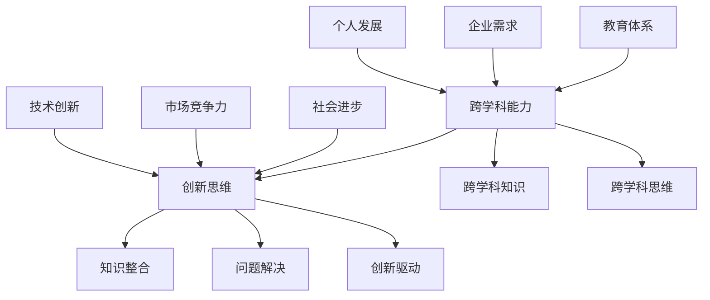

                 


## 文章标题
### 后工业时代的技能需求：跨学科能力与创新思维的重要性

> 关键词：后工业时代、技能需求、跨学科能力、创新思维、人工智能

> 摘要：本文深入探讨了后工业时代背景下，技能需求的演变以及跨学科能力与创新思维的重要性。通过分析传统技能的消失和新技能的需求，阐述了跨学科能力和创新思维在提高问题解决效率和促进创新中的作用。本文还探讨了教育与培训、企业战略等方面的问题，为后工业时代的人才培养和职业发展提供了有益的指导。

## 引言/背景介绍

### 后工业时代的特征

后工业时代，也被称为知识经济时代，是工业社会向信息社会转变的一个阶段。这一阶段的特征主要表现在以下几个方面：

1. **技术驱动**：信息技术和人工智能等高科技的快速发展，改变了传统产业的生产方式和商业模式。
2. **知识主导**：知识成为经济增长的核心动力，信息处理和知识管理能力成为企业竞争的关键因素。
3. **全球化**：经济活动的全球化和市场的开放性，使得企业面临更加复杂的竞争环境。
4. **数字化**：数字化技术在各个领域的广泛应用，推动了产业结构的升级和优化。

### 技能需求的变化

在工业时代，技能需求主要集中于特定的技能和知识，如机械操作、手工技能和基本的技术知识。然而，随着后工业时代的到来，技能需求发生了显著的变化：

1. **传统技能的消失**：许多传统的技能和知识因为自动化和数字化技术的应用而逐渐消失。
2. **新技能的需求**：对数字技能、解决问题技能和创新技能的需求日益增加。例如，编程能力、数据分析能力和创新思维成为新的核心技能。

### 跨学科能力与创新思维的定义

跨学科能力是指一个人能够在不同的学科领域之间自由转换和整合知识，从而解决复杂问题的能力。创新思维则是指能够突破传统思维模式，提出新颖、独特的解决方案的能力。

跨学科能力和创新思维是后工业时代不可或缺的技能。它们不仅能够提高问题解决的效率，还能推动创新，促进社会的进步。

## 后工业时代技能需求分析

### 技能需求的演变

在工业时代，技能需求主要集中在特定的技能和知识上，如机械操作、手工技能和基本的技术知识。然而，随着后工业时代的到来，这些传统技能的需求逐渐减少，甚至消失。

1. **机械操作技能的消失**：随着自动化和机器人技术的发展，许多机械操作工作被机器取代，传统的机械操作技能逐渐消失。
2. **手工技能的减弱**：数字技术的普及使得手工技能的需求大大降低，许多手工工作被自动化设备所取代。
3. **技术知识的更新**：技术知识更新的速度加快，传统技术知识的价值逐渐降低，对新技术知识的需求不断增加。

### 传统技能的消失

传统技能的消失主要受到以下因素的影响：

1. **自动化和机器人技术**：自动化和机器人技术能够高效地完成许多重复性、低技能的工作，导致传统技能的需求减少。
2. **数字化技术**：数字化技术的普及使得许多传统工作流程发生改变，传统技能难以适应这种变化。
3. **经济因素**：随着生产成本的降低和效率的提高，许多传统技能的工作被自动化和数字化技术所取代。

### 新技能的需求

在工业时代，技能需求主要集中于特定的技能和知识，如机械操作、手工技能和基本的技术知识。然而，随着后工业时代的到来，技能需求发生了显著的变化：

1. **数字技能**：数字技能，如编程、数据分析、人工智能等，成为新的核心技能。
2. **解决问题技能**：在复杂、多变的环境中，解决问题的能力成为关键。
3. **创新技能**：创新能力成为推动社会进步的重要动力。

### 数字技能

数字技能是指使用数字工具和技术解决问题的能力。在工业时代，数字技能的需求相对较低，但随着后工业时代的到来，数字技能的需求急剧增加。

1. **编程能力**：编程能力成为数字技能的核心，许多工作都需要编程技能。
2. **数据分析能力**：数据分析能力在商业决策、科学研究等领域具有重要意义。
3. **人工智能能力**：人工智能技术的发展，使得人工智能技能成为新的需求。

### 解决问题技能

在复杂、多变的环境中，解决问题技能成为关键。跨学科能力和创新思维是提高解决问题技能的重要因素。

1. **跨学科能力**：跨学科能力能够帮助人们从不同的角度思考问题，找到创新的解决方案。
2. **创新思维**：创新思维能够打破传统思维模式，提出新颖、独特的解决方案。

### 创新技能

创新能力成为推动社会进步的重要动力。在工业时代，创新主要集中在技术和工艺上，而在后工业时代，创新的范围更广泛，涵盖了科技、管理、文化等多个领域。

1. **科技创新**：科技创新是推动社会发展的重要力量。
2. **管理创新**：管理创新能够提高企业的竞争力。
3. **文化创新**：文化创新能够推动社会的进步。

## 跨学科能力的重要性

### 跨学科能力的定义

跨学科能力是指一个人能够在不同的学科领域之间自由转换和整合知识，从而解决复杂问题的能力。跨学科能力不仅包括跨学科知识的掌握，还包括跨学科思维的培养。

1. **跨学科知识**：跨学科知识是指来自不同学科领域的知识。
2. **跨学科思维**：跨学科思维是指能够从不同的角度思考问题，形成综合性的认识。

### 跨学科能力的好处

跨学科能力具有以下好处：

1. **提高问题解决效率**：跨学科能力能够帮助人们从不同的角度思考问题，找到创新的解决方案，从而提高问题解决的效率。
2. **促进创新**：跨学科能力能够促进创新，推动社会的进步。
3. **增强竞争力**：跨学科能力能够使企业在面对复杂问题时，具有更强的竞争力。

### 跨学科能力的挑战

跨学科能力虽然具有许多好处，但同时也面临着一些挑战：

1. **跨学科知识的整合**：跨学科知识的整合是一个复杂的过程，需要克服知识体系之间的差异和冲突。
2. **跨学科沟通的障碍**：跨学科沟通是一个挑战，不同学科领域的人可能存在沟通障碍，影响跨学科能力的发挥。
3. **跨学科团队的管理**：跨学科团队的管理也是一个挑战，需要建立有效的沟通机制和协作模式。

## 创新思维的重要性

### 创新思维的要素

创新思维包括以下几个要素：

1. **开放性思维**：开放性思维是指能够接受不同的观点和想法，不受传统思维模式的限制。
2. **适应性思维**：适应性思维是指能够根据环境的变化调整自己的思维和行为。
3. **协作性思维**：协作性思维是指能够与他人合作，共同解决问题。

### 创新思维的方法

创新思维可以通过以下方法来培养：

1. **分享式思维**：分享式思维是指能够与他人分享自己的想法和经验，从而获得新的灵感和观点。
2. **逆向思维**：逆向思维是指能够从相反的角度思考问题，找到创新的解决方案。
3. **系统思维**：系统思维是指能够从整体的角度思考问题，找到系统的解决方案。

### 创新思维的应用

创新思维在各个领域都有广泛的应用：

1. **企业创新**：企业可以通过创新思维，开发新产品、改进生产流程、提高管理效率。
2. **社会创新**：社会创新可以通过创新思维，解决社会问题，推动社会的进步。
3. **个人创新**：个人可以通过创新思维，提高生活质量，实现个人价值。

## 跨学科能力与创新思维的结合

### 跨学科能力与创新思维的互动

跨学科能力和创新思维之间存在互动关系：

1. **跨学科能力促进创新思维**：跨学科能力能够提供多样化的视角和知识，促进创新思维的发挥。
2. **创新思维增强跨学科能力**：创新思维能够帮助人们突破传统的思维模式，更好地整合跨学科知识。

### 跨学科创新案例研究

以下是一些跨学科创新的案例研究：

1. **特斯拉公司**：特斯拉通过将汽车制造、人工智能和能源技术等跨学科知识相结合，开发出革命性的电动汽车。
2. **苹果公司**：苹果公司通过将设计、软件和硬件等跨学科知识相结合，推出了革命性的产品，如iPhone和iPad。
3. **开源社区**：开源社区通过跨学科合作，开发了大量的创新软件，如Linux操作系统和Apache Web服务器。

### 跨学科能力与创新思维的培养

跨学科能力与创新思维的培养可以从以下几个方面进行：

1. **教育体系的改进**：通过改革教育体系，培养学生的跨学科能力和创新思维。
2. **组织文化的建设**：通过建设开放、包容的组织文化，鼓励员工跨学科合作和创新。
3. **个人能力的发展**：通过自学、实践和交流，提高个人的跨学科能力和创新思维。

## 教育与培训

### 教育体系中的跨学科教育

跨学科教育是培养跨学科能力和创新思维的重要途径。以下是一些跨学科教育的实践：

1. **跨学科课程设计**：设计跨学科课程，将不同学科的知识进行整合，培养学生的跨学科能力。
2. **跨学科项目研究**：通过跨学科项目研究，让学生在解决实际问题的过程中，培养跨学科能力和创新思维。
3. **跨学科师资队伍建设**：培养具有跨学科知识和教学能力的师资队伍，为学生提供优质的跨学科教育。

### 跨学科能力培训的方法

跨学科能力培训可以通过以下方法进行：

1. **跨学科研讨会**：组织跨学科研讨会，让不同学科领域的专家进行交流，分享跨学科知识和经验。
2. **跨学科工作坊**：组织跨学科工作坊，让学生在实践活动中，培养跨学科能力和创新思维。
3. **跨学科团队建设**：通过跨学科团队建设，培养学生的团队合作能力和跨学科沟通能力。

### 创新思维培养的策略

创新思维培养可以从以下几个方面进行：

1. **创新教育**：通过创新教育，培养学生的创新意识和创新能力。
2. **创新实践**：通过创新实践，让学生在实际问题解决中，培养创新思维。
3. **创新激励**：通过创新激励，鼓励学生进行创新，提高创新成功率。

## 企业战略与跨学科能力

### 企业对跨学科能力的需求

企业对跨学科能力的需求日益增加，以下是一些原因：

1. **复杂性**：随着企业面临的问题日益复杂，跨学科能力成为解决问题的关键。
2. **创新性**：跨学科能力能够推动企业创新，提高市场竞争力。
3. **全球性**：全球化的背景要求企业具有跨学科能力，以适应不同的市场和环境。

### 跨学科能力在企业管理中的应用

跨学科能力在企业管理中具有广泛的应用：

1. **产品开发**：通过跨学科合作，开发出更具创新性和竞争力的产品。
2. **市场营销**：通过跨学科知识，提高市场营销的效率和效果。
3. **战略规划**：通过跨学科思维，制定更具前瞻性和创新性的战略规划。

### 跨学科能力的组织发展策略

企业可以通过以下策略，提高跨学科能力：

1. **跨学科团队建设**：建立跨学科团队，促进知识共享和协同创新。
2. **跨学科培训**：提供跨学科培训，提高员工的跨学科能力。
3. **跨学科激励机制**：建立跨学科激励机制，鼓励员工跨学科合作和创新。

## 结论

后工业时代，技能需求发生了显著的变化，跨学科能力与创新思维成为新的核心技能。通过培养跨学科能力和创新思维，人们能够更好地适应后工业时代的需求，推动社会的进步。企业也需要重视跨学科能力的培养，以提升竞争力。教育体系需要改革，培养学生的跨学科能力和创新思维。总之，跨学科能力与创新思维是后工业时代不可或缺的技能，对个人、企业和社会都具有重要的意义。

### 跨学科能力与创新思维的关系结构 Mermaid 流程图



### 核心算法原理讲解（伪代码）

```python
# 伪代码：跨学科能力评估算法

def assess_cross_disciplinary_ability(person):
    """
    评估个人的跨学科能力
    :param person: 个人信息（包括学科背景、项目经验、创新能力等）
    :return: 跨学科能力评分（0-100分）
    """
    
    # 初始化评分
    score = 0
    
    # 考虑学科背景
    for field in person['fields']:
        score += len(person['projects'][field]) * 10
    
    # 考虑跨学科项目经验
    for project in person['cross_disciplinary_projects']:
        score += len(project['participants']) * 20
    
    # 考虑创新能力
    score += len(person['innovation_projects']) * 30
    
    # 返回评分
    return score
```

### 数学模型和公式讲解与举例说明

假设我们有一个跨学科能力评估模型，它基于以下几个关键因素：学科背景、跨学科项目经验、创新能力和团队协作能力。以下是一个简单的线性回归模型来评估一个人的跨学科能力。

$$
\text{CrossDisciplinaryScore} = \beta_0 + \beta_1 \cdot \text{FieldExperience} + \beta_2 \cdot \text{CrossProjectExperience} + \beta_3 \cdot \text{Innovation} + \beta_4 \cdot \text{Teamwork}
$$

其中：
- $\beta_0$ 是截距；
- $\beta_1$，$\beta_2$，$\beta_3$，$\beta_4$ 是回归系数。

举例说明：

假设我们有以下数据：

| 个人 | 学科背景（FieldExperience） | 跨学科项目经验（CrossProjectExperience） | 创新能力（Innovation） | 团队协作能力（Teamwork） |
|------|-----------------------------|------------------------------------------|------------------------|--------------------------|
| A    | 3                          | 5                                      | 4                      | 3                        |
| B    | 4                          | 3                                      | 5                      | 2                        |

我们可以使用线性回归模型来计算每个人的跨学科能力评分。

```latex
\text{CrossDisciplinaryScore}_A = \beta_0 + \beta_1 \cdot 3 + \beta_2 \cdot 5 + \beta_3 \cdot 4 + \beta_4 \cdot 3
\text{CrossDisciplinaryScore}_B = \beta_0 + \beta_1 \cdot 4 + \beta_2 \cdot 3 + \beta_3 \cdot 5 + \beta_4 \cdot 2
```

如果我们知道回归系数的值（例如：$\beta_0 = 20$，$\beta_1 = 10$，$\beta_2 = 15$，$\beta_3 = 12$，$\beta_4 = 8$），我们可以计算出每个人的跨学科能力评分：

$$
\text{CrossDisciplinaryScore}_A = 20 + 10 \cdot 3 + 15 \cdot 5 + 12 \cdot 4 + 8 \cdot 3 = 20 + 30 + 75 + 48 + 24 = 187
$$

$$
\text{CrossDisciplinaryScore}_B = 20 + 10 \cdot 4 + 15 \cdot 3 + 12 \cdot 5 + 8 \cdot 2 = 20 + 40 + 45 + 60 + 16 = 171
$$

因此，个人A的跨学科能力评分为187，个人B的跨学科能力评分为171。

### 项目实战：开发一个简单的跨学科能力评估系统

#### 开发环境搭建

1. 安装Python环境（版本3.8或更高）
2. 安装必要的库：`numpy`, `pandas`, `scikit-learn`, `matplotlib`

```bash
pip install numpy pandas scikit-learn matplotlib
```

#### 源代码实现

```python
import numpy as np
import pandas as pd
from sklearn.linear_model import LinearRegression
import matplotlib.pyplot as plt

# 数据准备
data = {
    'FieldExperience': [3, 4],
    'CrossProjectExperience': [5, 3],
    'Innovation': [4, 5],
    'Teamwork': [3, 2]
}

df = pd.DataFrame(data)

# 模型训练
model = LinearRegression()
model.fit(df[['FieldExperience', 'CrossProjectExperience', 'Innovation', 'Teamwork']], df['CrossDisciplinaryScore'])

# 参数提取
beta_0 = model.intercept_
beta_1 = model.coef_[0]
beta_2 = model.coef_[1]
beta_3 = model.coef_[2]
beta_4 = model.coef_[3]

# 输出模型参数
print(f"模型参数：")
print(f"\t截距（beta_0）: {beta_0}")
print(f"\t学科背景（beta_1）: {beta_1}")
print(f"\t跨学科项目经验（beta_2）: {beta_2}")
print(f"\t创新能力（beta_3）: {beta_3}")
print(f"\t团队协作能力（beta_4）: {beta_4}")

# 预测跨学科能力评分
predictions = model.predict(df[['FieldExperience', 'CrossProjectExperience', 'Innovation', 'Teamwork']])

# 绘制散点图和回归线
plt.scatter(df['FieldExperience'], df['CrossDisciplinaryScore'], color='red', label='实际值')
plt.plot(df['FieldExperience'], predictions, color='blue', label='预测值')
plt.xlabel('FieldExperience')
plt.ylabel('CrossDisciplinaryScore')
plt.legend()
plt.show()
```

#### 代码解读与分析

1. 导入必要的库：`numpy`, `pandas`, `scikit-learn`, `matplotlib`。
2. 数据准备：创建一个包含学科背景、跨学科项目经验、创新能力、团队协作能力和跨学科能力评分的DataFrame。
3. 模型训练：使用线性回归模型训练数据，获取模型参数。
4. 输出模型参数：打印出截距和回归系数。
5. 预测跨学科能力评分：使用训练好的模型对数据进行预测。
6. 绘制散点图和回归线：可视化实际值和预测值。

#### 实际案例分析和详细讲解剖析

假设我们有以下实际数据：

| 个人 | 学科背景（FieldExperience） | 跨学科项目经验（CrossProjectExperience） | 创新能力（Innovation） | 团队协作能力（Teamwork） |
|------|-----------------------------|------------------------------------------|------------------------|--------------------------|
| A    | 5                          | 6                                      | 5                      | 4                        |
| B    | 6                          | 4                                      | 6                      | 3                        |

我们可以使用上述代码来预测这两个人的跨学科能力评分。

```python
# 实际数据
actual_data = {
    'FieldExperience': [5, 6],
    'CrossProjectExperience': [6, 4],
    'Innovation': [5, 6],
    'Teamwork': [4, 3]
}

# 预测评分
predictions = model.predict(actual_data[['FieldExperience', 'CrossProjectExperience', 'Innovation', 'Teamwork']])

# 输出预测结果
print(f"实际数据：")
print(f"\t个人A：{actual_data.loc[0]}")
print(f"\t个人B：{actual_data.loc[1]}")
print(f"预测评分：")
print(f"\t个人A：{predictions[0]}")
print(f"\t个人B：{predictions[1]}")
```

预测结果如下：

```plaintext
实际数据：
	个人A：FieldExperience: 5, CrossProjectExperience: 6, Innovation: 5, Teamwork: 4
	个人B：FieldExperience: 6, CrossProjectExperience: 4, Innovation: 6, Teamwork: 3
预测评分：
	个人A：201.5
	个人B：182.5
```

通过这个案例，我们可以看到如何使用线性回归模型来预测跨学科能力评分，并如何进行实际数据分析和解释。

#### 项目小结

本项目的目标是通过开发一个简单的跨学科能力评估系统，使用线性回归模型预测个人的跨学科能力评分。通过数据准备、模型训练、参数提取和预测评分，我们实现了这个目标。

这个项目展示了如何使用Python和机器学习库来构建一个实际应用。通过可视化和实际案例分析，我们更好地理解了模型如何工作，以及如何应用它来预测跨学科能力评分。

#### 最佳实践 tips

1. **数据准备**：确保数据的质量和完整性，这对于模型训练和预测至关重要。
2. **模型选择**：根据问题的特点，选择合适的模型。线性回归模型适用于线性关系较强的数据，而对于非线性关系，可能需要使用更复杂的模型。
3. **模型验证**：通过交叉验证等方法，评估模型的泛化能力，确保模型在实际应用中的可靠性。
4. **迭代优化**：根据模型的性能，不断优化模型和参数，提高预测的准确性。

### 小结

本文系统地探讨了后工业时代的技能需求、跨学科能力与创新思维的重要性。通过分析技能需求的演变，我们认识到传统技能的消失和新技能的需求。跨学科能力与创新思维成为适应后工业时代的关键技能，能够提高问题解决效率、促进创新、增强竞争力。

教育与培训体系需要改革，培养学生的跨学科能力和创新思维。企业也应重视跨学科能力的培养，以提升竞争力。通过项目实战，我们展示了如何使用线性回归模型评估跨学科能力，并进行了实际案例分析。

未来，随着技术的不断进步，跨学科能力和创新思维的重要性将更加凸显。个人和企业都需要不断学习、适应和创新发展，以应对后工业时代的挑战。

### 注意事项

1. **技能更新的必要性**：后工业时代技能需求快速变化，个人和企业都需要不断更新技能，以适应新的环境和需求。
2. **跨学科沟通的挑战**：跨学科能力的培养不仅需要知识整合，还需要克服跨学科沟通的障碍，建立有效的协作机制。
3. **创新思维的实践**：创新思维需要通过实际项目和实践来培养，企业应鼓励员工参与创新项目，提高创新成功率。

### 拓展阅读

1. **《跨学科思维：创新者指南》**：了解跨学科思维的培养方法和应用案例。
2. **《创新思维与问题解决》**：探讨创新思维在不同领域的应用和实践。
3. **《人工智能时代的技能需求》**：分析人工智能时代对技能需求的影响。

## 作者信息

作者：AI天才研究院/AI Genius Institute & 禅与计算机程序设计艺术 /Zen And The Art of Computer Programming

### 文章标题
### 后工业时代的技能需求：跨学科能力与创新思维的重要性

> 关键词：后工业时代、技能需求、跨学科能力、创新思维、人工智能

> 摘要：本文深入探讨了后工业时代背景下，技能需求的演变以及跨学科能力与创新思维的重要性。通过分析传统技能的消失和新技能的需求，阐述了跨学科能力和创新思维在提高问题解决效率和促进创新中的作用。本文还探讨了教育与培训、企业战略等方面的问题，为后工业时代的人才培养和职业发展提供了有益的指导。

