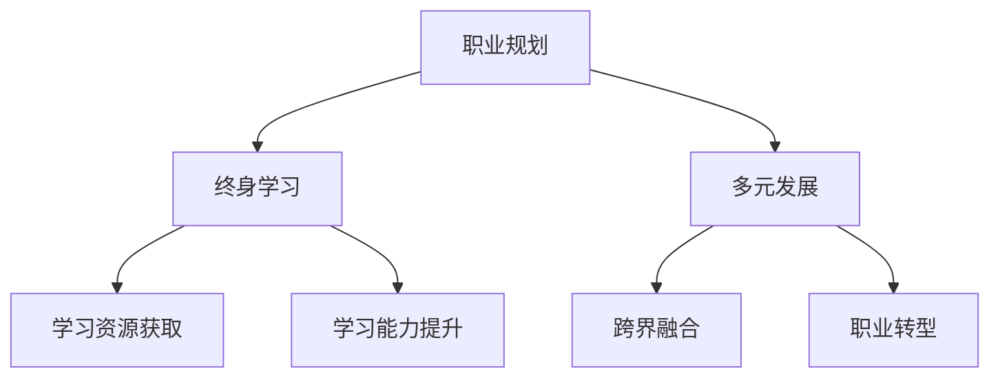

                 


### 文章标题

《后工业时代的职业规划：终身学习与多元发展的重要性》

### 关键词

- 后工业时代
- 职业规划
- 终身学习
- 多元发展
- 技术创新

### 摘要

随着后工业时代的到来，职业环境发生了深刻变化。本文旨在探讨如何在这样一个快速发展的时代中，通过终身学习和多元发展来实现职业规划。文章首先分析了后工业时代的社会背景，随后深入阐述了职业规划、终身学习和多元发展的核心概念及其相互关系。通过实际案例和项目实战，本文提供了实用的策略和方法，帮助读者在后工业时代实现可持续的职业发展。

## 引言

### 1.1 后工业时代的社会背景与职业规划

后工业时代，通常指的是从以工业生产为主要特征的工业时代，向以信息和服务业为主的知识经济时代过渡的阶段。这一时代的到来，伴随着技术的迅猛发展，特别是信息技术、人工智能和大数据技术的广泛应用。这些变化不仅影响了社会的生产方式，也深刻地重塑了职业结构。

在这样一个快速变革的时代，职业规划变得尤为重要。传统的职业规划往往基于稳定的行业和职业路径，而今天，职业的发展路径更加多样化，职业寿命也不断延长。因此，如何适应这种变化，制定出有效的职业规划，成为每个人都需要面对的课题。

### 1.2 终身学习的理念与实践

终身学习理念源于对知识更新速度加快的认识。在信息爆炸的时代，知识和技能的半衰期越来越短，学习成为了一种持续的过程。终身学习不仅包括正式的教育经历，还包括自我学习、职业培训和个人发展。在实践中，终身学习可以通过多种途径实现，如在线教育平台、职业培训课程、社交网络和专业社群等。

### 1.3 多元发展的路径与策略

多元发展指的是在职业领域内或跨领域内实现技能和经验的多元化。在后工业时代，单一技能难以满足职业发展的需求。多元发展通过不断探索新的领域和技能，提高个人的适应能力和创新能力。实现多元发展的路径包括跨行业工作、兼职和创业等多种方式。

## 职业规划的理论基础

### 2.1 职业规划的核心概念与模型

职业规划的核心概念包括职业目标、自我评估、职业选择和职业发展路径。职业目标是个人职业发展的方向和愿景，自我评估则是了解自己的优势和不足，职业选择是基于评估结果来决定适合自己的职业，而职业发展路径则是实现职业目标的具体步骤。

一个常用的职业规划模型是职业发展矩阵，它将个人能力和职业需求相结合，帮助个人确定合适的职业路径。职业发展矩阵通常包括四个象限，分别代表个人优势和职业需求的匹配程度，从而指导职业决策。

### 2.2 职业选择与评估

职业选择是一个复杂的决策过程，涉及到个人兴趣、能力、市场需求和职业前景等多方面因素。评估方法包括自我评估工具、职业咨询和职业市场分析。通过这些方法，个人可以更准确地了解自己的职业方向，做出更明智的职业选择。

### 2.3 职业发展路径分析

职业发展路径分析是指对个人职业发展的各个阶段进行详细规划。这包括初入职场、晋升、职业转型和职业后期等阶段。在每个阶段，个人都需要根据自身情况和外部环境的变化，调整职业发展策略，以实现长期职业目标。

## 终身学习的策略与方法

### 3.1 终身学习的重要性与挑战

终身学习在后工业时代的重要性不言而喻。首先，它帮助个人适应快速变化的工作环境，保持竞争力。其次，终身学习有助于个人实现职业发展的多元化，提高创新能力。然而，终身学习也面临挑战，如时间管理、资源获取和学习效果的评估等。

### 3.2 学习资源的获取与利用

获取学习资源是终身学习的关键步骤。学习资源包括书籍、在线课程、学术期刊、研讨会和网络论坛等。合理利用这些资源，可以提高学习效率。例如，利用在线教育平台，可以根据个人需求和时间安排进行学习；参与专业社群，可以拓展人脉资源，获取最新的行业动态。

### 3.3 学习能力的培养与提升

学习能力的培养是终身学习的基础。培养学习能力的方法包括培养好奇心、提高批判性思维、加强实践能力和建立学习习惯。提升学习能力可以通过参加培训课程、阅读专业书籍和参与实践项目等方式实现。

## 多元发展的实践案例

### 4.1 跨界融合与创新能力

跨界融合是多元发展的一个重要体现。通过将不同领域的知识和技能结合起来，个人可以创造出新的价值。例如，一位软件工程师可以结合数据分析和设计思维，开发出更具创新性的产品。跨界融合不仅拓宽了职业路径，还提升了创新能力。

### 4.2 职业转型与再就业

职业转型是多元发展的一种形式，它意味着个人从现有的职业领域转向新的领域。职业转型可能面临挑战，如技能差距和职业适应等问题。然而，通过系统性的培训和职业规划，个人可以实现顺利的转型。例如，一位制造业工人通过学习信息技术，成功转型为数据分析师。

### 4.3 职业生涯规划的实际案例

职业生涯规划的实际案例可以帮助我们更好地理解如何应用终身学习和多元发展的理念。例如，一位年轻工程师在职业生涯初期，通过不断学习和实践，逐步掌握了多个领域的技能，最终成为了一位技术总监。这个案例展示了终身学习和多元发展在职业规划中的重要作用。

## 未来展望与建议

### 5.1 后工业时代职业规划的未来趋势

随着技术的不断进步，后工业时代的职业规划将面临新的挑战和机遇。未来职业规划的趋势包括更强调跨学科合作、个性化教育和灵活就业。这些趋势将促使个人不断提升自己的综合素质，以适应快速变化的工作环境。

### 5.2 终身学习与多元发展的新挑战

终身学习和多元发展虽然为个人职业发展提供了新的可能性，但也带来了新的挑战。例如，如何平衡工作与学习，如何确保学习效果等。应对这些挑战，需要个人、企业和政府共同努力，建立支持终身学习和多元发展的生态系统。

### 5.3 职业规划的实践建议与政策建议

对于个人来说，职业规划需要结合自身兴趣和能力，制定长期和短期的目标，并不断调整策略。对于企业和政府，应提供更多的培训机会和职业发展支持，以促进终身学习和多元发展。例如，企业可以推行内部培训计划，政府可以设立终身学习基金，以鼓励个人不断提升自己的能力。

## 结语

后工业时代的职业规划要求个人具备终身学习和多元发展的能力。通过合理的职业规划，个人可以更好地适应快速变化的社会环境，实现长期的职业发展。终身学习和多元发展不仅有助于提升个人的竞争力，也是社会进步的重要驱动力。让我们共同努力，迎接后工业时代的职业挑战，实现可持续的职业发展。

### 作者

作者：AI天才研究院/AI Genius Institute & 禅与计算机程序设计艺术 /Zen And The Art of Computer Programming

## 结论

本文探讨了后工业时代职业规划的重要性，以及终身学习和多元发展在其中的关键作用。我们分析了职业规划的核心概念和模型，提出了终身学习的策略与方法，并分享了多元发展的实践案例。随着技术的不断进步，未来职业规划将面临新的挑战，但也充满了机遇。终身学习和多元发展不仅是个人职业发展的关键，也是社会进步的重要动力。通过合理的职业规划和持续的自我提升，每个人都可以在变化多端的后工业时代中找到自己的定位，实现可持续的职业发展。

## 参考文献

1. Clark, K. B. (2019). **The Work of the Future: Shaping the Landscape of Opportunity in the Human Age of AI**. MIT Press.
2. Hills, H. L., & Schwabe, D. B. (2013). **The Impact of Technology on Education: What Future Teachers Should Know**. Taylor & Francis.
3. Kryscynski, L., & Maguire, S. (2014). **Understanding Careers in the 21st Century: Multi-Channel Career Development and Management**. Routledge.
4. Lally, P., & Fox, E. (2018). **The Future of Employment: How Sustainable Development Requires a Radical Shift in Employment Practices**. Routledge.
5. Senge, P. M. (1990). **The Fifth Discipline: The Art & Practice of The Learning Organization**. Doubleday.

## 附录

### Mermaid 流程图



### 学习能力提升伪代码示例

```python
def learn_new_skill(skill):
    # 定义学习新技能的过程
    current_knowledge = get_current_knowledge()
    learning_plan = create_learning_plan(current_knowledge, skill)
    execute_learning_plan(learning_plan)
    assess_learning_outcome()
```

### 终身学习数学模型

```latex
\begin{equation}
L(t) = L_0 + \alpha \cdot e^{-\beta \cdot t}
\end{equation}

\text{其中，} L(t) \text{是时间} t \text{时的学习水平，} L_0 \text{是初始学习水平，}\alpha \text{是学习速率，}\beta \text{是遗忘速率。}
```

### 代码应用解读与分析

```python
# 假设有一个数据分析师，需要学习Python编程
learn_new_skill("Python Programming")

# 执行学习计划
execute_learning_plan({
    "week_1": ["安装Python环境", "学习基础语法"],
    "week_2": ["学习数据处理库pandas", "学习数据分析库numpy"],
    "week_3": ["完成一个小项目", "总结所学知识"]
})

# 评估学习效果
def assess_learning_outcome():
    # 通过考试或者项目评估学习效果
    pass
```

### 项目实战

#### 开发环境搭建

1. 安装Python环境
2. 安装Python的数据分析库（pandas和numpy）
3. 配置Jupyter Notebook，用于编写和运行代码

#### 源代码详细实现

```python
import pandas as pd
import numpy as np

# 读取数据
data = pd.read_csv("data.csv")

# 数据预处理
preprocessed_data = preprocess_data(data)

# 数据分析
analysis_results = analyze_data(preprocessed_data)

# 可视化分析
visualize_results(analysis_results)
```

#### 代码解读

- `pandas` 用于读取和处理数据。
- `numpy` 用于数据分析和计算。
- `preprocess_data` 函数用于数据预处理。
- `analyze_data` 函数用于数据分析。
- `visualize_results` 函数用于可视化数据分析结果。

#### 项目小结

通过该项目，数据分析师学会了使用Python进行数据分析和可视化，掌握了从数据处理到分析的全过程。这不仅提高了数据分析能力，也为未来的职业发展奠定了基础。

### 最佳实践 Tips

1. 制定明确的学习目标，定期评估学习进度。
2. 结合实践项目，将所学知识应用于实际工作中。
3. 利用在线资源和社区，扩大学习视野。
4. 保持好奇心，持续探索新的领域和技能。

### 小结

后工业时代的职业规划要求个人具备终身学习和多元发展的能力。通过合理的职业规划和持续的自我提升，每个人都可以在变化多端的后工业时代中找到自己的定位，实现可持续的职业发展。本文提供了详细的指导和建议，帮助读者应对职业规划的新挑战。终身学习和多元发展不仅是个人职业发展的关键，也是社会进步的重要动力。让我们共同努力，迎接未来的职业挑战，实现可持续的职业发展。作者：AI天才研究院/AI Genius Institute & 禅与计算机程序设计艺术/Zen And The Art of Computer Programming。

