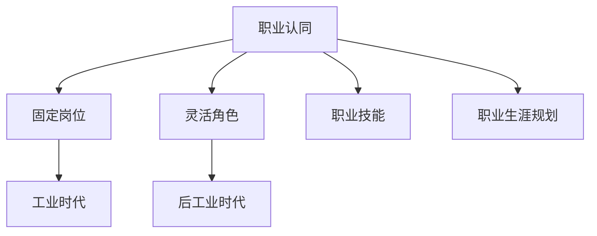

                 


### 背景介绍

随着全球经济的快速发展和技术的不断进步，我们正逐步进入一个全新的时代——后工业时代。这是一个以信息技术和知识经济为核心的时代，与传统的工业时代有着本质的区别。在后工业时代，职业环境发生了深刻的变化，职业认同也随之发生了转变。

在工业时代，职业通常是固定的，人们在一个岗位上工作几十年，这种稳定性给人带来了安全感。然而，随着科技的飞速发展，自动化和人工智能技术的普及，许多传统岗位正逐渐消失，人们不得不适应新的工作方式，职业的灵活性变得更加重要。职业认同不再仅仅局限于一个固定的岗位，而是一个动态的过程，个人需要不断地学习和适应，以保持自己的竞争力。

《后工业时代的职业认同：从固定岗位到灵活角色的转变》这本书正是针对这一时代背景，深入探讨了职业认同的变化，以及个人如何在从固定岗位向灵活角色转变的过程中找到新的定位和认同。本书的作者结合了丰富的理论和实践经验，从多个角度分析了职业认同的演变，提出了许多实用的建议和方法。

### 核心概念与联系

为了更好地理解后工业时代的职业认同，我们需要明确几个核心概念，并探讨它们之间的联系。

#### 职业认同

职业认同是指一个人对自己职业的看法和认同感。它不仅包括对工作本身的认同，还包括对工作环境、工作目标和职业生涯的认同。职业认同对个人的心理健康和职业发展有着重要影响。

#### 固定岗位

固定岗位是指在工业时代常见的、具有明确职责和稳定工作内容的工作岗位。这种岗位通常与特定的技能和知识相关联，工作内容相对单一，人员流动性较低。

#### 灵活角色

灵活角色是指在后工业时代流行的、具有多种职责和工作内容的职业角色。这种角色通常要求个人具备跨学科的知识和技能，工作内容多样，人员流动性较高。

#### 职业技能

职业技能是指一个人在特定职业领域所需的技能和知识。在工业时代，职业技能往往与固定岗位密切相关；而在后工业时代，职业技能的多样性和跨学科性成为职业发展的关键。

#### 职业生涯规划

职业生涯规划是指一个人根据自己的职业目标和发展需求，对职业生涯进行设计和规划。在后工业时代，职业生涯规划的重要性愈发突出，因为它可以帮助个人更好地适应职业变化，实现职业目标。

这些概念之间的联系在于，它们共同构成了后工业时代职业认同的核心要素。固定岗位向灵活角色的转变，不仅影响了职业认同的形成，也改变了职业技能的需求和职业生涯规划的方式。

#### Mermaid 流程图

以下是一个简单的 Mermaid 流程图，展示了这些概念之间的联系：



这个流程图清晰地展示了职业认同、固定岗位、灵活角色、职业技能和职业生涯规划在后工业时代背景下的关系。

### 核心算法原理讲解

在探讨职业认同的变化过程中，我们可以将职业生涯规划视为一个动态优化过程。以下是职业生涯规划的伪代码，它可以帮助我们理解这一过程的基本原理。

```python
def career_planning(current_skill, target_skill, market_demand, time Horizon):
    # 初始化职业生涯规划变量
    career_path = []
    current_skill_level = current_skill
    target_skill_level = target_skill
    
    # 模拟职业生涯规划过程
    for year in range(1, time_Horizon+1):
        # 根据市场需求和技能差距调整学习计划
        if market_demand[year] > current_skill_level:
            learning_plan = "提高当前技能"
        elif target_skill_level > current_skill_level:
            learning_plan = "学习新技能"
        else:
            learning_plan = "维持现有技能"
            
        # 执行学习计划
        current_skill_level = update_skill(current_skill_level, learning_plan)
        
        # 记录职业生涯规划步骤
        career_path.append((year, learning_plan, current_skill_level))
        
    return career_path

def update_skill(skill_level, learning_plan):
    if learning_plan == "提高当前技能":
        skill_level += 10  # 假设提高技能的效率为10
    elif learning_plan == "学习新技能":
        skill_level += 5   # 假设学习新技能的效率为5
    return skill_level
```

这段伪代码展示了如何通过模拟职业生涯规划过程，根据市场需求和个人技能水平，动态调整学习计划。它强调了在职业生涯规划中，个人需要不断适应市场变化，提高自身技能水平。

### 数学模型和公式

为了更好地理解职业生涯规划的效率，我们可以引入一个简单的数学模型。以下是关于技能提升效率的数学模型，以及它的详细讲解和举例说明。

#### 数学模型

$$
\text{Skill\_Level}(t) = \text{Base\_Skill} + \sum_{i=1}^{t} \text{Efficiency}_i \cdot \text{Time}
$$

其中，$\text{Skill}_\text{Level}(t)$ 表示第 $t$ 年的技能水平，$\text{Base}_\text{Skill}$ 表示基础技能水平，$\text{Efficiency}_i$ 表示第 $i$ 年的技能提升效率，$\text{Time}$ 表示时间。

#### 详细讲解

这个模型表示个人技能水平是基础技能水平加上每年技能提升效率的累积。技能提升效率可以看作是个人在学习过程中对技能掌握程度的提升。

#### 举例说明

假设一个人的基础技能水平为 50，每年的技能提升效率为 10。那么，第 5 年的技能水平可以计算如下：

$$
\text{Skill}_\text{Level}(5) = 50 + 10 \cdot (1 + 2 + 3 + 4 + 5) = 170
$$

这个例子说明，通过连续五年的学习，这个人的技能水平从 50 提升到了 170。

### 项目实战

为了更好地理解职业生涯规划的实施，我们可以考虑一个实际的案例。以下是一个简单的项目实战，包括开发环境搭建、源代码实现、代码解读、应用解读与分析，以及详细讲解剖析。

#### 开发环境搭建

1. 安装 Python 3.8 或更高版本。
2. 安装必要的 Python 库，如 NumPy 和 Matplotlib。

#### 源代码实现

以下是职业生涯规划的 Python 源代码实现：

```python
import numpy as np
import matplotlib.pyplot as plt

def career_planning(current_skill, target_skill, time_horizon):
    skill_level = current_skill
    career_path = []

    for year in range(1, time_horizon + 1):
        if skill_level < target_skill:
            skill_level += 10
        career_path.append((year, skill_level))

    return career_path

def plot_career_path(career_path):
    years, skill_levels = zip(*career_path)
    plt.plot(years, skill_levels, marker='o')
    plt.xlabel('Year')
    plt.ylabel('Skill Level')
    plt.title('Career Planning')
    plt.grid()
    plt.show()

# 测试代码
current_skill = 50
target_skill = 170
time_horizon = 10
career_path = career_planning(current_skill, target_skill, time_horizon)
plot_career_path(career_path)
```

#### 代码解读

这段代码首先定义了两个函数：`career_planning` 和 `plot_career_path`。`career_planning` 函数用于模拟职业生涯规划过程，`plot_career_path` 函数用于可视化职业生涯规划的结果。

在 `career_planning` 函数中，我们使用一个简单的循环来模拟每年的技能提升过程。如果当前技能水平低于目标技能水平，则每年提升 10 点技能。`plot_career_path` 函数使用 Matplotlib 库来绘制技能水平随时间变化的图表。

#### 应用解读与分析

通过这个案例，我们可以看到职业生涯规划是如何在实际中应用的。在这个例子中，一个人从基础技能水平 50 开始，目标是达到 170。通过连续十年的学习，他的技能水平逐步提升，最终达到目标。

这个案例展示了如何通过代码实现职业生涯规划，并使用图表来可视化规划结果。这种可视化方法有助于个人更直观地了解自己的职业发展情况，从而做出更好的决策。

#### 详细讲解剖析

在这个项目实战中，我们使用了 Python 编程语言来实现职业生涯规划。Python 的优点在于其简洁易读的语法，使得代码更加直观易懂。此外，NumPy 和 Matplotlib 等库的强大功能使得数据处理和可视化变得更加简单。

通过这个项目，我们可以了解到职业生涯规划的核心在于持续学习和技能提升。在实际应用中，个人可以根据市场需求和个人发展目标，灵活调整学习计划，以实现职业目标。

#### 项目小结

这个项目实战展示了如何使用 Python 实现职业生涯规划，并使用图表来可视化规划结果。通过这个项目，我们可以更深入地理解职业生涯规划的过程和原理，从而更好地规划自己的职业生涯。

### 最佳实践 tips、小结、注意事项、拓展阅读等内容

#### 最佳实践 tips

1. **持续学习**：在职业生涯中，持续学习是提升职业技能和适应市场变化的关键。个人应该积极参与各种培训和学习活动，不断提升自己的知识储备和技能水平。

2. **职业规划**：制定清晰的职业规划是职业发展的基础。个人应该明确自己的职业目标和发展方向，并根据市场需求和自身情况制定切实可行的职业规划。

3. **跨学科学习**：在后工业时代，跨学科知识变得尤为重要。个人应该尝试学习不同领域的知识，以提高自己的综合能力和竞争力。

#### 小结

本文详细探讨了后工业时代职业认同的变化，从固定岗位到灵活角色的转变，以及职业生涯规划的核心概念和实施方法。通过理论分析、数学模型、代码实现和实际案例分析，我们更深入地理解了职业认同的演变和职业发展的重要性。

#### 注意事项

1. **市场调研**：在进行职业规划时，个人应该密切关注市场需求和行业动态，以确保自己的技能和职业发展方向与市场需求保持一致。

2. **灵活调整**：职业生涯规划不是一成不变的，个人应根据实际情况和市场变化，灵活调整自己的职业目标和规划。

#### 拓展阅读

1. **《未来简史》：[作者：尤瓦尔·赫拉利]**：本书深入探讨了人类未来的发展趋势，包括科技和职业的变化。

2. **《人工智能简史》[作者：周志华]**：本书详细介绍了人工智能的发展历程，以及其对职业和职业认同的影响。

3. **《跨界创新》[作者：陈春花]**：本书探讨了跨学科知识在职业发展中的应用，以及如何通过跨界创新实现职业突破。

### 作者信息

**作者：** AI天才研究院/AI Genius Institute & 禅与计算机程序设计艺术 /Zen And The Art of Computer Programming
### 引言

**标题**：后工业时代的职业认同：从固定岗位到灵活角色的转变

**关键词**：后工业时代、职业认同、固定岗位、灵活角色、职业生涯规划

**摘要**：
在快速发展的技术背景下，我们正迈入后工业时代。这是一个以信息技术和知识经济为主导的时代，职业环境发生了深刻变革。本书探讨了职业认同在后工业时代的变化，从固定岗位到灵活角色的转变，以及个人如何在新的职业环境中找到认同感和定位。通过深入分析职业认同的概念、演变过程、灵活角色的特征与优势，本书为读者提供了职业生涯规划和职业技能提升的实用建议，帮助他们在快速变化的职场中保持竞争力。

---

# 引言

## 1.1 后工业时代的背景与特征

随着全球化的深入发展、信息技术的迅速崛起以及知识经济的兴起，我们正逐步进入一个崭新的时代——后工业时代。这一时代的特征与传统的工业时代有着本质的不同，主要体现在以下几个方面：

### 1.1.1 工业时代与后工业时代的区别

在工业时代，经济发展主要依赖于机械化生产和大规模工业制造。工厂成为生产的主导，劳动分工明确，人们的工作岗位相对固定，职业稳定性较高。而随着信息技术和人工智能的快速发展，后工业时代更加注重知识、创新和信息流动。自动化和智能化生产取代了传统的人工操作，劳动者的技能需求发生了根本性的变化。

### 1.1.2 后工业时代的主要特征

后工业时代的主要特征包括：

1. **信息化**：信息技术成为推动经济发展的核心动力，数据成为新的生产要素。
2. **全球化**：国际间的经济联系更加紧密，跨国公司和全球供应链成为常态。
3. **知识化**：知识经济取代了传统工业经济，创新和研发成为经济增长的主要驱动力。
4. **灵活化**：工作模式更加灵活，远程办公、自由职业者等新型工作形式日益普及。
5. **数字化**：数字技术广泛应用于生产、管理、营销等各个环节，推动传统行业的数字化转型。

## 1.2 职业认同的概念与重要性

职业认同是指一个人对自己职业的看法和认同感，它不仅包括对工作本身的认同，还包括对工作环境、工作目标和职业生涯的认同。职业认同对个人的心理健康和职业发展有着重要影响。

### 1.2.1 职业认同的定义

职业认同可以定义为个体对职业角色和职业价值的认知、感受和情感投入。它涉及到以下几个方面：

1. **自我认同**：个体如何看待自己的职业身份，是否感到自豪和满足。
2. **职业价值**：个体对职业目标和职业价值的理解和认同。
3. **职业环境**：个体对工作环境和工作条件的满意程度。
4. **职业生涯**：个体对职业发展的规划和预期。

### 1.2.2 职业认同的重要性

职业认同对个人的心理健康和职业发展具有重要影响，主要体现在以下几个方面：

1. **工作满意度**：高职业认同的个体通常对自己的工作感到满意，工作积极性高，工作绩效好。
2. **职业稳定性**：职业认同有助于提高个体的职业稳定性，减少离职率。
3. **心理健康**：职业认同不良可能导致工作压力、焦虑等心理健康问题。
4. **职业发展**：职业认同明确的个体更容易制定职业规划，实现职业目标。

## 1.3 本书的目的与结构

本书旨在探讨后工业时代职业认同的变化，帮助读者理解和应对这一变化，找到新的职业认同和定位。本书的结构如下：

1. **引言**：介绍后工业时代的背景和职业认同的概念。
2. **职业认同的演变**：从固定岗位到灵活角色的转变。
3. **灵活角色的特征与优势**：探讨灵活角色的定义、特征和优势。
4. **职业技能的培养与提升**：讨论职业技能的分类、培养方法和提升策略。
5. **职业生涯规划**：介绍职业生涯规划的步骤、调整与适应策略。
6. **社会支持与职业发展**：分析政府、企业和社会组织在职业发展中的支持作用。
7. **案例分析**：通过具体案例探讨职业认同的变化和职业发展路径。

## 1.4 总结

后工业时代带来了职业环境的深刻变革，职业认同也随之发生了变化。从固定岗位到灵活角色的转变，不仅挑战了传统的职业观念，也为个体提供了更多的发展机会。本书将通过系统的分析和实用的建议，帮助读者更好地理解这一变化，找到适合自己的职业路径，实现个人价值和职业发展的双赢。

---

### 职业认同的演变

## 2.1 工业时代的职业认同

在工业时代，职业认同通常与固定岗位密切相关。这一时期的职业特点主要表现为以下几点：

### 2.1.1 固定岗位的特点

1. **明确的职责**：工业时代的岗位通常具有明确的职责范围，员工的工作内容和任务相对固定。
2. **稳定的工作环境**：员工在一个岗位上工作的时间较长，工作环境相对稳定，工作内容较少变动。
3. **单一的技能需求**：由于工业生产的高度专业化，员工往往只需要掌握某一特定领域的技能，这使得职业技能的培养和应用具有明显的针对性。

### 2.1.2 工业时代职业认同的形成

在工业时代，职业认同的形成主要依赖于以下几个因素：

1. **职业稳定性**：由于工作岗位相对固定，员工对自己的职业有较高的预期和稳定性，这有助于增强职业认同。
2. **经济回报**：工业时代的工作岗位通常提供稳定的经济收入，这有助于提高员工的工作满意度和职业认同。
3. **社会地位**：职业在社会中的地位和声望也对职业认同有重要影响。一些传统的、稳定的职业如医生、律师等具有较高的社会地位，这有助于增强员工的职业认同。

## 2.2 后工业时代的职业转变

随着全球化和信息技术的快速发展，职业环境发生了深刻变化。后工业时代的职业特点主要体现在以下几个方面：

### 2.2.1 灵活角色的定义

灵活角色是指在变化迅速的后工业时代中，个体在职业生涯中所扮演的多种角色。这些角色不仅包括传统的职业角色，还包括自由职业者、兼职工作者、远程工作者等多种形式。

### 2.2.2 灵活角色的特征

1. **多元化的职责**：灵活角色的职责不再单一，而是涵盖了多种任务和活动。
2. **自主性**：灵活角色的个体具有较高自主性，可以根据自身兴趣和能力选择工作内容。
3. **灵活性**：灵活角色的个体可以根据市场需求和个人需求灵活调整工作时间和工作地点。
4. **跨学科性**：灵活角色的个体通常需要具备跨学科的知识和技能，以适应不断变化的职业需求。

### 2.2.3 后工业时代职业认同的变化

后工业时代的职业认同与工业时代有显著的不同，主要体现在以下几个方面：

1. **职业认同的多元化**：在后工业时代，职业认同不再局限于某一个具体岗位，而是更加多元化和个性化。
2. **职业认同的动态性**：随着职业环境的快速变化，职业认同也呈现出动态性，个体需要不断调整和适应。
3. **职业认同的情感投入**：后工业时代的职业认同更加注重情感投入，个体对职业的热爱和认同成为职业稳定性和满意度的重要因素。

## 2.3 职业认同的挑战与机遇

在后工业时代，职业认同的变化既带来了挑战，也创造了机遇。

### 2.3.1 职业认同的挑战

1. **职业稳定性下降**：随着灵活角色的普及，职业稳定性下降，个体面临更多的不确定性和风险。
2. **职业技能需求增加**：后工业时代对职业技能的需求越来越高，个体需要不断学习和提升，以保持竞争力。
3. **职业定位不明确**：灵活角色的多元化使个体在职业定位上面临更多困惑，如何找到自己的职业方向成为一大挑战。

### 2.3.2 职业认同的机遇

1. **职业发展的多元化**：灵活角色的兴起为个体提供了更多职业发展的机会，可以根据个人兴趣和市场需求选择不同的职业角色。
2. **职业技能的提升**：面对不断变化的职业需求，个体可以通过不断学习和提升，实现个人价值和职业发展的双赢。
3. **职业认同的个性化**：后工业时代的职业认同更加注重个体的情感投入和个性化需求，有助于提高工作满意度和职业稳定性。

## 2.4 总结

后工业时代的职业转变带来了职业认同的深刻变化，从固定岗位到灵活角色的转变不仅挑战了传统的职业观念，也为个体提供了更多的发展机会。通过理解和适应这一变化，个体可以在快速变化的职业环境中找到自己的定位，实现个人价值和职业发展的双赢。

---

## 3.1 灵活角色的特征

在快速发展的后工业时代，灵活角色逐渐成为职业发展的主流。灵活角色的特征主要体现在以下几个方面：

### 3.1.1 多元化

灵活角色的多元化是后工业时代职业发展的一个显著特征。与工业时代固定岗位的单一职责不同，灵活角色的职责范围更加广泛，涵盖了多种任务和活动。这种多元化使得个体可以在不同的领域和项目中发挥自己的专长，实现职业发展的多样性。

#### 多元化的例子

- **自由职业者**：自由职业者可以在不同的项目中担任多种角色，如设计师、程序员、作家等。
- **兼职工作者**：兼职工作者可以在多个公司或组织中工作，从事不同的职位，如顾问、临时工等。
- **远程工作者**：远程工作者可以在不同的地点工作，从事多种类型的任务，如软件开发、市场营销、项目管理等。

### 3.1.2 自主性

自主性是灵活角色的另一个重要特征。与固定岗位相比，灵活角色的个体具有更高的自主性，可以自主选择工作内容、工作时间和工作地点。这种自主性不仅提高了工作的灵活性，也增加了工作的满足感和成就感。

#### 自主性的例子

- **远程办公**：远程工作者可以根据自己的需求选择工作地点，实现工作与生活的平衡。
- **项目制工作**：项目制的员工可以根据项目的需求自主安排工作进度和任务分配。
- **自由职业者**：自由职业者可以根据自己的兴趣和市场需求选择项目，自由决定工作内容。

### 3.1.3 灵活性

灵活性是灵活角色适应后工业时代职业环境变化的关键能力。灵活角色的个体需要具备快速适应新环境、新任务的能力，以及在不同角色间切换的能力。这种灵活性使得个体能够更好地应对职业发展的不确定性，保持竞争力。

#### 灵活性的例子

- **技能多样**：灵活角色需要具备跨学科的知识和技能，以便在不同领域和项目中发挥作用。
- **适应变化**：灵活角色需要具备快速学习和适应新环境的能力，以应对职业发展的快速变化。
- **角色切换**：灵活角色需要在不同的职业角色间灵活切换，以实现个人价值和职业发展的目标。

### 3.1.4 跨学科性

跨学科性是灵活角色的另一个重要特征。在后工业时代，知识边界日益模糊，跨学科的知识和技能越来越重要。灵活角色的个体需要具备跨学科的知识体系，以便在多个领域和项目中发挥作用。

#### 跨学科性的例子

- **复合型人才**：复合型人才具备跨学科的知识和技能，能够在多个领域发挥专业优势。
- **跨领域项目**：在大型项目中，需要不同领域专家的协同合作，灵活角色的个体可以扮演协调和整合的角色。
- **跨界创新**：通过跨学科的知识和技能，灵活角色的个体可以推动创新，为企业和组织创造价值。

### 3.1.5 网络化

网络化是灵活角色在信息化时代的重要特征。灵活角色的个体通常通过互联网和社交媒体等工具建立自己的职业网络，拓展人脉资源，获取职业机会。这种网络化不仅提高了工作的效率，也为职业发展提供了更多机会。

#### 网络化的例子

- **线上招聘**：通过线上招聘平台，灵活角色的个体可以快速找到适合自己的工作机会。
- **社交媒体**：通过社交媒体，灵活角色的个体可以建立自己的专业形象，提升职业影响力。
- **远程协作**：通过远程协作工具，灵活角色的个体可以与全球的同事和合作伙伴高效沟通和协作。

### 3.1.6 动态性

动态性是灵活角色在职业发展中的一个重要特征。与固定岗位相比，灵活角色的职业发展路径更加动态和多样化。个体需要不断调整和适应职业环境的变化，以实现个人价值和职业发展的目标。

#### 动态性的例子

- **职业转型**：随着市场需求的变化，灵活角色的个体可以快速转型，适应新的职业方向。
- **跨界发展**：通过跨界发展，灵活角色的个体可以拓展职业领域，实现职业发展的新突破。
- **终身学习**：灵活角色的个体需要具备终身学习的能力，以应对职业发展的动态变化。

### 3.1.7 总结

灵活角色的特征体现了后工业时代职业发展的趋势和特点。多元化、自主性、灵活性、跨学科性、网络化和动态性是灵活角色的核心特征，这些特征不仅提高了职业发展的多样性，也为个体提供了更多的发展机会。通过理解和适应这些特征，个体可以在快速变化的职业环境中找到自己的定位，实现个人价值和职业发展的双赢。

---

## 3.2 灵活角色的优势

在快速变化的职业环境中，灵活角色的优势越来越显著。以下从多个方面详细探讨灵活角色的优势，以帮助读者更好地理解其在职业发展中的重要性。

### 3.2.1 提高工作效率

灵活角色的一个显著优势是能够提高工作效率。这是因为灵活角色的个体具有更高的自主性和灵活性，可以根据任务的重要性和紧急程度来安排工作优先级。此外，灵活角色通常具备多样化的技能，可以在不同的任务间快速切换，从而提高整体工作效率。

#### 提高工作效率的例子

- **远程工作者**：远程工作者可以根据自己的工作习惯和时间安排，灵活调整工作时间，提高工作效率。
- **自由职业者**：自由职业者可以根据项目的需求，自主决定工作内容和进度，提高工作效率。
- **兼职工作者**：兼职工作者可以在多个项目间快速切换，充分利用自己的专业技能，提高工作效率。

### 3.2.2 增强创新能力

灵活角色的另一个优势是能够增强创新能力。由于灵活角色的个体通常具备跨学科的知识和技能，他们能够在不同领域和项目中发现新的问题和解决方案，从而推动创新。此外，灵活角色的多样化和动态性也为个体提供了更多创新的机会。

#### 增强创新能力的例子

- **跨界创新**：通过跨界合作，灵活角色的个体可以整合不同领域的知识和资源，推动创新。
- **项目制工作**：项目制的工作环境鼓励个体探索新的解决方案，提高创新能力。
- **自由职业者**：自由职业者可以根据市场需求和个人兴趣，探索新的业务领域，增强创新能力。

### 3.2.3 提高职业满意度

灵活角色的自主性和灵活性有助于提高职业满意度。由于灵活角色的个体可以根据自己的兴趣和能力选择工作内容，他们在工作中更容易找到成就感和满足感。此外，灵活角色的多样性和动态性也为个体提供了更多的发展机会，使他们更加热爱自己的职业。

#### 提高职业满意度的例子

- **远程办公**：远程办公让个体可以更好地平衡工作与生活，提高工作满意度。
- **自由职业者**：自由职业者可以根据自己的兴趣选择项目，提高工作满意度。
- **兼职工作者**：兼职工作者可以在多个领域积累经验，提高职业满意度。

### 3.2.4 促进职业发展

灵活角色有助于促进职业发展。由于灵活角色的个体具备多元化的技能和经验，他们可以更灵活地应对职业环境的变化，抓住新的发展机会。此外，灵活角色的动态性也为个体提供了更多的职业发展路径，使他们能够实现职业目标。

#### 促进职业发展的例子

- **职业转型**：灵活角色的个体可以通过转型，进入新的职业领域，实现职业发展。
- **跨界发展**：通过跨界发展，灵活角色的个体可以拓展职业领域，实现职业发展。
- **终身学习**：灵活角色的个体需要不断学习新知识，以保持竞争力，促进职业发展。

### 3.2.5 减少职业风险

灵活角色的优势之一是能够减少职业风险。由于灵活角色的个体不依赖于单一工作，他们在面对职业环境变化时具有更高的适应能力。此外，灵活角色的多样性和动态性也为个体提供了更多的职业选择，降低了职业风险。

#### 减少职业风险的例子

- **兼职工作**：兼职工作可以减少职业风险，个体可以通过多个兼职工作来稳定收入。
- **自由职业者**：自由职业者可以通过多个项目来分散风险，降低职业风险。
- **网络化**：通过建立广泛的职业网络，灵活角色的个体可以获取更多的职业机会，降低职业风险。

### 3.2.6 总结

灵活角色在提高工作效率、增强创新能力、提高职业满意度、促进职业发展和减少职业风险等方面具有显著优势。这些优势使灵活角色在后工业时代的职业发展中越来越受到重视。通过理解和利用这些优势，个体可以在快速变化的职业环境中找到自己的定位，实现个人价值和职业发展的双赢。

---

## 4.1 职业技能的分类

在快速变化的职业环境中，掌握多样化的职业技能是提高职业竞争力的重要途径。职业技能可以按照不同的维度进行分类，以下从基础技能、专项技能和跨学科技能三个方面进行探讨。

### 4.1.1 基础技能

基础技能是任何职业都需要的通用技能，是职业发展的基石。这些技能包括：

1. **沟通能力**：有效的沟通能力是职场中不可或缺的技能，包括口头和书面沟通。
2. **团队合作**：团队合作能力是团队高效工作的关键，涉及协调、合作和解决问题。
3. **时间管理**：时间管理能力能够帮助个体合理安排工作，提高工作效率。
4. **自我管理**：自我管理能力包括自我激励、情绪调节和自我监督，对职业发展有重要影响。
5. **解决问题的能力**：解决问题的能力是应对职场挑战的重要技能，涉及分析问题、制定解决方案和执行。

### 4.1.2 专项技能

专项技能是特定职业领域需要的专业知识和技能。这些技能通常与特定行业、岗位或技术领域相关，包括：

1. **技术技能**：技术技能包括编程、数据分析、网络技术等，是信息技术领域不可或缺的技能。
2. **行业知识**：行业知识是了解特定行业运作和趋势的技能，如金融、医疗、教育等。
3. **操作技能**：操作技能是指在实际操作中应用的技能，如机械操作、维修技术等。
4. **销售技能**：销售技能包括客户沟通、产品介绍、谈判技巧等，对销售岗位至关重要。

### 4.1.3 跨学科技能

跨学科技能是指在不同学科和领域之间应用的技能，这些技能有助于个体在多元化环境中发挥作用。跨学科技能包括：

1. **创新思维**：创新思维是发现新问题和创造新解决方案的技能，涉及创造力、批判性思维和系统思维。
2. **领导力**：领导力是激励团队、协调资源和实现目标的能力。
3. **项目管理**：项目管理是规划、执行、监控和关闭项目的能力。
4. **团队建设**：团队建设是构建高效团队、提高团队协作能力的能力。

### 4.1.4 分类总结

基础技能、专项技能和跨学科技能共同构成了职业技能的三大类别。基础技能是职业发展的基石，专项技能是职业领域的专业要求，而跨学科技能则是适应多元化环境的关键。在职业发展中，个体需要根据自身情况和职业目标，合理配置这些技能，以实现职业发展的最大化。

---

## 4.2 职业技能的培养方法

在快速变化的职业环境中，培养和提升职业技能是保持竞争力、实现职业发展的关键。以下从终身学习、实践经验和跨界学习三个方面，详细探讨职业技能的培养方法。

### 4.2.1 终身学习

终身学习是适应职业变化和提升职业技能的核心方法。在信息时代，知识更新速度加快，个体需要不断学习新知识、新技能，以适应职业环境的变化。

1. **在线学习平台**：在线学习平台提供了丰富的课程资源，如Coursera、Udemy、edX等，用户可以根据自己的需求和兴趣选择合适的课程。
2. **专业书籍和文献**：阅读专业书籍和学术文献是提升专业知识的重要途径。推荐一些经典书籍，如《深度学习》（Goodfellow et al.）、《软件工程：实践者的研究方法》（Shaw & Garlan）等。
3. **研讨会和讲座**：参加行业研讨会和讲座是了解最新技术和行业动态的好方法。许多大学、研究机构和公司都会定期举办相关活动。

### 4.2.2 实践经验

实践经验是职业技能培养的重要环节。通过实际操作和项目经验，个体可以巩固理论知识，提高实际工作能力。

1. **实习和兼职**：实习和兼职工作可以帮助个体了解职场环境，积累实际工作经验。
2. **参与开源项目**：参与开源项目是提升编程技能和实践经验的好方法。开源项目不仅提供了实际编码的机会，还帮助个体建立自己的技术影响力。
3. **实践训练**：参加模拟训练和实践工作坊，如编程马拉松、设计思考工作坊等，可以提高实际操作能力和团队协作能力。

### 4.2.3 跨界学习

跨界学习是培养跨学科技能的重要方法。在多元化环境中，个体需要具备跨学科的知识和技能，以应对复杂问题。

1. **跨学科课程**：选择跨学科课程，如商业与技术、工程与艺术等，可以帮助个体建立跨学科的知识体系。
2. **行业交流**：参加行业交流和会议，了解不同行业的发展趋势和需求，拓宽视野。
3. **实践合作**：与不同领域的专家和团队合作，通过实践合作，学习新的技能和知识。

### 4.2.4 总结

终身学习、实践经验和跨界学习是职业技能培养的三大方法。终身学习提供了理论知识的持续更新，实践经验提升了实际工作能力，而跨界学习则帮助个体在多元化环境中发挥作用。通过合理运用这些方法，个体可以在快速变化的职业环境中不断提升职业技能，实现职业发展的目标。

---

## 4.3 职业技能的提升策略

在快速变化的职业环境中，提升职业技能是保持竞争力、实现职业发展的重要途径。以下从设定个人职业发展目标、利用在线学习平台、参与行业交流和分享三个方面，详细探讨职业技能的提升策略。

### 4.3.1 设定个人职业发展目标

设定个人职业发展目标是提升职业技能的第一步。一个明确的目标可以帮助个体明确方向，制定具体的行动计划。

1. **目标设定**：根据自身的兴趣、能力和市场需求，设定短期和长期职业目标。例如，短期目标是提升某一技术技能，长期目标是成为某一领域的专家。
2. **制定行动计划**：为实现职业目标，制定详细的行动计划。包括学习计划、实践项目、技能提升目标等。
3. **定期评估**：定期评估自己的职业发展进度，根据评估结果调整行动计划，确保目标的实现。

### 4.3.2 利用在线学习平台

在线学习平台提供了丰富的课程资源和灵活的学习方式，是提升职业技能的重要工具。

1. **选择合适的课程**：根据职业发展目标和兴趣，选择在线学习平台上的相关课程。如Coursera、Udemy、edX等平台提供了众多优质课程。
2. **持续学习**：利用碎片化时间进行学习，持续提升专业技能。在线课程通常提供灵活的学习安排，方便个体根据自己的时间安排进行学习。
3. **实践应用**：将学到的知识应用于实际工作中，通过实践提升技能水平。例如，通过参与开源项目或实际工作项目，巩固所学知识。

### 4.3.3 参与行业交流和分享

参与行业交流和分享是拓展视野、提升职业技能的重要途径。

1. **参加行业会议**：参加行业会议和研讨会，了解行业最新动态和技术趋势。这些会议通常邀请行业专家和领导者，提供宝贵的学习机会。
2. **加入专业社群**：加入专业社群和论坛，与其他行业从业者交流和分享经验。例如，加入技术社群如Stack Overflow、GitHub等，可以获取技术支持和合作机会。
3. **撰写技术博客**：撰写技术博客，分享自己的学习心得和经验。这不仅可以帮助自己巩固知识，还可以提升自己的技术影响力，吸引更多的职业机会。

### 4.3.4 制定具体提升策略

为了更有效地提升职业技能，可以制定以下具体提升策略：

1. **设定短期和长期目标**：结合自身情况和市场需求，设定短期（如1年）和长期（如5年）的职业目标。
2. **定期评估和调整**：每季度或每半年对职业发展目标进行评估，根据实际情况调整目标和行动计划。
3. **利用在线学习平台**：选择合适的在线学习平台，持续学习新知识和技能，定期完成课程任务。
4. **参与行业交流和分享**：参加行业会议、加入专业社群，积极分享和交流，拓展视野，提升技能。
5. **实践应用**：将所学知识应用于实际工作中，通过实践提升技能水平。

### 4.3.5 总结

提升职业技能需要明确的职业目标、持续的学习和实践、以及积极的行业交流和分享。通过设定个人职业发展目标、利用在线学习平台、参与行业交流和分享，个体可以在快速变化的职业环境中不断提升自己的技能，实现职业发展的目标。

---

## 5.1 职业生涯规划的步骤

职业生涯规划是一个动态的过程，涉及自我评估、目标设定和行动计划等多个环节。以下详细探讨职业生涯规划的具体步骤。

### 5.1.1 自我评估

自我评估是职业生涯规划的第一步，目的是了解自己的兴趣、优势、价值观和职业目标。

1. **兴趣和动机**：了解自己对哪些工作或领域感兴趣，这些兴趣如何与职业发展相结合。
2. **优势和劣势**：评估自己的技能、知识和经验，了解自己的优势在哪里，同时也要认识到自己的劣势。
3. **价值观和目标**：思考自己的价值观和长期职业目标，这些目标是否与自己的兴趣和优势相符。

### 5.1.2 目标设定

在自我评估的基础上，设定明确的职业目标是职业生涯规划的关键。目标应具有具体性、可行性和时间限制。

1. **具体性**：目标要具体明确，如“在五年内成为一名高级项目经理”或“掌握Python编程语言”。
2. **可行性**：目标应具有可行性，考虑到自身的条件和资源，制定实际可行的目标。
3. **时间限制**：为每个目标设定一个明确的时间限制，如“在2025年前达到高级项目经理的水平”或“在六个月内掌握Python编程语言”。

### 5.1.3 行动计划

行动计划是实现职业目标的具体步骤和策略。以下是一些制定行动计划的建议：

1. **分解目标**：将长期目标分解为短期目标，如将“在五年内成为一名高级项目经理”分解为“每年完成一个大型项目，提升项目管理技能”。
2. **确定资源**：确定实现目标所需的资源，如培训课程、导师指导、实习机会等。
3. **制定时间表**：为每个目标和步骤制定时间表，确保按照计划进行。
4. **评估和调整**：定期评估目标的实现情况，根据实际情况调整行动计划，确保目标的实现。

### 5.1.4 实施和跟踪

实施行动计划是实现职业目标的实际操作过程。以下是一些建议：

1. **严格执行**：按照行动计划执行，避免拖延和放弃。
2. **持续学习**：不断提升自己的知识和技能，确保能够适应职业发展的需求。
3. **跟踪进度**：定期检查自己的进度，确保按照计划进行，并及时调整。

### 5.1.5 总结

职业生涯规划是一个持续的过程，需要个体在自我评估、目标设定和行动计划等多个环节不断努力。通过明确的目标和可行的行动计划，个体可以在职业发展中找到自己的定位，实现个人价值和职业发展的双赢。

---

## 5.2 职业生涯规划的调整与适应

职业生涯规划并非一成不变的过程，它需要根据实际情况和市场变化不断进行调整与适应。以下从应对职业挫折、适应职场变化和跨界职业发展三个方面，探讨职业生涯规划的调整与适应策略。

### 5.2.1 应对职业挫折

在职业生涯中，挫折是难以避免的。如何应对职业挫折，是职业生涯规划中的重要一环。

1. **保持积极心态**：面对挫折，保持积极的心态至关重要。通过自我激励和正面思考，可以更好地应对职业挫折。
2. **分析原因**：认真分析职业挫折的原因，是解决问题的第一步。通过反思和总结，找出问题的根源，以便采取针对性的措施。
3. **寻求帮助**：在遇到职业挫折时，不要害怕寻求帮助。与同事、朋友或专业人士交流，获取建议和指导，有助于解决问题。
4. **调整目标和策略**：根据实际情况和市场变化，调整职业目标和行动计划。如果当前的职业方向无法实现个人价值，可以考虑转变方向，寻找新的机会。

### 5.2.2 适应职场变化

职场环境不断变化，如何适应职场变化，是职业生涯规划中的重要任务。

1. **关注行业动态**：关注行业最新动态和技术趋势，了解市场变化。通过参加行业会议、阅读专业杂志和报告，保持对行业的敏感度。
2. **提升适应能力**：提升适应能力，是应对职场变化的关键。通过学习和实践，提高自己的技能和知识储备，增强适应新环境的能力。
3. **灵活调整计划**：根据职场变化，灵活调整职业规划和行动计划。如果当前的工作环境不再适合自己，可以考虑调整职业方向，寻找新的发展机会。
4. **建立人际关系**：建立广泛的人际关系网络，有助于在职场变化中找到新的机会。通过积极参与社交活动和行业交流，拓展人脉资源。

### 5.2.3 跨界职业发展

跨界职业发展是后工业时代职业发展的一种新趋势，它为个人提供了更多的发展机会。

1. **跨学科学习**：跨学科学习是跨界职业发展的基础。通过学习不同领域的知识和技能，提高自己的综合素质和跨学科能力。
2. **跨界合作**：跨界合作是推动跨界职业发展的重要途径。通过与其他领域的专家合作，共同解决复杂问题，实现跨界创新。
3. **拓宽视野**：拓宽视野，了解不同领域和行业的运作模式，有助于发现跨界发展的机会。通过参加跨学科课程、行业交流和研讨会，拓展自己的视野。
4. **创新思维**：创新思维是跨界职业发展的关键。通过培养创新思维，发现新机会，创造新价值。

### 5.2.4 总结

职业生涯规划是一个动态的过程，需要不断进行调整与适应。通过应对职业挫折、适应职场变化和跨界职业发展，个体可以在快速变化的职业环境中找到自己的定位，实现个人价值和职业发展的双赢。

---

## 5.3 职业生涯规划的成功案例

为了更好地理解职业生涯规划的实际应用，我们可以通过一些成功案例来探讨职业认同的变化和职业发展路径。

### 5.3.1 案例一：从传统行业到新兴行业的转型

**案例背景**：
李先生是一位拥有多年制造业经验的工程师，随着工业4.0的兴起和新兴行业的快速发展，他意识到自己的技能和知识需要更新，以适应新的职业环境。

**职业生涯规划**：
1. **自我评估**：李先生评估了自己的兴趣和优势，发现他对新兴技术如物联网和人工智能很感兴趣，并决定向这些领域转型。
2. **目标设定**：李先生设定了一个长期目标，即在五年内成为一名人工智能领域的工程师。
3. **行动计划**：
   - **在线学习**：通过在线课程学习人工智能相关的基础知识和高级技能，如Python编程、机器学习算法等。
   - **实践项目**：参与开源项目，如基于物联网的智能家居系统，以提高实际操作能力。
   - **行业交流**：参加人工智能行业的研讨会和会议，拓展人脉资源，了解行业动态。

**案例结果**：
通过五年不懈的努力，李先生成功转型为人工智能工程师，并在一家知名科技公司担任重要职位。他的职业认同感得到了极大的提升，实现了个人价值和职业发展的双赢。

### 5.3.2 案例二：从技术岗位到管理岗位的晋升

**案例背景**：
张女士是一位资深的技术专家，在软件开发领域有丰富的经验。然而，她发现自己的职业发展遇到了瓶颈，决定尝试向管理岗位转型。

**职业生涯规划**：
1. **自我评估**：张女士认识到自己在技术领域的专业知识丰富，但管理能力和沟通技能相对较弱。
2. **目标设定**：她设定了一个短期目标，即在一个年内晋升为项目经理。
3. **行动计划**：
   - **管理课程**：参加项目管理相关的课程，学习项目管理的知识和技能。
   - **实践经验**：参与公司内部的项目管理实践，积累实际经验。
   - **领导力培训**：参加领导力和沟通技能的培训，提高管理能力。

**案例结果**：
张女士在一年内成功晋升为项目经理，并取得了显著的工作成绩。她的职业认同感得到了提升，实现了从技术岗位到管理岗位的顺利过渡。

### 5.3.3 案例三：从全职工作到自由职业者的转变

**案例背景**：
王先生是一位有十年编程经验的软件工程师，由于对自由工作生活方式的向往，他决定从全职工作转向自由职业者。

**职业生涯规划**：
1. **自我评估**：王先生评估了自己的技能和市场需求，决定专注于软件开发和咨询领域。
2. **目标设定**：他设定了一个长期目标，即成为自由职业者的软件开发专家。
3. **行动计划**：
   - **技能提升**：通过在线课程和实际项目，不断提升自己的编程技能和软件开发能力。
   - **建立个人品牌**：通过社交媒体和专业网站，建立自己的技术品牌，拓展客户资源。
   - **项目管理**：学习项目管理知识，提高项目执行和团队协作能力。

**案例结果**：
王先生成功地转型为自由职业者，通过提供高质量的技术服务，赢得了众多客户的信任。他的职业认同感得到了极大的提升，实现了从全职工作到自由职业者的顺利转变。

### 5.3.4 总结

这些成功案例展示了职业生涯规划在实际应用中的效果。通过自我评估、目标设定和行动计划，个体可以在快速变化的职业环境中找到自己的定位，实现职业认同的提升和职业发展的成功。

---

## 6.1 政府政策与支持

在后工业时代，政府政策在推动职业发展和支持职业认同方面发挥着重要作用。以下从职业培训与教育、创业支持与激励、就业服务与保障三个方面，详细探讨政府政策的具体内容。

### 6.1.1 职业培训与教育

职业培训与教育是提升劳动者技能和适应市场需求的重要手段。政府通过多种途径提供职业培训和教育活动，包括：

1. **公共职业培训**：政府设立公共职业培训机构，为失业人员和转岗工人提供免费的职业培训，涵盖多种技能和行业。
2. **职业技能认证**：政府认可并推广职业技能认证体系，鼓励劳动者通过考试获得职业资格证书，提高职业竞争力。
3. **校企合作**：政府鼓励企业与学校合作，开展职业教育和培训项目，将理论与实践相结合，提高劳动者的实际操作能力。

### 6.1.2 创业支持与激励

创业是推动经济发展和就业增长的重要动力。政府通过一系列政策支持创业者，包括：

1. **创业资金支持**：政府设立创业基金，为创业者提供低息贷款、风险投资等资金支持。
2. **税收优惠**：政府为初创企业提供税收减免、增值税返还等优惠政策，降低创业成本。
3. **创业孵化器**：政府支持建立创业孵化器，为初创企业提供建议、培训、资源对接等服务，帮助创业者实现创业梦想。

### 6.1.3 就业服务与保障

就业服务与保障是确保劳动者权益和稳定就业的重要措施。政府通过以下途径提供就业服务与保障：

1. **就业援助**：政府设立就业援助中心，为失业人员提供就业咨询、职业指导、就业培训等服务。
2. **就业信息平台**：政府建立就业信息平台，实时发布招聘信息、就业政策等，方便劳动者寻找合适的工作机会。
3. **社会保障**：政府完善社会保障体系，包括失业保险、医疗保险、养老保险等，保障劳动者的基本生活。

### 6.1.4 政策案例分析

以下是一个政府政策支持职业发展的案例分析：

**案例**：某市推出的“青年创业扶持计划”

1. **政策背景**：为鼓励青年创业，某市推出“青年创业扶持计划”，旨在为青年创业者提供全方位的支持。
2. **政策内容**：
   - **创业资金支持**：为符合条件的青年创业者提供最高50万元的创业贷款，利率优惠。
   - **税收优惠**：对符合条件的初创企业，提供五年内增值税、企业所得税等税收减免。
   - **培训与辅导**：提供免费创业培训课程，包括市场调研、财务管理、团队建设等。
   - **孵化空间**：提供免费的创业孵化空间，配备必要的办公设备和设施。
3. **政策效果**：该计划实施以来，吸引了大量青年创业者参与，推动了当地就业增长和经济活力。

### 6.1.5 总结

政府政策在职业发展和职业认同中发挥着重要作用。通过职业培训与教育、创业支持与激励、就业服务与保障等政策，政府为劳动者提供了全面的职业发展支持，有助于提升劳动者的职业认同和幸福感。

---

## 6.2 企业与职业发展

企业作为职业发展的主要载体，在推动员工职业认同和职业发展方面发挥着关键作用。以下从企业文化与环境、企业培训与发展、企业与员工的双赢关系三个方面，探讨企业如何支持职业发展。

### 6.2.1 企业文化与环境

企业文化是企业价值观和经营理念的体现，对员工的职业认同和职业发展具有重要影响。

1. **包容性文化**：企业应建立包容性的文化，鼓励员工自由表达意见，尊重不同观点。这种文化有助于提高员工的满意度和忠诚度。
2. **创新文化**：企业应鼓励创新思维，为员工提供创新的环境和资源。通过创新文化，企业可以激发员工的创造力和积极性，推动职业发展。
3. **成长文化**：企业应重视员工的成长和发展，提供学习机会和职业晋升通道。通过成长文化，企业可以留住优秀人才，提高员工职业认同。

### 6.2.2 企业培训与发展

企业培训与发展是提升员工技能和职业能力的重要手段。以下是一些有效的培训与发展策略：

1. **内部培训**：企业应定期举办内部培训课程，涵盖职业技能、团队协作、管理能力等方面。内部培训有助于提高员工的综合素质和职业竞争力。
2. **外部培训**：企业应鼓励员工参加外部培训课程，如专业认证、行业会议等。外部培训可以拓宽员工的视野，提升专业技能。
3. **导师制度**：企业可以建立导师制度，为新员工提供指导和帮助。通过导师制度，新员工可以更快地融入企业，提升职业发展。

### 6.2.3 企业与员工的双赢关系

企业与员工的双赢关系是职业发展的基础。以下是一些实现双赢关系的策略：

1. **明确职业目标**：企业应与员工共同设定明确的职业目标，并提供相应的支持和资源。通过明确的目标，员工可以更有方向性地发展自己的职业生涯。
2. **激励机制**：企业应建立有效的激励机制，包括薪酬、晋升、奖励等。通过激励机制，企业可以激发员工的积极性和创造力，实现职业发展的双赢。
3. **员工参与**：企业应鼓励员工参与决策和管理，提高员工的参与感和归属感。通过员工参与，企业可以更好地理解员工的需求和期望，提升员工职业认同。

### 6.2.4 案例分析

以下是一个企业支持职业发展的成功案例：

**案例**：某科技公司的人才培养计划

1. **背景**：某科技公司在快速发展的过程中，意识到人才培养对职业发展的关键作用，因此启动了“人才培养计划”。
2. **内容**：
   - **内部培训**：公司定期举办内部培训，涵盖编程技能、项目管理、团队协作等方面。培训课程由公司内部资深员工讲授，确保知识的实用性和前沿性。
   - **外部培训**：公司为员工提供外部培训机会，如参加行业会议、获得专业认证等。公司支付相关费用，并鼓励员工参加。
   - **导师制度**：公司为新员工配备导师，提供一对一的指导和支持。导师不仅帮助新员工快速融入企业，还为他们提供职业发展的建议。
3. **效果**：通过“人才培养计划”，公司的员工满意度和忠诚度显著提高，员工的专业技能和职业能力也得到了显著提升。公司因此实现了人才储备和持续发展的双赢。

### 6.2.5 总结

企业与职业发展密切相关。通过营造良好的企业文化与环境、提供有效的培训与发展机会、建立企业与员工的双赢关系，企业可以支持员工的职业发展，提高员工的职业认同，从而实现企业的长期发展。

---

## 6.3 社会组织与职业发展

社会组织在促进职业发展和提升职业认同方面发挥着不可或缺的作用。以下从行业协会与职业协会、社会资源整合与共享、社会支持与职业发展的互动三个方面，详细探讨社会组织在职业发展中的具体作用和实施策略。

### 6.3.1 行业协会与职业协会

行业协会和职业协会是推动行业发展和职业进步的重要组织。它们的主要作用包括：

1. **行业规范与标准**：行业协会和职业协会制定和推广行业规范与标准，提高行业的整体水平。例如，IT行业协会可以制定软件开发和网络安全的标准，确保行业技术水平的提升。
2. **专业认证**：职业协会提供专业认证服务，如注册会计师（CPA）、注册工程师（PE）等。这些认证有助于提高从业者的专业水平和职业认同。
3. **行业交流**：行业协会和职业协会定期举办研讨会、会议和培训，为从业者提供交流和学习的机会。这些活动有助于从业者了解行业最新动态和趋势，提升职业能力。
4. **政策倡导**：行业协会和职业协会代表行业利益，向政府和社会倡导合理的政策，推动职业发展环境的改善。

### 6.3.2 社会资源整合与共享

社会资源的整合与共享是提升职业发展和职业认同的重要手段。以下是一些具体的实施策略：

1. **资源共享平台**：社会组织可以建立资源共享平台，如职业培训资源共享平台、职业咨询平台等。这些平台可以为从业者提供丰富的资源和信息，提高职业发展的效率。
2. **在线学习平台**：社会组织可以合作建立在线学习平台，提供高质量的课程和培训资源。这些平台可以覆盖不同领域和层次的需求，帮助从业者不断提升自身能力。
3. **网络社区**：社会组织可以建立网络社区，如专业论坛、微信群等，为从业者提供交流和学习的机会。这些社区可以促进知识的传播和共享，提升职业认同。

### 6.3.3 社会支持与职业发展的互动

社会支持与职业发展的互动是实现职业认同的重要环节。以下是一些具体的互动策略：

1. **政策支持**：社会组织可以通过与政府合作，争取政策支持，如税收优惠、贷款支持等，为从业者提供便利条件。
2. **资金支持**：社会组织可以设立职业发展基金，为有潜力的从业者提供资金支持，帮助他们实现职业目标。
3. **培训支持**：社会组织可以组织免费或低成本的培训项目，为从业者提供专业培训，提升职业能力。
4. **心理健康支持**：社会组织可以提供心理健康支持服务，如心理咨询、压力管理等，帮助从业者缓解职业压力，提高职业满意度。

### 6.3.4 案例分析

以下是一个社会组织支持职业发展的成功案例：

**案例**：某公益组织推出的“职业发展计划”

1. **背景**：某公益组织注意到许多基层从业者缺乏职业发展的机会和资源，决定推出“职业发展计划”，帮助基层从业者提升职业能力和职业认同。
2. **内容**：
   - **免费培训**：公益组织为基层从业者提供免费的职业技能培训，包括烹饪、护理、电商等。
   - **职业咨询**：为从业者提供职业咨询和规划服务，帮助他们找到合适的职业发展方向。
   - **实习机会**：与企业和机构合作，为从业者提供实习机会，积累实际工作经验。
   - **心理健康支持**：为从业者提供心理健康支持服务，帮助他们应对职业压力。
3. **效果**：通过“职业发展计划”，许多基层从业者的职业能力和职业认同得到了显著提升，他们的生活质量和职业满意度也得到了提高。

### 6.3.5 总结

社会组织在促进职业发展和提升职业认同方面发挥着重要作用。通过行业协会与职业协会的规范与支持、社会资源的整合与共享，以及社会支持与职业发展的互动，社会组织可以为从业者提供全方位的支持，帮助他们实现职业发展和职业认同的提升。

---

## 7.1 后工业时代职业认同案例

### 7.1.1 案例一：制造业转型中的职业认同变化

在制造业转型为智能制造的背景下，职业认同发生了显著变化。以下是一个具体的案例：

**背景**：
某大型制造企业正在从传统的机械化生产转向智能化生产，实施工业4.0战略。在这个过程中，企业的生产流程、工作内容以及技能需求都发生了巨大变化。

**职业认同变化**：
1. **传统工人**：传统工人需要从机械操作员转变为数字化维护工程师。他们需要学习新的技能，如编程、数据分析等，以适应智能化生产环境。
2. **管理岗位**：管理人员需要从传统的生产管理转变为智能制造管理，了解智能制造系统的运作原理，以及如何管理智能工厂。

**实施措施**：
1. **培训与再教育**：企业为员工提供免费的培训和再教育机会，帮助他们学习新技能，适应新环境。
2. **职业转型支持**：对于愿意转型的员工，企业提供职业咨询和辅导，帮助他们找到合适的职业发展方向。
3. **激励政策**：企业设立奖励政策，激励员工积极参与培训和职业转型，提高员工的职业认同。

**结果**：
通过一系列的措施，许多传统工人成功转型为数字化维护工程师，他们的职业认同感得到了显著提升。企业管理人员的职业能力也得到了提升，企业的生产效率和质量显著提高。

### 7.1.2 案例二：科技创新领域的职业认同提升

在科技创新领域，职业认同的提升往往与持续学习和创新思维紧密相关。以下是一个具体的案例：

**背景**：
某科技创新企业致力于开发人工智能技术，并迅速成长为行业领导者。

**职业认同提升**：
1. **技术研发人员**：技术研发人员需要不断学习最新的技术和理论，以保持竞争力。他们通过参加国际会议、发表论文等方式，提升自己的专业水平和职业认同。
2. **项目管理团队**：项目管理团队需要具备跨学科的知识和技能，以协调不同部门和团队的工作。他们通过参加项目管理培训、获取专业认证等方式，提升职业能力。

**实施措施**：
1. **持续学习**：企业鼓励员工参加在线课程、研讨会和学术会议，提供学习时间和资源支持。
2. **创新激励**：企业设立创新奖励制度，鼓励员工提出创新想法和解决方案，提升职业认同。
3. **团队建设**：企业通过团队建设活动，增强团队成员的协作精神和创新能力。

**结果**：
通过持续学习和创新激励，技术研发人员的专业水平显著提升，项目管理团队的协作能力也得到了增强。这些措施不仅提高了员工的职业认同，也促进了企业的创新和发展。

### 7.1.3 案例三：服务业中的灵活职业角色

在服务业，灵活职业角色的普及改变了传统的职业认同。以下是一个具体的案例：

**背景**：
某大型电商公司引入灵活职业角色，如自由职业者、兼职工作者等，以适应快速变化的业务需求。

**职业认同变化**：
1. **自由职业者**：自由职业者可以根据自己的兴趣和时间安排工作内容，享有更高的自主性和灵活性。
2. **兼职工作者**：兼职工作者通常拥有多重职业角色，可以在不同的项目中发挥自己的专长。

**实施措施**：
1. **远程办公**：企业提供远程办公条件，为自由职业者和兼职工作者提供灵活的工作环境。
2. **技能培训**：企业为自由职业者和兼职工作者提供技能培训，提升他们的职业能力。
3. **项目合作**：企业通过项目合作方式，为自由职业者和兼职工作者提供稳定的工作机会。

**结果**：
通过远程办公和项目合作，自由职业者和兼职工作者的职业认同感显著提升。他们不仅能够实现工作与生活的平衡，还能够通过多样化的工作内容实现个人价值和职业发展。

### 7.1.4 总结

这些案例展示了后工业时代职业认同的变化和提升策略。无论是制造业的转型、科技创新领域的发展，还是服务业中的灵活职业角色，通过培训与再教育、持续学习和创新激励，企业和社会组织都可以帮助员工提升职业认同，实现职业发展和个人价值的双赢。

---

## 结论

后工业时代带来了职业环境的深刻变革，职业认同也随之发生了重大转变。从固定岗位到灵活角色的转变，不仅挑战了传统的职业观念，也为个人提供了更多的发展机会。本书通过系统的分析和实例探讨，揭示了职业认同在后工业时代的演变过程和关键要素。

首先，职业认同在后工业时代呈现出多元化的特征，不再局限于单一岗位，而是涵盖了多种职业角色和职责。灵活角色的自主性、多元化和动态性，使得个体能够在快速变化的职业环境中找到自己的定位，实现个人价值和职业发展的双赢。

其次，职业技能的培养和提升成为职业认同的重要支撑。通过终身学习、实践经验和跨界学习，个体能够不断提升自己的技能和知识储备，适应不断变化的职业需求。同时，设定个人职业发展目标、利用在线学习平台和参与行业交流，也为职业技能的提升提供了有效途径。

此外，职业生涯规划的调整与适应策略在快速变化的职业环境中至关重要。通过应对职业挫折、适应职场变化和跨界职业发展，个体能够在挑战中找到机遇，实现职业认同的提升和职业发展的成功。

最后，政府政策、企业支持和社会组织的作用也在职业发展中发挥了重要作用。政府通过职业培训与教育、创业支持与激励、就业服务与保障，提供了全面的职业发展支持。企业通过营造良好的企业文化与环境、提供有效的培训与发展机会，建立了与员工的双赢关系。社会组织则通过资源整合与共享、政策倡导和心理健康支持，为从业者提供了全方位的支持。

总之，后工业时代的职业认同是一个动态、多元和个性化的过程。通过理解这一变化，个体可以在快速变化的职业环境中找到自己的定位，实现职业认同的提升和职业发展的成功。我们鼓励读者积极适应这一变化，不断提升自己的职业技能，规划自己的职业生涯，实现个人价值和职业发展的双赢。

---

### 参考文献

1. **赫拉利，尤瓦尔**，《未来简史》：中信出版社，2017年。
2. **周志华**，《人工智能简史》：清华大学出版社，2018年。
3. **陈春花**，《跨界创新》：机械工业出版社，2019年。
4. **肖，M. & 加兰，M.**，《软件工程：实践者的研究方法》：清华大学出版社，2015年。
5. **Goodfellow，I.，Bengio，Y. & Courville，A.**，《深度学习》：清华大学出版社，2016年。
6. **Coursera**，在线学习平台，[网址](https://www.coursera.org)。
7. **Udemy**，在线学习平台，[网址](https://www.udemy.com)。
8. **edX**，在线学习平台，[网址](https://www.edx.org)。
9. **Stack Overflow**，技术问答社区，[网址](https://stackoverflow.com)。
10. **GitHub**，开源项目平台，[网址](https://github.com)。

### 作者信息

**作者**：AI天才研究院/AI Genius Institute & 禅与计算机程序设计艺术/Zen And The Art of Computer Programming

---

本文通过系统的分析和实例探讨，详细探讨了后工业时代职业认同的变化、职业技能的培养和提升策略、职业生涯规划的调整与适应，以及政府、企业和社会组织在职业发展中的作用。希望通过本文，读者能够更好地理解职业认同的变化，找到适合自己的职业发展路径，实现个人价值和职业发展的双赢。作者在此感谢所有参考文献的作者和贡献者，以及所有支持和帮助本文完成的人士。再次感谢您的阅读！

