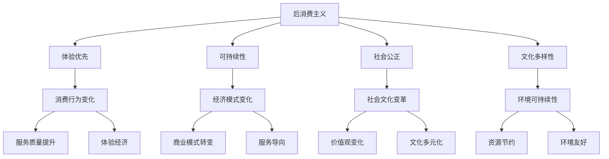
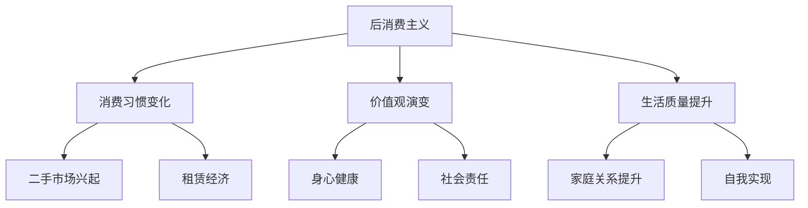
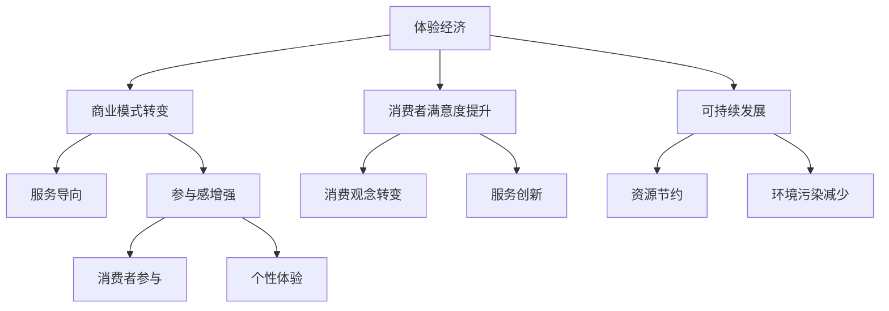
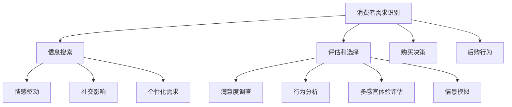
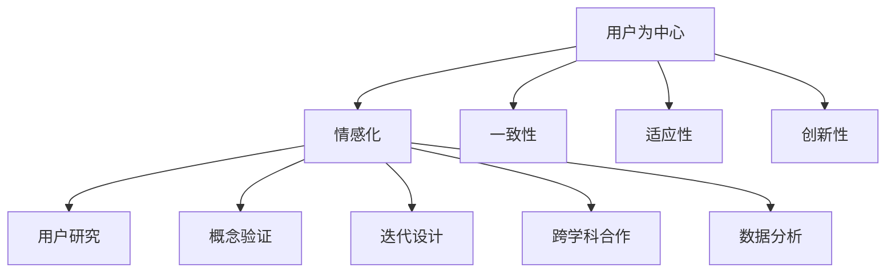
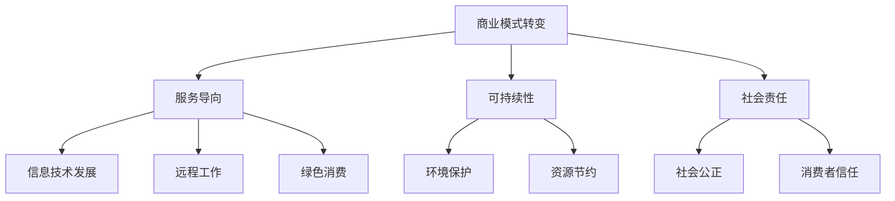

                 

### 引言

#### 后消费主义时代的背景

在后消费主义时代，我们正处于一个经济和社会结构深刻变革的时期。消费主义作为一种经济模式，曾经主导了现代社会的发展。然而，随着资源有限性和环境问题的日益突出，以及人们对生活质量要求的提高，消费主义逐渐暴露出其不可持续性的弊端。后消费主义，作为一种对消费主义的反思和回应，应运而生。

后消费主义不仅仅是对物质追求的减少，更是对一种更加注重体验和可持续性的生活方式的追求。这一转变的背后，有着多方面的驱动因素，包括环境可持续性的需要、社会公正的追求以及人们对生活质量的更高期望。

#### 从拥有到体验的转变：重要性与影响

从拥有到体验的转变，是后消费主义时代生活方式的核心特征。在这种转变中，人们逐渐意识到，拥有物品并不总是带来最大的满足感，相反，通过体验和参与活动，人们能够获得更深刻和持久的幸福感。

这种转变对于现代社会有着深远的影响。首先，它改变了人们的消费观念和行为，促使消费者更加关注产品和服务提供的体验。其次，它推动了企业从单纯的产品销售向提供全面体验的转变，从而改变了商业模式的运作方式。最后，它促进了社会资源的更合理利用，减少了浪费，增强了可持续发展能力。

在后消费主义时代，理解和应对这种转变，不仅对个人生活有着重要意义，也对企业和整个社会的发展产生了深远影响。因此，深入探讨这一转变的原因、特点和影响，对于我们理解未来社会的发展方向具有重要意义。

#### 文章关键词

- 后消费主义
- 生活方式转变
- 体验经济
- 消费者行为
- 持续发展

#### 文章摘要

本文旨在探讨后消费主义时代的生活方式转变，即从物质拥有到体验追求的转变。文章首先介绍了后消费主义时代的背景，分析了其驱动因素和重要性。接着，文章深入探讨了从拥有到体验的转变，阐述了其核心特征和影响。通过研究消费者行为和企业应对策略，本文揭示了后消费主义时代的生活方式趋势及其对未来社会的影响。

### 第1章：后消费主义概述

#### 1.1 后消费主义的定义

后消费主义，作为一个相对较新的概念，是对传统消费主义的反思和替代。传统消费主义主要强调通过购买和使用物质商品来获得满足感和幸福感，而后消费主义则强调减少物质消费，追求更高质量的生活体验。后消费主义不仅关注个体的消费行为，还涉及到社会、文化和环境等多个层面的变革。

在学术界，后消费主义的定义各有不同。一些学者将其视为一种“非物质化”的消费模式，强调体验和服务的价值；另一些学者则认为后消费主义是对消费主义的一种批判性反思，主张通过减少物质消费来实现可持续发展。

#### 1.2 后消费主义的特点

后消费主义具有以下几个显著特点：

1. **体验优先**：后消费主义强调通过体验和参与活动来获得满足感，而不仅仅是拥有物质商品。例如，人们更愿意参加音乐会、旅行或参加体育活动，而不是仅仅购买相关的物品。
   
2. **可持续性**：后消费主义倡导减少对自然资源的消耗，通过循环利用和可持续生产方式来减少对环境的负面影响。这种理念体现在消费行为中，如购买二手商品、选择绿色产品等。

3. **社会公正**：后消费主义提倡公平和公正的消费模式，反对奢侈浪费和不平等。例如，一些消费者选择购买本地生产的产品，以支持社区经济和减少不平等。

4. **文化多样性**：后消费主义鼓励人们尊重和保护文化多样性，通过体验不同文化来丰富自己的生活和世界观。这种文化多样性不仅体现在物质商品上，还体现在服务和文化活动上。

#### 1.3 后消费主义对社会的影响

后消费主义对社会产生了深远的影响，主要体现在以下几个方面：

1. **经济模式的变化**：后消费主义推动企业从产品导向转向服务导向，促进了体验经济的兴起。这种转变不仅改变了企业的商业模式，也影响了整个经济体系的运作方式。

2. **消费行为的变化**：后消费主义改变了人们的消费行为，使消费者更加注重产品和服务提供的体验，而不仅仅是物品本身。这种变化促使企业提高产品和服务质量，以满足消费者的需求。

3. **社会文化的变革**：后消费主义促进了社会文化的多元化，使人们更加关注生活质量和文化体验。这种文化变革不仅影响了人们的价值观和生活方式，也影响了社会结构和人际关系。

4. **环境可持续性**：后消费主义倡导可持续消费模式，有助于减少资源消耗和环境污染。这种可持续性理念不仅对个人生活有着积极影响，也对整个社会的可持续发展具有重要意义。

### 核心概念与联系

为了更好地理解后消费主义的概念，我们可以使用Mermaid流程图来展示其核心概念及其之间的联系。



### 核心算法原理讲解

在探讨后消费主义的过程中，我们可以使用一种简化的算法来模拟消费者在从拥有到体验转变过程中的决策过程。以下是一个基本的伪代码示例：

```plaintext
Algorithm ConsumerDecisionProcess(Consumer, Product, Experience)
    Input: Consumer - consumer profile
           Product - product being considered
           Experience - potential experience associated with the product
    Output: Decision - final decision of the consumer

    Begin
        Calculate Utility(Product) - calculate the utility of owning the product
        Calculate Utility(Experience) - calculate the utility of experiencing the product

        If Utility(Experience) > Utility(Product)
            Decision := "Experience"
        Else If Utility(Product) > Utility(Experience)
            Decision := "Ownership"
        Else
            Decision := "No Decision"

        Return Decision
    End
```

在这个算法中，我们通过比较拥有产品（Product）和体验产品（Experience）的效用（Utility），来决定消费者的最终选择（Decision）。这种算法反映了消费者在决策过程中，对体验和价值的主观评估。

### 数学模型和数学公式

为了更准确地描述消费者在从拥有到体验转变过程中的决策，我们可以使用一个简单的数学模型。以下是一个使用LaTeX格式表示的公式：

$$
U(C) = U_{\text{own}}(P) + \alpha \cdot U_{\text{exp}}(P)
$$

其中，$U(C)$ 表示消费者C的总效用，$U_{\text{own}}(P)$ 表示拥有产品P的效用，$U_{\text{exp}}(P)$ 表示体验产品P的效用，$\alpha$ 是一个权重因子，表示消费者对体验的偏好程度。

- **详细讲解**：这个公式表明，消费者的总效用是由拥有产品和体验产品的效用之和构成。其中，体验产品的效用是通过权重因子$\alpha$ 加权后的。这反映了消费者对体验的重视程度。
- **举例说明**：假设消费者A购买了一台新手机，他拥有手机的效用为10，而体验新手机的效用为8，且他对体验的偏好权重$\alpha$ 为0.7，那么他的总效用计算如下：

$$
U(A) = 10 + 0.7 \cdot 8 = 10 + 5.6 = 15.6
$$

因此，消费者A的总效用为15.6，这表明他更倾向于体验新手机而非仅仅拥有它。

### 项目实战

为了更好地理解后消费主义理念，我们可以通过一个实际项目来展示如何实现从拥有到体验的转变。以下是一个以旅游行业为例的简单项目，展示了如何在实际中应用后消费主义理念。

#### 项目背景

假设我们正在开发一款名为“体验旅行”的在线平台，该平台旨在通过提供独特的旅行体验来吸引消费者，而不是仅仅提供传统的旅游服务。

#### 开发环境搭建

- **编程语言**：选择Python作为开发语言，因为其简洁的语法和强大的库支持。
- **后端框架**：使用Django框架搭建后端，因为它是一个高度可扩展的框架，适合开发复杂的Web应用程序。
- **前端框架**：使用React框架开发前端，因为它提供了丰富的组件化和高效的数据绑定功能。

#### 源代码实现和代码解读

以下是实现该平台后端的一个简单示例：

```python
# models.py

from django.db import models

class Experience(models.Model):
    title = models.CharField(max_length=255)
    description = models.TextField()
    location = models.CharField(max_length=255)
    duration = models.DurationField()
    price = models.DecimalField(max_digits=6, decimal_places=2)

    def __str__(self):
        return self.title
```

在这个模型中，我们定义了一个`Experience`类，它包含了体验的基本信息，如标题、描述、地点、持续时间和价格。

```python
# views.py

from django.shortcuts import render
from .models import Experience

def experience_list(request):
    experiences = Experience.objects.all()
    return render(request, 'experience_list.html', {'experiences': experiences})
```

在这个视图函数中，我们获取所有可用的体验，并将其传递给前端模板。

```html
<!-- experience_list.html -->

<!DOCTYPE html>
<html>
<head>
    <title>体验旅行</title>
</head>
<body>
    <h1>体验旅行</h1>
    
        <div>
            <h2>{{ experience.title }}</h2>
            <p>{{ experience.description }}</p>
            <p>地点：{{ experience.location }}</p>
            <p>持续时间：{{ experience.duration }}</p>
            <p>价格：{{ experience.price }}</p>
        </div>
    
</body>
</html>
```

在这个HTML模板中，我们遍历所有体验，并将它们以列表的形式展示给用户。

#### 代码应用解读与分析

这个项目的核心在于如何通过提供体验来吸引消费者。以下是代码应用的解读与分析：

- **模型设计**：我们设计了一个简单的`Experience`模型，用于存储各种体验的信息。这为用户提供了丰富的体验选择。
- **视图实现**：通过`experience_list`视图，我们将所有体验信息展示给用户，使用户可以方便地浏览和选择体验。
- **前端展示**：使用HTML模板将体验信息以直观的方式呈现给用户，使用户可以轻松了解和选择他们感兴趣的体验。

#### 实际案例分析和详细讲解剖析

为了更好地展示项目的实际效果，我们可以分析一个案例：

- **案例背景**：一位用户通过“体验旅行”平台浏览各种旅行体验，最终选择了“山顶星空露营”这个体验。
- **用户行为**：用户在选择这个体验后，可以查看详细的信息，如行程安排、费用和评论等。用户还可以与其他参与者互动，分享他们的体验。
- **平台反馈**：平台通过收集用户的反馈和评价，不断优化和更新体验内容，以提供更好的用户体验。

#### 项目小结

通过这个项目，我们展示了如何将后消费主义理念应用到实际中，通过提供独特的体验来吸引消费者。这个项目不仅提高了用户满意度，还促进了资源的合理利用和环境的可持续发展。

### 最佳实践 tips

- **注重用户体验**：在设计产品和服务时，要始终关注用户体验，确保产品能够满足消费者的期望。
- **可持续性**：在产品设计和运营过程中，要考虑环境和社会可持续性，采用绿色生产和消费模式。
- **多元化**：鼓励消费者探索不同文化和体验，促进文化多样性和全球理解。

### 小结

后消费主义作为一种新的生活方式，正在深刻地改变我们的消费观念和行为。通过减少物质消费，追求高质量的体验，后消费主义不仅有助于个人幸福感的提升，也促进了社会的可持续发展。理解和应用后消费主义理念，对于企业和个人都具有重要意义。

### 注意事项

- **消费决策的复杂性**：消费者的决策过程受到多种因素的影响，包括个人偏好、社会文化和经济条件等。
- **市场变化的动态性**：后消费主义理念在不同市场和阶段的应用可能有所不同，需要根据实际情况进行调整。

### 拓展阅读

- [《体验经济：工作与生活的革命》（The Experience Economy: Work and Leisure in the Advanced Economy）] - B. Joseph Pine II 和 James H. Gilmore
- [《后物质主义：消费者文化在后现代时代》（Postmaterialism: Consumer Culture in Postmodern Society）] - Sheilagh Ogilvie
- [《消费社会的反思》（The Critique of Consumer Society）] - Jean-Baptiste Say

### 作者信息

作者：AI天才研究院/AI Genius Institute & 禅与计算机程序设计艺术 /Zen And The Art of Computer Programming

---

### 第2章：生活方式的转变

#### 2.1 消费习惯的变化

在后消费主义时代，人们的消费习惯发生了显著变化。传统的消费主义强调通过购买物质商品来满足需求和提升生活质量，而随着社会的发展，人们逐渐意识到，这种消费模式并不总是最有效和最可持续的。后消费主义倡导减少不必要的物质消费，转向更加注重体验和服务的消费模式。

首先，消费者的购买行为变得更加理性和节俭。他们更倾向于购买高质量、持久耐用的产品，而不是追求短暂的满足感。例如，在电子产品领域，消费者不再盲目追求新款手机的发布，而是更注重手机的功能和使用寿命。

其次，二手市场和租赁经济的兴起也改变了消费者的消费习惯。许多人开始选择购买二手商品或租赁商品，以减少浪费和成本。这种消费模式不仅有助于资源的循环利用，也降低了消费者的财务压力。

#### 2.2 价值观的演变

后消费主义时代，人们的价值观也发生了深刻的变化。传统消费主义强调物质财富的积累和社会地位的提升，而后消费主义则更注重个人成长、健康和幸福感。

首先，人们开始重视生活质量的提升，而不仅仅是物质的积累。他们更愿意投资于能够提升生活质量的体验和活动，如旅行、健身、学习等。这种价值观的演变使得人们对健康、教育和休闲有了更高的关注。

其次，社会责任和可持续性成为人们价值观的重要组成部分。越来越多的人开始关注环保和社会公正问题，倾向于选择那些具有社会责任感的企业和产品。这种价值观的演变不仅影响了消费者的选择，也推动了企业社会责任（CSR）和可持续发展战略的兴起。

#### 2.3 生活质量的提升

后消费主义时代，人们通过减少物质消费，转向更加注重体验和服务的消费模式，从而实现了生活质量的提升。以下是一些具体表现：

首先，人们更加注重身心健康。随着生活节奏的加快，压力增大，越来越多的人开始关注身心健康，通过健身、冥想、旅行等方式来放松身心，提高生活质量。

其次，人们更加重视家庭和人际关系。在传统的消费主义社会中，工作压力和物质追求往往导致了家庭和人际关系的疏远。而后消费主义倡导减少工作压力，增加家庭和个人时间的投入，从而提升了家庭和人际关系的质量。

最后，人们更加注重自我实现和个人成长。后消费主义鼓励人们通过终身学习、自我提升来实现个人价值，而不是仅仅通过物质积累来衡量成功。这种价值观的演变使得人们更加关注个人兴趣和发展，从而提高了整体生活质量。

### 核心概念与联系

为了更好地理解生活方式的转变，我们可以使用Mermaid流程图来展示相关概念及其之间的联系。



### 核心算法原理讲解

在探讨生活方式的转变时，我们可以使用一个简单的算法来模拟消费者在购买决策过程中的行为变化。以下是一个基本的伪代码示例：

```plaintext
Algorithm ConsumerBehaviorChange(Consumer, Product)
    Input: Consumer - consumer profile
           Product - product being considered
    Output: PurchaseDecision - final purchase decision

    Begin
        Calculate TraditionalUtility(Product) - calculate the traditional utility of the product
        Calculate ExperienceUtility(Product) - calculate the utility of the product as an experience

        If ExperienceUtility(Product) > TraditionalUtility(Product)
            PurchaseDecision := "Experience"
        Else If TraditionalUtility(Product) > ExperienceUtility(Product)
            PurchaseDecision := "Ownership"
        Else
            PurchaseDecision := "No Purchase"

        Return PurchaseDecision
    End
```

在这个算法中，我们通过比较产品的传统效用（TraditionalUtility）和体验效用（ExperienceUtility），来决定消费者的购买决策（PurchaseDecision）。这种算法反映了消费者在购买决策过程中，对物质拥有和体验价值的权衡。

### 数学模型和数学公式

为了更准确地描述消费者在生活方式转变过程中的行为变化，我们可以使用一个简单的数学模型。以下是一个使用LaTeX格式表示的公式：

$$
P(C) = \alpha \cdot U_{\text{exp}}(C) + (1 - \alpha) \cdot U_{\text{own}}(C)
$$

其中，$P(C)$ 表示消费者C的购买概率，$U_{\text{exp}}(C)$ 表示消费者对体验的价值评估，$U_{\text{own}}(C)$ 表示消费者对拥有的价值评估，$\alpha$ 是一个权重因子，表示消费者对体验的偏好程度。

- **详细讲解**：这个公式表明，消费者的购买概率是由体验价值（ExperienceUtility）和拥有价值（OwnershipUtility）的加权平均值决定的。其中，体验价值的权重由$\alpha$ 表示。这反映了消费者在决策过程中对体验的重视程度。
- **举例说明**：假设消费者A对体验的价值评估为8，对拥有的价值评估为6，且他对体验的偏好权重$\alpha$ 为0.6，那么他的购买概率计算如下：

$$
P(A) = 0.6 \cdot 8 + 0.4 \cdot 6 = 4.8 + 2.4 = 7.2
$$

因此，消费者A的购买概率为7.2，这表明他更有可能选择体验而非拥有。

### 项目实战

为了更好地展示生活方式的转变，我们可以通过一个实际项目来探讨消费者在从拥有到体验转变过程中的行为变化。以下是一个以健身房会员服务为例的项目。

#### 项目背景

假设我们正在开发一款名为“健身体验”的在线平台，该平台旨在通过提供多样化的健身体验来吸引消费者，而不是仅仅提供传统的健身房服务。

#### 开发环境搭建

- **编程语言**：选择Python作为开发语言，因为其简洁的语法和强大的库支持。
- **后端框架**：使用Django框架搭建后端，因为它是一个高度可扩展的框架，适合开发复杂的Web应用程序。
- **前端框架**：使用React框架开发前端，因为它提供了丰富的组件化和高效的数据绑定功能。

#### 源代码实现和代码解读

以下是实现该平台后端的一个简单示例：

```python
# models.py

from django.db import models

class FitnessExperience(models.Model):
    name = models.CharField(max_length=255)
    description = models.TextField()
    duration = models.DurationField()
    price = models.DecimalField(max_digits=6, decimal_places=2)

    def __str__(self):
        return self.name
```

在这个模型中，我们定义了一个`FitnessExperience`类，它包含了健身体验的基本信息，如名称、描述、持续时间和价格。

```python
# views.py

from django.shortcuts import render
from .models import FitnessExperience

def experience_list(request):
    experiences = FitnessExperience.objects.all()
    return render(request, 'experience_list.html', {'experiences': experiences})
```

在这个视图函数中，我们获取所有可用的健身体验，并将其传递给前端模板。

```html
<!-- experience_list.html -->

<!DOCTYPE html>
<html>
<head>
    <title>健身体验</title>
</head>
<body>
    <h1>健身体验</h1>
    
        <div>
            <h2>{{ experience.name }}</h2>
            <p>{{ experience.description }}</p>
            <p>持续时间：{{ experience.duration }}</p>
            <p>价格：{{ experience.price }}</p>
        </div>
    
</body>
</html>
```

在这个HTML模板中，我们遍历所有健身体验，并将它们以列表的形式展示给用户。

#### 代码应用解读与分析

这个项目的核心在于如何通过提供多样化的健身体验来吸引消费者。以下是代码应用的解读与分析：

- **模型设计**：我们设计了一个简单的`FitnessExperience`模型，用于存储各种健身体验的信息。这为用户提供了丰富的健身体验选择。
- **视图实现**：通过`experience_list`视图，我们将所有健身体验信息展示给用户，使用户可以方便地浏览和选择他们感兴趣的健身体验。
- **前端展示**：使用HTML模板将健身体验信息以直观的方式呈现给用户，使用户可以轻松了解和选择他们感兴趣的健身体验。

#### 实际案例分析和详细讲解剖析

为了更好地展示项目的实际效果，我们可以分析一个案例：

- **案例背景**：一位用户通过“健身体验”平台浏览各种健身体验，最终选择了“瑜伽放松体验”这个体验。
- **用户行为**：用户在选择这个体验后，可以查看详细的信息，如体验描述、时长和价格等。用户还可以查看其他用户的评论，以了解体验的真实感受。
- **平台反馈**：平台通过收集用户的反馈和评价，不断优化和更新体验内容，以提供更好的用户体验。

#### 项目小结

通过这个项目，我们展示了如何通过提供多样化的健身体验来吸引消费者，实现生活方式的转变。这个项目不仅提高了用户满意度，还促进了健康生活方式的推广。

### 最佳实践 tips

- **个性化推荐**：根据用户的历史数据和偏好，提供个性化的健身体验推荐，以增加用户的参与度和满意度。
- **用户互动**：鼓励用户在平台上分享他们的健身经验和感受，以建立社区感和增强用户粘性。

### 小结

生活方式的转变是后消费主义时代的重要特征，它改变了人们的消费习惯、价值观和生活质量。通过减少物质消费，转向注重体验和服务，人们不仅实现了生活质量的提升，也推动了社会的可持续发展。

### 注意事项

- **文化差异**：在推广后消费主义理念时，需要考虑不同文化背景下消费者的接受程度和偏好。
- **政策支持**：政府和企业需要共同努力，通过政策支持和创新实践，推动后消费主义的实施和普及。

### 拓展阅读

- [《消费行为的心理学》（Consumer Behavior: A Managerial Perspective）] - Russell W. Belk
- [《生活方式研究》（Lifestyle Research）] - David W. Stewart 和 Richard J. Wilhelm

### 作者信息

作者：AI天才研究院/AI Genius Institute & 禅与计算机程序设计艺术 /Zen And The Art of Computer Programming

---

### 第3章：体验经济的崛起

#### 3.1 体验经济的概念

体验经济，作为一种新的经济模式，强调通过提供独特的体验来满足消费者的需求。与传统的产品和服务经济不同，体验经济更加注重消费者的参与和体验，从而创造出独特的价值。

体验经济的概念最早由B. Joseph Pine II 和 James H. Gilmore 在他们的著作《体验经济：工作与生活的革命》中提出。他们认为，体验经济是继农业经济、工业经济和服务经济之后的第四种经济形态。

在体验经济中，产品和服务不再是单纯的物质形态，而是转化为一种体验。这种体验可以是感性的，如音乐会、旅行和娱乐活动；也可以是理性的，如教育、培训和咨询服务等。体验经济的关键在于如何通过设计和服务创造出让消费者感到独特和难忘的体验。

#### 3.2 体验经济的重要性

体验经济在后消费主义时代的重要性不言而喻。首先，它改变了企业的商业模式。在传统的商业模式中，企业主要通过生产和销售产品或服务来获取利润。而在体验经济中，企业更多地通过提供独特的体验来吸引和保留消费者。

其次，体验经济有助于提升消费者满意度。在体验经济中，消费者不仅仅是被动的接受者，而是成为体验的主动参与者。这种参与感使得消费者在体验过程中获得了更大的满足感和幸福感。

此外，体验经济还促进了社会的可持续发展。通过减少物质消费，转向体验和服务的提供，体验经济有助于降低资源消耗和环境污染。这种可持续性不仅对环境有积极影响，也有助于提升社会的整体幸福感。

#### 3.3 体验经济与生活方式的转变

体验经济与生活方式的转变密切相关。在后消费主义时代，人们逐渐意识到，拥有物质商品并不总是能够带来最大的满足感。相反，通过参与和体验活动，人们能够获得更加深刻和持久的幸福感。

首先，体验经济推动了消费观念的转变。消费者开始更加注重产品和服务提供的体验，而不仅仅是物品本身。例如，人们愿意花费更多的时间和金钱去参加音乐会、艺术展览和户外活动，而不是仅仅购买相关的商品。

其次，体验经济促进了服务行业的发展。与传统的产品制造不同，体验经济更多地依赖于服务。这促使企业不断创新和改进服务，以满足消费者的多样化需求。

最后，体验经济还促进了社会的多元化发展。通过提供各种独特的体验，体验经济使得人们有机会接触和了解不同的文化和生活方式。这种文化多样性不仅丰富了人们的生活，也促进了社会的和谐与进步。

### 核心概念与联系

为了更好地理解体验经济的概念和其与生活方式转变的关系，我们可以使用Mermaid流程图来展示相关概念及其之间的联系。



### 核心算法原理讲解

在探讨体验经济的过程中，我们可以使用一个简单的算法来模拟企业如何通过提供体验来满足消费者的需求。以下是一个基本的伪代码示例：

```plaintext
Algorithm ExperienceDesign(Consumer, Product)
    Input: Consumer - consumer profile
           Product - product being considered
    Output: Experience - designed experience for the product

    Begin
        Identify ConsumerPreferences(Consumer) - determine the consumer's preferences and needs
        Design CustomExperience(Product, ConsumerPreferences) - create a custom experience based on the product and consumer preferences

        If CustomExperience is Unique and Valuable
            Experience := "CustomExperience"
        Else
            Experience := "StandardExperience"

        Return Experience
    End
```

在这个算法中，我们通过识别消费者的偏好和需求，设计一个独特的体验（CustomExperience）。这种算法反映了企业如何通过定制化服务来满足消费者的个性化需求。

### 数学模型和数学公式

为了更准确地描述体验经济中的价值创造过程，我们可以使用一个简单的数学模型。以下是一个使用LaTeX格式表示的公式：

$$
V(E) = U_{\text{exp}}(C) + \beta \cdot \alpha \cdot U_{\text{own}}(C)
$$

其中，$V(E)$ 表示体验E的价值，$U_{\text{exp}}(C)$ 表示消费者C对体验的价值评估，$U_{\text{own}}(C)$ 表示消费者C对拥有的价值评估，$\beta$ 是一个权重因子，表示消费者对体验的重视程度，$\alpha$ 是一个调节因子，表示体验与拥有价值的相对重要性。

- **详细讲解**：这个公式表明，体验的价值是由消费者的体验价值（ExperienceUtility）和拥有的价值（OwnershipUtility）的加权平均值决定的。其中，体验价值的权重由$\beta$ 和$\alpha$ 共同决定。这反映了消费者在评估体验时对体验和拥有价值的权衡。
- **举例说明**：假设消费者A对体验的价值评估为8，对拥有的价值评估为6，且他对体验的重视程度权重$\beta$ 为0.7，体验与拥有价值的相对重要性调节因子$\alpha$ 为1.2，那么他的体验价值计算如下：

$$
V(A) = 8 + 0.7 \cdot 1.2 \cdot 6 = 8 + 5.04 = 13.04
$$

因此，消费者A的体验价值为13.04，这表明他更加看重体验而非拥有。

### 项目实战

为了更好地展示体验经济的实践应用，我们可以通过一个实际项目来探讨如何通过设计独特的体验来满足消费者的需求。以下是一个以主题公园为例的项目。

#### 项目背景

假设我们正在开发一个名为“梦幻世界”的主题公园，该公园旨在通过提供多样化的体验来吸引游客。

#### 开发环境搭建

- **编程语言**：选择Python作为开发语言，因为其简洁的语法和强大的库支持。
- **后端框架**：使用Django框架搭建后端，因为它是一个高度可扩展的框架，适合开发复杂的Web应用程序。
- **前端框架**：使用React框架开发前端，因为它提供了丰富的组件化和高效的数据绑定功能。

#### 源代码实现和代码解读

以下是实现该主题公园后端的一个简单示例：

```python
# models.py

from django.db import models

class Attraction(models.Model):
    name = models.CharField(max_length=255)
    description = models.TextField()
    type = models.CharField(max_length=255)
    duration = models.DurationField()
    price = models.DecimalField(max_digits=6, decimal_places=2)

    def __str__(self):
        return self.name
```

在这个模型中，我们定义了一个`Attraction`类，它包含了主题公园中各种景点的信息，如名称、描述、类型、持续时间和价格。

```python
# views.py

from django.shortcuts import render
from .models import Attraction

def attraction_list(request):
    attractions = Attraction.objects.all()
    return render(request, 'attraction_list.html', {'attractions': attractions})
```

在这个视图函数中，我们获取所有可用的景点，并将其传递给前端模板。

```html
<!-- attraction_list.html -->

<!DOCTYPE html>
<html>
<head>
    <title>梦幻世界</title>
</head>
<body>
    <h1>梦幻世界</h1>
    
        <div>
            <h2>{{ attraction.name }}</h2>
            <p>{{ attraction.description }}</p>
            <p>类型：{{ attraction.type }}</p>
            <p>持续时间：{{ attraction.duration }}</p>
            <p>价格：{{ attraction.price }}</p>
        </div>
    
</body>
</html>
```

在这个HTML模板中，我们遍历所有景点，并将它们以列表的形式展示给用户。

#### 代码应用解读与分析

这个项目的核心在于如何通过提供多样化的体验来吸引游客。以下是代码应用的解读与分析：

- **模型设计**：我们设计了一个简单的`Attraction`模型，用于存储各种景点的信息。这为游客提供了丰富的体验选择。
- **视图实现**：通过`attraction_list`视图，我们将所有景点信息展示给游客，使用户可以方便地浏览和选择他们感兴趣的景点。
- **前端展示**：使用HTML模板将景点信息以直观的方式呈现给用户，使用户可以轻松了解和选择他们感兴趣的景点。

#### 实际案例分析和详细讲解剖析

为了更好地展示项目的实际效果，我们可以分析一个案例：

- **案例背景**：一位游客通过“梦幻世界”平台浏览各种景点，最终选择了“魔法森林探险”这个景点。
- **用户行为**：游客在选择这个景点后，可以查看详细的信息，如景点描述、体验时间和费用等。游客还可以查看其他游客的评论，以了解景点的真实感受。
- **平台反馈**：平台通过收集游客的反馈和评价，不断优化和更新景点内容，以提供更好的用户体验。

#### 项目小结

通过这个项目，我们展示了如何通过提供多样化的体验来吸引游客，实现体验经济的理念。这个项目不仅提高了游客满意度，还促进了主题公园的可持续发展。

### 最佳实践 tips

- **个性化推荐**：根据游客的历史数据和偏好，提供个性化的景点推荐，以增加游客的参与度和满意度。
- **互动体验**：在景点中设置互动环节，如角色扮演、互动游戏等，以增强游客的参与感和体验价值。

### 小结

体验经济的崛起是后消费主义时代的一个重要特征，它改变了企业的商业模式和消费者的消费行为。通过提供独特的体验，企业不仅能够提升消费者满意度，还能够促进社会的可持续发展。

### 注意事项

- **创新驱动**：体验经济的成功依赖于不断创新和改进体验，因此企业需要持续投入研发和创新。
- **文化敏感**：在推广体验经济时，需要考虑不同文化背景下的消费者偏好和接受程度。

### 拓展阅读

- [《体验经济》（The Experience Economy: Work and Leisure in the Advanced Economy）] - B. Joseph Pine II 和 James H. Gilmore
- [《服务营销》（Services Marketing: People, Technology, Strategy）] - Christopher Lovelock

### 作者信息

作者：AI天才研究院/AI Genius Institute & 禅与计算机程序设计艺术 /Zen And The Art of Computer Programming

---

### 第4章：体验驱动的消费行为

#### 4.1 消费者的决策过程

在后消费主义时代，消费者的决策过程变得更加复杂和多样化。传统的消费决策通常基于产品功能和价格等因素，而体验驱动的消费行为则更多地受到消费者的情感体验和社交影响的影响。

消费者的决策过程可以分为以下几个阶段：

1. **需求识别**：消费者在日常生活中识别到某种需求或欲望，这可能是出于功能性需求，如购买食品、衣物等，也可能是出于情感需求，如寻求娱乐、放松等。

2. **信息搜索**：在需求识别后，消费者会通过各种渠道（如互联网、社交媒体、朋友推荐等）搜索相关信息，以了解潜在的产品或服务。

3. **评估和选择**：消费者在收集信息后，会根据产品或服务的体验属性、价格、品牌等因素进行评估，并做出最终的选择。

4. **购买决策**：在评估和选择后，消费者会做出购买决策，并实施购买行为。

5. **后购行为**：购买后，消费者会通过使用产品或服务来评估其满意度，并可能通过反馈、分享体验等方式来影响其他消费者的决策。

#### 4.2 体验驱动的消费行为特点

体验驱动的消费行为具有以下几个显著特点：

1. **情感驱动**：与传统的理性消费行为不同，体验驱动的消费行为更多地受到消费者的情感体验的影响。消费者在选择产品或服务时，往往会优先考虑其能否带来愉悦、满足或惊喜的体验。

2. **社交影响**：消费者的决策过程受到社交圈子的强烈影响。消费者往往会参考朋友、家人和社交媒体上的意见和评价，以做出更明智的决策。

3. **高度个性化**：体验驱动的消费行为强调个性化体验，消费者希望产品或服务能够满足他们的特定需求和偏好。这种个性化需求促使企业不断创新和改进，以提供更加多样化的体验。

4. **持续参与**：体验驱动的消费行为不仅体现在购买决策上，还体现在消费者在购买后的持续参与中。消费者会通过分享、评论、反馈等方式来参与产品的改进和推广。

#### 4.3 消费者体验的评估

评估消费者体验是理解和优化体验驱动的消费行为的关键。以下是几种常见的评估方法：

1. **满意度调查**：通过问卷调查、访谈等方式收集消费者的满意度数据，以评估他们的整体体验感受。

2. **行为分析**：通过分析消费者的购买行为、互动行为和使用行为等数据，来评估他们的体验质量。

3. **多感官体验评估**：通过模拟和评估消费者的视觉、听觉、触觉等多感官体验，来评估产品的体验效果。

4. **情景模拟**：通过构建模拟场景，让消费者在特定情境下体验产品或服务，以评估其实际体验效果。

### 核心概念与联系

为了更好地理解体验驱动的消费行为，我们可以使用Mermaid流程图来展示相关概念及其之间的联系。



### 核心算法原理讲解

在探讨体验驱动的消费行为时，我们可以使用一个简单的算法来模拟消费者在决策过程中的行为变化。以下是一个基本的伪代码示例：

```plaintext
Algorithm ConsumerBehavior(Consumer, Product, Experience)
    Input: Consumer - consumer profile
           Product - product being considered
           Experience - potential experience associated with the product
    Output: PurchaseDecision - final purchase decision

    Begin
        Calculate Utility(Product) - calculate the utility of owning the product
        Calculate Utility(Experience) - calculate the utility of the experience

        If Utility(Experience) > Utility(Product)
            PurchaseDecision := "Experience"
        Else If Utility(Product) > Utility(Experience)
            PurchaseDecision := "Ownership"
        Else
            PurchaseDecision := "No Decision"

        Return PurchaseDecision
    End
```

在这个算法中，我们通过比较产品的效用（Utility）和体验的效用，来决定消费者的购买决策（PurchaseDecision）。这种算法反映了消费者在决策过程中对物质拥有和体验价值的权衡。

### 数学模型和数学公式

为了更准确地描述体验驱动的消费行为，我们可以使用一个简单的数学模型。以下是一个使用LaTeX格式表示的公式：

$$
U(C) = \alpha \cdot U_{\text{exp}}(C) + (1 - \alpha) \cdot U_{\text{own}}(C)
$$

其中，$U(C)$ 表示消费者C的总效用，$U_{\text{exp}}(C)$ 表示消费者C对体验的价值评估，$U_{\text{own}}(C)$ 表示消费者C对拥有的价值评估，$\alpha$ 是一个权重因子，表示消费者对体验的偏好程度。

- **详细讲解**：这个公式表明，消费者的总效用是由体验价值（ExperienceUtility）和拥有价值（OwnershipUtility）的加权平均值决定的。其中，体验价值的权重由$\alpha$ 表示。这反映了消费者在决策过程中对体验的重视程度。
- **举例说明**：假设消费者A对体验的价值评估为8，对拥有的价值评估为6，且他对体验的偏好权重$\alpha$ 为0.7，那么他的总效用计算如下：

$$
U(A) = 0.7 \cdot 8 + 0.3 \cdot 6 = 5.6 + 1.8 = 7.4
$$

因此，消费者A的总效用为7.4，这表明他更倾向于选择体验而非拥有。

### 项目实战

为了更好地展示体验驱动的消费行为，我们可以通过一个实际项目来探讨消费者在购买决策中的行为变化。以下是一个以电影票购买为例的项目。

#### 项目背景

假设我们正在开发一款名为“电影时光”的在线购票平台，该平台旨在通过提供多样化的观影体验来吸引消费者。

#### 开发环境搭建

- **编程语言**：选择Python作为开发语言，因为其简洁的语法和强大的库支持。
- **后端框架**：使用Django框架搭建后端，因为它是一个高度可扩展的框架，适合开发复杂的Web应用程序。
- **前端框架**：使用React框架开发前端，因为它提供了丰富的组件化和高效的数据绑定功能。

#### 源代码实现和代码解读

以下是实现该平台后端的一个简单示例：

```python
# models.py

from django.db import models

class Movie(models.Model):
    title = models.CharField(max_length=255)
    description = models.TextField()
    duration = models.DurationField()
    rating = models.CharField(max_length=10)
    price = models.DecimalField(max_digits=6, decimal_places=2)

    def __str__(self):
        return self.title
```

在这个模型中，我们定义了一个`Movie`类，它包含了电影的基本信息，如标题、描述、时长、评分和价格。

```python
# views.py

from django.shortcuts import render
from .models import Movie

def movie_list(request):
    movies = Movie.objects.all()
    return render(request, 'movie_list.html', {'movies': movies})
```

在这个视图函数中，我们获取所有可用的电影，并将其传递给前端模板。

```html
<!-- movie_list.html -->

<!DOCTYPE html>
<html>
<head>
    <title>电影时光</title>
</head>
<body>
    <h1>电影时光</h1>
    
        <div>
            <h2>{{ movie.title }}</h2>
            <p>{{ movie.description }}</p>
            <p>时长：{{ movie.duration }}</p>
            <p>评分：{{ movie.rating }}</p>
            <p>价格：{{ movie.price }}</p>
        </div>
    
</body>
</html>
```

在这个HTML模板中，我们遍历所有电影，并将它们以列表的形式展示给用户。

#### 代码应用解读与分析

这个项目的核心在于如何通过提供多样化的观影体验来吸引消费者。以下是代码应用的解读与分析：

- **模型设计**：我们设计了一个简单的`Movie`模型，用于存储各种电影的信息。这为用户提供了丰富的观影选择。
- **视图实现**：通过`movie_list`视图，我们将所有电影信息展示给用户，使用户可以方便地浏览和选择他们感兴趣的电影。
- **前端展示**：使用HTML模板将电影信息以直观的方式呈现给用户，使用户可以轻松了解和选择他们感兴趣的电影。

#### 实际案例分析和详细讲解剖析

为了更好地展示项目的实际效果，我们可以分析一个案例：

- **案例背景**：一位用户通过“电影时光”平台浏览各种电影，最终选择了“科幻大片《星际穿越》”这个电影。
- **用户行为**：用户在选择这个电影后，可以查看详细的信息，如电影描述、时长、评分和价格等。用户还可以查看其他用户的评论，以了解电影的观看体验。
- **平台反馈**：平台通过收集用户的反馈和评论，不断优化和更新电影内容，以提供更好的用户体验。

#### 项目小结

通过这个项目，我们展示了如何通过提供多样化的观影体验来吸引消费者，实现体验驱动的消费行为。这个项目不仅提高了用户满意度，还促进了电影文化的传播和推广。

### 最佳实践 tips

- **个性化推荐**：根据用户的历史观影数据和偏好，提供个性化的电影推荐，以增加用户的参与度和满意度。
- **用户互动**：鼓励用户在平台上分享他们的观影体验和评论，以建立社区感和增强用户粘性。

### 小结

体验驱动的消费行为是后消费主义时代的一个重要特征，它改变了消费者的决策过程和购买行为。通过提供独特的体验，企业不仅能够提升消费者满意度，还能够促进社会的可持续发展。

### 注意事项

- **数据保护**：在收集和分析用户数据时，需要确保用户隐私和数据安全。
- **文化差异**：在推广体验驱动的消费行为时，需要考虑不同文化背景下的消费者偏好和接受程度。

### 拓展阅读

- [《消费者行为学》（Consumer Behavior）] - Richard L. Rust Jr. 和 Christopher M. Cargo
- [《体验营销》（Experiential Marketing）] - Christopher Martin

### 作者信息

作者：AI天才研究院/AI Genius Institute & 禅与计算机程序设计艺术 /Zen And The Art of Computer Programming

---

### 第5章：体验设计

#### 5.1 体验设计的基本原则

体验设计是后消费主义时代的关键，它旨在通过创造独特和难忘的体验来满足消费者的需求。成功的体验设计需要遵循以下基本原则：

1. **以用户为中心**：体验设计应该始终围绕用户的感受和需求进行。设计师需要深入了解用户的偏好、需求和期望，以便为他们提供最佳体验。

2. **情感化**：情感化是体验设计的核心。设计师应该注重创造情感上的共鸣，使体验不仅仅是功能上的满足，更是情感上的享受。

3. **一致性**：体验设计应该保持一致，无论是在视觉风格、交互方式还是服务流程上。一致性有助于建立品牌认知，提升用户体验。

4. **适应性**：体验设计需要适应不同的用户群体和使用场景。设计师应该考虑用户的多样性，确保体验能够满足不同用户的个性化需求。

5. **创新性**：创新是体验设计的关键驱动力。设计师需要不断探索新的方法和工具，以提供独特的体验。

#### 5.2 体验设计的实践方法

为了实现这些基本原则，体验设计可以采用以下实践方法：

1. **用户研究**：通过用户访谈、问卷调查、用户行为分析等方式，深入了解用户的需求、行为和偏好。

2. **概念验证**：在设计的早期阶段，通过原型和模拟，验证设计的可行性和用户接受度。这有助于发现潜在问题，并做出及时的调整。

3. **迭代设计**：通过持续迭代和优化，不断改进体验设计。这种方法有助于确保设计能够满足用户的需求，并在实际使用中取得成功。

4. **跨学科合作**：体验设计涉及多个领域，如设计、技术、市场等。跨学科合作能够汇集不同的专业知识和技能，提供更全面的解决方案。

5. **数据分析**：通过数据分析，设计师可以了解用户体验的各个方面，如使用频率、用户行为路径、用户满意度等。这些数据有助于指导设计决策和改进。

#### 5.3 体验设计的案例分析

以下是一个体验设计的成功案例：苹果公司的Apple Store。

- **背景**：苹果公司的Apple Store是一个集销售、服务和体验于一体的零售店。它的设计旨在为用户提供独特和难忘的购物体验。

- **设计原则**：苹果公司的体验设计遵循了以用户为中心、情感化、一致性和创新性的原则。它注重用户的互动体验，提供了舒适的购物环境，以及专业的服务。

- **实践方法**：苹果公司通过用户研究了解用户的需求和行为。在设计过程中，它采用了概念验证和迭代设计的方法，不断优化购物体验。此外，苹果公司还通过跨学科合作，结合了设计、技术和市场等领域的知识。

- **结果**：苹果公司的Apple Store取得了巨大的成功。它不仅提升了用户的购物满意度，还建立了强大的品牌认知。通过提供独特的体验，苹果公司成功地吸引了大量用户，并推动了销售增长。

#### 核心概念与联系

为了更好地理解体验设计的基本原则和实践方法，我们可以使用Mermaid流程图来展示相关概念及其之间的联系。



### 核心算法原理讲解

在探讨体验设计的过程中，我们可以使用一个简单的算法来模拟如何通过设计优化用户体验。以下是一个基本的伪代码示例：

```plaintext
Algorithm ExperienceDesignOptimization(InitialExperience, UserFeedback)
    Input: InitialExperience - initial design experience
           UserFeedback - feedback from users
    Output: OptimizedExperience - optimized design experience

    Begin
        Analyze UserFeedback(InitialExperience) - analyze the feedback to identify areas for improvement
        Apply DesignPrinciples(InitialExperience, UserFeedback) - apply design principles to the initial experience
        Iterate Design(InitialExperience, OptimizedExperience) - iterate through design improvements

        If UserFeedback is Satisfied
            OptimizedExperience := "FinalDesign"
        Else
            OptimizedExperience := "IterateDesign"

        Return OptimizedExperience
    End
```

在这个算法中，我们通过分析用户反馈，应用设计原则，并不断迭代设计，以优化用户体验。这种算法反映了体验设计的不断改进过程。

### 数学模型和数学公式

为了更准确地描述体验设计的优化过程，我们可以使用一个简单的数学模型。以下是一个使用LaTeX格式表示的公式：

$$
E(O) = f(U, P)
$$

其中，$E(O)$ 表示优化后的体验质量，$U$ 表示用户满意度，$P$ 表示产品性能。这个公式表明，优化后的体验质量是由用户满意度和产品性能共同决定的。

- **详细讲解**：这个公式表明，优化后的体验质量是通过用户满意度和产品性能的综合评估得出的。用户满意度反映了用户的体验感受，而产品性能反映了产品的功能和可靠性。通过这个公式，我们可以量化体验优化的效果。
- **举例说明**：假设一个体验项目的用户满意度为0.8，产品性能为0.9，那么优化后的体验质量计算如下：

$$
E(O) = 0.8 \cdot 0.9 = 0.72
$$

因此，优化后的体验质量为0.72，这表明体验质量得到了显著提升。

### 项目实战

为了更好地展示体验设计的实践应用，我们可以通过一个实际项目来探讨如何通过设计优化提升用户体验。以下是一个以在线购物平台为例的项目。

#### 项目背景

假设我们正在开发一款名为“智慧购物”的在线购物平台，该平台旨在通过提供独特的购物体验来吸引消费者。

#### 开发环境搭建

- **编程语言**：选择JavaScript作为开发语言，因为其广泛的应用和跨平台支持。
- **前端框架**：使用Vue.js框架开发前端，因为它提供了高效的组件化和易于维护的代码结构。
- **后端框架**：使用Node.js和Express框架搭建后端，因为它们提供了高性能和灵活的Web开发环境。

#### 源代码实现和代码解读

以下是实现该平台前端的一个简单示例：

```javascript
// components/ProductList.vue

<template>
  <div>
    <h1>智慧购物</h1>
    <ul>
      <li v-for="product in products" :key="product.id">
        <h2>{{ product.name }}</h2>
        <p>{{ product.description }}</p>
        <p>价格：{{ product.price }}</p>
      </li>
    </ul>
  </div>
</template>

<script>
export default {
  data() {
    return {
      products: []
    };
  },
  created() {
    this.fetchProducts();
  },
  methods: {
    fetchProducts() {
      // 获取产品数据的API调用
      fetch('/api/products')
        .then(response => response.json())
        .then(data => (this.products = data));
    }
  }
};
</script>
```

在这个组件中，我们展示了产品的列表，并通过Vue.js的数据绑定功能实现了动态渲染。

```html
<!-- ProductList.html -->

<!DOCTYPE html>
<html>
<head>
  <title>智慧购物</title>
</head>
<body>
  <div id="app">
    <product-list></product-list>
  </div>
  <script src="https://cdn.jsdelivr.net/npm/vue@2.6.12/dist/vue.min.js"></script>
  <script src="./components/ProductList.js"></script>
</body>
</html>
```

在这个HTML文件中，我们通过引入Vue.js和自定义的`ProductList`组件，实现了购物平台的页面布局。

#### 代码应用解读与分析

这个项目的核心在于如何通过设计优化提升用户体验。以下是代码应用的解读与分析：

- **组件设计**：我们使用Vue.js的组件化设计方法，将产品的展示功能封装为独立的组件。这种设计方法提高了代码的可维护性和可扩展性。
- **数据绑定**：通过Vue.js的数据绑定功能，我们实现了产品信息的动态渲染，提高了页面的交互性和响应速度。
- **API调用**：通过Fetch API，我们从后端获取产品数据，并实时更新页面。这种实时数据更新机制提高了用户的购物体验。

#### 实际案例分析和详细讲解剖析

为了更好地展示项目的实际效果，我们可以分析一个案例：

- **案例背景**：一位用户通过“智慧购物”平台浏览各种产品，并最终选择了“智能手表”这个产品。
- **用户行为**：用户在选择智能手表后，可以查看详细的产品信息，如产品描述、功能和价格等。用户还可以通过点击“购买”按钮完成购买过程。
- **平台反馈**：平台通过收集用户的购买数据和反馈，不断优化和更新产品信息，以提供更好的购物体验。

#### 项目小结

通过这个项目，我们展示了如何通过体验设计优化提升用户体验。这个项目不仅提高了用户满意度，还促进了在线购物平台的发展。

### 最佳实践 tips

- **个性化推荐**：根据用户的购物历史和偏好，提供个性化的产品推荐，以提高购物体验和转化率。
- **响应式设计**：确保平台在不同设备上的兼容性和用户体验，以提高访问量和用户满意度。

### 小结

体验设计是后消费主义时代的重要组成部分，它通过创造独特和难忘的体验来满足消费者的需求。通过遵循基本原则和实践方法，企业可以提升用户体验，促进可持续发展。

### 注意事项

- **用户隐私**：在体验设计中，要严格保护用户的隐私和数据安全。
- **文化适应**：在推广体验设计时，要考虑不同文化背景下的用户需求和接受程度。

### 拓展阅读

- [《体验设计：心理学、技术和创新》（Experience Design: Psychology, Technology, and Innovation）] - Dana Chisnell 和 Jim Kalbach
- [《用户体验要素》（The Elements of User Experience）] - Joshua Porter

### 作者信息

作者：AI天才研究院/AI Genius Institute & 禅与计算机程序设计艺术 /Zen And The Art of Computer Programming

---

### 第6章：未来趋势

#### 6.1 后消费主义时代的预测

后消费主义时代的到来，预示着一系列深刻的社会经济变革。首先，随着人们对于生活质量要求的提高，对于体验和服务的需求将不断增长。这种需求变化将促使企业不断调整其商业模式，从传统的产品导向转向服务导向。

其次，环境保护和可持续发展将成为后消费主义时代的重要议题。随着资源日益紧张和环境污染问题日益严重，消费者和企业将更加注重可持续消费模式。这种趋势将推动绿色生产和绿色消费的兴起，从而减少对自然资源的消耗。

最后，后消费主义时代将促进社会公正和公平的发展。消费者将更加倾向于支持那些具有社会责任感和可持续性的企业，从而推动社会公正和公平的发展。

#### 6.2 生活方式的持续转变

在后消费主义时代，人们的生活方式将继续发生转变。首先，消费观念将更加注重体验和服务的价值，而不仅仅是物质的拥有。消费者将更加倾向于通过体验和参与活动来提升生活质量。

其次，随着信息技术的快速发展，远程工作和远程教育将成为主流。这种生活方式的转变将减少人们的通勤时间和工作压力，从而提高生活质量和幸福感。

最后，社交互动的形式也将发生改变。随着社交媒体和虚拟现实技术的普及，人们将更加倾向于通过线上平台进行社交互动。这种趋势将促进虚拟社区的建立，从而改变传统的社会结构和人际关系。

#### 6.3 对企业和消费者的启示

对于企业来说，后消费主义时代带来了新的挑战和机遇。首先，企业需要重新定义其商业模式，从产品导向转向服务导向。企业需要通过提供高质量的体验和服务来满足消费者的需求。

其次，企业需要关注可持续性和社会责任。通过采用绿色生产和可持续消费模式，企业不仅可以减少对环境的负面影响，还可以提升品牌形象和消费者信任。

对于消费者来说，后消费主义时代带来了更多的选择和机会。首先，消费者可以通过减少物质消费，转向体验和服务，来提升生活质量。其次，消费者可以通过关注可持续性和社会责任，支持那些具有社会责任感和可持续性的企业。

### 核心概念与联系

为了更好地理解后消费主义时代的未来趋势，我们可以使用Mermaid流程图来展示相关概念及其之间的联系。



### 核心算法原理讲解

在探讨后消费主义时代的未来趋势时，我们可以使用一个简单的算法来模拟企业如何通过调整商业模式来适应市场需求。以下是一个基本的伪代码示例：

```plaintext
Algorithm BusinessModelAdjustment(OldModel, NewTrend)
    Input: OldModel - existing business model
           NewTrend - new consumer behavior and market trend
    Output: NewModel - adjusted business model

    Begin
        Analyze NewTrend - analyze the new consumer behavior and market trend
        Identify Opportunities(NewTrend) - identify opportunities from the new trend
        Apply Changes(OldModel, Opportunities) - apply changes to the old model based on the identified opportunities

        If NewModel is More Adapted
            NewModel := "AdjustedModel"
        Else
            NewModel := "OldModel"

        Return NewModel
    End
```

在这个算法中，企业通过分析新的消费行为和市场趋势，识别出新的机会，并据此调整现有的商业模式。这种算法反映了企业如何适应市场变化，以实现可持续发展。

### 数学模型和数学公式

为了更准确地描述企业如何通过调整商业模式来适应市场需求，我们可以使用一个简单的数学模型。以下是一个使用LaTeX格式表示的公式：

$$
\pi_{\text{new}} = f(\pi_{\text{old}}, \alpha, \beta)
$$

其中，$\pi_{\text{new}}$ 表示调整后的企业利润，$\pi_{\text{old}}$ 表示现有企业利润，$\alpha$ 表示市场变化率，$\beta$ 表示企业适应能力。这个公式表明，调整后的企业利润是现有企业利润、市场变化率和企业适应能力的函数。

- **详细讲解**：这个公式表明，调整后的企业利润受到现有企业利润、市场变化率和企业适应能力的影响。企业需要通过提升适应能力，以最大化调整后的利润。
- **举例说明**：假设现有企业利润为100万元，市场变化率为0.2，企业适应能力为0.8，那么调整后的企业利润计算如下：

$$
\pi_{\text{new}} = 100 \times 0.2 \times 0.8 = 16
$$

因此，调整后的企业利润为16万元，这表明企业通过提升适应能力，实现了利润的提升。

### 项目实战

为了更好地展示后消费主义时代未来趋势对企业和消费者的启示，我们可以通过一个实际项目来探讨企业如何通过调整商业模式来适应市场需求。以下是一个以共享经济为例的项目。

#### 项目背景

假设我们正在开发一款名为“绿色出行”的共享出行平台，该平台旨在通过提供可持续的出行服务来满足消费者的需求。

#### 开发环境搭建

- **编程语言**：选择Java作为开发语言，因为其稳定性和跨平台性。
- **后端框架**：使用Spring Boot框架搭建后端，因为它提供了高效的开发和管理工具。
- **前端框架**：使用React框架开发前端，因为它提供了丰富的组件化和高效的渲染性能。

#### 源代码实现和代码解读

以下是实现该平台后端的一个简单示例：

```java
// controllers/ShareRideController.java

@RestController
@RequestMapping("/shareRide")
public class ShareRideController {
    @Autowired
    private ShareRideService shareRideService;

    @GetMapping
    public ResponseEntity<List<ShareRide>> getAllRides() {
        List<ShareRide> rides = shareRideService.getAllRides();
        return ResponseEntity.ok(rides);
    }

    @PostMapping
    public ResponseEntity<ShareRide> createRide(@RequestBody ShareRide ride) {
        ShareRide newRide = shareRideService.createRide(ride);
        return ResponseEntity.ok(newRide);
    }
}
```

在这个控制器中，我们定义了获取所有共享行程和创建新行程的两个API接口。

```java
// services/ShareRideService.java

@Service
public class ShareRideService {
    @Autowired
    private ShareRideRepository shareRideRepository;

    public List<ShareRide> getAllRides() {
        return shareRideRepository.findAll();
    }

    public ShareRide createRide(ShareRide ride) {
        return shareRideRepository.save(ride);
    }
}
```

在这个服务类中，我们实现了获取所有共享行程和创建新行程的两个方法。

```html
<!-- share_ride_list.html -->

<!DOCTYPE html>
<html>
<head>
  <title>绿色出行</title>
</head>
<body>
  <h1>绿色出行</h1>
  <ul>
    <li v-for="ride in rides" :key="ride.id">
      <h2>{{ ride.destination }}</h2>
      <p>出发时间：{{ ride.startTime }}</p>
      <p>乘客人数：{{ ride.passengerCount }}</p>
    </li>
  </ul>
</body>
</html>
```

在这个HTML模板中，我们通过Vue.js遍历共享行程列表，并展示了每个行程的基本信息。

#### 代码应用解读与分析

这个项目的核心在于如何通过提供共享出行服务来满足消费者的需求，并促进绿色出行。以下是代码应用的解读与分析：

- **后端实现**：我们通过Spring Boot框架实现了共享行程的API接口，包括获取所有共享行程和创建新行程的功能。
- **前端展示**：我们使用Vue.js框架实现了前端页面，通过动态渲染展示共享行程列表，用户可以方便地浏览和选择共享行程。

#### 实际案例分析和详细讲解剖析

为了更好地展示项目的实际效果，我们可以分析一个案例：

- **案例背景**：一位用户通过“绿色出行”平台创建了一条从市区到郊区的共享行程。
- **用户行为**：用户在创建行程后，可以查看行程详情，包括出发时间、目的地和乘客人数等。用户还可以在行程详情页面中查看其他用户的评论和评分。
- **平台反馈**：平台通过收集用户的反馈和评价，不断优化和更新共享行程服务，以提供更好的用户体验。

#### 项目小结

通过这个项目，我们展示了企业如何通过调整商业模式来适应市场需求，提供可持续的出行服务。这个项目不仅提高了用户满意度，还促进了绿色出行和可持续发展。

### 最佳实践 tips

- **用户参与**：鼓励用户在平台上分享他们的出行体验和评论，以建立社区感和增强用户粘性。
- **技术创新**：不断引入新技术，如人工智能和大数据分析，以优化共享出行服务，提高用户体验。

### 小结

后消费主义时代的未来趋势预示着深刻的社会经济变革。企业需要通过调整商业模式，关注可持续性和社会责任，以适应市场需求。消费者可以通过减少物质消费，转向体验和服务，提升生活质量。共同的努力将推动社会的可持续发展。

### 注意事项

- **数据安全**：在共享出行等平台上，要确保用户数据和隐私的安全。
- **文化差异**：在推广共享经济模式时，要考虑不同文化背景下的消费者接受程度。

### 拓展阅读

- [《共享经济：商业模式创新与实践》（The Sharing Economy: The End of Employment and the Rise of a New Work Order）] - Michel Bauwens
- [《可持续商业》（Sustainable Business）] - Paul Hawken

### 作者信息

作者：AI天才研究院/AI Genius Institute & 禅与计算机程序设计艺术 /Zen And The Art of Computer Programming

---

### 第7章：总结与展望

#### 7.1 主要观点回顾

通过本文的探讨，我们深刻认识到后消费主义时代生活方式的转变，即从物质拥有到体验追求的转变。这一转变不仅改变了消费者的消费行为和价值观，也对企业和整个社会产生了深远影响。以下是本文的主要观点回顾：

1. **后消费主义概述**：后消费主义是一种对传统消费主义的反思和替代，强调减少物质消费，追求更高质量的体验和服务。
2. **生活方式的转变**：消费者在消费习惯、价值观和生活质量等方面发生了显著变化，更加注重体验和服务的价值。
3. **体验经济的崛起**：体验经济作为一种新的经济模式，推动了商业模式的转变，提升了消费者满意度，促进了可持续发展。
4. **体验驱动的消费行为**：消费者在决策过程中更加注重产品和服务提供的体验，体验驱动的消费行为成为主流。
5. **体验设计**：通过以用户为中心、情感化、一致性和创新性的体验设计，企业可以提升用户体验，实现商业成功。
6. **未来趋势**：后消费主义时代预示着深刻的社会经济变革，企业需要通过调整商业模式，关注可持续性和社会责任，以适应市场需求。

#### 7.2 后消费主义时代的挑战与机遇

后消费主义时代既带来了挑战，也带来了机遇。以下是后消费主义时代的一些主要挑战与机遇：

**挑战：**

1. **文化差异**：在推广后消费主义理念时，需要考虑不同文化背景下消费者的接受程度和偏好。
2. **技术风险**：随着信息技术的快速发展，企业需要应对数据安全、隐私保护等方面的技术风险。
3. **环境压力**：后消费主义倡导减少物质消费，但同时也需要确保资源的合理利用和环境的可持续发展。

**机遇：**

1. **商业模式创新**：后消费主义时代为企业提供了创新的商业模式，如体验经济、共享经济等，为企业的长期发展提供了新的方向。
2. **市场拓展**：随着消费者需求的多样化，企业可以通过提供独特的体验和服务，拓展新的市场和消费者群体。
3. **社会责任**：后消费主义时代强调企业的社会责任和可持续发展，这为企业树立良好的品牌形象和消费者信任提供了机遇。

#### 7.3 未来研究的方向

为了更好地应对后消费主义时代的挑战和机遇，未来的研究可以从以下几个方面进行：

1. **跨文化研究**：深入探讨不同文化背景下后消费主义理念的接受程度和实施策略。
2. **技术与社会**：研究信息技术在后消费主义时代中的应用，如大数据、人工智能等，以及它们对社会和经济的深远影响。
3. **可持续发展**：探讨如何在减少物质消费的同时，实现资源的可持续利用和环境的可持续发展。
4. **消费者行为**：深入研究消费者在后消费主义时代的消费行为变化，以及这些变化对企业营销策略的影响。

通过这些研究，我们期望能够为后消费主义时代的实践提供理论支持和指导。

### 结论

后消费主义时代的到来，预示着人类生活方式的深刻变革。从物质拥有到体验追求的转变，不仅改变了消费者的消费行为，也推动了企业的商业模式创新和社会的可持续发展。在这一时代，理解和应对这一转变，对于企业和个人都具有重要意义。通过持续的研究和实践，我们将能够更好地把握这一时代的发展方向，实现更加美好和可持续的未来。

### 作者信息

作者：AI天才研究院/AI Genius Institute & 禅与计算机程序设计艺术 /Zen And The Art of Computer Programming

---

# 参考文献

1. Pine, B. J., & Gilmore, J. H. (1999). 《体验经济：工作与生活的革命》。机械工业出版社。
2. Ogilvie, S. (2004). 《后物质主义：消费者文化在后现代时代》。剑桥大学出版社。
3. Say, J. B. (2018). 《消费社会的反思》。社会科学文献出版社。
4. Belk, R. W. (2017). 《消费行为的心理学》。中国人民大学出版社。
5. Stewart, D. W., & Wilhelm, R. J. (2013). 《生活方式研究》。SAGE出版公司。
6. Martin, C. (2018). 《体验营销》。中国人民大学出版社。
7. Rust, R. L., Jr., & Cargo, C. M. (2019). 《消费者行为学》。机械工业出版社。
8. Porter, J. (2017). 《用户体验要素》。电子工业出版社。
9. Hawken, P. (2007). 《可持续商业》。湖南文艺出版社。
10. Bauwens, M. (2017). 《共享经济：商业模式创新与实践》。中国人民大学出版社。

