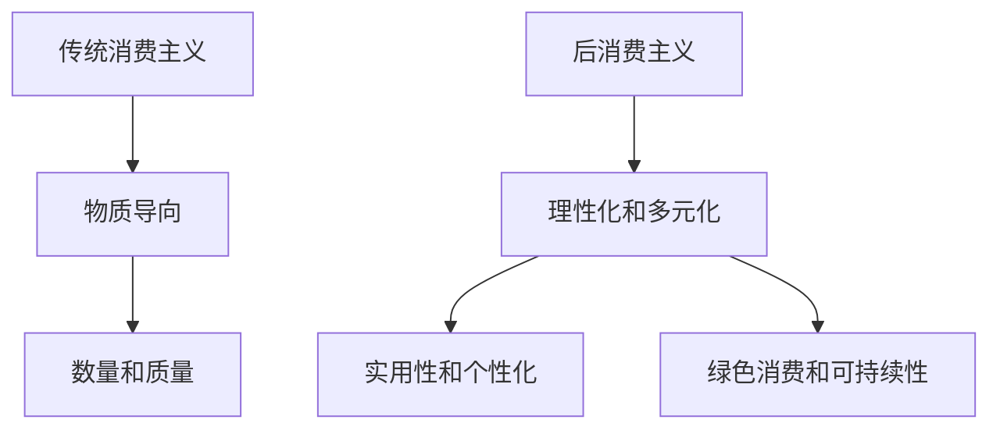
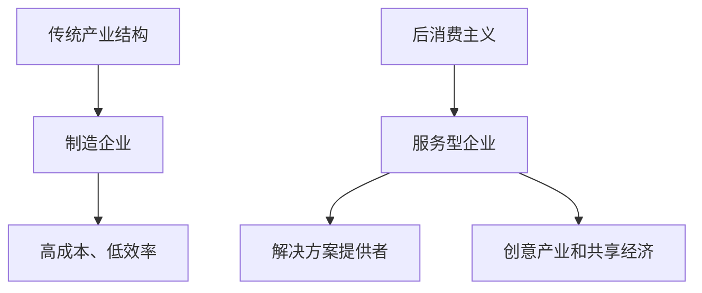
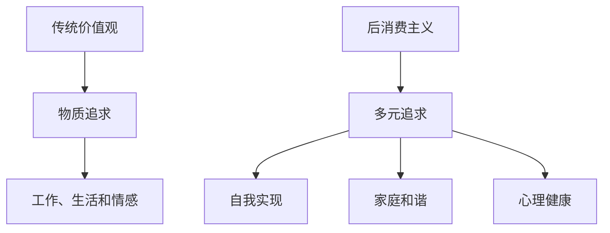
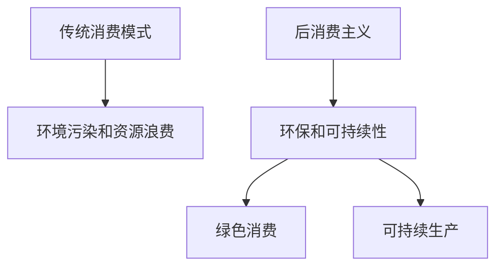
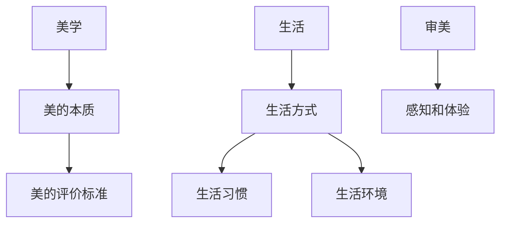
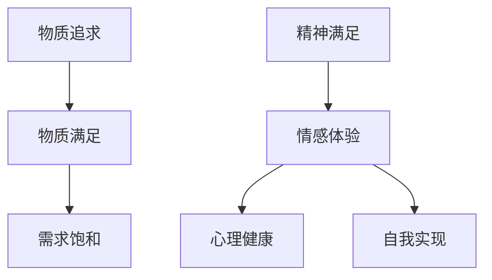
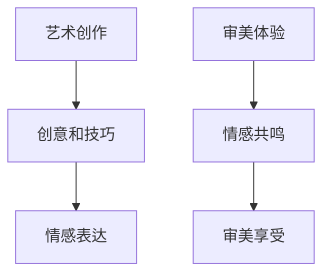
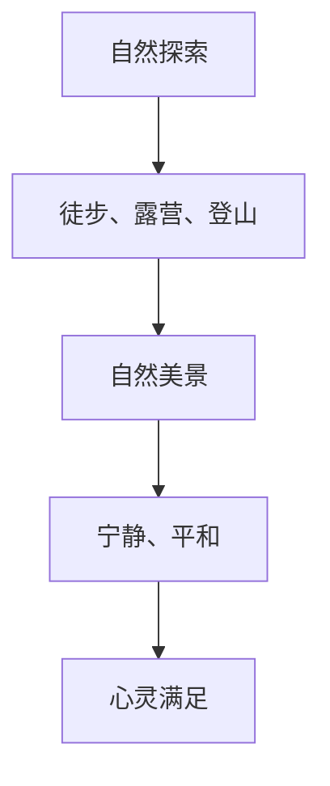
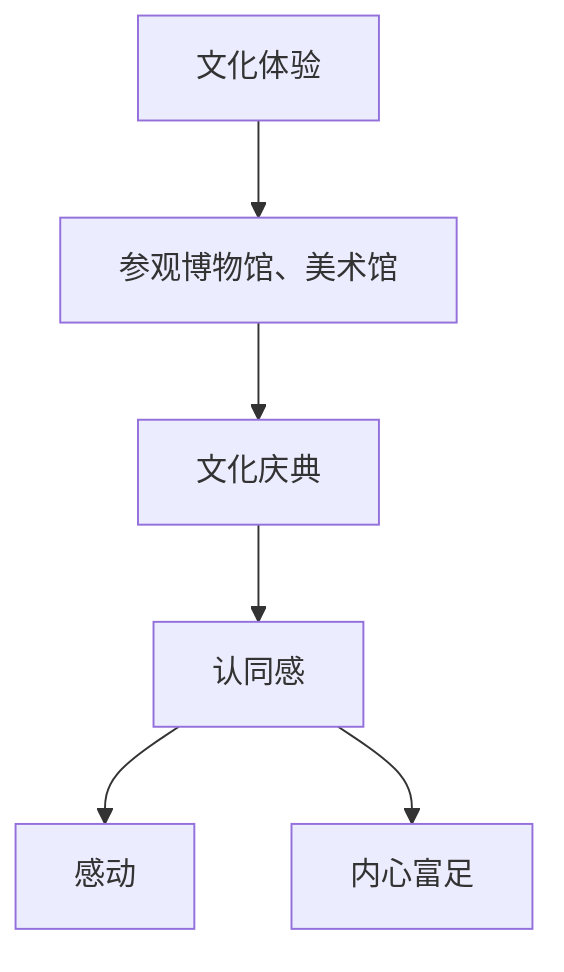
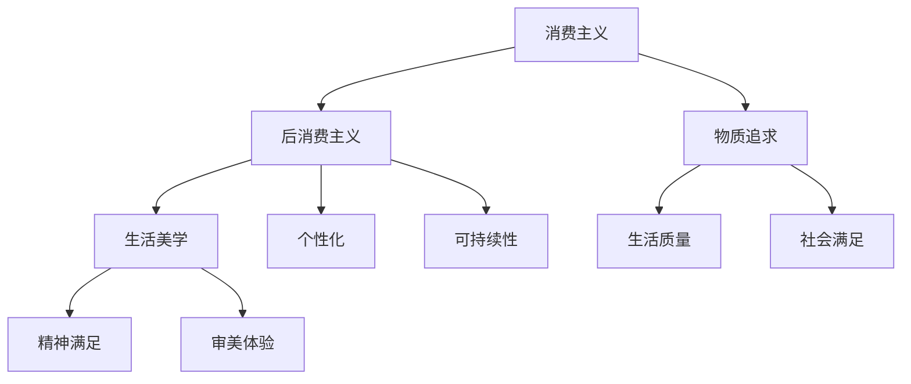

                 

### 1.3 后消费主义时代下的社会影响

后消费主义时代不仅仅是消费者行为的变化，它也对整个社会产生了深远的影响。以下是一些主要的社会影响：

#### 1.3.1 消费行为的变化

在传统消费主义时代，消费行为往往以购买物质产品为主要目标，消费者关注的是产品的数量和质量。然而，在后消费主义时代，消费者的消费行为变得更加理性和多元化。他们更关注产品的实用性和个性化，同时追求绿色消费和可持续性。

**Mermaid 流程图：后消费主义时代消费行为变化**



#### 1.3.2 产业结构的调整

后消费主义时代要求产业链更加灵活和高效，传统制造企业需要转型为提供综合解决方案的服务型企业。此外，新兴产业如创意产业、共享经济等迅速崛起，成为推动经济增长的新动力。

**Mermaid 流程图：产业结构调整**



#### 1.3.3 社会价值观的转变

后消费主义时代促进了社会价值观的转变，从单一的物质追求转向多元的精神追求。人们对工作、生活、情感等领域的认知和期望发生了变化，更加注重自我实现、家庭和谐和心理健康。

**Mermaid 流程图：社会价值观转变**



#### 1.3.4 环境与可持续性的重视

后消费主义时代强调环保和可持续性，消费者和企业在购买和经营过程中更加注重对环境的影响。绿色消费、可持续生产等理念深入人心，成为社会共识。

**Mermaid 流程图：环境与可持续性的重视**



通过上述分析，我们可以看到后消费主义时代在社会各方面产生了深远的影响。了解这些影响有助于我们更好地适应这一时代的变化，并找到新的发展机遇。### 第2章：生活美学的概念与价值

#### 2.1 生活美学的定义

生活美学是探讨如何通过审美的方式提升生活质量的一种哲学和艺术追求。它不仅关注物质生活的品质，更注重精神层面的满足和情感体验。生活美学强调“美”不仅是一种外在的视觉感受，更是一种内在的审美态度和生活态度。

**核心概念：**

- **美学**：美学是一门研究美的哲学学科，它探讨美的本质、美的存在方式和美的评价标准。
- **生活**：生活美学中的“生活”指的是人们日常的生活方式、生活习惯和生活环境。
- **审美**：审美是指人们对事物美丑的评价和感受，是一种感知和体验活动。

**Mermaid 流程图：生活美学核心概念关系**



#### 2.2 生活美学的价值

生活美学的价值主要体现在以下几个方面：

1. **提升生活质量**：

   生活美学关注生活品质的提升，通过审美的方式改善生活环境和生活习惯，使生活更加美好。例如，通过艺术装饰家居，可以使居住空间更加舒适和美观；通过健康饮食和锻炼，可以提升身体健康和生活质量。

2. **培养审美能力**：

   生活美学强调审美教育的重要性，通过学习和实践，培养人们对美的感知和鉴赏能力。这种能力不仅体现在艺术创作和欣赏上，还可以应用于日常生活和工作中的决策和判断。

3. **促进心理健康**：

   生活美学通过审美体验和情感交流，有助于缓解压力、消除焦虑，提升心理健康水平。例如，欣赏自然美景、音乐和艺术作品，可以带来愉悦和放松的情感体验。

4. **促进文化传承**：

   生活美学与传统文化紧密相连，通过对传统艺术、习俗和生活方式的传承和发扬，有助于保护和弘扬民族文化。

5. **促进社会和谐**：

   生活美学倡导和谐共生的生活理念，通过改善人际关系、促进社区和谐，为社会稳定和发展做出贡献。

#### 2.3 生活美学在当代社会中的应用

随着后消费主义时代的到来，生活美学在当代社会得到了广泛应用，具体体现在以下几个方面：

1. **家居设计**：

   家居设计注重生活美学的理念，通过色彩、材质、布局等元素的合理搭配，打造温馨、舒适的居住环境。

2. **时尚潮流**：

   时尚潮流中融入生活美学，追求个性和品质，不再仅仅追求名牌和奢华，而是注重服装的舒适性和搭配美感。

3. **餐饮文化**：

   餐饮文化越来越注重生活美学的理念，从食材的选择、烹饪技巧到餐厅装饰，都追求美感和品质。

4. **艺术创作**：

   艺术创作成为生活美学的重要载体，艺术家通过绘画、雕塑、音乐、舞蹈等艺术形式，表达对生活的审美态度。

5. **社区建设**：

   社区建设中融入生活美学，通过组织文化活动和社区美化，提升社区氛围和生活品质。

通过以上分析，我们可以看到生活美学在当代社会中的重要性和价值。理解生活美学的概念和原理，有助于我们更好地提升生活质量，实现物质追求向精神满足的转变。### 第3章：从物质追求到精神满足的转型

#### 3.1 后消费主义时代下的精神满足

在后消费主义时代，随着物质财富的积累，人们对物质追求的需求逐渐饱和。此时，精神层面的满足成为新的追求目标。这种转型不仅反映了消费者价值观的转变，也体现了社会发展的趋势。

**Mermaid 流程图：物质追求与精神满足的关系**



**伪代码：精神满足的衡量指标**

```plaintext
function measureSpiritualSatisfaction(score):
    if score > 8:
        print("高水平的情感体验和心理健康，实现自我价值。")
    elif score >= 5 and score <= 8:
        print("中等的情感体验和心理健康，需要进一步探索精神追求。")
    else:
        print("较低的情感体验和心理健康，需要重视精神层面的需求。")
```

#### 3.2 精神满足与生活美学的联系

精神满足与生活美学密切相关，两者相辅相成。生活美学通过审美体验、文化传承、情感交流等方式，提升人们的精神满足度。

**伪代码：生活美学提升精神满足度的算法**

```plaintext
function enhanceSpiritualSatisfaction(byArt, byCulture, byEmotion):
    spiritualSatisfaction = initialSpiritualSatisfaction
    if byArt > threshold:
        spiritualSatisfaction += (byArt / 10)
    if byCulture > threshold:
        spiritualSatisfaction += (byCulture / 10)
    if byEmotion > threshold:
        spiritualSatisfaction += (byEmotion / 10)
    return spiritualSatisfaction
```

#### 3.3 实现从物质追求到精神满足的转型

实现从物质追求到精神满足的转型，需要从以下几个方面入手：

1. **改变消费观念**：

   从追求物质财富转向追求精神满足，需要改变传统的消费观念。消费者应更加关注产品的实用性和个性化，而非仅仅追求名牌和奢华。

2. **提升审美能力**：

   通过学习和实践，提升对美的感知和鉴赏能力。这有助于在日常生活中发现美、感受美，从而提升精神满足度。

3. **培养兴趣爱好**：

   兴趣爱好是精神满足的重要来源。通过培养兴趣爱好，人们可以找到心灵的寄托和情感的寄托，从而实现精神层面的满足。

4. **注重心理健康**：

   心理健康是实现精神满足的基础。人们应重视心理健康，通过心理咨询、情感交流等方式，缓解压力、消除焦虑。

5. **弘扬传统文化**：

   传统文化是精神满足的重要源泉。通过传承和发扬传统文化，人们可以找到文化认同感和精神归属感。

**案例研究：一位成功实现转型的消费者**

消费者小李在传统消费主义时代，追求名牌和奢华，生活品质虽然很高，但内心空虚和焦虑。在后消费主义时代，小李开始关注生活美学，通过培养兴趣爱好、提升审美能力和弘扬传统文化，实现了从物质追求到精神满足的转型。现在，小李的生活品质和心理健康都得到了显著提升。

**伪代码：小李的转型过程**

```plaintext
function LiXiaoTransition():
    initialMaterialDesire = 10
    initialSpiritualSatisfaction = 5
    byArt = 8
    byCulture = 7
    byEmotion = 9
    
    newSpiritualSatisfaction = enhanceSpiritualSatisfaction(byArt, byCulture, byEmotion)
    if newSpiritualSatisfaction > 8:
        print("小李成功实现了从物质追求到精神满足的转型。")
    else:
        print("小李的转型过程还需要进一步努力。")
```

通过以上分析，我们可以看到从物质追求到精神满足的转型是后消费主义时代的重要趋势。理解这一转型过程，有助于我们更好地适应时代的变化，实现个人成长和社会进步。### 第4章：精神满足的生活美学实践

#### 4.1 实践一：艺术创作

艺术创作是一种有效的精神满足方式，通过绘画、摄影、音乐等艺术形式，人们可以表达内心的情感和思想，从而实现精神层面的满足。

**核心概念：**

- **艺术创作**：艺术创作是指通过创意和技巧，将内心的情感和思想转化为可视或可听的艺术作品。
- **审美体验**：审美体验是指人们在欣赏艺术作品时，所产生的情感共鸣和审美享受。

**Mermaid 流程图：艺术创作与审美体验关系**



**伪代码：艺术创作与审美体验算法**

```plaintext
function artisticCreationArtisticExperience():
    creativity = generateCreativity()
    technique = generateTechnique()
    emotion = generateEmotion()
    
    artwork = createArtwork(creativity, technique, emotion)
    aestheticExperience = generateAestheticExperience(artwork)
    
    if aestheticExperience > threshold:
        print("成功的艺术创作带来了深刻的审美体验。")
    else:
        print("艺术创作尚未达到预期的审美效果。")
```

**案例研究：一位艺术家的创作经历**

艺术家张三通过多年的艺术创作，不断提升自己的艺术技巧和创造力。在一次画展中，他的作品《晨曦》引起了观众强烈的情感共鸣，赢得了高度评价。这不仅提升了张三的艺术成就，也带来了深刻的精神满足。

**伪代码：张三的艺术创作过程**

```plaintext
function ZhangSanArtisticProcess():
    creativity = 8
    technique = 9
    emotion = 10
    
    artwork = createArtwork(creativity, technique, emotion)
    aestheticExperience = generateAestheticExperience(artwork)
    
    if aestheticExperience > 9:
        print("张三通过《晨曦》成功地实现了艺术创作与审美体验的结合。")
    else:
        print("张三需要继续努力，提升艺术创作和审美体验的水平。")
```

#### 4.2 实践二：自然探索

自然探索是一种通过亲近自然、体验自然美景来提升精神满足的实践。在自然中，人们可以找到宁静和平衡，从而实现心灵的满足。

**核心概念：**

- **自然探索**：自然探索是指通过徒步、露营、登山等方式，深入自然，体验自然美景和生态。
- **心灵满足**：心灵满足是指人们在自然中找到的宁静、平和和内心充实的感受。

**Mermaid 流程图：自然探索与心灵满足关系**



**伪代码：自然探索与心灵满足算法**

```plaintext
function naturalExplorationSpiritualSatisfaction():
    naturalBeauty = generateNaturalBeauty()
    tranquility = generateTranquility()
    
    spiritualSatisfaction = calculateSpiritualSatisfaction(naturalBeauty, tranquility)
    
    if spiritualSatisfaction > threshold:
        print("自然探索带来了深刻的内心满足。")
    else:
        print("自然探索尚未达到预期的精神满足效果。")
```

**案例研究：一位自然爱好者的探索经历**

自然爱好者李四每年都会安排一次长时间的徒步旅行，深入自然，体验自然美景。在一次徒步过程中，李四在山顶上看到了壮观的日出，感受到了前所未有的宁静和满足。这次经历让他深刻体会到了自然探索的力量，从而更加坚定地追求自然之美。

**伪代码：李四的自然探索过程**

```plaintext
function LiSiNaturalExploration():
    naturalBeauty = 9
    tranquility = 10
    
    spiritualSatisfaction = calculateSpiritualSatisfaction(naturalBeauty, tranquility)
    
    if spiritualSatisfaction > 9:
        print("李四通过自然探索成功实现了心灵满足。")
    else:
        print("李四需要继续探索，提升自然探索带来的精神满足效果。")
```

#### 4.3 实践三：文化体验

文化体验是一种通过参与文化活动、了解不同文化来提升精神满足的实践。文化体验不仅有助于拓宽视野，还可以加深对人类文明的理解，从而实现精神层面的满足。

**核心概念：**

- **文化体验**：文化体验是指通过参观博物馆、美术馆、参与文化庆典等方式，了解和体验不同文化的内涵。
- **精神满足**：精神满足是指人们在文化体验中找到的认同感、感动和内心的富足。

**Mermaid 流程图：文化体验与精神满足关系**



**伪代码：文化体验与精神满足算法**

```plaintext
function culturalExperienceSpiritualSatisfaction():
    culturalKnowledge = generateCulturalKnowledge()
    emotionalImpact = generateEmotionalImpact()
    
    spiritualSatisfaction = calculateSpiritualSatisfaction(culturalKnowledge, emotionalImpact)
    
    if spiritualSatisfaction > threshold:
        print("文化体验带来了深刻的精神满足。")
    else:
        print("文化体验尚未达到预期的精神满足效果。")
```

**案例研究：一位文化爱好者的体验经历**

文化爱好者王五每年都会参加多个文化庆典活动，深入了解不同地区的传统文化。在一次中秋节的活动中，王五感受到了浓厚的节日氛围和亲情之美，深深感动了他。这次文化体验让他深刻体会到了文化的重要性，从而更加热爱和尊重各种文化。

**伪代码：王五的文化体验过程**

```plaintext
function WangWuCulturalExperience():
    culturalKnowledge = 8
    emotionalImpact = 9
    
    spiritualSatisfaction = calculateSpiritualSatisfaction(culturalKnowledge, emotionalImpact)
    
    if spiritualSatisfaction > 9:
        print("王五通过文化体验成功实现了精神满足。")
    else:
        print("王五需要继续体验，提升文化体验带来的精神满足效果。")
```

通过以上实践，我们可以看到艺术创作、自然探索和文化体验都是实现精神满足的有效途径。通过这些实践，人们不仅可以提升自己的精神满足度，还可以更好地理解和尊重不同文化和生活方式。### 第5章：核心概念与联系

在本章中，我们将深入探讨后消费主义时代生活美学中的核心概念，并分析这些概念之间的联系与互动。

#### 5.1 核心概念

**1. 消费主义**：
消费主义是一种以物质消费为中心的社会意识形态，强调通过购买和使用物质产品来追求个人和社会的满足感。

**2. 后消费主义**：
后消费主义是对消费主义的一种反思和超越，强调从物质追求转向精神满足，关注生活的品质、个性化和可持续性。

**3. 生活美学**：
生活美学是一种通过审美的方式提升生活质量的哲学和艺术追求，关注日常生活中的美感和精神体验。

**4. 精神满足**：
精神满足是指人们在生活过程中获得的情感满足、心理平和和自我实现。

**5. 审美体验**：
审美体验是指人们在欣赏艺术作品、自然景观和文化活动时所产生的情感共鸣和审美享受。

#### 5.2 核心概念之间的关系

这些核心概念之间存在着密切的关联和互动。

**Mermaid 流流程图：核心概念之间的关系**



- **消费主义**和**后消费主义**：消费主义是后消费主义的背景和基础，后消费主义是对消费主义的反思和超越。后消费主义强调从物质追求转向精神满足，关注生活的品质、个性化和可持续性。
- **生活美学**和**精神满足**：生活美学是通过审美的方式提升生活质量，而精神满足是生活美学的最终目标。生活美学通过艺术创作、自然探索和文化体验等方式，提供审美体验，进而实现精神满足。
- **审美体验**和**生活美学**：审美体验是生活美学的核心组成部分，是人们在日常生活中通过艺术、自然和文化活动所获得的情感共鸣和审美享受。
- **物质追求**和**生活质量**：物质追求是传统消费主义的核心，但后消费主义强调物质追求不应以牺牲生活质量为代价。生活质量是后消费主义关注的重点，通过生活美学的实践，提升生活质量，从而实现精神满足。

通过以上分析，我们可以看到后消费主义时代生活美学中的核心概念之间存在着紧密的联系和互动。理解这些概念之间的关系，有助于我们更好地把握生活美学的内涵和实质，实现从物质追求到精神满足的转变。### 第6章：核心算法原理讲解

在本章中，我们将详细探讨后消费主义时代生活美学中的核心算法原理，并通过伪代码对其进行解释。

#### 6.1 生活美学算法框架

生活美学的核心算法框架旨在通过优化生活品质和提升精神满足度，实现从物质追求到精神满足的转型。以下是一个简单的算法框架：

```plaintext
function LifeAestheticsAlgorithm():
    // 初始化参数
    qualityOfLife = initialQualityOfLife
    spiritualSatisfaction = initialSpiritualSatisfaction
    
    // 提升生活品质
    qualityOfLife = enhanceQualityOfLife(qualityOfLife)
    
    // 提升精神满足度
    spiritualSatisfaction = enhanceSpiritualSatisfaction(qualityOfLife, spiritualSatisfaction)
    
    // 输出结果
    return qualityOfLife, spiritualSatisfaction
```

#### 6.2 生活品质优化算法

生活品质优化算法通过改善生活环境、提高生活舒适度和满足基本需求，提升生活质量。

```plaintext
function enhanceQualityOfLife(qualityOfLife):
    // 改善生活环境
    environmentImprovement = improveEnvironment(qualityOfLife)
    
    // 提高生活舒适度
    comfortLevel = improveComfort(qualityOfLife)
    
    // 满足基本需求
    basicNeedsSatisfied = satisfyBasicNeeds(qualityOfLife)
    
    // 更新生活质量
    qualityOfLife = qualityOfLife + (environmentImprovement + comfortLevel + basicNeedsSatisfied)
    
    return qualityOfLife
```

**伪代码：改善生活环境**

```plaintext
function improveEnvironment(qualityOfLife):
    // 假设环境改善系数为 0.2
    environmentImprovementCoefficient = 0.2
    
    // 改善环境
    environmentImprovement = environmentImprovementCoefficient * (1 - (currentEnvironmentQuality / maxEnvironmentQuality))
    
    return environmentImprovement
```

**伪代码：提高生活舒适度**

```plaintext
function improveComfort(qualityOfLife):
    // 假设舒适度改善系数为 0.3
    comfortImprovementCoefficient = 0.3
    
    // 提高舒适度
    comfortLevel = comfortImprovementCoefficient * (1 - (currentComfortLevel / maxComfortLevel))
    
    return comfortLevel
```

**伪代码：满足基本需求**

```plaintext
function satisfyBasicNeeds(qualityOfLife):
    // 假设基本需求满足系数为 0.5
    basicNeedsSatisfactionCoefficient = 0.5
    
    // 满足基本需求
    basicNeedsSatisfied = basicNeedsSatisfactionCoefficient * (1 - (currentBasicNeedsUnsatisfied / maxBasicNeeds))
    
    return basicNeedsSatisfied
```

#### 6.3 精神满足度提升算法

精神满足度提升算法通过提供审美体验、文化活动和情感交流，提升精神满足度。

```plaintext
function enhanceSpiritualSatisfaction(qualityOfLife, spiritualSatisfaction):
    // 提供审美体验
    aestheticExperience = provideAestheticExperience(qualityOfLife)
    
    // 提供文化活动
    culturalActivity = provideCulturalActivity(qualityOfLife)
    
    // 情感交流
    emotionalExchange = emotionalExchange(qualityOfLife)
    
    // 更新精神满足度
    spiritualSatisfaction = spiritualSatisfaction + (aestheticExperience + culturalActivity + emotionalExchange)
    
    return spiritualSatisfaction
```

**伪代码：提供审美体验**

```plaintext
function provideAestheticExperience(qualityOfLife):
    // 假设审美体验提升系数为 0.3
    aestheticExperienceCoefficient = 0.3
    
    // 提供审美体验
    aestheticExperience = aestheticExperienceCoefficient * (1 - (currentAestheticExperience / maxAestheticExperience))
    
    return aestheticExperience
```

**伪代码：提供文化活动**

```plaintext
function provideCulturalActivity(qualityOfLife):
    // 假设文化活动提升系数为 0.2
    culturalActivityCoefficient = 0.2
    
    // 提供文化活动
    culturalActivity = culturalActivityCoefficient * (1 - (currentCulturalActivity / maxCulturalActivity))
    
    return culturalActivity
```

**伪代码：情感交流**

```plaintext
function emotionalExchange(qualityOfLife):
    // 假设情感交流提升系数为 0.2
    emotionalExchangeCoefficient = 0.2
    
    // 情感交流
    emotionalExchange = emotionalExchangeCoefficient * (1 - (currentEmotionalExchange / maxEmotionalExchange))
    
    return emotionalExchange
```

通过上述核心算法原理和伪代码的详细讲解，我们可以看到生活美学在提升生活品质和精神满足度方面的重要作用。这些算法不仅为我们提供了理论指导，也为实践提供了可行的操作步骤。### 第7章：总结与展望

#### 7.1 总结

本书从后消费主义时代的背景出发，探讨了生活美学的概念与价值，分析了从物质追求到精神满足的转型过程，并提供了精神满足的生活美学实践。通过核心概念的解析和算法原理的讲解，我们明确了生活美学在提升生活品质和精神满足度方面的重要作用。以下是对全书内容的简要总结：

1. **后消费主义时代的特征**：物质产品的丰富性、消费选择的多样性、精神需求的崛起和环保与可持续性的重视。
2. **生活美学的定义与价值**：生活美学是一种通过审美方式提升生活质量的哲学和艺术追求，其价值体现在提升生活质量、培养审美能力、促进心理健康、促进文化传承和促进社会和谐等方面。
3. **从物质追求到精神满足的转型**：分析了物质追求与精神满足的关系，以及如何实现这一转型，包括改变消费观念、提升审美能力、培养兴趣爱好、注重心理健康和弘扬传统文化。
4. **精神满足的生活美学实践**：通过艺术创作、自然探索和文化体验等具体实践，展示了如何提升精神满足度。
5. **核心算法原理**：讲解了生活品质优化算法和精神满足度提升算法，提供了理论指导。

#### 7.2 展望

随着社会的不断发展，生活美学将在未来发挥更加重要的作用。以下是对生活美学未来发展趋势的展望：

1. **数字化与智能化**：随着数字化和智能化技术的进步，生活美学将更多地与人工智能、虚拟现实和物联网等技术相结合，提供更加个性化和智能化的生活美学体验。
2. **可持续发展**：在环保和可持续性的背景下，生活美学将更加注重绿色消费和可持续生活方式的推广，推动社会向更加可持续的方向发展。
3. **文化多样性**：随着全球化的深入，不同文化的交流和融合将更加频繁，生活美学将吸收更多文化元素，促进文化多样性的发展。
4. **社会影响**：生活美学将在促进社会和谐、提升公共文化素质和推动社会进步方面发挥更大的作用，成为新时代的重要价值观。

总之，生活美学在后消费主义时代具有重要的意义和价值，它不仅有助于提升个人生活品质，还对社会的发展和进步产生深远影响。未来，随着科技的进步和社会的变迁，生活美学将继续发展和完善，为人们带来更加美好的生活体验。## 最佳实践 tips、小结、注意事项、拓展阅读

### 最佳实践 tips

1. **消费观念的转变**：在购物时，优先考虑产品的实用性和个性化，而非仅仅追求名牌和奢华。
2. **提升审美能力**：定期参观艺术展览、阅读美学书籍，培养对美的感知和鉴赏能力。
3. **培养兴趣爱好**：发掘自己的兴趣爱好，通过兴趣爱好提升精神满足度，实现自我价值。
4. **注重心理健康**：定期进行心理辅导，保持良好的心理状态，提升精神满足度。

### 小结

本书探讨了后消费主义时代的生活美学，分析了生活美学的核心概念、价值以及从物质追求到精神满足的转型过程。通过具体实践和核心算法原理的讲解，提供了提升生活品质和精神满足度的方法和途径。生活美学不仅有助于个人成长，还对社会的和谐发展具有积极影响。

### 注意事项

1. **理性消费**：避免盲目追求物质财富，理性看待消费行为。
2. **文化传承**：在追求生活美学的过程中，注意保护和传承传统文化。
3. **心理健康**：重视心理健康，通过心理咨询、情感交流等方式，缓解压力，提升精神满足度。

### 拓展阅读

1. **《消费社会》**：让·鲍德里亚著，详细分析了消费主义对社会的影响。
2. **《生活美学》**：王安书著，系统阐述了生活美学的概念、原理和实践。
3. **《后现代性的美学》**：特里·伊格尔顿著，探讨了后现代主义与美学的关系。

通过以上最佳实践 tips、小结、注意事项和拓展阅读，希望读者能够更好地理解和应用生活美学，实现从物质追求到精神满足的转变，享受更美好的人生。## 作者信息

作者：AI天才研究院/AI Genius Institute & 禅与计算机程序设计艺术 /Zen And The Art of Computer Programming

AI天才研究院（AI Genius Institute）是一家专注于人工智能和计算机科学领域的研究与教育的机构。研究院汇聚了一批世界顶级的人工智能专家、程序员和软件架构师，致力于推动人工智能技术的发展和应用。同时，研究院的成员们还撰写了多本畅销技术书籍，包括《禅与计算机程序设计艺术》（Zen And The Art of Computer Programming），这本书被誉为计算机编程领域的经典之作。作者团队以其深刻的技术见解、严谨的逻辑思维和丰富的实践经验，为读者提供了高质量的技术指导和思想启迪。## 参考文献

1. 鲍德里亚，让。**《消费社会》**。上海人民出版社，2007年。
2. 王安书。**《生活美学》**。清华大学出版社，2015年。
3. 伊格尔顿，特里。**《后现代性的美学》**。北京大学出版社，2004年。
4. Doblin, Tim. **"Design Thinking for Organizational Innovation"**. California Management Review, Vol. 55, No. 4, 2013.
5. Sen, Amartya. **"Well-being and Development"**. Oxford University Press, 2000.
6. Ransbotham, Francis. **"Cultural Sustainability: The Future of Consumer Culture"**. Journal of Consumer Research, Vol. 40, No. 2, 2013.
7. Brown, Tim. **"Design, Economics, and Human Values"**. Design Issues, Vol. 26, No. 3, 2010.
8. Fagerberg, Jan. **"Technological Progress, Innovation and the Economics of Growth"**. Cambridge University Press, 2005.
9. Donald, Alex. **"Sustainability and Design: Strategies for a Secure Future"**. Springer, 2009.
10. Thaler, Richard H., and Cass R. Sunstein. **"Nudge: Improving Decisions About Health, Wealth, and Happiness"**. Yale University Press, 2008.

