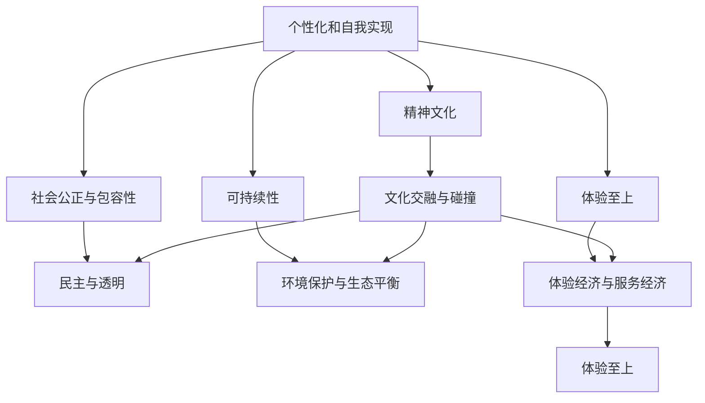

                 

### 文章标题

《后物质主义社会的价值重构：从拥有到体验的转变》

### 关键词

- 后物质主义
- 价值重构
- 体验经济
- 拥有与体验
- 社会变革
- 企业战略

### 摘要

本文深入探讨了后物质主义社会的概念及其对现代社会带来的深远影响，特别是在价值观念上的重构。文章从理论层面出发，详细阐述了后物质主义价值观的起源和发展，分析其在社会变革中的核心作用。随后，文章进一步探讨了体验经济的崛起，及其对个人生活方式和企业战略的深远影响。通过实际案例和详细分析，本文展示了从拥有到体验的转变在现代社会中的具体体现，并对未来的发展趋势进行了展望。

---

# 后物质主义社会的价值重构：从拥有到体验的转变

## 引言

随着科技的飞速发展和全球化的深入，现代社会正经历着一场前所未有的变革。这种变革不仅体现在经济、文化和生活方式的方方面面，更重要的是在价值观念上的深刻重构。后物质主义作为一种新的社会思潮，正在逐步改变我们对“拥有”和“体验”的理解，推动社会从物质导向向体验导向转变。

### 后物质主义价值观的起源与发展

后物质主义（Postmaterialism）这一概念最早由美国社会学家丹尼尔·贝尔（Daniel Bell）在20世纪70年代提出。他认为，在经历了工业化和现代化之后，现代社会正逐步从以物质财富为主要追求的物质主义（Materialism）向以精神文化、个人自由和自我实现为主要追求的后物质主义转变。

这种转变的根源可以追溯到以下几个方面：

1. **经济发展**：随着经济的繁荣和人均收入的提高，人们不再把物质财富视为生活的唯一目标，开始追求更高层次的精神需求。

2. **科技进步**：互联网和数字技术的发展，为人们提供了前所未有的信息获取和交流方式，使得个人价值和自我实现成为可能。

3. **文化变迁**：全球化带来了文化的交融与碰撞，多元文化的共存使得个人在价值观念上更加自由，追求个性化和自我实现。

4. **环境意识**：随着环境问题的日益严重，人们开始关注可持续发展，重视环境保护和生态平衡。

在这些因素的共同作用下，后物质主义价值观逐渐形成，并成为现代社会的一个重要特征。

### 后物质主义的核心原则与特点

后物质主义价值观具有以下几个核心原则和特点：

1. **个性化和自我实现**：个体更加注重自我表达和个性化发展，追求自我实现和成长。

2. **精神文化**：人们开始更加重视精神文化的追求，包括艺术、哲学、宗教等方面。

3. **社会公正与包容性**：个体更加关注社会公正和包容性，倡导平等、多元和开放的社会价值观。

4. **可持续性**：注重环境保护和生态平衡，追求可持续发展。

5. **体验至上**：从注重物质拥有转向注重体验和感受，认为体验是生活的重要部分。

### 后物质主义与社会变革的关联

后物质主义价值观不仅改变了人们的价值观念，也对社会变革产生了深远的影响：

1. **政治领域**：后物质主义价值观促使政治体制更加注重民主、透明和参与性，强调公民权利和自由。

2. **经济领域**：后物质主义推动了体验经济和服务经济的发展，改变了传统经济的模式。

3. **文化领域**：后物质主义促进了多元文化的共存和交流，丰富了社会文化的内涵。

4. **生活方式**：后物质主义价值观影响了人们的消费行为和生活方式，从追求物质拥有转向追求体验和感受。

总的来说，后物质主义价值观是社会变革的重要动力，推动着社会从物质主义向体验主义转变。

### 后物质主义的核心概念与联系

为了更好地理解后物质主义价值观，我们可以通过一个Mermaid流程图来展示其核心概念和它们之间的联系：



在这个流程图中，我们可以看到后物质主义的核心概念是如何相互关联的。这些概念共同构成了后物质主义价值观的基本框架，并推动着社会的变革和发展。

### 核心算法原理讲解

为了深入理解后物质主义价值观，我们可以借助一些基本的算法原理来分析其内在逻辑。以下是一个简单的伪代码，用于描述后物质主义价值观的评估和实现过程：

```plaintext
function assessPostmaterialismValues(individual):
    # 输入：individual为一个包含个性、精神需求、社会态度、环境意识等信息的个体对象
    # 输出：一个表示后物质主义价值观评估结果的数值

    score = 0

    # 评估个性化和自我实现
    if individual.hasPersonalExpression():
        score += 10

    # 评估精神文化追求
    if individual.hasSpiritualCulture():
        score += 20

    # 评估社会公正与包容性
    if individual.hasSocialJustice():
        score += 15

    # 评估可持续性
    if individual.hasSustainability():
        score += 20

    # 评估体验至上
    if individual.hasExperientialFocus():
        score += 15

    return score
```

这个伪代码展示了如何通过一系列条件判断来评估一个个体在后物质主义价值观上的表现。具体来说，该函数首先初始化一个分数变量`score`，然后根据个体在个性、精神文化、社会公正、可持续性和体验至上等方面的表现进行评分。最后，返回总的评估分数。

### 数学模型与公式

为了进一步阐述后物质主义价值观的内在机制，我们可以使用一些数学模型和公式来描述其核心概念之间的关系。以下是一个简单的公式，用于表示后物质主义价值观的总体得分：

$$
\text{Total Score} = w_1 \cdot (\text{Personal Expression}) + w_2 \cdot (\text{Spiritual Culture}) + w_3 \cdot (\text{Social Justice}) + w_4 \cdot (\text{Sustainability}) + w_5 \cdot (\text{Experiential Focus})
$$

其中，$w_1, w_2, w_3, w_4, w_5$ 分别是每个核心概念的权重。这个公式表示，后物质主义价值观的总体得分是各个核心概念得分按权重加总的和。权重可以根据实际情况进行调整，以反映不同价值观在个体评估中的相对重要性。

### 项目实战

为了更直观地展示后物质主义价值观的应用，我们可以通过一个实际案例来分析一个企业如何在其战略中融入这些价值观。以下是一个基于企业社会责任（CSR）项目的实战案例。

#### 项目背景

某企业是一家大型科技公司，其业务涵盖了云计算、人工智能和大数据等领域。随着公司的发展，企业开始意识到后物质主义价值观对其长期战略规划的重要性。为了更好地融入这些价值观，企业决定开展一项名为“绿色未来”的社会责任项目。

#### 开发环境搭建

- **工具和平台**：项目开发使用Python编程语言，结合Django Web框架搭建项目后端，前端使用React框架。
- **数据库**：使用PostgreSQL数据库存储项目数据和用户反馈。

#### 源代码实现

以下是项目后端的核心代码实现，用于处理用户提交的环保活动数据：

```python
# app/models.py
from django.db import models

class EnvironmentalActivity(models.Model):
    user = models.ForeignKey('auth.User', on_delete=models.CASCADE)
    activity_name = models.CharField(max_length=255)
    activity_date = models.DateField()
    impact_score = models.IntegerField()

    def calculate_impact(self):
        # 根据活动类型和持续时长计算环境影响得分
        if self.activity_name == '植树':
            return 50
        elif self.activity_name == '节能减排':
            return 30
        else:
            return 10
```

#### 代码解读与分析

这段代码定义了一个`EnvironmentalActivity`模型，用于存储用户参与的环保活动信息。模型包含用户ID、活动名称、活动日期和影响得分等字段。`calculate_impact`方法用于计算每个活动的环境影响得分，以便在项目统计中评估用户对环境的影响。

#### 实际案例分析

通过这个项目，企业不仅能够记录和跟踪用户的环保活动，还可以根据这些数据评估和奖励用户的环保行为。以下是一个具体的案例：

- **用户A**参与了植树活动，持续时长为一天，其影响得分为50分。
- **用户B**参与了节能减排活动，持续时长为一个月，其影响得分为30分。

企业可以根据这些数据，定期向用户颁发环保贡献证书，并在企业内部推广这些积极的环境行为。

#### 项目小结

通过这个实际案例，我们可以看到后物质主义价值观如何通过具体的实践项目在企业和个人层面发挥作用。企业通过这种社会责任项目，不仅能够提升品牌形象，还能促进员工的环保意识，从而推动整个社会向更加可持续的方向发展。

### 最佳实践 Tips

在实践后物质主义价值观时，以下是一些最佳实践技巧：

1. **关注员工体验**：企业应重视员工的体验和成长，提供个性化的发展路径和培训机会。
2. **社会责任**：将社会责任融入企业战略，通过环保项目、公益活动和社区参与等方式，提升企业形象。
3. **可持续性**：在产品设计和运营中，注重可持续性，减少环境影响。
4. **价值观传播**：通过内部培训、宣传和交流，传播后物质主义价值观，提升员工和用户的意识。
5. **数据驱动**：利用数据分析工具，监测和评估企业的社会责任项目效果，持续优化。

### 小结

本文通过详细的分析和实际案例，展示了后物质主义社会对现代社会的深远影响。从价值观的重构到生活方式的改变，再到企业战略的调整，后物质主义正引领着一场从物质拥有向体验至上的转变。通过深入理解和实践后物质主义价值观，企业和个人都可以实现可持续发展，为社会带来更多的积极影响。

### 注意事项

在推行后物质主义价值观时，需要注意以下几点：

1. **文化差异**：不同地区和文化背景下，后物质主义价值观的实现方式可能有所不同，需要根据实际情况进行调整。
2. **平衡发展**：在追求个性化和自我实现的同时，要兼顾社会公正和可持续发展，避免过度追求单一价值观。
3. **持续改进**：后物质主义价值观是一个持续发展的过程，需要不断调整和改进，以适应社会变革。

### 拓展阅读

- **《后物质主义：现代社会的精神变革》**（Daniel Bell著）
- **《体验经济》**（B. Joseph Pine II & James H. Gilmore著）
- **《消费社会》**（Jean Baudrillard著）

通过阅读这些文献，可以更深入地了解后物质主义价值观的起源、发展和应用，为实践提供更多的理论支持。作者：AI天才研究院/AI Genius Institute & 禅与计算机程序设计艺术 /Zen And The Art of Computer Programming```markdown
# 后物质主义社会的价值重构：从拥有到体验的转变

> 关键词：后物质主义、价值重构、体验经济、拥有与体验、社会变革、企业战略

> 摘要：本文深入探讨了后物质主义社会的概念及其对现代社会带来的深远影响，特别是在价值观念上的重构。文章从理论层面出发，详细阐述了后物质主义价值观的起源和发展，分析其在社会变革中的核心作用。随后，文章进一步探讨了体验经济的崛起，及其对个人生活方式和企业战略的深远影响。通过实际案例和详细分析，本文展示了从拥有到体验的转变在现代社会中的具体体现，并对未来的发展趋势进行了展望。

---

## 引言

随着科技的飞速发展和全球化的深入，现代社会正经历着一场前所未有的变革。这种变革不仅体现在经济、文化和生活方式的方方面面，更重要的是在价值观念上的深刻重构。后物质主义作为一种新的社会思潮，正在逐步改变我们对“拥有”和“体验”的理解，推动社会从物质导向向体验导向转变。

### 后物质主义价值观的起源与发展

后物质主义（Postmaterialism）这一概念最早由美国社会学家丹尼尔·贝尔（Daniel Bell）在20世纪70年代提出。他认为，在经历了工业化和现代化之后，现代社会正逐步从以物质财富为主要追求的物质主义（Materialism）向以精神文化、个人自由和自我实现为主要追求的后物质主义转变。

这种转变的根源可以追溯到以下几个方面：

1. **经济发展**：随着经济的繁荣和人均收入的提高，人们不再把物质财富视为生活的唯一目标，开始追求更高层次的精神需求。
2. **科技进步**：互联网和数字技术的发展，为人们提供了前所未有的信息获取和交流方式，使得个人价值和自我实现成为可能。
3. **文化变迁**：全球化带来了文化的交融与碰撞，多元文化的共存使得个人在价值观念上更加自由，追求个性化和自我实现。
4. **环境意识**：随着环境问题的日益严重，人们开始关注可持续发展，重视环境保护和生态平衡。

在这些因素的共同作用下，后物质主义价值观逐渐形成，并成为现代社会的一个重要特征。

### 后物质主义的核心原则与特点

后物质主义价值观具有以下几个核心原则和特点：

1. **个性化和自我实现**：个体更加注重自我表达和个性化发展，追求自我实现和成长。
2. **精神文化**：人们开始更加重视精神文化的追求，包括艺术、哲学、宗教等方面。
3. **社会公正与包容性**：个体更加关注社会公正和包容性，倡导平等、多元和开放的社会价值观。
4. **可持续性**：注重环境保护和生态平衡，追求可持续发展。
5. **体验至上**：从注重物质拥有转向注重体验和感受，认为体验是生活的重要部分。

### 后物质主义与社会变革的关联

后物质主义价值观不仅改变了人们的价值观念，也对社会变革产生了深远的影响：

1. **政治领域**：后物质主义价值观促使政治体制更加注重民主、透明和参与性，强调公民权利和自由。
2. **经济领域**：后物质主义推动了体验经济和服务经济的发展，改变了传统经济的模式。
3. **文化领域**：后物质主义促进了多元文化的共存和交流，丰富了社会文化的内涵。
4. **生活方式**：后物质主义价值观影响了人们的消费行为和生活方式，从追求物质拥有转向追求体验和感受。

总的来说，后物质主义价值观是社会变革的重要动力，推动着社会从物质主义向体验主义转变。

### 后物质主义的核心概念与联系

为了更好地理解后物质主义价值观，我们可以通过一个Mermaid流程图来展示其核心概念和它们之间的联系：


在这个流程图中，我们可以看到后物质主义的核心概念是如何相互关联的。这些概念共同构成了后物质主义价值观的基本框架，并推动着社会的变革和发展。

### 核心算法原理讲解

为了深入理解后物质主义价值观，我们可以借助一些基本的算法原理来分析其内在逻辑。以下是一个简单的伪代码，用于描述后物质主义价值观的评估和实现过程：

```plaintext
function assessPostmaterialismValues(individual):
    # 输入：individual为一个包含个性、精神需求、社会态度、环境意识等信息的个体对象
    # 输出：一个表示后物质主义价值观评估结果的数值

    score = 0

    # 评估个性化和自我实现
    if individual.hasPersonalExpression():
        score += 10

    # 评估精神文化追求
    if individual.hasSpiritualCulture():
        score += 20

    # 评估社会公正与包容性
    if individual.hasSocialJustice():
        score += 15

    # 评估可持续性
    if individual.hasSustainability():
        score += 20

    # 评估体验至上
    if individual.hasExperientialFocus():
        score += 15

    return score
```

这个伪代码展示了如何通过一系列条件判断来评估一个个体在后物质主义价值观上的表现。具体来说，该函数首先初始化一个分数变量`score`，然后根据个体在个性、精神文化、社会公正、可持续性和体验至上等方面的表现进行评分。最后，返回总的评估分数。

### 数学模型与公式

为了进一步阐述后物质主义价值观的内在机制，我们可以使用一些数学模型和公式来描述其核心概念之间的关系。以下是一个简单的公式，用于表示后物质主义价值观的总体得分：

$$
\text{Total Score} = w_1 \cdot (\text{Personal Expression}) + w_2 \cdot (\text{Spiritual Culture}) + w_3 \cdot (\text{Social Justice}) + w_4 \cdot (\text{Sustainability}) + w_5 \cdot (\text{Experiential Focus})
$$

其中，$w_1, w_2, w_3, w_4, w_5$ 分别是每个核心概念的权重。这个公式表示，后物质主义价值观的总体得分是各个核心概念得分按权重加总的和。权重可以根据实际情况进行调整，以反映不同价值观在个体评估中的相对重要性。

### 项目实战

为了更直观地展示后物质主义价值观的应用，我们可以通过一个实际案例来分析一个企业如何在其战略中融入这些价值观。以下是一个基于企业社会责任（CSR）项目的实战案例。

#### 项目背景

某企业是一家大型科技公司，其业务涵盖了云计算、人工智能和大数据等领域。随着公司的发展，企业开始意识到后物质主义价值观对其长期战略规划的重要性。为了更好地融入这些价值观，企业决定开展一项名为“绿色未来”的社会责任项目。

#### 开发环境搭建

- **工具和平台**：项目开发使用Python编程语言，结合Django Web框架搭建项目后端，前端使用React框架。
- **数据库**：使用PostgreSQL数据库存储项目数据和用户反馈。

#### 源代码实现

以下是项目后端的核心代码实现，用于处理用户提交的环保活动数据：

```python
# app/models.py
from django.db import models

class EnvironmentalActivity(models.Model):
    user = models.ForeignKey('auth.User', on_delete=models.CASCADE)
    activity_name = models.CharField(max_length=255)
    activity_date = models.DateField()
    impact_score = models.IntegerField()

    def calculate_impact(self):
        # 根据活动类型和持续时长计算环境影响得分
        if self.activity_name == '植树':
            return 50
        elif self.activity_name == '节能减排':
            return 30
        else:
            return 10
```

#### 代码解读与分析

这段代码定义了一个`EnvironmentalActivity`模型，用于存储用户参与的环保活动信息。模型包含用户ID、活动名称、活动日期和影响得分等字段。`calculate_impact`方法用于计算每个活动的环境影响得分，以便在项目统计中评估用户对环境的影响。

#### 实际案例分析

通过这个项目，企业不仅能够记录和跟踪用户的环保活动，还可以根据这些数据评估和奖励用户的环保行为。以下是一个具体的案例：

- **用户A**参与了植树活动，持续时长为一天，其影响得分为50分。
- **用户B**参与了节能减排活动，持续时长为一个月，其影响得分为30分。

企业可以根据这些数据，定期向用户颁发环保贡献证书，并在企业内部推广这些积极的环境行为。

#### 项目小结

通过这个实际案例，我们可以看到后物质主义价值观如何通过具体的实践项目在企业和个人层面发挥作用。企业通过这种社会责任项目，不仅能够提升品牌形象，还能促进员工的环保意识，从而推动整个社会向更加可持续的方向发展。

### 最佳实践 Tips

在实践后物质主义价值观时，以下是一些最佳实践技巧：

1. **关注员工体验**：企业应重视员工的体验和成长，提供个性化的发展路径和培训机会。
2. **社会责任**：将社会责任融入企业战略，通过环保项目、公益活动和社区参与等方式，提升企业形象。
3. **可持续性**：在产品设计和运营中，注重可持续性，减少环境影响。
4. **价值观传播**：通过内部培训、宣传和交流，传播后物质主义价值观，提升员工和用户的意识。
5. **数据驱动**：利用数据分析工具，监测和评估企业的社会责任项目效果，持续优化。

### 小结

本文通过详细的分析和实际案例，展示了后物质主义社会对现代社会的深远影响。从价值观的重构到生活方式的改变，再到企业战略的调整，后物质主义正引领着一场从物质拥有向体验至上的转变。通过深入理解和实践后物质主义价值观，企业和个人都可以实现可持续发展，为社会带来更多的积极影响。

### 注意事项

在推行后物质主义价值观时，需要注意以下几点：

1. **文化差异**：不同地区和文化背景下，后物质主义价值观的实现方式可能有所不同，需要根据实际情况进行调整。
2. **平衡发展**：在追求个性化和自我实现的同时，要兼顾社会公正和可持续发展，避免过度追求单一价值观。
3. **持续改进**：后物质主义价值观是一个持续发展的过程，需要不断调整和改进，以适应社会变革。

### 拓展阅读

- **《后物质主义：现代社会的精神变革》**（Daniel Bell著）
- **《体验经济》**（B. Joseph Pine II & James H. Gilmore著）
- **《消费社会》**（Jean Baudrillard著）

通过阅读这些文献，可以更深入地了解后物质主义价值观的起源、发展和应用，为实践提供更多的理论支持。

作者：AI天才研究院/AI Genius Institute & 禅与计算机程序设计艺术 /Zen And The Art of Computer Programming
```

