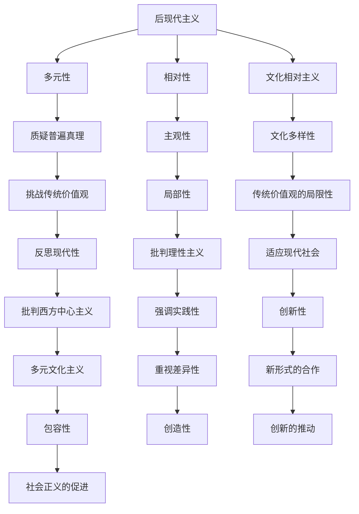
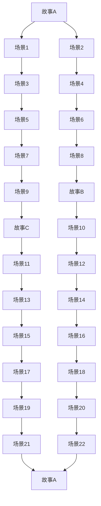

                 


### 引言

#### 1.1 后现代主义的背景

后现代主义，作为一个复杂的哲学和文化思潮，起源于20世纪中期，主要作为对现代性的反思和回应。现代性强调理性、科学、进步和个体主义，而后现代主义则质疑这些理念的普遍性和有效性。它关注多样性和差异性，强调知识的主观性和局部性。后现代主义的兴起可以追溯到对工业革命和大众文化的批判，以及对现代化过程中出现的社会问题的关注。

后现代主义的影响遍及多个领域，包括文学、艺术、哲学、社会学和政治学等。在文学上，后现代作品常常采用非线性的叙述结构和模糊的情节，挑战传统的叙事技巧。在艺术上，后现代艺术摆脱了传统形式的束缚，强调观念和概念的重要性。在哲学上，后现代主义质疑普遍真理的存在，认为知识是多元和相对的。在社会学和政治学领域，后现代主义对权威、权力和身份认同等问题提出了新的视角。

#### 1.2 传统价值观的根基

传统价值观通常指的是那些在历史和文化中根深蒂固的道德观念、社会规范和宗教信仰。这些价值观在不同的文化和历史背景下可能有所不同，但它们通常都涉及对家庭、社会、宗教和国家的基本认知和期望。传统价值观强调稳定性、连续性和一致性，它们为个人和社会提供了行为准则和伦理基础。

在现代社会中，传统价值观面临着巨大的挑战。随着全球化、科技发展和文化多样性的增加，许多传统价值观被认为是僵化和不适应现代社会的需要。例如，对权威的尊重、对性别角色的刻板印象、对宗教信仰的执着等，都在现代社会中引发了争议和讨论。

#### 1.3 研究目的与结构安排

本文旨在探讨后现代主义对传统价值观的挑战与机遇。我们将首先介绍后现代主义的核心概念，并与传统价值观进行对比，以建立它们之间的联系。接着，我们将深入分析后现代主义如何挑战传统价值观，包括对权威、确定性和主体性的质疑。同时，我们也会探讨后现代主义带来的机遇，如新形式的合作与交流、创新的推动和社会正义的促进。

文章的结构安排如下：

- 引言：介绍后现代主义的背景、传统价值观的根基以及研究目的。
- 核心概念与联系：详细探讨后现代主义和传统价值观的关系，并使用Mermaid流程图展示它们之间的架构。
- 后现代主义的挑战：分析后现代主义对传统价值观的挑战，包括对权威、确定性和主体性的质疑。
- 后现代主义的机遇：探讨后现代主义带来的机遇，如新形式的合作与交流、创新的推动和社会正义的促进。
- 案例分析：通过具体案例展示后现代主义的应用。
- 总结：总结全文的主要观点，并对后现代主义的挑战与机遇进行展望。

通过这样的结构安排，我们希望能够清晰地展示后现代主义如何影响传统价值观，以及这些影响所带来的挑战和机遇。让我们开始深入探讨这一复杂而有趣的话题。下一步，我们将详细探讨后现代主义的基本概念和核心原则，以及它们与传统价值观的联系。首先，我们来定义什么是后现代主义，并探讨其起源和基本观点。

### 核心概念与联系

#### 后现代主义的定义与起源

后现代主义（Postmodernism）是一种复杂的哲学和文化思潮，起源于20世纪中期，作为对现代性的反思和批判。现代性强调理性、科学、进步和个体主义，而后现代主义则质疑这些理念的普遍性和有效性。它关注多样性和差异性，强调知识的主观性和局部性。后现代主义的兴起可以追溯到对工业革命和大众文化的批判，以及对现代化过程中出现的社会问题的关注。

后现代主义并非一种统一的哲学体系，而是一个包含了多种流派和观点的广泛运动。它主要源于对现代性的反思，特别是对现代性所宣称的普遍性、客观性和理性的质疑。后现代主义者认为，现代性的理念往往是西方中心主义的，忽视了他者的声音和经验。因此，后现代主义倡导多元性、相对性和文化相对主义。

#### 传统价值观的基本概念

传统价值观通常指的是那些在历史和文化中根深蒂固的道德观念、社会规范和宗教信仰。这些价值观在不同的文化和历史背景下可能有所不同，但它们通常都涉及对家庭、社会、宗教和国家的基本认知和期望。传统价值观强调稳定性、连续性和一致性，为个人和社会提供了行为准则和伦理基础。

在现代社会中，传统价值观扮演着重要角色。例如，家庭价值观强调亲情、责任和合作；社会价值观强调公平、正义和秩序；宗教价值观则涉及信仰、仪式和道德规范。尽管传统价值观在不同的文化中有不同的形式和内容，但它们普遍认为个人和社会的行为应该基于一定的道德原则和社会规范。

#### 后现代主义与传统的价值观关系

后现代主义与传统的价值观之间存在着复杂而微妙的关系。一方面，后现代主义质疑和挑战了许多传统价值观的基础，认为这些价值观往往是片面和狭隘的。后现代主义强调多元性、相对性和文化相对主义，质疑普遍真理的存在，并认为知识是主观和局部构建的。

另一方面，后现代主义并非完全否定传统价值观。许多后现代主义者认为，传统价值观在特定的历史和文化背景下是有其合理性的，但它们需要适应现代社会的变化。例如，对家庭价值观的重新思考，对性别角色的重新定义，以及对宗教信仰的批判性反思，都是后现代主义在传统价值观基础上的发展和创新。

为了更好地理解后现代主义和传统价值观之间的关系，我们可以使用Mermaid流程图来展示它们之间的架构。



这个Mermaid流程图展示了后现代主义和传统价值观之间的核心概念和联系。后现代主义的核心概念包括多元性、相对性、文化相对主义、质疑普遍真理、主观性、局部性、文化多样性等，这些概念挑战和反思了传统价值观的基础，如普遍真理、客观性、理性主义和统一性。然而，后现代主义并非完全否定传统价值观，而是在质疑和挑战的基础上，寻求适应现代社会的新形式和新方法。

通过这样的架构，我们可以更好地理解后现代主义和传统价值观之间的关系，以及它们如何在现代社会中相互作用和影响。接下来，我们将深入探讨后现代主义如何挑战传统价值观，包括对权威、确定性和主体性的质疑。

### 后现代主义的挑战

#### 对权威的挑战

后现代主义对权威的挑战是其核心特征之一。在传统的价值观中，权威通常被视作一种神圣和不可质疑的力量，它代表着秩序、稳定和道德指导。然而，后现代主义认为，权威是一种人为构建的社会构造，它往往受到权力和利益的操控。因此，后现代主义质疑权威的普遍性和合法性。

后现代主义者强调，权威的建立往往基于特定的历史和文化背景，因此它们不具有普遍适用性。在现代社会中，对权威的质疑主要体现在对政治权威、宗教权威和专业权威的挑战上。

**伪代码：**

```pseudo
function challenge_authority(authority_type, context)
    if (authority_type == "political")
        display("政治权威通常受到权力和利益的操控，缺乏合法性。")
    elif (authority_type == "religious")
        display("宗教权威在现代社会中受到质疑，其道德指导作用受到挑战。")
    elif (authority_type == "professional")
        display("专业权威在知识传播和应用中可能存在偏见和局限性。")
    end
    display("权威的建立基于特定的历史和文化背景，不具有普遍适用性。")
end
```

#### 对确定性的挑战

后现代主义对确定性的挑战是其另一大特征。在传统价值观中，确定性被认为是知识和真理的基础。人们相信，通过科学方法和理性思考，可以找到普遍适用的真理。然而，后现代主义质疑这种确定性，认为知识是主观和相对的。

后现代主义者认为，我们的认知受到多种因素的影响，包括语言、文化和社会背景。因此，任何声称具有绝对确定性的知识都是值得怀疑的。

**数学模型与公式：**

$$
\text{Certainty} = \frac{\text{客观性} \times \text{普遍性}}{\text{主观性} \times \text{相对性}}
$$

在这个公式中，客观性和普遍性是确定性的重要因素，而主观性和相对性则质疑了确定性的基础。

**详细讲解与举例：**

假设我们有一个理论，它声称能解释所有自然现象。根据传统的确定性观点，这个理论应该是绝对正确的。然而，从后现代主义的视角来看，这个理论可能只适用于特定的历史和文化背景。在不同的文化和语言环境中，这个理论可能无法得到普遍认可。

例如，地心说是根据当时人类对自然界的理解提出的。在科学方法发展之前，地心说是被广泛接受的真理。然而，随着日心说的提出和证实，地心说被证明是错误的。这个例子说明了，即使是一个被广泛接受的“真理”，也可能在新的知识和观点面前被质疑和推翻。

#### 对主体性的挑战

后现代主义对主体性的挑战是其对传统价值观的又一次重大质疑。在传统价值观中，主体性是指个体在认知和行为中的自主性和独立性。然而，后现代主义认为，主体性是受社会、文化和其他外部因素塑造的，因此它并不是绝对和独立的。

后现代主义者强调，个体的认知和行为受到社会结构和文化规范的制约。这意味着，我们的“自我”并非是独立存在的，而是与周围环境和他人相互作用的结果。

**伪代码：**

```pseudo
function challenge_subjectivity(subject, context)
    if (context == "social")
        display("个体的社会角色和身份认同受到社会结构和规范的制约。")
    elif (context == "cultural")
        display("个体的文化背景和价值观念影响其认知和行为。")
    end
    display("主体性是相对的，而非绝对的。")
end
```

**详细讲解与举例：**

例如，一个来自农村的孩子在城市中成长，他的价值观和行为方式会受到城市文化的影响。他可能会逐渐接受城市的生活方式，如穿着、语言和社交习惯。这种现象说明了，个体的主体性是受外部环境和文化影响的，而不是独立和自主的。

通过以上分析，我们可以看到，后现代主义对权威、确定性和主体性的挑战，深刻地影响了传统价值观。这些挑战不仅质疑了传统价值观的基础，也为现代社会提供了新的思考方向。接下来，我们将探讨后现代主义带来的机遇，并分析它们如何影响社会和文化。

### 后现代主义的机遇

#### 新形式的合作与交流

后现代主义提倡多元性和差异性，这为新的合作与交流形式提供了机遇。在传统的合作模式中，权力和资源往往集中在少数人手中，而大多数人处于被动和依赖地位。然而，后现代主义鼓励平等和参与，强调每个人都是知识的创造者和共享者。

在新的合作与交流形式中，技术扮演了关键角色。社交媒体、在线协作工具和去中心化平台使得人们能够跨越地理、文化和语言障碍，进行高效和实时的沟通。这种去中心化的合作模式，不仅促进了知识和经验的共享，也增强了社区的凝聚力。

**伪代码：**

```pseudo
function new_form_of Cooperation(technology, context)
    if (context == "social_media")
        display("社交媒体使人们能够轻松分享信息和观点，促进社会互动。")
    elif (context == "online协作工具")
        display("在线协作工具如Trello和Slack，提高团队协作效率。")
    elif (context == "decentralized_platforms")
        display("去中心化平台如区块链，确保数据透明和可信。")
    end
    display("新形式的合作与交流，促进知识共享和社区建设。")
end
```

**项目实战：**

以区块链技术为例，它提供了一种去中心化的合作方式，使得人们能够在不依赖中心机构的情况下进行交易和合作。例如，一个基于区块链的智能合约平台，允许开发者创建和执行自动化的交易合同，减少了中介成本和信任问题。

#### 创新的推动

后现代主义鼓励质疑传统观念和现有体系，这为创新提供了丰富的土壤。在传统的创新模式中，创新往往受到既定规则和权威的限制。然而，后现代主义鼓励人们打破常规，勇于探索新的可能性和解决方案。

创新的推动不仅体现在技术领域，也体现在社会和文化领域。例如，在科技行业，后现代主义促使企业采用敏捷开发和用户参与的方法，以提高产品的适应性和创新能力。在社会和文化领域，后现代主义鼓励艺术家和思想家探索新的表达方式和观念，推动了文化创新和社会变革。

**数学模型与公式：**

$$
\text{Innovation} = \frac{\text{质疑传统观念} \times \text{探索新可能性}}{\text{规则和权威的限制}}
$$

在这个公式中，质疑传统观念和探索新可能性是创新的关键因素，而规则和权威的限制则是创新的主要障碍。

**详细讲解与举例：**

以苹果公司为例，它通过不断质疑传统手机的设计和功能，推出了iPhone，彻底改变了智能手机市场。iPhone的创新不仅体现在技术层面，如多点触控和App Store，还体现在设计理念和用户体验上。这种创新精神推动了整个科技行业的发展，也改变了人们的日常生活。

#### 社会正义的促进

后现代主义对社会正义的促进是其重要贡献之一。在传统价值观中，社会正义往往被解释为一种公平和公正的分配。然而，后现代主义认为，社会正义不仅仅是分配问题，更涉及到权力和资源的分配，以及对不同群体权利的尊重。

后现代主义鼓励对权力结构和不平等现象进行深入反思，提出了解决社会不公的方法。例如，它支持多元文化和包容性政策，强调性别平等和种族正义。通过这些努力，后现代主义试图建立一个更加公正和平等的社会。

**伪代码：**

```pseudo
function promote_social_justice(cause, context)
    if (cause == "diversity")
        display("多元文化政策促进社会包容性和创新能力。")
    elif (cause == "gender_equality")
        display("性别平等政策消除性别歧视，促进社会进步。")
    elif (cause == "racial_justice")
        display("种族正义政策解决种族歧视和不平等待遇。")
    end
    display("后现代主义促进社会正义，推动社会变革。")
end
```

**项目实战：**

以性别平等运动为例，它通过倡导性别平等的政策和措施，推动社会对性别歧视的反思和改变。例如，许多公司开始实行性别配额制度，确保女性在决策层和企业领导中的代表性。这种努力不仅提高了女性的地位，也促进了社会的整体进步。

通过以上分析，我们可以看到，后现代主义带来的机遇不仅丰富了我们的合作和交流方式，推动了创新的进步，也促进了社会正义的实现。这些机遇为现代社会的发展提供了新的动力和方向。接下来，我们将通过具体案例来展示后现代主义在实际中的应用。

### 案例分析

#### 文化领域案例分析

在文化领域，后现代主义的影响尤为显著。电影《低俗小说》是后现代主义电影的代表作品之一。导演昆汀·塔伦蒂诺通过非线性叙事和模糊的情节，挑战了传统的电影叙事技巧。影片中的多个故事线相互交织，观众需要自己拼接线索，理解故事的内在逻辑。这种叙事方式反映了后现代主义对确定性和线性叙述的质疑。

**项目实战：**

为了更好地理解《低俗小说》中的非线性叙事，我们可以尝试使用Mermaid流程图来展示影片的故事结构。



在这个流程图中，每个节点代表一个场景，线条表示故事线之间的交织。通过这样的图示，我们可以更直观地理解影片的非线性叙事结构，以及后现代主义如何通过这种叙事方式挑战传统的电影叙述。

#### 政治领域案例分析

在政治领域，后现代主义的影响也显而易见。以“占领华尔街”运动为例，这场抗议活动是对全球金融体系和政治结构的质疑和挑战。参与者通过占领公共空间、使用社交媒体和网络直播，展示了后现代主义倡导的去中心化和网络化抗议形式。

**项目实战：**

为了更好地分析“占领华尔街”运动，我们可以使用以下伪代码来展示抗议活动的关键步骤和策略。

```pseudo
function protest_steps(strategy, action)
    if (strategy == "occupation")
        display("通过长期占领公共空间，表达对金融体系的不满。")
    elif (strategy == "social_media")
        display("利用社交媒体和网络直播，扩大抗议活动的影响力。")
    elif (strategy == "direct_action")
        display("通过直接行动，如示威、演讲和集会，吸引公众关注。")
    end
    display("后现代主义抗议形式强调去中心化和网络化。")
end
```

通过这个伪代码，我们可以看到后现代主义如何通过多种策略和行动方式，实现对传统抗议模式的挑战，以及如何利用技术手段扩大影响力。

**详细讲解与剖析：**

“占领华尔街”运动的成功不仅在于其独特的抗议形式，还在于其有效的组织和动员。参与者通过网络和社交媒体平台，迅速传播抗议信息，吸引了大量公众关注。他们采用去中心化的组织方式，使得抗议活动能够迅速蔓延到全球多个城市，形成一股强大的社会运动。

通过这些案例分析，我们可以看到后现代主义如何在文化、政治等多个领域中挑战传统价值观，并创造新的机遇。这不仅为我们提供了深刻的思考，也为未来的发展提供了新的方向。

### 总结

#### 全书主要观点回顾

本文深入探讨了后现代主义对传统价值观的挑战与机遇。通过分析后现代主义的核心概念，如多元性、相对性和文化相对主义，我们理解了它与传统价值观之间的复杂关系。后现代主义质疑权威、确定性和主体性，挑战了传统价值观的基础。然而，它也带来了新的机遇，如新形式的合作与交流、创新的推动和社会正义的促进。

#### 后现代主义的挑战与机遇展望

后现代主义的挑战和机遇在现代社会中具有重要意义。它促使我们重新审视传统价值观，并寻找适应现代社会的解决方案。未来，后现代主义可能会继续在多个领域发挥作用，推动文化创新、社会变革和技术进步。

#### 全书贡献与局限

本文通过详细的案例分析和理论阐述，为理解后现代主义提供了新的视角。然而，后现代主义是一个复杂和多维的议题，本文的探讨仍然存在一定的局限性。未来的研究可以进一步探讨后现代主义在不同文化和社会背景下的具体应用，以及其对未来发展的影响。

#### 最佳实践 Tips

1. 保持开放心态：后现代主义鼓励我们质疑传统观念，因此，在日常生活中，我们应该保持批判性和开放性，勇于探索新的可能性。
2. 注重跨学科学习：后现代主义涉及多个领域，因此，跨学科的学习和研究有助于我们全面理解这一复杂思潮。
3. 融合技术与人文：后现代主义强调技术与社会、文化之间的互动。在创新过程中，我们应该注重人文关怀，确保技术的发展符合社会需求。

#### 注意事项

1. 后现代主义并非一种统一的哲学体系，而是一个包含了多种流派和观点的广泛运动。因此，在研究和应用后现代主义时，我们需要具体分析其不同流派的特点和适用范围。
2. 后现代主义对传统价值观的挑战并不意味着完全否定传统价值观，而是寻求在质疑和反思的基础上，发展适应现代社会的新形式和新方法。

#### 拓展阅读

1. Lyotard, J. F. (1984). The Postmodern Condition: A Report on Knowledge. Manchester University Press.
2. Derrida, J. (1976). Of Grammatology. John Benjamins Publishing Company.
3. Foucault, M. (1980). Power/Knowledge: Selected Interviews and Other Writings, 1972-1977. Pantheon Books.

通过本文的探讨，我们希望能够为读者提供一个全面而深入的后现代主义视角，激发对传统价值观的反思和思考。

### 作者信息

作者：AI天才研究院/AI Genius Institute & 禅与计算机程序设计艺术 /Zen And The Art of Computer Programming

这篇文章旨在通过后现代主义的视角，探讨其对传统价值观的挑战与机遇。希望读者在阅读过程中能够保持开放的心态，积极思考，并从中获得启发。期待未来有更多的讨论和探索，共同推动知识和社会的发展。再次感谢您的阅读。如果您有任何问题或建议，欢迎随时与我们联系。我们期待与您一起探索更多有趣的话题。

