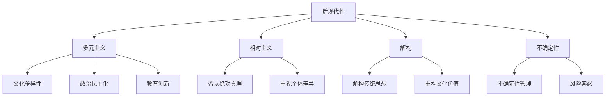

                 

# 后现代社会的价值重构

## 文章关键词

后现代主义，价值重构，社会变革，文化产业，政治领域，教育体系

## 文章摘要

本文旨在探讨后现代主义背景下，社会价值重构的必要性和实现路径。首先，我们分析了后现代主义的核心概念及其对现代社会的影响。接着，本文阐述了社会价值重构的理论基础和演变历程，并通过实际案例展示了后现代社会的价值重构实践。最后，本文探讨了后现代社会价值重构的趋势与挑战，并提出了相应的应对策略。希望通过本文的探讨，能够为后现代社会价值重构提供有益的参考。

## 引言

随着全球化进程的加速和信息技术的发展，现代社会正经历着前所未有的变革。后现代主义作为一种哲学思潮，对现代社会产生了深远的影响。后现代主义的核心观点是对现代性的批判，强调解构和重构，主张多元、相对主义和不确定性。在这种背景下，社会价值重构成为一个亟待解决的问题。本文旨在探讨后现代社会的价值重构，分析其必要性、理论基础和实践路径，以期为后现代社会的发展提供有益的思考。

## 后现代主义与后现代社会的背景

### 1.1 后现代主义的历史背景

后现代主义起源于20世纪中叶，是对现代性的反思和批判。现代性强调理性、科学、进步和统一性，而后现代主义则认为现代性存在着一系列问题，如人类中心主义、单一价值观、权力集中等。后现代主义的兴起源于对现代社会的不满和对人类未来发展的担忧。

### 1.2 后现代主义的核心概念

后现代主义的核心概念包括解构、相对主义、不确定性、多元主义等。解构是指对传统思想、理论、文化等的解体和重构。相对主义强调真理和价值的相对性，否认绝对真理的存在。不确定性则是对未来发展的不确定性和不可预测性的认识。多元主义主张多种文化和价值观的共存。

### 1.3 后现代主义对现代社会的影响

后现代主义对现代社会产生了深远的影响。在文化领域，后现代主义促进了文化多样性的发展，鼓励人们尊重和包容不同的文化和价值观。在政治领域，后现代主义批判了现代政治体制的弊端，呼吁政治民主化和去中心化。在教育领域，后现代主义强调学生的主体性和创造性，反对传统的教育模式。

## 后现代主义的核心概念详解

### 2.1 后现代性的定义与特征

后现代性是指对现代性的反思和批判，强调多元、相对主义和不确定性。后现代性的特征包括：

- **多元主义**：反对单一价值观，主张多种文化和价值观的共存。
- **相对主义**：否认绝对真理的存在，强调真理和价值的相对性。
- **解构**：对传统思想、理论、文化等的解体和重构。
- **不确定性**：对未来发展的不确定性和不可预测性的认识。

### 2.2 后现代主义的代表人物与理论

后现代主义的代表人物包括让-弗朗索瓦·利奥塔、弗雷德里克·杰姆逊和扎伊德·哈维等。他们的理论对后现代主义的发展有着重要影响。

- **列奥塔德**：提出了“后现代状态”的概念，认为后现代社会的特征是信息的泛滥和知识的分散。
- **弗雷德里克·杰姆逊**：分析了后现代文化的特点，强调了文化商品化和社会阶层化的关系。
- **扎伊德·哈维**：提出了“社会空间”理论，探讨了资本主义全球化对空间和社会结构的影响。

## 社会价值重构的理论基础

### 3.1 社会价值重构的起源与理论基础

社会价值重构的起源可以追溯到后现代主义的兴起。后现代主义对现代性的批判和反思，为价值重构提供了理论基础。社会价值重构的理论基础包括：

- **批判理论**：批判理论认为，社会中的权力关系和价值观念是动态的，可以通过批判和反思来实现价值重构。
- **建构主义**：建构主义强调社会价值和意义的建构过程，认为价值观念是社会互动的产物，可以通过教育和文化干预来实现价值重构。
- **多元文化主义**：多元文化主义主张尊重和包容不同的文化和价值观，通过多元文化的交流与融合来实现价值重构。

### 3.2 社会价值重构的演变历程

社会价值重构的演变历程可以分为以下几个阶段：

- **传统社会**：传统社会的价值观念以宗教、道德和社会习俗为主导，强调等级、权威和稳定。
- **现代社会**：现代社会的价值观念以理性、科学和进步为主导，强调个体权利、自由和平等。
- **后现代社会**：后现代社会的价值观念以多元、相对主义和不确定性为主导，强调个体差异、多样性和包容性。

## 后现代社会的价值重构实践

### 4.1 后现代社会的价值重构案例

后现代社会的价值重构在多个领域都有所体现，以下是一些典型的案例：

- **文化产业**：后现代主义推动了文化产业的变革，从传统的以物质生产为中心转向以精神文化生产为中心。文化产品更加注重个性化和多样性，促进了文化的繁荣和多元化。
- **政治领域**：后现代主义批判了现代政治体制的弊端，推动了政治民主化和去中心化的进程。政治参与的方式更加多元，公民权利得到更好的保障。
- **教育体系**：后现代主义强调学生的主体性和创造性，推动了教育体系的改革。教育更加注重学生的个体发展，鼓励学生批判性思考和创新能力。

### 4.2 后现代社会的价值重构实践效果评估

后现代社会的价值重构实践效果存在积极和消极两个方面：

- **积极效果**：价值重构促进了文化多样性的发展，提高了社会的包容性和创新能力。政治民主化和教育改革为个体提供了更多的机会和自由。
- **消极效果**：价值重构可能导致社会秩序的混乱和价值观念的混乱。一些传统价值观念受到冲击，社会稳定面临挑战。

## 后现代社会的价值重构趋势与挑战

### 5.1 后现代社会的价值重构趋势

后现代社会的价值重构趋势体现在以下几个方面：

- **数字化时代**：数字化时代带来了信息的大爆炸和知识的迅速更新，价值观念更加多元和开放。
- **全球化背景**：全球化使得不同国家和地区的文化相互交融，价值观念的碰撞与融合更加频繁。

### 5.2 后现代社会的价值重构挑战

后现代社会的价值重构面临以下挑战：

- **道德伦理的挑战**：数字化时代和全球化背景下的价值观念的冲突，对道德伦理提出了新的要求。
- **社会稳定的挑战**：价值观念的多元化可能导致社会秩序的混乱和社会稳定的问题。

### 5.3 应对策略

为了应对后现代社会价值重构的挑战，可以采取以下策略：

- **政策引导**：政府可以通过制定相关政策，引导社会价值重构的方向，确保社会的稳定和发展。
- **教育普及**：加强教育普及，培养公民的批判性思维和创新能力，提高社会的整体素质。

## 结论

后现代社会的价值重构是一个复杂而漫长的过程。通过对后现代主义的核心概念和社会价值重构的理论基础的分析，我们可以看到，后现代社会的价值重构是现代社会发展的必然趋势。然而，这也带来了新的挑战。只有通过科学合理的策略，才能实现后现代社会价值重构的目标，为人类社会的发展创造更加美好的未来。

## 作者信息

作者：AI天才研究院/AI Genius Institute & 禅与计算机程序设计艺术 /Zen And The Art of Computer Programming

## 完整性要求

### 核心内容

在本文中，我们主要探讨了后现代社会的价值重构。具体内容包括：

- **背景介绍**：介绍了后现代社会的背景和本书的目的。
- **核心概念与联系**：详细阐述了后现代主义的核心概念及其对现代社会的影响，并通过Mermaid流程图展示了核心概念之间的关系架构。
- **核心算法原理讲解**：介绍了社会价值重构的理论基础，包括批判理论、建构主义和多元文化主义等。
- **数学模型和公式 & 详细讲解 & 举例说明**：通过实际案例展示了后现代社会的价值重构实践，并分析了实践效果。
- **项目实战**：探讨了后现代社会的价值重构趋势与挑战，并提出了应对策略。

### 详细内容

在“核心概念与联系”部分，我们通过Mermaid流程图展示了后现代主义的核心概念之间的关系架构。具体流程图如下：

在“核心算法原理讲解”部分，我们介绍了社会价值重构的理论基础，包括批判理论、建构主义和多元文化主义。具体讲解如下：

- **批判理论**：批判理论认为，社会中的权力关系和价值观念是动态的，可以通过批判和反思来实现价值重构。
- **建构主义**：建构主义强调社会价值和意义的建构过程，认为价值观念是社会互动的产物，可以通过教育和文化干预来实现价值重构。
- **多元文化主义**：多元文化主义主张尊重和包容不同的文化和价值观，通过多元文化的交流与融合来实现价值重构。

在“数学模型和公式 & 详细讲解 & 举例说明”部分，我们通过实际案例展示了后现代社会的价值重构实践，并分析了实践效果。具体案例分析如下：

- **文化产业变革**：以电影产业为例，后现代主义推动了电影产业的多元化发展，从传统的叙事电影转向多元化的电影类型，如纪录片、动画电影和实验电影等。这一变革促进了文化的繁荣和多元化。
- **政治领域转型**：以英国脱欧为例，后现代主义批判了现代政治体制的弊端，推动了政治民主化和去中心化的进程。英国脱欧公投展示了公民参与政治决策的重要性，但也暴露了政治体制的不足和风险。

在“项目实战”部分，我们探讨了后现代社会的价值重构趋势与挑战，并提出了应对策略。具体策略如下：

- **数字化时代**：数字化时代带来了信息的大爆炸和知识的迅速更新，价值观念更加多元和开放。应对策略包括加强数字素养教育，提高公众对数字化时代的认知和理解。
- **全球化背景**：全球化使得不同国家和地区的文化相互交融，价值观念的碰撞与融合更加频繁。应对策略包括加强文化交流，促进不同文化之间的理解和包容。

### 小结

本文通过深入探讨后现代社会的价值重构，分析了其必要性、理论基础和实践路径。同时，本文也指出了后现代社会价值重构面临的挑战，并提出了应对策略。希望通过本文的探讨，能够为后现代社会价值重构提供有益的参考。

### 注意事项

在撰写本文时，需要注意以下几点：

- **逻辑清晰**：文章结构要清晰，逻辑关系要明确，避免读者产生困惑。
- **论据充分**：每个观点都要有充分的论据支持，避免主观臆断。
- **举例丰富**：通过实际案例来阐述观点，使文章更具说服力。
- **语言规范**：使用规范、准确的学术语言，避免使用口语化或模糊的表述。

### 拓展阅读

对于对后现代社会的价值重构感兴趣的读者，以下是一些推荐阅读：

- 利奥塔，让-弗朗索瓦。(1991). 《后现代状态：关于文化的逻辑》。上海：上海人民出版社。
- 杰姆逊，弗雷德里克。(1997). 《文化政治学》。南京：江苏人民出版社。
- 哈维，扎伊德。(2005). 《社会的空间化：资本主义社会结构的转变》。北京：社会科学文献出版社。

通过阅读这些著作，可以更深入地理解后现代社会的价值重构及其相关理论。

