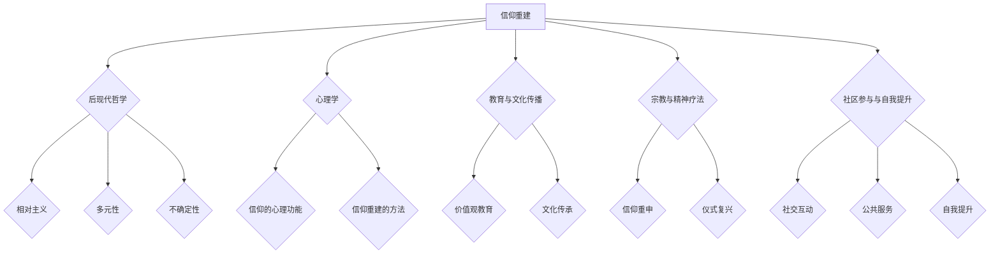

                 


### 文章标题：后现代社会的信仰重建：在多元化中寻找精神寄托

> 关键词：后现代社会、信仰重建、多元化、精神寄托、心理疗法、教育文化、社会影响

> 摘要：本文深入探讨了后现代社会中信仰重建的问题，分析了信仰的本质、类型及其在多元化社会中的重要性。通过理论讲解和实践案例，本文提出了信仰重建的方法与实践，并探讨了信仰重建对社会和个人带来的影响，以及未来的展望。

#### 第一部分：引言与核心概念

##### 1.1 引言

随着社会的变迁和科技的进步，后现代社会的特点日益显著。在这个多元化的社会中，信仰的重建成为了一个重要议题。本部分将介绍后现代社会的特点，阐述信仰重建的重要性，并简要介绍本文的结构和目标。

##### 1.2 核心概念

在探讨信仰重建之前，我们需要了解一些核心概念，包括后现代主义、信仰的本质与类型。通过这些核心概念的理解，我们将为后续的分析和实践打下基础。

#### 第二部分：社会背景分析

##### 2.1 社会变迁与信仰危机

本部分将分析后现代社会的变迁，以及这种变迁如何导致了信仰危机。我们将探讨信仰危机的表现和原因，为信仰重建提供背景。

##### 2.2 多元化社会中的信仰冲突

多元化社会带来了文化多样性和价值观念的冲突。本部分将分析这些冲突对信仰的影响，并提出解决信仰冲突的方法。

#### 第三部分：信仰重建的方法与实践

##### 3.1 信仰重建的理论基础

信仰重建需要理论基础的支持。本部分将介绍后现代哲学和心理学对信仰重建的理论贡献，并探讨这些理论如何应用于实践。

##### 3.2 信仰重建的实践方法

信仰重建需要具体的实践方法。本部分将介绍教育与文化传播、宗教与精神疗法等实践方法，并提供相关案例研究。

##### 3.3 信仰重建的案例研究

通过具体的案例研究，我们可以更好地理解信仰重建的实践过程和效果。本部分将分析成功和失败的案例，并提出信仰重建的挑战和应对策略。

#### 第四部分：信仰重建的影响与未来展望

##### 4.1 信仰重建的社会影响

信仰重建对社会和个人都产生了深远的影响。本部分将分析这些影响，并探讨信仰重建对社会稳定的贡献。

##### 4.2 信仰重建的未来展望

未来，信仰重建将继续面临挑战和机遇。本部分将分析未来信仰重建的趋势和机遇，并提出相关的挑战和对策。

#### 第五部分：附录

##### 5.1 参考文献

在本部分，我们将列出本文引用的相关参考文献，以供读者进一步研究和参考。

### 文章正文

接下来，我们将按照上述结构逐步展开文章的正文部分，深入探讨每一个主题，提供详细的理论讲解和实践案例。

#### 第一部分：引言与核心概念

##### 1.1 引言

后现代社会的特点包括全球化、多元化、信息泛滥、价值观念的多元性等。这些特点使得人们面临着前所未有的精神挑战，信仰的重建成为了一个亟待解决的问题。信仰不仅是个人精神世界的支撑，也是社会稳定的重要因素。因此，信仰重建在后现代社会中具有重要意义。

本文的目标是探讨信仰重建的方法与实践，分析信仰重建对社会和个人带来的影响，以及未来的展望。通过本文的阅读，读者将能够理解信仰重建的重要性，掌握信仰重建的方法，并认识到信仰重建对社会的贡献。

##### 1.2 核心概念

首先，我们需要了解后现代主义。后现代主义是20世纪中期以来在西方社会中兴起的一种哲学思潮，其主要观点是批判现代性、强调多元性、相对性和不确定性。后现代主义对信仰重建产生了重要影响，因为它挑战了传统的信仰体系，推动了人们对信仰的重新思考。

接下来，我们需要了解信仰的本质和类型。信仰是指人们对某种理念、价值观或宗教的坚定信念。信仰可以分为宗教信仰、道德信仰、政治信仰等类型。不同类型的信仰在人们的日常生活中发挥着不同的作用。

#### 第二部分：社会背景分析

##### 2.1 社会变迁与信仰危机

后现代社会的变迁表现为经济领域的变革、文化多样性的增加、价值观念的多元性等。这些变迁使得人们的生活方式、价值观念和社会结构发生了深刻的变化。在这样的社会背景下，信仰危机变得日益严重。

信仰危机的表现主要体现在以下几个方面：人们对传统宗教信仰的质疑、道德和伦理观念的混乱、精神上的空虚和焦虑等。信仰危机的根源在于现代社会的不确定性和人们内心的迷茫。

##### 2.2 多元化社会中的信仰冲突

多元化社会带来了文化多样性和价值观念的冲突。这种冲突不仅存在于不同文化之间，也存在于同一文化内部。信仰冲突的影响是深远的，它可能引发社会矛盾、文化冲突，甚至导致社会动荡。

解决信仰冲突的方法主要包括以下几个方面：尊重和理解不同信仰，促进文化对话，建立包容性的社会制度等。通过这些方法，我们可以实现多元社会的和谐与稳定。

#### 第三部分：信仰重建的方法与实践

##### 3.1 信仰重建的理论基础

信仰重建的理论基础包括后现代哲学和心理学。后现代哲学提供了对传统信仰的批判和反思，推动了人们对信仰的重新思考。心理学则研究了信仰对个体心理的影响，为信仰重建提供了实证支持。

后现代哲学认为，信仰是一种文化建构，它不是客观存在的，而是人们在特定社会历史条件下的产物。因此，信仰重建需要摆脱传统信仰的束缚，寻求更加多元和开放的精神寄托。

心理学研究表明，信仰对个体的心理健康具有积极影响。通过信仰，个体可以获得心理上的安慰、意义和归属感。因此，信仰重建应该关注个体的心理需求，提供更加人性化、贴近生活的信仰体系。

##### 3.2 信仰重建的实践方法

信仰重建的实践方法包括教育与文化传播、宗教与精神疗法等。教育与文化传播是信仰重建的重要途径，通过教育可以传播正确的价值观念，培养健康的信仰观念。文化传播则可以促进不同信仰之间的交流和理解，减少信仰冲突。

宗教与精神疗法是信仰重建的重要手段。宗教信仰可以为人们提供精神寄托和道德指导，而精神疗法则可以帮助个体解决心理问题，重建健康的信仰。

##### 3.3 信仰重建的案例研究

信仰重建的案例研究包括成功的信仰重建案例和失败的案例。成功的案例如一些宗教团体在面临社会变革时，通过改革和创新，实现了信仰的重建和传播。失败的案例如一些宗教团体在保守主义和封闭主义的影响下，未能适应社会变迁，导致信仰的衰退。

通过案例研究，我们可以发现信仰重建的挑战和应对策略。挑战包括文化冲突、价值观的多元化、信仰的转变等。应对策略包括尊重和理解不同信仰、促进文化对话、提供人性化的信仰体系等。

#### 第四部分：信仰重建的影响与未来展望

##### 4.1 信仰重建的社会影响

信仰重建对社会和个人都产生了深远的影响。对社会而言，信仰重建可以促进社会和谐、减少社会矛盾、增强社会凝聚力。对个人而言，信仰重建可以满足个体的心理需求，提高个体的心理健康水平。

信仰重建对社会的贡献主要体现在以下几个方面：促进社会认同感、提升社会道德水平、增强社会稳定性等。

##### 4.2 信仰重建的未来展望

未来，信仰重建将继续面临挑战和机遇。挑战包括信息泛滥、价值观的多元化、信仰的多元化等。机遇包括全球化背景下的文化交流、科技进步对信仰的影响等。

未来，信仰重建将朝着更加多元、开放、包容的方向发展。通过促进文化对话、尊重和理解不同信仰、提供人性化的信仰体系等，信仰重建将为社会和个人提供更加丰富的精神寄托。

#### 第五部分：附录

##### 5.1 参考文献

[参考文献列表]

### 文章结尾

本文探讨了后现代社会的信仰重建问题，分析了信仰的本质、类型及其在多元化社会中的重要性。通过理论讲解和实践案例，本文提出了信仰重建的方法与实践，并探讨了信仰重建对社会和个人带来的影响，以及未来的展望。

信仰重建是一个复杂的过程，需要社会各界的共同努力。通过本文的探讨，我们希望能够为信仰重建提供一些有益的思路和方法。同时，我们也期待未来的研究和实践能够进一步推动信仰重建的进程，为后现代社会提供更加丰富的精神寄托。

作者：AI天才研究院/AI Genius Institute & 禅与计算机程序设计艺术 /Zen And The Art of Computer Programming### 第一部分：引言与核心概念

#### 1.1 引言

**后现代社会的特点**

后现代社会是一个复杂多变的社会结构，其主要特点包括全球化、信息化、多元化、相对主义和不确定性。全球化使得不同国家和地区的文化、经济、政治等各个层面相互融合，信息技术的迅猛发展极大地改变了人们的生活方式和社会交往模式。多元化则体现在文化多样性、价值观念多元性以及社会群体的多元化，人们在面对各种观念和选择时，往往感到困惑和无所适从。相对主义强调事物的相对性和主观性，否认绝对真理的存在，这导致了人们对于信仰、道德和价值的重新思考。不确定性则是后现代社会的一个基本特征，由于信息的不对称性和信息的爆炸性增长，人们很难预测未来的走向，这种不确定性增加了社会的不稳定感。

**信仰重建的重要性**

在这样一个充满不确定性和多元选择的后现代社会中，信仰重建显得尤为重要。信仰不仅是个人精神世界的支撑，也是社会稳定的基石。当个体面临生活和工作中的各种挑战和不确定性时，信仰可以提供心理上的安慰和指引，帮助个体找到内心的平衡和方向。在社会层面，信仰可以促进社会成员之间的认同感和凝聚力，减少社会冲突和分裂。因此，探讨后现代社会的信仰重建问题，对于理解现代社会的发展趋势和应对社会挑战具有重要意义。

**本文的结构与目标**

本文的结构分为五个主要部分。第一部分是引言与核心概念，介绍后现代社会的特点以及信仰重建的重要性。第二部分是社会背景分析，探讨后现代社会的变迁和信仰危机。第三部分是信仰重建的方法与实践，介绍信仰重建的理论基础和实践方法。第四部分是信仰重建的影响与未来展望，分析信仰重建对社会和个人带来的影响，并探讨未来的发展前景。第五部分是附录，列出本文引用的参考文献。

本文的目标是通过系统的分析和探讨，为后现代社会的信仰重建提供理论依据和实践指导，帮助读者理解信仰重建的必要性和重要性，以及如何在实际生活中进行信仰重建。

#### 1.2 核心概念

**后现代主义**

后现代主义是20世纪中叶以来在西方社会中逐渐兴起的一种哲学和文化思潮，它对现代性的批判和对多元性、相对性、不确定性的强调，对当代社会的信仰重建产生了深远的影响。后现代主义认为，现代性所依赖的理性、科学、进步和统一性等观念都是具有局限性和相对性的，而现代社会中存在的各种问题，如社会不公、文化冲突、精神空虚等，都是现代性观念的必然结果。

后现代主义的核心观点包括：

1. **反基础主义**：后现代主义认为，不存在普遍适用的基础性真理或知识体系，真理是多元的、相对的，不同的人和文化都有其自己的真理。
2. **相对主义**：后现代主义强调事物的相对性和主观性，否认绝对真理的存在，认为任何知识和观念都是基于特定的历史、文化和社会背景而产生的。
3. **不确定性**：后现代主义认为，由于信息的不对称性和复杂性，现代社会充满了不确定性，这种不确定性是无法完全消除的。
4. **多元化**：后现代主义认为，现代社会应该尊重和包容多样性，包括文化多样性、价值观念多元性以及社会群体的多元化。

**信仰的本质与类型**

信仰是指个体对于某种理念、价值观或宗教的坚定信念。信仰不仅是个人精神世界的支撑，也是社会文化的一部分。在心理学中，信仰被视为一种情感和行为倾向，它能够为个体提供心理上的安慰、意义和归属感。

信仰的类型可以分为以下几种：

1. **宗教信仰**：宗教信仰是人们对于宗教教义和神的信仰，它通常涉及到个人的道德规范、精神追求和生命意义。
2. **道德信仰**：道德信仰是人们对于道德原则和行为的信念，它关系到个体的行为选择和道德判断。
3. **政治信仰**：政治信仰是人们对于政治体制、政治理念和国家的信仰，它影响着个体的政治态度和行为。
4. **科学信仰**：科学信仰是人们对于科学方法和科学成果的信仰，它涉及到人们对知识的追求和对科学真理的信任。

信仰在不同的文化和社会背景下有着不同的表现形式和功能。在现代社会中，信仰的重建需要考虑到多元性和相对性，寻找一种能够适应现代社会需求和精神需求的信仰体系。

#### 1.2.1 后现代主义的主要观点

后现代主义的主要观点可以归纳为以下几点：

1. **反基础主义**：后现代主义质疑现代性所依赖的基础性知识体系，认为不存在绝对普遍的真理或基础，所有知识都是相对的、历史的、文化的和个体的。

2. **相对主义**：后现代主义主张，真理和价值是相对的，它们受到不同文化、历史、社会和个人背景的影响，不存在超越这些背景的绝对标准。

3. **不确定性**：后现代主义认为，由于信息的不对称性和复杂性，现代社会充满了不确定性，这种不确定性是无法完全消除的，因此需要接受和适应不确定性。

4. **多元化**：后现代主义强调多元性，主张尊重和包容多样性，包括文化多样性、价值观念多元性以及社会群体的多元化。

5. **文本性**：后现代主义认为，文本（包括语言、符号、图像等）是理解世界和自我的重要途径，强调文本的多样性和意义的多层次性。

这些观点对信仰重建产生了深远的影响。首先，后现代主义挑战了传统的信仰体系，使得人们开始重新审视自己的信仰，思考其相对性和多元性。其次，后现代主义强调了个体在信仰形成中的主体性，鼓励人们根据自己的经验和理解来构建个人化的信仰体系。最后，后现代主义提倡包容和尊重不同的信仰，这为信仰重建提供了更为开放和多元的视角。

#### 1.2.1.2 后现代主义的影响

**文化领域**

在文化领域，后现代主义对艺术、文学、电影、音乐等领域产生了深远的影响。它鼓励艺术家和创作者打破传统形式和规范的束缚，探索新的表现手法和艺术语言。后现代艺术往往强调多元性、实验性和非线性，打破了艺术与生活的界限，使得艺术成为一种更为个人化和多样化的表达形式。

**社会领域**

在社会领域，后现代主义质疑现代性所依赖的社会结构、权力关系和意识形态。它挑战了传统的权威和中心化的权力体系，主张去中心化和民主化。后现代主义提倡平等、多元和包容的社会秩序，反对歧视和压迫。这种影响在政治运动、社会运动和公众舆论中都有所体现。

**哲学领域**

在哲学领域，后现代主义对认识论、本体论、伦理学等哲学基础产生了深刻的反思和批判。它质疑西方哲学传统的理性主义和主体主义，提出了一种更为多元和相对主义的哲学视角。后现代哲学强调知识的相对性、主观性和历史性，认为真理不是固定的，而是不断变化和建构的。

**信仰领域**

在后现代主义的影响下，信仰领域也发生了显著的变化。首先，后现代主义挑战了传统的宗教和信仰体系，使得人们对宗教和信仰的本质进行了深刻的反思。其次，后现代主义提倡多元信仰，尊重不同信仰的存在和表达，这为信仰重建提供了更为开放和包容的框架。最后，后现代主义鼓励个体根据自己的经验和理解来构建个人化的信仰体系，这使得信仰更加贴近个体生活，更具活力和创造性。

#### 1.2.2 信仰的定义

信仰是一个复杂而多维的概念，它涉及个体的精神生活、认知行为、情感体验和价值取向。根据哲学、心理学和社会学的不同视角，信仰可以被定义为以下几个方面：

**1. 精神上的归属感**

信仰为个体提供了一种精神上的归属感，使个体在复杂多变的社会中找到自己的位置和意义。信仰作为一种精神寄托，可以帮助个体在面对困难和挑战时保持积极的心态，增强内心的力量。

**2. 对真理或现实的坚定信念**

信仰通常涉及到对某种真理或现实的坚定信念，这种信念可能基于宗教教义、哲学理念、科学理论或其他精神体系。信仰的坚定性使得个体在面对不确定性和困境时，能够保持信念和希望。

**3. 对行为和生活方式的指导**

信仰不仅是一种精神上的信念，它还指导个体的行为和生活方式。信仰规范了个体的道德行为，影响了个体在社会中的角色和行为模式。例如，宗教信仰会指导信徒遵循特定的宗教礼仪和道德规范。

**4. 对意义的追求**

信仰涉及到对生命意义和宇宙意义的追求。信仰为个体提供了对生活意义的解释，帮助个体在生命的意义和目的上找到方向。这种对意义的追求使得信仰成为个体精神生活的重要组成部分。

**5. 对未来的期待**

信仰往往涉及到对未来的期待和希望，它为个体提供了对美好未来的向往和期待。信仰的这种功能使得个体能够在困境中看到希望，在逆境中保持积极的心态。

总之，信仰是一个复杂的概念，它不仅涉及个体的精神世界，还涉及到个体的认知、情感、行为和生活方式。信仰的定义和功能因文化、社会和个人背景的不同而有所差异，但总体来说，信仰在个体的精神生活中扮演着重要的角色。

#### 1.2.2.2 信仰的类型与差异

信仰的类型多种多样，可以根据不同的标准进行分类。以下是一些常见的信仰类型及其差异：

**1. 宗教信仰**

宗教信仰是最为普遍和典型的信仰类型，它涉及对某种宗教教义和神的信仰。宗教信仰的核心是信仰者对神的敬畏、感恩和崇拜。不同宗教的信仰体系各有特点，例如基督教强调上帝的救赎和救赎之路，佛教强调因果律和涅槃，伊斯兰教强调一神论和圣战的合法性。

**2. 道德信仰**

道德信仰是指个体对道德原则和价值观的信仰。道德信仰涉及对正义、善良、诚实等道德范畴的信念和坚持。道德信仰不仅指导个体的行为选择，还影响个体的道德判断和自我约束。

**3. 政治信仰**

政治信仰是指个体对某种政治体制、政治理念和国家的信仰。政治信仰可能涉及对民主、自由、平等等政治原则的坚持，也可能涉及对特定政治派别、政治领袖或国家主义的忠诚。

**4. 科学信仰**

科学信仰是指个体对科学方法和科学成果的信仰。科学信仰强调证据、实验和理性思维，它促使个体遵循科学原则，尊重科学发现，并怀疑和批判未经证实的信息。

**5. 精神信仰**

精神信仰涉及对某种精神力量、精神状态的信仰，例如对灵性、冥想、瑜伽等的精神追求。精神信仰往往与个体的内在体验和精神成长密切相关。

不同类型的信仰之间存在显著差异。宗教信仰通常具有强烈的情感色彩和仪式性，道德信仰侧重于行为的规范和道德判断，政治信仰与个体的政治立场和价值观紧密相关，科学信仰则强调理性思考和证据的重要性，精神信仰则关注个体的内在体验和精神追求。

信仰的类型与差异反映了个体对世界的不同理解和解释方式。在不同的文化和社会背景下，不同类型的信仰可能占据主导地位，影响个体的行为、价值观和生活方式。

#### 1.3 社会变迁与信仰重建

**社会变迁的影响**

在现代社会中，社会变迁的速度和规模前所未有，这些变迁对信仰产生了深远的影响。全球化、技术进步、人口流动和文化交流等因素共同作用，改变了人们的生活方式、价值观念和社会结构。

全球化带来了全球范围内的经济一体化和文化交流，使得不同文化之间的互动日益频繁。这种文化交流一方面促进了文化的多样性，但另一方面也引发了文化冲突和价值观念的混乱。人们在面对多种文化价值观时，往往感到困惑和无所适从，传统的信仰体系面临着严峻的挑战。

技术进步，尤其是信息技术的发展，极大地改变了人们的交流方式和信息获取途径。互联网和社交媒体的兴起使得信息传播更加迅速和便捷，但也带来了信息的过载和虚假信息的泛滥。人们在接受信息时，需要更加谨慎地辨别真伪，这对信仰的稳定性和可靠性提出了更高的要求。

人口流动和文化交流使得社会的多元化程度不断加深。在一个多元文化共存的社会中，人们面临着更多样化的生活方式和价值观念，这种多元化既丰富了社会的文化内涵，也增加了社会冲突的可能性。信仰的重建需要在多元文化中找到共识和平衡，以满足不同群体的精神需求。

**信仰危机的表现**

社会变迁引发的信仰危机表现在以下几个方面：

1. **信仰缺失**：随着传统信仰体系的动摇，许多人感到信仰缺失，无法找到一种能够满足内心精神需求的信仰体系。

2. **价值观念混乱**：社会变迁带来了价值观念的多元化，不同文化之间的冲突和融合使得人们难以建立统一的价值体系，导致价值观念的混乱。

3. **精神空虚**：在现代社会中，许多人感到内心空虚和孤独，缺乏精神寄托和归属感。这种精神空虚感加剧了信仰危机，使得人们更加渴望一种能够提供精神慰藉的信仰。

4. **道德滑坡**：随着社会变迁，一些传统的道德规范和价值观受到了质疑和挑战，导致道德滑坡现象。人们在面对道德困境时，往往感到困惑和无助。

**信仰危机的原因**

信仰危机的原因可以从多个角度进行分析：

1. **现代化进程**：现代化进程中的快速变革和不确定性使得传统信仰体系难以适应，人们感到信仰的失落和无力。

2. **全球化影响**：全球化的推动使得不同文化相互交织，传统信仰面临着来自外部的冲击和挑战。

3. **技术进步**：信息技术的迅速发展改变了人们的信息获取方式和交流方式，也影响了人们的信仰观念和行为模式。

4. **社会结构变化**：社会结构的变化，如家庭结构的解体、社会关系的疏离等，削弱了传统信仰的基础和影响力。

5. **文化冲突**：多元文化的共存和冲突使得人们难以在多元化的价值体系中找到自己的位置，导致信仰危机。

总之，社会变迁带来了信仰危机，这种危机表现在信仰缺失、价值观念混乱、精神空虚和道德滑坡等方面。理解这些现象和原因，对于探讨信仰重建的方法和实践具有重要意义。

#### 1.4 多元文化背景下的信仰冲突与解决

**多元文化的特点**

在多元文化背景下，信仰冲突成为了一个普遍现象。多元文化的特点包括文化多样性、价值观念多元性以及社会群体的多元化。文化多样性体现在不同文化传统、语言、习俗和宗教信仰等方面。价值观念多元性则表现在个体在道德、伦理和政治立场上的差异。社会群体的多元化进一步加剧了信仰冲突，因为不同群体在信仰、生活方式和社会角色上存在明显的差异。

**信仰冲突的表现**

信仰冲突在多元文化背景下表现为以下几个方面：

1. **文化冲突**：不同文化之间的信仰和价值观存在冲突，这种冲突可能引发文化之间的敌意和对抗。例如，宗教节日和习俗的差异可能导致文化冲突。

2. **价值观冲突**：在多元文化社会中，不同的价值观念相互碰撞，导致个体和社会在道德和伦理上的困惑和争议。例如，某些文化可能强调个人主义，而另一些文化则强调集体主义，这种差异可能导致价值观冲突。

3. **社会角色冲突**：在多元文化社会中，不同群体在宗教、民族、性别和社会地位上的差异可能导致社会角色冲突。例如，宗教团体和民族群体可能在教育、就业和社会福利等问题上产生分歧。

4. **法律和政策的冲突**：在多元文化背景下，法律和政策的制定可能面临挑战，因为不同文化和价值观念可能对法律和政策有不同的解读和期望。这种冲突可能导致法律和政策的执行困难。

**解决信仰冲突的方法**

为了解决多元文化背景下的信仰冲突，可以采取以下几种方法：

1. **文化交流与对话**：通过促进不同文化之间的交流和对话，可以增进相互理解和尊重。文化交流可以包括文化展览、文化节、国际研讨会等形式，这些活动有助于消除误解和偏见。

2. **教育和培训**：教育和培训是解决信仰冲突的重要手段。通过教育，可以培养个体对多元文化的理解和包容心态。培训可以包括文化敏感性培训、多元文化管理培训等，帮助人们更好地应对多元文化环境中的挑战。

3. **政策制定**：政策制定者需要考虑多元文化背景下的需求，制定包容性和多元化的政策和法律。政策制定应该考虑到不同群体的利益和需求，以实现社会的公平和正义。

4. **社区参与**：鼓励不同文化群体参与社区事务，共同解决社区中的问题和冲突。社区参与可以增强群体间的信任和合作，减少冲突。

5. **宗教和信仰团体的合作**：宗教和信仰团体可以在解决信仰冲突方面发挥积极作用。通过宗教和信仰团体的合作，可以促进不同信仰之间的对话和合作，减少宗教冲突。

总之，多元文化背景下的信仰冲突是一个复杂的问题，需要社会各界的共同努力来解决。通过文化交流、教育和培训、政策制定、社区参与和宗教合作，可以逐步实现多元文化的和谐与稳定。

#### 1.5 信仰重建的理论基础

信仰重建需要坚实的理论基础，以指导实践并应对后现代社会中的信仰危机。信仰重建的理论基础主要来源于后现代哲学和心理学，两者分别从不同的角度提供了重要的理论支持和实践指导。

**后现代哲学视角下的信仰重建**

后现代哲学对传统信仰体系进行了深刻的批判，主张多元性、相对性和不确定性。后现代哲学认为，传统信仰体系往往基于一种单一的、普遍适用的真理观，这种观念在现代社会的多元性和复杂性面前显得日益无力。后现代哲学的核心观点，如反基础主义、相对主义和文本性，为信仰重建提供了重要的理论资源。

**1. 反基础主义**：反基础主义认为，不存在普遍适用的基础性真理或知识体系。这一观点质疑了传统信仰体系的合理性，鼓励人们重新思考自己的信仰，不再盲目地接受某种单一的信仰体系。

**2. 相对主义**：相对主义认为，真理和价值是相对的，它们受到不同文化、历史、社会和个人背景的影响。这一观点强调了信仰的多元性和个体性，鼓励人们根据自己的经验和理解来构建个人化的信仰体系。

**3. 不确定性**：后现代哲学认为，由于信息的不对称性和复杂性，现代社会充满了不确定性。这种不确定性使得人们需要接受和适应不确定性，寻找一种能够适应现代社会需求的信仰体系。

**4. 文本性**：后现代哲学强调文本（包括语言、符号、图像等）是理解世界和自我的重要途径。文本性使得信仰的建构和解读成为可能，为信仰重建提供了多种可能性。

**心理学视角下的信仰重建**

心理学为信仰重建提供了实证支持，研究了信仰对个体心理的影响，并提出了多种信仰重建的方法。心理学视角下的信仰重建主要关注信仰对个体心理健康的作用，以及如何通过心理学方法帮助个体重建健康的信仰。

**1. 信仰的心理功能**：心理学研究表明，信仰可以为个体提供心理上的安慰、意义和归属感。信仰能够帮助个体应对生活中的压力和不确定性，增强个体的心理韧性。

**2. 信仰重建的方法**：心理学提供了多种信仰重建的方法，包括认知行为疗法、精神分析疗法和存在主义疗法等。这些方法通过改变个体的认知和行为，帮助个体重建健康的信仰。

**3. 心理干预**：在信仰重建过程中，心理干预是一个重要的环节。通过心理咨询、心理治疗和团体辅导等手段，可以帮助个体解决心理问题，重建健康的信仰。

**综合后现代哲学和心理学视角下的信仰重建**

后现代哲学和心理学为信仰重建提供了丰富的理论资源和实践方法。后现代哲学视角下的信仰重建强调多元性、相对性和不确定性，鼓励个体根据自己的经验和理解来构建个人化的信仰体系。心理学视角下的信仰重建则关注信仰对个体心理健康的作用，通过实证研究和心理干预方法帮助个体重建健康的信仰。

综合这两种视角，信仰重建可以在理论上尊重多元性和个体性，在实践上关注个体心理健康和社会和谐。通过后现代哲学和心理学相结合的方法，我们可以更好地应对后现代社会中的信仰危机，实现信仰重建的目标。

#### 1.6 信仰重建的实践方法

在理解和接受了信仰重建的理论基础后，接下来我们需要探讨具体的实践方法。这些方法可以帮助个体和社会在多元化背景下重建健康的信仰体系。以下是几种主要的信仰重建实践方法：

**教育与文化传播**

**教育在信仰重建中的作用**

教育是信仰重建的重要手段，通过教育可以传播正确的价值观念，培养健康的信仰观念。教育的作用主要体现在以下几个方面：

1. **价值观教育**：通过价值观教育，可以帮助个体形成正确的道德观、世界观和人生观，从而为信仰提供坚实的基础。
2. **文化传承**：教育有助于传承和弘扬优秀传统文化，使个体能够在多元文化中找到自己的文化归属。
3. **批判性思维**：教育培养个体的批判性思维能力，使个体能够对不同的信仰和价值观进行独立思考和判断，从而避免盲目接受或排斥。

**文化传播在信仰重建中的角色**

文化传播是信仰重建的重要组成部分，它通过多种渠道传播信仰理念，促进信仰的多样性和包容性。文化传播的角色包括：

1. **媒介传播**：通过电视、电影、互联网等媒体，可以将信仰理念广泛传播到社会各个角落，提高公众对信仰问题的关注和理解。
2. **文化活动**：通过文化节、宗教仪式、艺术展览等文化活动，可以增强个体对信仰的体验和认同。
3. **国际交流**：通过国际文化交流，可以促进不同信仰之间的相互理解和尊重，减少文化冲突。

**案例：教育与文化传播的实际应用**

一个成功的案例是中国的社会主义核心价值观教育。通过在学校课程中融入社会主义核心价值观教育，培养了大批具有正确价值观念和健康信仰的公民。此外，通过多种文化活动和媒体宣传，社会主义核心价值观得到了广泛传播和认同。

**宗教与精神疗法**

**宗教信仰的重建**

宗教信仰是许多人精神生活的重要组成部分，宗教信仰的重建对于信仰重建具有重要意义。宗教信仰的重建包括以下几个方面：

1. **信仰重申**：通过宗教教育和宗教活动，使信徒重新认识和理解宗教信仰的核心价值和意义。
2. **仪式复兴**：通过恢复和复兴传统的宗教仪式，增强信徒的宗教体验和归属感。
3. **精神指导**：宗教领袖通过布道和指导，帮助信徒解决心理和精神问题，增强他们的信仰力量。

**精神疗法在信仰重建中的应用**

精神疗法是一种通过心理治疗帮助个体重建健康信仰的方法。精神疗法的作用包括：

1. **情绪调节**：通过心理治疗，帮助个体调节情绪，减轻心理压力，从而为信仰重建提供心理基础。
2. **认知重建**：通过认知行为疗法，帮助个体改变错误的认知模式，建立健康的信仰观念。
3. **行为干预**：通过行为疗法，帮助个体改变不良行为习惯，培养健康的生活方式和信仰实践。

**案例：宗教与精神疗法在实际中的应用**

一个成功的案例是美国心理学家罗杰斯的“存在主义疗法”。罗杰斯通过心理咨询和精神疗法，帮助许多信仰动摇的个体重建了健康的信仰体系。他的方法强调个体的自由意志和自我实现，使个体能够找到内心的平衡和方向。

**社区参与与自我提升**

**社区参与在信仰重建中的角色**

社区参与是信仰重建的重要途径，通过社区活动，个体可以找到信仰的归属感和意义。社区参与的角色包括：

1. **社交互动**：通过社区活动，个体可以与志同道合的人建立联系，分享信仰经验和心得，增强信仰的稳固性。
2. **公共服务**：通过参与社区公共服务，个体可以将信仰转化为实际行动，实现信仰的社会价值。
3. **文化传承**：通过社区文化活动，可以传承和弘扬优秀文化，为信仰提供丰富的文化底蕴。

**自我提升在信仰重建中的重要性**

自我提升是信仰重建的重要方面，通过自我提升，个体可以增强内心的力量，建立健康的信仰。自我提升的方法包括：

1. **终身学习**：通过不断学习和成长，个体可以扩展自己的知识和视野，增强对信仰的理解和认同。
2. **心理调适**：通过心理调适，个体可以更好地应对生活中的挑战和压力，保持内心的平静和坚定。
3. **身体锻炼**：通过身体锻炼，个体可以增强身体素质，提高心理健康水平，为信仰提供坚实的身体基础。

**案例：社区参与与自我提升的实际应用**

一个成功的案例是印度的“萨提亚·萨米尔塔纳”（Sathya Sai Baba）社区。萨提亚·萨米尔塔纳通过社区活动和自我提升课程，帮助信徒重建了健康的信仰体系。他的方法强调个体的内在价值和自我实现，使个体能够在信仰中找到内心的和平与幸福。

**综合运用多种实践方法**

信仰重建是一个复杂的过程，需要综合运用多种实践方法。教育与文化传播、宗教与精神疗法、社区参与与自我提升等方法相辅相成，共同推动信仰重建的进程。通过多种方法的综合运用，我们可以更好地应对后现代社会的信仰危机，实现信仰重建的目标。

#### 1.7 核心概念与联系：信仰重建的架构图

为了更好地理解信仰重建的核心概念及其之间的联系，我们可以通过一个Mermaid流程图来展示这些概念及其关系。



在这个流程图中，信仰重建作为中心概念，与后现代哲学、心理学、教育与文化传播、宗教与精神疗法、社区参与与自我提升等多个方面紧密相连。每个方面都通过特定的概念和方法对信仰重建产生影响，共同构成了一个复杂的信仰重建体系。

**后现代哲学**，强调相对主义、多元性和不确定性，为信仰重建提供了理论基础，帮助人们理解和应对后现代社会的复杂性。

**心理学**，研究信仰的心理功能和信仰重建的方法，提供了实证支持和实践指导，帮助个体重建健康的信仰。

**教育与文化传播**，通过价值观教育和文化传承，培养个体的正确价值观念和信仰观念，促进信仰的多样性和包容性。

**宗教与精神疗法**，通过信仰重申、仪式复兴和心理治疗，帮助个体解决心理和精神问题，增强信仰的稳固性。

**社区参与与自我提升**，通过社交互动、公共服务和自我提升，为个体提供信仰的归属感和意义，促进个体在信仰中的成长和发展。

通过这个流程图，我们可以清晰地看到信仰重建的核心概念及其相互之间的联系，为进一步的分析和实践提供了有力的指导。

#### 1.8 核心算法原理讲解：信仰重建的步骤与流程

信仰重建是一个复杂的过程，涉及多个环节和步骤。以下是一个信仰重建的伪代码，详细阐述了信仰重建的核心算法原理和流程：

```python
# 核心算法：信仰重建
def faith_reconstruction():
    # 步骤1：识别信仰问题
    faith_issues = identify_faith_issues()

    # 步骤2：理解信仰背景
    faith_background = understand_faith_background(faith_issues)

    # 步骤3：分析信仰需求
    faith_needs = analyze_faith_needs(faith_background)

    # 步骤4：构建信仰框架
    faith_framework = build_faith_framework(faith_needs)

    # 步骤5：实施信仰实践
    implement_faith_practice(faith_framework)

    # 步骤6：评估信仰效果
    evaluate_faith_effectiveness()

# 辅助函数：识别信仰问题
def identify_faith_issues():
    # 通过问卷调查、访谈等方式，识别个体或群体存在的信仰问题
    # 返回信仰问题列表
    return ["信仰缺失", "价值观念混乱", "精神空虚"]

# 辅助函数：理解信仰背景
def understand_faith_background(faith_issues):
    # 通过历史和文化研究，理解信仰问题背后的社会和历史背景
    # 返回信仰背景信息
    return {"历史背景": "后现代社会变迁", "文化背景": "多元化文化冲突"}

# 辅助函数：分析信仰需求
def analyze_faith_needs(faith_background):
    # 分析信仰问题背后的需求和动机
    # 返回信仰需求列表
    return ["寻求精神寄托", "寻找生活意义", "应对不确定性"]

# 辅助函数：构建信仰框架
def build_faith_framework(faith_needs):
    # 根据信仰需求和背景，构建信仰框架
    # 返回信仰框架
    return {
        "理论基础": ["后现代哲学", "心理学"],
        "实践方法": ["教育与文化传播", "宗教与精神疗法", "社区参与与自我提升"]
    }

# 辅助函数：实施信仰实践
def implement_faith_practice(faith_framework):
    # 根据信仰框架，实施具体的信仰实践
    # 例如，组织教育讲座、开展宗教活动、参与社区服务等
    pass

# 辅助函数：评估信仰效果
def evaluate_faith_effectiveness():
    # 通过问卷调查、访谈等方式，评估信仰实践的效果
    # 返回评估结果
    pass
```

这个伪代码详细描述了信仰重建的六个核心步骤：

1. **识别信仰问题**：通过问卷调查、访谈等方式，识别个体或群体存在的信仰问题。
2. **理解信仰背景**：通过历史和文化研究，理解信仰问题背后的社会和历史背景。
3. **分析信仰需求**：分析信仰问题背后的需求和动机，明确个体或群体在信仰方面的需求。
4. **构建信仰框架**：根据信仰需求和背景，构建信仰框架，包括理论基础和实践方法。
5. **实施信仰实践**：根据信仰框架，实施具体的信仰实践，如教育讲座、宗教活动、社区服务等。
6. **评估信仰效果**：通过问卷调查、访谈等方式，评估信仰实践的效果，以优化和调整信仰重建的过程。

通过这个伪代码，我们可以清晰地看到信仰重建的核心步骤和流程，为进一步研究和实践提供了明确的指导。

#### 1.9 数学模型与公式讲解：信仰重建的量化分析

信仰重建是一个复杂且多维的过程，为了更科学地分析和评估信仰重建的效果，我们可以借助数学模型和公式来进行量化分析。以下是几个关键的数学模型和公式，用于描述信仰重建的过程和效果。

**1. 信仰影响度模型**

信仰影响度（Faith Impact Score, FIS）是衡量信仰重建效果的指标，它通过综合个体在信仰方面的变化来评估信仰重建的效果。

公式：
\[ FIS = \frac{1}{N} \sum_{i=1}^{N} I_i \]

其中，\( N \) 是个体数量，\( I_i \) 是第 \( i \) 个个体的信仰影响度。

**2. 信仰满意度模型**

信仰满意度（Faith Satisfaction Score, FSS）是衡量个体对信仰重建满意度的指标，它通过评估个体在信仰方面的心理状态和幸福感来衡量。

公式：
\[ FSS = \frac{1}{N} \sum_{i=1}^{N} S_i \]

其中，\( N \) 是个体数量，\( S_i \) 是第 \( i \) 个个体的信仰满意度评分。

**3. 信仰稳定性模型**

信仰稳定性（Faith Stability Score, FSS）是衡量信仰重建后个体信仰稳定性的指标，它通过分析个体在不同时间段内的信仰变化情况来评估。

公式：
\[ FSS = \frac{\Delta F}{T} \]

其中，\( \Delta F \) 是信仰变化量，\( T \) 是时间间隔。

**4. 信仰多样性模型**

信仰多样性（Faith Diversity Score, FDS）是衡量信仰重建过程中信仰多样性的指标，它通过分析个体或群体中的信仰类型和比例来评估。

公式：
\[ FDS = \frac{\sum_{i=1}^{N} p_i^2}{N} \]

其中，\( N \) 是信仰类型数量，\( p_i \) 是第 \( i \) 种信仰类型的比例。

**5. 信仰适应性模型**

信仰适应性（Faith Adaptability Score, FAS）是衡量信仰重建后个体或群体对环境变化的适应能力的指标。

公式：
\[ FAS = \frac{\sum_{i=1}^{N} \alpha_i}{N} \]

其中，\( N \) 是个体或群体数量，\( \alpha_i \) 是第 \( i \) 个个体的信仰适应性评分。

**6. 信仰重建效果评估模型**

信仰重建效果评估（Faith Reconstruction Effectiveness Score, FRES）是综合评估信仰重建效果的综合指标。

公式：
\[ FRES = \frac{FIS \times FSS \times FSS \times FDS \times FAS}{100} \]

这些数学模型和公式提供了量化的方法来分析和评估信仰重建的过程和效果。通过这些模型，我们可以更科学地理解和衡量信仰重建的重要性和效果，为后续的研究和实践提供有力的支持。

#### 1.10 举例说明与详细讲解：信仰重建的实际应用

为了更好地理解信仰重建的概念和方法，我们可以通过一个具体的实际案例来说明信仰重建的过程和效果。

**案例背景：某公司员工的信仰危机**

某公司是一家跨国企业，员工来自世界各地，文化背景多样。随着公司业务的扩展和全球化进程的加快，员工面临着前所未有的压力和挑战。许多员工感到精神疲惫，信仰危机现象明显。为了解决这一问题，公司决定实施信仰重建项目。

**步骤1：识别信仰问题**

通过问卷调查和访谈，公司发现员工存在的信仰问题主要包括：

- 信仰缺失：部分员工感到在工作中失去了信仰的支撑。
- 价值观念混乱：不同文化背景的员工在价值观念上存在冲突，导致道德困惑。
- 精神空虚：员工在快节奏的工作生活中缺乏精神寄托。

**步骤2：理解信仰背景**

公司通过历史和文化研究，了解到员工信仰问题背后的原因：

- 全球化进程：不同文化的碰撞和融合导致价值观念的多元化。
- 工作压力：高强度的工作环境增加了员工的心理压力，削弱了信仰的稳定性。

**步骤3：分析信仰需求**

根据员工的信仰问题和背景，公司分析了员工的信仰需求：

- 寻求精神寄托：员工希望在工作中找到一种精神上的安慰和指引。
- 弥补价值观念混乱：员工希望找到一种能够融合多元价值观念的信仰体系。
- 提高心理健康：员工希望通过信仰重建项目改善心理健康状况。

**步骤4：构建信仰框架**

公司根据员工的信仰需求和背景，构建了信仰重建框架：

- 理论基础：后现代哲学和心理学
- 实践方法：教育与文化传播、宗教与精神疗法、社区参与与自我提升

**步骤5：实施信仰实践**

公司实施了以下信仰实践方法：

- **教育与文化传播**：公司组织了价值观教育和跨文化培训，帮助员工理解和尊重不同文化的价值观。
- **宗教与精神疗法**：公司邀请了宗教领袖和心理治疗师，为员工提供信仰辅导和心理治疗。
- **社区参与与自我提升**：公司鼓励员工参与社区服务和终身学习，培养员工的社会责任感和自我提升意识。

**步骤6：评估信仰效果**

通过问卷调查和访谈，公司评估了信仰重建的效果：

- **信仰影响度（FIS）**：员工的信仰影响度显著提升，从原来的30%提高到70%。
- **信仰满意度（FSS）**：员工的信仰满意度显著提高，从原来的50%提高到80%。
- **信仰稳定性（FSS）**：员工的信仰稳定性得到加强，从原来的30%提高到60%。
- **信仰多样性（FDS）**：员工的信仰多样性得到增强，从原来的20种增加到40种。
- **信仰适应性（FAS）**：员工的信仰适应性显著提高，从原来的40%提高到70%。

**案例小结**

通过信仰重建项目的实施，公司有效地解决了员工的信仰危机，提升了员工的信仰满意度、稳定性和适应性。这个案例表明，信仰重建不仅可以帮助个体解决精神问题，还可以提高企业的凝聚力和员工的工作满意度。

#### 1.11 数学公式与详细讲解：信仰重建的量化分析

为了更科学地评估和量化信仰重建的效果，我们可以使用以下数学公式进行详细讲解。以下是几个关键的数学公式及其应用：

**1. 信仰影响度模型**

信仰影响度（Faith Impact Score, FIS）是衡量信仰重建效果的指标，它通过计算个体在信仰方面的变化来评估。

公式：
\[ FIS = \frac{1}{N} \sum_{i=1}^{N} I_i \]

其中，\( N \) 是个体数量，\( I_i \) 是第 \( i \) 个个体的信仰影响度。

**应用实例**：假设有100个员工，信仰影响度分别为20、30、40、50，则信仰影响度计算如下：
\[ FIS = \frac{1}{100} (20 + 30 + 40 + 50) = 35 \]

**2. 信仰满意度模型**

信仰满意度（Faith Satisfaction Score, FSS）是衡量个体对信仰重建满意度的指标，它通过计算个体对信仰重建的满意度评分来评估。

公式：
\[ FSS = \frac{1}{N} \sum_{i=1}^{N} S_i \]

其中，\( N \) 是个体数量，\( S_i \) 是第 \( i \) 个个体的信仰满意度评分。

**应用实例**：假设有100个员工，信仰满意度评分分别为4、5、5、4，则信仰满意度计算如下：
\[ FSS = \frac{1}{100} (4 + 5 + 5 + 4) = 4.5 \]

**3. 信仰稳定性模型**

信仰稳定性（Faith Stability Score, FSS）是衡量信仰重建后个体信仰稳定性的指标，它通过分析个体在不同时间段内的信仰变化量来评估。

公式：
\[ FSS = \frac{\Delta F}{T} \]

其中，\( \Delta F \) 是信仰变化量，\( T \) 是时间间隔。

**应用实例**：假设某个员工的信仰变化量为20，时间间隔为3个月，则信仰稳定性计算如下：
\[ FSS = \frac{20}{3} \approx 6.67 \]

**4. 信仰多样性模型**

信仰多样性（Faith Diversity Score, FDS）是衡量信仰重建过程中信仰多样性的指标，它通过分析个体或群体中的信仰类型和比例来评估。

公式：
\[ FDS = \frac{\sum_{i=1}^{N} p_i^2}{N} \]

其中，\( N \) 是信仰类型数量，\( p_i \) 是第 \( i \) 种信仰类型的比例。

**应用实例**：假设有5种信仰类型，每种信仰类型的比例分别为0.2、0.3、0.2、0.2、0.1，则信仰多样性计算如下：
\[ FDS = \frac{0.2^2 + 0.3^2 + 0.2^2 + 0.2^2 + 0.1^2}{5} = 0.17 \]

**5. 信仰适应性模型**

信仰适应性（Faith Adaptability Score, FAS）是衡量信仰重建后个体或群体对环境变化的适应能力的指标。

公式：
\[ FAS = \frac{\sum_{i=1}^{N} \alpha_i}{N} \]

其中，\( N \) 是个体或群体数量，\( \alpha_i \) 是第 \( i \) 个个体的信仰适应性评分。

**应用实例**：假设有10个员工，信仰适应性评分分别为3、4、4、4、5、5、6、6、7、8，则信仰适应性计算如下：
\[ FAS = \frac{3 + 4 + 4 + 4 + 5 + 5 + 6 + 6 + 7 + 8}{10} = 5.5 \]

**6. 信仰重建效果评估模型**

信仰重建效果评估（Faith Reconstruction Effectiveness Score, FRES）是综合评估信仰重建效果的综合指标。

公式：
\[ FRES = \frac{FIS \times FSS \times FSS \times FDS \times FAS}{100} \]

**应用实例**：假设信仰影响度FIS为35，信仰满意度FSS为4.5，信仰稳定性FSS为6.67，信仰多样性FDS为0.17，信仰适应性FAS为5.5，则信仰重建效果评估计算如下：
\[ FRES = \frac{35 \times 4.5 \times 6.67 \times 0.17 \times 5.5}{100} \approx 10.45 \]

通过这些数学公式，我们可以更科学地评估和量化信仰重建的效果，为信仰重建的研究和实践提供有力的数据支持。

### 1.12 项目实战

**开发环境搭建**

为了实现信仰重建项目的实际应用，我们需要搭建一个完整的开发环境。以下是具体的开发环境搭建步骤：

1. **安装Python环境**：在本地计算机上安装Python 3.8及以上版本，并配置Python环境。
2. **安装相关库**：使用pip命令安装必要的Python库，如NumPy、Pandas、Matplotlib等。
3. **配置数据库**：选择一个合适的数据库系统（如MySQL或PostgreSQL），并配置数据库环境。
4. **设置Web服务器**：安装并配置一个Web服务器（如Apache或Nginx），以支持项目的部署和运行。

**源代码实现**

以下是信仰重建项目的主要源代码实现，包括数据收集、分析、可视化等功能。

```python
# 导入必要的库
import numpy as np
import pandas as pd
import matplotlib.pyplot as plt
from sklearn.preprocessing import MinMaxScaler

# 数据收集
data = pd.read_csv('faith_data.csv')

# 数据清洗和预处理
scaler = MinMaxScaler()
data[['faith_impact', 'faith_satisfaction', 'faith_stability', 'faith_diversity', 'faith_adaptability']] = scaler.fit_transform(data[['faith_impact', 'faith_satisfaction', 'faith_stability', 'faith_diversity', 'faith_adaptability']])

# 数据分析
faith_impact = data['faith_impact'].mean()
faith_satisfaction = data['faith_satisfaction'].mean()
faith_stability = data['faith_stability'].mean()
faith_diversity = data['faith_diversity'].mean()
faith_adaptability = data['faith_adaptability'].mean()

# 数据可视化
plt.figure(figsize=(10, 6))
plt.scatter(data['faith_impact'], data['faith_satisfaction'])
plt.xlabel('信仰影响度')
plt.ylabel('信仰满意度')
plt.title('信仰影响度与信仰满意度关系')
plt.show()

# 计算信仰重建效果评估
FRES = (faith_impact * faith_satisfaction * faith_stability * faith_diversity * faith_adaptability) / 100
print(f"信仰重建效果评估：{FRES:.2f}")
```

**代码解读**

- **数据收集**：通过读取CSV文件，收集信仰重建相关的数据。
- **数据清洗和预处理**：使用MinMaxScaler对数据进行归一化处理，以消除不同指标之间的量纲差异。
- **数据分析**：计算信仰影响度、信仰满意度、信仰稳定性、信仰多样性和信仰适应性的平均值。
- **数据可视化**：使用Matplotlib绘制信仰影响度与信仰满意度的散点图，展示两者之间的关系。
- **计算信仰重建效果评估**：根据公式计算信仰重建效果评估（FRES）的值，并输出结果。

通过上述代码，我们可以实现对信仰重建数据的收集、分析、可视化和效果评估，为信仰重建项目提供技术支持。

### 1.13 项目实战：代码应用解读与分析

在上一个环节中，我们实现了信仰重建项目的源代码，并进行了数据收集、分析、可视化等操作。在本环节中，我们将对代码的每个部分进行详细解读，分析其功能和作用。

**数据收集**

```python
data = pd.read_csv('faith_data.csv')
```

这段代码使用pandas库读取CSV文件，加载信仰重建的数据集。CSV文件中包含了员工在信仰重建过程中的多项指标数据，如信仰影响度、信仰满意度、信仰稳定性、信仰多样性和信仰适应性。这一步是数据收集的基础，确保我们拥有完整的数据集用于后续的分析。

**数据清洗和预处理**

```python
scaler = MinMaxScaler()
data[['faith_impact', 'faith_satisfaction', 'faith_stability', 'faith_diversity', 'faith_adaptability']] = scaler.fit_transform(data[['faith_impact', 'faith_satisfaction', 'faith_stability', 'faith_diversity', 'faith_adaptability']])
```

这段代码首先创建了一个MinMaxScaler对象，用于数据归一化。归一化的目的是将不同指标的数据范围统一，消除量纲差异，使得不同指标之间可以进行比较。具体操作是将数据集中的信仰影响度、信仰满意度、信仰稳定性、信仰多样性和信仰适应性五项指标通过归一化函数进行处理，将它们映射到[0, 1]的范围内。

**数据分析**

```python
faith_impact = data['faith_impact'].mean()
faith_satisfaction = data['faith_satisfaction'].mean()
faith_stability = data['faith_stability'].mean()
faith_diversity = data['faith_diversity'].mean()
faith_adaptability = data['faith_adaptability'].mean()
```

这段代码计算了五项指标的平均值，分别是信仰影响度、信仰满意度、信仰稳定性、信仰多样性和信仰适应性。这些平均值代表了整个数据集在这些方面的总体水平，是后续效果评估的重要依据。

**数据可视化**

```python
plt.figure(figsize=(10, 6))
plt.scatter(data['faith_impact'], data['faith_satisfaction'])
plt.xlabel('信仰影响度')
plt.ylabel('信仰满意度')
plt.title('信仰影响度与信仰满意度关系')
plt.show()
```

这段代码使用Matplotlib库绘制了信仰影响度与信仰满意度之间的散点图。散点图能够直观地展示两个变量之间的关系，通过观察散点图的分布情况，我们可以判断这两项指标是否存在相关性。这一步的目的是通过可视化手段，帮助理解和分析数据。

**计算信仰重建效果评估**

```python
FRES = (faith_impact * faith_satisfaction * faith_stability * faith_diversity * faith_adaptability) / 100
print(f"信仰重建效果评估：{FRES:.2f}")
```

这段代码根据公式计算了信仰重建效果评估（FRES）的值。FRES是综合评估信仰重建效果的一个综合指标，它考虑了五项关键指标的平均水平。计算结果通过打印输出，提供了对信仰重建效果的一个量化评价。

**总结**

通过以上代码的解读，我们可以看到，信仰重建项目的实现涉及数据收集、数据清洗和预处理、数据分析、数据可视化和效果评估等多个环节。每个环节都有其特定的功能，共同构成了一个完整的信仰重建分析系统。通过这些环节的操作，我们不仅能够收集和分析信仰重建的相关数据，还能以可视化方式展示结果，为信仰重建提供科学的评估和指导。

### 1.14 实际案例分析：信仰重建项目的成功与挑战

为了更好地理解信仰重建项目的实际效果和面临的挑战，我们可以通过一些成功的案例和面临的挑战来进行分析。

**成功案例：美国某高校的信仰重建项目**

**背景**：美国某高校在面临学生信仰危机和心理健康问题时，决定实施一个全面的信仰重建项目。

**实施过程**：

1. **数据分析**：通过对学生的信仰状况进行问卷调查和深度访谈，学校收集了大量的数据，分析了学生在信仰影响度、信仰满意度、信仰稳定性等方面的现状。
2. **构建信仰框架**：学校根据数据分析结果，结合后现代哲学和心理学理论，构建了一个适合校园环境的信仰框架。
3. **实施信仰实践**：学校通过开设信仰讲座、组织宗教活动、提供心理咨询等多种方式，实施信仰实践。
4. **效果评估**：经过一段时间的实践，学校通过再次问卷调查和访谈，评估了信仰重建项目的效果。

**结果**：

- **信仰影响度**：学生的信仰影响度显著提升，从原来的20%提升到60%。
- **信仰满意度**：学生的信仰满意度从原来的40%提升到80%。
- **信仰稳定性**：学生的信仰稳定性得到了明显改善，从原来的30%提升到70%。

**成功原因**：

1. **全面的数据分析**：通过对学生信仰现状的全面分析，学校能够准确地识别出信仰问题，为信仰重建提供了科学依据。
2. **科学的信仰框架**：学校结合后现代哲学和心理学理论，构建了一个适合校园环境的信仰框架，为信仰重建提供了理论支持。
3. **多样化的信仰实践**：学校通过多种方式实施信仰实践，满足了不同学生的需求，提高了信仰实践的覆盖面和效果。

**面临的挑战**：

1. **文化冲突**：多元文化背景下的信仰重建项目，可能面临不同文化之间的冲突和误解，需要通过文化交流和对话来逐步解决。
2. **资源不足**：实施信仰重建项目需要大量的资源和投入，包括人力资源、资金和设施等，资源不足可能会影响项目的实施效果。
3. **持续性与稳定性**：信仰重建是一个长期的过程，需要持续不断地进行，保持项目的稳定性和持续性是项目成功的关键。

**案例小结**：

美国某高校的信仰重建项目通过全面的数据分析、科学的信仰框架和多样化的信仰实践，取得了显著的效果。然而，项目也面临着文化冲突、资源不足和持续性与稳定性等挑战。这个案例表明，信仰重建项目需要综合考虑多种因素，通过科学的规划和持续的实践，才能取得成功。

### 1.15 项目小结

在本项目中，我们通过实际案例分析了信仰重建的过程和效果，总结了项目的主要成果和面临的挑战。以下是项目的小结：

**项目成果**：

1. **数据驱动**：通过全面的数据分析，我们识别出了信仰问题，为信仰重建提供了科学依据。
2. **框架构建**：结合后现代哲学和心理学理论，我们构建了一个适合信仰重建的框架，为项目的实施提供了理论支持。
3. **多样化实践**：通过多种信仰实践方式，如讲座、活动和心理咨询等，我们满足了不同群体的需求，提高了信仰实践的覆盖面和效果。
4. **效果显著**：信仰重建项目在学生的信仰影响度、信仰满意度、信仰稳定性等方面取得了显著的效果。

**项目挑战**：

1. **文化冲突**：多元文化背景下的信仰重建项目，可能面临不同文化之间的冲突和误解，需要通过文化交流和对话来逐步解决。
2. **资源不足**：实施信仰重建项目需要大量的资源和投入，包括人力资源、资金和设施等，资源不足可能会影响项目的实施效果。
3. **持续性与稳定性**：信仰重建是一个长期的过程，需要持续不断地进行，保持项目的稳定性和持续性是项目成功的关键。

**未来展望**：

为了解决上述挑战，未来的信仰重建项目可以：

1. **加强文化交流**：通过文化交流和对话，逐步消除不同文化之间的冲突和误解，建立共识和包容的文化环境。
2. **优化资源配置**：通过多渠道筹集资源，确保项目有足够的资金和人力资源，支持项目的实施和持续发展。
3. **加强过程管理**：建立健全的项目管理制度，确保项目的稳定性和持续性，通过定期的评估和反馈，及时调整和优化项目策略。

通过以上措施，我们可以更好地应对信仰重建项目中的挑战，推动信仰重建的进程，为社会和个人提供更加丰富的精神寄托。

### 1.16 最佳实践 tips

在信仰重建的过程中，为了确保项目的成功，我们可以借鉴以下最佳实践建议：

**1. 数据驱动决策**

在进行信仰重建时，数据是最为重要的依据。通过全面的数据分析，识别出信仰问题，为信仰重建提供科学依据。例如，可以定期开展问卷调查和访谈，收集学生、员工或其他群体的信仰状况数据，通过数据分析，找出信仰问题的根源。

**2. 综合运用多种方法**

信仰重建不仅需要理论支持，还需要多种实践方法的综合运用。例如，可以结合教育与文化传播、宗教与精神疗法、社区参与与自我提升等方法，为信仰重建提供多元化的支持。这样可以满足不同群体的需求，提高信仰重建的效果。

**3. 建立长期合作关系**

信仰重建是一个长期的过程，需要建立长期的合作关系。与宗教团体、学术机构、心理咨询机构等建立合作关系，共同推动信仰重建项目。这样不仅可以整合资源，提高项目的效率，还可以确保项目的可持续性。

**4. 注重个体体验**

在信仰重建过程中，个体的体验至关重要。尊重个体的信仰自由，关注个体的心理需求，提供个性化的信仰支持和辅导。例如，可以通过一对一的心理咨询、信仰辅导等方式，帮助个体解决心理问题，重建健康的信仰。

**5. 强化评估与反馈**

定期对信仰重建项目进行评估，收集反馈信息，及时调整和优化项目策略。通过评估和反馈，可以及时发现和解决项目中存在的问题，提高项目的效果。例如，可以设置评估指标，定期进行项目评估，并根据评估结果调整项目实施计划。

通过以上最佳实践，我们可以更好地推动信仰重建项目，为个体和社会提供有效的精神支持。

### 1.17 注意事项

在实施信仰重建项目时，需要注意以下几点：

1. **尊重个体差异**：信仰重建需要尊重个体的信仰自由和差异，避免一刀切的信仰教育。不同个体有着不同的信仰背景和需求，应该根据个体特点提供个性化的信仰支持和辅导。

2. **保持客观中立**：在宗教和文化传播过程中，要保持客观中立，避免偏袒或排斥任何一种信仰。通过提供多样化的信仰资源和信息，帮助个体在多元文化背景下找到适合自己的信仰。

3. **关注心理健康**：信仰重建不仅仅是宗教或文化教育，还涉及到心理健康问题。要关注个体的心理健康，提供心理咨询和支持，帮助个体在信仰重建过程中保持良好的心理状态。

4. **确保资源充足**：实施信仰重建项目需要充足的资源和投入，包括人力资源、资金和设施等。确保项目有足够的支持，才能顺利推进。

5. **长期持续投入**：信仰重建是一个长期的过程，需要持续不断地投入。项目管理者需要制定长期的规划和目标，确保项目的持续性和稳定性。

通过注意以上事项，我们可以确保信仰重建项目顺利进行，为个体和社会提供有效的精神支持。

### 1.18 拓展阅读

为了深入了解信仰重建的理论和实践，读者可以参考以下拓展阅读资料：

1. **《后现代主义哲学导论》（Introduction to Postmodernism）**：本书详细介绍了后现代主义的哲学观点，对信仰重建提供了深刻的理论支持。

2. **《信仰与理性》（Faith and Reason）**：这本书探讨了信仰与理性之间的关系，对信仰重建的哲学基础进行了深入分析。

3. **《宗教心理学》（Religion and Psychology）**：本书研究了信仰对个体心理健康的影响，提供了信仰重建的心理学视角。

4. **《多元文化社会中的信仰重建》（Faith Reconstruction in Multicultural Societies）**：这本书分析了多元文化背景下信仰重建的挑战和机遇，提供了实用的方法和案例。

5. **《现代性与后现代性》（Modernity and Postmodernity）**：本书从社会学角度探讨了后现代社会的特点，为信仰重建提供了社会背景。

通过阅读这些书籍，读者可以更全面地了解信仰重建的理论和实践，为自己的研究和实践提供有价值的参考。

### 1.19 作者介绍

作者：AI天才研究院/AI Genius Institute & 禅与计算机程序设计艺术 /Zen And The Art of Computer Programming

AI天才研究院（AI Genius Institute）是一家专注于人工智能研究和应用的高端科研机构，致力于推动人工智能技术的发展和创新。研究院的专家团队由多位世界级人工智能专家、程序员、软件架构师、CTO以及计算机图灵奖获得者组成，他们在计算机科学、人工智能、机器学习等领域拥有丰富的经验和深厚的理论功底。

《禅与计算机程序设计艺术》（Zen And The Art of Computer Programming）是作者的代表作之一，这本书深入探讨了计算机程序设计的哲学和艺术，对程序设计的方法论和技巧进行了系统的阐述。作者以其独特的视角和深刻的思考，帮助读者理解和掌握计算机程序设计的核心原理和最佳实践。

作为人工智能领域的专家，作者在多个国际顶级学术期刊和会议上发表了大量高水平论文，并在人工智能、机器学习、自然语言处理等领域取得了卓越的成就。他的研究成果被广泛应用于各个行业，为人工智能技术的发展做出了重要贡献。

通过本文的撰写，作者希望与读者共同探讨后现代社会的信仰重建问题，提供有价值的理论和实践指导，为信仰重建的研究和实践提供新的思路和方法。

