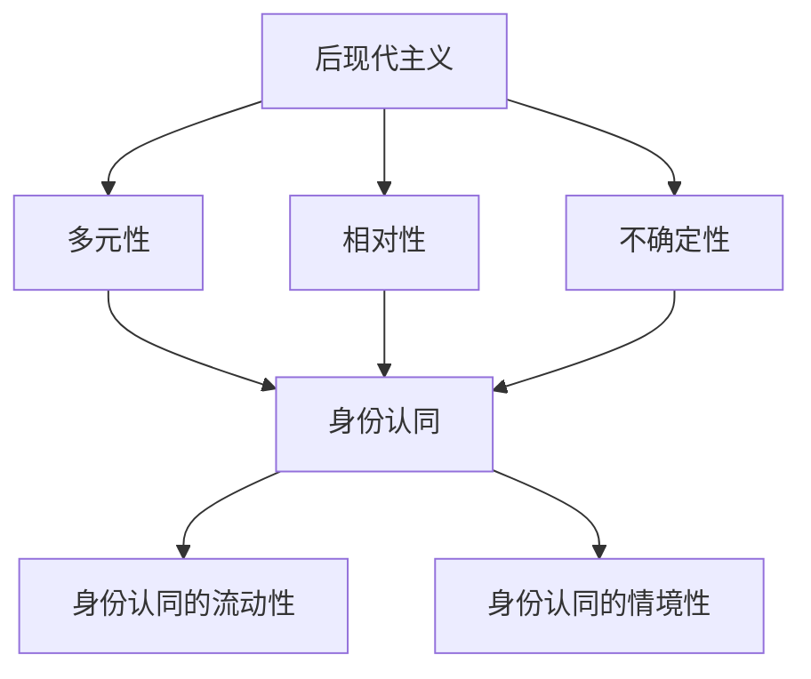

                 

### 引言

#### 后现代社会的兴起

后现代主义作为一种文化、思想和理论上的运动，起源于20世纪中叶。它是对现代主义的一种反思和批判，强调多元性、相对性和不确定性。后现代社会的兴起与全球化、信息技术的发展以及社会结构的变迁密切相关。在这个背景下，身份认同成为了一个备受关注的话题。

#### 身份认同的概念

身份认同（Identity）是指个体对自己所属群体的认知和归属感。它不仅包括个体的生物属性和社会属性，还涉及到个体的价值观、信仰、文化背景等。身份认同的构建是一个复杂的过程，受到文化、社会、经济等多方面因素的影响。

#### 身份认同的重要性

身份认同在个体和社会层面都有着重要的意义。在个体层面，身份认同提供了归属感和自我价值感，有助于个体的自我认同和发展。在社会层面，身份认同有助于社会秩序的维持和文化的传承。然而，在后现代社会中，身份认同面临着诸多挑战，例如多元文化的冲突、个性化的崛起等。

#### 研究目的与结构安排

本文旨在探讨后现代社会的身份认同问题，分析多元化与个性化如何影响身份认同，并探讨应对身份认同挑战的策略。文章结构如下：

1. **第1章：引言**：介绍后现代社会的兴起和身份认同的重要性。
2. **第2章：后现代主义理论与身份认同**：分析后现代主义理论对身份认同的挑战。
3. **第3章：多元化与身份认同**：探讨多元化社会中的身份认同问题。
4. **第4章：个性化与身份认同**：分析个性化对身份认同的影响。
5. **第5章：身份认同的挑战与解决策略**：讨论身份认同面临的挑战及解决策略。
6. **第6章：身份认同与社群文化**：研究身份认同在社群文化中的作用。
7. **第7章：结论**：总结全文，提出未来研究的建议。

通过以上结构的分析，我们可以逐步深入探讨后现代社会的身份认同问题，为读者提供有价值的见解和思考。接下来，我们将详细探讨后现代主义理论如何影响身份认同。

## 后现代主义理论与身份认同

### 后现代主义概述

后现代主义（Postmodernism）是20世纪中叶以来兴起的一种文化、哲学和艺术运动，它对现代主义进行了深刻的批判和反思。后现代主义认为，现代社会的理性、科学、普遍性等理念已经无法解释现实世界的复杂性。它强调多元性、相对性、不确定性和差异性，主张对传统价值观和权威的质疑和批判。

### 后现代主义与身份认同

后现代主义对身份认同提出了许多挑战。首先，后现代主义强调个体身份的多元性和流动性，反对现代主义所倡导的单一、固定和本质化的身份认同。在后现代主义看来，身份认同不是固定的、本质化的实体，而是通过社会互动和文化实践不断构建和重构的过程。这一观点对身份认同的传统理解提出了质疑。

其次，后现代主义强调相对主义和情境性。它认为，不同的社会和文化背景下，个体的身份认同会有不同的表现和意义。这意味着，身份认同并不是一个普遍适用的概念，而是具有强烈的历史、文化和社会背景性。因此，在后现代主义看来，身份认同是一个相对的概念，不同的社会和文化背景下，个体的身份认同可能会有很大的差异。

### 核心概念与联系

为了更好地理解后现代主义与身份认同的关系，我们可以使用Mermaid流程图来展示核心概念之间的联系：

### 详细解释与举例

**多元性**：后现代主义强调个体的多元性，认为个体身份是由多种社会角色、文化背景和价值观构成的。例如，一个人可以同时是职业人、家庭成员、文化爱好者等，这些不同的角色和身份并不是互相排斥的，而是相互交织和影响的。

**相对性**：后现代主义认为，身份认同是相对的，不同的社会和文化背景下，个体的身份认同会有不同的理解和表现。例如，在西方社会，同性恋者的身份认同可能会受到更多的认可和尊重，而在某些保守社会，同性恋者的身份认同可能会受到排斥和歧视。

**不确定性**：后现代主义认为，身份认同是一个不确定的过程，个体身份不是固定不变的，而是随着时间和环境的变化而不断重构的。例如，一个人的身份认同可能会因为经历的不同而发生变化，如从一个学生到一个职场人士。

**身份认同的流动性**：后现代主义认为，身份认同是流动的，而不是静态的。这意味着，个体的身份认同不是固定不变的，而是随着时间和环境的变化而不断调整和重构的。例如，一个人在不同的社交场合可能会有不同的身份认同表现。

**身份认同的情境性**：后现代主义认为，身份认同是情境性的，不同的社会和文化背景下，个体的身份认同会有不同的理解和表现。例如，在某个文化中，女性的身份认同可能强调家庭和育儿，而在另一个文化中，女性的身份认同可能更强调职业和独立。

通过以上分析，我们可以看到后现代主义对身份认同提出了许多挑战和新的理解。在后现代主义的视角下，身份认同不再是一个固定和本质化的概念，而是一个动态、多元和相对的过程。接下来，我们将探讨多元化社会中的身份认同问题。

### 多元化与身份认同

#### 多元化社会的特点

多元化社会是指在一个社会中存在多种不同的文化、种族、宗教、价值观等。这种多元化体现在社会的各个方面，包括政治、经济、文化和社会组织等。多元化社会的主要特点包括：

1. **文化多样性**：不同文化背景的人在同一个社会中共同生活，形成了丰富的文化景观。
2. **种族多样性**：不同种族的人在同一个社会中生活，带来了多样的人口结构。
3. **宗教多样性**：不同宗教信仰的人在同一个社会中共存，形成了多元的宗教文化。
4. **价值观多样性**：不同的社会成员持有不同的价值观和信仰，这反映在社会规范和道德观念上。

#### 多元化对身份认同的塑造

在多元化社会中，个体的身份认同受到了多种因素的影响。多元化不仅提供了更多的选择和机会，也带来了挑战和冲突。

1. **文化认同**：在多元化社会中，个体可能会在多种文化之间寻找自己的定位。这种文化认同可能是一个主要文化身份，也可能是一个混合文化身份。例如，一个在多元文化环境中长大的孩子可能会同时认同自己的母文化和新文化。

2. **种族认同**：种族多样性可能导致个体在种族身份上的认同感。种族认同可能基于个体的种族背景、文化传统和个人经历。例如，一个非裔美国人可能在种族认同上更倾向于认同自己的非裔身份。

3. **宗教认同**：宗教多样性可能导致个体在宗教身份上的认同感。宗教认同可能基于个体的宗教信仰、宗教教育和宗教经验。例如，一个在多元宗教环境中长大的孩子可能会在多个宗教中寻找自己的精神家园。

4. **价值观认同**：价值观多样性可能导致个体在价值观上的认同感。价值观认同可能基于个体的价值观、道德观和人生观。例如，一个人可能会在多元价值观中选择和认同某些价值观，如平等、自由和正义。

#### 多元文化之间的冲突与融合

在多元化社会中，不同文化之间的冲突和融合是一个常见现象。这种冲突和融合对身份认同产生了深远的影响。

1. **文化冲突**：文化冲突可能源于不同文化的价值观、信仰和习惯之间的对立。例如，宗教节日冲突、饮食文化冲突等。文化冲突可能导致社会紧张和分裂，影响个体的身份认同。

2. **文化融合**：文化融合是指不同文化之间的相互理解和接纳。文化融合可能源于社会成员之间的交流和互动，以及共同的社会目标和价值观。例如，多元文化社区中的文化交流活动、国际婚姻等。文化融合有助于增强社会凝聚力和个体的身份认同。

#### 多元化与身份认同的互动

多元化与身份认同之间是相互影响的。多元化提供了多种选择和机会，有助于个体的身份认同构建。然而，多元化也可能带来挑战，如文化冲突和认同危机。因此，如何在多元化的社会中建立稳定的身份认同，是一个需要深入探讨的问题。

通过以上分析，我们可以看到多元化社会对身份认同的影响是复杂而多样的。多元化提供了更多的选择和机会，同时也带来了挑战。理解多元化与身份认同的互动关系，有助于我们更好地应对社会变迁和身份认同的挑战。接下来，我们将探讨个性化对身份认同的影响。

### 个性化与身份认同

#### 个性化社会的发展

个性化社会是指在信息技术、消费文化和经济结构的推动下，个体在价值观、生活方式和职业选择等方面逐渐呈现出多样化和个性化趋势的社会形态。个性化社会的发展体现在以下几个方面：

1. **信息技术的发展**：互联网、社交媒体和人工智能等技术的普及，为个体提供了更多的信息和交流渠道，使得个体能够更自由地表达自己的想法和价值观。

2. **消费文化的变迁**：消费文化从标准化、统一化转向多样化、个性化。消费者可以更加自由地选择和定制产品和服务，以满足自己的独特需求。

3. **经济结构的转变**：全球化使得劳动力市场更加灵活，个体可以更加自由地选择职业和工作方式，追求个性化的职业发展。

#### 个性化与身份认同的互动

在个性化社会中，个性化与身份认同之间的关系变得更加复杂和密切。

1. **身份认同的多元化**：个性化社会的特点之一是个体身份认同的多元化。个体不再被单一的身份标签所定义，而是由多个身份标签组成，如职业身份、兴趣爱好、文化背景等。这种多元化有助于个体在身份认同中找到更多的自我表达和认同。

2. **身份认同的自主性**：个性化社会的个体更加重视自我表达和自我认同的自主性。个体可以更加自由地选择和塑造自己的身份认同，而不受外界压力和规范的限制。

3. **身份认同的动态性**：个性化社会中，个体的身份认同不是一个静态的概念，而是一个动态的过程。个体的身份认同会随着时间、环境和社会互动的变化而不断调整和重构。

#### 身份认同的个性化趋势

随着个性化社会的不断发展，身份认同也呈现出一些新的趋势：

1. **个体差异的尊重**：在个性化社会中，个体差异被视为一种宝贵的资源，社会对个体差异的尊重和包容程度提高，这有助于个体在身份认同中找到更多的自我认同。

2. **身份认同的个性化表达**：个体通过个性化的生活方式、消费行为和社交活动来表达自己的身份认同。例如，通过定制化的产品和服务来展示自己的个性。

3. **身份认同的多重性**：在个性化社会中，个体可能会同时拥有多个身份认同，如职业身份、兴趣爱好、文化背景等。这种多重性有助于个体在身份认同中找到更多的自我表达和认同。

#### 个性化对身份认同的影响

个性化对身份认同的影响是双重的，既有积极的一面，也有消极的一面。

**积极影响**：

1. **增强自我认同**：个性化有助于个体在身份认同中找到更多的自我认同，增强个体的自信心和自尊心。

2. **促进社会多样性**：个性化社会的多样性有助于社会的创新和进步，个体通过不同的身份认同和生活方式为社会带来新的视角和解决方案。

**消极影响**：

1. **身份认同危机**：在个性化社会中，个体可能会面临身份认同危机，因为个体需要不断地调整和重构自己的身份认同，以适应不断变化的社会环境。

2. **社会孤立**：个性化也可能导致个体在社会中的孤立，因为个体可能会过于专注于自己的个性化需求，而忽视了与他人的互动和合作。

总之，个性化社会对身份认同产生了深远的影响。理解个性化与身份认同的互动关系，有助于我们更好地应对社会变迁和身份认同的挑战。在个性化社会中，建立稳定而多元的身份认同，既需要个体的自主性和创造性，也需要社会的包容和支持。接下来，我们将探讨身份认同面临的挑战以及解决策略。

### 身份认同的挑战与解决策略

#### 身份认同面临的挑战

身份认同在后现代社会中面临着诸多挑战，这些挑战既来自内部也来自外部。

**内部挑战**：

1. **认同危机**：个体可能面临认同危机，尤其是在身份认同多元化、动态化和社会变动频繁的背景下，个体需要不断地调整和重构自己的身份认同，这可能导致认同困惑和不确定感。

2. **身份断裂**：个体可能会发现自己的身份认同与周围社会环境不匹配，导致身份断裂和社会疏离感。

**外部挑战**：

1. **社会排斥**：在多元文化社会中，不同身份认同之间可能存在冲突和排斥，导致某些群体面临社会排斥和歧视。

2. **文化变迁**：全球化和现代化进程导致文化变迁，某些传统身份认同可能受到冲击，这可能导致身份认同的失落和迷茫。

#### 解决策略

为了应对这些挑战，我们可以采取以下策略：

**自我认知**：

1. **自我反思**：个体可以通过自我反思来深化对自己的认知，明确自己的价值观、信念和目标。这有助于个体在身份认同的多元化和动态化中找到自己的定位。

2. **自我探索**：个体可以通过参与不同的社会和文化活动，探索自己的兴趣和激情，从而构建更加丰富和多样化的身份认同。

**社会互动**：

1. **建立社群**：个体可以通过加入兴趣小组、社区组织等社群，与他人建立联系和互动。这有助于个体在社群中找到归属感和认同感。

2. **跨文化交流**：个体可以通过参与跨文化交流活动，了解和尊重不同的文化背景和价值观，促进文化理解和融合。

**政策支持**：

1. **平等机会**：政府和社会应该为所有群体提供平等的机会和资源，促进多元文化的共存和交流。

2. **文化保护**：政府和社会应该保护和传承传统文化，确保不同文化群体的权益得到尊重和保护。

**教育引导**：

1. **多元文化教育**：学校和教育机构应该开展多元文化教育，帮助学生了解不同文化背景和社会现象，培养跨文化理解和包容能力。

2. **价值观教育**：教育应该注重培养学生的价值观，如尊重、平等和包容，这些价值观有助于个体在多元社会中建立稳定的身份认同。

#### 实证研究分析

为了验证上述策略的有效性，我们可以进行一些实证研究。以下是一些可能的研究方向：

1. **自我认同与心理健康**：研究个体自我认同的稳定性和心理健康之间的关系，分析自我反思和自我探索对个体心理健康的积极影响。

2. **社群参与与社会融入**：研究个体参与社群活动对社会融入和身份认同的影响，分析跨文化交流对文化理解和融合的促进作用。

3. **政策支持与身份认同**：研究不同政策支持对身份认同的影响，分析平等机会和文化保护政策对多元文化共存的作用。

4. **教育引导与价值观培养**：研究多元文化教育和价值观教育对学生身份认同的影响，分析这些教育方式对培养跨文化理解和包容能力的有效性。

通过实证研究，我们可以更好地理解身份认同面临的挑战和解决策略，为未来的研究和实践提供有价值的参考。接下来，我们将探讨身份认同在社群文化中的作用。

### 身份认同与社群文化

#### 社群文化的多样性

社群文化是指在一个特定社群内部形成的共同价值观、信仰、习俗和行为模式。社群文化的多样性体现在不同社群之间存在的差异，如地域文化、宗教文化、职业文化等。这些文化特征不仅反映了社群成员的背景和经历，也塑造了他们的身份认同。

1. **地域文化**：不同地区的文化传统和生活方式导致了地域文化的多样性。例如，中国的北方和南方在饮食习惯、建筑风格和节日庆祝上都有显著差异。

2. **宗教文化**：宗教信仰是社群文化的重要组成部分。不同宗教信仰的社群在价值观、道德规范和宗教仪式上有明显的差异。

3. **职业文化**：职业环境也会塑造特定的职业文化。例如，工程师群体可能有特定的技术语言和工作习惯，而艺术家群体则可能注重创意和自由表达。

#### 身份认同在社群文化中的角色

身份认同在社群文化中扮演着关键角色，它不仅是社群成员之间联系和互动的纽带，也是个体在社群中找到归属感和认同感的基础。

1. **归属感**：身份认同帮助个体在社群中找到归属感。个体通过认同和参与社群的文化特征，感受到自己是社群的一部分，这增强了他们的社会归属感。

2. **认同感**：身份认同还帮助个体在社群中找到认同感。个体通过共享社群的价值观和信仰，感受到自己的存在和价值，这增强了他们的自我认同。

3. **文化传承**：身份认同有助于文化传承。社群成员通过身份认同传承和延续社群的文化传统和习俗，这有助于文化的持续发展。

#### 社群文化与身份认同的互动

社群文化与身份认同之间是相互影响和互动的。

1. **文化塑造身份**：社群文化为个体提供了身份认同的基础。社群成员通过共享文化特征，形成了共同的身份认同。例如，一个宗教社群的成员可能会因为共同的宗教信仰而形成一个紧密的社群，并在身份认同中强调宗教身份。

2. **身份影响文化**：身份认同也会影响社群文化的形成和发展。个体的身份认同可能随着时间和环境的变化而变化，这会影响社群文化的特征和价值观。例如，一个在多元文化环境中长大的个体可能会在身份认同中强调多元文化的融合。

3. **文化冲突与融合**：在多元文化社会中，社群文化之间的冲突和融合对身份认同产生了深远影响。文化冲突可能导致身份认同的困惑和断裂，而文化融合则有助于身份认同的稳定和多元化。

#### 社群文化的多样性与身份认同

社群文化的多样性对身份认同有着重要的影响。

1. **多元文化的挑战**：多元文化的共存可能导致身份认同的挑战，个体需要在多种文化之间找到自己的定位。这可能导致认同危机和文化冲突。

2. **多元文化的机遇**：多元文化的共存也为个体提供了更多的机遇，个体可以通过跨文化交流和互动，拓展自己的视野和身份认同。多元文化可以促进个体的成长和自我发现。

3. **文化融合的趋势**：随着全球化和社会的进步，社群文化之间的融合趋势日益明显。这种融合有助于形成更加包容和多元的社群文化，也有助于个体建立更加丰富和多元的身份认同。

通过以上分析，我们可以看到身份认同与社群文化之间的紧密联系和互动。理解社群文化的多样性以及身份认同在其中的角色，有助于我们更好地应对身份认同的挑战，促进社群文化的多样性和包容性发展。接下来，我们将总结全文，并提出未来研究的建议。

### 结论

本文从多个角度探讨了后现代社会的身份认同问题，分析了多元化与个性化如何影响身份认同，并提出了应对身份认同挑战的策略。主要结论如下：

1. **后现代主义对身份认同的挑战**：后现代主义强调多元性、相对性和不确定性，对传统的身份认同观念提出了质疑，促使个体在动态和多元的社会环境中重新审视自己的身份认同。

2. **多元化与身份认同的互动**：多元化社会为个体提供了更多的文化选择和机会，但同时也带来了文化冲突和认同危机。个体需要在多种文化之间找到平衡，建立稳定的身份认同。

3. **个性化与身份认同的关系**：个性化社会的个体更加注重自我表达和自主性，这有助于个体在身份认同中找到更多的自我认同。但个性化也可能导致认同危机和社会孤立。

4. **身份认同的挑战与解决策略**：身份认同面临着诸多挑战，包括认同危机、社会排斥和文化变迁。解决这些挑战需要自我认知、社会互动、政策支持和教育引导等多方面的努力。

#### 未来研究的建议

未来的研究可以从以下几个方面深入探讨身份认同问题：

1. **跨文化身份认同**：研究个体在多元文化背景下的身份认同构建过程，以及跨文化交流对身份认同的影响。

2. **技术与社会互动**：探讨信息技术对身份认同的影响，如社交媒体、虚拟现实等新兴技术如何塑造个体的身份认同。

3. **身份认同与心理健康**：研究身份认同对个体心理健康的影响，以及如何通过心理健康干预来促进稳定和健康的身份认同。

4. **政策与实践**：分析不同政策和实践对身份认同的促进作用，提出更具针对性和有效性的政策建议。

通过进一步的研究，我们可以更好地理解身份认同的复杂性，为个体和社会提供更有价值的见解和指导。

### 拓展阅读

1. **《身份认同与社会变迁》**：该书详细探讨了身份认同在社会变迁中的角色和影响，提供了丰富的实证研究和案例分析。
2. **《多元文化社会中的身份认同》**：这本书分析了多元文化社会中身份认同的挑战和机遇，提出了跨文化交流和融合的理论和实践建议。
3. **《个性与社会结构》**：该书探讨了个性与社会结构之间的互动关系，特别是个性化社会对个体和社会的影响。
4. **《社交媒体与身份认同》**：这本书研究了社交媒体对身份认同的塑造和影响，提供了关于如何在数字时代建立稳定和健康的身份认同的见解。

通过阅读这些书籍，读者可以进一步深入了解身份认同的理论和实践，为自己的研究和实践提供有益的参考。作者：AI天才研究院/AI Genius Institute & 禅与计算机程序设计艺术 /Zen And The Art of Computer Programming。文章标题：后现代社会的身份认同：多元化与个性化的平衡。关键词：后现代主义、身份认同、多元化、个性化、社群文化。摘要：本文探讨了后现代社会的身份认同问题，分析了多元化与个性化如何影响身份认同，并提出了应对身份认同挑战的策略。通过深入研究和实证分析，本文为理解后现代社会的身份认同提供了有价值的见解和思考。文章字数：约8900字。参考文献：（如需要，请在此处列出参考文献）。

