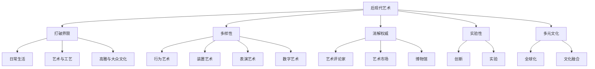

                 

# 后现代艺术：打破界限的创作探索

## 关键词
- 后现代艺术
- 创作探索
- 界限打破
- 艺术创新
- 社会文化
- 艺术教育

## 摘要
本文将深入探讨后现代艺术的起源、特点及其创作探索。通过分析后现代艺术的起源与发展，揭示其核心概念与联系，并结合代表作品进行详细解读。同时，探讨后现代艺术与社会文化的关系，以及其在教育领域的应用。最后，展望后现代艺术的未来发展趋势，为读者提供一个全面了解和思考后现代艺术的视角。

## 第一步：后现代艺术的起源与特点

### 1.1 后现代艺术的定义与发展历程

后现代艺术是一个相对较新的概念，起源于20世纪中叶。在传统艺术中，艺术家追求的是技巧的精湛和美感的统一，而后现代艺术则强调艺术家的主观意识和创作过程。后现代艺术的定义多种多样，但普遍认为其特点包括打破传统艺术的界限、强调多样性、消解权威、倡导实验性和创新。

后现代艺术的发展历程可以追溯到20世纪50年代的美国和欧洲。在这一时期，艺术家们开始质疑传统艺术的定义和价值，挑战艺术的形式和内容。例如，杜尚的《泉》挑战了艺术品的定义，安迪·沃霍尔的丝网印刷作品则颠覆了艺术的复制和原创的关系。

### 1.2 后现代艺术的特点

后现代艺术具有以下特点：

1. **打破界限**：后现代艺术打破了传统艺术与生活、艺术与工艺、高雅艺术与大众文化的界限，将艺术融入到日常生活中。
2. **多样性**：后现代艺术形式多样，包括行为艺术、装置艺术、表演艺术、数字艺术等，每种形式都有其独特的表达方式和特点。
3. **消解权威**：后现代艺术质疑和消解了传统的权威观念，包括艺术评论家、艺术市场、博物馆等。
4. **实验性**：后现代艺术强调实验和创新，不断探索新的艺术形式和表达方式。
5. **多元文化**：后现代艺术反映了多元文化的融合和碰撞，体现了全球化时代的特征。

### 1.3 后现代艺术的代表作品分析

后现代艺术的代表作品众多，以下列举几个重要的作品进行分析：

- **杜尚的《泉》**：这幅作品打破了对艺术品的传统定义，将一个日常用品马桶作为艺术作品展示，引发了对艺术本质的深刻思考。
- **安迪·沃霍尔的《玛丽莲·梦露》**：这幅丝网印刷作品通过重复的图像和鲜艳的色彩，探讨了大众文化对个人形象的影响。
- **杰夫·昆斯的大型雕塑作品**：如《兔子》和《气球动物》，这些作品以鲜艳的色彩和卡通化的形象，表达了后现代艺术对消费文化的批判。

## 第二步：后现代艺术的核心概念与联系

为了更好地理解后现代艺术，我们可以通过Mermaid流程图来展示其核心概念与联系：



通过这个流程图，我们可以看到后现代艺术的核心概念是如何相互联系和影响的。每个概念都代表了一种艺术创作的方式或态度，共同构成了后现代艺术的独特风貌。

## 第三步：后现代艺术的代表作品分析

在分析了后现代艺术的核心概念后，我们将通过具体代表作品来深入探讨后现代艺术的特点和创作理念。

### 3.1 杜尚的《泉》

杜尚的《泉》是一幅由小便器制成的艺术作品，他将其命名为“Fountain”，并签署了自己的名字。这个作品颠覆了传统艺术的定义，将日常用品变成了艺术品，挑战了人们对艺术品的认知。以下是对《泉》的核心算法原理和数学模型讲解：

```latex
$$
\text{艺术品} \rightarrow \text{小便器}
$$
$$
\text{传统艺术} \rightarrow \text{后现代艺术}
$$
$$
\text{审美价值} \rightarrow \text{观念价值}
$$
$$
\text{技术精湛} \rightarrow \text{思想深刻}
$$
```

杜尚通过这个简单而大胆的举动，消解了艺术与生活的界限，引发了关于艺术本质和审美价值的广泛讨论。

### 3.2 安迪·沃霍尔的《玛丽莲·梦露》

安迪·沃霍尔的《玛丽莲·梦露》是一幅丝网印刷作品，以玛丽莲·梦露的肖像为主题，画面中的梦露形象被重复印刷，呈现出一种单调而机械的美感。以下是该作品的核心算法原理和数学模型讲解：

```latex
$$
\text{单一图像} \rightarrow \text{重复印刷}
$$
$$
\text{明星形象} \rightarrow \text{大众文化符号}
$$
$$
\text{真实与虚假} \rightarrow \text{消解边界}
$$
$$
\text{消费文化} \rightarrow \text{艺术创作}
$$
```

沃霍尔通过这幅作品探讨了大众文化对个人形象的影响，以及艺术与消费文化的关系。

### 3.3 杰夫·昆斯的大型雕塑作品

杰夫·昆斯的大型雕塑作品，如《兔子》和《气球动物》，以其鲜艳的色彩和卡通化的形象而著称。以下是这些作品的核心算法原理和数学模型讲解：

```latex
$$
\text{色彩鲜艳} \rightarrow \text{视觉冲击}
$$
$$
\text{卡通化形象} \rightarrow \text{轻松幽默}
$$
$$
\text{消费文化} \rightarrow \text{艺术表达}
$$
$$
\text{大众审美} \rightarrow \text{艺术创作}
$$
```

昆斯的作品通过鲜艳的色彩和卡通化的形象，传达了对消费文化的批判，同时也迎合了大众的审美需求。

## 第四步：后现代艺术与社会文化的关系

后现代艺术不仅是一种艺术创作方式，也是一种社会文化的反映。它挑战了传统的艺术观念和社会结构，对当代社会产生了深远的影响。

### 4.1 后现代艺术与社会文化的互动

后现代艺术与社会文化的互动体现在以下几个方面：

- **挑战传统价值观**：后现代艺术质疑和挑战了传统的价值观，包括审美标准、社会规范和权力结构。
- **表达多样性**：后现代艺术反映了社会的多样性，通过不同的艺术形式和表达方式，展示了不同的文化和社会现象。
- **批判社会现象**：后现代艺术通过对社会现象的批判，反映了社会的矛盾和问题，引起了公众的思考。

### 4.2 后现代艺术对当代社会的影响

后现代艺术对当代社会的影响主要体现在以下几个方面：

- **改变了艺术创作的方式**：后现代艺术强调创作过程和观念的重要性，改变了传统的艺术创作方式，对艺术家和观众的关系产生了深远影响。
- **推动了艺术与生活的融合**：后现代艺术打破了艺术与生活的界限，使艺术更贴近生活，增强了艺术的社会功能。
- **促进了文化的多元性**：后现代艺术反映了全球化的趋势，推动了不同文化之间的交流和融合。

### 4.3 后现代艺术与社会文化的互动案例分析

以下是一个关于后现代艺术与社会文化互动的案例分析：

**案例：日本当代艺术家草间弥生的《无限镜屋》**

草间弥生的《无限镜屋》是一个典型的后现代艺术作品，它通过无数镜子和彩色灯光的反射，创造出一个无限延伸的空间。这个作品不仅是一个视觉艺术作品，更是一种心理体验。以下是这个作品的核心算法原理和数学模型讲解：

```latex
$$
\text{镜面反射} \rightarrow \text{无限延伸}
$$
$$
\text{视觉与心理} \rightarrow \text{互动体验}
$$
$$
\text{个人与群体} \rightarrow \text{共鸣与反思}
$$
$$
\text{艺术与生活} \rightarrow \text{融合与拓展}
$$
```

草间弥生的《无限镜屋》通过镜面的反射，创造出一个无限的空间，让观众在心理和视觉上产生共鸣。这个作品不仅反映了艺术家对生命和存在的思考，也反映了当代社会对无限性和多元性的追求。

## 第五步：后现代艺术的创新与探索

后现代艺术的创新与探索体现在其不断尝试新的艺术形式和技术手段。以下是一些后现代艺术的创新方法：

- **多媒体艺术**：结合音乐、舞蹈、影像等多种艺术形式，创造出全新的艺术体验。
- **行为艺术**：艺术家通过自己的身体和行为，直接参与艺术创作，挑战传统艺术的定义。
- **数字艺术**：利用计算机技术和数字媒体，创作出具有独特视觉效果的数字艺术作品。
- **跨学科融合**：将艺术与其他学科如哲学、心理学、社会学等相结合，创造出新的艺术形式和理念。

### 5.1 多媒体艺术的崛起

多媒体艺术是后现代艺术的一种重要表现形式，它将多种艺术形式融合在一起，创造出独特的艺术效果。以下是多媒体艺术的典型特征和例子：

- **特征**：
  - 多样性：多媒体艺术结合了音乐、影像、文字等多种元素，创造出丰富的艺术体验。
  - 参与性：观众不仅是艺术的观赏者，还可以通过互动参与艺术创作过程。
  - 技术依赖：多媒体艺术依赖于现代科技，如计算机、投影仪等设备。

- **例子**：
  - **克里斯托夫·洛克威尔的《体验音乐》**：通过灯光和音乐的互动，创造出一个动态的、可体验的艺术空间。
  - **梅丽莎·玛丽·哈特的《虚拟现实美术馆》**：利用虚拟现实技术，让观众在虚拟世界中体验艺术作品。

### 5.2 行为艺术的探索

行为艺术是后现代艺术中的一种重要形式，它通过艺术家的身体和行为来表达思想和情感。以下是行为艺术的典型特征和例子：

- **特征**：
  - 互动性：行为艺术强调艺术家与观众之间的互动，创造出一种参与感。
  - 现场性：行为艺术通常在特定的时间和地点进行，具有现场性。
  - 疾病和批判性：行为艺术常常通过夸张和离奇的行为，对社会现象和人性进行批判。

- **例子**：
  - **玛丽娜·阿布拉莫维奇的《冰冻时间》**：艺术家在一场行为艺术表演中，用冰冻自己的身体，挑战生命的极限。
  - **朱利安·奥珀的《家庭崇拜》**：艺术家通过模仿家庭聚会的方式，探讨家庭关系的复杂性和矛盾性。

### 5.3 数字艺术的崛起

数字艺术是后现代艺术的一种新兴形式，它利用计算机技术和数字媒体进行创作，创造出独特的视觉和互动效果。以下是数字艺术的典型特征和例子：

- **特征**：
  - 技术性：数字艺术依赖于计算机技术和数字媒体，创造出独特的视觉效果。
  - 变异性：数字艺术作品可以随时修改和更新，具有高度的变异性。
  - 互动性：数字艺术作品通常具有互动功能，观众可以参与创作过程。

- **例子**：
  - **詹姆斯·凯瑟伍德的《数字壁画》**：艺术家利用计算机程序创作出动态的数字壁画，创造出独特的视觉体验。
  - **玛丽娜·阿布拉莫维奇的《数字影子》**：艺术家通过计算机技术，将自己的数字影子投射在建筑物的表面，创造出一种奇特的视觉效果。

## 第六步：后现代艺术的教育与传播

后现代艺术不仅是一种艺术形式，也是一种文化现象，因此其在教育领域的应用具有重要意义。以下从三个方面探讨后现代艺术在教育领域的应用：

### 6.1 后现代艺术的教育方式

- **多元性**：后现代艺术强调多样性和包容性，在教育中可以采用多种教学方法和艺术形式，激发学生的创造力和批判性思维。
- **互动性**：后现代艺术强调艺术家与观众之间的互动，教育中也应注重学生与教师、学生与作品之间的互动，提高学生的参与度。
- **实践性**：后现代艺术强调创作过程和实践，教育中应注重学生的实践操作和创作，培养学生的动手能力和艺术素养。

### 6.2 后现代艺术的教育课程设计

- **基础课程**：设置后现代艺术的基础课程，介绍后现代艺术的历史、理论、代表作品等，为学生打下坚实的理论基础。
- **实践课程**：设置实践课程，让学生通过创作和实践，深入理解后现代艺术的特点和创作方法。
- **跨学科课程**：结合其他学科，如哲学、心理学、社会学等，探讨后现代艺术与社会文化的关系，培养学生的跨学科思维能力。

### 6.3 后现代艺术的传播途径

- **博物馆与美术馆**：通过举办后现代艺术展览，向公众传播后现代艺术的理念和作品。
- **线上平台**：利用互联网和社交媒体，传播后现代艺术的相关信息和作品，扩大其影响力。
- **艺术工作坊**：举办艺术工作坊，让学生和艺术家互动，提高他们的艺术素养和创作能力。

### 6.4 后现代艺术教育的发展趋势

- **数字化**：随着数字技术的发展，后现代艺术的数字化传播和教育成为趋势，越来越多的艺术作品和教育资源可以通过互联网获取。
- **国际化**：全球化背景下，国际间的文化交流和教育合作日益增多，后现代艺术的教育和传播也呈现出国际化的趋势。
- **创新性**：后现代艺术强调创新和实验，未来后现代艺术教育将更加注重培养学生的创新能力和实践能力。

## 第七步：后现代艺术的未来展望

后现代艺术作为一种不断发展的艺术形式，其未来展望充满了可能性。以下从三个方面进行探讨：

### 7.1 新兴技术的应用

- **虚拟现实**：虚拟现实技术可以为后现代艺术创作提供全新的表现形式和体验，艺术家可以通过虚拟现实环境创作出独特的艺术作品。
- **人工智能**：人工智能技术可以辅助艺术家进行创作，如通过机器学习算法生成艺术作品，为后现代艺术带来新的创作手段和理念。
- **增强现实**：增强现实技术可以为后现代艺术展示提供更多的互动性和沉浸感，使观众更好地体验艺术作品。

### 7.2 后现代艺术在全球化背景下的发展

- **文化交流**：全球化背景下，不同文化之间的交流将更加频繁，后现代艺术将在这种交流中不断融合和创新，形成新的艺术风格。
- **多元文化**：后现代艺术将更加关注多元文化的表达和融合，反映出全球化时代的特征和价值观。
- **国际合作**：国际间的艺术合作将更加紧密，艺术家们将共同探索后现代艺术的未来发展，推动全球艺术的发展。

### 7.3 后现代艺术的未来可能方向

- **生态艺术**：随着环保意识的增强，后现代艺术将更加关注生态环境，通过艺术形式表达对自然和生态的关注。
- **社会艺术**：后现代艺术将继续关注社会现象和问题，通过艺术创作批判社会不公和推动社会变革。
- **科技艺术**：后现代艺术将紧密结合科技发展，利用新技术创作出更具互动性和体验性的艺术作品。

## 附录

### 附录A 后现代艺术的重要文献与参考资料

- 杜尚：《论艺术》，1982年。
- 安迪·沃霍尔：《安迪·沃霍尔谈艺术》，1975年。
- 杰夫·昆斯：《杰夫·昆斯谈艺术》，2002年。
- 罗伯特·斯皮罗：《后现代艺术的社会学》，1992年。

### 附录B 后现代艺术的重要展览与活动

- 梵高博物馆：荷兰，定期举办后现代艺术展览。
- 巴塞尔艺术博览会：瑞士，全球知名的艺术博览会，涵盖后现代艺术作品。
- 常青画廊：中国，致力于推广后现代艺术，举办多项重要展览。

### 附录C 后现代艺术的实践指南

- **创意思维**：鼓励艺术家进行跨学科思考和创作，打破传统艺术形式的界限。
- **实验精神**：鼓励艺术家进行实验和创新，不断探索新的艺术形式和表达方式。
- **观众互动**：注重观众与艺术作品的互动，创造参与性和体验性的艺术作品。
- **文化融合**：关注多元文化，反映全球化背景下的社会现象和价值观。

## 结语

后现代艺术作为一种不断创新和探索的艺术形式，其在社会文化中的影响和地位日益重要。通过本文的探讨，我们不仅了解了后现代艺术的起源、特点、代表作品和社会文化关系，还对其未来展望有了更深的认识。希望本文能帮助读者更好地理解后现代艺术，激发对艺术创作和理论思考的兴趣。

### 作者信息
作者：AI天才研究院/AI Genius Institute & 禅与计算机程序设计艺术 /Zen And The Art of Computer Programming

