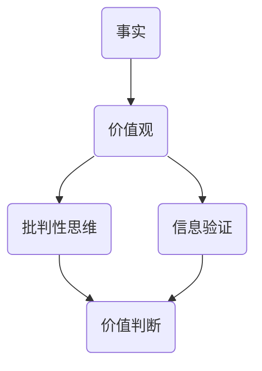

                 

# 文章标题：后真相时代的价值判断

## 关键词
后真相时代，价值判断，信息真伪，社交媒体，社会问题，解决方案

## 摘要
本文深入探讨后真相时代的概念及其对现代社会价值判断的挑战。首先，我们定义了后真相时代，分析了其主要特征和影响。接着，文章探讨了在信息泛滥的时代，如何进行有效的价值判断，并提出了一系列策略和技巧。随后，文章分析了后真相时代下的社会问题，包括民粹主义、价值观分歧和个人隐私问题，并提出了相应的解决方案。最后，文章通过案例研究和未来展望，总结了个人在后真相时代中的角色，并对未来的发展趋势进行了探讨。

## 引言

### 后真相时代的定义
后真相时代（post-truth era）是一个相对较新的概念，起源于媒体和政治学领域。它指的是一个信息高度碎片化、情绪化、表面化的社会环境，其中事实和逻辑被情感和表象所超越。在这个时代，人们往往更倾向于相信那些符合他们已有信念和情感倾向的信息，而不是客观的事实。后真相时代的特征包括信息过载、社交媒体的兴起、虚假新闻的泛滥以及公众对传统媒体的信任度下降。

### 后真相时代的影响
后真相时代的出现对多个领域产生了深远的影响。在媒体领域，虚假新闻和误导性信息的传播导致公众对事实的混淆和误解。在政治领域，后真相时代加剧了民粹主义和极端主义的崛起，影响了选举和政治稳定。在社会领域，后真相时代引发了价值观的分歧和冲突，影响了社会信任和人际关系。

### 价值判断的挑战
在这样一个信息泛滥、真伪难辨的时代，如何进行有效的价值判断成为了一个重要的课题。传统的价值观念受到挑战，而新的价值观念尚未形成。人们需要更多的批判性思维和分析能力来辨别信息真伪，同时需要构建一套个人价值体系来指导他们的行为和决策。

## 后真相时代的特征

### 信息过载
在互联网时代，信息量呈爆炸性增长。人们每天接收到的信息远远超过了他们的处理能力。这种信息过载导致人们对事实的辨别能力下降，容易被误导性信息所影响。

### 社交媒体的兴起
社交媒体平台如Facebook、Twitter、微信等极大地改变了信息的传播方式。信息的传播速度和范围前所未有，但同时也使得虚假新闻和误导性信息更容易传播。

### 虚假新闻的泛滥
虚假新闻（fake news）指的是故意制造、传播的虚假或误导性信息。这些信息往往具有情感煽动性，容易引起公众的共鸣，但严重损害了公众的认知和判断能力。

### 传统媒体信任度下降
随着虚假新闻的泛滥和社交媒体的兴起，公众对传统媒体的信任度逐渐下降。许多人认为传统媒体存在偏见，无法提供客观、全面的信息。

### 情感化与表面化
在后真相时代，情感和表象往往超过事实和逻辑。人们更倾向于相信那些能够激发情感共鸣的信息，而不是那些基于事实和逻辑的分析。

## 价值判断的挑战

### 信息真伪的辨别
在信息泛滥的时代，辨别信息的真伪成为了一个巨大的挑战。虚假新闻和误导性信息的泛滥使得人们对事实的判断更加困难。人们需要更多的批判性思维和分析能力来辨别信息真伪。

### 多元化的价值观念
随着全球化和互联网的发展，人们接触到的价值观念越来越多元化。不同文化、不同社会背景的人有着不同的价值观念，这使得价值判断变得更加复杂。

### 社交媒体的影响
社交媒体平台上的信息传播速度极快，但同时也缺乏监管。虚假新闻和误导性信息往往能够迅速传播，对公众的价值判断产生负面影响。

### 传统价值观的挑战
在互联网时代，许多传统的价值观受到挑战。个人主义、自由主义等新价值观的兴起，使得人们对传统价值观的认同度下降。

### 构建个人价值体系
在面对多元化的价值观念和复杂的信息环境时，个人需要构建一套自己的价值体系。这套价值体系应基于个人的信念和经验，能够帮助他们在面对各种信息时进行有效的价值判断。

## 核心概念与联系

为了更好地理解后真相时代的价值判断，我们需要了解以下几个核心概念之间的关系：

1. **事实**：事实是客观存在的真实情况，不受主观情感和偏见的影响。
2. **价值观**：价值观是个人或社会对事物的价值、意义和优劣等方面的判断标准。
3. **批判性思维**：批判性思维是一种分析、推理和评价信息的能力，能够帮助我们辨别信息的真伪和价值。
4. **信息验证**：信息验证是确保信息真实性的过程，包括查证来源、核实事实和评估信息的可信度。

下面是一个Mermaid流程图，展示了这些概念之间的关系：



## 核心算法原理讲解

为了在复杂的信息环境中进行有效的价值判断，我们需要应用一些核心算法原理。以下是几个常用的算法原理及其伪代码：

### 信息筛选算法

```python
# 伪代码：信息筛选算法
def filter_information(information_list, criteria):
    filtered_list = []
    for info in information_list:
        if meets_criteria(info, criteria):
            filtered_list.append(info)
    return filtered_list

# 伪代码：评估信息是否符合特定标准
def meets_criteria(info, criteria):
    # 根据具体标准进行评估，例如：
    if is真实(info) and not is误导性(info):
        return True
    else:
        return False
```

### 信任度评估算法

```python
# 伪代码：信任度评估算法
def assess_trustworthiness(source, information):
    trust_score = 0
    if is_权威(source):
        trust_score += 10
    if is_验证(information):
        trust_score += 5
    if is_多元化来源(information):
        trust_score += 3
    return trust_score
```

### 价值判断算法

```python
# 伪代码：价值判断算法
def value_judgment(information, personal_values):
    value_score = 0
    for value in personal_values:
        if information符合价值(value):
            value_score += 1
    return value_score
```

## 数学模型和公式

在价值判断过程中，我们可以应用一些数学模型和公式来量化信息的可信度和价值。以下是几个常用的数学模型和公式：

### 信任度评分模型

$$
Trust = \frac{权威性 + 验证度 + 多元化来源}{3}
$$

### 价值判断模型

$$
Value = \sum_{i=1}^{n} (信息_i \times 价值_i)
$$

其中，$Value$ 是价值评分，$信息_i$ 是第 $i$ 条信息，$价值_i$ 是个人对第 $i$ 条信息的价值评分。

### 事实判断模型

$$
Fact = \frac{真实度 + 准确度}{2}
$$

其中，$Fact$ 是事实评分，$真实度$ 和 $准确度$ 分别是信息的真实程度和准确程度。

## 项目实战

### 开发环境搭建

为了更好地理解后真相时代的价值判断，我们可以搭建一个简单的信息验证和评估系统。以下是开发环境搭建的步骤：

1. 安装Python环境和相关库（如requests、BeautifulSoup、scikit-learn等）。
2. 配置一个Web服务器（如Apache或Nginx）。
3. 创建一个简单的数据库（如SQLite或MySQL）来存储信息及其评估结果。

### 源代码实现

以下是一个简单的信息验证和评估系统的源代码实现：

```python
# 伪代码：信息验证和评估系统
from requests import get
from bs4 import BeautifulSoup
from sklearn.feature_extraction.text import TfidfVectorizer
from sklearn.metrics.pairwise import cosine_similarity

# 获取信息
def get_information(url):
    response = get(url)
    soup = BeautifulSoup(response.content, 'html.parser')
    return soup.get_text()

# 验证信息真实性
def verify_information(info, sources):
    # 根据信息来源评估真实度
    # 例如：比较信息与权威来源的相似度
    vectorizer = TfidfVectorizer()
    source_vectors = vectorizer.fit_transform(sources)
    info_vector = vectorizer.transform([info])
    similarity_scores = cosine_similarity(info_vector, source_vectors)
    return max(similarity_scores)

# 评估信息价值
def assess_value(info, personal_values):
    # 根据个人价值观评估信息价值
    value_score = 0
    for value in personal_values:
        if info符合价值(value):
            value_score += 1
    return value_score

# 主函数
def main():
    url = "https://example.com/article"
    sources = ["https://权威来源1.com", "https://权威来源2.com"]
    personal_values = ["事实", "公正", "客观"]

    info = get_information(url)
    truth_score = verify_information(info, sources)
    value_score = assess_value(info, personal_values)

    print(f"信息真实性评分：{truth_score}")
    print(f"信息价值评分：{value_score}")

if __name__ == "__main__":
    main()
```

### 代码解读与分析

上述代码实现了一个简单的信息验证和评估系统。首先，通过Web爬虫获取目标网页的内容。然后，利用TF-IDF向量表示法和余弦相似度算法评估信息的真实性。最后，根据个人价值观评估信息的价值。以下是代码的详细解读：

1. **信息获取**：使用requests库获取目标网页的HTML内容，然后使用BeautifulSoup库解析HTML内容并提取文本信息。
2. **信息验证**：使用TF-IDF向量表示法将权威来源的信息和目标信息转化为向量表示，然后使用余弦相似度算法计算目标信息与权威来源信息的相似度，从而评估目标信息的真实性。
3. **价值评估**：根据个人价值观对目标信息进行评估，通过比较信息与个人价值观的匹配程度来确定信息的价值。

### 实际案例分析与详细讲解剖析

为了更好地理解上述算法和系统的实际应用，我们可以通过一个实际案例进行分析和讲解。

**案例：评估一则新闻报道的价值**

假设我们需要评估一篇关于某个政治候选人的新闻报道的价值。

1. **信息获取**：首先，我们获取这篇新闻报道的网页内容，并提取出关键文本信息。
2. **信息验证**：然后，我们将这篇新闻报道与多个权威政治新闻来源的信息进行比较，使用余弦相似度算法计算相似度评分。如果相似度评分较高，我们可以认为这篇新闻报道具有较高的真实性。
3. **价值评估**：最后，我们根据个人的政治价值观对这篇新闻报道进行评估。例如，如果个人价值观强调客观性和公正性，那么这篇新闻报道是否符合这些价值观将决定其价值评分。

通过这个案例，我们可以看到信息验证和评估系统的实际应用场景。在实际操作中，我们可以扩展系统的功能，例如增加对图片和视频信息的处理，以及使用更复杂的算法来提高验证和评估的准确性。

### 项目小结

通过本次项目，我们搭建了一个简单的信息验证和评估系统，并对其进行了详细的代码解读和分析。这个系统可以帮助用户在复杂的信息环境中进行有效的信息筛选和评估，从而做出更明智的决策。然而，需要注意的是，这个系统只是一个简单的示例，实际应用中可能需要更多的功能和更复杂的算法来提高其性能和准确性。

### 最佳实践 Tips

在处理后真相时代的信息时，以下是一些最佳实践技巧：

1. **多渠道获取信息**：避免只依赖单一来源，尽量从多个渠道获取信息，以提高信息的真实性。
2. **批判性思维**：对接收到的信息进行批判性分析，避免盲目接受。
3. **信息验证**：对关键信息进行验证，确保其真实性和可靠性。
4. **多元化视角**：尝试从不同的角度和视角看待问题，以避免偏见和误解。
5. **持续学习**：不断更新自己的知识库和价值观，以适应不断变化的信息环境。

### 小结与注意事项

在处理后真相时代的价值判断时，我们需要保持批判性思维，不断验证信息的真实性，并努力构建一套符合个人价值观的体系。同时，我们也需要关注社会问题，积极参与解决，以促进社会的和谐与进步。

### 拓展阅读

- **《后真相：信息时代的迷思与真相》**：作者Michael Specter详细探讨了后真相时代的现象及其影响。
- **《批判性思维：思考的艺术》**：作者Marilynne Robinson介绍了如何培养批判性思维，以提高信息辨别能力。
- **《社交媒体与社会影响》**：作者Zeynep Tufekci分析了社交媒体对信息传播和社会价值判断的影响。

通过阅读这些书籍和文章，我们可以进一步深入了解后真相时代的价值判断，并为个人和社会提供更有效的解决方案。

## 个人行动与未来

### 个人在后真相时代的作用
在后真相时代，个人扮演着至关重要的角色。首先，每个人都需要具备批判性思维能力，学会分辨信息的真伪。其次，个人应该积极传播真实、理性的信息，抵制虚假新闻和误导性信息。此外，个人还应该培养自己的价值观体系，确保在面对各种信息时能够做出明智的判断。

### 责任意识与公共参与
在后真相时代，责任意识尤为重要。每个人都应该意识到自己在信息传播中的责任，避免盲目转发和传播未经证实的信息。同时，个人应该积极参与公共事务，通过投票、参与社区活动等方式，促进社会的进步和和谐。

### 传递真实与理性的信息
传递真实与理性的信息是后真相时代的一项重要任务。个人可以通过以下几种方式来实现这一目标：
1. **传播真实信息**：积极寻找并分享真实、可靠的信息，帮助公众辨别事实。
2. **培养批判性思维**：通过教育和培训，提高公众的批判性思维能力，使其能够独立分析和判断信息。
3. **参与媒体监督**：参与对媒体内容的监督，确保媒体提供的信息准确、公正。

## 未来展望与期待

### 技术与社会的互动
未来，技术与社会的互动将在后真相时代中发挥更大的作用。人工智能、大数据和区块链等技术将有助于提高信息验证的效率和准确性。例如，人工智能可以用于自动识别和过滤虚假新闻，大数据可以用于分析公众的价值观念和态度，区块链可以用于确保信息的可信度和透明度。

### 价值观念的演变
随着社会的发展，价值观念也将不断演变。在信息高度碎片化的时代，人们将更加重视事实、理性和客观性。同时，多元化和包容性将成为新的价值观念，促进社会的和谐与进步。

### 后真相时代的希望与挑战
后真相时代既充满希望，也面临挑战。希望在于，随着技术的发展，公众的批判性思维和信息验证能力将不断提高，虚假新闻和误导性信息的传播将得到有效遏制。挑战在于，信息过载和情感化现象仍然存在，这需要我们持续努力，培养公众的理性思考和价值观。

通过个人行动和全社会共同努力，我们有信心在后真相时代实现真实、理性和公正的信息环境，促进社会的进步与发展。让我们携手共进，共创美好的未来。

### 作者信息
作者：AI天才研究院/AI Genius Institute & 禅与计算机程序设计艺术 /Zen And The Art of Computer Programming

### 文章结语
在后真相时代，价值判断的挑战前所未有。通过批判性思维、信息验证和个人责任，我们可以共同应对这些挑战，构建一个真实、理性和公正的信息环境。让我们携手前行，为美好的未来而努力。

