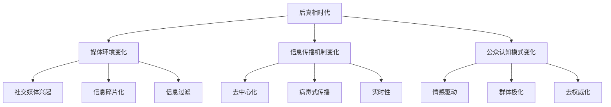

                 

### 引言与背景

#### 后真相时代的定义

“后真相时代”（Post-Truth Era）是指一个信息泛滥但事实模糊的时代。在这个时代，信息的传播速度远超事实核查的速度，公众往往基于情感、信仰或个人利益来接受信息，而不再是基于客观事实。这一概念最早由英国政治学者迈克尔·特纳在2016年提出，用来描述当时英国脱欧公投和美国总统选举中的信息传播现象。

#### 价值观重建的必要性

在后真相时代，传统的价值观体系受到严重冲击。首先，媒体环境的变迁使得信息传播更加分散，信息的真实性和权威性难以保证。其次，信息传播机制的变化，使得谣言、假新闻等得以迅速传播，公众的判断力受到挑战。最后，公众认知模式的变化，导致群体极化现象加剧，社会共识难以形成。因此，重建价值观，重塑社会共识，成为了当前时代的一项紧迫任务。

### 后真相时代的特征

#### 媒体环境的变化

1. **社交媒体的兴起**：社交媒体平台如Facebook、Twitter等，成为了信息传播的主要渠道，信息传播速度和范围远超传统媒体。
2. **信息碎片化**：由于用户注意力分散，媒体倾向于发布简短、耸动、易传播的内容，导致信息质量下降。
3. **信息过滤**：算法推荐系统使得用户接收到的信息更加个性化，但也可能导致信息茧房效应，限制用户的认知范围。

#### 信息传播机制的变化

1. **去中心化**：信息传播不再依赖于传统媒体，个体和小型媒体机构也能在网络上传播信息。
2. **病毒式传播**：谣言、假新闻等通过社交网络迅速扩散，影响广泛。
3. **实时性**：信息传播的实时性增强，事实核查往往滞后于信息传播。

#### 公众认知模式的变化

1. **情感驱动**：公众在接收信息时更加倾向于基于情感而非理性进行分析。
2. **群体极化**：社交媒体上的用户往往基于相似观点聚集，导致群体极化现象加剧。
3. **去权威化**：传统权威机构的信誉受损，公众更倾向于信任个人观点而非权威信息源。

### 重建价值观的必要性与挑战

#### 必要性分析

1. **社会稳定**：价值观是社会稳定的基础，后真相时代的信息混乱可能导致社会动荡。
2. **公共决策**：真实、准确的信息对于公共决策至关重要，后真相时代的混乱信息可能导致决策失误。
3. **个人成长**：个体需要在真实的世界中成长，后真相时代的信息环境对个人成长构成威胁。

#### 挑战与风险

1. **信息泛滥**：重建价值观需要在信息泛滥的背景下进行，如何筛选和处理信息是一个巨大的挑战。
2. **公众心理**：后真相时代的信息环境已经对公众心理造成深远影响，如何重塑公众的认知模式是一个难题。
3. **文化冲突**：不同价值观之间的冲突在后真相时代更加明显，如何实现价值观的融合是一个挑战。

### Mermaid流程图

为了更好地理解后真相时代的特征和价值观重建的必要性，我们可以使用Mermaid流程图来展示各个概念之间的关系。

通过这个流程图，我们可以清晰地看到后真相时代的特征是如何影响媒体环境、信息传播机制和公众认知模式的，进而影响到价值观的重建。

### 总结

后真相时代是一个信息复杂、价值观多元的时代。在这个时代，重建价值观显得尤为重要。我们需要认识到媒体环境、信息传播机制和公众认知模式的变化，并在此基础上制定相应的策略，以实现价值观的重建。这不仅是对社会稳定和个人成长的保障，也是对公共决策的支撑。尽管面临诸多挑战，但唯有积极应对，才能在后真相时代中找到前进的方向。

---

这篇文章的正文部分完成了引言与背景、后真相时代的特征和重建价值观的必要性与挑战三个核心章节的撰写。接下来，我们将进一步细化重建价值观的路径与方法，并引入实际案例进行深入分析。敬请期待后续内容。

