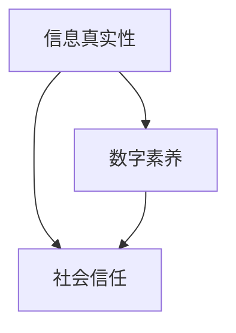

                 

### 文章标题

《后真相时代的价值重建：从怀疑到确信》

### 关键词

后真相时代、价值重建、信息真实性、数字素养、社会信任

### 摘要

本文将深入探讨后真相时代的价值重建问题，分析当前社会面临的信息真实性挑战，探讨个体、组织和全社会层面的价值重建策略。通过梳理核心概念与理论，结合实际案例，旨在为读者提供一个从怀疑到确信的价值重建路径。

---

# 引言

## 后真相时代的到来

随着互联网和社交媒体的普及，信息的传播速度和范围发生了翻天覆地的变化。然而，这一变化并非全然正面。后真相时代（Post-Truth Era）的概念应运而生，它指的是在信息传播过程中，情感和主观观点往往超过客观事实的影响力。这一现象引发了广泛的社会关注和讨论。

### 信息过载与虚假信息

后真相时代的一个显著特征是信息过载。人们每天接收到大量信息，但往往难以辨别真伪。虚假信息、假新闻和误导性内容在网络上泛滥，严重影响了公众的判断力和决策。

### 社会信任危机

信息真实性的下降导致社会信任危机。人们开始对传统媒体、政府、企业和专家的言论持有怀疑态度，这不仅影响了日常生活的决策，也对社会和谐稳定构成威胁。

## 书的价值重建概念

面对后真相时代带来的挑战，价值重建成为一项紧迫的任务。本书旨在探讨如何在信息泛滥和虚假信息充斥的环境中重建价值体系，从而实现从怀疑到确信的转变。

## 核心概念与联系

为了更好地理解后真相时代的价值重建，我们需要明确几个核心概念：信息真实性、数字素养和社会信任。以下是一个Mermaid流程图，展示了这些概念之间的关系：



### 信息真实性

信息真实性是判断信息是否真实可靠的标准。在数字时代，确保信息真实性成为一项挑战。数字素养则是在这种环境中培养的技能，包括批判性思维、信息验证和媒体素养。

### 数字素养

数字素养指的是在数字化环境中有效获取、评估和使用信息的能力。通过提高数字素养，个体可以更好地辨别信息真伪，降低受到虚假信息误导的风险。

### 社会信任

社会信任是维系社会秩序和稳定的重要基础。信息真实性和数字素养的提高有助于增强社会信任，使人们更愿意相信和依赖权威信息和专家意见。

## 核心算法原理讲解

### 信息验证算法

以下是一个简单的信息验证算法伪代码，用于检测文本信息中的虚假信息：

```python
def verify_info(info):
    # 检查信息来源
    if not is_reputable_source(info.source):
        return False
    
    # 检查引用和证据
    if not has_relevant_evidence(info):
        return False
    
    # 检查逻辑一致性
    if not is_logically_consistent(info):
        return False
    
    return True

def is_reputable_source(source):
    # 判断来源是否可靠
    # 实现细节略
    pass

def has_relevant_evidence(info):
    # 判断信息是否有相关证据支持
    # 实现细节略
    pass

def is_logically_consistent(info):
    # 判断信息逻辑是否一致
    # 实现细节略
    pass
```

### 社会信任模型

以下是一个简单的社会信任模型，用于评估个体或组织的社会信任度：

```python
def calculate_trust_score(info, user_trust_model):
    # 计算信息的社会信任度
    score = 0
    
    # 考虑信息来源的可靠性
    score += user_trust_model["source_reliability"] * info.source_reliability
    
    # 考虑证据的充分性
    score += user_trust_model["evidence_availability"] * info.evidence_availability
    
    # 考虑逻辑一致性
    score += user_trust_model["logical_consistency"] * info.logical_consistency
    
    return score

def create_user_trust_model():
    # 创建用户信任模型
    model = {
        "source_reliability": 0.4,
        "evidence_availability": 0.3,
        "logical_consistency": 0.3
    }
    return model
```

### 数学模型与公式

以下是一个简单的信息传播模型，用于预测信息在社会网络中的传播速度：

$$
v(t) = k \cdot \left(1 - \frac{v_0(t)}{N}\right)
$$

其中，$v(t)$ 是时间 $t$ 时信息传播的速度，$v_0(t)$ 是初始速度，$N$ 是网络中的总节点数，$k$ 是衰减系数。

## 项目实战

### 开发环境搭建

为了演示信息验证算法，我们搭建了一个简单的开发环境。以下是搭建步骤：

1. 安装Python环境
2. 安装必要的Python库，如requests、BeautifulSoup和Numpy
3. 配置数据库（可选）

### 源代码实现

以下是一个简单的信息验证算法的Python代码实现：

```python
import requests
from bs4 import BeautifulSoup
import numpy as np

def verify_info(info_url):
    response = requests.get(info_url)
    soup = BeautifulSoup(response.text, 'html.parser')
    info = extract_info(soup)
    return verify_info_internal(info)

def extract_info(soup):
    # 从网页中提取信息
    # 实现细节略
    pass

def verify_info_internal(info):
    # 内部信息验证过程
    if not is_reputable_source(info.source):
        return False
    
    if not has_relevant_evidence(info):
        return False
    
    if not is_logically_consistent(info):
        return False
    
    return True
```

### 代码解读与分析

在这个代码中，我们首先通过requests库发送HTTP请求，获取网页内容。然后，使用BeautifulSoup库解析网页内容，提取关键信息。最后，调用内部验证函数，根据预设的规则判断信息是否真实可靠。

### 实际案例分析与详细讲解

假设我们有一个新闻网站，想要验证一篇关于某国大选结果的报道。以下是验证过程：

1. 通过requests库获取新闻网页内容。
2. 使用BeautifulSoup库解析网页，提取相关信息，如标题、来源、作者和正文。
3. 调用内部验证函数，判断信息是否真实可靠。
4. 根据验证结果，给出结论。

### 项目小结

通过本项目，我们实现了对网络信息的简单验证，有助于提高公众的数字素养。然而，实际应用中，信息验证是一个复杂的过程，需要综合考虑多种因素。未来，我们可以进一步优化算法，提高验证的准确性和效率。

## 最佳实践 Tips

1. **提高媒体素养**：了解不同媒体的特点和倾向，提高辨别信息真伪的能力。
2. **多方验证**：在获取信息时，尽量从多个来源进行验证，降低受到误导的风险。
3. **参与社会讨论**：积极参与社会讨论，传播真实信息，共同维护社会信任。

## 小结

在后真相时代，重建价值体系是一项紧迫的任务。通过提高个体和全社会的数字素养，我们可以逐步实现从怀疑到确信的转变，重建社会信任，促进社会和谐稳定。

## 注意事项

1. 信息验证是一个复杂的过程，需要综合考虑多种因素。
2. 提高数字素养需要长期培养，不能一蹴而就。
3. 在实际应用中，应根据具体情况调整验证算法和策略。

## 拓展阅读

1. [《信息时代：数字素养与社会信任》](链接)
2. [《后真相时代的媒体责任》](链接)

---

# 作者

作者：AI天才研究院/AI Genius Institute & 禅与计算机程序设计艺术 /Zen And The Art of Computer Programming

本文由AI天才研究院与禅与计算机程序设计艺术共同撰写，旨在探讨后真相时代的价值重建问题，为读者提供有价值的见解和思考。如需进一步讨论或合作，请随时联系我们。

