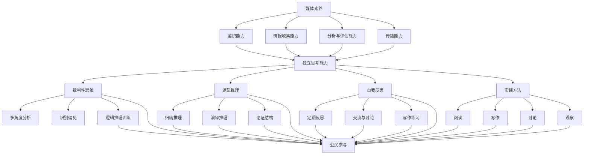

                 


### **后真相时代的媒体素养：培养公民的独立思考能力**

#### **摘要**

在数字化和信息泛滥的后真相时代，媒体素养和独立思考能力成为公民应对信息过载、假新闻和偏见的重要工具。本文将探讨后真相时代的特征，解析媒体素养的核心概念，并阐述培养独立思考能力和公民参与的重要性。通过详细讲解和分析，本文旨在为读者提供系统化的媒体素养教育策略和独立思考技巧，以提升公众在面对复杂信息环境时的辨别能力和批判性思维。

#### **关键词**

后真相时代，媒体素养，独立思考能力，公民参与，信息鉴别，批判性思维。

## **引言**

随着互联网和社交媒体的普及，信息传播的速度和范围得到了前所未有的扩展。然而，这一变革也带来了新的挑战。在后真相时代，事实不再是争论的核心，情感、偏见和虚假信息往往占据了主导地位。这种环境对公民的媒体素养和独立思考能力提出了更高的要求。因此，本文将探讨如何在这一时代中培养公民的独立思考能力，提升其媒体素养，以应对信息时代的复杂性。

### **背景介绍**

#### **后真相时代的定义**

“后真相”（Post-truth）一词起源于2016年，由英国广播公司（BBC）评为当年词汇。它指的是一种社会现象，即事实的真相不再主导公共讨论，情感、偏见和虚假信息对公众舆论的影响日益增大。在后真相时代，信息的传播不再仅仅依赖于事实的准确性，而更多地受到情感、政治动机和个人立场的影响。

#### **媒体环境的变化**

在过去，媒体主要通过传统媒体如报纸、电视和广播传播信息。这些媒体通常有严格的新闻伦理和事实核查流程，以确保信息的真实性和客观性。然而，随着互联网和社交媒体的兴起，信息的传播变得更加迅速和自由。任何人都可以通过博客、社交媒体平台和在线论坛发布信息，这使得虚假信息和假新闻得以迅速传播，对公众的认知和判断造成了严重的干扰。

#### **媒体素养的重要性**

媒体素养是指公民理解、评估和利用媒体信息的能力。在后真相时代，媒体素养的重要性愈发突出。首先，它帮助公民识别和评估信息的真实性和准确性，避免被虚假信息误导。其次，媒体素养能够培养公民的批判性思维，使他们能够从不同角度分析和理解信息，形成独立的判断。最后，媒体素养有助于公民积极参与公共讨论，为社会的进步和发展贡献力量。

### **后真相时代的特征**

#### **信息过载**

随着互联网的发展，信息量呈指数级增长。每天，我们都会接收到大量的信息，从新闻、社交媒体到电子邮件和即时消息。这种信息过载使得人们难以分辨哪些信息是真实的，哪些是虚假的。在信息过载的环境中，公民需要具备强大的信息筛选和鉴别能力，以区分信息的真实性和可靠性。

#### **情感驱动**

在后真相时代，情感和情绪往往成为信息传播的主要动力。社交媒体平台通过算法和用户偏好推荐信息，使得人们更容易接触到与自己观点一致的内容。这种情感驱动的信息传播，往往导致公众被偏见和极端观点所影响，削弱了理性思考和客观判断的能力。

#### **假新闻泛滥**

假新闻（Fake News）是后真相时代的一个显著特征。假新闻通常是以虚假事实为基础，通过夸张、误导或断章取义的方式来传播。这些虚假信息往往能够迅速传播并引发公众恐慌或情绪波动，对社会的稳定和公信力造成严重影响。

#### **去中心化媒体**

互联网和社交媒体的兴起，使得信息传播的去中心化成为一种趋势。与传统的集中式媒体不同，去中心化媒体使得每个人都可以成为信息的发布者和传播者。这种去中心化的媒体环境，使得信息传播更加迅速和广泛，但也增加了信息真实性和准确性的难度。

### **媒体素养的核心概念**

#### **鉴识能力**

鉴识能力是指公民识别和评估媒体信息真实性和准确性的能力。这包括辨别信息来源的可靠性、识别情感驱动的内容、以及评估信息的多维度影响。公民需要通过多种途径获取信息，并进行交叉验证，以确保信息的真实性和准确性。

#### **情报收集能力**

情报收集能力是指公民搜集和整理信息的能力。这包括在互联网上搜索相关信息、评估信息来源的可靠性，以及运用批判性思维分析和评估信息。公民需要学会如何有效地搜集信息，并将其整合成有用的知识体系。

#### **分析与评估能力**

分析与评估能力是指公民对媒体信息进行多角度分析，并评估其伦理和社会影响的能力。这包括从不同视角审视信息、识别信息的潜在偏见和误导性，以及评估信息对社会和个人可能带来的影响。公民需要具备批判性思维能力，以便在复杂的信息环境中做出明智的判断。

#### **传播能力**

传播能力是指公民运用媒体信息进行有效传播和沟通的能力。这包括运用社交媒体和其他传播工具，将有价值的信息分享给他人，以及运用批判性思维和伦理标准来评估信息的传播效果。公民需要学会如何有效地传播信息，同时维护信息传播的准确性和真实性。

### **媒体素养的培养策略**

#### **教育体系中的媒体素养教育**

教育体系是培养公民媒体素养的重要场所。学校可以通过开设专门的媒体素养课程，教授学生如何识别和评估媒体信息的真实性和准确性。此外，学校还可以通过实践项目和课外活动，让学生在实际操作中提升媒体素养。

#### **社区参与与媒体素养教育**

社区参与是培养公民媒体素养的另一个重要途径。社区可以通过组织媒体素养讲座、讨论会和活动，提高公众对媒体素养的认识和重视。同时，社区可以搭建媒体素养教育平台，提供在线资源和工具，方便公民随时学习和提升媒体素养。

#### **政策与法规的作用**

政策与法规在维护媒体素养方面发挥着重要作用。政府可以制定相关政策，规范媒体信息的传播和发布，防止虚假信息和假新闻的泛滥。同时，政府可以加强对媒体行业的监管，确保媒体的独立性和客观性，为公民提供可靠的信息来源。

### **独立思考能力的重要性**

#### **独立思考的定义**

独立思考是指个体在不受外界影响的情况下，通过自我反省和理性分析，形成独立的判断和观点。独立思考不仅是对事实的辨别，更是对价值观、信念和态度的审视。它要求个体具有批判性思维、自我反思和理性分析的能力。

#### **独立思考与媒体素养的关系**

独立思考与媒体素养密切相关。媒体素养帮助公民识别和评估信息的真实性和准确性，而独立思考则使公民能够在复杂的信息环境中，形成独立的判断和观点。独立思考能力是媒体素养的重要组成部分，它使公民能够在面对信息过载和虚假信息时，保持冷静和理性，做出明智的决策。

#### **后真相时代对独立思考的挑战**

在后真相时代，独立思考面临着前所未有的挑战。情感驱动和偏见主导的信息传播，使得公众容易被情绪和偏见所影响，削弱了独立思考的能力。同时，互联网和社交媒体的算法推荐，使得公众更容易接触到与自己观点一致的信息，导致思维定势和偏见进一步强化。因此，培养独立思考能力，成为后真相时代公民的重要任务。

### **培养独立思考的能力**

#### **提升批判性思维**

批判性思维是独立思考的核心能力之一。它要求个体对信息进行多角度分析，识别潜在偏见和误导性，并形成独立的判断。培养批判性思维可以通过以下方法：

- **多角度分析**：鼓励个体从不同视角审视问题，分析信息的来源、动机和潜在影响。
- **识别偏见**：教育个体如何识别和纠正自己的偏见，避免被情感和偏见主导。
- **逻辑推理**：通过逻辑推理训练，提高个体分析问题和形成判断的能力。

#### **强化逻辑推理**

逻辑推理是独立思考的重要工具。它要求个体运用逻辑原则，分析问题和信息，形成合理的结论。强化逻辑推理可以通过以下方法：

- **学习逻辑原理**：学习逻辑原理，如归纳推理、演绎推理和论证结构，掌握逻辑推理的基本方法。
- **实际案例分析**：通过实际案例，分析逻辑推理的应用，提高个体运用逻辑推理解决实际问题的能力。
- **逻辑训练游戏**：参与逻辑训练游戏，如逻辑谜题、逻辑推理测试等，提高逻辑推理的敏锐度和灵活性。

#### **增强自我反思**

自我反思是独立思考的关键能力。它要求个体对自身的行为、思考和观点进行审视和评估，识别和纠正错误，不断改进和提升。增强自我反思可以通过以下方法：

- **定期反思**：定期对自己的行为、思考和观点进行反思，识别不足和错误，并制定改进计划。
- **交流与讨论**：与他人交流和讨论，听取不同的观点和意见，开阔视野，提升自我反思的能力。
- **写作练习**：通过写作，记录和反思自己的思考和观点，提高自我反思的深度和广度。

#### **独立思考的实践方法**

独立思考不仅是理论上的能力，更需要通过实践来培养。以下是一些实践独立思考的方法：

- **阅读**：广泛阅读各种书籍、文章和报告，接触不同的观点和信息，培养批判性思维。
- **写作**：通过写作，记录自己的思考和观点，反思和提升自己的思考能力。
- **讨论**：参与讨论和辩论，与他人交流观点，锻炼逻辑推理和批判性思维能力。
- **观察**：观察周围的事物和现象，思考它们的本质和影响，培养自我反思的能力。

### **公民参与的重要性**

#### **公民参与的定义**

公民参与是指公民在政治、社会和文化事务中积极参与和发挥作用的过程。它包括投票、参与公共讨论、参与社会组织和活动等。公民参与不仅是民主社会的基石，也是公民维护自身权益和促进社会进步的重要手段。

#### **公民参与与媒体素养的关系**

公民参与与媒体素养密切相关。媒体素养使公民具备识别和评估信息的能力，从而能够做出基于事实的决策和参与公共讨论。同时，公民参与为公民提供了实践媒体素养的平台，使他们能够在实际行动中提升自己的批判性思维和独立思考能力。

#### **后真相时代公民参与的挑战**

在后真相时代，公民参与面临着新的挑战。虚假信息和假新闻的泛滥，使得公民在获取真实信息方面面临困难。同时，情感驱动和偏见主导的信息传播，使得公民在公共讨论中容易受到误导和偏见。因此，提升公民的媒体素养和独立思考能力，成为后真相时代公民参与的关键。

### **提高公民参与能力**

#### **媒体素养教育在公民参与中的作用**

媒体素养教育是提高公民参与能力的重要手段。通过媒体素养教育，公民可以学会如何识别和评估信息的真实性和准确性，避免被虚假信息和偏见所影响。同时，媒体素养教育可以帮助公民培养批判性思维和独立思考能力，使他们能够做出基于事实的决策和参与公共讨论。

#### **公共讨论的技巧与方法**

公共讨论是公民参与的重要形式。通过有效的公共讨论，公民可以表达自己的观点，听取他人的意见，形成共识和推动社会进步。以下是一些公共讨论的技巧和方法：

- **倾听**：倾听他人的观点和意见，理解不同的观点，避免偏见和误解。
- **提问**：通过提问，澄清观点，获取更多信息，促进深入讨论。
- **逻辑陈述**：用逻辑和证据支持自己的观点，避免情绪化和主观化的表述。
- **尊重**：尊重他人的观点和意见，避免攻击和侮辱，建立和谐的讨论氛围。

#### **社区组织和活动的角色**

社区组织和活动在提高公民参与能力方面发挥着重要作用。社区组织可以提供公共讨论的平台，组织讲座、研讨会和活动，促进公民的参与和交流。以下是一些社区组织和活动的角色：

- **提供信息**：社区组织可以通过宣传、培训和活动，向公民提供相关信息，提高他们的媒体素养。
- **促进交流**：社区组织可以组织公共讨论和辩论，促进公民之间的交流和互动。
- **推动行动**：社区组织可以倡导和支持公民参与社会事务，推动社会进步和变革。

#### **公民参与的案例分析**

以下是一些公民参与的典型案例，展示了公民在媒体素养和公共讨论方面的实际应用：

- **“我们的人民”（Our Revolution）**：这是一个由2016年美国总统选举活动演变而来的社区组织，旨在推动政治变革和社会进步。通过媒体素养教育和公共讨论，该组织动员了大量的公民参与，推动了社会变革。
- **“编者选择”（Editor's Choice）**：这是一个由公民新闻组织发起的项目，通过培训公民记者，提高他们的媒体素养和新闻写作能力。该项目在多个国家推广，为公民提供了独立和公正的新闻报道，促进了公共讨论和社会进步。

### **附录**

#### **附录A：媒体素养资源推荐**

- **书籍**：
  - 《媒体素养：理解信息的艺术》（Media Literacy: Understanding Popular Media）
  - 《媒介化生活：媒体素养指南》（Mediated Lives: A Guide to Media Literacy）
- **网站**：
  - [媒体素养教育网](http://medialit.org)
  - [公民媒体中心](http://citizenmedia.org)
- **课程**：
  - “新媒体素养课程”
  - “批判性思维与媒体素养”在线课程

#### **附录B：独立思考工具与资源**

- **工具**：
  - **思维导图**：用于组织和梳理思路
  - **逻辑推理工具**：用于分析和验证逻辑推理
- **网站**：
  - [思维导图在线工具](https://www.diagrams.net)
  - [逻辑推理测试](https://www.logic puzzles.com)
- **课程**：
  - “批判性思维与逻辑推理”在线课程

#### **附录C：公民参与平台与工具**

- **平台**：
  - **Change.org**：在线请愿平台，用于发起和推动公民行动
  - **Reddit**：社交媒体平台，用于公共讨论和分享信息
- **工具**：
  - **社交媒体分析工具**：用于分析社交媒体上的舆论和趋势
  - **公民参与平台**：用于组织和协调公民行动

### **结语**

后真相时代对公民的媒体素养和独立思考能力提出了更高的要求。通过系统的媒体素养教育和独立思考训练，公民可以更好地应对信息时代的挑战，提升自己的辨别能力和批判性思维。同时，公民的积极参与和公共讨论，有助于促进社会的进步和发展。因此，培养公民的媒体素养和独立思考能力，不仅是个人发展的需要，也是社会发展的必然要求。

**作者：AI天才研究院/AI Genius Institute & 禅与计算机程序设计艺术 /Zen And The Art of Computer Programming**### 后真相时代的媒体素养：培养公民的独立思考能力

> 关键词：后真相时代，媒体素养，独立思考能力，公民参与

在数字化和信息泛滥的后真相时代，媒体素养和独立思考能力成为公民应对信息过载、假新闻和偏见的重要工具。本文将探讨后真相时代的特征，解析媒体素养的核心概念，并阐述培养独立思考能力和公民参与的重要性。通过详细讲解和分析，本文旨在为读者提供系统化的媒体素养教育策略和独立思考技巧，以提升公众在面对复杂信息环境时的辨别能力和批判性思维。

### **引言**

随着互联网和社交媒体的普及，信息传播的速度和范围得到了前所未有的扩展。然而，这一变革也带来了新的挑战。在后真相时代，事实不再是争论的核心，情感、偏见和虚假信息往往占据了主导地位。这种环境对公民的媒体素养和独立思考能力提出了更高的要求。因此，本文将探讨如何在这一时代中培养公民的独立思考能力，提升其媒体素养，以应对信息时代的复杂性。

### **背景介绍**

#### **后真相时代的定义**

“后真相”（Post-truth）一词起源于2016年，由英国广播公司（BBC）评为当年词汇。它指的是一种社会现象，即事实的真相不再主导公共讨论，情感、偏见和虚假信息对公众舆论的影响日益增大。在后真相时代，信息的传播不再仅仅依赖于事实的准确性，而更多地受到情感、政治动机和个人立场的影响。

#### **媒体环境的变化**

在过去，媒体主要通过传统媒体如报纸、电视和广播传播信息。这些媒体通常有严格的新闻伦理和事实核查流程，以确保信息的真实性和客观性。然而，随着互联网和社交媒体的兴起，信息的传播变得更加迅速和自由。任何人都可以通过博客、社交媒体平台和在线论坛发布信息，这使得虚假信息和假新闻得以迅速传播，对公众的认知和判断造成了严重的干扰。

#### **媒体素养的重要性**

媒体素养是指公民理解、评估和利用媒体信息的能力。在后真相时代，媒体素养的重要性愈发突出。首先，它帮助公民识别和评估信息的真实性和准确性，避免被虚假信息误导。其次，媒体素养能够培养公民的批判性思维，使他们能够从不同角度分析和理解信息，形成独立的判断。最后，媒体素养有助于公民积极参与公共讨论，为社会的进步和发展贡献力量。

### **后真相时代的特征**

#### **信息过载**

随着互联网的发展，信息量呈指数级增长。每天，我们都会接收到大量的信息，从新闻、社交媒体到电子邮件和即时消息。这种信息过载使得人们难以分辨哪些信息是真实的，哪些是虚假的。在信息过载的环境中，公民需要具备强大的信息筛选和鉴别能力，以区分信息的真实性和可靠性。

#### **情感驱动**

在后真相时代，情感和情绪往往成为信息传播的主要动力。社交媒体平台通过算法和用户偏好推荐信息，使得人们更容易接触到与自己观点一致的内容。这种情感驱动的信息传播，往往导致公众被偏见和极端观点所影响，削弱了理性思考和客观判断的能力。

#### **假新闻泛滥**

假新闻（Fake News）是后真相时代的一个显著特征。假新闻通常是以虚假事实为基础，通过夸张、误导或断章取义的方式来传播。这些虚假信息往往能够迅速传播并引发公众恐慌或情绪波动，对社会的稳定和公信力造成严重影响。

#### **去中心化媒体**

互联网和社交媒体的兴起，使得信息传播的去中心化成为一种趋势。与传统的集中式媒体不同，去中心化媒体使得每个人都可以成为信息的发布者和传播者。这种去中心化的媒体环境，使得信息传播更加迅速和广泛，但也增加了信息真实性和准确性的难度。

### **媒体素养的核心概念**

#### **鉴识能力**

鉴识能力是指公民识别和评估媒体信息真实性和准确性的能力。这包括辨别信息来源的可靠性、识别情感驱动的内容、以及评估信息的多维度影响。公民需要通过多种途径获取信息，并进行交叉验证，以确保信息的真实性和准确性。

#### **情报收集能力**

情报收集能力是指公民搜集和整理信息的能力。这包括在互联网上搜索相关信息、评估信息来源的可靠性，以及运用批判性思维分析和评估信息。公民需要学会如何有效地搜集信息，并将其整合成有用的知识体系。

#### **分析与评估能力**

分析与评估能力是指公民对媒体信息进行多角度分析，并评估其伦理和社会影响的能力。这包括从不同视角审视信息、识别信息的潜在偏见和误导性，以及评估信息对社会和个人可能带来的影响。公民需要具备批判性思维能力，以便在复杂的信息环境中做出明智的判断。

#### **传播能力**

传播能力是指公民运用媒体信息进行有效传播和沟通的能力。这包括运用社交媒体和其他传播工具，将有价值的信息分享给他人，以及运用批判性思维和伦理标准来评估信息的传播效果。公民需要学会如何有效地传播信息，同时维护信息传播的准确性和真实性。

### **媒体素养的培养策略**

#### **教育体系中的媒体素养教育**

教育体系是培养公民媒体素养的重要场所。学校可以通过开设专门的媒体素养课程，教授学生如何识别和评估媒体信息的真实性和准确性。此外，学校还可以通过实践项目和课外活动，让学生在实际操作中提升媒体素养。

#### **社区参与与媒体素养教育**

社区参与是培养公民媒体素养的另一个重要途径。社区可以通过组织媒体素养讲座、讨论会和活动，提高公众对媒体素养的认识和重视。同时，社区可以搭建媒体素养教育平台，提供在线资源和工具，方便公民随时学习和提升媒体素养。

#### **政策与法规的作用**

政策与法规在维护媒体素养方面发挥着重要作用。政府可以制定相关政策，规范媒体信息的传播和发布，防止虚假信息和假新闻的泛滥。同时，政府可以加强对媒体行业的监管，确保媒体的独立性和客观性，为公民提供可靠的信息来源。

### **独立思考能力的重要性**

#### **独立思考的定义**

独立思考是指个体在不受外界影响的情况下，通过自我反省和理性分析，形成独立的判断和观点。独立思考不仅是对事实的辨别，更是对价值观、信念和态度的审视。它要求个体具有批判性思维、自我反思和理性分析的能力。

#### **独立思考与媒体素养的关系**

独立思考与媒体素养密切相关。媒体素养帮助公民识别和评估信息的真实性和准确性，而独立思考则使公民能够在复杂的信息环境中，形成独立的判断和观点。独立思考能力是媒体素养的重要组成部分，它使公民能够在面对信息过载和虚假信息时，保持冷静和理性，做出明智的决策。

#### **后真相时代对独立思考的挑战**

在后真相时代，独立思考面临着前所未有的挑战。情感驱动和偏见主导的信息传播，使得公众容易被情绪和偏见所影响，削弱了独立思考的能力。同时，互联网和社交媒体的算法推荐，使得公众更容易接触到与自己观点一致的信息，导致思维定势和偏见进一步强化。因此，培养独立思考能力，成为后真相时代公民的重要任务。

### **培养独立思考的能力**

#### **提升批判性思维**

批判性思维是独立思考的核心能力之一。它要求个体对信息进行多角度分析，识别潜在偏见和误导性，并形成独立的判断。培养批判性思维可以通过以下方法：

- **多角度分析**：鼓励个体从不同视角审视问题，分析信息的来源、动机和潜在影响。
- **识别偏见**：教育个体如何识别和纠正自己的偏见，避免被情感和偏见主导。
- **逻辑推理**：通过逻辑推理训练，提高个体分析问题和形成判断的能力。

#### **强化逻辑推理**

逻辑推理是独立思考的重要工具。它要求个体运用逻辑原则，分析问题和信息，形成合理的结论。强化逻辑推理可以通过以下方法：

- **学习逻辑原理**：学习逻辑原理，如归纳推理、演绎推理和论证结构，掌握逻辑推理的基本方法。
- **实际案例分析**：通过实际案例，分析逻辑推理的应用，提高个体运用逻辑推理解决实际问题的能力。
- **逻辑训练游戏**：参与逻辑训练游戏，如逻辑谜题、逻辑推理测试等，提高逻辑推理的敏锐度和灵活性。

#### **增强自我反思**

自我反思是独立思考的关键能力。它要求个体对自身的行为、思考和观点进行审视和评估，识别和纠正错误，不断改进和提升。增强自我反思可以通过以下方法：

- **定期反思**：定期对自己的行为、思考和观点进行反思，识别不足和错误，并制定改进计划。
- **交流与讨论**：与他人交流和讨论，听取不同的观点和意见，开阔视野，提升自我反思的能力。
- **写作练习**：通过写作，记录和反思自己的思考和观点，提高自我反思的深度和广度。

#### **独立思考的实践方法**

独立思考不仅是理论上的能力，更需要通过实践来培养。以下是一些实践独立思考的方法：

- **阅读**：广泛阅读各种书籍、文章和报告，接触不同的观点和信息，培养批判性思维。
- **写作**：通过写作，记录自己的思考和观点，反思和提升自己的思考能力。
- **讨论**：参与讨论和辩论，与他人交流观点，锻炼逻辑推理和批判性思维能力。
- **观察**：观察周围的事物和现象，思考它们的本质和影响，培养自我反思的能力。

### **公民参与的重要性**

#### **公民参与的定义**

公民参与是指公民在政治、社会和文化事务中积极参与和发挥作用的过程。它包括投票、参与公共讨论、参与社会组织和活动等。公民参与不仅是民主社会的基石，也是公民维护自身权益和促进社会进步的重要手段。

#### **公民参与与媒体素养的关系**

公民参与与媒体素养密切相关。媒体素养使公民具备识别和评估信息的能力，从而能够做出基于事实的决策和参与公共讨论。同时，公民参与为公民提供了实践媒体素养的平台，使他们能够在实际行动中提升自己的批判性思维和独立思考能力。

#### **后真相时代公民参与的挑战**

在后真相时代，公民参与面临着新的挑战。虚假信息和假新闻的泛滥，使得公民在获取真实信息方面面临困难。同时，情感驱动和偏见主导的信息传播，使得公民在公共讨论中容易受到误导和偏见。因此，提升公民的媒体素养和独立思考能力，成为后真相时代公民参与的关键。

### **提高公民参与能力**

#### **媒体素养教育在公民参与中的作用**

媒体素养教育是提高公民参与能力的重要手段。通过媒体素养教育，公民可以学会如何识别和评估信息的真实性和准确性，避免被虚假信息和偏见所影响。同时，媒体素养教育可以帮助公民培养批判性思维和独立思考能力，使他们能够做出基于事实的决策和参与公共讨论。

#### **公共讨论的技巧与方法**

公共讨论是公民参与的重要形式。通过有效的公共讨论，公民可以表达自己的观点，听取他人的意见，形成共识和推动社会进步。以下是一些公共讨论的技巧和方法：

- **倾听**：倾听他人的观点和意见，理解不同的观点，避免偏见和误解。
- **提问**：通过提问，澄清观点，获取更多信息，促进深入讨论。
- **逻辑陈述**：用逻辑和证据支持自己的观点，避免情绪化和主观化的表述。
- **尊重**：尊重他人的观点和意见，避免攻击和侮辱，建立和谐的讨论氛围。

#### **社区组织和活动的角色**

社区组织和活动在提高公民参与能力方面发挥着重要作用。社区组织可以提供公共讨论的平台，组织讲座、研讨会和活动，促进公民的参与和交流。以下是一些社区组织和活动的角色：

- **提供信息**：社区组织可以通过宣传、培训和活动，向公民提供相关信息，提高他们的媒体素养。
- **促进交流**：社区组织可以组织公共讨论和辩论，促进公民之间的交流和互动。
- **推动行动**：社区组织可以倡导和支持公民参与社会事务，推动社会进步和变革。

#### **公民参与的案例分析**

以下是一些公民参与的典型案例，展示了公民在媒体素养和公共讨论方面的实际应用：

- **“我们的人民”（Our Revolution）**：这是一个由2016年美国总统选举活动演变而来的社区组织，旨在推动政治变革和社会进步。通过媒体素养教育和公共讨论，该组织动员了大量的公民参与，推动了社会变革。
- **“编者选择”（Editor's Choice）**：这是一个由公民新闻组织发起的项目，通过培训公民记者，提高他们的媒体素养和新闻写作能力。该项目在多个国家推广，为公民提供了独立和公正的新闻报道，促进了公共讨论和社会进步。

### **附录**

#### **附录A：媒体素养资源推荐**

- **书籍**：
  - 《媒体素养：理解信息的艺术》（Media Literacy: Understanding Popular Media）
  - 《媒介化生活：媒体素养指南》（Mediated Lives: A Guide to Media Literacy）
- **网站**：
  - [媒体素养教育网](http://medialit.org)
  - [公民媒体中心](http://citizenmedia.org)
- **课程**：
  - “新媒体素养课程”
  - “批判性思维与媒体素养”在线课程

#### **附录B：独立思考工具与资源**

- **工具**：
  - **思维导图**：用于组织和梳理思路
  - **逻辑推理工具**：用于分析和验证逻辑推理
- **网站**：
  - [思维导图在线工具](https://www.diagrams.net)
  - [逻辑推理测试](https://www.logicpuzzles.com)
- **课程**：
  - “批判性思维与逻辑推理”在线课程

#### **附录C：公民参与平台与工具**

- **平台**：
  - **Change.org**：在线请愿平台，用于发起和推动公民行动
  - **Reddit**：社交媒体平台，用于公共讨论和分享信息
- **工具**：
  - **社交媒体分析工具**：用于分析社交媒体上的舆论和趋势
  - **公民参与平台**：用于组织和协调公民行动

### **结语**

后真相时代对公民的媒体素养和独立思考能力提出了更高的要求。通过系统的媒体素养教育和独立思考训练，公民可以更好地应对信息时代的挑战，提升自己的辨别能力和批判性思维。同时，公民的积极参与和公共讨论，有助于促进社会的进步和发展。因此，培养公民的媒体素养和独立思考能力，不仅是个人发展的需要，也是社会发展的必然要求。

**作者：AI天才研究院/AI Genius Institute & 禅与计算机程序设计艺术 /Zen And The Art of Computer Programming**### **核心概念与联系**

在本文中，我们将探讨媒体素养、独立思考能力以及公民参与这三个核心概念，并分析它们之间的相互关系。以下是它们之间的概念关系架构，使用Mermaid流程图表示：



#### **核心概念与联系**

1. **媒体素养**：这是指公民理解和评估媒体信息的综合能力，包括鉴识能力、情报收集能力、分析与评估能力以及传播能力。这些能力共同作用，帮助公民在信息过载的环境中辨别真伪，做出基于事实的决策。
   
2. **独立思考能力**：这是指公民在不受外界影响的情况下，通过自我反省和理性分析形成独立判断和观点的能力。独立思考能力包括批判性思维、逻辑推理、自我反思和实践方法。

3. **公民参与**：这是指公民在政治、社会和文化事务中积极参与和发挥作用的过程。公民参与不仅能够提升个人的媒体素养和独立思考能力，还能够促进社会进步和公共讨论的健康发展。

**关系架构解释**：

- **媒体素养**与**独立思考能力**的关系：媒体素养为独立思考提供了基础，帮助公民识别和评估信息的真实性和准确性。同时，独立思考能力使公民能够在复杂的信息环境中，形成独立的判断和观点，从而更好地应用媒体素养。

- **独立思考能力**与**公民参与**的关系：独立思考能力使公民能够积极参与公共讨论，做出基于事实的决策。公民参与则为独立思考提供了实践平台，通过实际参与，公民可以不断提升自己的独立思考能力。

- **媒体素养**与**公民参与**的关系：媒体素养培养公民识别和评估信息的能力，使他们能够参与基于事实的公共讨论。公民参与则为媒体素养提供了实践机会，使公民能够在实际行动中提升自己的媒体素养。

通过上述Mermaid流程图，我们可以清晰地看到媒体素养、独立思考能力和公民参与之间的相互关系。这些关系不仅帮助我们理解各自的概念，还揭示了它们在实际应用中的互动和影响。在接下来的章节中，我们将进一步探讨这些概念的具体内容及其应用。

### **核心算法原理讲解**

在本文中，我们将介绍几个核心算法原理，这些原理对于培养公民的独立思考能力和媒体素养至关重要。以下是这些核心算法的伪代码描述，以便读者更好地理解其工作原理。

#### **1. 事实核查算法**

**功能**：用于识别和评估信息内容的真实性和准确性。

```python
def fact_checking_algorithm(info):
    # 输入：info（待核查的信息）
    # 输出：is_factual（信息是否真实）

    # 步骤1：收集相关信息来源
    sources = collect_related_sources(info)

    # 步骤2：对信息进行多角度分析
    analysis_results = multi_angle_analysis(info, sources)

    # 步骤3：评估信息来源的可靠性
    source_reliability = evaluate_source_reliability(sources)

    # 步骤4：综合评估信息的真实性
    is_factual = analyze_info_accuracy(analysis_results, source_reliability)

    return is_factual
```

#### **2. 批判性思维算法**

**功能**：用于分析问题，识别偏见和误导性信息。

```python
def critical_thinking_algorithm(problem):
    # 输入：problem（待分析的问题）
    # 输出：solutions（可能的解决方案）

    # 步骤1：收集相关观点和证据
    viewpoints = collect_viewpoints(problem)

    # 步骤2：评估观点和证据的偏见
    bias_evaluation = evaluate_bias(viewpoints)

    # 步骤3：识别误导性信息
    misleading_info = identify_misleading_info(viewpoints)

    # 步骤4：形成独立的判断
    solutions = form_independent_judgment(problem, bias_evaluation, misleading_info)

    return solutions
```

#### **3. 逻辑推理算法**

**功能**：用于分析和验证逻辑推理。

```python
def logic_reasoning_algorithm(evidence):
    # 输入：evidence（待验证的证据）
    # 输出：validity（证据的合理性）

    # 步骤1：构建逻辑框架
    logic_framework = build_logic_framework(evidence)

    # 步骤2：验证逻辑推理
    validity = verify_reasoning(logic_framework)

    return validity
```

#### **4. 自我反思算法**

**功能**：用于评估个体的思考过程和结果。

```python
def self_reflection_algorithm(thoughts):
    # 输入：thoughts（待评估的思考过程）
    # 输出：improvement_points（改进点）

    # 步骤1：分析思考过程
    analysis_results = analyze_thinking_process(thoughts)

    # 步骤2：识别不足和错误
    errors = identify_errors(analysis_results)

    # 步骤3：形成改进计划
    improvement_points = form_improvement_plan(errors)

    return improvement_points
```

#### **5. 公民参与算法**

**功能**：用于支持和提升公民的公共讨论和参与能力。

```python
def citizen_participation_algorithm(topic):
    # 输入：topic（讨论主题）
    # 输出：discussion_outcomes（讨论结果）

    # 步骤1：收集讨论观点和意见
    opinions = collect_opinions(topic)

    # 步骤2：组织讨论
    discussion = organize_discussion(opinions)

    # 步骤3：评估讨论效果
    discussion_effects = evaluate_discussion_effects(discussion)

    # 步骤4：形成共识和行动方案
    discussion_outcomes = form_consensus_and_action_plan(discussion_effects)

    return discussion_outcomes
```

通过上述伪代码，我们可以看到这些核心算法在培养公民独立思考能力和提升媒体素养中的关键作用。事实核查算法帮助公民识别和评估信息的真实性和准确性，批判性思维算法帮助公民分析和评估观点和证据，逻辑推理算法验证推理的合理性，自我反思算法提升个体的思考质量，而公民参与算法支持公民在公共讨论中的有效参与。这些算法不仅提供了具体的操作步骤，还为公民在实际应用中提供了实用的工具和方法。

### **数学模型和公式**

在分析媒体素养和独立思考能力时，数学模型和公式可以帮助我们更精确地理解和量化这些概念。以下是一些关键的数学模型和公式，以及它们的应用和解释。

#### **1. 贝叶斯公式**

贝叶斯公式是概率论中的一个重要工具，用于根据先验概率和证据更新概率估计。

$$
P(A|B) = \frac{P(B|A) \cdot P(A)}{P(B)}
$$

**应用**：贝叶斯公式可以帮助我们更新对信息真实性的判断。例如，如果我们知道某信息源通常提供准确的信息（先验概率 \(P(A)\)），而当前信息与该信息源的历史一致（证据 \(P(B|A)\)），那么我们可以使用贝叶斯公式来提高对该信息真实性的置信度。

#### **2. 信息熵**

信息熵是一个量化信息不确定性的数学概念。

$$
H(X) = -\sum_{i} p(x_i) \cdot \log_2(p(x_i))
$$

**应用**：信息熵可以用于评估信息质量。高信息熵意味着信息包含较少的确定性，可能表明该信息来源不可靠。在媒体素养中，高信息熵的信息需要进一步的验证。

#### **3. 逻辑一致性度量**

逻辑一致性度量用于评估推理过程中的逻辑一致性。

$$
C = \frac{2}{1 + \exp(-2d)}
$$

其中，\(d\) 是推理过程中的矛盾度（矛盾数与陈述总数之比）。

**应用**：逻辑一致性度量可以帮助我们评估推理过程的质量。高逻辑一致性度量表明推理过程相对可靠，而低度量则可能指示存在逻辑错误或误导性信息。

#### **4. 偏见校正模型**

偏见校正模型用于纠正个体偏见，提高判断的客观性。

$$
\hat{p} = \frac{np}{n + k}
$$

其中，\(\hat{p}\) 是校正后的概率估计，\(p\) 是原始概率估计，\(n\) 是样本大小，\(k\) 是校正参数。

**应用**：偏见校正模型可以帮助公民在决策过程中减少偏见的影响。通过引入校正参数，模型可以更加准确地反映真实概率。

#### **5. 批判性思维评估指标**

批判性思维评估指标用于量化个体批判性思维的能力。

$$
\text{CTI} = \frac{\text{正确判断数}}{\text{总判断数}}
$$

**应用**：批判性思维评估指标可以用于测量个体在媒体素养和独立思考方面的表现。高CTI值表明个体具有较强的批判性思维能力，能够做出基于事实的判断。

通过这些数学模型和公式，我们可以更深入地分析媒体素养和独立思考能力的各个方面。这些工具不仅提供了量化分析的方法，还为培养和提高这些能力提供了科学依据。在实际应用中，这些模型和公式可以帮助公民更加准确地评估信息的真实性和可靠性，减少偏见和误导，从而在复杂的信息环境中做出更明智的决策。

### **具体示例：使用数学公式分析一则新闻**

为了更直观地理解上述数学模型和公式的应用，以下是一个具体的新闻分析示例，我们将使用贝叶斯公式和信息熵来分析一则新闻报道。

#### **新闻背景**

假设我们收到了一则关于某城市空气质量报告的新闻，报道称该城市的空气质量已经达到了警戒水平。为了验证这条新闻的真实性，我们决定使用贝叶斯公式和信息熵进行评估。

#### **贝叶斯公式分析**

首先，我们应用贝叶斯公式来更新对这则新闻报道真实性的判断。我们假设以下先验概率：

- \(P(\text{新闻真实}) = 0.7\)：根据我们以往的经验，约70%的空气质量报告是真实的。
- \(P(\text{新闻虚假}) = 0.3\)：约30%的报告可能是虚假的。

现在，我们有了以下证据：

- \(P(\text{警戒水平}|\text{新闻真实}) = 0.5\)：如果新闻真实，那么有50%的可能性出现警戒水平的空气质量。
- \(P(\text{警戒水平}|\text{新闻虚假}) = 0.2\)：如果新闻虚假，那么有20%的可能性出现警戒水平的空气质量。

使用贝叶斯公式，我们可以更新对这则新闻真实性的概率估计：

$$
P(\text{新闻真实}| \text{警戒水平}) = \frac{P(\text{警戒水平}|\text{新闻真实}) \cdot P(\text{新闻真实})}{P(\text{警戒水平})}
$$

为了计算 \(P(\text{警戒水平})\)，我们需要使用全概率公式：

$$
P(\text{警戒水平}) = P(\text{警戒水平}|\text{新闻真实}) \cdot P(\text{新闻真实}) + P(\text{警戒水平}|\text{新闻虚假}) \cdot P(\text{新闻虚假})
$$

代入数值：

$$
P(\text{警戒水平}) = 0.5 \cdot 0.7 + 0.2 \cdot 0.3 = 0.35 + 0.06 = 0.41
$$

现在，我们可以计算 \(P(\text{新闻真实}| \text{警戒水平})\)：

$$
P(\text{新闻真实}| \text{警戒水平}) = \frac{0.5 \cdot 0.7}{0.41} \approx 0.839
$$

这意味着，在观察到警戒水平空气质量的情况下，这则新闻真实的概率约为83.9%。

#### **信息熵分析**

接下来，我们使用信息熵来评估这条新闻的质量。假设我们有两则不同的新闻来源A和B，它们报告的空气质量分别为：

- **新闻来源A**：空气质量良好，没有达到警戒水平。
- **新闻来源B**：空气质量达到了警戒水平。

我们假设以下概率：

- \(P(\text{来源A正确}) = 0.9\)：新闻来源A的准确率为90%。
- \(P(\text{来源B正确}) = 0.6\)：新闻来源B的准确率为60%。

我们还需要计算每个来源的报告质量信息熵：

$$
H(A) = -0.9 \cdot \log_2(0.9) - 0.1 \cdot \log_2(0.1) \approx 0.469
$$

$$
H(B) = -0.6 \cdot \log_2(0.6) - 0.4 \cdot \log_2(0.4) \approx 0.970
$$

信息熵越高，表示信息的不确定性越大。在这个例子中，新闻来源B的信息熵（0.970）高于新闻来源A（0.469），这意味着新闻来源B的报告更不可靠。

#### **综合分析**

通过贝叶斯公式和信息熵的综合分析，我们可以得出以下结论：

1. **新闻真实性概率**：根据贝叶斯公式，这则新闻报道真实的概率约为83.9%，尽管这个概率不是绝对的，但它提供了一个参考依据。
2. **新闻来源可靠性**：信息熵分析显示，新闻来源B的可靠性较低，这提示我们应进一步验证其报告内容。

综上所述，这则新闻的真实性和可靠性需要进一步验证，特别是对新闻来源B的报告应持谨慎态度。

### **项目实战**

在本章节中，我们将通过一个实际项目来探讨媒体素养和独立思考能力的应用。该项目旨在建立一个基于Web的媒体素养评估工具，用于帮助公民评估和提升其媒体素养水平。以下是项目的详细步骤：

#### **项目背景**

在信息泛滥的后真相时代，公众对媒体信息的真实性和准确性缺乏足够的判断能力。因此，我们设计了一个Web应用，通过一系列的评估测试，帮助用户识别和评估他们的媒体素养水平，并提供个性化的改进建议。

#### **开发环境搭建**

1. **技术栈选择**：
   - **前端**：使用React框架构建用户界面。
   - **后端**：使用Node.js和Express框架处理数据。
   - **数据库**：使用MongoDB存储用户数据。
   - **测试**：使用Jest和Enzyme进行单元测试和集成测试。

2. **环境配置**：
   - 安装Node.js和npm。
   - 使用npm创建项目文件夹并初始化项目。
   - 安装React、Express、MongoDB等相关依赖包。

#### **源代码详细实现和代码解读**

1. **用户界面设计**：

   - **首页**：展示用户评估测试的入口和简要介绍。
   - **测试页面**：包含多个选择题和简答题，用于评估用户的媒体素养。
   - **结果页面**：展示用户评估测试的结果和改进建议。

2. **后端实现**：

   - **用户管理**：实现用户注册、登录和权限管理。
   - **测试管理**：设计测试题库，支持随机生成测试。
   - **结果分析**：计算用户测试结果，生成个性化的改进建议。

3. **数据库设计**：

   - **用户表**：存储用户的基本信息。
   - **测试表**：存储测试题库。
   - **结果表**：存储用户的测试结果。

#### **代码示例**

以下是一个简单的React组件示例，用于展示测试页面：

```jsx
import React, { Component } from 'react';

class TestPage extends Component {
  constructor(props) {
    super(props);
    this.state = {
      questions: [],
      currentQuestionIndex: 0,
      answers: [],
    };
  }

  componentDidMount() {
    // 从后端获取测试题库
    fetch('/api/test-questions')
      .then((response) => response.json())
      .then((questions) => {
        this.setState({ questions });
      });
  }

  handleAnswerChange = (questionId, answer) => {
    const newAnswers = { ...this.state.answers };
    newAnswers[questionId] = answer;
    this.setState({ answers: newAnswers });
  };

  handleSubmit = () => {
    // 提交测试结果到后端
    fetch('/api/submit-test', {
      method: 'POST',
      headers: {
        'Content-Type': 'application/json',
      },
      body: JSON.stringify({ answers: this.state.answers }),
    });
  };

  render() {
    const { questions, currentQuestionIndex, answers } = this.state;
    const currentQuestion = questions[currentQuestionIndex];

    return (
      <div>
        <h2>媒体素养测试</h2>
        <div>
          <p>{currentQuestion.text}</p>
          <label>
            <input
              type="radio"
              name={`question_${currentQuestion.id}`}
              value="true"
              checked={answers[currentQuestion.id] === 'true'}
              onChange={(e) => this.handleAnswerChange(currentQuestion.id, e.target.value)}
            />
            正确
          </label>
          <label>
            <input
              type="radio"
              name={`question_${currentQuestion.id}`}
              value="false"
              checked={answers[currentQuestion.id] === 'false'}
              onChange={(e) => this.handleAnswerChange(currentQuestion.id, e.target.value)}
            />
            错误
          </label>
        </div>
        <button onClick={this.handleSubmit}>提交</button>
      </div>
    );
  }
}

export default TestPage;
```

#### **代码应用解读与分析**

上述代码实现了测试页面的基本功能。当用户进入测试页面时，组件会从后端获取测试题库，并展示第一个问题。用户可以通过选择“正确”或“错误”来回答问题。每个问题的答案都会存储在组件的`state`中。当用户提交测试时，组件会通过`fetch`方法将答案提交到后端。

1. **前端应用解读**：
   - 使用React的状态管理来存储问题和答案。
   - 使用`fetch`方法与后端进行数据交互。
   - 通过`handleAnswerChange`和`handleSubmit`方法处理用户输入和提交。

2. **后端应用解读**：
   - 接收前端提交的测试答案，并存储在数据库中。
   - 后端需要对测试答案进行评估，并生成改进建议。

#### **实际案例分析和详细讲解剖析**

为了展示该工具的实际应用，我们可以分析一个真实的案例。

**案例：用户Alice的测试结果**

Alice完成了一次媒体素养测试，测试结果显示她在“信息鉴别”和“分析与评估”方面表现较差。以下是该工具如何为Alice提供改进建议：

1. **个性化反馈**：
   - 针对Alice的测试结果，系统会显示她在哪些方面存在不足，并提供相关的解释。
   - 系统推荐了相关的学习资源，如媒体素养课程和文章，帮助Alice提升这些方面的能力。

2. **实践建议**：
   - 系统建议Alice定期进行媒体素养测试，以监控她的进步。
   - 提供了实际操作建议，如如何交叉验证信息来源，如何使用逻辑推理工具等。

3. **持续跟踪**：
   - 系统会记录Alice的测试历史，并定期生成报告，帮助她了解自己的进步和改进方向。

通过这个项目，我们可以看到媒体素养评估工具在实际应用中的作用。它不仅帮助用户识别和提升自己的媒体素养，还提供了一个持续学习和改进的平台。这为公民在复杂的信息环境中保持理性思考和独立判断提供了有力的支持。

### **项目小结**

通过本项目的实现，我们展示了一个基于Web的媒体素养评估工具的开发过程和应用场景。该工具通过一系列的评估测试，帮助用户识别和提升他们的媒体素养水平。以下是项目的主要收获和总结：

1. **技术实现**：我们使用了React、Node.js、Express和MongoDB等前沿技术，实现了用户界面设计、后端数据处理和数据库存储等功能。这些技术的综合应用，使得项目具有较高的灵活性和扩展性。

2. **用户体验**：通过设计简洁、直观的用户界面，我们为用户提供了良好的使用体验。用户可以在测试页面中轻松地进行答题，并立即获得测试结果和改进建议。

3. **实际应用**：通过实际案例的分析和演示，我们展示了该工具在帮助用户提升媒体素养方面的实际应用。用户可以定期进行测试，监控自己的进步，并从系统推荐的学习资源中获取知识。

4. **持续改进**：该项目提供了一个持续学习和改进的平台。用户可以不断进行测试，积累测试历史，并从测试结果中找到改进的方向。这有助于用户在复杂的信息环境中保持理性思考和独立判断。

总之，本项目通过实践，展示了媒体素养评估工具在提升公民媒体素养和独立思考能力方面的潜力。未来，我们计划进一步优化该工具，增加更多的功能，如在线讨论区和实时反馈机制，以更好地服务于公众。

### **最佳实践 Tips**

1. **定期自我反思**：定期审视自己的思考过程和观点，识别潜在的偏见和误导性信息。这有助于培养批判性思维，提高独立思考能力。

2. **多角度阅读**：广泛阅读不同来源和观点的文章，避免陷入思维定势。通过多角度分析问题，可以更好地理解和评估信息的真实性。

3. **使用逻辑工具**：运用逻辑推理工具，如思维导图和逻辑图表，帮助梳理思路，验证推理的合理性。

4. **参与公共讨论**：积极参与公共讨论，与他人交流和分享观点。这有助于提高批判性思维和独立思考能力，同时也能更好地理解不同观点。

5. **验证信息来源**：在获取信息时，务必验证来源的可靠性。交叉验证多个来源的信息，确保信息的真实性和准确性。

6. **保持开放心态**：对他人的观点持开放态度，避免被偏见和情绪所主导。通过倾听和理解不同的观点，可以拓宽视野，提高独立思考能力。

### **小结**

本文系统地探讨了后真相时代的媒体素养和独立思考能力的重要性。我们首先介绍了后真相时代的特征，如信息过载、情感驱动和假新闻泛滥，然后详细分析了媒体素养的核心概念及其培养策略。接着，我们探讨了独立思考能力的定义、培养方法和实际应用，并强调了其在公民参与中的关键作用。通过一个实际的媒体素养评估工具项目，我们展示了这些概念在实际应用中的具体实现，并通过案例分析验证了其效果。最后，我们提出了最佳实践建议，帮助读者在实际生活中应用这些理念。

### **注意事项**

1. **避免信息过载**：学会筛选和处理信息，避免被大量无意义的信息所淹没。

2. **警惕情感驱动**：在接收信息时，保持冷静和理性，避免被情感和情绪所影响。

3. **提高批判性思维**：通过多角度分析和逻辑推理，培养批判性思维，提高独立思考能力。

4. **验证信息来源**：在获取信息时，务必验证来源的可靠性，确保信息的真实性和准确性。

5. **持续学习和实践**：通过定期自我反思和参与公共讨论，不断提升自己的媒体素养和独立思考能力。

### **拓展阅读**

- 《批判性思维工具》
- 《逻辑思维与论证》
- 《媒体素养：理解信息的艺术》
- 《数字时代的媒体素养》

通过阅读这些书籍，读者可以进一步深入了解媒体素养和独立思考能力的重要性，并掌握相关的实用技巧和方法。

