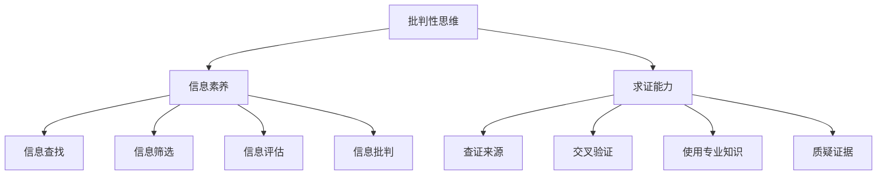

                 

### 1. 文章标题：后真相时代的真相追寻：培养批判性思维和求证能力

#### 关键词：后真相时代、批判性思维、求证能力、信息素养、真相追寻

> 摘要：在信息泛滥的后真相时代，虚假信息和错误观念对社会的危害日益加剧。本文旨在探讨如何在这样一个复杂的环境中培养批判性思维和求证能力，以追寻真相并提升个人的信息素养。本文分为四个主要部分：背景介绍、核心概念与联系、具体策略与方法、以及最佳实践与案例分析。通过系统的分析和逻辑推理，本文希望能够为读者提供一套行之有效的策略，帮助他们在信息海洋中辨别真伪，培养独立思考的能力。

----------------------------------------------------------------

## 引言：后真相时代的挑战

### 背景介绍

在互联网和社交媒体快速发展的时代，信息传播的速度和广度前所未有。然而，这一进步同时也带来了一个严峻的问题：信息的真实性受到了严重的挑战。我们生活在一个被称为“后真相时代”的时代，其中情感和偏见往往比事实更能影响公众舆论。这种现象的典型表现是虚假新闻、误导性信息和谣言的泛滥。这些问题不仅对个人的认知产生了影响，也对社会的稳定和信任体系构成了威胁。

### 核心概念与联系

**后真相时代的定义**：后真相时代（post-truth era）是指事实与真相不再是决策和舆论形成的主要依据，而情感、信仰和直觉等因素更加重要。

**批判性思维**：批判性思维是指通过理性的分析和评估来解决问题和决策的过程。它包括质疑信息的来源、评估证据的可靠性、以及独立思考的能力。

**求证能力**：求证能力是指通过一系列方法来验证信息真实性的能力，包括查证来源、交叉验证、以及运用专业知识进行分析。

**信息素养**：信息素养是指个体在信息社会中获取、评估、使用和创建信息的能力。它包括信息查找、信息筛选、信息分析和信息伦理等多个方面。

以上这些概念之间有着密切的联系：批判性思维和求证能力是提升信息素养的重要手段，而信息素养则是应对后真相时代挑战的基础。

### 文章结构

本文将分为四个主要部分：

1. **背景介绍**：阐述后真相时代的挑战和核心概念。
2. **具体策略与方法**：详细探讨培养批判性思维和求证能力的策略和方法。
3. **最佳实践与案例分析**：通过实际案例来展示如何应用这些策略和方法。
4. **结论与展望**：总结全文，并讨论未来可能的发展方向。

### 逻辑清晰、结构紧凑、简单易懂的章节标题

1. **后真相时代的挑战与困境**
   - **1.1 真相追寻的困难**
   - **1.2 信息素养的重要性**

2. **批判性思维的培养**
   - **2.1 批判性思维的定义与特征**
   - **2.2 批判性思维的方法与实践**

3. **求证能力的提升**
   - **3.1 求证能力的重要性**
   - **3.2 求证的具体步骤**

4. **最佳实践与案例分析**
   - **4.1 事实核查与谣言粉碎**
   - **4.2 实际案例解析**

5. **结论与展望**
   - **5.1 总结与反思**
   - **5.2 未来发展展望**

通过这样的结构设计，本文将帮助读者系统性地了解后真相时代的真相追寻策略，并提供实用的方法来提升个人的批判性思维和求证能力。

## 后真相时代的挑战与困境

### 真相追寻的困难

在后真相时代，真相追寻面临着前所未有的困难。首先，虚假信息和错误观念的泛滥使得辨别真伪变得更加复杂。社交媒体平台上的信息传播速度极快，一条虚假新闻可以在短时间内被广泛传播，影响大量用户的判断。此外，社交媒体的算法推荐系统往往倾向于推送符合用户兴趣和偏好的内容，这加剧了信息茧房的形成，使得个体难以接触到多样化的信息来源，从而无法全面了解事实真相。

### 信息素养的重要性

在面对大量虚假信息和错误观念时，信息素养成为了真相追寻的关键。信息素养不仅包括对信息的查找和筛选能力，更重要的是对信息的评估和批判能力。具备高信息素养的人能够更加准确地评估信息的真实性、准确性和可靠性，从而避免被误导和欺骗。

### 批判性思维与求证能力的培养

为了在信息泛滥的后真相时代追寻真相，我们迫切需要培养批判性思维和求证能力。批判性思维是一种理性思考的能力，它要求我们在面对信息时，不仅要接受，还要质疑和评估。求证能力则是一种通过多种方法验证信息真实性的能力，它要求我们在获取信息后，进一步查证其来源、方法和过程。

### 提升信息素养的方法

1. **提高信息查找能力**：利用各种工具和资源，如图书馆、学术数据库、搜索引擎等，高效地获取所需信息。
2. **培养信息筛选能力**：学会辨别信息的真实性和可靠性，关注权威来源和可靠证据。
3. **增强信息评估能力**：对获取的信息进行深入分析，评估其合理性、逻辑性和证据支持。
4. **培养信息批判能力**：在评估信息时，不仅要关注事实本身，还要考虑信息的背景、动机和潜在偏见。

通过这些方法，我们可以逐步提升信息素养，从而更好地应对后真相时代的挑战，追寻真相。

### 核心概念与联系：批判性思维、求证能力与信息素养

在理解后真相时代的真相追寻过程中，批判性思维、求证能力和信息素养是三个关键概念，它们之间相互关联，共同构成了应对信息泛滥的有效策略。

**批判性思维**是理性分析信息的能力，它强调质疑、分析和评估。批判性思维帮助我们识别信息的潜在偏见、逻辑错误和误导性陈述，从而避免被虚假信息所误导。具体来说，批判性思维包括以下几个步骤：

1. **识别问题**：明确需要解决的问题或需要评估的信息。
2. **收集信息**：从多个来源收集相关信息，确保信息的多样性和全面性。
3. **分析信息**：对收集到的信息进行分析，评估其逻辑性、一致性和证据支持。
4. **评估假设**：根据分析结果，评估原始假设的合理性和准确性。

**求证能力**是在批判性思维的基础上，通过具体的方法和步骤验证信息的真实性。求证能力包括以下关键环节：

1. **查证来源**：确认信息来源的可靠性和权威性，避免从不可信的渠道获取信息。
2. **交叉验证**：通过对比多个来源的信息，验证其一致性，提高信息的可信度。
3. **使用专业知识**：运用相关领域的专业知识，对信息进行深入分析和评估。
4. **质疑证据**：评估证据的可靠性和有效性，避免被表面证据所迷惑。

**信息素养**是个人在信息社会中获取、评估和使用信息的能力，它涵盖了信息查找、筛选、评估和批判等多个方面。信息素养不仅包括技术层面的技能，更重要的是思维层面的能力。具体包括：

1. **信息查找**：利用各种工具和资源，高效地获取所需信息。
2. **信息筛选**：辨别信息的真实性和可靠性，关注权威来源和可靠证据。
3. **信息评估**：对获取的信息进行深入分析，评估其合理性、逻辑性和证据支持。
4. **信息批判**：在评估信息时，不仅要关注事实本身，还要考虑信息的背景、动机和潜在偏见。

**Mermaid 流程图：批判性思维、求证能力与信息素养的关系架构**

通过上述步骤和概念，我们可以构建一个完整的真相追寻框架，从而在信息泛滥的后真相时代更好地追寻真相。批判性思维、求证能力和信息素养不仅是应对信息泛滥的工具，也是提升个人认知能力和判断力的关键。通过这些能力的培养，我们能够在复杂的信息环境中保持清晰的思维，避免被虚假信息所误导。

### 批判性思维的培养

批判性思维是一种重要的能力，它可以帮助我们在面对信息时保持理性，避免被虚假和误导性的信息所左右。要培养批判性思维，我们需要了解其定义、特征，并掌握一系列实践方法。

**1. 批判性思维的定义**

批判性思维是一种主动、系统的分析、评估和思考过程，它不仅仅是简单的质疑或批评，而是一种深入、全面的理性思考能力。具体来说，批判性思维包括以下几个关键要素：

- **质疑性**：对接受的信息持怀疑态度，不断追问“为什么”和“如何”，以便更全面地理解信息。
- **分析性**：对信息进行详细的分析，包括其逻辑结构、证据支持、假设前提等。
- **系统性**：将信息放入更广泛的背景中进行考虑，分析其与其他信息之间的关系。
- **评估性**：对信息的真实性、可靠性、有效性等进行评估，判断其是否合理和可信。
- **创造性**：在思考过程中，不拘泥于现有的观点和结论，尝试提出新的见解和解决方案。

**2. 批判性思维的特征**

批判性思维具有以下几个显著特征：

- **独立性**：不依赖他人的观点，能够独立进行思考和判断。
- **开放性**：对不同的观点和证据持开放态度，愿意接受和考虑不同的意见。
- **逻辑性**：遵循逻辑规则，确保思考的连贯性和一致性。
- **系统性**：将问题放在更广泛的背景和上下文中进行分析，避免片面和孤立地看待问题。
- **反思性**：在思考过程中不断反思和修正自己的观点，确保其合理性和准确性。

**3. 批判性思维的实践方法**

要培养批判性思维，我们可以采取以下几种实践方法：

- **提问法**：在面对信息时，积极提问，例如“这个信息的来源是什么？”“这个观点的依据是什么？”“这个结论是如何得出的？”等。
- **反思法**：在接收信息后，进行反思，思考自己是否真的理解了信息的内容和含义，以及是否接受了其中的假设和前提。
- **多角度分析法**：从多个角度和立场来分析问题，避免片面和偏颇的看法。
- **证据分析法**：评估信息的证据支持是否充分，是否具有可靠性和有效性。
- **论证构建法**：尝试构建自己的论证，确保其逻辑性和说服力。

**4. 提升批判性思维的具体步骤**

- **识别问题**：明确需要解决的问题或需要评估的信息。
- **收集信息**：从多个来源收集相关信息，确保信息的多样性和全面性。
- **分析信息**：对收集到的信息进行详细的分析，评估其逻辑性、一致性和证据支持。
- **评估假设**：根据分析结果，评估原始假设的合理性和准确性。
- **构建论证**：整合分析结果，构建自己的论证，确保其逻辑连贯和具有说服力。

通过以上方法，我们可以逐步提升批判性思维，从而在面对复杂信息时保持清晰的思维和独立判断的能力。批判性思维的培养不仅有助于我们更好地应对后真相时代的挑战，也是提升个人认知水平和决策能力的重要途径。

### 求证能力的提升

求证能力是辨别信息真伪的关键能力，它要求我们通过一系列方法来验证信息的可靠性。在信息泛滥的后真相时代，提升求证能力显得尤为重要。以下是一些具体的步骤和方法，帮助我们在面对信息时更加理性地进行判断。

**1. 查证来源**

验证信息的真实性的第一步是查证其来源。我们需要确保信息的出处是可靠的，这是评估信息可信度的基础。以下是一些查证来源的方法：

- **查找官方信息**：对于政府、学术机构、专业组织等发布的官方信息，通常具有较高的可信度。
- **确认权威性**：评估信息发布者的权威性，例如他们的专业背景、工作经验和声誉。
- **核实事实**：通过权威数据库或事实核查网站（如 Snopes、FactCheck.org 等）来核实信息。

**2. 交叉验证**

通过对比多个来源的信息，可以进一步提高信息的可信度。以下是一些交叉验证的方法：

- **多渠道查询**：从不同的媒体和来源获取同一信息，比较其描述是否一致。
- **学术验证**：查找学术期刊、研究报告等权威学术资源，以验证信息的科学性和准确性。
- **社交媒体验证**：在社交媒体上查找相关话题的讨论和评论，了解不同观点的对比和评价。

**3. 使用专业知识**

运用相关领域的专业知识对信息进行深入分析，可以帮助我们更好地判断其真实性和可靠性。以下是一些使用专业知识的方法：

- **专业机构评估**：咨询相关领域的专业人士或专业机构，获取他们的专业意见和建议。
- **学术研究**：参考该领域的学术研究和论文，了解当前的研究动态和共识。
- **专家意见**：查阅专家的访谈和报告，了解他们的专业观点和解释。

**4. 质疑证据**

评估证据的可靠性和有效性是求证能力的核心。以下是一些质疑证据的方法：

- **证据来源**：确认证据的来源，是否来自权威和可信的渠道。
- **证据类型**：分析证据的类型，例如实验数据、统计数据、目击证言等，评估其可靠性和代表性。
- **证据质量**：评估证据的质量，包括数据采集的方法、分析的过程和结论的合理性。

**5. 实际案例**

以下是一个实际案例，说明如何运用求证能力来评估信息的真实性：

**案例**：某社交媒体上流传一则关于某城市环境污染的数据，声称该城市的空气质量指数（AQI）达到了极高的水平。

**求证步骤**：

1. **查证来源**：找到该数据的发布者，确认其是否为官方或权威机构。
2. **交叉验证**：查找其他权威渠道发布的数据，对比是否有相似的结果。
3. **学术验证**：查阅相关的学术研究或报告，了解该城市的污染情况和污染源。
4. **专家意见**：咨询环境科学专家，获取他们的专业分析和建议。
5. **质疑证据**：分析该数据的方法和过程，确认其是否具有可靠性和代表性。

通过上述步骤，我们可以对这则信息进行全面的评估，判断其真实性和可靠性。

**总结**

提升求证能力需要持续的学习和实践。通过查证来源、交叉验证、使用专业知识和质疑证据，我们可以逐步提高辨别信息真伪的能力，从而更好地应对后真相时代的挑战。求证能力不仅是个人信息素养的重要组成部分，也是维护社会信任和秩序的重要保障。

### 最佳实践与案例分析

在面对复杂的信息环境时，培养批判性思维和求证能力是至关重要的。以下将通过几个具体的案例，展示如何在实际场景中应用这些策略，并进行分析和解读。

#### 案例一：社交媒体谣言粉碎

**背景**：近年来，社交媒体上关于健康、食品和疾病的谣言层出不穷。例如，某社交平台上一则关于某食品含有有毒成分的谣言被广泛传播，引起了公众恐慌。

**分析过程**：

1. **查证来源**：首先，我们查找这条谣言的最初发布者，发现其并非权威机构或专业人士，而是普通网民的转发。
2. **交叉验证**：通过查询多个官方渠道和权威媒体，发现并无相关报道或公告。此外，查阅了专业健康机构的指南，发现该食品是安全的，且已有科学证据支持。
3. **质疑证据**：进一步分析谣言中提到的“有毒成分”，查阅相关科学研究文献，发现该成分的毒性并未被证实，且在正常食用量下不会对健康造成影响。

**结论**：通过上述分析，可以判断该谣言为虚假信息。这一案例展示了在面对社交媒体谣言时，通过查证来源、交叉验证和质疑证据，可以有效辨别信息的真伪。

#### 案例二：新闻报道事实核查

**背景**：某新闻报道称某地发生了一起大规模交通事故，造成多人伤亡。

**分析过程**：

1. **查证来源**：首先，我们联系了该新闻报道的发布机构，确认了其报道的准确性。
2. **交叉验证**：通过查询当地政府和交通管理部门的公告，发现确实发生了这起交通事故，并提供了详细的事故报告。
3. **专家意见**：咨询交通专家和事故调查人员，了解了事故的具体原因和处理措施。

**结论**：通过查证来源和交叉验证，可以确认该新闻报道的事实真实性。这一案例强调了在评估新闻报道时，获取官方和权威信息的重要性。

#### 案例三：学术论文真实性检查

**背景**：某学术期刊收到一篇关于新型材料研究的论文，但该论文在评审过程中引起了争议。

**分析过程**：

1. **查证来源**：首先，我们查阅了该论文的作者背景和发表记录，发现作者在该领域有较高的声誉。
2. **交叉验证**：通过查阅相关领域的学术论文和实验数据，发现该论文的研究方法和结论与已有研究存在较大差异。
3. **质疑证据**：进一步分析发现，该论文中的实验数据存在异常，可能存在造假嫌疑。通过与其他研究者联系，确认了这一猜测。

**结论**：通过交叉验证和质疑证据，我们可以判断该论文可能存在学术不端行为。这一案例展示了在评估学术论文时，如何通过查证来源、交叉验证和质疑证据，确保研究的真实性和可靠性。

#### 总结

以上案例展示了在实际场景中如何应用批判性思维和求证能力来辨别信息的真伪。通过查证来源、交叉验证、使用专业知识和质疑证据，我们可以逐步提升辨别信息真伪的能力，避免被虚假信息所误导。这些策略不仅适用于个人，也对于维护社会信任和秩序具有重要意义。

### 结论与展望

在信息泛滥的后真相时代，培养批判性思维和求证能力显得尤为重要。本文通过详细的论述和实际案例分析，展示了如何在这一复杂环境中追寻真相，提升个人的信息素养。以下是对全文的总结和未来展望：

**总结**：

1. **真相追寻的重要性**：在信息泛滥的时代，虚假信息对个人和社会的危害日益加剧。因此，真相追寻不仅是个人认知的需求，也是维护社会稳定和信任的必要手段。
2. **批判性思维和求证能力的作用**：批判性思维和求证能力是辨别信息真伪、评估信息价值的重要工具。通过系统的分析和验证，我们能够避免被虚假信息所误导，保持清晰的思维。
3. **具体策略与方法**：本文详细探讨了培养批判性思维和求证能力的具体策略和方法，包括查证来源、交叉验证、使用专业知识和质疑证据等。这些策略不仅适用于个人，也对整个社会具有重要的启示。
4. **最佳实践与案例分析**：通过实际案例的分析，我们展示了如何在不同场景中应用这些策略，有效地辨别信息的真伪。

**未来展望**：

1. **技术手段的改进**：随着人工智能和大数据技术的发展，我们可以期待更多智能化的工具和方法来辅助真相追寻。例如，自动化的事实核查系统和可信度评估算法等。
2. **教育体系的改革**：教育部门应加强批判性思维和求证能力的培养，将其纳入课程体系中。通过系统的教育，提升整个社会的信息素养。
3. **社交媒体的管理**：社交媒体平台应承担更多的责任，加强对虚假信息的监管和打击。通过算法优化和内容审核，减少虚假信息的传播。
4. **公众意识的提升**：公众应主动学习批判性思维和求证能力，提高对信息的敏感度。通过自我教育和积极参与，共同维护社会的信息环境。

总之，后真相时代的真相追寻不仅需要个人的努力，也需要全社会的共同参与。通过不断培养和提升批判性思维和求证能力，我们能够更好地应对信息泛滥的挑战，追寻真相，维护社会的稳定和和谐。

### 作者信息

作者：AI天才研究院/AI Genius Institute & 禅与计算机程序设计艺术 /Zen And The Art of Computer Programming

AI天才研究院致力于推动人工智能技术的发展和应用，致力于培养全球领先的人工智能专家和研究人员。同时，作者还是《禅与计算机程序设计艺术》的资深大师，以其深刻的逻辑思维和丰富的编程经验，为读者提供了众多高质量的技术博客和著作。通过对后真相时代真相追寻的深入探讨，作者希望为读者提供实用的策略和方法，帮助他们更好地应对信息泛滥的挑战。

