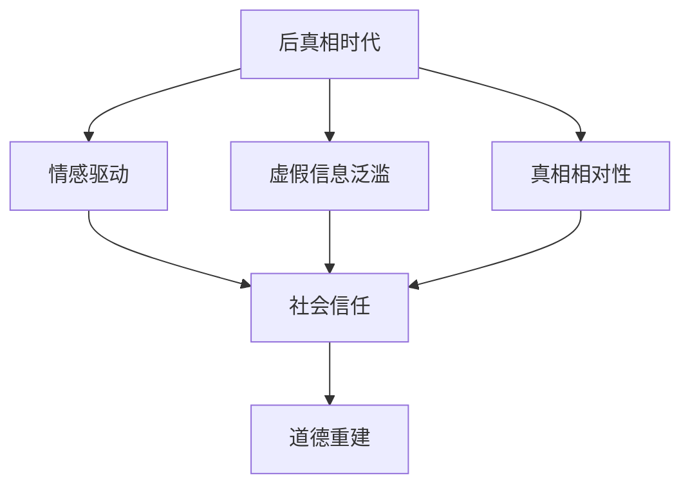

                 

## 引言：后真相时代的道德重建

### 1.1.1 什么是后真相时代

#### 背景介绍

在互联网和社交媒体迅猛发展的时代，信息的传播方式发生了翻天覆地的变化。传统媒体逐渐被去中心化的网络平台所取代，信息的真实性和可靠性受到了前所未有的挑战。这种现象引发了学术界和公众对于“后真相时代”（Post-Truth Era）的关注和讨论。

#### 后真相时代的特征

后真相时代具有以下主要特征：

- **情感驱动**：在信息传播过程中，情感因素往往超过事实本身，成为影响公众判断的关键因素。
- **虚假信息泛滥**：互联网上的虚假信息和误导性信息层出不穷，真假难辨，严重影响了公众的认知和决策。
- **去中心化传播**：信息不再局限于传统媒体渠道，而是通过社交网络、博客、论坛等去中心化平台快速传播，这使得信息源头更加复杂，监管难度加大。
- **真相的相对性**：在多元化和去中心化的信息环境中，真相变得相对化，不同的群体对于同一事件可能有截然不同的认知和解释。

### 1.1.2 道德重建的必要性

#### 社会道德现状

当前，后真相时代带来的道德问题不容忽视。社会道德的滑坡体现在以下几个方面：

- **信任危机**：公众对媒体和权威机构的信任度下降，社会信任危机加剧。
- **道德相对主义**：在多元文化的冲击下，传统道德观念受到质疑，道德相对主义盛行，导致道德判断的混乱。
- **道德困境**：在信息爆炸的时代，个体在面对复杂的道德问题时，往往感到困惑和无助。

#### 道德重建的目标

道德重建的目的是恢复社会的道德秩序，提高公众的道德素养，具体目标包括：

- **增强社会信任**：通过提高信息的真实性和透明度，重建公众对媒体和权威机构的信任。
- **培养道德判断力**：通过教育和引导，培养个体在面对道德困境时进行正确判断的能力。
- **强化道德规范**：制定明确的道德准则，为个体和社会行为提供道德指南。

### 1.1.3 本书结构概述

本书将围绕后真相时代的道德重建展开深入探讨，分为以下几个部分：

- **理论探讨**：介绍道德哲学的演变，阐述道德重建的理论基础。
- **实践分析**：分析社会道德重建的实践案例，总结经验教训。
- **政策建议**：提出政策框架下的道德重建路径，探讨法律与道德的关系。
- **未来展望**：展望道德重建的挑战与机遇，提出长期目标。

通过以上结构的安排，本书旨在为后真相时代的道德重建提供理论支持与实践指导。

### 核心概念与联系

为了更好地理解后真相时代的道德重建，我们需要梳理以下几个核心概念及其相互关系：

- **后真相时代**：指的是信息传播方式从传统媒体向去中心化网络平台转变的时代，情感驱动、虚假信息泛滥、真相相对性是其主要特征。
- **道德重建**：指在社会道德滑坡的背景下，通过教育和引导，恢复社会道德秩序，提高公众道德素养的过程。
- **社会信任**：指公众对媒体、权威机构和其他社会成员的信任度，是社会稳定和发展的基础。

这些概念之间的关系可以用以下Mermaid流程图表示：

### 文章摘要

本文首先介绍了后真相时代的定义及其特征，包括情感驱动、虚假信息泛滥和真相相对性。接着，分析了道德重建的必要性，包括当前社会的道德滑坡现象和道德重建的目标。最后，概述了本书的结构和核心内容，为后续章节的讨论奠定了基础。

---

**作者信息**

- 作者：AI天才研究院/AI Genius Institute & 禅与计算机程序设计艺术 /Zen And The Art of Computer Programming****

