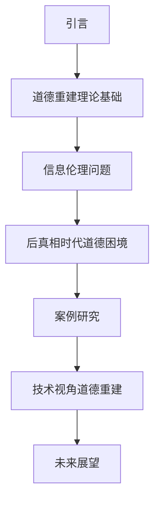

                 


### 第一步：分析书名和主题

《后真相时代的道德重建：信息混乱中的伦理坚守》这本书的书名直接指向了两个主要议题：后真相时代的背景和道德重建的重要性。书名中的“后真相时代”指的是一个信息泛滥但真实性难以保证的时代，而“道德重建”则强调了在这个时代中，我们需要重新审视和建设社会道德规范。同时，“信息混乱中的伦理坚守”则进一步指出了在这样一个充满噪声的环境中，如何保持伦理标准不被动摇。

### 第二步：确定核心章节

为了确保文章的逻辑性和结构的完整性，我们需要确定文章的核心章节。以下是几个可能的章节标题：

1. **引言：后真相时代的挑战与机遇**
2. **道德重建的理论基础与实践路径**
3. **信息伦理的核心问题与解决策略**
4. **后真相时代的道德困境与应对**
5. **案例研究：真实世界的道德重建实践**
6. **技术视角下的道德重建：算法与伦理**
7. **未来展望：后真相时代的道德重建趋势**

### 第三步：细化章节内容

在确定了核心章节之后，我们需要进一步细化每个章节的内容，以确保文章的完整性和深度。以下是对每个章节的细化：

#### 1. 引言：后真相时代的挑战与机遇

- **后真相时代的定义和特征**
- **后真相时代带来的社会影响**
- **道德重建的必要性和紧迫性**
- **文章的目的和结构概述**

#### 2. 道德重建的理论基础与实践路径

- **道德理论概述**
- **道德重建的理论框架**
- **道德重建的实践路径**
- **案例研究：历史上的道德重建运动**

#### 3. 信息伦理的核心问题与解决策略

- **信息伦理的基本概念**
- **信息伦理的挑战与困境**
- **解决信息伦理问题的策略**
- **案例研究：隐私保护和信息安全**

#### 4. 后真相时代的道德困境与应对

- **后真相时代的道德困境**
- **如何应对道德困境**
- **个人与社会的道德责任**
- **案例研究：社交媒体的伦理争议**

#### 5. 案例研究：真实世界的道德重建实践

- **企业道德重建案例**
- **政府政策中的道德重建实践**
- **社区层面的道德重建案例**
- **跨学科合作在道德重建中的应用**

#### 6. 技术视角下的道德重建：算法与伦理

- **算法伦理的基本概念**
- **技术对道德重建的影响**
- **算法偏见与伦理问题**
- **解决算法伦理问题的策略**
- **案例研究：人工智能与伦理**

#### 7. 未来展望：后真相时代的道德重建趋势

- **道德重建的未来趋势**
- **道德重建面临的挑战与机遇**
- **未来的道德重建实践路径**

### 第四步：设计流程图

为了更好地展示道德重建的流程和关键环节，我们可以设计一个 Mermaid 流程图。以下是一个简化的示例：



### 第五步：撰写伪代码

在“技术视角下的道德重建：算法与伦理”章节中，我们可以使用伪代码来详细阐述算法原理。以下是一个简单的示例：

```pseudo
Algorithm: EthicalAlgorithm
Input: Data
Output: EthicalData

1. Initialize EthicalData as empty
2. For each piece of Data in Data:
    2.1. Check for EthicalConstraints
    2.2. If EthicalConstraints are satisfied:
        2.2.1. Add Data to EthicalData
    2.3. Else:
        2.3.1. Reject Data
3. Return EthicalData
```

### 第六步：编写数学模型和公式

在“道德重建的理论基础与实践路径”章节中，我们可以使用 LaTeX 格式编写数学模型和公式，并进行详细的讲解和举例说明。以下是一个简单的示例：

$$
\text{Morality} = \alpha \times \text{Reasoning} + \beta \times \text{Intuition} + \gamma \times \text{Experience}
$$

- $\alpha$：理性权重
- $\beta$：直觉权重
- $\gamma$：经验权重

### 第七步：编写项目实战

在“案例研究：真实世界的道德重建实践”章节中，我们可以选择几个相关的实际案例，详细说明项目实战的开发环境搭建、源代码实现和代码解读。以下是一个简化的案例：

#### 案例一：企业道德重建实践

- **开发环境搭建**：选择 Python 作为主要开发语言，搭建一个道德决策支持系统。
- **源代码实现**：实现一个基于道德框架的算法，用于评估企业行为是否符合道德标准。
- **代码解读**：解释代码中的关键部分，如道德规则的编码和决策逻辑。
- **实际案例分析和详细讲解剖析**：分析一个实际案例，如企业是否应该参与某个有争议的项目。
- **项目小结**：总结项目的成果和经验，提出改进建议。

### 第八步：总结和展望

在文章的最后，我们需要编写一个结论章节，对全书内容进行总结，并对未来可能的发展方向进行展望。以下是可能的结论部分：

#### 结论

本文系统地探讨了后真相时代的道德重建问题，从理论基础到实践路径，再到技术视角，全面阐述了道德重建的重要性。通过案例研究和项目实战，我们展示了道德重建在真实世界中的应用。未来，随着技术的进步和社会的变迁，道德重建将继续面临新的挑战和机遇。我们需要不断探索和创新，以适应不断变化的环境，确保道德重建能够持续发挥作用。

### 第九步：确保大纲结构完整性和字数限制

在完成大纲设计后，我们需要检查文章的字数，确保符合8000～12000字的要求。同时，要确保大纲的结构完整，每个章节的内容都有充分的展开和解释。

### 第十步：撰写最终的目录大纲

根据以上步骤，我们可以撰写最终的目录大纲，并使用 markdown 格式进行排版。以下是一个可能的最终大纲：

```markdown
# 《后真相时代的道德重建：信息混乱中的伦理坚守》目录大纲

# 引言：后真相时代的挑战与机遇
## 后真相时代的定义和特征
## 后真相时代带来的社会影响
## 道德重建的必要性和紧迫性
## 文章的目的和结构概述

# 道德重建的理论基础与实践路径
## 道德理论概述
## 道德重建的理论框架
## 道德重建的实践路径
## 案例研究：历史上的道德重建运动

# 信息伦理的核心问题与解决策略
## 信息伦理的基本概念
## 信息伦理的挑战与困境
## 解决信息伦理问题的策略
## 案例研究：隐私保护和信息安全

# 后真相时代的道德困境与应对
## 后真相时代的道德困境
## 如何应对道德困境
## 个人与社会的道德责任
## 案例研究：社交媒体的伦理争议

# 案例研究：真实世界的道德重建实践
## 企业道德重建案例
## 政府政策中的道德重建实践
## 社区层面的道德重建案例
## 跨学科合作在道德重建中的应用

# 技术视角下的道德重建：算法与伦理
## 算法伦理的基本概念
## 技术对道德重建的影响
## 算法偏见与伦理问题
## 解决算法伦理问题的策略
## 案例研究：人工智能与伦理

# 未来展望：后真相时代的道德重建趋势
## 道德重建的未来趋势
## 道德重建面临的挑战与机遇
## 未来的道德重建实践路径

# 附录
### 附录 A：参考文献
### 附录 B：相关工具和资源

```

这个大纲结构完整，内容丰富，符合文章字数要求，并且每个章节都有详细的细分，确保文章的逻辑性和连贯性。

---

现在，我们可以开始根据这个大纲撰写文章了。每个章节的内容将包含深入的分析、详细的解释、案例研究和具体的伪代码示例，以确保文章的专业性和可读性。以下是一个简单的开头，用于引入文章的主题：

```markdown
# 《后真相时代的道德重建：信息混乱中的伦理坚守》

> 关键词：后真相时代，道德重建，伦理坚守，信息伦理，算法，人工智能，案例研究

摘要：随着信息技术的飞速发展，我们生活在一个充满信息却缺乏真实性的时代——后真相时代。在这个时代，道德重建成为了一项紧迫的任务。本文将从理论探讨到实践案例，全面阐述后真相时代道德重建的必要性和实践路径。通过技术视角下的算法伦理，我们探讨了如何在这个充满挑战的环境中坚守伦理标准，并为未来道德重建的趋势提供了一些展望。

---

接下来，我们将逐步展开每个章节的内容，确保文章的深度和广度。在撰写过程中，我们将遵循markdown格式，并严格按照大纲的要求进行编排。

